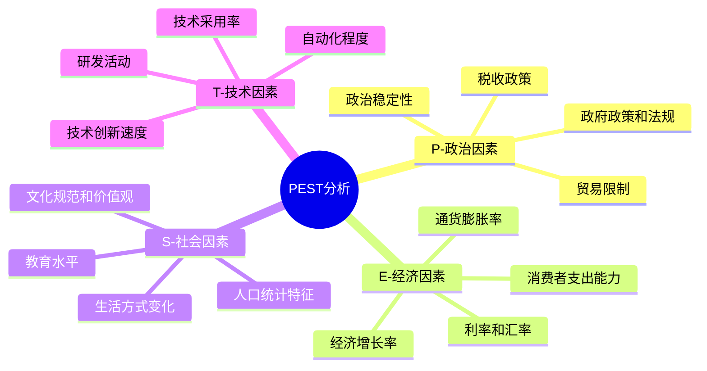
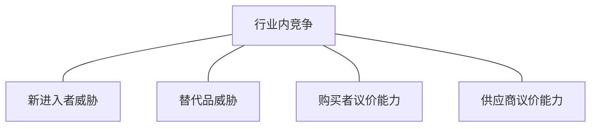
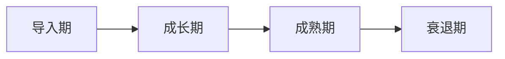
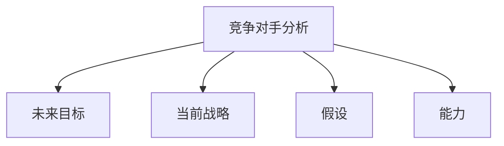
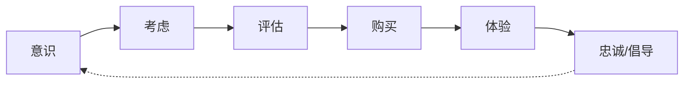
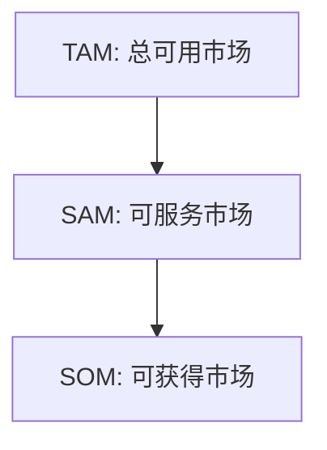
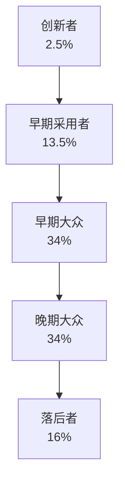

---
{"dg-publish":true,"tags":["商业分析","市场分析","复习"],"created":"2024-05-11","permalink":"/知识共享/002_商业分析/02_笔记/03_复习笔记/市场分析框架复习/","dgPassFrontmatter":true}
---

> [!quote] 概述
> 本笔记整理了市场分析的主要框架、方法和工具，帮助系统回顾和复习市场分析的核心概念。适合快速检验学习成果和考前复习。

## 一、市场分析基础概念

### 市场分析定义与目的
- **市场分析**：系统收集、记录和分析与特定市场相关的数据和信息的过程，包括市场规模、增长率、趋势、竞争格局和消费者行为等方面。
- **核心目的**：
  - 识别市场机会和威胁
  - 了解消费者需求和偏好
  - 评估竞争态势
  - 支持战略决策和规划
  - 降低业务风险

### 市场分析的范围
1. **行业分析**：行业结构、发展阶段、增长潜力
2. **竞争分析**：竞争格局、主要竞争对手、竞争策略
3. **消费者分析**：目标客户、购买行为、需求偏好
4. **产品分析**：产品生命周期、差异化特征、定位
5. **渠道分析**：分销渠道、渠道效率、覆盖范围
6. **价格分析**：定价策略、价格弹性、价格趋势

### 市场分析的价值
- 提供战略方向指导
- 发现新的市场机会
- 减少决策不确定性
- 优化营销资源分配
- 提高产品开发的成功率
- 增强竞争优势

## 二、宏观环境分析框架

### PEST分析
- **政治因素(Political)**：政府政策、法规、政治稳定性
- **经济因素(Economic)**：经济增长、通货膨胀、利率、汇率
- **社会因素(Social)**：人口统计、文化趋势、生活方式变化
- **技术因素(Technological)**：技术创新、研发、自动化

### PESTEL分析（PEST扩展）
- PEST基础上增加了：
  - **环境因素(Environmental)**：气候变化、环保法规、可持续发展
  - **法律因素(Legal)**：劳动法、消费者法、健康安全法规

### STEEP分析
- PEST基础上将社会因素细分为：
  - **社会因素(Social)**
  - **技术因素(Technological)**
  - **经济因素(Economic)**
  - **环境因素(Environmental)**
  - **政治因素(Political)**

### 宏观环境分析应用步骤
1. **确定分析范围**：明确需要研究的市场或行业
2. **识别关键因素**：确定每个类别中的主要影响因素
3. **收集相关数据**：从可靠来源获取信息
4. **评估影响程度**：分析各因素对业务的影响大小
5. **识别机会和威胁**：将分析结果转化为战略洞察
6. **制定响应策略**：开发应对环境变化的策略

## 三、行业分析框架

### 波特五力模型
- **供应商议价能力**：评估供应商对行业的影响力
- **购买者议价能力**：评估客户对行业的影响力
- **替代品威胁**：评估替代产品或服务的威胁
- **新进入者威胁**：评估新竞争者进入市场的难度
- **行业内竞争**：评估现有竞争对手之间的竞争程度

### 战略群组分析
- **定义**：识别行业内采用相似战略的企业群组
- **关键维度**：
  - 产品多样化程度
  - 地理覆盖范围
  - 价格定位
  - 垂直整合程度
  - 服务水平
  - 分销渠道
- **应用步骤**：
  1. 确定区分企业的关键战略维度
  2. 在二维图上绘制企业位置
  3. 识别战略群组
  4. 分析群组间的流动障碍
  5. 预测未来变化趋势

### 行业生命周期分析
- **导入期**：低销售额、高成本、负利润、少数先行者
- **成长期**：快速增长、成本下降、利润上升、更多竞争者
- **成熟期**：稳定增长、规模经济、稳定利润、竞争激烈
- **衰退期**：需求下降、过剩产能、利润下滑、市场整合

### 行业价值链分析
- **初级活动**：
  - 入库物流
  - 生产运营
  - 出库物流
  - 市场营销
  - 售后服务
- **支持活动**：
  - 企业基础设施
  - 人力资源管理
  - 技术开发
  - 采购

## 四、竞争分析框架

### 竞争者分析框架
- **竞争者识别**：
  - 直接竞争者
  - 间接竞争者
  - 潜在竞争者
- **竞争者剖析**：
  - 目标和战略
  - 资源和能力
  - 假设和心智模式
  - 当前策略和绩效
- **竞争格局地图**：
  - 基于关键成功因素的竞争者定位
  - 战略空间和蓝海识别

### 四角分析法
- **未来目标**：了解竞争对手的长期目标和动机
- **当前战略**：分析竞争对手目前的市场策略
- **假设**：识别竞争对手对自身、行业和其他公司的假设
- **能力**：评估竞争对手的优势和劣势

### 竞争情报收集方法
1. **公开信息来源**：
   - 年报和财务报表
   - 新闻和媒体报道
   - 行业报告和分析
   - 产品手册和营销材料
   - 公司网站和社交媒体
2. **专业情报来源**：
   - 行业展会和会议
   - 行业协会和组织
   - 专家访谈和意见
   - 竞争监测服务
3. **内部情报来源**：
   - 销售团队反馈
   - 客户反馈和采访
   - 前雇员见解
   - 供应商和渠道伙伴信息

### 竞争基准测试
- **对标流程**：
  1. 确定需要基准测试的领域
  2. 识别标杆企业
  3. 收集相关数据
  4. 分析绩效差距
  5. 制定改进计划
- **常见对标领域**：
  - 产品质量和性能
  - 服务交付效率
  - 运营成本和效率
  - 创新速度和有效性
  - 客户满意度和忠诚度

## 五、消费者市场分析

### 市场细分框架
- **地理细分**：地区、城市规模、气候、人口密度
- **人口统计细分**：年龄、性别、收入、职业、教育
- **心理图谱细分**：生活方式、价值观、个性、态度
- **行为细分**：使用场合、寻求利益、使用频率、忠诚度

### 客户旅程分析
- **旅程阶段**：
  1. **意识**：客户识别需求或问题
  2. **考虑**：研究潜在解决方案
  3. **评估**：比较不同选择
  4. **购买**：做出购买决定
  5. **体验**：使用产品或服务
  6. **忠诚/倡导**：重复购买和推荐
- **分析要素**：
  - 每个阶段的客户需求和期望
  - 接触点和互动渠道
  - 客户情感体验
  - 痛点和摩擦点
  - 改进机会

### 消费者行为研究方法
1. **定量研究**：
   - 问卷调查
   - 消费者面板数据
   - 销售数据分析
   - A/B测试
2. **定性研究**：
   - 深度访谈
   - 焦点小组
   - 观察研究
   - 民族志研究
3. **混合方法**：
   - 结合定量和定性方法
   - 三角测量验证
   - 多阶段研究设计

### 消费者购买决策模型
- **AIDA模型**：注意(Attention)、兴趣(Interest)、欲望(Desire)、行动(Action)
- **五阶段决策模型**：
  1. 问题识别
  2. 信息搜集
  3. 方案评估
  4. 购买决策
  5. 购后行为
- **影响因素**：
  - 文化因素
  - 社会因素
  - 个人因素
  - 心理因素

## 六、定位与差异化分析

### 价值主张画布
- **顾客工作**：顾客试图完成的任务或解决的问题
- **顾客痛点**：顾客在工作中遇到的困难和挑战
- **顾客收益**：顾客期望和渴望的好处和成果
- **产品和服务**：提供给顾客的具体产品和服务
- **痛点缓解物**：如何缓解顾客痛点
- **收益创造物**：如何创造顾客收益

### 定位图分析
- **定义**：基于关键因素将品牌在消费者心智中定位的视觉化工具
- **关键步骤**：
  1. 确定关键购买决策因素
  2. 绘制二维定位图
  3. 标注主要竞争者位置
  4. 识别市场空白和机会
  5. 确定理想定位策略
- **常用定位维度**：
  - 价格vs质量
  - 价格vs功能
  - 现代性vs传统
  - 全球性vs本土化
  - 专业vs通用

### 感知图谱分析
- **用途**：了解客户如何感知不同品牌和产品
- **构建步骤**：
  1. 确定品牌和竞争对手
  2. 识别关键属性和特征
  3. 收集消费者评价数据
  4. 绘制多维感知图
  5. 分析品牌定位差异
  6. 确定改进机会

### 差异化战略分析
- **差异化维度**：
  - 产品特性和性能
  - 服务质量和支持
  - 品牌形象和声誉
  - 分销渠道和可及性
  - 创新和技术领先
  - 客户关系和体验
- **差异化效果评估**：
  - 独特性
  - 相关性
  - 可信度
  - 可传播性
  - 可持续性
  - 可获利性

## 七、市场机会评估

### 市场吸引力-竞争力矩阵
- **市场吸引力因素**：
  - 市场规模和增长率
  - 盈利潜力
  - 竞争强度
  - 行业生命周期阶段
  - 进入壁垒
- **企业竞争力因素**：
  - 市场份额
  - 产品/服务优势
  - 成本结构
  - 技术能力
  - 分销实力
- **策略含义**：
  - 高吸引力/高竞争力：投资成长
  - 高吸引力/低竞争力：选择性发展
  - 低吸引力/高竞争力：保持收获
  - 低吸引力/低竞争力：撤出或变现

### 市场进入策略分析
- **进入模式**：
  - 自主开发
  - 收购现有企业
  - 战略联盟和合作
  - 特许经营
  - 出口或授权
- **进入时机**：
  - 先行者策略
  - 快速跟随者策略
  - 后期进入者策略
- **进入规模**：
  - 全面进入
  - 利基市场进入
  - 阶段性扩展

### 市场规模估算框架
- **自上而下法**：
  - 总体市场规模
  - 细分市场份额
  - 可获得市场比例
- **自下而上法**：
  - 潜在客户数量
  - 购买频率
  - 平均交易价值
- **价值链法**：
  - 分析价值链各环节规模
  - 汇总得出总市场规模
- **类比法**：
  - 基于已知市场推算未知市场

### TAM-SAM-SOM框架
- **总可用市场(TAM)**：产品或服务可能适用的全部市场规模
- **可服务市场(SAM)**：企业业务模式和分销渠道能够覆盖的市场部分
- **可获得市场(SOM)**：企业短期内实际目标的市场份额

## 八、市场预测与趋势分析

### 市场预测方法
1. **定性预测**：
   - 专家意见
   - 德尔菲法
   - 情景规划
   - 消费者调查
2. **定量预测**：
   - 时间序列分析
   - 回归分析
   - 扩散模型
   - 经济计量模型
3. **混合预测**：
   - 结合定性和定量方法
   - 多方法三角测量

### 趋势识别与分析框架
- **趋势层次**：
  - 宏观趋势：长期社会、经济、技术变化
  - 行业趋势：特定行业发展方向
  - 消费趋势：消费者行为和偏好变化
  - 产品趋势：产品特性和功能演变
- **趋势分析步骤**：
  1. 信号收集和筛选
  2. 模式识别和分类
  3. 趋势确认和验证
  4. 影响评估和情景构建
  5. 战略响应制定

### 创新扩散模型
- **创新采用者类型**：
  - 创新者(2.5%)
  - 早期采用者(13.5%)
  - 早期大众(34%)
  - 晚期大众(34%)
  - 落后者(16%)
- **扩散S曲线**
- **扩散影响因素**：
  - 相对优势
  - 相容性
  - 复杂性
  - 可试用性
  - 可观察性

### 前瞻性市场情报
- **来源**：
  - 技术路线图
  - 专利分析
  - 初创企业生态系统
  - 风险投资流向
  - 学术研究方向
- **分析方法**：
  - 边缘检测：从边缘发现创新信号
  - 交叉点分析：技术和行业交叉点
  - 异常值分析：偏离常态的创新和变化
  - 周期性分析：识别和预测周期性模式

## 九、市场调研设计与执行

### 市场调研流程
1. **定义研究问题**：明确研究目标和问题
2. **设计研究方法**：确定数据收集方法
3. **设计采样计划**：确定目标人群和抽样方法
4. **开发研究工具**：问卷、访谈指南等
5. **收集数据**：实施调研计划
6. **分析数据**：处理和解释数据
7. **报告发现**：整理和呈现研究结果

### 调研方法选择框架
- **探索性研究**：当问题不明确或需要生成假设时
  - 深度访谈
  - 焦点小组
  - 文献综述
  - 案例研究
- **描述性研究**：当需要描述市场特征和现象时
  - 问卷调查
  - 观察研究
  - 面板研究
- **因果性研究**：当需要确定因果关系时
  - 实验研究
  - 准实验设计
  - 纵向研究

### 有效问卷设计原则
- **结构设计**：
  - 清晰的引言和指导
  - 从简单到复杂的问题排序
  - 逻辑分组和过渡
  - 适当的问卷长度
- **问题设计**：
  - 简洁明了的表述
  - 避免引导性问题
  - 避免双重否定
  - 避免含糊不清的术语
  - 只问一个概念
- **答案选项设计**：
  - 互斥且完整的选项
  - 平衡的评分尺度
  - 适当的细分程度
  - 考虑"不知道"选项

### 采样技术与样本量确定
- **概率抽样**：
  - 简单随机抽样
  - 系统抽样
  - 分层抽样
  - 聚类抽样
- **非概率抽样**：
  - 便利抽样
  - 判断抽样
  - 配额抽样
  - 滚雪球抽样
- **样本量确定因素**：
  - 置信水平
  - 误差容忍度
  - 总体标准差
  - 总体规模

## 十、市场分析报告与决策支持

### 市场分析报告结构
- **执行摘要**：关键发现和建议概述
- **研究背景**：研究目的和问题定义
- **研究方法**：数据收集和分析方法
- **主要发现**：市场规模、趋势、消费者洞察等
- **竞争分析**：主要竞争对手和竞争态势
- **机会与挑战**：市场机会和潜在风险
- **战略建议**：基于发现的行动建议
- **附录**：详细数据和方法补充说明

### 决策支持工具
- **决策矩阵**：基于加权标准评估备选方案
- **情景规划**：预测多种可能的未来情景
- **敏感性分析**：测试不同假设对结果的影响
- **决策树**：映射决策路径和可能结果
- **战略地图**：可视化战略目标和因果关系

### 有效数据可视化原则
- **目的驱动**：明确可视化的目标和用途
- **简明扼要**：去除视觉干扰，突出关键信息
- **适当上下文**：提供必要的背景信息
- **准确一致**：确保数据表示准确且一致
- **视觉层次**：创建视觉重点和信息流
- **色彩策略**：有目的地使用颜色编码信息
- **交互性**：允许用户探索和深入数据

### 市场分析的常见陷阱与避免策略
- **证实偏误**：寻找支持现有观点的证据
  - *避免策略*：主动寻找反面证据，鼓励批判性思考
- **数据过载**：收集过多不必要的数据
  - *避免策略*：聚焦关键问题和指标
- **过度简化**：忽略市场复杂性
  - *避免策略*：采用多角度分析，考虑系统相互作用
- **短期思维**：专注短期市场波动
  - *避免策略*：结合短期和长期分析视角
- **误将相关性当作因果关系**
  - *避免策略*：设计适当的因果研究方法 