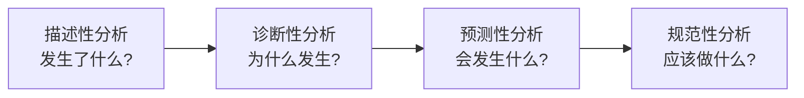
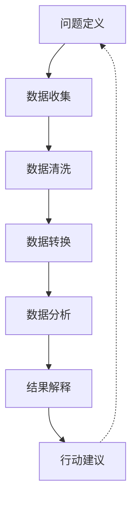

---
{"dg-publish":true,"tags":["商业分析","数据分析","复习"],"created":"2024-05-11","permalink":"/知识共享/002_商业分析/02_笔记/03_复习笔记/数据分析方法复习/","dgPassFrontmatter":true}
---

> [!quote] 概述
> 本笔记整理了商业分析中常用的数据分析方法与技术，帮助系统回顾和复习数据分析的核心概念、流程和工具。适合快速检验学习成果和考前复习。

## 一、数据分析基础

### 数据分析定义与目的
- **数据分析**：通过检查、清洗、转换和建模数据，从中发现有用信息、形成结论并支持决策制定的过程。
- **核心目的**：
  - 发现业务洞察
  - 验证假设
  - 支持决策制定
  - 预测未来趋势
  - 识别业务机会和风险

### 数据分析类型
1. **描述性分析**：描述已经发生的事情
2. **诊断性分析**：解释为什么会发生
3. **预测性分析**：预测可能会发生什么
4. **规范性分析**：提供应该做什么的建议

### 数据分析的价值
- 帮助企业做出更明智的决策
- 优化业务流程和运营效率
- 发现新的商业机会
- 提高客户满意度和保留率
- 降低成本和提高收入

## 二、数据分析流程

### 标准数据分析流程
1. **问题定义**：确定分析目标和关键问题
2. **数据收集**：从多个来源获取相关数据
3. **数据清洗**：处理缺失值、异常值和不一致
4. **数据转换**：重构数据以适应分析需求
5. **数据分析**：应用统计和分析技术
6. **结果解释**：将分析结果转化为业务洞察
7. **行动建议**：提出基于数据的决策建议

### 迭代分析方法
- 敏捷数据分析：小批量、短周期的分析迭代
- 快速原型验证：通过快速分析验证假设
- 持续改进：基于反馈不断调整分析方法和模型

## 三、商业分析中的数据类型

### 按来源划分
- **内部数据**：公司系统和运营生成的数据
- **外部数据**：来自公司外部的市场、行业和竞争数据
- **第一方数据**：直接从客户获取的数据
- **第二方数据**：合作伙伴共享的数据
- **第三方数据**：从外部供应商购买的数据

### 按结构划分
- **结构化数据**：存储在固定字段中的数据（如数据库表）
- **半结构化数据**：具有一定组织但不符合关系数据库标准的数据（如JSON、XML）
- **非结构化数据**：无预定义模型的数据（如文本、图像、视频）

### 按时间特性划分
- **静态数据**：在特定时间点采集的固定数据
- **动态数据**：随时间变化的数据流
- **历史数据**：过去一段时间的数据记录
- **实时数据**：当前正在生成的数据

## 四、数据收集方法

### 主要数据收集方法
1. **问卷调查**：通过结构化问题收集定量和定性数据
2. **访谈**：深入了解特定主题和获取详细信息
3. **观察**：直接观察用户行为和互动模式
4. **焦点小组**：组织小组讨论收集群体反馈
5. **系统日志分析**：分析系统自动记录的用户行为数据
6. **Web抓取**：从网站自动提取数据
7. **API集成**：通过应用程序接口获取第三方数据
8. **传感器数据**：从物联网设备收集环境和行为数据

### 数据采样技术
- **随机抽样**：每个元素有相等的被选择概率
- **分层抽样**：按特定标准将总体分为几个组，从每组中抽样
- **系统抽样**：按固定间隔选择样本
- **聚类抽样**：将总体分为几个自然形成的组，随机选择整组进行调查
- **便利抽样**：选择容易获得的样本

### 数据质量评估
- **准确性**：数据与实际值的一致程度
- **完整性**：数据中缺失值的情况
- **一致性**：不同来源数据的协调程度
- **及时性**：数据的更新频率和最新程度
- **相关性**：数据与分析目标的相关程度
- **可理解性**：数据格式的清晰度和易理解性

## 五、描述性统计分析

### 中心趋势度量
- **平均值**：所有值的算术平均
- **中位数**：按大小排序后的中间值
- **众数**：出现频率最高的值
- **加权平均**：考虑不同权重的平均值

### 离散程度度量
- **范围**：最大值与最小值之差
- **方差**：数据点与平均值差异的平方和的平均值
- **标准差**：方差的平方根，衡量数据分散程度
- **四分位距**：第三四分位数与第一四分位数之差
- **变异系数**：标准差与平均值的比率

### 分布形状度量
- **偏度**：分布对称性的度量
- **峰度**：分布尖峰或平坦程度的度量
- **分位数**：将数据划分为等份的点
- **百分位数**：数据中小于或等于该值的百分比

### 关联性度量
- **相关系数**：衡量两个变量之间线性关系的强度
- **协方差**：衡量两个变量共同变化的程度
- **斯皮尔曼秩相关系数**：衡量排序变量间的相关性

## 六、数据可视化技术

### 数据可视化的目的
- 清晰呈现复杂数据关系
- 识别趋势、模式和异常
- 支持决策和交流见解
- 讲述引人入胜的数据故事

### 常用图表类型及应用
- **条形图/柱状图**：比较不同类别的数量或频率
- **折线图**：显示随时间变化的趋势
- **饼图/环形图**：显示整体中的比例关系
- **散点图**：显示两个变量之间的关系
- **热图**：通过颜色显示数据密度或强度
- **雷达图**：比较多个定量变量
- **盒须图**：显示数据分布、离群值和四分位数
- **地图可视化**：展示地理分布数据
- **树状图/树形图**：显示层次结构数据
- **桑基图**：显示流量和转化数据

### 可视化设计原则
- **简洁清晰**：去除视觉干扰，突出关键信息
- **准确一致**：确保数据表示准确且一致
- **色彩使用**：有目的地使用颜色编码信息
- **比例尺选择**：适当选择比例尺，避免误导
- **标注完整**：提供清晰的标题、轴标签和图例
- **上下文提供**：提供必要的背景信息

## 七、高级分析方法

### 统计分析技术
- **假设检验**：使用样本数据检验关于总体的假设
- **回归分析**：建立变量之间的数学关系模型
- **方差分析(ANOVA)**：比较多个群体平均值之间的差异
- **时间序列分析**：分析随时间变化的数据
- **聚类分析**：将相似对象分组的技术
- **因子分析**：识别变量间关系的潜在因素

### 预测建模技术
- **线性回归**：预测连续型因变量
- **逻辑回归**：预测二分类因变量
- **决策树**：基于规则的分类和预测
- **随机森林**：多个决策树的集成方法
- **神经网络**：模拟人脑结构的学习算法
- **支持向量机**：寻找最佳分隔超平面的分类方法

### 文本和内容分析
- **情感分析**：提取文本中表达的态度和情感
- **主题建模**：识别文本集合中的隐藏主题
- **实体识别**：识别文本中的命名实体（人、地点、组织等）
- **文本分类**：将文本分配到预定义类别
- **文本聚类**：将相似文本分组

## 八、商业智能与仪表板

### 商业智能系统组成
- **数据仓库**：集中存储和管理企业数据
- **ETL流程**：提取、转换和加载数据
- **OLAP系统**：支持复杂分析处理
- **报表工具**：生成标准和自定义报表
- **仪表板**：可视化关键绩效指标
- **数据挖掘**：发现数据中的隐藏模式

### 有效仪表板设计原则
- **针对特定用户**：根据用户需求定制内容和复杂度
- **突出关键指标**：优先显示最重要的KPI
- **提供上下文**：包括历史数据、目标和基准
- **支持钻取**：允许从概述到详细信息的导航
- **整洁设计**：避免视觉混乱，保持一致的设计语言
- **响应式更新**：及时反映最新数据

### 常用商业智能工具
- **Microsoft Power BI**
- **Tableau**
- **QlikView/Qlik Sense**
- **Looker**
- **Domo**
- **Google Data Studio**
- **IBM Cognos Analytics**

## 九、数据驱动决策框架

### 数据驱动决策过程
1. **问题框定**：明确定义需解决的业务问题
2. **假设形成**：提出可能的解释或解决方案
3. **数据需求确定**：识别所需的数据类型和来源
4. **数据收集与分析**：获取数据并应用适当的分析方法
5. **结果解释**：评估分析发现的含义
6. **行动建议**：提出基于数据的具体建议
7. **实施与监控**：执行建议并衡量成果

### 定量与定性数据整合
- **三角测量法**：使用多种方法验证发现
- **混合方法研究**：结合定量和定性方法
- **数据互补**：利用不同类型数据的优势
- **故事与数字结合**：使用叙事增强数据理解

### 常见决策陷阱及避免方法
- **确认偏误**：寻找支持预期的数据
  - *避免方法*：主动寻找反面证据
- **数据过载**：过多信息导致决策困难
  - *避免方法*：聚焦关键指标和数据
- **相关性误认为因果关系**
  - *避免方法*：设计实验验证因果假设
- **小样本偏差**：基于不充分数据做出结论
  - *避免方法*：确保样本具有统计意义
- **基于过时数据决策**
  - *避免方法*：建立数据更新机制

## 十、数据分析的道德与合规

### 数据伦理原则
- **透明度**：清晰说明数据收集和使用方式
- **公平性**：确保分析不会歧视或偏见特定群体
- **问责制**：为数据使用和决策承担责任
- **数据最小化**：仅收集必要的数据
- **安全性**：保护数据免受未授权访问和滥用

### 数据隐私与合规
- **通用数据保护条例(GDPR)**
- **《中华人民共和国个人信息保护法》**
- **《中华人民共和国数据安全法》**
- **行业特定合规要求**（如医疗、金融等）
- **跨境数据传输限制**

### 数据治理框架
- **数据所有权**：明确数据的拥有者和管理者
- **数据质量标准**：建立数据准确性和完整性标准
- **数据安全措施**：实施技术和流程保护数据
- **数据访问控制**：定义谁可以访问哪些数据
- **数据生命周期管理**：从创建到存档和删除

## 十一、数据分析应用案例

### 市场营销分析
- **客户细分**：基于行为和属性划分客户群
- **营销活动效果衡量**：评估不同渠道和消息的ROI
- **客户生命周期价值分析**：预测客户长期价值
- **定价优化**：确定最佳价格点和策略

### 财务分析
- **成本分析**：识别成本驱动因素和优化机会
- **收入预测**：预测未来收入和增长趋势
- **投资回报分析**：评估投资项目的财务回报
- **现金流管理**：优化现金流入和流出

### 运营分析
- **供应链优化**：提高供应链效率和弹性
- **库存管理**：优化库存水平和补货策略
- **质量控制**：识别和减少缺陷和变异
- **流程效率分析**：识别流程瓶颈和改进机会

### 人力资源分析
- **人才招聘和保留**：预测和减少员工流失
- **绩效管理**：分析员工绩效因素
- **培训效果评估**：衡量培训计划的投资回报
- **劳动力规划**：预测未来人才需求

## 十二、数据分析的未来趋势

### 人工智能与机器学习
- **自动化分析**：自动执行数据分析任务
- **预测分析高级应用**：更准确的预测模型
- **自然语言处理**：通过自然语言与数据交互
- **智能决策支持系统**：提供情境感知的建议

### 大数据与实时分析
- **流处理**：实时分析持续数据流
- **边缘分析**：在数据生成点进行分析
- **分布式分析系统**：处理海量数据的架构
- **实时商业智能**：即时更新的分析和洞察

### 数据民主化与自助服务
- **业务用户分析工具**：让非技术人员也能进行分析
- **增强分析**：系统自动建议见解和可视化
- **协作分析平台**：团队共同分析和讨论数据
- **知识管理集成**：将分析与组织知识库连接

### 新兴技术应用
- **区块链在数据验证中的应用**
- **量子计算加速复杂分析**
- **增强现实和虚拟现实数据可视化**
- **声音和对话式分析接口** 