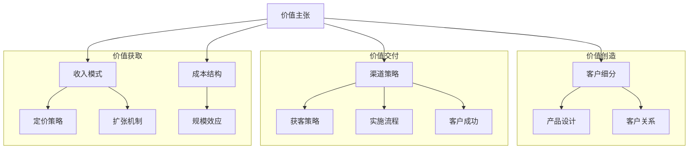

---
{"dg-publish":true,"tags":["商业分析","案例分析","SaaS","商业模式"],"created":"2024-05-18","permalink":"/知识共享/002_商业分析/03_案例/01_行业案例/SaaS企业商业模式分析/","dgPassFrontmatter":true}
---

> [!quote] 概述
> 本案例深入分析软件即服务(SaaS)企业的商业模式演变与创新，探讨SaaS模式如何改变传统软件分发方式并创造可持续的商业价值。案例聚焦行业领先企业的订阅模式设计、客户获取策略、价值交付机制和盈利模式，为理解现代企业软件商业模式提供系统框架。

## 一、SaaS行业发展与商业模式概述

### SaaS模式的历史演进
- **起源期(1999-2005)**: Salesforce等先驱提出"软件即服务"概念，挑战传统软件授权模式
- **成长期(2006-2013)**: 云计算基础设施成熟，SaaS应用类别扩展，商业模式验证
- **爆发期(2014-2019)**: 企业级SaaS广泛接受，垂直行业解决方案兴起
- **整合期(2020至今)**: 平台化趋势明显，SaaS生态系统形成，AI深度融合

### SaaS vs 传统软件商业模式对比
| 维度 | 传统软件模式 | SaaS模式 |
|------|------------|---------|
| 交付方式 | 一次性购买安装 | 在线访问使用 |
| 收费模式 | 大额前期授权费+维护费 | 订阅制(月付/年付) |
| 发布周期 | 大版本间隔长(1-2年) | 持续迭代(周/月更新) |
| 部署模式 | 本地部署+定制 | 多租户云端标准化 |
| 客户关系 | 一次性销售为主 | 持续服务关系 |
| 销售模式 | 企业销售(大客户导向) | 产品导向+复合销售 |
| 价值主张 | 功能全面+定制化 | 易用性+快速实施+低风险 |

### 典型SaaS商业模式框架

### SaaS行业细分与商业模式变体
- **水平SaaS**: 跨行业通用工具(协作、人力资源、财务等)
  - 商业模式特点：标准化程度高，规模效应明显，产品主导增长
  - 代表企业：Slack, Zoom, Dropbox
- **垂直SaaS**: 特定行业解决方案(医疗、教育、零售等)
  - 商业模式特点：行业专业性强，客单价高，解决方案导向
  - 代表企业：Veeva Systems(医药), Toast(餐饮), Procore(建筑)
- **基础设施SaaS**: 开发工具、云服务等底层服务
  - 商业模式特点：技术壁垒高，用量计费普遍，生态系统战略
  - 代表企业：Twilio, MongoDB Atlas, Snowflake

## 二、SaaS关键商业模式要素分析

### 核心价值主张
- **使用成本降低**: 无需大额初始投资，转为可预测的运营支出
- **实施时间缩短**: 快速部署，无需复杂的本地化集成
- **持续创新**: 自动更新确保客户始终使用最新版本
- **可扩展性**: 根据需求弹性调整使用规模
- **专业运维**: 供应商负责安全、性能和可用性

### 客户细分与用户画像
1. **初创企业/中小企业(SMB)**
   - 痛点：IT资源有限，需要快速部署的标准化解决方案
   - 购买决策：关注价格敏感性，自助试用转化，决策周期短
   - 定价策略：简单透明的分级定价，强调性价比
   - 代表产品：Mailchimp, QuickBooks Online

2. **中型企业(Mid-market)**
   - 痛点：需要一定定制能力，但预算有限
   - 购买决策：业务部门+IT共同决策，ROI导向
   - 定价策略：基础版+附加模块，客户成功管理
   - 代表产品：HubSpot, Zendesk

3. **大型企业(Enterprise)**
   - 痛点：复杂需求，合规要求高，跨部门协作
   - 购买决策：多层级审批，安全合规是关键考量
   - 定价策略：企业级协议，专属客户成功团队
   - 代表产品：Workday, ServiceNow

### 收入模式设计
- **基础订阅模式**:
  - 按用户定价：每用户/月固定费用(Slack, Microsoft 365)
  - 按组织定价：整体方案固定费用(HubSpot Marketing Hub)
  - 分级订阅：基础版/专业版/企业版(Zoom, Salesforce)

- **高级收入模式**:
  - 用量计费：按API调用/存储/处理量(Twilio, AWS)
  - 混合模式：基础订阅+超额使用费(Snowflake)
  - 交易抽成：平台型SaaS的交易佣金(Shopify, Stripe)
  - 附加服务：实施服务/咨询/培训费用(ServiceNow)

- **价格策略创新**:
  - 价值定价：基于创造价值比例收费
  - 结果定价：基于成果或业绩提成
  - 增长型定价：随客户规模扩大而调整

### 客户获取与转化
1. **产品导向增长(PLG)**
   - 免费增值模式：免费基础功能，付费高级功能(Slack, Zoom)
   - 产品试用：时间限制试用转正式客户(Adobe Creative Cloud)
   - 自然扩散：用户推荐和网络效应(Dropbox, Calendly)

2. **销售导向增长(SLG)**
   - 内部销售团队：远程销售+演示(高效率、低客单价)
   - 企业销售团队：面对面销售(高客单价、复杂销售)
   - 渠道合作伙伴：通过集成商/顾问扩大覆盖

3. **获客渠道组合**
   - 内容营销：SEO优化的行业内容、案例研究
   - 社区建设：用户论坛、开发者社区、线上活动
   - 付费获客：SEM、社交媒体广告、再营销
   - 合作伙伴：API集成、应用市场、生态系统

### 客户成功与留存
- **客户旅程管理**:
  - 入职流程：快速实现价值的引导式体验
  - 采用促进：使用数据监控和干预提高活跃度
  - 扩展使用：识别追加销售和交叉销售机会
  - 续约管理：基于价值证明的主动续约流程

- **留存策略体系**:
  - 产品粘性：关键功能嵌入工作流，数据积累价值
  - 服务分层：客户成功团队服务等级与客户价值匹配
  - 健康评分：预测性客户健康度监控系统
  - 价值实现：定期业务回顾和ROI证明

### 成本结构与单位经济性
- **关键成本组成**:
  - 研发成本：产品开发和技术创新(20-30%)
  - 云基础设施：服务托管和运营(15-25%)
  - 销售与营销：客户获取成本(40-50%)
  - 客户成功：实施与支持(10-15%)

- **规模经济来源**:
  - 多租户架构：共享基础设施降低边际成本
  - 自动化运维：减少人工干预成本
  - 标准化实施：可复制的客户启用流程
  - 产品销售协同：现有客户扩展销售成本低

- **单位经济指标**:
  - 客户获取成本(CAC)：获取新客户的总成本
  - 客户生命周期价值(LTV)：客户预期贡献的收入
  - LTV/CAC比率：理想值>3，健康的SaaS通常>4
  - 回收期：收回CAC所需月数，理想<12个月

## 三、案例分析：SaaS领军企业商业模式解析

### 案例一：Salesforce - CRM云服务的商业模式创新
- **背景概况**:
  - 成立于1999年，最早的纯SaaS先驱之一
  - 以"软件终结"(End of Software)为口号挑战传统模式
  - 发展为多云平台，年收入超260亿美元

- **商业模式创新点**:
  1. **多层级产品策略**:
     - 基础版满足中小企业需求
     - 专业版针对中型组织
     - 企业版锁定大客户市场
     - 行业云针对特定垂直领域

  2. **生态系统战略**:
     - AppExchange应用市场(6000+应用)
     - 开发者平台吸引第三方创新
     - 合作伙伴认证体系建立壁垒
     - 战略收购补充产品阵容(Slack, Tableau等)

  3. **从销售转向平台**:
     - 初期：CRM销售云单一产品
     - 中期：多云扩展(销售、服务、营销)
     - 现在：平台战略(Lightning Platform, Einstein AI)

- **关键成功因素**:
  - 愿景先行："No Software"明确定位
  - 持续创新："三次发布/年"的快速迭代
  - 关系管理：从销售到客户成功的转变
  - 规模经济：多租户架构的成本优势

### 案例二：Zoom - 基于产品主导增长的SaaS突围
- **背景概况**:
  - 2011年成立，在WebEx等老牌玩家主导市场中突围
  - 以用户体验为核心差异化产品
  - 2020年疫情期间爆发性增长

- **商业模式创新点**:
  1. **产品导向增长(PLG)策略**:
     - 免费版本作为主要获客渠道
     - 40分钟限制作为自然转化触发点
     - 简单易用的用户界面降低采用门槛
     - 跨平台一致体验提升用户满意度

  2. **混合销售模式**:
     - 自助注册+内部销售团队(针对中小企业)
     - 企业销售团队(针对大型组织)
     - 基于用量和使用行为的智能升级提示

  3. **网络效应机制**:
     - 会议发起者邀请参与者的自然扩散
     - 跨组织协作创造的引导转化
     - "见面即体验产品"的天然营销

- **关键成功因素**:
  - 产品体验优先：视频质量和稳定性
  - 简单透明定价：易于理解的用户计费
  - 快速响应市场：疫情期间迅速扩容
  - 产品与销售平衡：产品驱动增长与企业销售结合

### 案例三：Shopify - 平台型SaaS的生态系统价值获取
- **背景概况**:
  - 2006年成立，从自建电商网站转型为SaaS平台
  - 为中小商家提供一站式电商解决方案
  - 发展为支持200万+商家的商业基础设施

- **商业模式创新点**:
  1. **多元收入流**:
     - 订阅收入：基础平台使用费(29-299美元/月)
     - 交易收入：支付处理费(1.5-2.9%+固定费)
     - 增值服务：履单、贷款、海外销售等
     - 应用生态：应用商店分成收入

  2. **商家成长路径设计**:
     - 初创商家：简单易用的基础版本
     - 成长商家：可扩展的中端方案
     - 成熟商家：企业级高度定制方案
     - 全流程工具：从商品到营销到支付的闭环

  3. **平台经济与网络效应**:
     - 开发者生态：7000+应用扩展功能
     - 专家网络：设计师、开发者、营销专家
     - 履单网络：与物流服务商深度集成
     - 支付网络：Shopify Payments降低摩擦

- **关键成功因素**:
  - 商家利益对齐：商家成功即平台成功
  - 生态系统思维：构建完整商业基础设施
  - 价值链整合：从前端到后端的全流程优化
  - 扩展性战略：核心+插件的灵活架构

## 四、SaaS商业模式演进趋势

### 从产品到平台的转变
- **单一应用阶段**:
  - 专注解决单一业务问题
  - 功能驱动的产品开发
  - 简单订阅定价模式
  - 例如：早期的Dropbox、Evernote

- **集成套件阶段**:
  - 相关功能组合成套件
  - 交叉销售和功能协同
  - 捆绑定价策略
  - 例如：HubSpot的营销、销售、服务套件

- **平台生态阶段**:
  - 核心功能+开放API+应用市场
  - 生态系统合作伙伴创造附加价值
  - 平台增值抽成模式
  - 例如：Salesforce AppExchange、Atlassian Marketplace

### 盈利模式创新
1. **数据变现模式**:
   - 聚合行业数据提供市场洞察
   - 匿名化数据用于AI训练
   - 基准比较和行业标准设定
   - 例如：iCIMS的招聘市场数据、Coupa的支出数据

2. **成果导向定价**:
   - 从"使用软件"到"实现结果"
   - 基于可量化业务成果的分成
   - 对齐供应商与客户成功
   - 例如：某些营销SaaS按照获取的潜在客户收费

3. **混合收入模式**:
   - 基础订阅+交易型收入
   - 软件+金融服务的结合
   - 垂直整合价值链
   - 例如：Toast为餐厅提供POS系统+支付处理

### SaaS 2.0模式特征
- **AI驱动的SaaS**:
  - 从静态工具到智能顾问
  - 预测性分析增强决策
  - 自动化重复任务
  - 例如：Salesforce Einstein、Zendesk Answer Bot

- **垂直SaaS整合**:
  - 深度行业专业化
  - 端到端业务流程覆盖
  - 行业特定数据模型
  - 例如：Veeva Systems(生命科学)、nCino(银行业)

- **混合交付模型**:
  - 云端+本地部署的混合模式
  - 弹性扩展与数据主权平衡
  - 适应不同合规要求
  - 例如：Microsoft Azure Stack、AWS Outposts

## 五、SaaS商业模式设计框架

### SaaS商业模式画布
| 关键要素 | 核心问题 | 设计选项 |
|---------|--------|---------|
| 价值主张 | 解决什么关键问题？ | 效率/成本/便捷/创新/风险降低 |
| 客户细分 | 谁是目标客户？ | 企业规模/垂直行业/用户角色 |
| 收入模式 | 如何获取价值？ | 订阅/用量/交易/服务/混合 |
| 定价策略 | 如何设定价格层级？ | 用户计费/价值计费/分级设定 |
| 成本结构 | 关键成本是什么？ | 开发/基础设施/销售/客户成功 |
| 分销渠道 | 如何触达客户？ | 直销/内部销售/渠道/自助 |
| 客户获取 | 如何高效获客？ | 产品引导/内容营销/社区/广告 |
| 增长引擎 | 如何实现规模？ | 病毒/付费/内容/生态系统 |
| 留存机制 | 如何保持客户？ | 产品粘性/客户成功/价值实现 |
| 扩张路径 | 如何扩大业务？ | 上市场/上客户/上产品/上地域 |

### SaaS商业模式设计流程
1. **市场机会评估**:
   - 目标问题严重程度评估
   - 现有解决方案分析
   - 市场规模和增长潜力
   - 进入时机判断

2. **价值主张设计**:
   - 关键问题澄清
   - 解决方案差异化
   - 价值量化框架
   - 最小可行产品定义

3. **收入模式设计**:
   - 客户支付意愿研究
   - 价格敏感度测试
   - 分层功能规划
   - 长期收入战略

4. **增长策略设计**:
   - 获客渠道优先级
   - 客户旅程映射
   - 转化漏斗设计
   - 扩张路径规划

5. **单位经济模型**:
   - CAC与获客效率
   - 收入留存与增长
   - LTV计算与预测
   - 盈利能力分析

### SaaS商业模式评估标准
- **客户标准**:
  - 问题解决力度：解决方案与痛点匹配度
  - 采用摩擦：实施和使用的简易程度
  - 切换成本：产品嵌入工作流程的深度
  - 替代选择：相对竞争优势的持续性

- **市场标准**:
  - 市场规模：目标市场的实际可服务规模
  - 增长空间：市场扩展和渗透潜力
  - 竞争强度：市场竞争格局和差异化空间
  - 进入壁垒：对新进入者的防御能力

- **财务标准**:
  - 毛利率：理想>70%
  - LTV/CAC比率：理想>3
  - 收入增长率：行业标准30-50%
  - 年度经常性收入(ARR)：可预测收入基础
  - CAC回收期：理想<12个月

## 六、SaaS商业模式挑战与风险

### 主要业务挑战
1. **增长瓶颈**:
   - 早期：产品市场契合验证
   - 中期：从早期采用者到主流市场跨越
   - 晚期：市场饱和后的持续增长

2. **财务挑战**:
   - 前期投入大，收入确认延迟
   - 现金流压力与资本需求
   - 维持高增长与盈利平衡

3. **产品挑战**:
   - 功能膨胀与用户体验平衡
   - 通用性与定制化需求矛盾
   - 技术债务管理与创新速度

4. **组织挑战**:
   - 从创始团队到规模化组织
   - 产品、工程与销售协同
   - 企业文化维护与人才保留

### 潜在风险因素
- **市场风险**:
  - 大型科技巨头进入同领域
  - 开源替代品出现
  - 市场趋势变化导致需求萎缩

- **技术风险**:
  - 安全漏洞和数据泄露
  - 服务可靠性和可用性挑战
  - 关键技术变革带来的重建需求

- **运营风险**:
  - 高客户集中度导致依赖
  - 客户获取成本上升
  - 续约率下降威胁收入基础

- **监管风险**:
  - 数据隐私法规的变化
  - 行业合规要求提高
  - 跨国业务中的法律差异

### 缓解风险的策略
1. **产品策略**:
   - 持续创新维持领先优势
   - 构建产品护城河(数据、集成、生态)
   - 扩展产品线降低单一产品风险

2. **财务策略**:
   - 多元收入流创造韧性
   - 单位经济系统监控
   - 资本效率与现金流管理

3. **市场策略**:
   - 深耕垂直领域建立专业壁垒
   - 客户多样化避免高度依赖
   - 构建社区和品牌忠诚度

4. **技术策略**:
   - 安全优先的开发文化
   - 模块化架构适应技术变革
   - 自动化和智能化降低运营风险

## 七、SaaS创业实践指导

### SaaS创业阶段与关键里程碑
- **概念验证阶段(0-$1M ARR)**:
  - 产品市场契合验证
  - 初始客户成功案例
  - 可重复的销售流程雏形
  - 目标：证明解决方案价值

- **早期增长阶段($1M-$10M ARR)**:
  - 销售模式验证
  - 客户成功体系建立
  - 产品路线图清晰
  - 目标：建立可扩展增长引擎

- **规模扩张阶段($10M-$50M ARR)**:
  - 组织规模化能力
  - 多市场/产品线拓展
  - 单位经济优化
  - 目标：构建可预测的增长机器

- **成熟阶段($50M+ ARR)**:
  - 持续创新与市场领导
  - 国际化扩张
  - 并购整合能力
  - 目标：建立市场主导地位和壁垒

### SaaS创业实践建议
1. **产品策略**:
   - 专注解决特定问题而非功能堆砌
   - 以客户成功为核心设计产品体验
   - 构建数据护城河和网络效应
   - 优先考虑易用性和快速价值实现

2. **上市策略**:
   - 垂直深耕优于水平扩张
   - 利基市场验证后再考虑扩展
   - 产品引导与销售引导相结合
   - 构建分层的客户获取引擎

3. **运营策略**:
   - 建立核心指标看板(北极星指标)
   - 细分客户旅程并持续优化
   - 数据驱动的决策文化
   - 实现销售、产品和客户成功闭环

4. **财务策略**:
   - 理解并优化单位经济学
   - 平衡增长投资与现金效率
   - 建立预测性收入模型
   - 关注净收入留存率(NRR)

### SaaS创业常见误区
1. **产品误区**:
   - 过度功能导致复杂性增加
   - 忽视产品体验与易用性
   - 延迟市场验证造成资源浪费

2. **市场误区**:
   - 目标市场过于宽泛
   - 低估获客成本和销售周期
   - 过早国际化分散资源

3. **运营误区**:
   - 忽视客户成功导致高流失率
   - 过度依赖单一获客渠道
   - 缺乏数据驱动决策系统

4. **财务误区**:
   - 过早追求收入而牺牲单位经济
   - 忽视现金流管理和收入确认
   - 规模扩张时机判断错误

## 八、案例讨论与思考

1. SaaS企业如何在保持产品标准化的同时满足大型企业客户的定制需求？

2. 对于成熟SaaS企业，如何在市场饱和的情况下寻找新的增长点？

3. 垂直SaaS与水平SaaS相比，在商业模式设计上有哪些关键差异？如何选择适合创业的方向？

4. 如何评估SaaS企业中产品引导增长(PLG)与销售引导增长(SLG)策略的适用性？在什么情况下应选择混合策略？

5. 在AI快速发展的背景下，SaaS商业模式将面临哪些机遇与挑战？如何调整商业模式以适应这一趋势？

## 参考资源

1. Bessemer Venture Partners. (2023). "State of the Cloud Report 2023".

2. Gartner. (2023). "Magic Quadrant for Cloud Software as a Service".

3. McKinsey & Company. (2022). "SaaS and the Rule of 40: Keys to the critical value creation metric".

4. Andreessen Horowitz. (2023). "The SaaS Metrics Playbook".

5. David Skok. (2022). "SaaS Metrics 2.0: A Guide to Measuring and Improving What Matters". For Entrepreneurs. 