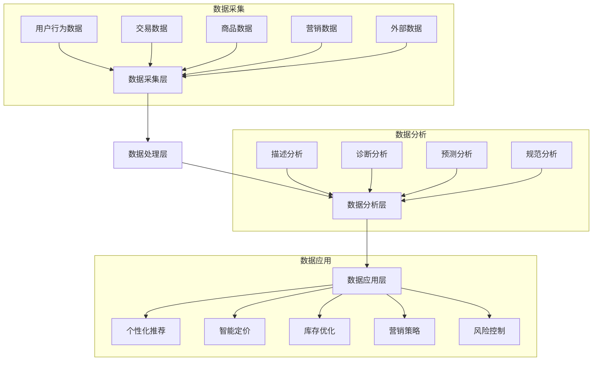

---
{"dg-publish":true,"tags":["商业分析","案例分析","电商","数据分析"],"created":"2024-05-18","permalink":"/知识共享/002_商业分析/03_案例/01_行业案例/电商行业数据分析案例/","dgPassFrontmatter":true}
---

> [!quote] 概述
> 本案例深入分析中国电商行业的数据驱动决策模式，探讨如何通过大数据分析提升用户体验、优化供应链管理并创造商业价值。案例聚焦于主要电商平台的数据应用实践，以及数据分析如何推动电商业务增长和创新。

## 一、行业与企业背景

### 电商行业发展历程
- **萌芽期(1996-2003)**: 中国第一批B2C电商网站出现，如8848、易趣等
- **成长期(2004-2012)**: 淘宝、京东等平台崛起，电子支付系统逐渐完善
- **爆发期(2013-2018)**: 移动电商兴起，社交电商、直播电商等新模式涌现
- **整合期(2019至今)**: 行业整合加剧，线上线下深度融合，全域数据价值凸显

### 电商行业的关键转折点
1. **2008年金融危机**: 推动线上消费快速增长
2. **2014年移动互联网普及**: 电商从PC端转向移动端
3. **2016年直播带货兴起**: 开创新型销售模式
4. **2020年疫情影响**: 加速全社会线上化进程，老年人群体开始广泛接受电商

### 电商行业竞争格局
- **综合电商平台**: 天猫、京东、拼多多等
- **垂直电商**: 唯品会、蘑菇街等
- **跨境电商**: 亚马逊中国、网易考拉等
- **社交电商**: 小红书、抖音等
- **社区团购**: 美团优选、多多买菜等

### 宏观环境分析
- **政策环境**: 电子商务法实施，数据安全法出台
- **经济环境**: 新消费群体崛起，消费升级趋势明显
- **技术环境**: 5G、AI、物联网等技术赋能电商发展
- **社会环境**: 消费者对便捷性、个性化需求增强

## 二、数据分析挑战与方法选择

### 电商行业面临的核心业务挑战
1. **获客成本持续上升**: 流量红利减少，用户争夺激烈
2. **用户需求个性化**: 标准化服务难以满足多元化需求
3. **供应链复杂性增加**: 仓储物流压力增大，配送效率要求提高
4. **平台治理难度加大**: 假货、刷单等问题影响用户信任
5. **数据孤岛问题**: 多渠道数据未打通，影响决策效率

### 数据分析方法选择
- **描述性分析**: 基于历史销售数据的市场表现分析
- **诊断性分析**: 影响销售转化的关键因素分析
- **预测性分析**: 销售预测、需求预测、趋势预测
- **规范性分析**: 个性化推荐、定价优化、库存优化

### 分析方法选择理由
- 电商行业具有**数据量大**、**维度多**的特点，适合多种数据分析方法结合
- 用户行为数据时效性强，需要**实时分析**能力
- 产品种类繁多，需要**机器学习**支持智能决策
- 业务场景复杂，需要**可视化**提升分析可解读性

## 三、数据分析实施过程

### 数据来源与准备
- **平台交易数据**: 订单、支付、退款等核心业务数据
- **用户行为数据**: 浏览、点击、加购、收藏等行为数据
- **商品数据**: 商品属性、价格、库存等信息
- **营销数据**: 广告投放、优惠活动、促销效果数据
- **外部数据**: 行业报告、竞品数据、社交媒体数据

### 数据清洗与处理流程
1. **数据抽取**: 从多源系统提取原始数据
2. **数据清洗**: 处理缺失值、异常值、重复值
3. **数据转换**: 字段标准化、格式统一
4. **数据集成**: 跨系统数据关联与整合
5. **数据聚合**: 按业务维度汇总分析

### 核心分析模型与方法
- **RFM用户分层模型**: 基于购买频率、金额和时间的用户价值分析
- **漏斗转化分析**: 追踪用户从浏览到购买的全流程转化率
- **商品聚类分析**: 基于属性和销售表现的商品分组
- **协同过滤算法**: 基于用户相似性的商品推荐
- **时间序列预测**: 销售趋势和季节性分析

### 可视化图表展示

## 四、核心发现与业务洞察

### 用户行为分析洞察
1. **购买决策路径多元化**: 从传统"搜索-对比-购买"向"社交推荐-直接购买"转变
2. **消费场景碎片化**: 用户购物时间分布更加分散，午休时间和深夜成为活跃高峰
3. **社交影响力增强**: 用户购买决策越来越受KOL和社交圈推荐影响
4. **价格敏感度二极化**: 高端和低价商品增长快于中端商品

### 销售数据分析洞察
1. **长尾效应显著**: 热销商品占比降低，长尾商品贡献增加
2. **季节性特征减弱**: 传统促销季影响力下降，常态化促销成为主流
3. **跨品类购买增加**: 用户单次购买涉及品类数量上升
4. **复购周期缩短**: 日用品和食品类商品复购周期持续缩短

### 运营效率分析洞察
1. **获客成本与用户价值不匹配**: 高获客成本渠道用户留存率较低
2. **营销投入边际效益递减**: 促销力度增加未带来同比例销售增长
3. **物流成本结构变化**: 最后一公里配送成本占比上升
4. **客服问题类型变化**: 从商品问题向物流体验问题转移

### 战略意义
- **精细化运营成为制胜关键**: 数据驱动的精准营销和个性化服务
- **全渠道数据整合势在必行**: 打通线上线下全域数据
- **供应链数字化转型加速**: 从需求预测到智能补货的全流程优化
- **算法驱动的决策机制**: 从经验决策向数据决策转变

## 五、关键决策点分析

### 决策点一：个性化推荐策略优化
- **决策背景**: 传统基于用户标签的推荐准确率不足
- **分析方法**: A/B测试比较不同推荐算法效果
- **决策方案**:
  1. 采用混合推荐策略，结合内容和协同过滤
  2. 引入实时行为数据动态调整推荐结果
  3. 增加场景化推荐维度
- **实施效果**: 点击率提升18%，转化率提升12%
- **替代方案评估**: 纯内容推荐方案效果较差，实时性不足

### 决策点二：库存优化与动态调配
- **决策背景**: 传统固定安全库存导致过库或缺货
- **分析方法**: 时间序列预测 + 多因素回归分析
- **决策方案**:
  1. 基于销售预测的动态安全库存
  2. 区域仓库间智能调拨机制
  3. 热销商品就近仓储策略
- **实施效果**: 库存周转率提升22%，缺货率下降35%
- **替代方案评估**: 集中库存方案降低配送效率，无法满足快速配送需求

### 决策点三：营销资源动态分配
- **决策背景**: 固定营销预算分配效率低下
- **分析方法**: 多变量测试 + ROI分析
- **决策方案**:
  1. 建立基于实时转化的预算调整机制
  2. 不同用户群体差异化投放策略
  3. 实时监控ROI实现闭环优化
- **实施效果**: 营销ROI提升25%，用户获取成本降低15%
- **替代方案评估**: 传统固定预算方案无法适应市场波动

## 六、案例总结与启示

### 关键成功因素
1. **数据战略清晰**: 将数据分析直接服务于业务目标
2. **数据基础扎实**: 建立高质量、多维度的数据采集系统
3. **分析方法科学**: 选择适合业务问题的分析方法
4. **技术与业务结合**: 技术团队深入理解业务场景
5. **决策闭环管理**: 建立数据分析到业务决策的完整闭环

### 存在的问题与局限
1. **数据孤岛仍然存在**: 跨部门数据整合不足
2. **算法透明度不足**: 复杂算法决策过程难以解释
3. **短期指标与长期价值平衡**: 过度关注短期指标可能损害长期价值
4. **数据安全与用户隐私保护**: 需要在数据利用和隐私保护间找到平衡

### 对其他行业的启示
1. **制造业**: 产销协同的数据驱动模式可借鉴
2. **金融业**: 用户分层和风险预警机制可参考
3. **零售业**: 全渠道数据整合策略可复制
4. **服务业**: 个性化服务体系可迁移

### 未来发展趋势展望
1. **AI驱动决策自动化**: 从辅助决策到自动决策
2. **数据资产价值化**: 数据将成为核心商业资产
3. **预测性分析普及**: 从被动响应到主动预见
4. **隐私计算技术应用**: 在保护隐私前提下实现数据价值

## 七、思考与练习

1. 如何评估电商平台个性化推荐系统的有效性？设计相关指标体系。
2. 电商数据分析中常见的数据质量问题有哪些？如何解决？
3. 如何利用电商平台的用户行为数据预测商品销量？
4. 电商行业如何平衡数据驱动决策与创新尝试？
5. 设计一个电商平台的数据分析体系，包括数据架构、分析方法和应用场景。

## 参考资源

1. 中国电子商务研究中心. (2023). 《2023中国电子商务数据监测报告》
2. 艾瑞咨询. (2022). 《中国电商数据分析行业研究报告》
3. 阿里研究院. (2023). 《数据驱动的电商增长方法论》
4. McKinsey & Company. (2023). "The future of e-commerce data analytics"
5. 陈怀远. (2022). 《电子商务数据分析与应用》. 电子工业出版社 