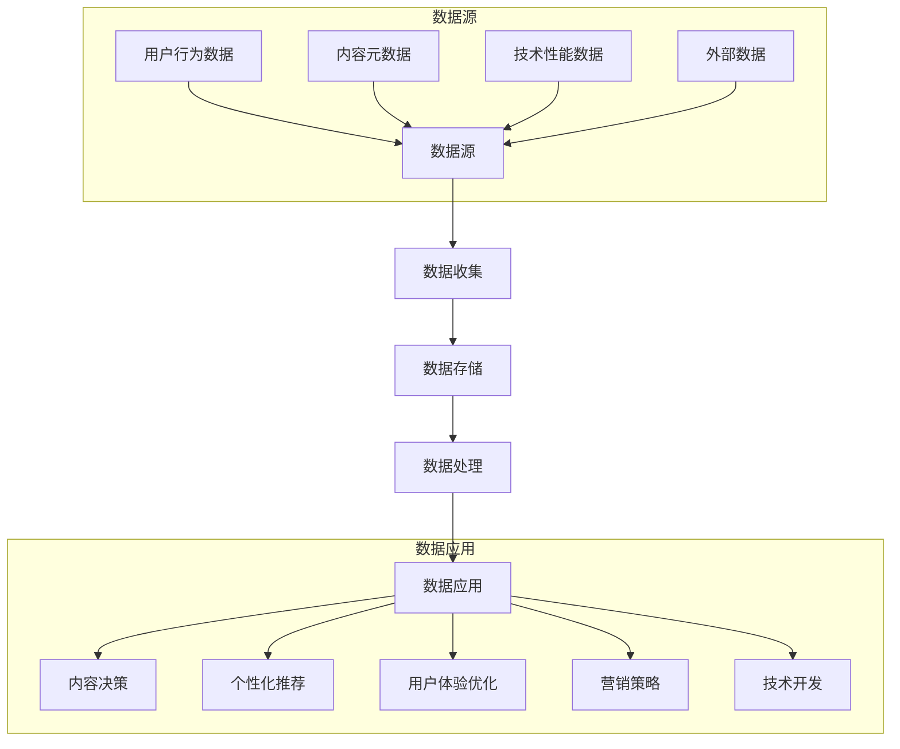

---
{"dg-publish":true,"tags":["商业分析","案例分析","Netflix","数据驱动决策"],"created":"2024-05-18","permalink":"/知识共享/002_商业分析/03_案例/02_公司案例/Netflix的数据驱动决策/","dgPassFrontmatter":true}
---

# Netflix的数据驱动决策

> [!quote] 概述
> 本案例深入分析Netflix如何利用大数据和算法驱动业务决策的全过程，探讨从内容创作、用户体验到营销策略的数据应用实践。案例聚焦Netflix的数据团队架构、分析方法和决策机制，揭示数据驱动文化如何帮助Netflix在激烈的流媒体市场中保持领先地位。

## 一、公司与行业背景

### Netflix发展历程
- **DVD邮寄时代(1997-2006)**: 从实体DVD租赁开始，建立订阅模式基础
- **流媒体转型期(2007-2012)**: 从DVD邮寄向在线流媒体转型，用户习惯培养
- **原创内容时代(2013-2018)**: 大规模投资原创内容，《纸牌屋》等标志性作品推出
- **全球扩张期(2018至今)**: 加速全球化战略，本地化内容创作，应对竞争加剧

### 流媒体行业竞争格局
- **主要竞争对手**:
  - 传统媒体背景：Disney+, HBO Max, Paramount+
  - 科技公司背景：Amazon Prime Video, Apple TV+
  - 区域性竞争者：Hulu(美国), iQiyi(中国), Hotstar(印度)
- **市场定位差异**:
  - Netflix: 广泛内容库+全球原创+技术体验
  - Disney+: 家庭内容+强IP+跨渠道协同
  - HBO Max: 高质量原创+传统媒体资源
  - Prime Video: 电商捆绑+多元内容

### Netflix的核心业务挑战
1. **内容投资回报优化**: 每年超过170亿美元的内容预算如何实现最大投资回报
2. **全球本地化策略**: 如何平衡全球统一体验与本地市场需求
3. **用户获取与留存**: 在竞争加剧环境下提高用户忠诚度和降低流失率
4. **用户体验创新**: 保持用户界面和功能领先性以增加用户粘性
5. **技术架构扩展**: 支持全球2亿+用户的高质量流媒体服务

### 数据驱动的战略定位
- **"数据公司而非媒体公司"**: Netflix自我定位为科技公司而非传统媒体公司
- **数据贯穿全业务流程**: 从内容决策到技术开发的全流程数据应用
- **实验文化**: 广泛的A/B测试和快速迭代方法
- **数据与创意平衡**: 数据支持但不完全替代创意决策

## 二、数据基础设施与组织架构

### 数据技术架构
- **数据收集层**:
  - 用户互动数据: 观看历史、搜索、评分、完成率
  - 技术性能数据: 缓冲率、分辨率切换、错误率
  - 内容元数据: 类型、演员、导演、场景标签
  - 外部数据: 社交媒体反馈、市场研究数据

- **数据处理层**:
  - 实时处理: Kafka+Flink实时数据流处理
  - 批处理: Hadoop+Spark大规模数据处理
  - 机器学习平台: 自建ML基础设施
  - 数据仓库: Snowflake云数据仓库

- **数据应用层**:
  - 推荐系统: 个性化内容推荐引擎
  - 预测模型: 内容表现与用户行为预测
  - 业务智能: 仪表板和自助分析工具
  - 实验平台: A/B测试系统

### 数据团队组织结构
- **中央数据科学团队**:
  - 核心算法研发
  - 机器学习基础设施
  - 实验设计方法论
  - 高级数据分析

- **嵌入式数据团队**:
  - 内容数据团队: 支持内容获取和创作决策
  - 产品数据团队: 支持用户界面和体验优化
  - 营销数据团队: 支持用户获取和留存策略
  - 工程数据团队: 支持技术开发和性能优化

- **数据治理与安全**:
  - 数据质量监控
  - 隐私保护机制
  - 合规与治理
  - 模型监控与更新

- **数据文化建设**:
  - 数据识字率培训项目
  - 分析能力认证体系
  - 数据实践社区
  - 数据驱动文化推广

### 关键数据资产
- **用户观看行为数据库**:
  - 超过2亿账户的详细观看历史
  - 精确到暂停、回看、跳过等微行为
  - 观看完成率和参与度指标
  - 设备偏好和观看时段分布

- **内容标签系统**:
  - 数千个微观内容标签(micro-tags)
  - 多维度内容特征分类
  - 场景级内容描述
  - 情感和主题元素标注

- **测试结果知识库**:
  - 历史A/B测试结果库
  - 内容表现预测模型
  - 用户行为模式库
  - 季节性和事件影响数据

- **全球区域数据资产**:
  - 区域文化偏好模型
  - 本地内容表现基准
  - 语言和字幕影响数据
  - 国际用户行为差异

## 三、核心数据应用场景

### 应用场景一：个性化推荐系统
- **系统概述**:
  - Netflix 80%的观看流量来自推荐
  - 千人千面的个性化首页
  - 动态更新的排序算法
  - 多目标优化框架

- **数据输入**:
  - 用户历史观看数据
  - 相似用户群组行为
  - 内容元数据和标签
  - 时间和环境上下文

- **算法方法**:
  - 协同过滤：基于用户相似性
  - 内容过滤：基于作品特征
  - 神经网络：深度学习模型
  - 强化学习：根据反馈优化

- **实际应用效果**:
  - 用户满意度提升15%
  - 流失率降低20%
  - 内容发现广度增加30%
  - 长尾内容观看提升25%

### 应用场景二：内容投资决策
- **数据驱动的内容评估**:
  - 潜在观众规模预测
  - 制作成本与预期回报模型
  - 类似内容历史表现分析
  - 创作团队过往作品表现

- **《纸牌屋》案例分析**:
  - 数据显示大卫·芬奇、凯文·史派西和英版《纸牌屋》粉丝重叠
  - 政治题材剧集有稳定的观众群
  - 两季投资1亿美元的数据支持
  - 成为奠定Netflix原创战略的标志性案例

- **本地化内容决策**:
  - 《王国》(韩国)：基于韩国用户偏好数据
  - 《纸钞屋》(西班牙)：全球潜力预测
  - 《鱿鱼游戏》：高风险实验的数据支持

- **内容组合优化**:
  - 不同类型内容的投资比例
  - 原创与授权内容平衡
  - 影视长度与格式决策
  - 全球与本地内容策略

### 应用场景三：用户体验优化
- **界面设计优化**:
  - 内容缩略图个性化测试
    - 同一内容为不同用户展示不同海报
    - 根据用户偏好选择最吸引人的场景
    - 测试显示可提升点击率20-30%
  
  - 视频预览自动播放
    - 数据显示减少了决策时间
    - 增加了内容探索
    - A/B测试验证效果

- **技术体验优化**:
  - 自适应流媒体质量
    - 基于用户网络条件预测
    - 动态调整视频质量
    - 减少缓冲等待时间
  
  - 预加载技术
    - 预测用户可能观看的下一个内容
    - 智能预缓存减少等待
    - 数据显示提升连续观看率15%

- **内容展示实验**:
  - 类别排序优化
    - 个人化类别顺序
    - 动态调整类别显示位置
  
  - 内容详情页优化
    - 关键信息层级排序
    - 相关推荐算法
    - 互动元素布局

### 应用场景四：用户获取与留存
- **潜在用户定位**:
  - 相似用户画像构建
  - 高价值细分市场识别
  - 转化概率预测模型
  - 渠道效果评估

- **季节性策略优化**:
  - 假期期间内容排期
  - 特殊事件响应策略
  - 周末与工作日内容差异
  - 黄金时段定义的区域差异

- **用户流失预警**:
  - 流失风险预测模型
    - 观看频率变化
    - 内容完成率下降
    - 账户活跃度变化
    - 搜索行为变化
  
  - 干预措施测试
    - 个性化内容推荐
    - 新内容提醒
    - 特殊优惠
    - 体验改进

- **忠诚度培养**:
  - 长期观看路径设计
  - 系列内容策略
  - 跨类型内容引导
  - 社交分享激励

## 四、关键决策分析案例

### 决策案例一：《怪奇物语》的内容投资决策
- **决策背景**:
  - 陌生创作团队(Duffer兄弟)的科幻题材剧
  - 高成本制作需求
  - 怀旧80年代题材风险与机遇并存

- **数据分析过程**:
  1. **目标受众分析**:
     - 科幻/恐怖类型内容观众重合度分析
     - 怀旧题材内容表现数据
     - 青少年+成人双重受众潜力评估
  
  2. **投资回报预测**:
     - 类似内容留存率影响
     - 多季发展潜力模型
     - 衍生内容和商业化机会

  3. **风险评估**:
     - 创作团队经验缺乏风险
     - 特效成本超支可能性
     - 类型混合的市场接受度

- **决策结果与实际效果**:
  - 投资决策：中等预算试水，保留多季扩展选项
  - 实际结果：成为Netflix旗舰剧集，带动大量新订阅
  - 数据应用：观众反应数据指导后续季内容调整
  - 长期价值：建立了强IP，扩展到游戏和商品领域

### 决策案例二：自动播放预览功能
- **决策背景**:
  - 用户决策时间长，内容探索率低
  - 界面静态，缺乏吸引力
  - 技术成本与用户体验平衡

- **数据分析过程**:
  1. **用户行为分析**:
     - 内容浏览模式研究
     - 决策延迟数据
     - 预览内容对转化影响
  
  2. **A/B测试设计**:
     - 测试参数：自动播放时机、音量设置、预览长度
     - 衡量指标：观看转化率、浏览深度、会话时长
     - 用户群体：分层随机抽样

  3. **影响评估**:
     - 技术负载分析
     - 带宽消耗预估
     - 用户反馈情绪预测

- **决策结果与实际效果**:
  - 决策：实施自动预览，但添加用户控制选项
  - 积极影响：内容发现率提升14%，观看决策时间缩短34%
  - 负面影响：部分用户投诉，带宽使用增加
  - 调整措施：增加关闭功能，优化预览内容质量

### 决策案例三：全球内容本地化战略
- **决策背景**:
  - 国际市场增长速度超过美国市场
  - 各区域内容偏好显著差异
  - 本地内容制作成本高但潜力大

- **数据分析过程**:
  1. **区域偏好模型**:
     - 不同地区内容类型偏好分析
     - 美国内容在国际市场表现数据
     - 本地内容与用户增长相关性
  
  2. **投资组合优化**:
     - 区域内容投资回报预测
     - 全球内容vs本地内容比例模拟
     - 不同语言内容跨区域传播潜力
  
  3. **试点项目分析**:
     - 《王国》(韩国)表现数据分析
     - 《纸钞屋》(西班牙)全球传播模式
     - 本地制作成本效益评估

- **决策结果与实际效果**:
  - 决策：大幅增加本地内容投资，建立区域制作中心
  - 区域焦点：韩国、西班牙、印度、巴西等制作中心
  - 实际效果：国际用户增长加速，本地内容全球流行案例增多
  - 代表作品：《鱿鱼游戏》成为Netflix史上最成功的非英语作品

## 五、数据驱动决策的组织保障

### 数据驱动文化建设
- **高层支持与示范**:
  - CEO Reed Hastings亲自推动数据文化
  - 领导层在决策中公开使用数据
  - 数据团队在组织中的高地位

- **决策流程设计**:
  - "信息与判断"框架：明确数据与直觉边界
  - 假设检验方法：通过数据验证业务假设
  - 实验优先理念：小规模测试大型决策

- **透明度与开放性**:
  - 内部数据广泛共享
  - 分析结果和方法公开讨论
  - 鼓励质疑和批判性思考

- **培训与赋能**:
  - 全员数据识字率项目
  - 数据分析工具普及
  - 非技术团队数据能力建设

### 决策权限与流程
- **决策类型分类**:
  - 数据主导决策：明确规则，数据自动触发
  - 数据辅助决策：数据支持人工判断
  - 创意决策：数据提供背景但不主导

- **决策层级设计**:
  - 中央决策：内容大方向、大额投资
  - 分散决策：具体创意、日常优化
  - 算法决策：个性化、推荐、技术调整

- **实验设计框架**:
  - 对照组设计规范
  - 样本量计算方法
  - 统计显著性标准
  - 多变量测试方法

- **决策评估机制**:
  - 事后分析机制
  - 预测准确度追踪
  - 决策调整反馈循环

### 平衡数据与创意
- **"数据支持但不替代创意"原则**:
  - 数据识别机会，创意提供解决方案
  - 创意提案加数据验证的双轨制
  - 保持创意冒险的空间与预算

- **创意风险管理**:
  - 作品组合管理：高风险与稳健项目平衡
  - 创作自由与商业目标的边界设定
  - 失败学习机制

- **创作者数据赋能**:
  - 为创作者提供定制化数据洞察
  - 保护创作过程避免过度干预
  - 结果导向而非过程控制

- **案例：数据与创意结合**
  - 《黑镜：潘达斯奈基》交互式内容
    - 创意概念：交互式叙事体验
    - 数据支持：用户决策点分析优化
    - 技术实现：基于用户测试数据设计

## 六、数据驱动决策的挑战与对策

### 技术挑战
1. **数据规模爆炸**:
   - 挑战：每日产生数十PB级数据，传统架构无法支持
   - 对策：全面迁移至云架构，构建弹性数据处理系统
   - 效果：处理能力提升10倍，成本优化30%

2. **实时分析需求**:
   - 挑战：用户体验优化需要毫秒级响应
   - 对策：边缘计算+预计算策略，流处理架构升级
   - 效果：推荐响应时间从秒级降至百毫秒级

3. **AI模型复杂性**:
   - 挑战：模型越来越复杂，可解释性降低
   - 对策：开发模型解释工具，建立AI治理框架
   - 效果：关键决策透明度提升，非技术人员理解度增强

### 组织挑战
1. **数据素养不均衡**:
   - 挑战：各部门数据能力差异大，协作效率低
   - 对策：分层数据培训体系，嵌入式数据团队
   - 效果：非技术团队数据使用率提升60%

2. **决策权与责任界定**:
   - 挑战：数据驱动与人工判断的界限模糊
   - 对策：决策类型分类框架，明确责任矩阵
   - 效果：决策流程清晰化，责任归属明确

3. **创新与效率平衡**:
   - 挑战：过度依赖数据可能抑制创新冒险
   - 对策：设立创新沙盒，允许数据假设被挑战
   - 效果：保持创新活力同时提高成功率

### 伦理与隐私挑战
1. **用户数据伦理**:
   - 挑战：深度个性化与隐私保护的平衡
   - 对策：差分隐私技术，用户控制选项增强
   - 效果：维持推荐质量同时加强隐私保护

2. **算法偏见**:
   - 挑战：推荐系统可能强化现有偏好，减少多样性
   - 对策：多样性指标纳入算法目标，定期偏见审计
   - 效果：内容发现广度提升，用户满意度维持

3. **国际法规遵从**:
   - 挑战：全球市场面临不同数据法规(GDPR, CCPA等)
   - 对策：法规自动化合规系统，区域化数据策略
   - 效果：法规风险降低，国际扩张顺利

### 未来挑战应对策略
1. **数据策略调整**:
   - 更精细的用户分群替代大规模单一模型
   - 联邦学习等隐私增强技术应用
   - 混合云架构提升数据主权控制

2. **决策框架演进**:
   - 自动化决策比例提升
   - 人机协作决策模式优化
   - 决策速度与质量平衡机制

3. **创新方向**:
   - 跨媒体数据整合(流媒体+游戏+社交)
   - 预测性内容创作辅助工具
   - 沉浸式体验数据分析方法

## 七、案例启示与跨行业应用

### 数据驱动组织的成功要素
1. **数据基础设施先行**:
   - 投资高质量数据收集和存储
   - 构建统一数据访问标准
   - 数据质量管理机制

2. **数据人才策略**:
   - 多层次数据人才架构
   - 混合团队组织结构
   - 数据专业发展路径

3. **实验文化建设**:
   - 失败容忍度
   - 快速迭代机制
   - 假设检验思维方式

4. **决策流程重设计**:
   - 数据在决策中的明确定位
   - 直觉与数据的平衡机制
   - 持续学习的反馈循环

### 行业应用启示
1. **零售业应用**:
   - Netflix商品推荐→零售个性化推荐
   - 内容分析→消费者偏好洞察
   - 用户体验测试→店铺与线上体验优化

2. **金融服务业应用**:
   - 用户分群→客户精细化管理
   - 风险预测模型→信贷风险评估
   - 个性化界面→金融应用体验设计

3. **医疗健康行业应用**:
   - 内容匹配算法→治疗方案匹配
   - 用户流失预测→患者依从性预测
   - 实验设计框架→临床试验设计优化

4. **制造业应用**:
   - 内容投资决策→产品研发投资分配
   - 全球化策略→市场进入策略
   - 用户体验数据→产品设计迭代

### 应用实施路径建议
1. **起步阶段(0-6个月)**:
   - 数据资产盘点与质量评估
   - 明确关键业务问题与数据需求
   - 快速见效的试点项目
   - 基础数据能力建设

2. **发展阶段(6-18个月)**:
   - 数据平台建设与流程标准化
   - 建立数据驱动的决策机制
   - 扩大试点范围，积累成功案例
   - 人才培养与组织调整

3. **成熟阶段(18个月以上)**:
   - 数据驱动文化全面推广
   - 高级分析能力建设
   - 自动化决策系统部署
   - 数据创新生态构建

### 常见误区与规避建议
1. **技术导向误区**:
   - 误区：过度关注技术而非业务问题
   - 建议：先明确业务问题，后选择适当技术

2. **完美数据幻觉**:
   - 误区：等待完美数据才开始行动
   - 建议：接受数据不完美，从小处着手

3. **忽视组织变革**:
   - 误区：仅关注技术实施忽视人员适应
   - 建议：同步推进技术与组织文化变革

4. **过度依赖数据**:
   - 误区：数据成为唯一决策依据
   - 建议：建立多元决策框架，平衡数据与经验

## 八、思考与练习

1. Netflix的推荐系统如何平衡个性化与内容多样性？这一平衡对用户留存有何影响？

2. 分析Netflix数据驱动文化与传统媒体公司决策文化的关键差异，并思考这些差异如何影响两类企业的创新能力。

3. 如果你是一家传统企业的数据团队负责人，如何参考Netflix的经验设计数据驱动转型路线图？

4. Netflix的内容投资决策模型能否应用于其他创意产业(如游戏开发、出版)？需要做哪些调整？

5. 评估Netflix数据驱动决策在不同市场环境(如中国、印度)面临的挑战，并提出可能的解决方案。

## 参考资源

1. Netflix Technology Blog. (2018-2023). "Netflix TechBlog".

2. Gomez-Uribe, C. A., & Hunt, N. (2016). "The Netflix Recommender System: Algorithms, Business Value, and Innovation". ACM Transactions on Management Information Systems.

3. Hastings, R. & Meyer, E. (2020). "No Rules Rules: Netflix and the Culture of Reinvention".

4. McKinsey & Company. (2022). "How Netflix's Customer Obsession Created a Customer Obsession".

5. Harvard Business Review. (2023). "What Other Companies Can Learn from Netflix's HR Policies". 