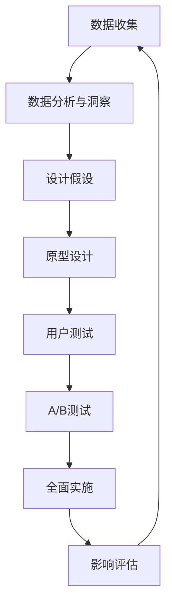

---
{"dg-publish":true,"tags":["商业分析","案例分析","亚马逊","用户体验"],"created":"2024-05-18","permalink":"/知识共享/002_商业分析/03_案例/02_公司案例/亚马逊用户体验分析/","dgPassFrontmatter":true}
---

> [!quote] 概述
> 本案例深入分析亚马逊（Amazon）如何通过持续优化用户体验成为全球电商巨头。案例聚焦亚马逊的用户体验战略、设计原则、测试方法和数据驱动的决策过程，探讨其如何将顾客体验作为业务的核心驱动力，以及这一策略如何支撑其长期业务增长。

## 一、公司与竞争格局分析

### 公司概况
- **创立背景**: 1994年由杰夫·贝索斯（Jeff Bezos）创立，最初作为在线书店起步
- **业务范围**: 从单一电商发展为涵盖云计算、数字内容、智能硬件等多元化科技公司
- **规模**: 全球近200个国家和地区开展业务，年营收超过4000亿美元
- **核心理念**: "顾客至上主义"（Customer Obsession）和长期主义思维

### 行业竞争格局
- **主要竞争对手**: 沃尔玛（线下+线上）、阿里巴巴（全球电商）、eBay（C2C市场）
- **差异化竞争策略**: 
  - 沃尔玛：价格优势和线下门店便利性
  - 阿里巴巴：社交电商和移动支付生态
  - 亚马逊：用户体验极致化和物流效率
- **用户体验竞争维度**:
  | 公司 | 产品丰富度 | 价格 | 便利性 | 个性化 | 配送速度 |
  |-----|----------|-----|-------|-------|---------|
  | 亚马逊 | ★★★★★ | ★★★★ | ★★★★★ | ★★★★★ | ★★★★★ |
  | 沃尔玛 | ★★★★ | ★★★★★ | ★★★ | ★★ | ★★★ |
  | 阿里巴巴 | ★★★★★ | ★★★ | ★★★★ | ★★★★ | ★★★ |

### 用户体验在竞争中的战略地位
- **核心差异化因素**: 亚马逊将用户体验视为首要竞争优势，而非仅仅是价格或产品种类
- **CEO重视程度**: 贝索斯曾表示"我们不是以竞争对手为中心，而是以客户为中心"
- **投资倾向**: 持续大规模投资用户体验研究和优化，即使短期内对财务表现有负面影响
- **对产品决策的影响**: 所有产品决策首先考虑"这对客户有什么好处"，而非"这能带来多少利润"

## 二、亚马逊用户体验设计理念与原则

### 核心用户体验哲学
- **客户痴迷**: 以客户需求为起点，而非竞争对手或技术可能性
- **从客户反向思考**: 产品开发从客户需求出发，而非现有能力出发
- **长期价值最大化**: 愿意牺牲短期利益来提升长期客户体验
- **持续革新**: "今天是Day 1"的理念，永远保持创业心态

### 亚马逊14条领导力原则与用户体验
1. **客户痴迷**: 一切决策从客户利益出发
2. **主人翁精神**: 员工思考问题如同公司主人
3. **创新与简化**: 寻找简化复杂体验的方法
4. **正确的决策**: 基于数据而非直觉做决策
5. **好奇学习**: 持续学习用户行为的新洞察
6. **招聘并培养最优秀的人才**: 用户体验团队保持高标准
7. **坚持最高标准**: 不断提高用户体验标准
8. **大胆思考**: 质疑传统电商用户体验范式
9. **崇尚行动**: 快速测试和改进体验
10. **节俭**: 在不影响用户体验的前提下控制成本
11. **赢得信任**: 通过可靠体验建立用户信任
12. **深入分析**: 深入了解用户行为数据
13. **抗辩**: 勇于质疑现有用户体验
14. **交付成果**: 确保用户体验设计落地实施

### 用户体验设计指导原则
1. **极简主义**: 减少用户决策负担和认知摩擦
2. **一致性**: 跨平台、跨设备体验的一致性
3. **个性化**: 基于用户行为和偏好的定制体验
4. **透明度**: 清晰展示产品信息、价格和配送时间
5. **效率第一**: 减少完成任务所需的步骤和时间
6. **容错设计**: 允许用户犯错并轻松纠正
7. **可预测性**: 用户行为产生可预期的结果
8. **渐进呈现**: 按需展示信息，避免信息过载

## 三、关键用户体验创新案例分析

### 创新一：一键下单(1-Click Ordering)
- **创新描述**: 允许用户跳过购物车流程，直接用存储的付款和配送信息下单
- **背景与挑战**: 传统购物流程复杂、多步骤，导致购物车放弃率高
- **设计方法与过程**:
  - 问题定义：识别购物流程中的摩擦点
  - 简化设计：将多步骤合并为单一操作
  - 技术支持：开发安全存储用户支付信息的系统
  - 测试优化：通过A/B测试验证转化率提升
- **实施效果**:
  - 降低购物车放弃率约45%
  - 增加即兴购买行为
  - 提高移动设备购物转化率
  - 价值高到被申请专利（1999-2017年有效）
- **关键决策点**: 简化流程与安全性之间的平衡

### 创新二：个性化推荐系统
- **创新描述**: 基于用户浏览和购买历史的智能产品推荐引擎
- **背景与挑战**: 数百万商品中如何帮助用户发现感兴趣的产品
- **设计方法与过程**:
  - 数据收集：汇总用户行为数据
  - 算法开发：协同过滤和内容匹配算法
  - 呈现设计：推荐结果的位置和展示方式
  - 持续优化：基于点击率和转化率调整算法
- **实施效果**:
  - 贡献约35%的销售额
  - 提高了用户停留时间和浏览页数
  - 增加了长尾商品销售
  - 提高了用户发现新品类的几率
- **关键决策点**: 推荐多样性与相关性的平衡

### 创新三：Amazon Prime会员计划
- **创新描述**: 订阅式会员服务，提供免费快速配送和多种数字内容权益
- **背景与挑战**: 配送成本和时间是电商用户体验的主要摩擦点
- **设计方法与过程**:
  - 用户研究：识别配送速度和成本对购买决策的影响
  - 商业模型设计：确定年费订阅模式
  - 价值包装：整合多种权益提高会员价值
  - 持续扩展：不断增加会员权益
- **实施效果**:
  - 会员年消费额是非会员的2-3倍
  - 提高了用户忠诚度和留存率
  - 创造了稳定的订阅收入流
  - 推动生态系统扩展（视频、音乐等）
- **关键决策点**: 短期亏损换取长期客户价值

### 创新四：产品评价与问答系统
- **创新描述**: 用户生成内容系统，包括产品评价、评分和问答功能
- **背景与挑战**: 线上购物无法实物接触商品，缺乏信任
- **设计方法与过程**:
  - 评价系统设计：星级评分+文字评价
  - 社区参与机制：投票和"有帮助"反馈
  - 问答功能：允许潜在买家提问，由卖家或其他用户回答
  - 内容审核：平衡开放性和内容质量
- **实施效果**:
  - 提高了购买决策信心
  - 降低了退货率
  - 创造了有价值的产品信息库
  - 形成社区参与感
- **关键决策点**: 负面评价展示与商业利益的平衡

## 四、用户体验研究方法与数据驱动

### 用户研究方法体系
1. **定量研究**:
   - A/B测试：每年超过10,000次网站变更测试
   - 点击流分析：追踪用户在网站上的行为路径
   - 转化漏斗分析：识别用户流失点
   - 热图分析：了解用户注意力分布
2. **定性研究**:
   - 用户访谈：深入了解用户需求和痛点
   - 用户测试：观察用户与产品交互方式
   - 日记研究：长期跟踪用户购物行为
   - 情境调查：在真实环境中研究用户行为
3. **混合方法**:
   - 用户体验评分卡：量化用户满意度
   - 客户旅程映射：识别体验中的高点和低点
   - 同理心地图：理解用户情感需求

### 数据驱动的决策流程

### 核心用户体验指标体系
1. **行为指标**:
   - 转化率：从浏览到购买的转化
   - 放弃率：购物车和结账放弃率
   - 浏览深度：用户浏览的页面数
   - 搜索到购买时间：完成购买所需的时间
   - 重复购买率：回购频率和间隔
2. **态度指标**:
   - Net Promoter Score (NPS)：推荐意愿
   - 客户满意度 (CSAT)：整体满意度评分
   - 任务成功评分：完成特定任务的难易度
   - 感知价值：价格与体验的匹配度
3. **业务指标**:
   - 客户终身价值 (LTV)：客户长期贡献价值
   - 获客成本 (CAC)：获取新客户的成本
   - 留存率：不同时间段的客户留存
   - 每用户平均收入 (ARPU)：用户贡献收入

### 案例：搜索结果页优化
- **研究问题**: 如何优化搜索结果页以提高用户满意度和转化率
- **研究方法**:
  - 热图分析：了解用户视线和注意力分布
  - 点击流分析：用户如何与搜索结果交互
  - A/B测试：不同布局和信息展示方式的效果
  - 用户测试：观察用户如何浏览和筛选结果
- **关键发现**:
  - 用户很少浏览第一页之后的结果
  - 产品图片大小对点击率影响显著
  - 价格和Prime标识是关键决策因素
  - 用户评分星级是快速筛选的重要依据
- **实施变更**:
  - 增大产品图片尺寸
  - 突出显示Prime标识
  - 简化价格展示
  - 增强筛选功能易用性
- **结果评估**:
  - 搜索结果点击率提升18%
  - 搜索到购买转化率提升12%
  - 用户满意度评分提高

## 五、用户体验组织架构与流程

### 用户体验团队结构
- **中央UX团队**: 负责跨产品的用户体验标准和研究
- **嵌入式UX专家**: 分布在各产品团队中的用户体验设计师
- **技术UX团队**: 专注于技术实现的用户体验工程师
- **研究团队**: 专职用户研究和测试专家
- **数据分析团队**: 负责用户行为数据分析

### 敏捷用户体验设计流程
1. **发现阶段**:
   - 用户研究和数据分析
   - 痛点和机会识别
   - 优先级确定
2. **定义阶段**:
   - 用户旅程映射
   - 体验需求定义
   - 设计标准确立
3. **设计阶段**:
   - 交互设计
   - 视觉设计
   - 原型制作
4. **测试阶段**:
   - 可用性测试
   - A/B测试
   - 性能测试
5. **迭代阶段**:
   - 持续优化
   - 指标追踪
   - 反馈收集

### 跨职能协作模式
- **两披萨团队**: 小型自主团队（不超过两个披萨能喂饱的人数）
- **设计思维工作坊**: 产品、设计、开发和业务团队共同参与
- **用户代言人角色**: 团队中专门代表用户利益的角色
- **周期性用户日**: 全团队观看真实用户测试视频
- **内部用户体验评审**: 高管参与的体验评审会议

### 培养"体验思维"的文化实践
1. **"客户来信"分享**: 高管会议始于阅读客户反馈
2. **空椅子做法**: 会议中留一把空椅子象征客户在场
3. **全员客服轮岗**: 所有员工每年在客服岗位工作两天
4. **用户故事展示**: 办公区展示真实用户故事和照片
5. **体验改进奖励**: 专门奖励提升用户体验的创新

## 六、用户体验策略的商业价值

### 直接业务影响
- **转化率提升**: 优化结账流程使转化率提高23%
- **平均订单金额增长**: 推荐系统使客单价提高15%
- **复购率提高**: Prime会员的年购买频次是非会员的5倍
- **客户获取成本降低**: 口碑推荐使CAC降低约25%
- **退货率降低**: 详细产品信息和评价使退货率降低18%

### 长期战略价值
- **品牌忠诚度**: NPS行业领先，超过60
- **价格敏感度降低**: 用户愿意为更好体验支付5-10%溢价
- **抗竞争能力**: 客户留存率在竞争加剧环境中保持稳定
- **业务扩展能力**: 用户愿意尝试亚马逊的新产品类别
- **生态系统价值**: 用户在亚马逊生态中使用多种服务

### 用户体验投资回报示例
- **案例一**: 移动应用重设计
  - 投资：设计和开发成本120万美元
  - 收益：转化率提升8%，年增收3200万美元
  - ROI：2560%
- **案例二**: 评价系统优化
  - 投资：开发和内容管理成本80万美元
  - 收益：退货率降低7%，年节省1400万美元
  - ROI：1650%
- **案例三**: 搜索功能改进
  - 投资：算法开发和UI优化150万美元
  - 收益：搜索转化提升12%，年增收4800万美元
  - ROI：3100%

### 用户体验与财务表现相关性
- **亚马逊UX投资曲线与股价增长关系**:
  | 年份 | UX投资(百万美元) | 股价涨幅 | NPS变化 |
  |-----|----------------|---------|---------|
  | 2010 | 85 | 34% | +5 |
  | 2012 | 120 | 45% | +8 |
  | 2014 | 180 | -22% | +2 |
  | 2016 | 250 | 11% | +4 |
  | 2018 | 340 | 28% | +6 |
  | 2020 | 450 | 76% | +7 |
  | 2022 | 580 | -49% | +3 |

## 七、挑战与未来发展

### 当前用户体验挑战
1. **平台规模复杂性**: 数百万商品管理和展示的复杂性
2. **第三方卖家体验一致性**: 确保第三方卖家提供一致的体验质量
3. **个性化与隐私平衡**: 在提供个性化体验的同时保护用户隐私
4. **跨渠道体验整合**: 线上、线下、语音等多渠道体验的统一
5. **信息过载**: 产品信息和选择过多导致的用户决策疲劳

### 应对策略和创新方向
1. **AI赋能体验**: 利用AI简化决策过程和内容筛选
2. **语音和对话式界面**: Alexa作为新型用户交互模式的探索
3. **增强现实应用**: AR技术帮助用户在购买前"试用"产品
4. **预测性体验**: 预测用户需求，提前准备相关服务和内容
5. **情境感知设计**: 根据用户环境和状态调整体验

### 未来用户体验战略
- **无摩擦愿景**: 消除购物过程中的一切摩擦和障碍
- **生态系统体验**: 从单一购物体验向全面生活服务体验扩展
- **可持续体验**: 将环保和社会责任融入用户体验设计
- **全球本地化**: 平衡全球一致性和本地市场适应性
- **包容性设计**: 确保所有人群（不同能力、年龄、文化背景）均能顺畅使用

### 前沿实验项目
1. **Amazon Go**: 无收银员实体零售店体验
2. **Amazon One**: 掌纹支付技术
3. **智能家居集成**: 家庭设备与购物体验的融合
4. **虚拟试衣间**: AI驱动的虚拟试穿技术
5. **情感识别**: 根据用户情绪调整购物体验

## 八、经验总结与实践启示

### 用户体验设计关键原则
1. **从客户需求反向设计**: 从用户问题出发，而非技术可能性
2. **减少认知负荷**: 简化决策过程，减少用户需要思考的内容
3. **持续测试与优化**: 永远不要假设知道用户想要什么
4. **数据与直觉平衡**: 数据驱动但不完全依赖数据
5. **长期思维**: 愿意牺牲短期指标提升长期体验

### 跨行业实践应用
1. **零售行业**: 全渠道体验整合，产品信息展示优化
2. **金融服务**: 复杂流程简化，透明度提升
3. **医疗健康**: 个性化健康信息展示，降低专业门槛
4. **教育**: 个性化学习路径，进度可视化
5. **旅游**: 减少预订摩擦，个性化推荐

### 用户体验驱动转型步骤
1. **建立客户洞察系统**: 持续收集和分析用户反馈
2. **定义体验愿景和原则**: 明确组织用户体验的核心价值观
3. **构建跨职能团队**: 打破部门壁垒，以用户旅程为中心组织团队
4. **建立体验指标**: 将用户体验指标与业务指标关联
5. **创建测试文化**: 培养基于证据的决策习惯

### 未来用户体验人才能力模型
1. **数据素养**: 理解和应用用户数据的能力
2. **商业敏感度**: 将体验决策与商业目标连接
3. **跨学科思维**: 融合设计、心理学、技术和商业思维
4. **复杂系统思考**: 理解体验元素间的相互关系
5. **前瞻性视野**: 预见技术和用户行为变化趋势

## 九、案例问题与讨论

1. 亚马逊在快速增长过程中如何保持用户体验的一致性？哪些机制和流程起到了关键作用？

2. 比较亚马逊与其竞争对手的用户体验差异，为什么亚马逊能够在用户体验方面保持领先？

3. 亚马逊的"客户痴迷"文化如何具体影响产品决策？请分析一个实际产品决策案例。

4. 如果你是一家传统零售企业的用户体验负责人，如何借鉴亚马逊的经验制定数字化转型策略？

5. 亚马逊的用户体验投资如何平衡短期业务表现和长期用户价值？这种平衡对其它企业有何启示？

## 参考资源与延伸阅读

1. Brynjolfsson, E., & Smith, M. D. (2000). "Frictionless Commerce? A Comparison of Internet and Conventional Retailers". Management Science.

2. Stone, B. (2021). "Amazon Unbound: Jeff Bezos and the Invention of a Global Empire". Simon & Schuster.

3. Galloway, S. (2017). "The Four: The Hidden DNA of Amazon, Apple, Facebook, and Google". Portfolio.

4. Nielsen Norman Group. (2019). "E-Commerce User Experience: Best Practices for Product Pages".

5. Harvard Business Review. (2018). "How Amazon Stays More Agile Than Ever". 