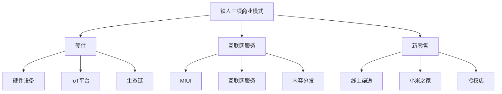

---
{"dg-publish":true,"tags":["商业分析","案例分析","小米","商业模式","互联网企业"],"created":"2024-05-18","permalink":"/知识共享/002_商业分析/03_案例/02_公司案例/小米的商业模式演变/","dgPassFrontmatter":true}
---

# 小米的商业模式演变

> [!quote] 概述
> 本案例深入分析小米公司从创立至今的商业模式演变历程，探讨其如何从一家互联网公司发展成为全球化的科技生态企业。案例聚焦于小米的战略转型点、创新商业模式设计以及生态系统构建过程，揭示其中的商业洞察与战略思考。

## 一、企业与行业背景

### 小米公司发展历程

小米科技由雷军、黎万强、洪锋等人于2010年4月创立，是一家以手机、智能硬件和IoT平台为核心的互联网公司。

**关键发展阶段**:

- **创业期(2010-2013)**：专注于MIUI和手机业务，确立"互联网思维"
- **快速增长期(2014-2016)**：扩展生态链、国际化初步布局
- **调整期(2016-2018)**：供应链调整、渠道转型、业务重整
- **多元化发展期(2018至今)**：AIoT战略、智能制造、全球化深入推进
- **上市与全球化扩张(2018至今)**：港股上市、进入高端市场、电动汽车领域布局

### 行业发展趋势

智能手机与消费电子行业在小米发展历程中经历了显著变化：

- **智能手机市场从蓝海到红海**：初期爆发增长，后期增速放缓，行业竞争加剧
- **线上到线下渠道融合**：电商崛起后线下渠道重要性重新凸显，全渠道成为趋势
- **硬件利润压缩**：硬件同质化与价格战导致利润率下降，服务收入比重提升
- **生态系统竞争**：从单品竞争转向生态系统竞争，用户粘性与服务能力成为关键
- **智能家居与IoT兴起**：万物互联时代，AIoT成为新增长点
- **全球化市场重构**：新兴市场崛起，中国品牌全球化加速

### 竞争格局分析

小米面临的主要竞争对手及其特点：

- **国内手机厂商**：华为（技术领先）、OPPO/vivo（渠道优势）、荣耀（性价比路线）
- **国际手机厂商**：苹果（高端市场）、三星（全产业链）
- **生态竞争对手**：华为（HMS生态）、苹果（iOS生态）、谷歌（Android生态）
- **智能家居竞争**：海尔（家电优势）、华为（技术优势）、阿里巴巴（云服务优势）

## 二、商业模式分析

### 商业模式核心框架

小米的商业模式可用"铁人三项"模型概括：

### 创立期商业模式(2010-2013)

初期商业模式围绕手机与MIUI系统展开：

1. **价值主张**：高品质产品、极致性价比、优质用户体验
2. **核心战略**：
   - "铁人三项"模式初步形成：硬件+软件+互联网服务
   - 硬件薄利多销（甚至不赚钱）
   - MIUI系统提供差异化体验
   - 互联网服务变现
3. **收入结构**：
   - 硬件销售：以接近成本价销售高规格手机
   - 互联网服务：广告、游戏、应用分发等增值服务
4. **营销策略**：
   - 饥饿营销：限量供应制造稀缺性
   - 粉丝经济：构建发烧友社区
   - 社交媒体营销：口碑传播
5. **关键资源**：
   - 供应链整合能力
   - 软件开发团队
   - 米粉社区
   - 电商平台
6. **核心挑战**：
   - 生产规模与需求平衡
   - 供应链管理
   - 单一产品依赖风险

### 生态拓展期商业模式(2014-2016)

这一阶段小米开始构建生态系统：

1. **价值主张**：扩展至"科技生活方式"提供商
2. **核心战略**：
   - "硬件+软件+服务"三位一体
   - 生态链投资布局
   - 多品类产品矩阵
   - 国际化初步尝试
3. **收入结构**：
   - 硬件产品组合：手机、智能硬件、生活用品
   - MIUI服务收入增长
   - 生态链产品分成
4. **生态链模式**：
   - 投资而非自建
   - 赋能而非控制
   - 提供品牌、渠道、设计、供应链支持
   - 保持战略协同与自主运营平衡
5. **关键资源**：
   - 品牌影响力
   - 线上线下渠道
   - 投资能力
   - 用户数据
6. **核心挑战**：
   - 多品类管理复杂性
   - 生态链公司协同
   - 增长速度与质量平衡

### 战略调整期商业模式(2016-2018)

面临增长瓶颈，小米进行战略调整：

1. **价值主张**：从互联网公司向新零售转型
2. **核心战略**：
   - 强化线下渠道建设
   - 供应链精细化管理
   - 中高端市场布局
   - 海外市场重点突破
3. **渠道变革**：
   - 小米之家快速扩张
   - 线上线下融合
   - 县域市场渗透
4. **产品策略调整**：
   - 产品线细分：红米独立
   - 推出高端系列
   - AIoT产品矩阵扩充
5. **关键资源**：
   - 线下零售体系
   - 全球供应链网络
   - 本地化运营能力
6. **核心挑战**：
   - 渠道转型成本
   - 品牌向中高端延伸
   - 海外市场文化适应

### 全球化生态期商业模式(2018至今)

上市后小米迈向全面的全球化科技生态企业：

1. **价值主张**："AIoT+生活方式"生态系统
2. **核心战略**：
   - "手机×AIoT"双引擎战略
   - 全球化市场深耕
   - 高端化战略
   - 智能制造升级
   - 汽车等新领域布局
3. **收入结构**：
   - 多元化产品矩阵
   - 全球市场收入平衡
   - 服务收入占比提升
   - 生态系统协同变现
4. **创新点**：
   - 小米AIoT开放平台
   - 智能助手小爱同学
   - 电动汽车布局
   - 零售即服务模式
5. **关键资源**：
   - 全球化供应链
   - 研发与制造能力
   - 全球用户数据
   - 品牌资产
6. **核心挑战**：
   - 高低端市场平衡
   - 全球监管合规
   - 技术创新竞争

## 三、关键战略决策分析

### 决策一：硬件薄利战略

**决策背景**：
- 2011年，智能手机市场处于快速增长期，但高端手机价格昂贵
- 传统手机厂商商业模式依赖硬件高利润
- 互联网服务价值尚未被手机厂商充分挖掘

**决策内容**：
- 采用"硬件薄利、长尾增值"模式
- 以接近成本价格销售高规格手机
- 通过互联网服务实现长期盈利

**决策思路**：
- 降低硬件价格门槛，快速获取用户规模
- 建立用户粘性，构建长期服务关系
- 利用规模优势降低采购成本

**结果评估**：
- 成功打造爆款产品，快速积累上亿用户
- 互联网服务收入占比持续提升
- 但也导致行业低价竞争，利润空间被压缩
- 带来品牌向高端市场拓展的难度

### 决策二：生态链战略

**决策背景**：
- 2013年，智能手机红利期接近尾声
- 物联网与智能硬件概念兴起
- 单一产品依赖风险显现

**决策内容**：
- 制定生态链投资战略，而非自建多元业务
- 计划5年投资100家生态链企业
- 提供品牌、渠道、供应链、设计等资源支持

**决策思路**：
- 迅速拓展产品矩阵，降低单一品类依赖
- 构建小米生态系统，提高用户粘性
- 通过投资而非自建，降低经营风险

**结果评估**：
- 成功孵化多家估值超10亿美元的生态链企业
- 智能硬件产品矩阵迅速扩展，为IoT战略奠定基础
- 部分企业发展与小米战略协同性不足
- 品控与用户体验一致性挑战

### 决策三：新零售转型

**决策背景**：
- 2016年，线上流量红利衰减，获客成本上升
- 用户需要更好的线下体验服务
- 纯电商模式增长天花板显现

**决策内容**：
- 大力发展小米之家线下体验店
- 重新设计零售体验，整合线上线下渠道
- 调整供应链结构适应新零售需求

**决策思路**：
- 线下体验弥补线上渠道局限性
- 建立全渠道用户触达能力
- 优化用户体验，增强品牌认知

**结果评估**：
- 小米之家单店销售额达到行业领先水平
- 线下渠道对销售增长贡献显著提升
- 提升了品牌力与用户体验
- 渠道建设成本高，影响短期利润率

### 决策四："手机×AIoT"双引擎战略

**决策背景**：
- 2018年，IoT与智能家居市场爆发
- 手机市场趋于饱和，增长放缓
- 5G与AI技术兴起创造新机遇

**决策内容**：
- 确立"手机×AIoT"双引擎战略
- 提出未来五年投入100亿元发展AIoT
- 构建开放的IoT平台与生态

**决策思路**：
- 利用手机作为入口和控制中心
- 布局智能家居生态系统，构建完整生活场景
- 通过AI提升智能设备使用体验
- 数据互联增强用户粘性与服务机会

**结果评估**：
- 成功构建全球最大消费级IoT平台之一
- AIoT设备连接数超4亿台
- 生态闭环初步形成，服务收入增长
- 平台开放与安全管理的平衡挑战

## 四、商业分析框架应用

### SWOT分析

**优势(Strengths)**:
- 强大的互联网基因与技术能力
- 高效的供应链管理与成本控制能力
- 庞大的用户基础与粉丝群体
- 完整的IoT产品生态
- 全渠道销售网络

**劣势(Weaknesses)**:
- 品牌高端化进程面临挑战
- 核心技术自主创新能力相对不足
- 服务收入占比仍有提升空间
- 国际化人才与本地化能力不足
- 品类扩张带来的管理复杂性

**机会(Opportunities)**:
- 5G与AI技术应用场景拓展
- 新兴市场智能手机普及率提升
- 智能家居市场快速增长
- 电动汽车等新领域布局机会
- 高端市场国产替代趋势

**威胁(Threats)**:
- 行业竞争加剧，差异化难度增大
- 全球供应链不确定性上升
- 数据安全与隐私法规趋严
- 高端市场国际品牌壁垒
- 技术变革带来的颠覆风险

### 商业模式画布分析

**客户细分**:
- 年轻科技爱好者
- 性价比导向的消费者
- 智能生活方式追求者
- 新兴市场首次智能设备用户
- 中高端专业用户(新增细分)

**价值主张**:
- 高品质产品与极致性价比
- 精简高效的用户体验
- 互联互通的智能生活生态
- 创新科技生活方式
- "科技与艺术"的结合(高端线)

**渠道通路**:
- 线上官网与电商平台
- 小米之家体验店
- 授权零售渠道
- 全球分销网络
- 服务中心

**客户关系**:
- 米粉社区与MIUI论坛
- 社交媒体直接沟通
- 小米商城会员系统
- 售后服务网络
- 用户参与产品开发(众筹)

**收入来源**:
- 硬件产品销售
- MIUI广告与互联网服务
- 内容分发与应用商店
- IoT平台服务
- 金融服务

**核心资源**:
- 品牌与用户基础
- 研发团队与专利
- 供应链网络
- 销售渠道
- 生态链企业网络

**关键业务**:
- 产品研发与设计
- 供应链管理
- 软件开发与运营
- 品牌营销
- 生态系统建设

**重要合作**:
- 核心供应商
- 生态链企业
- 应用开发者
- 内容提供商
- 物流服务商

**成本结构**:
- 研发投入
- 营销费用
- 供应链成本
- 渠道建设
- 生态投资

### 价值链分析

**研发设计**:
- MIUI系统持续迭代
- 产品工业设计能力提升
- AI算法研发加强
- 芯片自研布局(澎湃)

**采购生产**:
- 供应链垂直整合
- 柔性制造能力建设
- 智能工厂布局
- 关键零部件策略合作

**营销销售**:
- 全渠道策略
- 社区营销创新
- 全球化品牌建设
- 精准数字营销

**配送服务**:
- 高效物流配送系统
- 售后服务网络扩展
- 会员服务体系
- 增值服务开发

**价值提升点**:
- 研发向原创创新转型
- 线上线下渠道协同
- 生态系统服务整合
- 品牌向高端延伸

## 五、核心竞争优势分析

### 商业模式创新

小米的核心竞争力首先源于其独特的商业模式创新：

1. **"硬件+互联网"双轮驱动模式**：
   - 突破传统硬件厂商单一盈利模式
   - 建立长期用户关系与服务变现机制
   - 形成差异化竞争壁垒

2. **生态链协同机制**：
   - 投资代替自建，降低风险提高效率
   - 保持战略协同与运营自主平衡
   - 实现多品类快速扩张与资源整合

3. **高效的"新零售"模式**：
   - 线上线下协同的全渠道策略
   - 体验为核心的零售设计
   - 数据驱动的精细化运营

### 供应链与成本管理

1. **高效供应链整合能力**：
   - 库存周转率行业领先
   - 预测与需求规划精准
   - 与核心供应商战略合作关系

2. **极致性价比哲学**：
   - 成本结构透明化
   - 利润率设定上限(5%)
   - 持续优化成本结构

3. **精细化运营能力**：
   - SKU精简策略
   - 库存与现金流高效管理
   - 产品生命周期精细规划

### 用户关系与社区运营

1. **社区驱动型创新**：
   - MIUI每周更新，用户参与反馈
   - 产品开发中的用户声音整合
   - 基于社区反馈的快速迭代

2. **粉丝经济模式**：
   - 米粉文化与认同感构建
   - 用户自传播机制
   - 活跃社区运营

3. **直接用户关系**：
   - 扁平化渠道与直接沟通
   - 用户数据积累与应用
   - 服务体验与品牌忠诚

### 速度与效率文化

1. **快速决策机制**：
   - 扁平化组织结构
   - 赋能式管理风格
   - 高效决策流程

2. **极速迭代能力**：
   - 产品研发周期短
   - "小步快跑"策略
   - 敏捷开发文化

3. **效率导向的企业文化**：
   - KPI透明与结果导向
   - 创业氛围保持
   - 持续学习与进化

## 六、未来发展趋势与挑战

### 战略发展方向

1. **高端市场突破**：
   - 超高端产品线布局
   - 品牌认知与定位提升
   - 全球旗舰零售体验

2. **智能汽车生态**：
   - 电动汽车战略执行
   - 汽车与智能家居生态融合
   - 智能驾驶技术投入

3. **全球化深度发展**：
   - 核心市场深耕策略
   - 本土化运营能力提升
   - 全球供应链布局优化

4. **技术自主创新**：
   - 芯片自研战略推进
   - AI核心技术投入
   - 专利布局与技术壁垒

### 面临的主要挑战

1. **品牌认知与高端化挑战**：
   - 消费者心智中的品牌定位局限
   - 高端产品差异化难度
   - 全球高端市场激烈竞争

2. **全球化运营复杂性**：
   - 地缘政治风险增加
   - 文化适应与本地化挑战
   - 国际人才与管理能力需求

3. **技术创新压力**：
   - 核心技术追赶难度
   - 研发投入与回报平衡
   - 创新与效率平衡

4. **生态系统整合挑战**：
   - 多元业务协同复杂性
   - 生态开放与控制平衡
   - 数据安全与隐私保护

### 可能的战略调整

1. **产品矩阵优化**：
   - 聚焦核心品类与战略性新兴领域
   - 高中低端产品结构调整
   - 生态产品协同性增强

2. **业务结构演进**：
   - 服务收入比重持续提升
   - 软硬件融合度加深
   - B端业务布局可能性

3. **组织结构与治理**：
   - 多元业务管控模式优化
   - 全球化组织架构调整
   - 人才策略与激励机制更新

## 七、战略决策模拟练习

### 情境一：高端市场突破

**背景**：面对小米在高端市场(6000元以上)份额不足的情况，作为战略团队，如何制定有效的高端突破策略？

**决策选项**：
1. 持续技术投入，打造极致旗舰产品
2. 通过收购获取高端品牌或技术
3. 建立独立高端子品牌，实施差异化运营
4. 聚焦特定细分市场(如专业影像)
5. 以生态系统优势带动高端产品销售

**分析思路**：
- 评估小米品牌当前认知与高端定位匹配度
- 分析高端市场用户需求与小米能力差距
- 考虑资源投入与回报周期
- 权衡品牌延伸与独立品牌策略利弊
- 评估核心技术积累情况

**最佳策略组合建议**：
制定渐进式高端突破路径，结合选项1和4，通过在专业影像等垂直领域建立技术优势，打造旗舰产品系列，同时加强品牌营销与用户体验，逐步改变消费者认知。

### 情境二：全球化战略调整

**背景**：在全球供应链不确定性增加、地缘政治风险上升的情况下，如何调整全球化战略？

**决策选项**：
1. 聚焦核心市场(印度、欧洲等)，放缓其他区域扩张
2. 加速供应链多元化布局，降低单一地区依赖
3. 增加本地化研发与供应能力
4. 通过合资或收购加速本地化融合
5. 调整产品策略适应区域市场需求

**分析思路**：
- 评估不同区域市场潜力与风险
- 分析供应链韧性与成本平衡
- 考虑本地化投入与规模效应平衡
- 权衡标准化与本地化产品策略
- 评估合规与数据安全风险

**最佳策略组合建议**：
实施"核心市场深耕+供应链韧性提升"策略，结合选项1、2和3，在印度、欧洲等重点市场加大本地化投入，同时分散供应链风险，建立区域研发中心，增强对不确定性的适应能力。

### 情境三：服务创新与商业化

**背景**：互联网服务收入占比有待提升，如何创新服务模式并提高商业化能力？

**决策选项**：
1. 加强MIUI系统服务与功能创新
2. 发展IoT平台增值服务
3. 拓展内容服务(视频、音乐、游戏)
4. 发展金融科技服务
5. 构建企业服务业务方向

**分析思路**：
- 评估各类服务的用户基础与需求
- 分析竞争格局与差异化可能
- 考虑监管风险与合规要求
- 权衡投入资源与预期回报
- 评估与硬件业务的协同性

**最佳策略组合建议**：
实施"生态服务+垂直创新"策略，结合选项2和3，基于AIoT生态优势发展智能场景服务，同时在特定内容领域(如游戏、短视频)寻求差异化发展，构建多元服务矩阵，提高用户活跃度与支付意愿。

## 八、商业分析视角的启示

### 商业模式创新视角

从小米案例中获得的商业模式创新启示：

1. **跨界思维的价值**：
   - 打破行业边界，整合不同商业逻辑
   - 用互联网思维改造传统行业
   - 寻找商业模式要素新组合

2. **用户价值重构**：
   - 从产品思维到用户生态思维
   - 关注全生命周期用户价值
   - 构建用户增值服务体系

3. **资源整合效率**：
   - 轻资产与控制力平衡
   - 平台化资源调配模式
   - 社会化协作的效率提升

### 战略管理视角

小米战略管理的关键启示：

1. **战略聚焦与灵活性平衡**：
   - 核心业务聚焦与多元化平衡
   - 战略定力与市场适应性结合
   - 长期愿景与短期目标协调

2. **增长管理智慧**：
   - 规模扩张与质量控制
   - 速度与稳健性平衡
   - 组织能力与业务发展同步

3. **战略转型时机把握**：
   - 前瞻性战略调整
   - 转型期风险控制
   - 核心竞争力迁移与重构

### 产业生态视角

小米生态系统构建的启示：

1. **生态系统设计原则**：
   - 开放与控制平衡
   - 价值共创与分配机制
   - 生态健康度与可持续性

2. **平台战略实施路径**：
   - 核心平台与边缘创新
   - 标准制定与接口管理
   - 生态伙伴激励机制

3. **用户生态闭环构建**：
   - 场景化用户体验设计
   - 数据整合与价值挖掘
   - 生态协同效应最大化

### 实践应用建议

将小米案例的商业分析洞见应用于其他企业：

1. **适用企业类型**：
   - 传统硬件制造企业
   - 寻求数字化转型的企业
   - 构建生态系统的平台企业
   - 快速增长的新兴科技企业

2. **应用步骤建议**：
   - 梳理当前商业模式要素
   - 识别用户价值创新机会
   - 评估生态系统构建可能性
   - 制定服务化转型路径
   - 设计组织能力提升计划

3. **关键成功因素**：
   - 核心价值主张清晰
   - 商业模式内部一致性
   - 组织文化与战略匹配
   - 持续创新与迭代能力
   - 用户洞察与快速响应

## 九、讨论问题

1. 小米的"薄利多销+服务变现"模式在哪些行业可能同样适用？哪些行业则难以适用？

2. 生态链战略与传统多元化战略相比，有何独特优势与潜在风险？

3. 小米如何平衡规模扩张与品牌高端化之间的潜在冲突？

4. "铁人三项"商业模式各组成部分的最佳比例是什么？随着公司发展应如何调整？

5. 小米的全球化战略面临哪些独特挑战？相比其他中国科技企业有何差异化优势？

6. AIoT生态系统的核心价值来源是什么？如何评估其商业可持续性？

7. 小米进入汽车行业的核心逻辑是什么？面临的主要风险与机遇如何？

8. 小米如何处理开放生态与品牌控制之间的平衡？对用户数据与隐私保护有何影响？

## 参考资料

1. 雷军：《小米热》，中信出版社，2014
2. 李治国：《参与感：小米口碑营销内部手册》，人民邮电出版社，2016
3. 小米集团：《2019-2023年财年报告》
4. IDC：《全球智能手机市场季度跟踪报告》，2020-2023
5. 亿欧智库：《2023中国AIoT行业研究报告》
6. 华创证券：《小米集团深度研究：AIoT战略研究》，2023
7. Morgan Stanley：《Chinese Tech: The Next Generation》，2022
8. Harvard Business Review：《Xiaomi: Designing an Ecosystem For the Internet of Things》，2020

> [!tip] 案例分析技巧
> 1. 关注小米商业模式随时间的演变而非静态分析
> 2. 比较不同阶段战略重点的转变及其内在逻辑
> 3. 将小米与不同类型竞争对手进行对比分析
> 4. 思考小米模式的独特性与可复制性
> 5. 结合宏观环境变化理解小米战略调整的合理性 