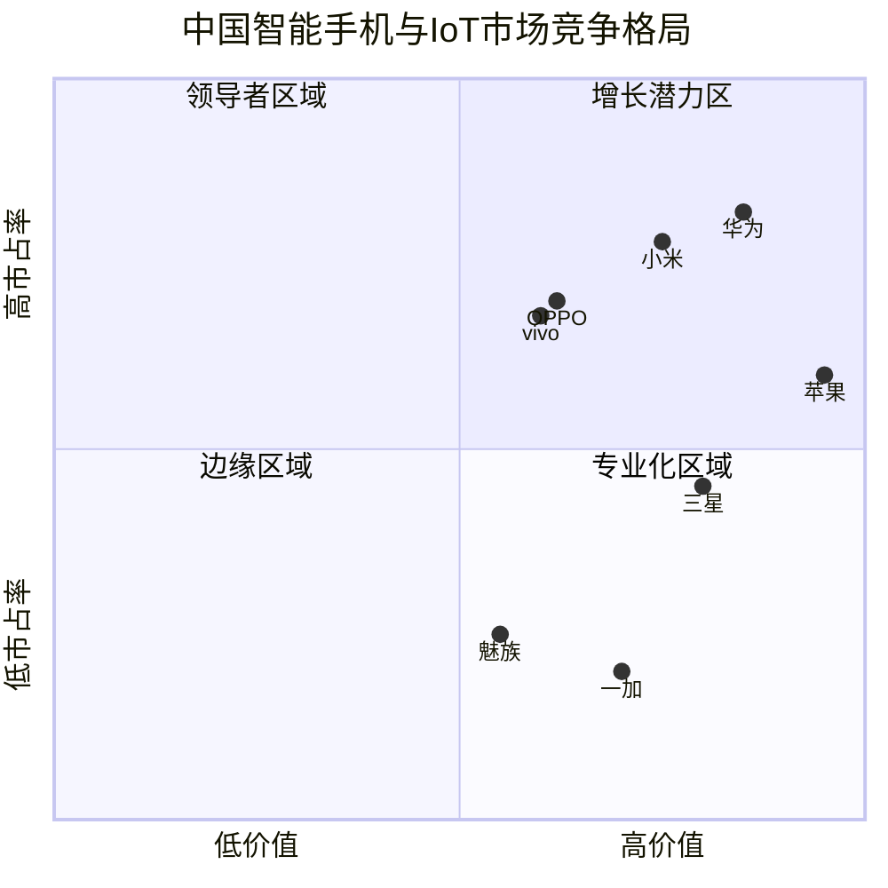
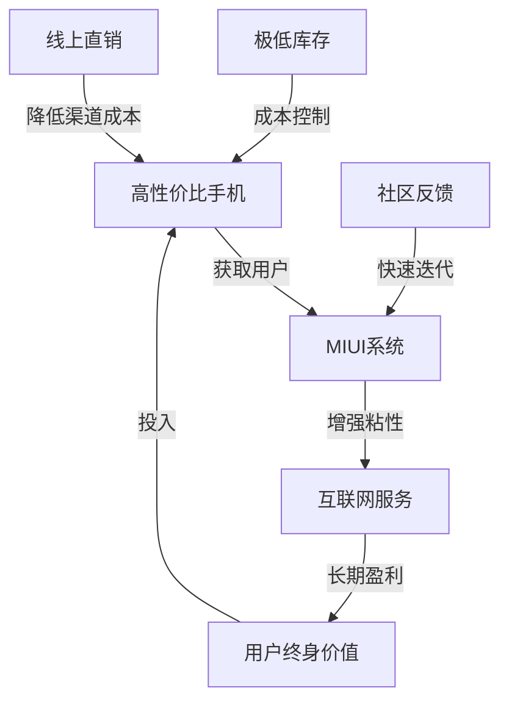
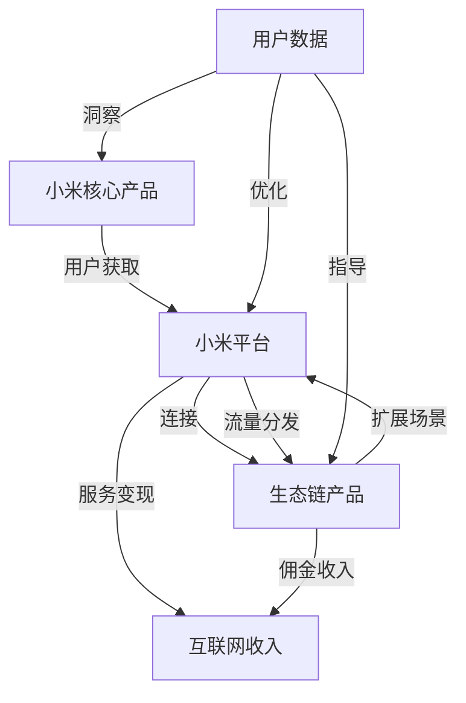
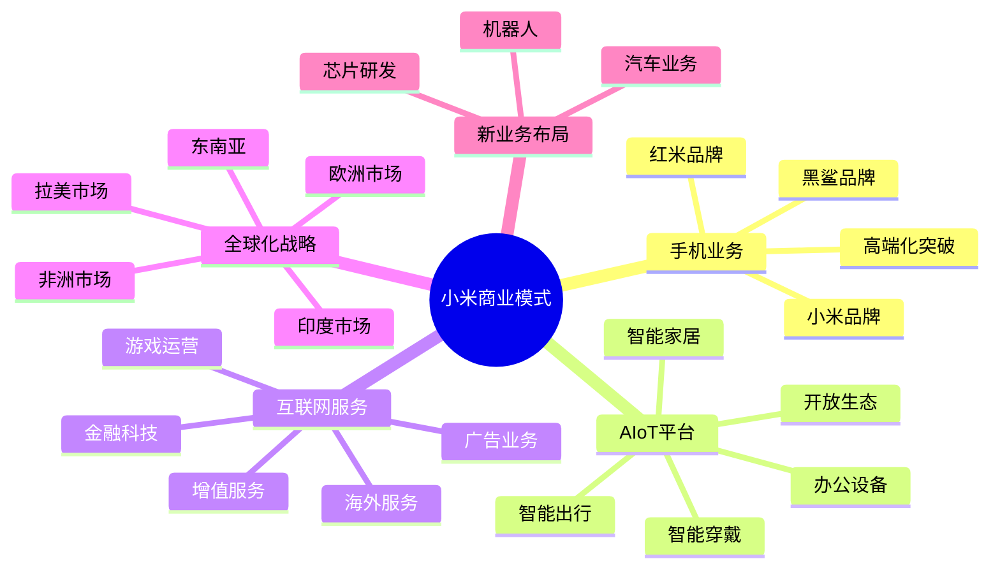
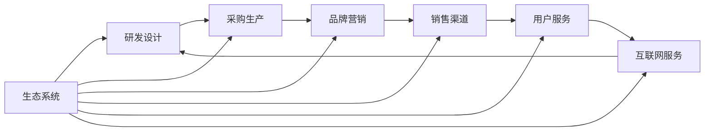

---
{"dg-publish":true,"tags":["商业分析","案例分析","小米","商业模式","互联网企业"],"created":"2024-05-18","permalink":"/知识共享/002_商业分析/03_案例/02_公司案例/小米的商业模式演变/","dgPassFrontmatter":true}
---

# 小米的商业模式演变

> [!quote] 概述
> 本案例深入分析小米公司从创立至今的商业模式演变历程，探讨其如何从一家互联网公司发展成为全球化的科技生态企业。案例聚焦于小米的战略转型点、创新商业模式设计以及生态系统构建过程，揭示其中的商业洞察与战略思考。

## 一、企业与行业背景

### 小米公司发展历程

小米科技由雷军、黎万强、洪锋等人于2010年4月创立，是一家以手机、智能硬件和IoT平台为核心的互联网公司。

**关键发展阶段**:

- **创业期(2010-2013)**：专注于MIUI和手机业务，确立"互联网思维"
- **快速增长期(2014-2016)**：扩展生态链、国际化初步布局
- **调整与转型期(2017-2018)**：面临市场竞争、重构业务战略
- **多元化生态期(2019至今)**：AIoT战略、高端化转型、全球化深化

**关键里程碑**:

| 时间 | 事件 | 战略意义 |
|------|------|---------|
| 2010年8月 | MIUI系统发布 | 奠定互联网基因和用户基础 |
| 2011年8月 | 首款手机小米1发布 | 进入硬件领域，开创新销售模式 |
| 2013年9月 | 小米电视发布 | 开始多元化布局 |
| 2014年 | 小米生态链计划启动 | 构建硬件生态系统 |
| 2015年7月 | 进入巴西等海外市场 | 国际化战略提速 |
| 2018年7月 | 香港上市 | 完成资本市场里程碑 |
| 2019年1月 | 宣布"手机+AIoT"双引擎战略 | 明确未来发展方向 |
| 2020年8月 | 进入《财富》世界500强 | 全球影响力提升 |
| 2021年3月 | 宣布造车 | 开拓新增长曲线 |

### 行业发展趋势

**智能手机行业**:
- 全球市场逐渐饱和、创新放缓、更新周期延长
- 中国市场竞争激烈，集中度提高
- 5G、AI等技术驱动产业新一轮变革
- 手机作为生态入口的价值凸显

**IoT与智能家居**:
- 市场规模快速扩大，连接设备数量爆发式增长
- 平台之争成为核心，生态系统价值提升
- 用户体验与场景化成为竞争焦点
- AI技术赋能带来智能化新体验

**消费电子行业**:
- 传统家电智能化转型
- 硬件利润率下降，软件服务价值提升
- 线上渠道占比提升，新零售模式兴起
- 用户数据与服务成为新竞争力

### 竞争格局分析

**主要竞争对手比较**:

| 企业 | 核心优势 | 商业模式特点 | 与小米差异 |
|-----|---------|------------|----------|
| **华为** | 技术研发、全场景生态 | 高投入、全栈布局、高端定位 | 更强调技术自研，高端市场定位 |
| **苹果** | 设计、体验、品牌 | 高毛利、封闭生态、服务收入 | 生态封闭，高端定位，垂直整合 |
| **OPPO/vivo** | 线下渠道、本地化服务 | 高效渠道驱动、中高端定位 | 更重视线下渠道，品牌差异化 |
| **三星** | 垂直整合、技术积累 | 全品类、全球化、组件优势 | 产业链整合度更高，全品类布局 |

## 二、小米商业模式演变分析

### 初期商业模式(2010-2013)："硬件+软件+互联网服务"三角模型

小米初创时期提出了区别于传统硬件厂商的独特商业模式：

**核心要素**:
- **硬件**: 几乎零利润销售高性价比手机
- **软件**: 自研MIUI系统，快速迭代，用户共创
- **互联网服务**: 通过增值服务、广告等实现长期盈利

**运营特点**:
- 社区驱动的产品开发模式，粉丝经济
- 饥饿营销与线上直销模式，极低渠道成本
- 互联网思维：快速迭代、口碑传播、极致性价比

**商业逻辑**:
1. 通过高性价比硬件快速获取用户
2. 依托MIUI建立用户粘性和互联网服务入口
3. 从用户终身价值中持续获利

### 中期商业模式(2014-2018)："硬件+生态链+互联网服务"生态模型

随着业务扩展，小米开始构建更广泛的生态系统：

**核心要素**:
- **多元硬件**: 手机、电视、路由器等核心产品
- **生态链**: 投资孵化100+家企业，覆盖智能家居等领域
- **平台与服务**: MIUI、米家APP等多平台整合

**运营特点**:
- "投资+孵化"的生态链模式，资源赋能
- 统一设计语言、品质标准和互联互通能力
- 轻资产扩张，共享品牌与渠道资源

**商业逻辑**:
1. 核心产品吸引用户进入生态系统
2. 生态链产品扩展用户体验边界
3. 多元产品强化平台价值和服务变现能力

### 当前商业模式(2019至今)："手机+AIoT+互联网服务"三驾马车

面对市场变化，小米进一步升级商业模式：

**核心要素**:
- **手机业务**: 全线产品矩阵，高中低全覆盖，高端化突破
- **AIoT平台**: 构建全球最大消费级IoT平台，设备互联互通
- **互联网服务**: 广告、增值服务、金融科技、海外互联网业务

**运营特点**:
- "铁人三项"战略：硬件×新零售×互联网
- 高端化战略突破与品牌升级
- 全球化战略深化，本地化运营
- 渠道多元化：线上+线下+新零售

**商业逻辑**:
1. 手机业务作为核心入口和技术创新平台
2. AIoT设备扩展用户触点和场景覆盖
3. 互联网服务实现多元变现和长期价值

## 三、商业模式转型的关键决策分析

### 决策点一：从互联网公司到硬件制造商的转型

**背景**：小米成立初期定位为互联网公司，以MIUI为核心产品。2011年，小米决定进入手机硬件领域。

**决策分析**：
- **动机**：
  - MIUI用户规模有限，增长受制于第三方ROM市场
  - 手机作为移动互联网时代的核心入口，控制硬件才能实现服务愿景
  - 当时国产智能手机市场处于起步阶段，存在大量机会

- **风险**：
  - 硬件研发与制造需要大量资金投入
  - 供应链管理复杂度高，行业壁垒高
  - 从软件到硬件需要不同的组织能力

- **执行策略**：
  - 招募谷歌Android核心人员组建手机团队
  - 采用轻资产模式，专注设计与软件，制造环节外包
  - 利用互联网直销模式降低渠道成本
  - 通过社区参与降低早期产品风险

**结果评估**：
- **短期影响**：小米手机迅速走红，创造了当时的互联网手机新品类
- **长期影响**：奠定了小米后续发展的基础，确立了硬件+互联网的双重身份
- **意外影响**：带动了国内智能手机市场的价格战和性能竞赛

### 决策点二：启动生态链战略

**背景**：2013年底，小米手机取得了巨大成功，但面临成长瓶颈和单一业务风险。

**决策分析**：
- **动机**：
  - 扩展收入来源，降低单一产品线风险
  - 扩大用户体验边界，增强生态系统黏性
  - 利用积累的品牌、渠道和用户基础创造更大价值

- **风险**：
  - 资源分散，影响核心业务发展
  - 多元化陷阱，失去聚焦
  - 生态管理难度大，品质难以统一把控

- **执行策略**：
  - 采用"投资+孵化"模式，不直接经营所有品类
  - 建立严格的生态链企业准入和管理标准
  - 共享品牌、渠道、技术和设计资源
  - 实施"主控大脑+联动传感器"的系统设计

**结果评估**：
- **短期影响**：快速扩充了产品线，构建了多元化IoT产品矩阵
- **长期影响**：形成了全球最大的消费级IoT平台，创造了持续的生态价值
- **意外影响**：部分生态链企业发展成为独立品牌(如华米科技)，对小米形成竞争

### 决策点三：推行高端化战略

**背景**：2019年后，小米在中低端市场取得了巨大成功，但高端市场突破不足，影响品牌价值和利润率。

**决策分析**：
- **动机**：
  - 提升品牌溢价能力和整体利润率
  - 应对中低端市场竞争加剧的挑战
  - 满足用户升级换代的高端需求
  - 国际市场拓展需要高端产品支撑

- **风险**：
  - 高端定位与原有"性价比"形象冲突
  - 研发投入加大，成本压力增加
  - 高端市场竞争激烈，苹果、华为等巨头把控

- **执行策略**：
  - 成立独立的"小米澎湃"高端手机部门
  - 大幅提升研发投入，突破关键技术
  - 重新定义品牌传播策略，突出创新和品质
  - 构建高端产品专属渠道和服务体系
  - 通过旗舰产品引领技术创新和品牌升级

**结果评估**：
- **短期影响**：高端机型销量稳步提升，2000元以上价位段市场份额增长
- **长期影响**：品牌形象逐步升级，研发能力和创新水平显著提高
- **挑战**：高端品牌建设是长期过程，仍面临强劲竞争压力

## 四、商业模式分析框架应用

### 商业模式画布分析

小米当前商业模式的九要素分析：

**1. 价值主张**
- 为用户提供"感动人心、价格厚道"的科技产品
- 构建融合智能设备和服务的一站式生活解决方案
- 通过智能互联带来简单高效的用户体验

**2. 客户细分**
- 核心用户：18-35岁科技爱好者，追求高性价比
- 生态用户：家庭用户，寻求智能家居整体解决方案
- 高端用户：追求品质与创新的溢价市场人群
- 全球用户：新兴市场与发达市场的差异化定位

**3. 渠道通路**
- 线上：官网、自营APP、第三方电商平台
- 线下：小米之家、授权店、合作零售商
- 新零售：线上线下融合的全渠道体验
- 全球渠道：本地化运营的多元渠道网络

**4. 客户关系**
- 社区驱动：MIUI论坛、米粉节等用户社区
- 数据驱动：个性化推荐与服务
- 服务体系：售前售后一体化服务
- 品牌互动：线上线下活动与社交媒体互动

**5. 收入来源**
- 硬件销售：手机、IoT设备、生活消费品
- 互联网服务：广告、增值服务、游戏分发
- 新零售：线下零售服务收入
- 内容服务：会员、内容分发、付费服务
- 金融服务：支付、保险、消费金融

**6. 核心资源**
- 品牌资产：小米、Redmi等系列品牌
- 技术积累：MIUI、AIoT平台、芯片研发
- 用户基础：全球活跃用户与数据资产
- 供应链管理能力：高效协同的供应链体系
- 全球化资源：国际化团队与本地化能力

**7. 关键业务**
- 产品研发：硬件、软件与服务创新
- 供应链管理：高效全球供应链运营
- 用户运营：社区与数据驱动的用户互动
- 生态系统构建：开放平台与合作伙伴发展
- 渠道建设：线上线下新零售布局

**8. 重要合作**
- 生态链企业：百余家专业硬件合作伙伴
- 供应商：关键组件与制造服务提供商
- 内容合作方：应用、游戏、视频等服务提供商
- 渠道伙伴：全球分销与零售网络
- 技术合作：芯片、算法等技术伙伴

**9. 成本结构**
- 研发投入：技术创新与产品开发
- 营销费用：品牌建设与推广
- 供应链成本：生产、物流与库存
- 生态投资：生态链企业投资与孵化
- 全球化运营：国际市场本地化成本

### 价值链分析

**研发设计环节**:
- 从"优化集成"到"自主创新"的转变
- 芯片、算法、影像等领域的技术突破
- 用户参与的开放式创新模式
- 设计语言统一化，强化品牌识别

**供应链环节**:
- "库存优化"模型，追求极致效率
- 从代工生产到部分自建工厂的转变
- 供应链垂直整合，增强关键环节控制力
- 全球化供应链布局，应对地缘政治风险

**营销与渠道环节**:
- 从单一互联网渠道到全渠道融合
- 小米之家作为体验与服务中心的价值
- 社区营销与传统品牌建设结合
- 全球化营销策略的本地化执行

**服务与运营环节**:
- MIUI作为核心服务平台的演进
- 从单一设备到多设备协同的服务体系
- 数据驱动的精准服务与个性化体验
- 互联网服务变现模式的多元化

## 五、关键商业洞察与策略分析

### 生态系统战略的价值

小米的生态系统战略是其商业模式的核心创新，具有以下特点：

**网络效应与平台价值**:
- 设备越多，连接越紧密，用户体验越佳
- 每个新品类都能带动现有产品价值提升
- 数据共享创造跨设备智能联动价值

**共生与共赢机制**:
- 生态链企业获得品牌、渠道、资源支持
- 小米获得产品线扩展与用户粘性
- 用户获得统一体验与互联互通价值

**开放与控制的平衡**:
- 开放接口与协议，吸引第三方接入
- 保持核心平台与标准的控制权
- 通过协议与认证确保体验一致性

### 用户运营与社区战略

**用户参与式创新模式**:
- MIUI每周更新，基于用户反馈快速迭代
- 内测机制发动用户参与产品打磨
- 建立从粉丝到推广者的用户发展路径

**社区价值转化路径**:
- 社区口碑建立初期品牌影响力
- 用户反馈直接影响产品决策流程
- 社区活动强化品牌认同与归属感

**数据驱动的用户洞察**:
- 通过MIUI与IoT设备收集用户行为数据
- 建立用户画像与细分模型
- 实现精准服务推送与个性化体验

### 国际化战略演进

**分阶段国际化路径**:
- 第一阶段：亚洲新兴市场（印度、东南亚）
- 第二阶段：欧洲与发达市场
- 第三阶段：全球化统一品牌与产品策略

**本地化适应策略**:
- 区域定制产品特性（如印度市场特有功能）
- 本地团队组建与决策授权
- 尊重当地法规与文化特点

**全球化挑战应对**:
- 地缘政治风险管理
- 供应链全球化布局
- 知识产权战略调整
- 多语言服务体系建设

## 六、未来发展趋势与挑战

### 潜在增长方向

**智能电动汽车**:
- 2021年宣布造车，计划十年投资100亿美元
- 利用现有渠道、用户、技术与供应链协同优势
- 将汽车视为"移动的智能空间"，而非传统代步工具

**核心技术突破**:
- 加大芯片研发投入，减少外部依赖
- 自研算法与操作系统能力提升
- 人工智能与机器学习技术投入

**全球市场深化**:
- 欧洲等发达市场的品牌升级策略
- 新兴市场本地化生产与供应链
- 海外互联网服务体系构建

### 面临的核心挑战

**价值定位转型**:
- 如何在保持"性价比"基因的同时实现品牌高端化
- 平衡产品线多元化与聚焦效率的矛盾
- 应对全球消费者需求差异化的挑战

**技术创新压力**:
- 芯片供应链安全与核心技术自主可控
- 软硬件研发投入平衡与回报周期
- 快速迭代与品质保证的平衡

**生态系统可持续性**:
- 生态链企业自主发展与系统协同的平衡
- 保持平台开放性与体验一致性的张力
- 实现多元化业务间的战略协同与资源优化

**全球化合规与本地化**:
- 不同国家数据安全与隐私法规合规
- 地缘政治风险与供应链韧性建设
- 全球统一品牌与本地化运营的平衡

## 七、战略决策模拟练习

### 情境一：高端市场突破

**背景**：小米计划在旗舰手机市场进一步提升份额，与苹果、三星等品牌直接竞争。

**关键考量因素**：
- 现有用户对小米高端产品的接受度
- 核心技术能力与创新壁垒
- 高端市场的品牌建设周期
- 渠道与服务体系升级需求
- 研发投入与回报平衡

**可能策略**：
1. **渐进式高端化**：保持现有产品线，逐步提升旗舰机型定位
2. **独立高端品牌**：创建全新高端子品牌，差异化定位
3. **突破性创新**：集中资源在特定领域（如影像、折叠屏）实现颠覆性创新
4. **生态协同高端化**：利用AIoT生态系统优势，打造差异化高端体验

**决策练习**：基于上述信息，你会建议小米采取哪种高端化策略？为什么？实施过程中应注意哪些关键风险？

### 情境二：新业务拓展决策

**背景**：小米正考虑进入新的业务领域扩展增长曲线，候选方向包括企业级服务、教育科技、健康医疗和金融科技。

**关键考量因素**：
- 与现有业务的协同性
- 市场空间与竞争格局
- 技术与资源要求
- 监管风险与门槛
- 预期回报周期

**可能策略**：
1. **企业级IoT与服务**：将消费级IoT能力延伸至企业市场
2. **健康科技**：以可穿戴设备为基础，拓展健康监测与服务
3. **教育科技**：整合硬件与内容，发展智能教育生态
4. **金融科技深化**：拓展现有支付、消费金融业务边界

**决策练习**：作为小米战略顾问，你会推荐哪个方向作为优先发展领域？请提供详细的战略路径和风险应对方案。

## 八、商业分析框架应用启示

### 方法论价值总结

**商业模式画布的应用价值**：
- 帮助全面把握小米商业模式九大要素之间的动态关系
- 揭示小米如何实现价值创造、传递与获取
- 支持识别商业模式演进过程中的关键变化点

**价值链分析的洞察**：
- 发现小米各价值环节的竞争优势来源
- 理解小米如何通过垂直整合与横向扩展创造差异化价值
- 揭示生态系统如何贯穿并增强各价值环节

**生态系统分析框架**：
- 展示平台与合作伙伴间的价值流动机制
- 理解网络效应在小米商业模式中的关键作用
- 识别生态健康度与可持续发展的关键指标

### 跨行业可借鉴的经验

**互联网思维的价值重构**：
- "先软件后硬件"的发展路径
- 用户共创与快速迭代的产品方法论
- 数据驱动的决策与运营机制

**生态构建的普适原则**：
- 开放平台与标准的建立
- 合作伙伴价值分配机制
- 生态健康度监控与干预机制

**新零售转型的实践经验**：
- 线上线下渠道融合的实施路径
- 体验中心的价值重定义
- 全渠道数据整合与应用

### 商业分析实践建议

**动态视角的价值**：
- 商业模式应被视为动态演化的系统，而非静态结构
- 定期评估商业模式各要素的适应性与竞争力
- 建立商业模式调整的早期预警指标

**整合分析框架的重要性**：
- 综合运用多种分析工具，避免单一视角局限
- 将定性分析与定量评估相结合
- 短期财务指标与长期战略价值同步考量

**用户中心的分析视角**：
- 从用户体验与价值感知出发评估商业模式
- 关注用户行为变化对商业模式的影响
- 建立用户价值与商业模式各要素的映射关系

## 参考资料

1. 雷军 (2021). *生态链战略：小米的商业模式创新*. 中信出版社.

2. 黎万强 (2018). *参与感：小米口碑营销内部手册*. 人民邮电出版社.

3. Harvard Business Review (2020). *The Xiaomi Way: Customer Engagement Strategies*.

4. Morgan Stanley Research (2022). *Xiaomi Corporation: AIoT Strategy and Global Expansion*.

5. McKinsey Quarterly (2021). *Ecosystem Business Models in the Technology Sector*.

6. Osterwalder, A., & Pigneur, Y. (2010). *Business Model Generation*. John Wiley & Sons.

7. 小米集团年报 (2020-2023).

8. IDC全球智能手机市场季度追踪报告 (2015-2023). 