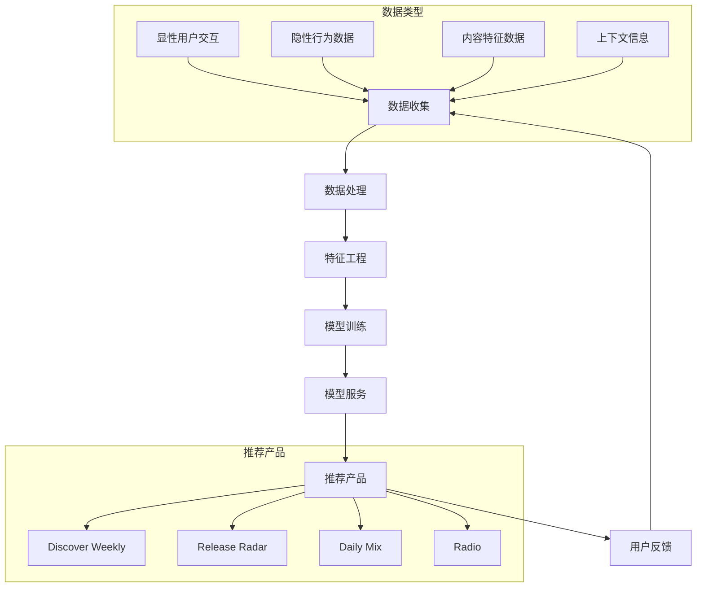

---
{"dg-publish":true,"tags":["商业分析","案例分析","Spotify","推荐系统"],"created":"2024-05-18","permalink":"/知识共享/002_商业分析/03_案例/03_产品案例/Spotify推荐系统分析/","dgPassFrontmatter":true}
---

> [!quote] 概述
> 本案例深入分析Spotify音乐推荐系统的技术架构、算法策略和商业价值，探讨其如何通过数据科学和机器学习提升用户体验并创造商业优势。案例聚焦Discover Weekly、Release Radar等核心产品功能，以及推荐系统与商业模式的协同演进。

## 一、产品与商业背景

### Spotify发展历程
- **创立阶段(2006-2011)**: 从瑞典音乐流媒体创业公司起步，专注音乐播放体验
- **成长阶段(2012-2016)**: 推出关键个性化功能，如Discover Weekly，用户规模迅速扩大
- **多元内容阶段(2017-2020)**: 拓展至播客、有声读物，增强内容多样性
- **平台生态阶段(2020至今)**: 构建创作者、听众和广告商的全方位音频平台

### 音频流媒体行业格局
- **主要竞争对手**:
  - 苹果音乐: 生态系统整合优势
  - 亚马逊音乐: Prime会员协同
  - YouTube Music: 视频内容结合
  - 本地玩家: 网易云音乐(中国)、Gaana(印度)

- **差异化竞争维度**:
  | 平台 | 内容库规模 | 音质 | 个性化程度 | 社交功能 | 多内容类型 |
  |-----|----------|-----|-----------|---------|----------|
  | Spotify | ★★★★★ | ★★★ | ★★★★★ | ★★★★ | ★★★★★ |
  | 苹果音乐 | ★★★★★ | ★★★★ | ★★★ | ★★ | ★★★ |
  | 亚马逊音乐 | ★★★★ | ★★★★★ | ★★★ | ★ | ★★★ |
  | YouTube Music | ★★★★ | ★★ | ★★★★ | ★★★ | ★★★★ |

### 推荐系统的战略定位
- **差异化关键因素**: Spotify将个性化推荐视为核心竞争优势
- **用户价值**: 解决内容发现问题，应对"选择过载"挑战
- **商业价值**: 提升用户参与度、留存率和付费转化
- **生态价值**: 为新兴艺术家创造曝光机会，丰富内容生态

### 关键业务指标
- **月活跃用户(MAU)**: 5.15亿(2023年)，其中付费用户2.05亿
- **用户参与度**: 日均使用时长2.5小时
- **内容规模**: 超过8200万首歌曲，500万+播客节目
- **推荐驱动收听**: 超过30%的音乐播放来自个性化推荐
- **用户增长率**: 年增长约20%

## 二、推荐系统技术架构与算法

### 整体技术架构
- **数据收集层**:
  - 用户显性反馈: 收藏、点赞、跳过行为
  - 用户隐性反馈: 播放时长、重复收听
  - 内容特征数据: 音频特征提取
  - 上下文数据: 时间、设备、位置信息

- **数据处理层**:
  - 批处理系统: Hadoop生态系统
  - 流处理系统: Kafka, Apache Beam
  - 特征工程管道: 构建用户和内容特征向量
  - 数据仓库: Google BigQuery

- **模型层**:
  - 协同过滤模型: 基于用户-项目交互
  - 内容分析模型: 基于音频特征
  - 深度学习模型: 神经网络架构
  - 强化学习系统: 基于用户反馈优化

- **服务层**:
  - 推荐API服务
  - 个性化产品功能
  - A/B测试框架
  - 模型监控系统

### 核心算法与技术
1. **协同过滤(Collaborative Filtering)**:
   - 基于用户的协同过滤(User-CF)
   - 基于项目的协同过滤(Item-CF)
   - 矩阵分解技术(Matrix Factorization)
   - 应用场景: 发现相似用户喜欢的音乐

2. **内容分析(Content-Based Analysis)**:
   - 原始音频特征提取
   - 深度学习音频指纹
   - 歌词和元数据分析
   - 应用场景: 推荐音频特征相似的内容

3. **深度学习模型**:
   - 卷积神经网络(CNN)处理音频特征
   - 循环神经网络(RNN)处理序列行为
   - 注意力机制(Attention)捕捉长期兴趣
   - 应用场景: 复杂特征组合和序列建模

4. **混合推荐方法**:
   - 加权混合模型
   - 级联混合策略
   - 特征增强方法
   - 应用场景: 结合多种算法优势

### 关键技术创新
- **The Echo Nest音乐DNA技术**:
  - 2014年收购的音频分析公司
  - 提取音乐风格、节奏、情绪等特征
  - 创建音乐"DNA指纹"
  - 应用于相似音乐推荐和情境化推荐

- **BaRT(Bandits for Recommendations as Treatments)**:
  - 强化学习推荐框架
  - 实时学习用户偏好
  - 平衡探索与利用(Exploration vs Exploitation)
  - 应用于主页个性化和播放列表排序

- **适应性冷启动解决方案**:
  - 新用户快速偏好学习
  - 基于少量交互的快速建模
  - 兴趣引导式问答设计
  - 加速新用户个性化体验

- **上下文感知推荐**:
  - 时间感知推荐(早晨vs晚上)
  - 场景感知推荐(工作vs锻炼)
  - 设备感知推荐(手机vs智能音箱)
  - 提升情境相关性

## 三、核心推荐产品分析

### Discover Weekly
- **产品描述**:
  - 每周一更新的30首个性化推荐歌曲
  - 基于用户历史行为和相似用户品味
  - 发现用户可能喜欢但尚未听过的音乐
  - Spotify最成功的个性化产品之一

- **技术实现**:
  - 协同过滤与内容分析混合模型
  - 矩阵分解技术识别用户-歌曲匹配度
  - 音频特征分析确保音乐风格连贯性
  - 新鲜度与相关性平衡算法

- **商业价值**:
  - 推出后用户活跃度提升40%
  - 用户留存率提升16%
  - 内容发现广度增加93%
  - 长尾内容消费增加58%

### Release Radar
- **产品描述**:
  - 每周五更新的新发行音乐推荐
  - 基于用户关注的艺术家和相似艺术家
  - 个性化的新音乐发现工具
  - 解决新内容及时发现问题

- **技术实现**:
  - 艺术家关联图谱(Artist Graph)
  - 用户-艺术家亲和度评分
  - 新发行过滤与排序算法
  - 流行度和相关性平衡策略

- **商业价值**:
  - 新音乐首周收听率提升35%
  - 小众艺术家曝光机会增加47%
  - 用户艺术家发现广度提升
  - 推动新音乐生态健康发展

### Daily Mix
- **产品描述**:
  - 1-6个不同风格的每日混合播放列表
  - 结合用户熟悉的音乐和推荐的新歌曲
  - 基于用户不同音乐兴趣群分类
  - 提供"舒适区"与发现的平衡

- **技术实现**:
  - 用户兴趣聚类算法
  - 熟悉音乐与新内容的比例优化
  - 音乐风格一致性控制
  - 动态播放列表生成

- **商业价值**:
  - 日均使用时长增加28%
  - 减少用户手动创建播放列表需求
  - 提高用户平台依赖度
  - 增强日常使用习惯

### Spotify Radio
- **产品描述**:
  - 基于种子(歌曲/艺术家/播放列表)的无限电台
  - 动态调整推荐以响应用户反馈
  - 无需手动创建播放列表的长时间收听体验
  - 用户可以点赞/跳过调整推荐方向

- **技术实现**:
  - 实时反馈学习算法
  - 种子内容特征提取和扩展
  - 序列推荐确保歌曲流动性
  - 强化学习优化长期满意度

- **商业价值**:
  - 延长单次会话时长46%
  - 降低用户决策疲劳
  - 提高音乐发现多样性
  - 增强平台粘性

## 四、推荐系统的商业价值与挑战

### 对用户价值
- **降低发现成本**:
  - 解决8200万+歌曲中的选择困难
  - 减少搜索和浏览时间
  - 增加意外发现(Serendipity)的惊喜
  - 个人音乐品味的拓展

- **个性化体验**:
  - 打造"专属于我"的音乐体验
  - 建立情感连接和平台黏性
  - 满足不同场景下的音乐需求
  - 用户感知的服务价值提升

- **价值量化**:
  - 推荐功能用户满意度提升63%
  - 用户每周发现6-8首新喜欢的歌曲
  - 93%用户认为个性化是选择Spotify的关键因素
  - 付费意愿提升31%

### 对音乐人价值
- **长尾曝光机会**:
  - 小众艺术家获得推荐展示机会
  - 减少头部效应，音乐发现民主化
  - 创造音乐多样性生态
  - 新兴艺术家成长通道

- **精准受众匹配**:
  - 将音乐推荐给最可能喜欢的听众
  - 提高转化率和粉丝获取效率
  - 降低推广成本
  - 建立忠实粉丝群体

- **价值量化**:
  - 推荐系统带动40%的新兴艺术家首次收听
  - 推荐功能为艺术家带来平均28%收入增长
  - 长尾内容在Spotify的消费占比高于行业平均15%
  - 艺术家多样性指数(创作者基尼系数)优于其他平台

### 对平台商业价值
- **用户获取与留存**:
  - 差异化竞争优势
  - 付费转化率提升
  - 用户活跃度增加
  - 品牌口碑建设

- **内容消费增长**:
  - 总收听时长提升
  - 内容覆盖广度扩大
  - 艺术家生态繁荣
  - 平台价值网络效应

- **广告和数据价值**:
  - 精准广告定向能力
  - 音乐品味数据价值
  - 消费者洞察商业化
  - 跨品类营销协同

- **价值量化**:
  - 推荐系统贡献35%的总收听时长
  - 降低15%的用户获取成本
  - 提升32%的广告点击转化率
  - 带动22%的年度营收增长

### 关键挑战与应对
1. **冷启动问题**:
   - 挑战：新用户和新内容的初始推荐质量
   - 解决方案：兴趣引导注册流程、内容特征预分析、社交关系引入

2. **推荐多样性**:
   - 挑战：避免"过滤泡沫"和用户趣味窄化
   - 解决方案：多样性指标纳入算法目标、探索与利用平衡、惊喜因子设计

3. **隐私与个性化平衡**:
   - 挑战：深度个性化与用户数据保护的权衡
   - 解决方案：本地化计算、差分隐私技术、透明的数据使用政策

4. **算法公平性**:
   - 挑战：推荐系统可能导致资源分配不公平
   - 解决方案：曝光公平性指标、艺术家多样性目标、算法偏见审计

## 五、关键决策与发展案例

### 案例一：从专家策展到算法推荐的转型
- **背景**:
  - 早期依赖音乐专家手动策展播放列表
  - 内容规模增长使人工策展难以扩展
  - 用户期待更加个性化的体验

- **决策过程**:
  - 评估人工策展与算法推荐各自优势
  - 开发能捕捉"专业品味"的算法
  - 设计人机协作的推荐框架
  
- **实施结果**:
  - 人工策展转向高层主题设定
  - 算法负责个性化和扩展
  - 形成独特的"人类策展+机器学习"混合模式
  - 保留专业品质同时实现个性化规模化

### 案例二：Discover Weekly的诞生与迭代
- **背景**:
  - 用户反馈期望更好的新音乐发现体验
  - 内部数据显示用户自建发现播放列表非常受欢迎
  - 需要一种可规模化的个性化发现解决方案

- **决策过程**:
  - 试验不同推荐算法与更新频率
  - 确定30首歌曲的最佳包装形式
  - 选择每周一固定更新建立期待感
  - 推荐透明度与神秘感平衡设计

- **实施结果**:
  - 2015年推出，迅速成为Spotify标志性功能
  - 用户参与度和社交分享超出预期300%
  - 成为获取新用户的病毒式营销工具
  - 建立推荐系统核心能力和品牌认知

### 案例三：向多媒体内容推荐扩展
- **背景**:
  - 2019年开始大力投资播客内容
  - 音乐推荐模型难以直接应用于播客
  - 跨内容类型的推荐挑战

- **决策过程**:
  - 评估不同内容类型的特征差异
  - 开发播客专用标签和分类系统
  - 设计跨媒体推荐框架
  - 用户接受度测试与迭代

- **实施结果**:
  - 构建独立的播客推荐模型
  - 开发基于内容的播客特征提取
  - 创建音乐-播客兴趣桥接算法
  - 播客参与度提升47%，成功拓展音频生态

## 六、未来发展趋势与战略布局

### 推荐技术发展方向
1. **多模态推荐**:
   - 整合音频、视频、文本多种内容形式
   - 跨媒体内容关联推荐
   - 沉浸式内容推荐体验
   - 适应元宇宙和AR/VR场景

2. **情感与语境智能**:
   - 情绪识别与音乐匹配
   - 心率等生物数据集成
   - 环境感知推荐(天气、位置)
   - 社交情境的集体推荐优化

3. **创作者协同推荐**:
   - AI辅助音乐创作推荐
   - 创作者-听众匹配优化
   - 实时反馈驱动的内容调整
   - 粉丝社区协同过滤

### 战略挑战与布局
- **竞争差异化**:
  - Apple/Amazon的生态系统整合挑战
  - 字节跳动等内容平台的算法竞争
  - 保持推荐技术领先性的投资
  - 独特数据优势的持续构建

- **商业模式演进**:
  - 推荐驱动的创作者经济
  - 推荐作为Premium会员价值
  - 针对性广告的精准推荐
  - 数据洞察变现新模式

- **合规与伦理**:
  - 适应全球数据隐私法规变化
  - 算法透明度与问责机制
  - 内容多样性与代表性平衡
  - 负责任的AI推荐原则

## 七、案例启示与行业应用

### 跨行业应用启示
1. **电商领域**:
   - 内容推荐到商品推荐的转化
   - 长尾商品发现策略
   - 情境化推荐体验设计
   - 用户冷启动解决方案

2. **内容平台**:
   - 混合推荐系统架构
   - 创作者生态支持机制
   - 内容消费习惯培养
   - 发现体验设计方法

3. **金融服务**:
   - 个性化产品推荐
   - 用户分群与特征工程
   - 透明度与信任建设
   - 上下文感知服务设计

### 关键成功要素
1. **算法与体验平衡**:
   - 技术驱动但以用户为中心
   - 数据科学与设计思维结合
   - 推荐系统作为产品而非仅是技术
   - 持续迭代验证假设

2. **规模与个性平衡**:
   - 大规模服务中的个性化
   - 标准化与定制化边界设计
   - 效率与相关性的权衡
   - 自动化与人工干预的协同

3. **商业与用户价值平衡**:
   - 推荐系统的双边市场思维
   - 短期指标与长期价值权衡
   - 平台与创作者生态共赢
   - 数据资产的战略价值观

## 八、思考题与练习

1. Spotify的推荐系统如何在满足用户熟悉音乐需求和探索新内容之间取得平衡？这一平衡对用户留存有何影响？

2. 分析Spotify推荐系统对音乐产业生态的影响，特别是对主流与非主流艺术家的资源分配。

3. 如果你是Spotify的产品经理，如何设计推荐系统的A/B测试评估框架？哪些指标最能反映真实成功？

4. 评估Spotify的推荐策略在不同文化市场(如亚洲、拉美)的适应性挑战，并提出可能的本地化解决方案。

5. 如何将Spotify的推荐系统经验应用到你所在行业的产品中？需要做哪些调整？

## 参考资源

1. Spotify Engineering Blog. (2015-2023). "Spotify Labs".

2. Johnson, C. (2020). "The Spotify Effect: How Algorithm Curation is Reshaping Music".

3. Jacobson, K., et al. (2019). "Music Personalization at Spotify". ACM RecSys.

4. McInerney, J., et al. (2018). "Explore, Exploit, and Explain: Personalizing Explainable Recommendations with Bandits". ACM RecSys.

5. Harvey, E. (2021). "Algorithmic Culture: How Spotify's Discovery Engineering is Reshaping Music Listening". 