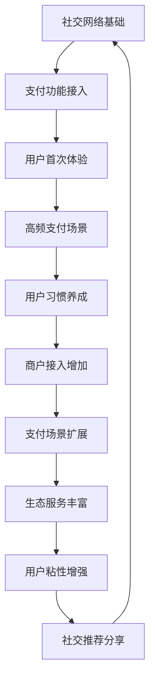
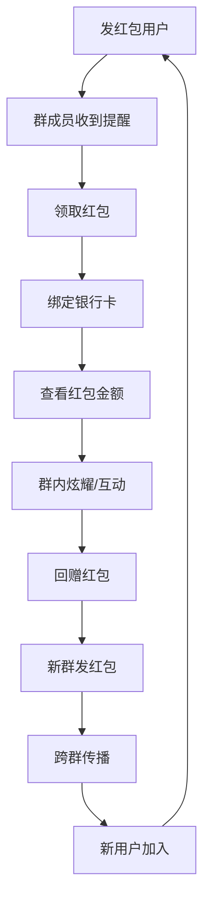
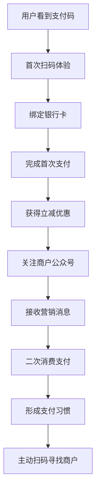

---
{"dg-publish":true,"tags":["商业分析","案例分析","微信支付","用户增长"],"created":"2024-05-18","permalink":"/知识共享/002_商业分析/03_案例/03_产品案例/微信支付用户增长分析/","dgPassFrontmatter":true}
---

# 微信支付用户增长分析

> [!quote] 概述
> 本案例分析微信支付如何在中国移动支付市场迅速崛起，成功实现从零到数亿用户的增长。案例重点探讨微信支付的用户增长策略、关键转折点和核心增长引擎，以及如何通过社交网络效应、场景创新和用户激励机制实现爆发式增长，为产品增长策略提供借鉴。

## 一、产品背景与市场环境

### 微信支付发展历程
- **推出时间**: 2013年8月正式上线
- **发展阶段**:
  1. **萌芽期(2013-2014)**: 基础功能建设，初期用户教育
  2. **快速增长期(2014-2016)**: 红包引爆用户规模，场景拓展
  3. **成熟期(2016-2019)**: 线下支付普及，生态构建
  4. **全球化探索期(2019至今)**: 跨境支付，国际市场拓展
- **当前规模**: 月活跃用户超过9亿，日均交易笔数超过10亿

### 移动支付市场分析
- **市场规模**: 中国移动支付市场交易规模超过500万亿元人民币
- **核心玩家**:
  | 公司 | 市场份额 | 主要优势 | 用户群体特征 |
  |-----|---------|---------|------------|
  | 支付宝 | 53.8% | 电商场景、金融生态 | 电商用户、投资理财人群 |
  | 微信支付 | 39.2% | 社交生态、场景覆盖 | 社交用户、年轻群体 |
  | 银联云闪付 | 3.7% | 银行系统支持、政府推动 | 传统银行用户、中老年人 |
  | 其他 | 3.3% | 垂直场景深耕 | 细分场景用户 |

### 用户需求与痛点分析
- **支付前痛点**:
  - 现金携带不便
  - 银行卡支付流程繁琐
  - 小额支付找零麻烦
  - 个人间转账困难
- **支付中痛点**:
  - 支付安全担忧
  - 操作流程复杂
  - 支付速度慢
  - 环境限制(如网络要求)
- **支付后痛点**:
  - 交易记录管理混乱
  - 退款流程复杂
  - 消费数据缺乏分析
  - 跨平台支付割裂

## 二、用户增长策略与路径

### 用户增长框架分析
- **用户获取(Acquisition)**: 
  - 微信社交网络红利
  - 春节红包病毒式传播
  - 商户合作拓展支付场景
  - 补贴与激励活动
  
- **用户激活(Activation)**:
  - 首次支付体验优化
  - 绑卡流程简化
  - 实名认证门槛降低
  - "扫一扫"直观交互
  
- **用户留存(Retention)**:
  - 日常高频场景覆盖
  - 支付安全保障机制
  - 交易记录和账单管理
  - 服务号消息提醒
  
- **用户收入(Revenue)**:
  - 商户手续费
  - 金融增值服务
  - 广告变现
  - 数据价值
  
- **用户推荐(Referral)**:
  - 群红包社交裂变
  - AA收款社交属性
  - 商户推荐返利
  - 用户间口碑传播

### 核心增长飞轮

### 阶段性增长策略演变
1. **社交关系引导期(2013-2014初)**
   - **核心策略**: 利用微信社交关系链导入支付用户
   - **关键举措**: 
     - 微信内转账免手续费
     - 朋友圈支付展示
     - 聊天中直接转账
   - **效果指标**: 
     - 首年用户规模1亿
     - 90%用户来自微信好友引导

2. **红包爆发增长期(2014春节-2015)**
   - **核心策略**: 通过春节红包激活病毒式增长
   - **关键举措**: 
     - 春节红包功能创新
     - 红包玩法设计(拼手气红包)
     - 群红包社交裂变
   - **效果指标**: 
     - 2014年春节期间绑卡用户增长超过500%
     - 单日红包收发数量超过10亿个

3. **场景拓展深耕期(2015-2017)**
   - **核心策略**: 构建多元化支付场景生态
   - **关键举措**: 
     - 公众号支付接口开放
     - 线下商户二维码推广
     - 小程序生态构建
   - **效果指标**: 
     - 月活跃商户数量突破3000万
     - 支付场景覆盖超过100个生活品类

4. **全域深度整合期(2017至今)**
   - **核心策略**: 金融服务整合与国际化布局
   - **关键举措**: 
     - 微信钱包金融服务扩展
     - 跨境支付合作
     - 行业解决方案定制
   - **效果指标**: 
     - 企业微信支付渗透率90%
     - 境外支持超过60个国家和地区

## 三、红包引爆增长的创新分析

### 红包产品设计分析
- **传统红包数字化创新**:
  - 继承传统春节红包文化
  - 数字化呈现方式(拆红包动画)
  - 金额随机性(拼手气红包)
  - 社交互动性(抢红包竞争)

- **用户心理学分析**:
  - 社交炫耀心理("我发了XX个红包")
  - 好奇心驱动(红包金额随机性)
  - 从众心理(群体都在使用)
  - 互惠原则(收到后愿意发出)

- **红包产品迭代过程**:
  | 版本 | 关键创新 | 用户反应 | 数据表现 |
  |-----|--------|---------|---------|
  | v1.0 | 一对一红包 | 好奇尝试 | 节日期间使用率20% |
  | v2.0 | 群红包功能 | 社交互动增加 | 群内参与率提升至60% |
  | v3.0 | 拼手气红包 | 病毒式传播 | 单个红包平均被8.6人抢 |
  | v4.0 | 红包封面定制 | 品牌合作增加 | 品牌曝光提升300% |

### 2014春节红包营销案例深度分析
- **背景与目标**:
  - 市场背景：移动支付市场竞争激烈，支付宝已有较大用户基础
  - 营销目标：提升微信支付用户数量，培养支付习惯
  - 预期挑战：用户绑卡意愿低，支付安全顾虑大

- **策略设计**:
  - 产品策略：简化红包发送流程，强化社交属性
  - 营销策略：5亿元补贴预算，鼓励用户发送红包
  - 时机选择：春节期间国人社交和红包需求高峰
  - 传播策略：明星代言+社交媒体+中央电视台春晚合作

- **执行过程**:
  - 前期：技术稳定性测试，服务器扩容准备
  - 中期：春晚互动高峰处理，实时监控调整
  - 后期：用户留存计划，支付场景持续引导

- **成果与影响**:
  - **直接成果**:
    - 用户数据：春节期间新增用户超过1亿
    - 绑卡比例：活跃用户绑卡率从28%提升至76%
    - 交易数据：红包收发总量超过80亿元
  
  - **长期影响**:
    - 微信支付用户行为培养：用户养成微信支付习惯
    - 市场格局改变：迅速缩小与支付宝的市场差距
    - 商业模式启示：社交+支付的融合价值显现
    - 营销创新标杆：成为社交裂变增长的经典案例

### 红包社交裂变机制解析
- **裂变路径图**:

- **裂变关键节点优化**:
  - **提醒机制**: 群聊中红包提醒醒目度设计
  - **好奇心激发**: "恭喜发财，大吉大利"标语
  - **绑卡简化**: 首次领取红包绑卡流程优化
  - **社交反馈**: 领取结果群内公开展示
  - **回馈激励**: 领取后发送便捷化设计

- **裂变效果分析**:
  - 单个红包平均传播影响7.4人
  - 新用户转化率达到46%
  - 领取红包后30分钟内回赠概率38%
  - 群红包引发的跨群分享率22%

## 四、场景构建的用户增长策略

### 支付场景分类与战略
- **基础支付场景**:
  - 个人转账：微信好友间转账
  - 群收款：群组内AA收款
  - 收付款码：个人与商户间支付
  - 公众号支付：内容消费支付

- **生活服务场景**:
  - 出行：滴滴、公交地铁、共享单车
  - 餐饮：堂食点餐、外卖支付
  - 购物：线上电商、线下超市
  - 公共服务：水电煤缴费、医疗挂号

- **娱乐社交场景**:
  - 游戏充值：手游内购
  - 内容付费：公众号付费阅读
  - 打赏：直播打赏、文章打赏
  - 会员订阅：视频会员、音乐会员

- **金融服务场景**:
  - 理财通：基金投资
  - 信用支付：微粒贷
  - 保险服务：小额保险产品
  - 城市服务：生活缴费、政务服务

### 线下支付场景拓展策略
- **商户拓展策略**:
  - **分层策略**:
    - 头部商户：直销团队一对一服务
    - 中型商户：代理商渠道覆盖
    - 小微商户：自助注册流程
  
  - **行业策略**:
    | 行业 | 重点举措 | 转化率 | 典型案例 |
    |-----|--------|-------|---------|
    | 餐饮 | 扫码点餐解决方案 | 68% | 海底捞、麦当劳 |
    | 零售 | 小额免密支付 | 72% | 7-11、沃尔玛 |
    | 交通 | NFC和扫码混合支付 | 81% | 地铁、公交 |
    | 生活服务 | 预约+支付一体化 | 57% | 美发、洗车 |
  
  - **区域策略**:
    - 一线城市：全场景覆盖
    - 二三线城市：商圈+社区模式
    - 县域市场：批发市场+集市模式
    - 乡村市场：新农村金融服务

- **线下获客转化路径**:

- **线下场景创新案例**:
  - **案例一**: 智慧菜市场改造
    - 痛点：传统菜市场现金交易不便，小摊贩收银难
    - 解决方案：统一收款码+语音播报
    - 成效：覆盖2000+菜市场，小商贩数字化率提升76%
  
  - **案例二**: 扫码公交
    - 痛点：公交小额现金支付找零麻烦，效率低
    - 解决方案：车载扫码器+优惠补贴
    - 成效：一线城市公交扫码率超过65%，高峰期效率提升28%

### 小程序生态的增长价值
- **小程序与支付的协同价值**:
  - 低门槛开发：商户快速数字化工具
  - 无需安装：用户使用摩擦最小化
  - 社交传播：支付体验可分享性
  - 闭环生态：从发现到消费闭环

- **核心数据表现**:
  - 小程序月活用户超过4亿
  - 小程序带动支付用户增长38%
  - 平均用户每月通过小程序支付6.8次
  - 小程序支付用户留存率高于APP支付30%

- **典型小程序支付场景解析**:
  | 类别 | 代表案例 | 月交易额 | 用户特征 | 增长机制 |
  |-----|---------|---------|---------|---------|
  | 零售 | 某便利店小程序 | 7.6亿元 | 年轻上班族 | 社区10分钟生活圈 |
  | 餐饮 | 某咖啡连锁小程序 | 4.2亿元 | 白领用户 | 会员积分+预点餐 |
  | 出行 | 某共享单车小程序 | 2.8亿元 | 通勤人群 | 即扫即用+月卡 |
  | 内容 | 某视频平台小程序 | 3.5亿元 | Z世代用户 | 社交分享+会员特权 |

## 五、用户激励与留存机制设计

### 支付用户激励体系
- **首次激励机制**:
  - 首次绑卡奖励
  - 首次支付立减
  - 邀请返现
  - 限时优惠券

- **持续激励机制**:
  - 积分体系
  - 支付等级特权
  - 连续支付奖励
  - 节日活动福利

- **商户联合激励**:
  - 联名优惠活动
  - 品牌专属优惠
  - 跨场景积分互通
  - 会员特殊权益

- **弱关系推广激励**:
  - 朋友圈分享奖励
  - 群红包额外福利
  - 裂变邀请奖励
  - 共同参与折扣

### 用户留存策略分析
- **留存周期策略**:
  | 周期 | 关键策略 | 目标留存率 | 实际留存率 |
  |-----|--------|----------|----------|
  | 次日留存 | 支付结果反馈 | 90% | 87% |
  | 7日留存 | 优惠券激活 | 76% | 72% |
  | 30日留存 | 高频场景培养 | 65% | 63% |
  | 90日留存 | 金融服务导入 | 58% | 56% |
  | 180日留存 | 生活服务闭环 | 52% | 49% |

- **不同用户群体留存策略**:
  - **重度社交用户**: 社交支付场景优先
  - **价格敏感用户**: 优惠券和立减金
  - **便利需求用户**: 操作流程简化
  - **商务人士**: 报销凭证和记账功能
  - **小微商户**: 经营分析和客户管理

- **流失用户召回策略**:
  - 账户安全提醒触发使用
  - 节假日特殊权益
  - 场景重新激活补贴
  - 社交关系重新连接

### 用户增长关键指标体系
- **核心漏斗指标**:
  - **获客指标**:
    - 新用户激活率
    - 获客成本(CAC)
    - 社交裂变系数
  
  - **转化指标**:
    - 首次支付完成率
    - 绑卡转化率
    - 支付失败率
  
  - **活跃指标**:
    - 日活跃用户数(DAU)
    - 月支付频次
    - 场景覆盖广度
  
  - **留存指标**:
    - 次月留存率
    - 季度活跃率
    - 年流失率
  
  - **价值指标**:
    - 客均支付金额
    - 生命周期价值(LTV)
    - LTV/CAC比率

- **指标追踪与应用**:
  - 周度增长例会检视指标
  - 月度策略调整基于指标
  - A/B测试效果评估标准
  - 团队绩效考核与指标关联

## 六、组织与技术支撑

### 增长团队组织结构
- **微信支付增长团队架构**:
  - 产品增长：负责产品体验和转化优化
  - 用户运营：负责用户激活和留存
  - 商户拓展：负责支付场景扩展
  - 数据分析：负责增长指标监测和分析
  - 营销策划：负责活动策划和执行
  - 技术支持：负责增长工具和基础设施

- **跨部门协作机制**:
  - 增长委员会：高管层面增长战略决策
  - 敏捷增长小组：快速测试和迭代
  - 用户体验委员会：体验标准统一
  - 增长黑客马拉松：创新增长点发掘

### 技术平台对增长的支撑
- **支付核心系统架构**:
  - 高并发支持：春节红包峰值处理能力
  - 故障隔离：多层级容灾备份
  - 实时监控：交易异常实时预警
  - 风控系统：智能风险控制

- **数据能力建设**:
  - 用户画像系统
  - 行为分析平台
  - A/B测试框架
  - 智能推荐引擎
  - 欺诈检测系统

- **增长技术工具**:
  - 动态红包金额算法
  - 社交传播路径追踪
  - 留存预警模型
  - 场景智能推荐
  - 用户增长仪表盘

## 七、增长挑战与未来趋势

### 当前增长面临的挑战
- **市场挑战**:
  - 支付市场趋于饱和，获客成本攀升
  - 竞争对手策略模仿和创新
  - 监管环境趋严，合规成本增加
  - 用户隐私保护与数据应用平衡

- **产品挑战**:
  - 核心场景创新难度加大
  - 用户支付习惯已形成，转换成本高
  - 安全与便捷的平衡日趋复杂
  - 不同用户群体需求差异化

### 应对策略与未来方向
- **增长策略调整**:
  - 从规模增长转向价值增长
  - 从广覆盖转向深耕场景
  - 从单一支付转向金融生态
  - 从国内市场转向全球布局

- **技术创新方向**:
  - 生物识别支付：刷脸支付、声纹支付
  - 物联网支付：智能设备自动支付
  - 区块链应用：跨境支付和清算
  - AI辅助决策：个性化金融服务推荐

- **场景创新趋势**:
  - 产业支付：供应链金融服务
  - 内容生态：知识付费和创作者经济
  - 虚拟经济：数字藏品和虚拟商品
  - 乡村振兴：农村金融普惠服务

### 未来三年增长展望
- **用户规模预测**:
  - 国内用户增长放缓，年增长率5%
  - 海外用户潜力显现，年增长率25%
  - 商户数量稳定增长，年增长率15%
  - 小程序生态用户增长，年增长率20%

- **业务形态演进**:
  - 支付+金融：综合金融服务平台
  - 支付+商业：数字商业基础设施
  - 支付+产业：产业互联网赋能工具
  - 支付+出海：全球华人生态服务

## 八、案例启示与实践指导

### 用户增长关键成功因素
1. **生态优势引领**: 依托微信社交生态红利
2. **场景驱动增长**: 多元化支付场景覆盖
3. **社交裂变机制**: 基于社交关系的传播效应
4. **极简用户体验**: 降低使用门槛和摩擦
5. **技术平台支撑**: 高并发处理能力和稳定性

### 不同阶段增长策略总结
- **0-1阶段(启动期)**:
  - 聚焦核心场景，不求全面覆盖
  - 利用现有流量入口导流
  - 简化首次体验流程
  - 建立初期信任机制

- **1-10阶段(加速期)**:
  - 寻找爆发性增长点(如红包)
  - 构建病毒式传播机制
  - 快速迭代产品体验
  - 扩展支付场景覆盖

- **10-100阶段(规模期)**:
  - 构建多元化场景生态
  - 完善用户留存机制
  - 建立数据驱动决策体系
  - 平衡安全与便捷性

- **100+阶段(成熟期)**:
  - 深耕垂直场景价值
  - 探索商业模式多元化
  - 构建金融服务生态
  - 开拓国际化市场

### 跨行业应用指导
- **互联网产品增长启示**:
  - 社交关系是最具价值的增长引擎
  - 场景创新比功能创新更重要
  - 用户激励需与核心行为紧密关联
  - 数据驱动的快速迭代是关键

- **传统企业数字化启示**:
  - 支付是数字化转型的关键入口
  - 会员体系与支付的结合创造粘性
  - 线上线下一体化体验是趋势
  - 从客户痛点出发设计支付流程

### 增长实践操作指南
1. **增长目标设定**:
   - 设定清晰可衡量的北极星指标
   - 分解为可执行的子目标
   - 建立短期与长期目标平衡
   - 全团队对目标达成共识

2. **增长策略选择**:
   - 基于用户旅程找出关键卡点
   - 分析竞品优劣势制定差异化策略
   - 资源聚焦于高杠杆点的改进
   - 构建可持续的增长模型

3. **增长实验设计**:
   - 小规模快速试错
   - 建立科学的A/B测试体系
   - 明确成功指标和失败标准
   - 建立增长知识库积累经验

4. **增长团队建设**:
   - 跨职能敏捷小组组织
   - 培养数据驱动的决策文化
   - 建立增长激励机制
   - 持续学习与创新精神

## 九、案例讨论与思考

1. 微信支付与支付宝在用户增长策略上有何本质区别？为什么微信支付能够在后发情况下迅速追赶？

2. 红包作为爆发增长点的成功，是否可以被其他产品复制？需要具备哪些条件？

3. 如果你是微信支付的产品负责人，面对市场饱和的情况，你会选择哪些方向作为下一阶段的增长点？

4. 对比国内外移动支付的发展路径差异，微信支付模式在国际市场推广面临哪些挑战？

5. 随着数字人民币的推广，微信支付未来的增长战略应如何调整？

## 参考资源与延伸阅读

1. 腾讯研究院. (2020). 《中国移动支付发展报告》.

2. Chen, L., & Nath, R. (2020). "Business patterns and innovation in the mobile payment ecosystem: The case of WeChat Pay in China". Journal of Asian Business Studies.

3. 艾瑞咨询. (2022). 《中国第三方支付行业研究报告》.

4. 清华大学金融科技研究院. (2021). 《社交网络与支付行为研究》.

5. 中国人民银行. (2022). 《非银行支付机构监管政策解读》. 