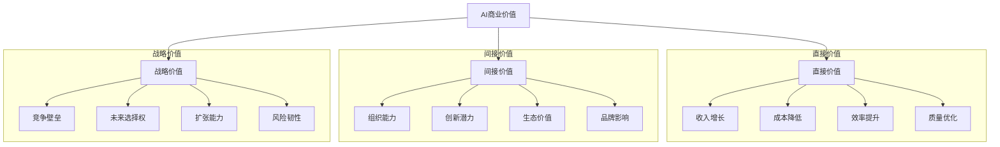

---
{"dg-publish":true,"tags":["商业分析","案例分析","人工智能","AI应用","跨领域"],"created":"2024-05-18","permalink":"/知识共享/002_商业分析/03_案例/04_跨领域案例/AI应用商业价值分析/","dgPassFrontmatter":true}
---

# AI应用商业价值分析

> [!quote] 概述
> 本案例深入分析人工智能技术在不同行业的商业应用价值，探讨AI如何转化为实际业务成果并创造竞争优势。案例聚焦于AI应用的价值评估框架、投资回报计算和价值实现路径，通过多个行业实例揭示AI项目从概念到落地的关键决策点和成功要素。

## 一、AI商业应用现状与价值评估框架

### AI商业应用发展阶段
- **探索期(2010-2015)**: 技术可行性验证，有限场景试点
- **初步应用期(2016-2019)**: 单点业务场景落地，ROI验证
- **规模化阶段(2020-2022)**: 全面业务集成，价值链重构
- **转型赋能期(2023至今)**: AI驱动商业模式创新，组织能力重塑

### 全球AI商业投资与回报概况
- **投资规模**: 2023年全球AI商业投入超过1500亿美元
- **增长率**: 年均增速35-40%，其中生成式AI投资增速超过120%
- **价值分布**:
  | 行业 | 投资占比 | 价值实现周期 | 投资回报率区间 |
  |-----|---------|------------|--------------|
  | 金融服务 | 28% | 6-18个月 | 125-300% |
  | 医疗健康 | 15% | 12-36个月 | 80-200% |
  | 零售消费 | 14% | 3-12个月 | 150-400% |
  | 制造业 | 12% | 9-24个月 | 100-250% |
  | 公共服务 | 8% | 18-48个月 | 50-150% |
  | 其他行业 | 23% | 6-30个月 | 75-225% |

### AI商业价值评估框架
- **直接价值维度**:
  - **收入增长**: 销售提升、客户获取、产品创新
  - **成本优化**: 流程自动化、资源效率、风险降低
  - **时间加速**: 决策速度、上市时间、响应速率
  - **质量提升**: 精准度、一致性、安全性

- **间接价值维度**:
  - **组织能力**: 数据驱动文化、算法思维、智能决策
  - **创新潜力**: 商业模式创新、产品服务创新
  - **生态价值**: 合作伙伴网络、数据价值网
  - **可持续发展**: 资源优化、环境影响、社会价值

### AI价值评估方法
1. **投资回报模型(ROI)**:
   - 成本因素: 技术投入、人才成本、数据成本、集成成本
   - 收益因素: 收入增长、成本节约、生产力提升、风险降低
   - 计算方法: (总收益-总成本)/总成本
   - 时间维度: 短期(1-2年)、中期(2-5年)、长期(5年+)

2. **总体经济影响(TEI)**:
   - 有形价值: 可直接量化的财务价值
   - 无形价值: 品牌、客户体验、员工满意度
   - 风险调整: 不确定性和风险因素考量
   - 未来选择权: 战略灵活性和机会价值

3. **价值实现周期**:
   - 价值实现曲线: 投入期→拐点期→回报期→维持期
   - 加速因素: 清晰应用场景、敏捷实施、变革管理
   - 延迟因素: 技术复杂度、组织阻力、数据质量
   - 可持续性评估: 长期价值维持能力

## 二、行业AI应用案例与价值分析

### 案例一：金融行业—智能风控系统
- **应用背景**:
  - 大型商业银行针对中小企业贷款的智能风控系统
  - 传统风控流程周期长(7-15天)，准确率有限(80%左右)
  - 需平衡风险控制与客户体验的矛盾

- **AI解决方案**:
  - 机器学习风险评分模型(1000+特征)
  - 非结构化数据分析(财报、新闻、社交媒体)
  - 知识图谱构建企业关联风险
  - 实时交易监控与异常检测

- **价值量化**:
  - 风控决策时间: 从平均8天缩短至30分钟
  - 风险识别准确率: 从82%提升至93%
  - 审批人力需求: 减少65%，重新分配至增值业务
  - 贷款违约率: 降低28%，年节约风险成本4.2亿元
  - 客户满意度: 提升32个百分点
  - ROI: 实施18个月后达到310%

- **关键价值点**:
  - 效率与准确性平衡突破
  - 海量非结构数据价值挖掘
  - 专家经验与算法智能融合
  - 风控向前移动，从被动防御到主动预测

### 案例二：医疗行业—AI辅助诊断
- **应用背景**:
  - 三甲医院放射科AI辅助诊断系统
  - 影像诊断工作量大，医生资源有限
  - 诊断质量依赖个人经验，一致性挑战

- **AI解决方案**:
  - 深度学习模型的医学影像分析
  - 多模态医疗数据整合分析
  - 基于证据的辅助诊断建议
  - 诊断结果可解释性设计

- **价值量化**:
  - 诊断效率: 医生单位时间诊断量提升38%
  - 诊断准确率: 肺结节检出率提升22%，误诊率降低15%
  - 医疗资源分配: 专家时间向复杂病例倾斜增加35%
  - 患者等待时间: 平均缩短46%
  - 诊断一致性: 同一病例不同医生诊断一致性提高28%
  - ROI: 实施2年后达到165%

- **关键价值点**:
  - 人机协作新模式创造
  - 专业医疗资源优化配置
  - 医疗服务可及性提升
  - 诊断标准化与个性化平衡

### 案例三：零售行业—全渠道智能营销
- **应用背景**:
  - 全国连锁零售商的全渠道智能营销系统
  - 线上线下用户行为数据割裂
  - 个性化营销效率和精准度不足

- **AI解决方案**:
  - 客户360度画像与细分系统
  - 需求预测与个性化推荐引擎
  - 全渠道营销自动化编排
  - 营销效果归因与优化闭环

- **价值量化**:
  - 营销转化率: 从平均2.3%提升至5.8%
  - 客单价: 提升18%
  - 营销ROI: 提升41%
  - 客户全生命周期价值(LTV): 增长26%
  - 库存周转率: 提升22%
  - 项目投资回报率: 实施12个月后达到280%

- **关键价值点**:
  - 千人千面超精准营销
  - 线上线下融合体验创造
  - 库存与营销协同优化
  - 从产品导向转向客户导向

### 案例四：制造业—智能工厂质量控制
- **应用背景**:
  - 高端电子制造商的生产线质量控制系统
  - 传统抽检方式效率低，成本高
  - 缺陷早期发现与追溯困难

- **AI解决方案**:
  - 计算机视觉实时检测系统
  - 预测性质量分析模型
  - 缺陷根因智能分析
  - 自适应质量控制参数

- **价值量化**:
  - 缺陷检出率: 从92%提升至99.5%
  - 误判率: 从8%降低至0.8%
  - 质检人力需求: 减少70%
  - 产品返修率: 降低65%
  - 客户投诉: 减少43%
  - 年度质量成本: 节约2800万美元
  - ROI: 实施15个月后达到240%

- **关键价值点**:
  - 100%全检与高效率的突破
  - 从发现问题到预防问题
  - 质量数据闭环推动工艺改进
  - 质量控制从成本中心转为价值中心

## 三、价值链视角的AI应用分析

### 研发与创新环节
- **核心应用场景**:
  - 智能产品设计与仿真
  - 研发流程自动化
  - 创新趋势与机会识别
  - 专利分析与知识挖掘

- **价值实现机制**:
  - 缩短产品开发周期平均38%
  - 提高创新成功率约25%
  - 降低研发资源需求15-30%
  - 扩大创新想法来源3-5倍

- **典型案例**:
  - P&G的AI辅助产品配方设计: 开发周期缩短62%
  - 特斯拉的AI驱动设计迭代: 验证周期减少78%
  - 拜耳的AI药物发现平台: 候选化合物筛选效率提高15倍

### 生产与运营环节
- **核心应用场景**:
  - 智能制造与工艺优化
  - 预测性维护
  - 供应链优化与协同
  - 质量控制与追溯

- **价值实现机制**:
  - 提升生产效率15-35%
  - 减少停机时间30-50%
  - 降低库存成本20-30%
  - 提高资源利用率15-25%

- **典型案例**:
  - 西门子智能工厂: 生产效率提升25%，不良率降低78%
  - 联合利华AI供应链: 库存水平降低30%，服务水平提升15%
  - 波音飞机制造AI质检: 检测速度提高300%，准确率提高17%

### 营销与销售环节
- **核心应用场景**:
  - 智能客户细分与定位
  - 预测性销售分析
  - 个性化推荐与营销
  - 销售自动化与增强

- **价值实现机制**:
  - 提高营销转化率25-45%
  - 增加客单价10-25%
  - 优化获客成本15-30%
  - 提升销售预测准确性30-50%

- **典型案例**:
  - 星巴克的深度个性化推荐: 会员消费频次提升34%
  - 阿迪达斯的AI零售体验: 门店转化率提升21%
  - 亚马逊的智能定价系统: 利润率提高18%

### 客户服务与体验环节
- **核心应用场景**:
  - 智能客服与聊天机器人
  - 情感分析与客户洞察
  - 个性化服务体验
  - 主动式服务预测

- **价值实现机制**:
  - 降低客服成本40-60%
  - 提升问题解决率25-40%
  - 缩短响应时间70-90%
  - 提高客户满意度15-30%

- **典型案例**:
  - 美国运通AI客服: 解决率提升35%，成本降低42%
  - 沃尔玛的智能服务系统: 客户问题解决时间减少65%
  - KLM航空的AI旅客体验: 客户满意度提升29%

## 四、AI价值实现的关键成功因素

### 业务价值导向
- **明确的价值目标**:
  - 从业务KPI逆向定义AI价值
  - 建立清晰可衡量的成功指标
  - 确立阶段性价值里程碑
  - 数据到价值的闭环验证

- **场景优先级策略**:
  - 高价值-低复杂度场景优先
  - 短期价值与长期潜力平衡
  - 可扩展场景优先布局
  - 影响力示范场景策略性选择

- **最小可行价值(MVP)方法**:
  - 快速验证价值假设
  - 迭代增强价值实现
  - 避免完美主义陷阱
  - 基于反馈的动态调整

### 组织能力建设
- **跨职能协作模式**:
  - 业务-技术-数据团队融合
  - 端到端价值交付责任制
  - 敏捷开发与价值交付
  - 知识与经验共享机制

- **人才与技能战略**:
  - AI+业务复合型人才培养
  - "三明治"人才结构设计
  - 技能提升与转型支持
  - 内外部人才协同生态

- **文化与领导力**:
  - 数据驱动的决策文化
  - 实验创新的容错环境
  - 高层领导的坚定支持
  - 变革管理的系统方法

### 数据与技术基础
- **数据战略与治理**:
  - 以价值为导向的数据资产规划
  - 数据质量与可用性保障
  - 数据权责明确与合规
  - 数据资产价值评估机制

- **AI技术架构选择**:
  - 可扩展的AI技术架构
  - 业务需求与技术能力匹配
  - 自研与采购的平衡策略
  - 技术债务管理与演进路径

- **AI道德与负责任实践**:
  - 算法透明度与可解释性
  - 隐私保护与安全防护
  - 多样性与公平性考量
  - 可持续发展与社会影响

## 五、AI商业价值实现路径与方法论

### 价值识别阶段
- **业务价值机会地图**:
  - 全面梳理业务流程与挑战
  - 确定高潜力AI应用场景
  - 估算潜在价值空间
  - 绘制价值机会优先级矩阵

- **价值假设验证**:
  - 建立清晰价值假设
  - 快速原型设计与测试
  - 小规模试点验证
  - 调整价值预期与路径

### 价值创造阶段
- **端到端价值设计**:
  - 业务流程重设计
  - 人机协作模式定义
  - 数据价值流设计
  - 价值衡量框架建立

- **敏捷价值交付**:
  - 价值导向的开发迭代
  - 持续集成与部署
  - 用户反馈快速响应
  - 价值实现的敏捷调整

### 价值扩展阶段
- **规模化部署策略**:
  - 从点到面的扩展路径
  - 标准化与本地化平衡
  - 赋能工具与最佳实践
  - 组织变革与流程重塑

- **持续价值优化**:
  - 价值实现监控机制
  - 持续学习与改进循环
  - 新价值机会识别
  - 技术与业务协同进化

### 价值可持续阶段
- **AI价值生态构建**:
  - 内外部价值网络构建
  - 跨组织数据价值共享
  - 合作伙伴生态协同
  - 开放创新与共赢机制

- **能力内化与转型**:
  - AI能力组织嵌入
  - 数字化转型与AI融合
  - 商业模式创新引导
  - 长期战略竞争力构建

## 六、未来趋势与战略启示

### 新兴AI价值趋势
1. **生成式AI商业应用浪潮**:
   - 内容创作与生产效率提升
   - 个性化体验极致化
   - 设计与创新流程变革
   - 知识工作自动化新阶段

2. **跨域融合创造新价值空间**:
   - AI+IoT+区块链的价值组合
   - 数字孪生+AI的决策智能
   - 元宇宙+AI的沉浸式体验
   - 量子计算+AI的算力突破

3. **AI民主化与普惠价值**:
   - 低代码/无代码AI平台普及
   - AI能力服务化与组件化
   - 中小企业AI应用门槛降低
   - 垂直行业AI解决方案成熟

### 战略启示与建议
- **企业领导者**:
  - 将AI从技术议题提升为战略议题
  - 建立价值导向的AI投资组合
  - 培养组织AI思维与能力
  - 平衡短期价值与长期转型

- **业务与产品负责人**:
  - 从流程优化走向体验与模式创新
  - 构建数据与AI驱动的价值链
  - 建立AI赋能的产品开发体系
  - 发展新型人机协作模式

- **AI与数据团队**:
  - 建立业务价值为核心的工作方法
  - 提升AI可解释性与可信性
  - 平衡前沿探索与价值落地
  - 构建AI伦理与负责任实践

## 七、思考与讨论

1. 在评估AI投资价值时，有形价值与无形价值应如何平衡？企业如何避免纯粹基于短期ROI的决策陷阱？

2. 不同行业的AI价值实现周期和路径有何差异？这些差异对AI战略制定有何影响？

3. 如何在组织中建立有效的AI价值衡量框架？传统业务KPI与AI特定指标如何融合？

4. 生成式AI技术对各行业的价值创造模式将带来哪些根本性变革？企业应如何应对？

5. AI伦理、公平性和透明度等因素如何影响AI的长期商业价值？企业应采取哪些措施确保负责任的AI应用？

## 参考资源

1. McKinsey Global Institute. (2023). "The Economic Potential of Generative AI".

2. Harvard Business Review. (2022). "A Framework for Measuring AI's Economic Impact".

3. MIT Sloan Management Review. (2023). "Capturing Value from AI Investments".

4. World Economic Forum. (2023). "Global AI Value Index".

5. Accenture Research. (2022). "AI: Built to Scale - From Experimental to Exponential". 