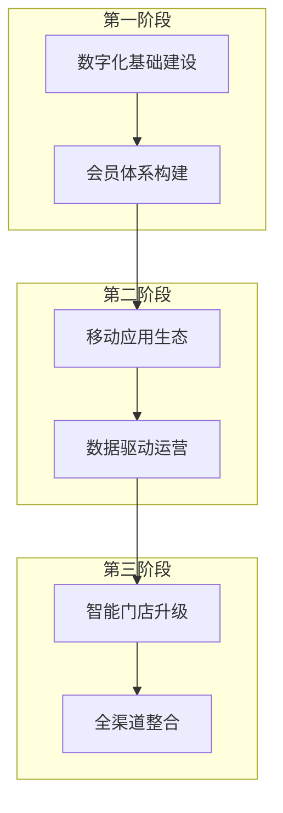

---
{"dg-publish":true,"tags":["商业分析","案例分析","数字化转型","跨领域"],"created":"2024-05-18","permalink":"/知识共享/002_商业分析/03_案例/04_跨领域案例/数字化转型成功案例分析/","dgPassFrontmatter":true}
---

> [!quote] 概述
> 本案例深入分析星巴克（Starbucks）数字化转型的全过程，探讨传统零售餐饮企业如何成功实现从线下实体店模式向数字化赋能的全渠道体验转变。案例聚焦于星巴克的数字化战略、会员体系、移动应用和数据驱动决策，提炼出跨行业可借鉴的数字化转型经验。

### 企业概况
- **公司简介**: 成立于1971年，全球最大的咖啡连锁企业，约35,000家门店遍布80多个国家
- **业务模式**: 以实体门店销售高品质咖啡饮品和食品为主，辅以周边商品零售
- **核心价值观**: 创造"第三空间"体验、高品质产品、企业社会责任
- **发展阶段**: 从传统零售门店模式发展为集数字化、体验式、品牌化于一体的全渠道咖啡文化企业

### 行业发展趋势
- **咖啡连锁市场**: 全球市场持续增长，但增速放缓，竞争加剧
- **消费习惯变化**: 消费者便利性需求上升，外卖和线上订购比例提高
- **数字化浪潮**: 餐饮零售行业全面数字化转型，新进入者以数字原生姿态挑战传统企业
- **客户体验升级**: 个性化、便捷化、社交化成为行业发展趋势

### 转型前的业务挑战
1. **增长瓶颈**: 实体店模式扩张空间有限，同店销售增长困难
2. **客户粘性不足**: 缺乏有效的客户忠诚度管理系统
3. **数据价值未挖掘**: 大量交易数据未被系统分析和利用
4. **新兴竞争威胁**: 数字原生咖啡品牌崛起，如瑞幸咖啡等
5. **客户便捷性需求**: 排队等候时间影响客户体验和门店效率

### 宏观环境因素
- **技术环境**: 移动互联网普及、大数据分析技术成熟、云计算基础设施完善
- **消费环境**: 数字化消费习惯形成，移动支付普及
- **竞争环境**: 传统与新兴品牌竞争加剧，数字化成为核心差异化能力
- **疫情影响**: COVID-19加速线上线下融合，非接触式服务需求上升

## 二、数字化转型战略与目标

### 转型战略框架
- **以客户为中心**: 打造无缝衔接的全渠道客户体验
- **数据驱动决策**: 建立完整数据分析体系指导业务发展
- **技术赋能运营**: 利用数字技术提升运营效率和服务质量
- **生态系统构建**: 发展超越咖啡的数字化生活方式生态

### 战略目标
1. **提升客户粘性**: 增加客户访问频率和单次消费额
2. **扩展接触点**: 突破实体门店限制，创造多元化客户接触渠道
3. **优化运营效率**: 减少排队等待时间，提高门店运营效率
4. **增强预测能力**: 通过数据分析实现精准库存和人力管理
5. **创造新增长点**: 开发数字化带来的新业务模式和收入来源

### 转型路径规划

### 与竞争对手策略对比
- **传统咖啡连锁**: 多数仍专注实体门店体验，数字化程度有限
- **新兴咖啡品牌**: "互联网+"思维，以APP为核心构建运营模式
- **星巴克差异化**: 线上线下体验深度融合，保持品牌一致性的同时实现数字化转型

## 三、核心转型项目与实施

### 项目一：星巴克会员忠诚度计划(Starbucks Rewards)
- **项目描述**:
  - 构建数字化会员体系，替代传统卡片式会员计划
  - 引入积分制度和星级会员分层机制
  - 提供会员专属权益和个性化优惠
- **技术实施**:
  - 云端会员数据管理系统
  - 实时积分计算和权益发放平台
  - 会员行为分析和标签管理系统
- **业务整合**:
  - 与POS系统深度集成，实现实时积分累计
  - 与营销活动系统关联，支持精准营销
  - 与供应链管理系统连接，支持会员消费分析

### 项目二：星巴克移动应用(Starbucks App)
- **项目描述**:
  - 开发全功能移动应用，支持移动支付、订单预点和外送
  - 集成会员体系，显示积分余额和可用权益
  - 提供门店查询、菜单浏览和个性化推荐
- **技术实施**:
  - 移动应用开发(iOS/Android)
  - 支付系统安全架构设计
  - 位置服务和门店导航集成
  - 推送通知和营销信息系统
- **业务整合**:
  - 与门店POS系统实时连接，支持移动订单
  - 与库存管理系统集成，确保菜单可用性
  - 与CRM系统对接，提供个性化体验

### 项目三：移动订单与支付系统(Mobile Order & Pay)
- **项目描述**:
  - 允许顾客提前在APP上下单并支付
  - 到店后直接取走已准备好的饮品，跳过排队环节
  - 提供订单状态实时跟踪和准备完成提醒
- **技术实施**:
  - 订单管理系统开发
  - 门店工作流程管理系统
  - 实时通知系统
  - 负载均衡和高并发处理
- **业务整合**:
  - 重新设计门店工作流程，增加专人负责移动订单
  - 调整店面布局，增设移动订单取餐区
  - 培训员工适应数字化订单处理流程

### 项目四：数据分析平台(Deep Brew)
- **项目描述**:
  - 构建AI驱动的数据分析平台
  - 整合交易数据、会员数据、门店运营数据等多源数据
  - 实现销售预测、个性化推荐、库存优化等功能
- **技术实施**:
  - 大数据存储和处理架构
  - 机器学习和AI模型开发
  - 可视化分析工具开发
  - 数据安全和隐私保护机制
- **业务整合**:
  - 为营销决策提供数据支持
  - 指导库存管理和门店排班
  - 驱动个性化推荐引擎

### 项目五：数字化供应链
- **项目描述**:
  - 构建端到端可视化供应链管理系统
  - 实现从咖啡豆采购到门店配送的全链路数字化
  - 建立预测性补货和智能库存管理
- **技术实施**:
  - 供应链管理软件实施
  - IoT设备部署用于仓储监控
  - 预测算法开发用于需求预测
  - 与门店POS和订单系统集成
- **业务整合**:
  - 改进仓储和物流管理流程
  - 优化门店库存水平和补货频率
  - 减少产品损耗和缺货情况

## 四、数字化转型成效分析

### 关键业务指标改善
- **销售增长**: 数字渠道贡献销售额达到总额的25%+
- **客户粘性**: 会员复购率提升35%，会员消费占比超过50%
- **运营效率**: 移动订单处理时间比传统点单减少40%
- **数据价值**: 通过个性化推荐提升客单价15%
- **成本优化**: 库存周转率提升25%，减少浪费

### 客户体验提升
- **便捷性**: 排队等待时间平均减少7分钟
- **个性化**: 基于历史购买提供个性化推荐和优惠
- **全渠道一致性**: 线上线下体验无缝衔接
- **互动性**: 通过APP增加品牌互动频次，平均每周3次以上
- **会员感知**: 会员满意度提升28%

### 数字化能力建设
- **数据资产**: 构建统一客户数据平台，整合2亿+会员数据
- **技术架构**: 建立云原生应用架构，支持高并发和快速迭代
- **人才结构**: 数字技术人才占比从5%提升至20%
- **组织调整**: 成立专门的数字创新部门，直接向CEO汇报
- **创新文化**: 建立数字化创新孵化机制和评估体系

### 商业模式创新
- **收入多元化**: 数字渠道带来新的收入流，如电商和送餐服务
- **会员经济**: 从交易模式转向会员关系经营模式
- **数据变现**: 将数据洞察转化为新产品开发和营销决策
- **生态扩展**: 从咖啡零售商向生活方式服务平台扩展

## 五、关键决策点分析

### 决策点一：自建技术团队 vs 外包开发
- **决策背景**: 早期数字化转型面临技术能力不足的挑战
- **选项分析**:
  | 选项 | 优势 | 劣势 |
  |-----|------|------|
  | 完全自建团队 | 掌控核心技术，灵活响应变化 | 人才招募困难，成本高 |
  | 全部外包 | 快速实现，前期投入少 | 依赖性强，缺乏差异化 |
  | 混合模式 | 平衡速度和掌控力 | 管理协调复杂 |
- **最终决策**: 采用混合模式，核心系统自建，非核心功能外包
- **决策结果**: 成功平衡了开发速度和技术掌控力，但在系统整合方面遇到一些挑战

### 决策点二：会员体系设计
- **决策背景**: 需要将传统会员卡升级为数字化会员体系
- **选项分析**:
  | 选项 | 优势 | 劣势 |
  |-----|------|------|
  | 简单积分制 | 易理解，实施简单 | 差异化不足，吸引力有限 |
  | 多层级会员体系 | 提供身份认同，增强粘性 | 管理复杂，成本较高 |
  | 消费金额制 | 直接刺激消费 | 可能忽视高频低额消费者 |
- **最终决策**: 采用积分制+星级会员分层的复合模式
- **决策结果**: 会员注册率和活跃度大幅提升，但初期会员规则复杂度引起部分用户困扰

### 决策点三：移动支付与订单系统整合
- **决策背景**: 移动订单系统与现有门店运营流程存在冲突
- **选项分析**:
  | 选项 | 优势 | 劣势 |
  |-----|------|------|
  | 完全分离系统 | 实施简单，风险小 | 体验割裂，效率低 |
  | 深度整合 | 体验一致，效率高 | 实施复杂，改造成本大 |
  | 分阶段整合 | 平衡风险和体验 | 过渡期体验不佳 |
- **最终决策**: 选择深度整合路径，重新设计门店流程和POS系统
- **决策结果**: 初期门店适应困难，但长期显著提升了效率和客户体验

## 六、实施挑战与应对策略

### 技术挑战
1. **系统整合复杂性**: 新旧系统整合困难，数据同步问题
   - **应对策略**: 采用API优先架构，构建中间层实现系统互通
2. **移动应用性能**: 高峰期APP响应慢，用户体验受影响
   - **应对策略**: 引入微服务架构和边缘计算，优化负载均衡
3. **数据安全与隐私**: 客户数据保护和合规要求提高
   - **应对策略**: 实施端到端加密和严格的访问控制，通过合规认证

### 组织挑战
1. **数字化能力不足**: 传统零售员工缺乏数字技能
   - **应对策略**: 大规模数字化培训，引入技术人才，建立数字创新团队
2. **部门协作壁垒**: IT与业务部门沟通不畅，目标不一致
   - **应对策略**: 实施敏捷开发方法，业务和IT混合团队，共同KPI
3. **变革阻力**: 门店员工对新系统和流程存在抵触
   - **应对策略**: 变革管理计划，早期参与者激励，成功案例内部推广

### 业务挑战
1. **线上线下体验一致性**: 数字渠道与实体店体验割裂
   - **应对策略**: 全渠道体验设计原则，统一会员权益和产品策略
2. **门店运营效率**: 移动订单增加导致门店工作流程混乱
   - **应对策略**: 重新设计店内布局，专门区域处理移动订单
3. **传统客户适应性**: 部分年长客户难以适应数字化服务
   - **应对策略**: 保留传统服务渠道，提供门店数字化辅导服务

### 实施过程中的关键调整
1. **会员积分规则简化**: 初期规则过于复杂，用户理解困难
   - **调整**: 简化积分获取和使用规则，增加规则透明度
2. **移动订单处理流程优化**: 高峰期订单堆积问题
   - **调整**: 引入实时容量管理，基于门店忙碌度动态调整接单量
3. **数据分析策略重新聚焦**: 初期分析项目过多，缺乏重点
   - **调整**: 聚焦3-5个核心业务KPI，建立数据驱动决策流程

## 七、跨行业启示与借鉴

### 传统零售行业启示
1. **全渠道整合**: 实体店与数字渠道应无缝衔接，而非简单并存
2. **会员体系数字化**: 从"卡片会员"到"体验会员"的转变
3. **店内流程重设计**: 数字化要求重新思考实体店的运营模式

### 餐饮行业启示
1. **移动订单策略**: 厨房流程和空间设计需适应数字订单
2. **个性化推荐机制**: 利用购买历史提供个性化餐饮建议
3. **库存和原料管理**: 数据驱动的需求预测减少食材浪费

### 服务业通用启示
1. **客户数据价值**: 构建统一客户视图，实现精准服务
2. **体验设计原则**: 数字化不是技术堆砌，而是体验重塑
3. **员工角色转变**: 数字化转型需要员工角色和技能的同步提升

### 数字化转型关键成功因素
1. **领导层坚定承诺**: 星巴克CEO直接推动数字化战略
2. **产品与技术融合**: 咖啡专业性与数字便捷性平衡
3. **客户中心设计**: 从客户痛点出发设计数字化解决方案
4. **数据闭环管理**: 建立从数据收集到应用的完整闭环
5. **持续迭代优化**: 采用敏捷方法，快速试错和持续改进

## 八、未来发展展望

### 数字化转型下一阶段
1. **AI赋能个性化**: 深度学习驱动的超个性化体验
2. **增强现实应用**: AR技术融入门店和APP体验
3. **智能门店进化**: IoT和边缘计算驱动的智能空间
4. **区块链应用**: 咖啡豆产地追溯和可持续发展认证
5. **生态系统扩展**: 从咖啡零售向生活方式平台拓展

### 行业发展趋势
1. **无人零售技术**: 自动化和无接触服务普及
2. **数据伦理与隐私**: 隐私计算等技术平衡数据应用和保护
3. **可持续发展压力**: 数字化助力绿色转型和社会责任
4. **元宇宙商业探索**: 虚拟世界中的品牌体验和社交消费

### 潜在风险与应对
1. **技术依赖风险**: 系统故障可能导致业务中断
   - **应对**: 构建韧性架构，有效的灾备机制
2. **数据隐私压力**: 数据收集和使用面临监管趋严
   - **应对**: 前瞻性隐私保护设计，用户数据透明度提升
3. **数字鸿沟挑战**: 不同客群数字化接受度差异
   - **应对**: 普惠设计，保留多种服务渠道

## 九、思考与练习

1. 分析星巴克数字化转型与其他餐饮零售企业的关键差异，为什么星巴克能够成功？
2. 如果你是一家传统服装零售企业的数字化负责人，如何借鉴星巴克的经验制定数字化战略？
3. 星巴克的会员体系设计有哪些核心要素？这些要素如何适配到其他行业？
4. 评估星巴克移动应用的核心功能，分析其对业务的贡献度排序。
5. 设计一个传统企业数字化转型的评估框架，包含关键指标和阶段性目标。

## 参考资源

1. Starbucks Corporation. (2019-2023). Annual Reports and Investor Presentations.
2. Harvard Business Review. (2021). "Starbucks' Digital Transformation: Building a Bridge to the Future".
3. McKinsey & Company. (2022). "The Next-Generation Operating Model for the Digital World".
4. MIT Sloan Management Review. (2020). "Leading Digital Transformation: The Starbucks Way".
5. Johnson, K. (2018). Starbucks Technology Vision. Starbucks Investor Day Presentation. 