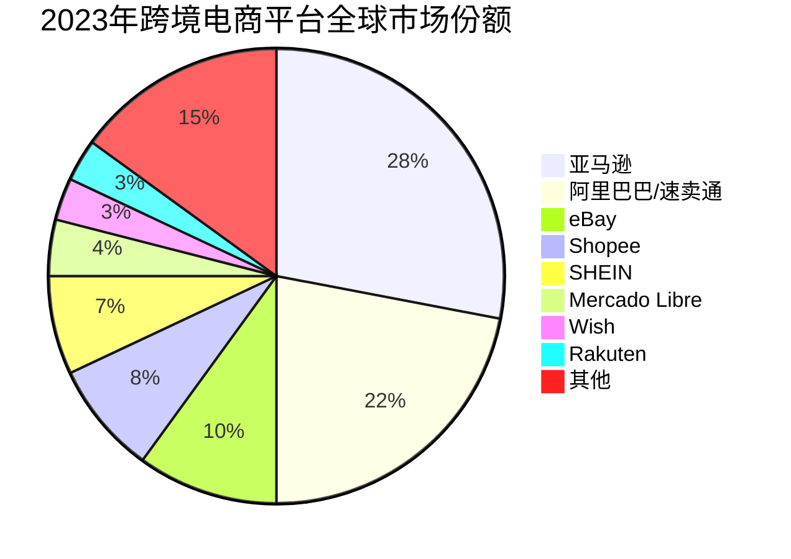
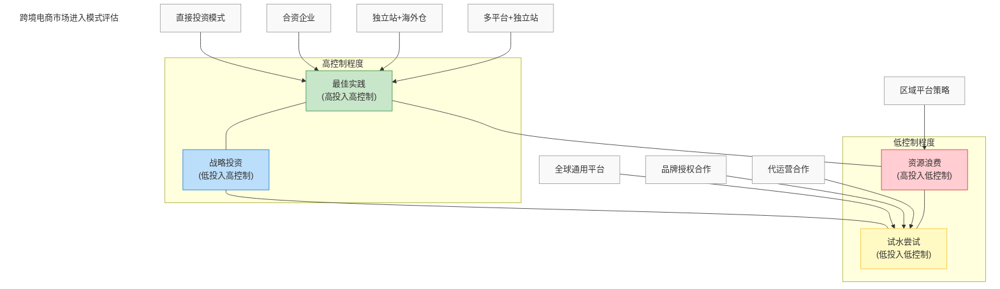
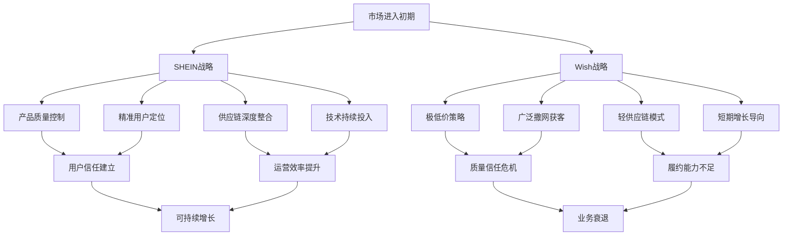
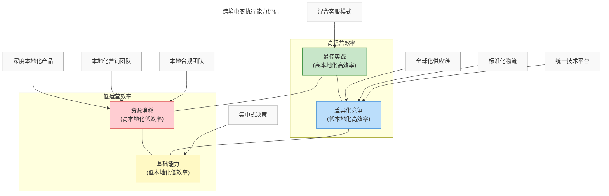
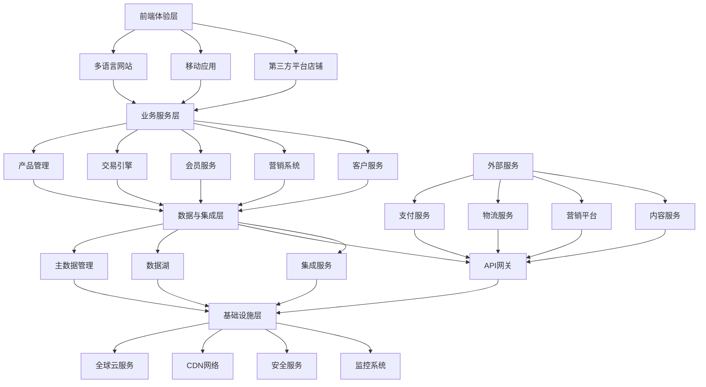
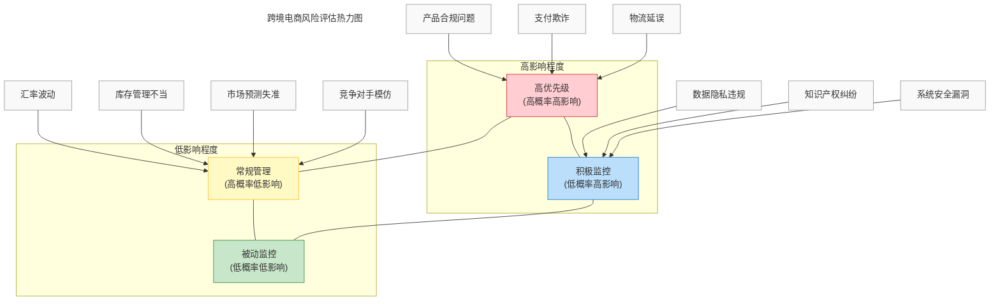

---
{"dg-publish":true,"tags":["商业分析","案例分析","跨境电商","市场进入","国际化"],"created":"2024-05-19","permalink":"/知识共享/002_商业分析/03_案例/04_跨领域案例/跨境电商市场进入策略/","dgPassFrontmatter":true}
---

> [!quote] 概述
> 本案例深入探讨企业如何制定有效的跨境电商市场进入策略，分析不同类型企业面对全球化机遇时的战略选择、实施路径与风险管理方法。案例结合多个成功与失败实例，提炼出跨境电商扩张的关键成功因素、常见陷阱与系统性分析框架。
### 1.1 市场规模与增长趋势

跨境电商作为全球贸易的新兴渠道，近年来呈现快速增长态势。

**全球市场规模**：
- 2023年全球跨境电商交易额达到约7.9万亿美元
- 预计2025年将增长至10.6万亿美元
- 跨境电商占全球电子商务总额的比例从2018年的15%提升至2023年的22%

**区域市场差异**：
| 区域 | 市场规模(2023) | 年增长率 | 渗透率 | 主要特点 |
|------|--------------|---------|--------|---------|
| 亚太 | 3.2万亿美元 | 24% | 25% | 移动端为主、社交电商兴起 |
| 欧洲 | 2.1万亿美元 | 16% | 23% | 区域一体化、严格合规要求 |
| 北美 | 1.8万亿美元 | 14% | 18% | 成熟消费者、品牌忠诚度高 |
| 拉美 | 0.5万亿美元 | 28% | 15% | 增长迅速、支付挑战 |
| 中东非 | 0.3万亿美元 | 32% | 12% | 潜力巨大、基础设施待完善 |

**主要增长驱动因素**：
- 数字支付基础设施全球普及
- 物流网络国际化与效率提升
- 语言与文化障碍降低
- 消费者对国际商品接受度提高
- 新兴市场中产阶级崛起
- 疫情加速全球数字化消费转型

### 1.2 市场格局与平台生态

跨境电商市场呈现多元化竞争格局，不同类型平台各具特色。

**主要参与者类型**：

1. **全球综合电商平台**：
   - 亚马逊：基于自建物流网络的全球扩张
   - 阿里巴巴/速卖通：连接中国供应链与全球市场
   - eBay：C2C与B2C结合的跨境交易模式

2. **区域性电商平台**：
   - 欧洲：Zalando、Otto
   - 东南亚：Lazada、Shopee
   - 拉美：Mercado Libre
   - 中东：Noon、Jumia

3. **垂直类跨境电商**：
   - 时尚领域：SHEIN、ASOS
   - 电子产品：Newegg
   - 奢侈品：Farfetch
   - 生活方式：Wayfair

4. **独立站服务提供商**：
   - Shopify：提供全球化电商解决方案
   - BigCommerce：跨境电商建站与运营工具
   - Wix：多语言多货币站点工具

**平台市场份额对比**：

**平台生态系统特点**：
- **亚马逊模式**：封闭生态、全流程控制、Prime会员体系
- **阿里模式**：开放平台、交易撮合、服务市场完善
- **独立站模式**：品牌自主、全渠道整合、数据掌控
- **社交电商模式**：内容驱动、病毒式传播、精准定位

### 1.3 跨境电商价值链分析

跨境电商完整价值链包含多个环节，各环节均存在特定挑战与机遇。

**核心价值链环节**：

1. **产品与供应链**：
   - 供应商选择与管理
   - 产品本地化适配
   - 品质控制与合规保障
   - 供应弹性与风险管理

2. **平台与渠道**：
   - 平台选择与组合
   - 店铺运营与优化
   - 算法与搜索排名
   - 多渠道协同管理

3. **营销与获客**：
   - 跨文化营销策略
   - 多语言内容创建
   - 本地化用户获取
   - 数据驱动的精准营销

4. **物流与履约**：
   - 国际物流方案设计
   - 清关与合规处理
   - 本地仓储与配送
   - 退换货管理

5. **支付与财务**：
   - 多币种支付解决方案
   - 汇率风险管理
   - 税务合规与优化
   - 资金跨境流动

6. **客户服务**：
   - 多语言客户支持
   - 跨时区服务保障
   - 本地化服务标准
   - 用户反馈与优化

**价值链整合程度对比**：

| 整合模式 | 特点 | 优势 | 劣势 | 适用企业类型 |
|---------|------|------|------|------------|
| 全链路控制 | 自建或深度整合所有环节 | 体验一致性、数据打通 | 投入大、扩张慢 | 大型平台、成熟品牌 |
| 核心环节控制 | 掌控关键环节，外包非核心环节 | 平衡效率与控制 | 协调复杂、部分风险 | 中型品牌、垂直电商 |
| 轻资产模式 | 专注产品与营销，外包物流履约 | 快速启动、低投入 | 体验不一致、依赖第三方 | 小型品牌、创业企业 |
| 平台依赖模式 | 全面依托第三方平台服务 | 便捷高效、风险低 | 议价能力弱、平台依赖 | 微小卖家、试水企业 |

## 二、市场进入策略框架

### 2.1 进入模式分类

企业可根据自身条件与目标市场特点，选择不同的跨境电商市场进入模式。

**主要进入模式**：

1. **平台进入模式**：
   - **全球通用平台策略**：通过亚马逊、eBay等全球平台快速进入多个市场
   - **区域平台策略**：针对特定区域选择当地主流平台
   - **垂直平台策略**：选择与产品类别匹配的专业平台
   - **多平台组合策略**：同时布局多个平台分散风险

2. **独立站模式**：
   - **全球统一站点**：单一网站服务全球市场，多语言多货币支持
   - **区域差异化站点**：针对不同区域市场建立定制化站点
   - **平台+独立站混合**：平台引流，独立站建立品牌与私域流量

3. **合作与收购模式**：
   - **品牌授权合作**：与目标市场本地分销商合作
   - **合资企业**：与当地企业成立合资公司
   - **收购整合**：收购目标市场现有电商企业
   - **代运营合作**：委托专业跨境电商代运营机构

4. **直接投资模式**：
   - **海外仓模式**：在目标市场建立仓储物流中心
   - **本地公司设立**：成立当地法律实体开展业务
   - **线上线下融合**：结合电商与线下展示体验中心

**不同模式对比分析**：

### 2.2 目标市场选择框架

科学的目标市场选择对跨境电商成功至关重要，应基于多维度分析。

**市场评估维度**：

1. **市场基本面**：
   - 市场规模与增长率
   - 电商渗透率与发展阶段
   - 跨境购物接受度
   - 人口结构与消费能力

2. **竞争与产品契合度**：
   - 竞争格局与集中度
   - 本地替代品情况
   - 产品差异化空间
   - 目标用户需求匹配度

3. **基础设施与便利性**：
   - 物流网络完善度
   - 支付系统发展水平
   - 互联网普及率
   - 移动端使用习惯

4. **政策与合规**：
   - 关税与贸易政策
   - 市场准入限制
   - 消费者保护法规
   - 数据隐私要求

5. **文化与本地化难度**：
   - 语言障碍程度
   - 文化差异与适应性
   - 消费习惯特殊性
   - 本地化资源需求

**市场优先级评分模型**：

| 评估维度 | 权重 | 评分标准(1-5分) |
|---------|------|----------------|
| 市场潜力 | 25% | 市场规模、增长率、购买力 |
| 进入难度 | 20% | 竞争格局、准入壁垒、本地化要求 |
| 运营成本 | 20% | 获客成本、物流成本、合规成本 |
| 产品适配性 | 20% | 需求匹配度、价格敏感度、使用习惯 |
| 战略协同性 | 15% | 与全球战略契合度、资源共享可能性 |

### 2.3 分阶段进入策略

成功的跨境电商市场进入通常采用分阶段渐进式策略，降低风险并优化资源配置。

**典型阶段划分**：

**第一阶段：市场试探**
- 目标：验证产品市场适配性，积累初步经验
- 策略：选择全球通用平台，小规模测试
- 资源投入：轻量级，依托平台服务
- 关键指标：产品接受度、初始转化率、用户反馈

**第二阶段：扩张深耕**
- 目标：建立稳定业务模式，扩大市场份额
- 策略：多平台布局，考虑建立独立站
- 资源投入：中度投入，开始建立本地团队
- 关键指标：销售增长率、客户获取成本、重复购买率

**第三阶段：本地化整合**
- 目标：深度融入目标市场，建立品牌认知
- 策略：建立本地化供应链与服务网络
- 资源投入：大规模投入，可能设立本地实体
- 关键指标：市场份额、品牌认知度、运营效率

**第四阶段：生态构建**
- 目标：建立完整跨境业务生态，实现规模效应
- 策略：全渠道整合，可能通过并购扩张
- 资源投入：战略性投入，构建竞争壁垒
- 关键指标：盈利能力、生态协同效应、长期增长潜力

**不同行业阶段调整建议**：

| 行业类别 | 第一阶段重点 | 第二阶段重点 | 第三阶段重点 | 典型案例 |
|---------|------------|------------|------------|---------|
| 快消品 | 产品组合测试 | 物流网络优化 | 本地化营销 | 宝洁全球店铺 |
| 服饰类 | 风格接受度检验 | 尺码本地化 | 社交媒体营销 | SHEIN扩张 |
| 电子产品 | 合规认证 | 售后服务网络 | 本地创新适配 | 小米全球化 |
| 生活家居 | 运输解决方案 | 产品本地化设计 | 体验中心建设 | Wayfair国际化 |

## 三、案例分析：成功与失败对比

### 3.1 成功案例解析：SHEIN的全球扩张

**公司背景**：
SHEIN成立于2008年，从一家小型婚纱出口商发展成为全球领先的快时尚跨境电商，2023年估值达1000亿美元，业务覆盖超过150个国家。

**市场进入策略**：

1. **平台选择与演进**：
   - 起步阶段：通过eBay、亚马逊测试产品适配性
   - 成长阶段：建立自有APP与网站，减少平台依赖
   - 成熟阶段：打造集社交、电商、内容于一体的生态系统

2. **目标市场聚焦**：
   - 初期聚焦于欧美市场的年轻女性消费者
   - 逐步向中东、拉美等新兴市场扩张
   - 针对不同市场特点调整产品组合和营销策略

3. **供应链创新**：
   - 构建小批量、快反应的柔性供应链
   - 采用"测试-分析-扩大"的迭代式产品开发
   - 数据驱动设计，缩短从设计到上架周期至7-10天

4. **技术与数据驱动**：
   - 建立全球化用户行为分析系统
   - 利用AI预测流行趋势和需求变化
   - 基于用户数据持续优化产品与营销

**成功关键点**：

- **敏捷性与适应力**：小批量测试，快速迭代，减少库存风险
- **本地化策略深度**：针对不同市场定制化营销和产品策略
- **社交媒体营销创新**：KOL合作、用户生成内容激励
- **价格优势保持**：直连供应链，消除中间环节
- **技术基础设施投入**：构建全球化的技术平台支持业务扩张

**面临挑战与应对**：

| 挑战 | 应对策略 | 结果 |
|------|---------|------|
| 产品质量争议 | 建立供应商评级系统，增加质检环节 | 质量问题投诉减少40% |
| 物流时效问题 | 建立全球仓储网络，开发智能物流路由 | 配送时间缩短50% |
| 可持续性压力 | 推出环保材料系列，建立回收项目 | 改善品牌形象，吸引环保消费者 |
| 数据合规要求 | 区域化数据存储，提升隐私保护 | 满足GDPR等全球法规要求 |

### 3.2 失败案例警示：Wish的市场策略失误

**公司背景**：
Wish成立于2010年，曾是全球增长最快的跨境电商平台之一，2018年估值达110亿美元，但之后业务急剧下滑，2021年上市后股价暴跌90%以上。

**市场进入战略失误**：

1. **质量与信任危机**：
   - 过度追求低价策略，忽视产品质量控制
   - 未能建立有效的卖家管理机制
   - 消费者信任度持续下降

2. **物流体验不佳**：
   - 配送时间过长（平均25-30天）
   - 包装与产品描述不符问题频发
   - 退换货流程复杂且时间长

3. **短期增长与长期价值失衡**：
   - 过度依赖大规模补贴获取用户
   - 营销投入与用户留存不成比例
   - 获客成本持续攀升而复购率下降

4. **监管合规应对不足**：
   - 欧盟产品安全法规违规问题
   - 税务合规与海关清关挑战
   - 数据隐私保护措施不足

**失败关键教训**：

- **产品质量是跨境电商的生命线**：低价无法弥补质量缺陷
- **用户体验需全链路设计**：从浏览到收货的一致性体验
- **合规风险必须前置管理**：跨境合规是战略而非战术问题
- **增长必须建立在健康经济模型基础上**：盲目追求GMV增长不可持续
- **平台信誉一旦受损难以恢复**：负面口碑传播速度远快于正面营销

**数据对比分析**：

### 3.3 新兴成功模式：独立DTC品牌出海

**模式概述**：
近年来，以直接面向消费者(Direct-to-Consumer)模式为核心的独立品牌跨境扩张成为新趋势，这些品牌通常专注特定品类，拥有强烈的品牌定位和忠实用户群体。

**代表案例：Allbirds的全球化之路**

**背景**：
Allbirds成立于2016年，以可持续材料制造的舒适鞋履起家，从线上直销起步，逐步扩展至全球市场。

**市场进入策略特点**：

1. **以独立站为核心**：
   - 建立全球化独立电商网站，统一品牌体验
   - 避免过度依赖第三方平台，控制客户关系
   - 数据驱动的用户体验优化

2. **线上线下融合**：
   - 战略性开设全球关键城市线下体验店
   - 线下店铺作为品牌形象展示与客户教育中心
   - 全渠道库存管理与会员体系

3. **可持续发展差异化**：
   - 环保材料与生产流程作为核心卖点
   - 碳足迹透明化，建立情感连接
   - 本地化社区参与和环保倡议

4. **阶段性市场扩张**：
   - 先北美，后欧洲、亚太，聚焦城市而非国家
   - 每个新市场都经过小规模测试再扩大投入
   - 根据市场反馈调整产品与营销策略

**成功要素分析**：

- **品牌价值主张清晰**：产品、故事、价值观的一致性传达
- **全球化与本地化平衡**：保持品牌核心的同时适应本地需求
- **产品力作为基础**：解决真实问题的产品创新
- **社区驱动增长**：粉丝经济与口碑传播
- **渠道策略自主**：掌控用户关系与数据

**DTC模式在不同市场的调整**：

| 市场 | 进入策略调整 | 渠道组合 | 关键成功因素 |
|------|------------|---------|------------|
| 北美 | 独立站+自营社交 | 90%线上+10%线下 | 品牌故事与价值观共鸣 |
| 欧洲 | 增加本地支付方式，适应GDPR | 80%线上+20%线下 | 可持续发展认证与透明度 |
| 亚太 | 部分市场增加平台旗舰店 | 60%线上+40%线下 | 本地KOL合作与线下体验 |
| 新兴市场 | 与当地分销商合作 | 因市场而异 | 价格策略与支付便利性 |

## 四、关键成功要素分析

### 4.1 战略层面成功因素

跨境电商市场进入在战略层面的关键成功因素：

1. **明确的目标与定位**：
   - 清晰界定目标市场与客户群体
   - 制定差异化竞争策略
   - 明确品牌定位与价值主张
   - 设定合理的阶段性目标

2. **资源与能力匹配**：
   - 评估内部资源与市场需求的匹配度
   - 识别核心能力与竞争优势
   - 制定资源投入计划与优先级
   - 构建全球化人才储备

3. **灵活适应的进入模式**：
   - 基于风险承受能力选择进入模式
   - 建立可调整的阶段性路径图
   - 保持战略选项的灵活性
   - 设计退出机制与风险缓释计划

4. **全球化与本地化平衡**：
   - 标准化与定制化的平衡策略
   - 全球一致的品牌与本地化的体验
   - 集中决策与本地自主的权衡
   - 规模效应与市场适应性的协调

**战略成熟度评估框架**：

| 维度 | 初级阶段 | 成长阶段 | 成熟阶段 |
|------|---------|---------|---------|
| 市场定位 | 机会主导型扩张 | 聚焦特定市场/品类 | 组合策略与系统布局 |
| 业务模式 | 单一渠道依赖 | 多渠道协同 | 全渠道生态系统 |
| 组织架构 | 总部集中决策 | 区域中心管理 | 矩阵式全球治理 |
| 技术基础 | 项目式解决方案 | 区域平台建设 | 全球化数字架构 |
| 品牌战略 | 产品输出为主 | 品牌本地化适应 | 全球品牌与本地共鸣 |

### 4.2 战术与执行层面成功因素

在执行层面，跨境电商市场进入的关键成功因素包括：

1. **产品策略优化**：
   - 基于市场需求的产品组合设计
   - 本地化产品调整与创新
   - 价格策略与定位匹配
   - 包装与展示本地化适配

2. **供应链弹性建设**：
   - 多层次供应商网络构建
   - 区域供应基地布局
   - 预测与库存优化系统
   - 质量控制与合规管理

3. **全球物流网络设计**：
   - 战略性海外仓布局
   - 多模式物流解决方案
   - 最后一公里配送优化
   - 跨境退换货流程设计

4. **本地化营销体系**：
   - 多语言内容创建框架
   - 文化适应性营销策略
   - 本地社交媒体生态适应
   - 数据驱动的精准营销

5. **合规与风险管理**：
   - 多国税务与海关合规体系
   - 知识产权保护策略
   - 数据隐私与安全框架
   - 全球支付风险管控

**执行能力评估矩阵**：

### 4.3 常见陷阱与规避策略

跨境电商市场进入过程中的典型陷阱及其规避策略：

1. **盲目多市场同时进入**：
   - 陷阱表现：资源分散，无法形成规模效应
   - 规避策略：优先级排序，聚焦突破，滚动扩张
   - 成功案例：Gymshark先深耕英美市场，再逐步扩展

2. **过度依赖单一平台**：
   - 陷阱表现：平台规则变化带来巨大风险
   - 规避策略：多渠道布局，建立自有流量池
   - 成功案例：Anker从亚马逊起步，发展到多渠道并重

3. **忽视文化与消费习惯差异**：
   - 陷阱表现：产品与营销未本地化，接受度低
   - 规避策略：深入市场调研，本地团队参与决策
   - 成功案例：美团外卖在国际化时对产品做深度本地化调整

4. **低估合规与监管要求**：
   - 陷阱表现：合规问题导致业务中断和声誉损失
   - 规避策略：前置合规评估，建立监管跟踪机制
   - 成功案例：Shopify提供地区性合规指导帮助商家避险

5. **物流与售后服务滞后**：
   - 陷阱表现：配送时间长，售后体验差
   - 规避策略：先解决物流再扩大营销，投资本地服务能力
   - 成功案例：iHerb在全球建立区域仓储网络改善配送体验

**常见失败原因分析**：

| 失败领域 | 问题表现 | 根本原因 | 预防措施 |
|---------|---------|---------|---------|
| 市场选择 | 市场反应冷淡，增长停滞 | 未充分评估市场准备度 | 建立科学评估体系，小规模测试 |
| 产品策略 | 产品退货率高，评价差 | 产品未适应本地需求 | 用户研究，迭代式产品调整 |
| 渠道管理 | 获客成本高，转化率低 | 渠道选择与目标客群不匹配 | 渠道测试矩阵，数据驱动优化 |
| 定价策略 | 销量与利润双低 | 未考虑全链路成本与竞争格局 | 动态定价系统，区域差异化 |
| 营销传播 | 高投入低回报 | 信息未有效触达目标用户 | 本地化内容创建，KOL策略 |

## 五、不同企业类型的进入策略对比

### 5.1 传统品牌企业跨境电商策略

已有线下业务基础的传统品牌企业进入跨境电商市场的策略特点：

**典型企业案例：耐克(Nike)全球电商战略**

**策略特点**：
- **直营为主，平台为辅**：建立全球性官网与APP，选择性进入区域电商平台
- **线上线下融合**：会员体系、库存共享、全渠道体验一致性
- **先本土再国际**：先建立本土市场数字化能力，再扩展到国际市场
- **品牌一致性优先**：全球统一的品牌形象与体验标准
- **战略性区域中心**：建立区域性数字化中心引领扩张

**优势与挑战**：

| 优势 | 挑战 | 应对策略 |
|------|------|---------|
| 品牌认知度高 | 组织转型难度大 | 设立数字化专门团队，赋予转型权力 |
| 供应链成熟 | 线上线下价格冲突 | 差异化产品策略，数字专属产品线 |
| 资金实力雄厚 | 决策流程复杂 | 敏捷团队，授权本地决策 |
| 全球化经验丰富 | 数字化能力不足 | 数字人才引进，技术伙伴合作 |

**实施路径建议**：
1. 建立专门的跨境电商业务部门
2. 优先选择品牌认知度高的市场
3. 数字化供应链改造，支持全球履约
4. 构建跨境数据分析能力
5. 分阶段技术平台升级与整合

### 5.2 新兴品牌出海策略

无国际化经验的新兴品牌进入跨境电商市场的策略特点：

**典型企业案例：Peloton的国际化扩张**

**策略特点**：
- **产品领先驱动**：核心产品差异化作为国际化基础
- **社区先行**：构建用户社区，培育种子用户群体
- **精准市场选择**：聚焦与核心用户群体相似的市场
- **轻资产起步**：通过合作伙伴快速进入市场
- **数据驱动调整**：基于实时数据持续优化策略

**优势与挑战**：

| 优势 | 挑战 | 应对策略 |
|------|------|---------|
| 组织灵活性高 | 品牌知名度低 | 内容营销与KOL策略 |
| 产品创新导向 | 资源与规模有限 | 聚焦核心市场，深度渗透 |
| 数字化基因 | 国际化经验不足 | 引入有经验的国际化人才 |
| 快速决策能力 | 风险承受能力弱 | 控制初期投入，阶段性目标 |

**实施路径建议**：
1. 通过全球化平台低成本测试多市场
2. 识别最具潜力的2-3个重点市场
3. 优先解决产品本地化和支付物流问题
4. 建立数据分析系统监测市场反应
5. 逐步发展本地合作伙伴网络

### 5.3 跨境电商平台/服务商策略

为其他卖家提供跨境服务的平台型企业扩张策略：

**典型企业案例：Shopify的全球化布局**

**策略特点**：
- **生态系统先行**：先建立支付、物流、营销等合作伙伴网络
- **分层次市场进入**：以商家需求为导向分优先级进入
- **本地化技术支持**：支持多语言、多货币、本地支付方式
- **合规赋能**：为商家提供跨境合规解决方案
- **本地伙伴发展**：建立本地服务商认证体系

**优势与挑战**：

| 优势 | 挑战 | 应对策略 |
|------|------|---------|
| 规模效应明显 | 区域需求多样性 | 模块化产品架构，本地化插件 |
| 多市场数据洞察 | 本地竞争激烈 | 差异化功能，专注细分领域 |
| 技术平台成熟 | 监管合规复杂 | 区域法务团队，合规自动化工具 |
| 网络效应强 | 服务标准化难度 | 合作伙伴认证，质量管控体系 |

**实施路径建议**：
1. 基于商家国际化需求确定市场优先级
2. 先解决支付、物流等基础设施问题
3. 发展本地服务合作伙伴生态
4. 逐步建立本地化支持团队
5. 持续优化多语言多货币技术能力

### 5.4 垂直领域专业玩家策略

专注特定品类的垂直电商企业跨境扩张策略：

**典型企业案例：Chewy宠物用品全球化**

**策略特点**：
- **类别专业度优先**：深耕品类专业知识与选品能力
- **社区与内容驱动**：通过专业内容建立权威性
- **细分市场渗透**：针对特定爱好者/专业人群
- **高客单价战略**：专注高价值客户，提供优质服务
- **供应链垂直整合**：与上游深度合作甚至自有品牌

**优势与挑战**：

| 优势 | 挑战 | 应对策略 |
|------|------|---------|
| 品类专业度高 | 市场规模天花板 | 相关品类拓展，服务增值 |
| 目标用户明确 | 竞争差异化难度 | 独特服务体验，会员制度 |
| 供应链专业化 | 规模化效率问题 | 自动化运营，智能系统 |
| 用户忠诚度高 | 全品类竞争威胁 | 深化专业服务，构建转换壁垒 |

**实施路径建议**：
1. 识别全球同类用户群体集中的市场
2. 先做内容与社区建设，再做交易
3. 打造跨境专业服务体验
4. 开发本地专业合作伙伴网络
5. 考虑区域专业展会与线下活动

## 六、技术与数据赋能

### 6.1 跨境电商技术架构设计

支持跨境电商全球扩张的技术架构关键特性：

**核心技术组件**：

1. **全球化电商平台**：
   - 多语言、多货币、多税制支持
   - 区域化部署与全球统一管理
   - 响应式设计适应不同设备与网络环境
   - API优先架构支持快速集成

2. **全球库存与订单管理系统**：
   - 分布式库存可视化与分配
   - 智能路由与多仓协同
   - 跨区域订单流转与状态同步
   - 多渠道订单整合管理

3. **跨境支付与财务系统**：
   - 多币种支付处理能力
   - 区域化支付方式集成
   - 跨国资金结算与对账
   - 汇率管理与税务处理

4. **全球化数据分析平台**：
   - 统一客户数据平台(CDP)
   - 跨区域数据整合与分析
   - 本地化市场洞察生成
   - 合规的数据收集与使用

**参考技术架构**：

**技术选型建议**：

| 技术领域 | 中小企业建议 | 大型企业建议 | 关键考量因素 |
|---------|------------|------------|------------|
| 电商平台 | Shopify Plus, BigCommerce | 自建平台/Hybris/Salesforce | 定制需求、规模、成本 |
| 支付解决方案 | Stripe, PayPal | 多支付集成+自建清算 | 覆盖市场、费率、结算周期 |
| 物流系统 | ShipStation, Shippo | 自建TMS+WMS系统 | 规模、复杂度、集成需求 |
| 数据分析 | Google Analytics, Hotjar | 企业数据湖+BI工具 | 数据规模、分析深度、实时性 |
| 客户服务 | Zendesk, Intercom | 全渠道客服平台+CRM | 语言支持、服务复杂度、规模 |

### 6.2 数据驱动的市场进入决策

利用数据支持跨境电商市场进入的关键决策：

**市场选择数据框架**：

1. **市场潜力评估指标**：
   - 电商渗透率及增长趋势
   - 目标品类线上销售规模
   - 移动购物比例
   - 跨境购物接受度
   - 客单价与购买频次

2. **竞争格局分析数据**：
   - 主要竞争对手市场份额
   - 产品价格分布分析
   - 用户评价情感分析
   - 搜索流量与关键词分析
   - 社交媒体提及度与情感

3. **运营成本预测数据**：
   - 获客成本(CAC)估算
   - 物流成本模型
   - 税费与合规成本
   - 本地化投入估算
   - 人员与基础设施成本

**数据收集与分析方法**：

- **竞争情报工具**：Similarweb, Jungle Scout, Helium10
- **市场研究报告**：eMarketer, Forrester, 本地研究机构
- **测试数据收集**：小规模测试投放, A/B测试, MVP上线
- **社交媒体分析**：社交听力工具, KOL影响力分析
- **用户研究**：在线调查, 用户访谈, 焦点小组

**数据驱动决策案例：Away行李箱品牌国际化**

Away根据数据分析确定了国际扩张的优先市场：

1. 利用现有客户购买数据识别海外顾客来源TOP市场
2. 分析社交媒体提及度与情感确定品牌认知度高的区域
3. 评估各市场的旅行频次数据识别目标用户集中区域
4. 测试不同物流解决方案的成本效益和客户满意度
5. 基于小规模测试的转化率数据确定市场扩张优先级

**数据分析驱动的迭代策略**：

### 6.3 自动化与智能化运营

跨境电商全球化扩张中的自动化与AI应用：

**关键应用领域**：

1. **智能产品选择与定价**：
   - AI驱动的市场需求预测
   - 竞争定价监控与动态调整
   - 自动化产品本地化适配推荐
   - 销售表现预测与库存优化

2. **智能营销与获客**：
   - 跨市场营销素材自动生成
   - 多语言内容自动翻译与本地化
   - 基于机器学习的广告预算分配
   - 个性化推荐引擎全球部署

3. **智能物流与库存**：
   - 预测性库存分配算法
   - 智能物流路径规划
   - 自动化清关文件生成
   - 异常订单智能识别与处理

4. **自动化客户服务**：
   - 多语言智能客服机器人
   - 自然语言处理支持的查询处理
   - 自动化退换货审批与处理
   - 客户情绪分析与预警

**技术应用成熟度评估**：

| 技术应用 | 实施难度 | 当前成熟度 | 潜在收益 | 建议优先级 |
|---------|---------|----------|---------|----------|
| 多语言客服机器人 | 中 | 高 | 中 | 立即应用 |
| 智能物流路由 | 中 | 中 | 高 | 快速跟进 |
| 动态定价系统 | 高 | 中 | 高 | 有选择性试点 |
| 预测性库存管理 | 高 | 中 | 高 | 有选择性试点 |
| 自动内容翻译 | 低 | 高 | 中 | 立即应用 |
| 跨市场广告优化 | 中 | 中 | 高 | 快速跟进 |

**实施路径建议**：
1. 建立基础数据收集与整合能力
2. 优先应用成熟技术解决重复性高的问题
3. 分阶段实施，从单一市场测试到全球推广
4. 持续监测ROI并优化自动化流程
5. 构建内部AI能力与外部技术合作并行

## 七、风险管理与合规

### 7.1 跨境电商关键风险识别

跨境电商市场进入面临的主要风险类别及其表现：

**战略与市场风险**：
- 市场选择失误导致资源浪费
- 竞争格局误判造成策略失效
- 市场饱和或增长停滞
- 本地竞争对手快速模仿
- 消费者行为变化预测失准

**运营与供应链风险**：
- 供应链中断或延迟
- 产品质量控制问题
- 库存管理失衡(积压/断货)
- 物流配送延误或损坏
- 系统安全与数据泄露

**财务与汇率风险**：
- 汇率波动影响盈利能力
- 跨境支付风险与欺诈
- 定价策略失误导致利润率下降
- 投资回报周期延长
- 税务合规成本超出预期

**法规与合规风险**：
- 产品合规认证缺失
- 消费者保护法律违规
- 数据隐私法规不合规
- 知识产权侵权纠纷
- 反垄断与竞争法规问题

**风险热力图分析**：

### 7.2 跨国合规管理框架

构建全面的跨境电商合规管理体系：

**核心合规领域**：

1. **产品合规管理**：
   - 产品质量与安全标准
   - 行业特定认证要求
   - 包装与标签合规
   - 禁限售商品清单
   - 产品责任与保险

2. **贸易与海关合规**：
   - 海关申报与商品编码
   - 原产地规则与证明
   - 关税与进口税合规
   - 贸易管制与制裁清单
   - 自贸区与优惠政策

3. **税务合规管理**：
   - 增值税/消费税注册与申报
   - 常设机构风险管理
   - 转让定价与关联交易
   - 跨境电子发票合规
   - 税务筹划与优化

4. **消费者保护合规**：
   - 产品描述准确性
   - 退换货政策符合当地法规
   - 促销与广告合规性
   - 价格透明度要求
   - 消费者争议解决机制

5. **数据与隐私合规**：
   - 数据收集与使用同意
   - 数据跨境传输合规
   - 数据存储与保护要求
   - 用户权利保障机制
   - 数据泄露应对计划

**分区域合规重点对比**：

| 合规领域 | 欧盟市场 | 北美市场 | 亚太市场 |
|---------|---------|---------|---------|
| 产品标准 | CE认证，REACH法规 | UL/CSA认证，FDA要求 | CCC认证，不同国家标准 |
| 数据隐私 | GDPR严格要求 | CCPA(加州)，各州不同 | PDPA(新加坡)，各国差异大 |
| 税务合规 | VAT自主申报，OSS机制 | Sales Tax，州税差异 | GST/消费税多样化 |
| 消费者保护 | 14天无理由退货，2年质保 | 退货政策灵活，诉讼风险高 | 各国保护力度差异大 |
| 支付合规 | 强客户认证(SCA)要求 | 信用卡合规(PCI DSS) | 本地支付方式合规 |

**合规管理策略建议**：
1. 建立全球合规监控与预警系统
2. 采用风险导向的合规优先级划分
3. 制定市场特定合规检查清单
4. 结合技术平台实现合规自动化
5. 建立本地合规顾问网络

### 7.3 市场退出策略与调整机制

制定灵活的市场调整与退出机制确保资源优化配置：

**市场绩效评估框架**：
- 设立明确的阶段性KPI与评估周期
- 建立量化与定性相结合的评估体系
- 制定基于数据的市场投资调整决策流程
- 建立早期预警指标监测系统

**市场调整策略选项**：

1. **资源重新分配策略**：
   - 减少营销预算，聚焦高效渠道
   - 精简SKU，专注高利润产品
   - 调整服务水平与物流模式
   - 重新设计价格策略与促销方式

2. **业务模式调整策略**：
   - 从直营转为合作伙伴模式
   - 从全品类转为专注核心品类
   - 从全渠道转为平台专注模式
   - 从标准产品转为定制化产品

3. **有序退出策略设计**：
   - 库存清理与资产处置计划
   - 客户服务连续性保障方案
   - 品牌声誉保护措施
   - 员工与合作伙伴沟通计划
   - 财务与法律风险控制

**退出决策评估矩阵**：

| 评估维度 | 权重 | 评分指标 |
|---------|------|---------|
| 财务表现 | 35% | ROI，盈亏平衡点，增长率 |
| 战略协同 | 25% | 品牌建设，生态位，长期价值 |
| 替代机会 | 20% | 资源重分配收益，机会成本 |
| 退出成本 | 15% | 沉没成本，退出费用，声誉影响 |
| 未来潜力 | 5% | 市场前景，政策变化，竞争格局 |

**从失败中学习的机制**：
1. 建立市场退出后的系统性复盘流程
2. 提取关键失败原因与经验教训
3. 将学习融入未来市场进入决策
4. 构建知识管理系统沉淀经验

## 八、案例应用与讨论

### 8.1 不同行业应用示例

跨境电商市场进入策略在不同行业的应用差异：

**快消品行业**：
- **特点**：标准化产品，高频购买，物流要求高
- **成功案例**：联合利华的跨境D2C尝试
- **关键策略**：本地合规标签，轻量包装物流优化，样品策略
- **典型陷阱**：忽视保质期与库存周转速度，低估合规要求

**服装与时尚**：
- **特点**：季节性强，尺码差异，退货率高
- **成功案例**：ASOS的全球化扩张
- **关键策略**：尺码本地化，虚拟试衣技术，季节反向销售
- **典型陷阱**：忽视文化差异，低估退货处理成本

**消费电子**：
- **特点**：高客单价，技术标准差异，售后要求高
- **成功案例**：小米全球化布局
- **关键策略**：模块化产品设计，本地技术认证，售后网络
- **典型陷阱**：忽视技术标准差异，低估售后服务成本

**生活方式与家居**：
- **特点**：高运输成本，文化适应性要求高
- **成功案例**：宜家全球电商布局
- **关键策略**：本地设计适配，虚拟展示技术，区域仓储
- **典型陷阱**：忽视尺寸与功能本地偏好，低估运输成本

### 8.2 典型组织模式对比

支持跨境电商全球化的组织结构模式比较：

**集中式全球管理模式**：
- **特点**：总部统一决策，全球标准化执行
- **优势**：规模效应，品牌一致性，资源优化
- **劣势**：本地适应性不足，决策速度慢
- **适用情境**：标准化产品，全球统一品牌策略

**区域中心模式**：
- **特点**：设立区域运营中心，区域内统筹管理
- **优势**：平衡全球与本地需求，区域专业度
- **劣势**：区域间协调复杂，部分重复建设
- **适用情境**：区域差异明显，需要本地决策灵活性

**网络化组织模式**：
- **特点**：全球分布式团队，矩阵式管理
- **优势**：灵活性高，本地响应快，全球协同
- **劣势**：管理复杂度高，沟通成本大
- **劣势**：高度全球化业务，需要快速响应市场

**组织演进路径建议**：
1. 初期采用集中式管理确保控制力
2. 随业务发展建立区域中心增强本地响应
3. 成熟期发展网络化组织提升全球协同
4. 持续调整组织结构适应业务发展阶段

### 8.3 讨论与决策练习

**情境一：新兴美妆品牌国际化**

一家成立5年的数字原生美妆品牌在本土市场已有5000万美元年销售额，计划向国际市场扩张。

**备选策略**：
1. 通过亚马逊全球开店快速进入多个市场
2. 先构建独立站，专注英语国家市场深耕
3. 与全球美妆连锁Sephora合作进入高端市场
4. 收购目标市场小型本地品牌加速进入

**分析思路**：
- 评估品牌差异化优势与全球适应性
- 分析供应链与库存管理能力
- 考虑资金实力与风险承受能力
- 权衡速度与控制力的平衡

**推荐策略**：采用"独立站+亚马逊"双轨并行模式，先聚焦2-3个文化相近的英语市场，建立海外仓与本地客服能力，通过社交媒体与KOL合作建立品牌认知。

**情境二：传统家电制造商转型跨境电商**

一家有30年历史的家电制造商，主要通过传统渠道在本土市场销售，现计划通过跨境电商进入欧美市场。

**备选策略**：
1. 全面铺设欧美主要电商平台旗舰店
2. 收购当地垂直电商平台加速渠道建设
3. 先从独立站起步，逐步拓展平台渠道
4. 与大型跨境电商服务商合作代运营模式

**分析思路**：
- 评估数字化转型能力与组织准备度
- 分析产品竞争力与本地化需求
- 考虑品牌认知度与定位策略
- 权衡短期销售与长期品牌建设

**推荐策略**：采用"核心市场深耕+专业服务商合作"模式，优先聚焦1-2个重点市场，结合独立站与主流平台布局，投资产品本地化与认证，组建专门跨境电商团队，引入数字化人才。

## 九、参考资料与工具

### 9.1 数据来源与研究报告

- eMarketer: Global E-commerce Forecast 2023-2027
- Forrester Research: The State of Global Online Retail
- McKinsey Global Institute: Digital Globalization Report
- PayPal Cross-Border Consumer Research 2022
- 德勤：全球跨境电商趋势报告 2023
- Euromonitor International: Global E-commerce Market Analysis

### 9.2 实用工具与资源

**市场调研工具**：
- Similarweb (网站流量分析)
- SEMrush (跨境SEO与竞争分析)
- Jungle Scout (亚马逊市场洞察)
- Google Market Finder (市场机会识别)
- Statista (全球市场统计数据)

**跨境电商平台与服务**：
- 亚马逊全球开店
- 阿里巴巴国际站与速卖通
- Shopify国际化解决方案
- BigCommerce全球电商工具
- eBay全球跨境解决方案

**物流与支付合作伙伴**：
- Flexport (全球物流整合)
- ShipBob (全球仓储网络)
- Payoneer (跨境支付解决方案)
- Stripe (国际支付处理)
- Avalara (全球税务合规)

### 9.3 深入阅读建议

1. "The Cross-Border E-commerce Guidebook" by Ashley Galina Dudarenok
2. "Global E-commerce: Strategies for Small Businesses" by Michael Hyatt
3. "International E-commerce Expansion Playbook" by Neil Patel
4. "跨境电商全球化进入策略" by 李强
5. "Digital Transformation in Cross-Border Retail" by McKinsey & Company
6. "The Payoneer Handbook for Cross-Border Success"
7. "Breaking Borders: A Practical Guide to Global E-commerce"
8. "数字时代的全球市场进入战略" by 郑宇

> [!tip] 案例分析技巧
> 1. 始终将市场选择置于战略决策的核心位置
> 2. 关注成功案例背后的失败尝试与调整过程
> 3. 注重量化分析与定性判断相结合
> 4. 评估企业资源与能力匹配度，避免盲目扩张
> 5. 构建灵活的分阶段进入策略，保留调整空间 