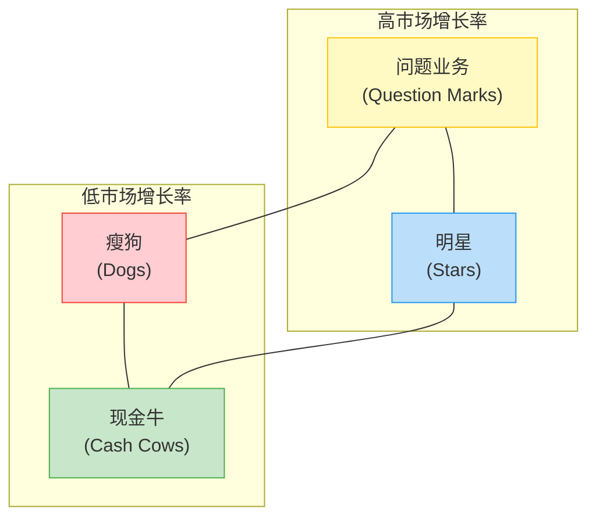

---
{"dg-publish":true,"tags":["商业分析","BCG矩阵","产品组合","战略分析","模板"],"created":"2024-05-19","permalink":"/知识共享/002_商业分析/04_模板/01_分析框架/BCG矩阵分析模板/","dgPassFrontmatter":true}
---

## 1. 分析概述

**项目名称：** [项目名称]
**分析目的：** [明确说明本次BCG矩阵分析的目标和意图]
**分析对象：** [分析的企业产品线/业务单元/投资组合]
**分析团队：** [参与分析的人员及其职责]
**完成日期：** [分析完成日期]

## 2. BCG矩阵模型概述

BCG矩阵（Boston Consulting Group Matrix）是波士顿咨询集团开发的战略规划工具，用于评估企业多元化业务单位或产品线的市场吸引力和竞争地位。BCG矩阵通过两个维度对业务进行分类：

- **市场增长率**：衡量市场吸引力，通常基于行业或市场的年增长率
- **相对市场份额**：衡量企业在市场中的竞争地位，通常基于企业相对于最大竞争对手的市场份额

基于这两个维度，BCG矩阵将业务或产品分为四类：
1. **明星（Stars）**：高增长、高市场份额
2. **现金牛（Cash Cows）**：低增长、高市场份额
3. **问题业务（Question Marks）**：高增长、低市场份额
4. **瘦狗（Dogs）**：低增长、低市场份额

## 3. 分析数据收集

### 3.1 业务/产品单元列表

| 业务/产品单元 | 简要描述 | 所属部门/业务线 | 目标市场 |
|-------------|---------|--------------|---------|
| [产品/业务1] | [描述] | [部门] | [市场] |
| [产品/业务2] | [描述] | [部门] | [市场] |
| [产品/业务3] | [描述] | [部门] | [市场] |
| [产品/业务4] | [描述] | [部门] | [市场] |
| [产品/业务5] | [描述] | [部门] | [市场] |

### 3.2 市场增长率数据

| 业务/产品单元 | 所在市场/行业 | 市场总规模 | 去年市场规模 | 今年市场规模 | 市场年增长率(%) |
|-------------|-------------|-----------|------------|------------|---------------|
| [产品/业务1] | [市场/行业] | [规模] | [去年规模] | [今年规模] | [增长率%] |
| [产品/业务2] | [市场/行业] | [规模] | [去年规模] | [今年规模] | [增长率%] |
| [产品/业务3] | [市场/行业] | [规模] | [去年规模] | [今年规模] | [增长率%] |
| [产品/业务4] | [市场/行业] | [规模] | [去年规模] | [今年规模] | [增长率%] |
| [产品/业务5] | [市场/行业] | [规模] | [去年规模] | [今年规模] | [增长率%] |

### 3.3 市场份额数据

| 业务/产品单元 | 企业市场份额(%) | 最大竞争对手 | 竞争对手市场份额(%) | 相对市场份额比率 |
|-------------|---------------|------------|-------------------|----------------|
| [产品/业务1] | [份额%] | [竞争对手名称] | [竞争对手份额%] | [比率] |
| [产品/业务2] | [份额%] | [竞争对手名称] | [竞争对手份额%] | [比率] |
| [产品/业务3] | [份额%] | [竞争对手名称] | [竞争对手份额%] | [比率] |
| [产品/业务4] | [份额%] | [竞争对手名称] | [竞争对手份额%] | [比率] |
| [产品/业务5] | [份额%] | [竞争对手名称] | [竞争对手份额%] | [比率] |

>注：相对市场份额比率 = 企业市场份额 ÷ 最大竞争对手市场份额

### 3.4 财务表现数据

| 业务/产品单元 | 年收入 | 收入占比(%) | 年利润 | 利润率(%) | 年增长率(%) |
|-------------|--------|------------|--------|----------|------------|
| [产品/业务1] | [收入] | [占比%] | [利润] | [利润率%] | [增长率%] |
| [产品/业务2] | [收入] | [占比%] | [利润] | [利润率%] | [增长率%] |
| [产品/业务3] | [收入] | [占比%] | [利润] | [利润率%] | [增长率%] |
| [产品/业务4] | [收入] | [占比%] | [利润] | [利润率%] | [增长率%] |
| [产品/业务5] | [收入] | [占比%] | [利润] | [利润率%] | [增长率%] |
| **总计** | [总收入] | 100% | [总利润] | [平均利润率%] | [平均增长率%] |

## 4. BCG矩阵定位

### 4.1 划分标准确定

- **市场增长率高低分界线：** [设定值，通常为行业平均增长率或特定阈值，如10%]
- **相对市场份额高低分界线：** [设定值，通常为1.0，即与最大竞争对手相当]
- **确定依据：** [解释为何选择这些分界线值]

### 4.2 业务/产品定位汇总表

| 业务/产品单元 | 市场增长率(%) | 相对市场份额比率 | BCG象限定位 | 收入占比(%) | 利润占比(%) |
|-------------|--------------|----------------|------------|------------|------------|
| [产品/业务1] | [增长率%] | [比率] | [明星/现金牛/问题业务/瘦狗] | [占比%] | [占比%] |
| [产品/业务2] | [增长率%] | [比率] | [明星/现金牛/问题业务/瘦狗] | [占比%] | [占比%] |
| [产品/业务3] | [增长率%] | [比率] | [明星/现金牛/问题业务/瘦狗] | [占比%] | [占比%] |
| [产品/业务4] | [增长率%] | [比率] | [明星/现金牛/问题业务/瘦狗] | [占比%] | [占比%] |
| [产品/业务5] | [增长率%] | [比率] | [明星/现金牛/问题业务/瘦狗] | [占比%] | [占比%] |

### 4.3 BCG矩阵可视化

## 5. 详细分析与策略建议

### 5.1 明星业务/产品分析

**明星业务清单：**
- [明星业务/产品1]
- [明星业务/产品2]
- ...

**特点分析：**
- **市场前景：** [分析市场未来发展趋势]
- **竞争优势：** [分析企业在该业务领域的核心优势]
- **资源需求：** [分析维持和扩大市场份额所需的资源投入]
- **挑战与风险：** [分析面临的主要挑战和风险]

**建议策略：**
- **投资策略：** [投资建议，通常为维持或扩大投资]
- **营销策略：** [市场营销策略建议]
- **产品策略：** [产品开发和创新策略]
- **竞争策略：** [应对竞争的策略]
- **预期回报：** [预期投资回报和财务影响]

### 5.2 现金牛业务/产品分析

**现金牛业务清单：**
- [现金牛业务/产品1]
- [现金牛业务/产品2]
- ...

**特点分析：**
- **市场稳定性：** [分析市场成熟度和稳定性]
- **盈利能力：** [分析利润率和现金流生成能力]
- **竞争态势：** [分析竞争格局和市场份额稳定性]
- **成本结构：** [分析成本优势或劣势]

**建议策略：**
- **资金使用策略：** [如何利用产生的现金流，通常为维持投资或收获利润]
- **成本控制策略：** [成本优化建议]
- **市场份额维护策略：** [如何维持市场领导地位]
- **产品延续策略：** [产品线维护或延伸策略]
- **预期回报：** [预期投资回报和财务影响]

### 5.3 问题业务/产品分析

**问题业务清单：**
- [问题业务/产品1]
- [问题业务/产品2]
- ...

**特点分析：**
- **市场机会评估：** [分析市场增长潜力和机会大小]
- **竞争劣势：** [分析与市场领导者的差距]
- **资源需求：** [分析提高市场份额所需的资源投入]
- **风险评估：** [分析投资风险和不确定性]

**建议策略：**
- **选择性投资策略：** [投资建议，可能为聚焦投资、选择性放弃或全面退出]
- **差异化策略：** [如何在细分市场建立差异化优势]
- **提升效率策略：** [提高运营效率的措施]
- **转型或整合策略：** [业务转型或整合方案]
- **决策标准：** [投资或退出的决策标准和时间表]

### 5.4 瘦狗业务/产品分析

**瘦狗业务清单：**
- [瘦狗业务/产品1]
- [瘦狗业务/产品2]
- ...

**特点分析：**
- **市场前景：** [分析市场衰退或稳定状况]
- **财务贡献：** [分析对企业财务的贡献或消耗]
- **战略意义：** [分析对整体业务的战略价值]
- **机会成本：** [分析继续投入的机会成本]

**建议策略：**
- **撤资策略：** [撤资或退出的方式和时间表]
- **收获策略：** [如何在退出前最大化剩余价值]
- **重组策略：** [可能的业务重组方案]
- **特殊情况考量：** [特殊战略价值或协同效应的考量]
- **资源重新分配建议：** [释放资源的分配建议]

## 6. 整体产品/业务组合评估

### 6.1 组合平衡性分析

- **当前组合结构：** [各象限业务占比及平衡性评估]
- **现金流平衡：** [分析现金流入与需求的平衡状况]
- **风险分散：** [分析组合风险分散程度]
- **增长潜力：** [分析组合整体增长潜力]
- **资源分配效率：** [分析资源分配与回报的匹配度]

### 6.2 组合演进趋势分析

- **业务/产品生命周期位置：** [分析各业务在生命周期中的位置]
- **象限迁移预测：** [预测未来1-3年各业务可能的象限迁移]
- **未来组合结构：** [预测未来组合结构变化]
- **潜在风险：** [识别组合演进过程中的潜在风险]

### 6.3 组合优化建议

- **短期优化建议（0-1年）：** [近期资源重新分配和优化建议]
- **中期优化建议（1-3年）：** [中期业务组合调整方向]
- **长期战略方向（3年以上）：** [长期业务组合发展方向]
- **新业务发展建议：** [填补组合缺口的新业务发展建议]

## 7. 实施规划

### 7.1 资源分配计划

| 业务/产品单元 | 当前资源分配 | 建议资源分配 | 变化幅度 | 调整理由 | 实施时间 |
|-------------|------------|------------|---------|---------|---------|
| [产品/业务1] | [当前资源] | [建议资源] | [幅度] | [理由] | [时间] |
| [产品/业务2] | [当前资源] | [建议资源] | [幅度] | [理由] | [时间] |
| [产品/业务3] | [当前资源] | [建议资源] | [幅度] | [理由] | [时间] |
| [产品/业务4] | [当前资源] | [建议资源] | [幅度] | [理由] | [时间] |
| [产品/业务5] | [当前资源] | [建议资源] | [幅度] | [理由] | [时间] |

### 7.2 关键行动计划

| 业务/产品单元 | 策略类型 | 关键行动 | 责任部门 | 时间表 | 成功指标 |
|-------------|---------|---------|---------|--------|---------|
| [产品/业务1] | [策略] | [行动描述] | [部门] | [时间] | [指标] |
| [产品/业务2] | [策略] | [行动描述] | [部门] | [时间] | [指标] |
| [产品/业务3] | [策略] | [行动描述] | [部门] | [时间] | [指标] |
| [产品/业务4] | [策略] | [行动描述] | [部门] | [时间] | [指标] |
| [产品/业务5] | [策略] | [行动描述] | [部门] | [时间] | [指标] |

### 7.3 实施风险与应对措施

| 风险类型 | 风险描述 | 影响程度 | 发生概率 | 应对措施 | 责任部门 |
|---------|---------|---------|---------|---------|---------|
| [类型] | [描述] | [高/中/低] | [高/中/低] | [措施] | [部门] |
| [类型] | [描述] | [高/中/低] | [高/中/低] | [措施] | [部门] |
| [类型] | [描述] | [高/中/低] | [高/中/低] | [措施] | [部门] |

## 8. 监控与评估机制

### 8.1 关键指标监控计划

| 业务/产品单元 | 监控指标 | 指标定义 | 目标值 | 监控频率 | 责任人 |
|-------------|---------|---------|--------|---------|--------|
| [产品/业务1] | [指标] | [定义] | [目标] | [频率] | [负责人] |
| [产品/业务2] | [指标] | [定义] | [目标] | [频率] | [负责人] |
| [产品/业务3] | [指标] | [定义] | [目标] | [频率] | [负责人] |
| [产品/业务4] | [指标] | [定义] | [目标] | [频率] | [负责人] |
| [产品/业务5] | [指标] | [定义] | [目标] | [频率] | [负责人] |

### 8.2 战略调整触发条件

| 业务/产品单元 | 触发条件 | 建议调整策略 | 决策流程 | 责任人 |
|-------------|---------|------------|---------|--------|
| [产品/业务1] | [条件] | [调整策略] | [流程] | [负责人] |
| [产品/业务2] | [条件] | [调整策略] | [流程] | [负责人] |
| [产品/业务3] | [条件] | [调整策略] | [流程] | [负责人] |
| [产品/业务4] | [条件] | [调整策略] | [流程] | [负责人] |
| [产品/业务5] | [条件] | [调整策略] | [流程] | [负责人] |

### 8.3 BCG矩阵定期更新计划

- **更新频率：** [建议更新频率，通常为年度或半年度]
- **更新流程：** [数据收集、分析、决策和实施的流程描述]
- **责任分工：** [明确各部门在更新过程中的职责]
- **与其他战略工具的结合：** [如何与其他战略分析工具结合使用]

## 9. 附录

### 9.1 BCG矩阵的优势与局限性

#### 优势：
- 提供直观的业务/产品组合可视化
- 帮助平衡短期盈利与长期增长
- 促进资源的有效分配
- 简化复杂的业务组合分析

#### 局限性：
- 仅考虑市场增长率和相对市场份额两个维度
- 未考虑业务间的协同效应
- 对市场的定义可能过于简化
- 不适用于快速变化的新兴市场或技术
- 可能导致过于机械的策略决策

### 9.2 数据来源与分析方法

- **市场数据来源：** [列出市场数据的来源]
- **市场份额计算方法：** [解释如何计算市场份额]
- **增长率计算期间：** [说明增长率的计算期间]
- **财务数据时间段：** [说明财务数据的时间段]
- **数据收集与验证方法：** [描述数据收集和验证过程]

### 9.3 使用说明

1. 本模板适用于对企业产品线、业务单元或投资组合进行战略分析
2. 分析前应收集准确的市场数据和财务数据
3. 分界线设定应根据企业所处行业特点灵活调整
4. 建议结合其他战略分析工具（如SWOT、Porter五力模型等）综合使用
5. 分析结果应定期更新以反映市场变化和企业策略调整 