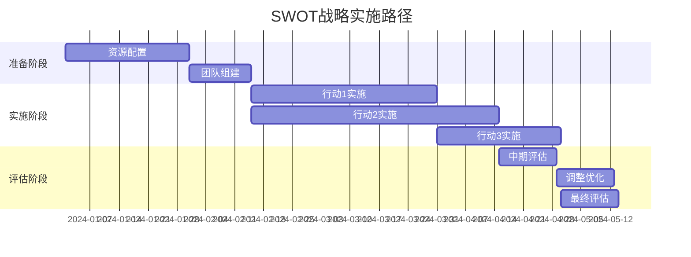

---
{"dg-publish":true,"tags":["SWOT","模板","分析框架","战略分析","商业分析"],"创建日期":"2024-05-19","更新日期":"2024-05-19","permalink":"/知识共享/002_商业分析/04_模板/01_分析框架/SWOT分析模板/","dgPassFrontmatter":true}
---

# SWOT分析模板

> [!info] 模板说明
> 本模板用于进行系统化的SWOT分析，帮助企业或团队识别内部优势(Strengths)与劣势(Weaknesses)、外部机会(Opportunities)与威胁(Threats)，从而制定有效的战略决策。适用于战略规划、产品开发、市场进入、竞争分析等多种商业场景。

## 一、分析概述

### 1.1 基本信息

| 项目           | 内容                             |
| -------------- | -------------------------------- |
| 分析对象       | [企业/部门/产品/项目名称]        |
| 分析目的       | [明确此次SWOT分析的具体目的]     |
| 分析范围       | [确定分析的业务/地域/时间范围]   |
| 分析日期       | [分析进行的日期]                 |
| 分析团队       | [参与分析的人员及角色]           |
| 决策利益相关方 | [分析结果的主要使用者]           |

### 1.2 分析背景

[简要描述进行此次SWOT分析的业务背景、市场环境及战略考量，200-300字]

### 1.3 分析方法与数据来源

- **数据采集方法**：[如：访谈/问卷/行业报告/内部数据分析等]
- **分析框架**：[除SWOT外配合使用的其他分析工具]
- **关键数据来源**：[列出支持分析的主要数据来源及其可靠性]
- **分析局限性**：[说明本次分析的局限性和注意事项]

## 二、内部因素分析

### 2.1 优势 (Strengths)

> 优势是指组织内部拥有的、能够帮助实现目标的积极因素和能力

| 优势 | 描述 | 影响程度(1-5) | 持续性评估 | 相关证据与数据 |
| ---- | ---- | ------------- | ---------- | -------------- |
| S1: [优势名称] | [详细描述] | [评分] | [短期/中期/长期] | [支持数据] |
| S2: [优势名称] | [详细描述] | [评分] | [短期/中期/长期] | [支持数据] |
| S3: [优势名称] | [详细描述] | [评分] | [短期/中期/长期] | [支持数据] |
| S4: [优势名称] | [详细描述] | [评分] | [短期/中期/长期] | [支持数据] |
| S5: [优势名称] | [详细描述] | [评分] | [短期/中期/长期] | [支持数据] |

**核心优势分析**：
[对上述优势进行整合分析，识别最关键、最持久的1-2个核心优势，及其对分析对象的战略价值]

### 2.2 劣势 (Weaknesses)

> 劣势是指组织内部存在的、可能阻碍目标实现的消极因素和不足

| 劣势 | 描述 | 影响程度(1-5) | 改进难度(1-5) | 相关证据与数据 |
| ---- | ---- | ------------- | ------------- | -------------- |
| W1: [劣势名称] | [详细描述] | [评分] | [评分] | [支持数据] |
| W2: [劣势名称] | [详细描述] | [评分] | [评分] | [支持数据] |
| W3: [劣势名称] | [详细描述] | [评分] | [评分] | [支持数据] |
| W4: [劣势名称] | [详细描述] | [评分] | [评分] | [支持数据] |
| W5: [劣势名称] | [详细描述] | [评分] | [评分] | [支持数据] |

**关键劣势评估**：
[分析最需要优先解决的1-2个关键劣势，评估其对分析对象的潜在风险及可能的改进方向]

## 三、外部因素分析

### 3.1 机会 (Opportunities)

> 机会是指外部环境中有利于组织发展的因素和趋势

| 机会 | 描述 | 影响程度(1-5) | 时间窗口 | 把握可能性(1-5) |
| ---- | ---- | ------------- | -------- | --------------- |
| O1: [机会名称] | [详细描述] | [评分] | [时间范围] | [评分] |
| O2: [机会名称] | [详细描述] | [评分] | [时间范围] | [评分] |
| O3: [机会名称] | [详细描述] | [评分] | [时间范围] | [评分] |
| O4: [机会名称] | [详细描述] | [评分] | [时间范围] | [评分] |
| O5: [机会名称] | [详细描述] | [评分] | [时间范围] | [评分] |

**优先机会分析**：
[分析最值得把握的1-2个关键机会，并评估所需资源和能力]

### 3.2 威胁 (Threats)

> 威胁是指外部环境中可能阻碍组织目标实现的不利因素和趋势

| 威胁 | 描述 | 影响程度(1-5) | 发生概率(1-5) | 紧迫性 |
| ---- | ---- | ------------- | ------------- | ------ |
| T1: [威胁名称] | [详细描述] | [评分] | [评分] | [高/中/低] |
| T2: [威胁名称] | [详细描述] | [评分] | [评分] | [高/中/低] |
| T3: [威胁名称] | [详细描述] | [评分] | [评分] | [高/中/低] |
| T4: [威胁名称] | [详细描述] | [评分] | [评分] | [高/中/低] |
| T5: [威胁名称] | [详细描述] | [评分] | [评分] | [高/中/低] |

**关键威胁应对**：
[分析最需要关注的1-2个关键威胁，评估其潜在影响及可能的应对方案]

## 四、SWOT矩阵与交叉分析

### 4.1 SWOT矩阵

| | 优势 (S) | 劣势 (W) |
|-|---------|---------|
| | S1: [简述] | W1: [简述] |
| | S2: [简述] | W2: [简述] |
| | S3: [简述] | W3: [简述] |
| | S4: [简述] | W4: [简述] |
| | S5: [简述] | W5: [简述] |
| **机会 (O)** | **SO战略 (进攻型)** | **WO战略 (改进型)** |
| O1: [简述] | [结合S1-S5和O1-O5制定的战略] | [结合W1-W5和O1-O5制定的战略] |
| O2: [简述] | | |
| O3: [简述] | | |
| O4: [简述] | | |
| O5: [简述] | | |
| **威胁 (T)** | **ST战略 (竞争型)** | **WT战略 (防御型)** |
| T1: [简述] | [结合S1-S5和T1-T5制定的战略] | [结合W1-W5和T1-T5制定的战略] |
| T2: [简述] | | |
| T3: [简述] | | |
| T4: [简述] | | |
| T5: [简述] | | |

### 4.2 战略类型说明

1. **SO战略 (进攻型)**：利用优势抓住机会的战略
   - 适用场景：[适合采用进攻型战略的业务场景]
   - 资源要求：[实施此类战略需要的关键资源]
   - 风险评估：[可能面临的风险及对策]

2. **WO战略 (改进型)**：克服劣势以把握机会的战略
   - 适用场景：[适合采用改进型战略的业务场景]
   - 资源要求：[实施此类战略需要的关键资源]
   - 风险评估：[可能面临的风险及对策]

3. **ST战略 (竞争型)**：利用优势应对威胁的战略
   - 适用场景：[适合采用竞争型战略的业务场景]
   - 资源要求：[实施此类战略需要的关键资源]
   - 风险评估：[可能面临的风险及对策]

4. **WT战略 (防御型)**：减少劣势并规避威胁的战略
   - 适用场景：[适合采用防御型战略的业务场景]
   - 资源要求：[实施此类战略需要的关键资源]
   - 风险评估：[可能面临的风险及对策]

## 五、战略选择与行动建议

### 5.1 SWOT分析总结

[基于上述分析，总结分析对象的整体战略处境，包括主要优势劣势、关键机会威胁及其相互关系，300-500字]

### 5.2 战略选择建议

| 战略选项 | 类型 | 主要内容 | 实施难度 | 预期效果 | 优先级 |
| -------- | ---- | -------- | -------- | -------- | ------ |
| 战略选项1 | [SO/WO/ST/WT] | [简要描述] | [高/中/低] | [预期效果] | [高/中/低] |
| 战略选项2 | [SO/WO/ST/WT] | [简要描述] | [高/中/低] | [预期效果] | [高/中/低] |
| 战略选项3 | [SO/WO/ST/WT] | [简要描述] | [高/中/低] | [预期效果] | [高/中/低] |
| 战略选项4 | [SO/WO/ST/WT] | [简要描述] | [高/中/低] | [预期效果] | [高/中/低] |

**推荐战略组合**：
[基于上述分析，推荐1-2个最为合适的战略选项及理由]

### 5.3 行动计划建议

| 行动项 | 对应战略 | 关键活动 | 所需资源 | 时间表 | 责任方 | 成功指标 |
| ------ | -------- | -------- | -------- | ------ | ------ | -------- |
| 行动1 | [战略选项] | [具体活动] | [资源需求] | [时间范围] | [责任人/部门] | [评估指标] |
| 行动2 | [战略选项] | [具体活动] | [资源需求] | [时间范围] | [责任人/部门] | [评估指标] |
| 行动3 | [战略选项] | [具体活动] | [资源需求] | [时间范围] | [责任人/部门] | [评估指标] |
| 行动4 | [战略选项] | [具体活动] | [资源需求] | [时间范围] | [责任人/部门] | [评估指标] |
| 行动5 | [战略选项] | [具体活动] | [资源需求] | [时间范围] | [责任人/部门] | [评估指标] |

## 六、实施与监控

### 6.1 实施路径图

### 6.2 关键绩效指标

| KPI类别 | 指标名称 | 当前值 | 目标值 | 测量频率 | 负责部门 |
| ------- | -------- | ------ | ------ | -------- | -------- |
| 财务指标 | [指标1] | [基线] | [目标] | [频率] | [部门] |
| 市场指标 | [指标2] | [基线] | [目标] | [频率] | [部门] |
| 运营指标 | [指标3] | [基线] | [目标] | [频率] | [部门] |
| 客户指标 | [指标4] | [基线] | [目标] | [频率] | [部门] |
| 内部流程 | [指标5] | [基线] | [目标] | [频率] | [部门] |

### 6.3 风险管理与应对

| 风险类型 | 风险描述 | 可能性(1-5) | 影响度(1-5) | 预警指标 | 应对措施 | 触发条件 |
| -------- | -------- | ----------- | ----------- | -------- | -------- | -------- |
| 执行风险 | [描述] | [评分] | [评分] | [指标] | [措施] | [条件] |
| 市场风险 | [描述] | [评分] | [评分] | [指标] | [措施] | [条件] |
| 资源风险 | [描述] | [评分] | [评分] | [指标] | [措施] | [条件] |
| 竞争风险 | [描述] | [评分] | [评分] | [指标] | [措施] | [条件] |

## 七、附录

### 7.1 SWOT分析方法论

**SWOT分析的基本原则**：
- 客观性原则：基于事实和数据，避免主观臆断
- 重要性原则：聚焦最关键的因素，而非穷尽所有因素
- 相关性原则：所分析的因素必须与分析目的直接相关
- 动态性原则：SWOT分析反映的是特定时点的状况，需定期更新

**常见分析误区及规避方法**：
1. [误区1及规避方法]
2. [误区2及规避方法]
3. [误区3及规避方法]

### 7.2 参考资料与数据来源

1. [内部报告/数据名称]
2. [行业报告/市场研究名称]
3. [竞争对手分析资料]
4. [专家访谈/调研结果]
5. [其他参考资料]

### 7.3 团队讨论记录与不同视角

[记录团队讨论中的不同观点和视角，特别是对关键SWOT因素的不同判断及理由]

---

*本模板提供了系统化的SWOT分析框架，旨在帮助分析者全面评估内外部因素并形成有效的战略建议。实际使用时应根据具体分析对象和目的进行适当调整，确保分析的针对性和实用性。* 