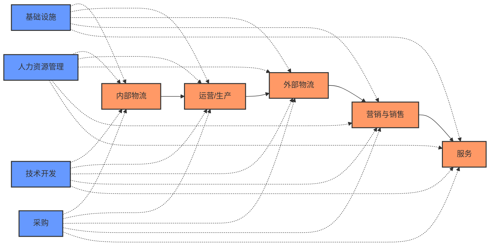

---
{"dg-publish":true,"tags":["商业分析","价值链分析","战略分析","竞争优势","模板"],"created":"2024-05-19","permalink":"/知识共享/002_商业分析/04_模板/01_分析框架/价值链分析模板/","dgPassFrontmatter":true}
---

## 1. 分析概述

**项目名称：** [项目名称]
**分析目的：** [说明本次价值链分析的目标和应用场景]
**分析对象：** [分析的企业/组织]
**分析团队：** [参与分析的人员及其职责]
**完成日期：** [分析完成日期]

## 2. 价值链分析模型概述

价值链分析是由Michael Porter提出的战略分析工具，用于识别企业如何创造价值并获得竞争优势。价值链将企业活动分为主要活动和支持活动：

**主要活动（Primary Activities）：**
1. 内部物流（Inbound Logistics）：原材料接收、存储、分发等
2. 运营/生产（Operations）：将投入转化为最终产品或服务的过程
3. 外部物流（Outbound Logistics）：产品运送到客户的相关活动
4. 市场营销与销售（Marketing & Sales）：引导客户购买产品的活动
5. 服务（Service）：维护产品价值的售后服务活动

**支持活动（Support Activities）：**
1. 基础设施（Firm Infrastructure）：包括一般管理、规划、财务、法律等
2. 人力资源管理（Human Resource Management）：招聘、培训、薪酬等
3. 技术开发（Technology Development）：产品和流程的研发改进
4. 采购（Procurement）：获取各类资源的采购活动

价值链分析的目的是识别价值创造的关键环节，优化成本结构，发现差异化机会，从而构建竞争优势。

## 3. 企业基本情况分析

### 3.1 企业概况

- **企业名称：** [企业名称]
- **行业分类：** [行业]
- **主要产品/服务：** [描述主要产品或服务]
- **市场定位：** [企业的市场定位]
- **价值主张：** [企业的核心价值主张]
- **业务规模：** [年营收/市场份额等]
- **员工人数：** [员工总数及分布]

### 3.2 行业价值链概述

- **行业价值链模式：** [描述行业特有的价值链结构]
- **价值分配特点：** [行业各环节价值分配的特点]
- **关键成功因素：** [行业的关键成功因素]
- **行业价值链演变趋势：** [行业价值链的结构变化趋势]

### 3.3 企业在价值链中的位置

- **核心价值环节：** [企业专注的价值链环节]
- **垂直整合程度：** [企业在价值链中的垂直整合程度]
- **行业地位：** [企业在行业价值链中的地位]
- **合作伙伴：** [上下游重要合作伙伴]

## 4. 主要活动分析（Primary Activities）

### 4.1 内部物流（Inbound Logistics）

| 活动内容 | 现有做法 | 资源投入 | 成本结构 | 价值贡献 | 竞争表现 | 优势/劣势 | 改进机会 |
|--------|---------|---------|---------|---------|---------|---------|---------|
| 采购管理 | [描述] | [资源] | [成本] | [价值] | [表现] | [优/劣势] | [机会] |
| 仓储管理 | [描述] | [资源] | [成本] | [价值] | [表现] | [优/劣势] | [机会] |
| 库存控制 | [描述] | [资源] | [成本] | [价值] | [表现] | [优/劣势] | [机会] |
| 原料处理 | [描述] | [资源] | [成本] | [价值] | [表现] | [优/劣势] | [机会] |
| 供应商管理 | [描述] | [资源] | [成本] | [价值] | [表现] | [优/劣势] | [机会] |

**内部物流综合评价：**
- **效率评估：** [描述内部物流的效率水平]
- **成本评估：** [描述内部物流的成本水平]
- **质量评估：** [描述内部物流的质量水平]
- **关键优势：** [内部物流的关键优势]
- **主要问题：** [内部物流的主要问题]
- **改进建议：** [内部物流的改进建议]

### 4.2 运营/生产（Operations）

| 活动内容 | 现有做法 | 资源投入 | 成本结构 | 价值贡献 | 竞争表现 | 优势/劣势 | 改进机会 |
|--------|---------|---------|---------|---------|---------|---------|---------|
| 生产流程 | [描述] | [资源] | [成本] | [价值] | [表现] | [优/劣势] | [机会] |
| 质量控制 | [描述] | [资源] | [成本] | [价值] | [表现] | [优/劣势] | [机会] |
| 设备维护 | [描述] | [资源] | [成本] | [价值] | [表现] | [优/劣势] | [机会] |
| 生产调度 | [描述] | [资源] | [成本] | [价值] | [表现] | [优/劣势] | [机会] |
| 产能管理 | [描述] | [资源] | [成本] | [价值] | [表现] | [优/劣势] | [机会] |

**运营/生产综合评价：**
- **效率评估：** [描述运营/生产的效率水平]
- **成本评估：** [描述运营/生产的成本水平]
- **质量评估：** [描述运营/生产的质量水平]
- **关键优势：** [运营/生产的关键优势]
- **主要问题：** [运营/生产的主要问题]
- **改进建议：** [运营/生产的改进建议]

### 4.3 外部物流（Outbound Logistics）

| 活动内容 | 现有做法 | 资源投入 | 成本结构 | 价值贡献 | 竞争表现 | 优势/劣势 | 改进机会 |
|--------|---------|---------|---------|---------|---------|---------|---------|
| 成品仓储 | [描述] | [资源] | [成本] | [价值] | [表现] | [优/劣势] | [机会] |
| 配送管理 | [描述] | [资源] | [成本] | [价值] | [表现] | [优/劣势] | [机会] |
| 运输管理 | [描述] | [资源] | [成本] | [价值] | [表现] | [优/劣势] | [机会] |
| 订单处理 | [描述] | [资源] | [成本] | [价值] | [表现] | [优/劣势] | [机会] |
| 物流网络 | [描述] | [资源] | [成本] | [价值] | [表现] | [优/劣势] | [机会] |

**外部物流综合评价：**
- **效率评估：** [描述外部物流的效率水平]
- **成本评估：** [描述外部物流的成本水平]
- **服务评估：** [描述外部物流的服务水平]
- **关键优势：** [外部物流的关键优势]
- **主要问题：** [外部物流的主要问题]
- **改进建议：** [外部物流的改进建议]

### 4.4 市场营销与销售（Marketing & Sales）

| 活动内容 | 现有做法 | 资源投入 | 成本结构 | 价值贡献 | 竞争表现 | 优势/劣势 | 改进机会 |
|--------|---------|---------|---------|---------|---------|---------|---------|
| 品牌建设 | [描述] | [资源] | [成本] | [价值] | [表现] | [优/劣势] | [机会] |
| 市场调研 | [描述] | [资源] | [成本] | [价值] | [表现] | [优/劣势] | [机会] |
| 广告宣传 | [描述] | [资源] | [成本] | [价值] | [表现] | [优/劣势] | [机会] |
| 销售管理 | [描述] | [资源] | [成本] | [价值] | [表现] | [优/劣势] | [机会] |
| 渠道管理 | [描述] | [资源] | [成本] | [价值] | [表现] | [优/劣势] | [机会] |
| 定价策略 | [描述] | [资源] | [成本] | [价值] | [表现] | [优/劣势] | [机会] |

**市场营销与销售综合评价：**
- **效率评估：** [描述营销销售的效率水平]
- **成本评估：** [描述营销销售的成本水平]
- **效果评估：** [描述营销销售的效果水平]
- **关键优势：** [营销销售的关键优势]
- **主要问题：** [营销销售的主要问题]
- **改进建议：** [营销销售的改进建议]

### 4.5 服务（Service）

| 活动内容 | 现有做法 | 资源投入 | 成本结构 | 价值贡献 | 竞争表现 | 优势/劣势 | 改进机会 |
|--------|---------|---------|---------|---------|---------|---------|---------|
| 安装服务 | [描述] | [资源] | [成本] | [价值] | [表现] | [优/劣势] | [机会] |
| 维修服务 | [描述] | [资源] | [成本] | [价值] | [表现] | [优/劣势] | [机会] |
| 客户支持 | [描述] | [资源] | [成本] | [价值] | [表现] | [优/劣势] | [机会] |
| 客户培训 | [描述] | [资源] | [成本] | [价值] | [表现] | [优/劣势] | [机会] |
| 售后追踪 | [描述] | [资源] | [成本] | [价值] | [表现] | [优/劣势] | [机会] |
| 备件管理 | [描述] | [资源] | [成本] | [价值] | [表现] | [优/劣势] | [机会] |

**服务综合评价：**
- **效率评估：** [描述服务的效率水平]
- **成本评估：** [描述服务的成本水平]
- **质量评估：** [描述服务的质量水平]
- **关键优势：** [服务的关键优势]
- **主要问题：** [服务的主要问题]
- **改进建议：** [服务的改进建议]

## 5. 支持活动分析（Support Activities）

### 5.1 基础设施（Firm Infrastructure）

| 活动内容 | 现有做法 | 资源投入 | 成本结构 | 价值贡献 | 竞争表现 | 优势/劣势 | 改进机会 |
|--------|---------|---------|---------|---------|---------|---------|---------|
| 总体管理 | [描述] | [资源] | [成本] | [价值] | [表现] | [优/劣势] | [机会] |
| 财务管理 | [描述] | [资源] | [成本] | [价值] | [表现] | [优/劣势] | [机会] |
| 战略规划 | [描述] | [资源] | [成本] | [价值] | [表现] | [优/劣势] | [机会] |
| 法律事务 | [描述] | [资源] | [成本] | [价值] | [表现] | [优/劣势] | [机会] |
| 质量系统 | [描述] | [资源] | [成本] | [价值] | [表现] | [优/劣势] | [机会] |
| 外部关系 | [描述] | [资源] | [成本] | [价值] | [表现] | [优/劣势] | [机会] |

**基础设施综合评价：**
- **效率评估：** [描述基础设施的效率水平]
- **成本评估：** [描述基础设施的成本水平]
- **支持评估：** [描述基础设施的支持水平]
- **关键优势：** [基础设施的关键优势]
- **主要问题：** [基础设施的主要问题]
- **改进建议：** [基础设施的改进建议]

### 5.2 人力资源管理（Human Resource Management）

| 活动内容 | 现有做法 | 资源投入 | 成本结构 | 价值贡献 | 竞争表现 | 优势/劣势 | 改进机会 |
|--------|---------|---------|---------|---------|---------|---------|---------|
| 招聘选拔 | [描述] | [资源] | [成本] | [价值] | [表现] | [优/劣势] | [机会] |
| 培训发展 | [描述] | [资源] | [成本] | [价值] | [表现] | [优/劣势] | [机会] |
| 薪酬福利 | [描述] | [资源] | [成本] | [价值] | [表现] | [优/劣势] | [机会] |
| 绩效管理 | [描述] | [资源] | [成本] | [价值] | [表现] | [优/劣势] | [机会] |
| 员工关系 | [描述] | [资源] | [成本] | [价值] | [表现] | [优/劣势] | [机会] |
| 组织文化 | [描述] | [资源] | [成本] | [价值] | [表现] | [优/劣势] | [机会] |

**人力资源管理综合评价：**
- **效率评估：** [描述人力资源管理的效率水平]
- **成本评估：** [描述人力资源管理的成本水平]
- **质量评估：** [描述人力资源管理的质量水平]
- **关键优势：** [人力资源管理的关键优势]
- **主要问题：** [人力资源管理的主要问题]
- **改进建议：** [人力资源管理的改进建议]

### 5.3 技术开发（Technology Development）

| 活动内容 | 现有做法 | 资源投入 | 成本结构 | 价值贡献 | 竞争表现 | 优势/劣势 | 改进机会 |
|--------|---------|---------|---------|---------|---------|---------|---------|
| 产品研发 | [描述] | [资源] | [成本] | [价值] | [表现] | [优/劣势] | [机会] |
| 工艺改进 | [描述] | [资源] | [成本] | [价值] | [表现] | [优/劣势] | [机会] |
| 技术创新 | [描述] | [资源] | [成本] | [价值] | [表现] | [优/劣势] | [机会] |
| 知识管理 | [描述] | [资源] | [成本] | [价值] | [表现] | [优/劣势] | [机会] |
| 信息系统 | [描述] | [资源] | [成本] | [价值] | [表现] | [优/劣势] | [机会] |
| 实验测试 | [描述] | [资源] | [成本] | [价值] | [表现] | [优/劣势] | [机会] |

**技术开发综合评价：**
- **效率评估：** [描述技术开发的效率水平]
- **成本评估：** [描述技术开发的成本水平]
- **创新评估：** [描述技术开发的创新水平]
- **关键优势：** [技术开发的关键优势]
- **主要问题：** [技术开发的主要问题]
- **改进建议：** [技术开发的改进建议]

### 5.4 采购（Procurement）

| 活动内容 | 现有做法 | 资源投入 | 成本结构 | 价值贡献 | 竞争表现 | 优势/劣势 | 改进机会 |
|--------|---------|---------|---------|---------|---------|---------|---------|
| 供应商评估 | [描述] | [资源] | [成本] | [价值] | [表现] | [优/劣势] | [机会] |
| 采购流程 | [描述] | [资源] | [成本] | [价值] | [表现] | [优/劣势] | [机会] |
| 合同管理 | [描述] | [资源] | [成本] | [价值] | [表现] | [优/劣势] | [机会] |
| 成本控制 | [描述] | [资源] | [成本] | [价值] | [表现] | [优/劣势] | [机会] |
| 采购策略 | [描述] | [资源] | [成本] | [价值] | [表现] | [优/劣势] | [机会] |
| 供应链协作 | [描述] | [资源] | [成本] | [价值] | [表现] | [优/劣势] | [机会] |

**采购综合评价：**
- **效率评估：** [描述采购的效率水平]
- **成本评估：** [描述采购的成本水平]
- **质量评估：** [描述采购的质量水平]
- **关键优势：** [采购的关键优势]
- **主要问题：** [采购的主要问题]
- **改进建议：** [采购的改进建议]

## 6. 价值链综合分析

### 6.1 价值链活动重要性评估

| 价值链活动 | 成本占比(%) | 价值贡献(1-5) | 差异化潜力(1-5) | 成本领先潜力(1-5) | 综合重要性 |
|-----------|------------|--------------|----------------|-----------------|-----------|
| 内部物流 | [占比] | [评分] | [评分] | [评分] | [高/中/低] |
| 运营/生产 | [占比] | [评分] | [评分] | [评分] | [高/中/低] |
| 外部物流 | [占比] | [评分] | [评分] | [评分] | [高/中/低] |
| 市场营销与销售 | [占比] | [评分] | [评分] | [评分] | [高/中/低] |
| 服务 | [占比] | [评分] | [评分] | [评分] | [高/中/低] |
| 基础设施 | [占比] | [评分] | [评分] | [评分] | [高/中/低] |
| 人力资源管理 | [占比] | [评分] | [评分] | [评分] | [高/中/低] |
| 技术开发 | [占比] | [评分] | [评分] | [评分] | [高/中/低] |
| 采购 | [占比] | [评分] | [评分] | [评分] | [高/中/低] |

### 6.2 价值链可视化

### 6.3 价值链竞争优势分析

| 价值链环节 | 成本优势分析 | 差异化优势分析 | 竞争对手对比 | 竞争优势来源 |
|-----------|------------|----------------|------------|------------|
| 内部物流 | [分析] | [分析] | [对比] | [来源] |
| 运营/生产 | [分析] | [分析] | [对比] | [来源] |
| 外部物流 | [分析] | [分析] | [对比] | [来源] |
| 市场营销与销售 | [分析] | [分析] | [对比] | [来源] |
| 服务 | [分析] | [分析] | [对比] | [来源] |
| 基础设施 | [分析] | [分析] | [对比] | [来源] |
| 人力资源管理 | [分析] | [分析] | [对比] | [来源] |
| 技术开发 | [分析] | [分析] | [对比] | [来源] |
| 采购 | [分析] | [分析] | [对比] | [来源] |

### 6.4 环节间联系与协同效应

- **关键联系点：** [描述价值链环节之间的重要联系]
- **协同效应：** [描述不同环节间的协同效应]
- **协同障碍：** [描述阻碍协同的因素]
- **改进机会：** [加强协同的改进机会]

### 6.5 价值链结论

- **价值链核心优势：** [企业价值链的核心优势]
- **价值链主要劣势：** [企业价值链的主要劣势]
- **关键价值环节：** [对企业竞争力最关键的价值链环节]
- **改进优先级：** [价值链改进的优先顺序]
- **竞争策略方向：** [基于价值链分析的竞争策略方向]

## 7. 价值链优化策略

### 7.1 成本优化策略

| 优化策略 | 适用环节 | 预期效果 | 实施难度(1-5) | 投资需求 | 风险评估 | 优先级 |
|---------|---------|----------|--------------|---------|---------|--------|
| [策略1] | [环节] | [效果] | [难度] | [投资] | [风险] | [高/中/低] |
| [策略2] | [环节] | [效果] | [难度] | [投资] | [风险] | [高/中/低] |
| [策略3] | [环节] | [效果] | [难度] | [投资] | [风险] | [高/中/低] |
| [策略4] | [环节] | [效果] | [难度] | [投资] | [风险] | [高/中/低] |
| [策略5] | [环节] | [效果] | [难度] | [投资] | [风险] | [高/中/低] |

### 7.2 差异化增值策略

| 增值策略 | 适用环节 | 预期效果 | 实施难度(1-5) | 投资需求 | 风险评估 | 优先级 |
|---------|---------|----------|--------------|---------|---------|--------|
| [策略1] | [环节] | [效果] | [难度] | [投资] | [风险] | [高/中/低] |
| [策略2] | [环节] | [效果] | [难度] | [投资] | [风险] | [高/中/低] |
| [策略3] | [环节] | [效果] | [难度] | [投资] | [风险] | [高/中/低] |
| [策略4] | [环节] | [效果] | [难度] | [投资] | [风险] | [高/中/低] |
| [策略5] | [环节] | [效果] | [难度] | [投资] | [风险] | [高/中/低] |

### 7.3 价值链重构策略

- **垂直整合策略：** [描述向上下游整合的策略]
- **外包策略：** [描述非核心环节外包的策略]
- **战略合作：** [描述与外部伙伴的战略合作策略]
- **价值链创新：** [描述颠覆性的价值链创新策略]
- **数字化转型：** [描述数字技术对价值链的改造策略]

### 7.4 行动计划

| 行动项 | 所属策略 | 责任部门 | 时间表 | 资源需求 | 关键里程碑 | 成功指标 |
|--------|---------|----------|--------|----------|-----------|----------|
| [行动1] | [策略] | [部门] | [时间] | [资源] | [里程碑] | [指标] |
| [行动2] | [策略] | [部门] | [时间] | [资源] | [里程碑] | [指标] |
| [行动3] | [策略] | [部门] | [时间] | [资源] | [里程碑] | [指标] |
| [行动4] | [策略] | [部门] | [时间] | [资源] | [里程碑] | [指标] |
| [行动5] | [策略] | [部门] | [时间] | [资源] | [里程碑] | [指标] |

## 8. 价值链优化实施与跟踪

### 8.1 实施组织与责任

- **指导委员会：** [描述价值链优化的指导委员会组成]
- **项目团队：** [描述项目实施团队组成]
- **部门责任：** [描述各部门在实施中的责任]
- **协调机制：** [描述跨部门协调机制]

### 8.2 监控与评估

- **关键绩效指标(KPIs)：** [列出监控价值链优化的关键指标]
- **监控频率：** [描述指标监控的频率]
- **报告机制：** [描述进度报告的机制]
- **调整流程：** [描述基于监控结果进行调整的流程]

### 8.3 变革管理

- **沟通策略：** [描述价值链优化的内部沟通策略]
- **能力建设：** [描述支持优化的能力建设计划]
- **激励机制：** [描述支持变革的激励机制]
- **文化调整：** [描述需要的文化变革]

## 9. 附录

### 9.1 行业价值链基准数据

- **行业平均成本结构：** [描述行业各环节的平均成本占比]
- **行业标杆实践：** [描述行业最佳实践]
- **行业演进趋势：** [描述行业价值链的演进趋势]

### 9.2 价值链分析方法说明

- **数据来源：** [分析中使用的主要数据来源]
- **评分标准：** [价值贡献、差异化等评分的评定标准]
- **分析局限性：** [价值链分析的局限性说明]
- **适用范围：** [本分析的适用范围和场景]

### 9.3 参考资料

1. [参考资料1]
2. [参考资料2]
3. [参考资料3]
4. [参考资料4]

### 9.4 使用说明

1. 本模板适用于企业价值链分析，可用于战略规划、竞争优势分析、业务优化等场景
2. 分析时应结合企业实际情况，重点关注关键价值环节
3. 量化评估采用1-5分制，1分表示很弱，5分表示很强
4. 实施策略时应注重环节间的协同效应
5. 分析结果应定期更新，特别是在业务模式、市场环境发生重大变化时 