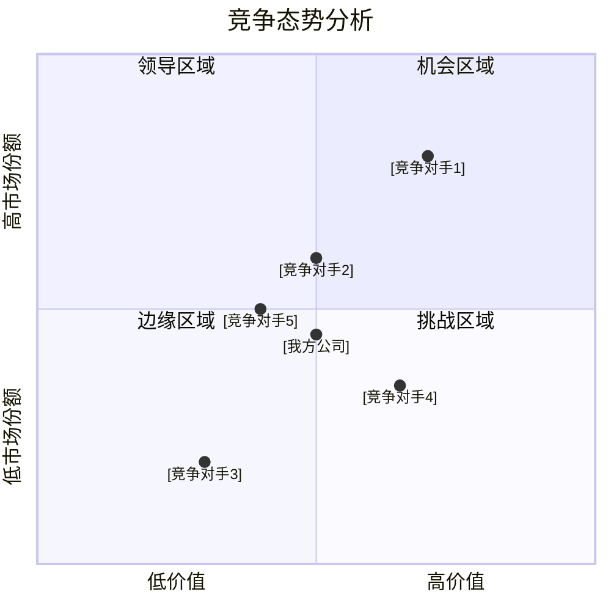
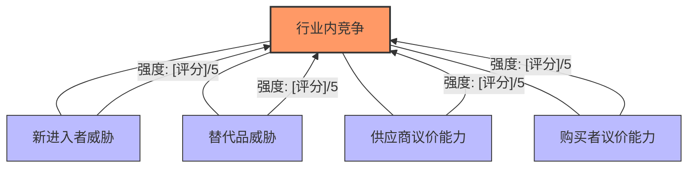

---
{"dg-publish":true,"tags":["商业分析","战略分析","竞争分析","波特五力","模板"],"created":"2024-05-19","permalink":"/知识共享/002_商业分析/04_模板/01_分析框架/波特五力分析模板/","dgPassFrontmatter":true}
---

## 1. 分析概述

**项目名称：** [项目名称]
**分析目的：** [说明本次波特五力分析的目标和应用场景]
**分析对象：** [分析的行业/市场]
**分析团队：** [参与分析的人员及其职责]
**完成日期：** [分析完成日期]

## 2. 波特五力模型概述

波特五力分析模型是由迈克尔·波特（Michael Porter）提出的用于评估行业吸引力和竞争态势的战略工具。该模型认为行业内的竞争程度和盈利能力由五种竞争力量共同决定：

1. **现有竞争者之间的竞争**：行业内现有企业之间的竞争程度
2. **新进入者的威胁**：潜在竞争者进入市场的可能性及难度
3. **替代品的威胁**：替代产品或服务对行业的影响
4. **供应商的议价能力**：供应商影响产业价格、质量和条件的能力
5. **购买者的议价能力**：客户影响价格和服务条件的能力

通过分析这五种力量，企业可以全面了解行业竞争态势，确定自身在行业中的地位，制定应对竞争的战略。

## 3. 行业基本情况

### 3.1 行业概况

- **行业定义：** [界定分析行业的范围和边界]
- **行业规模：** [当前市场规模，年增长率等]
- **行业发展阶段：** [导入期/成长期/成熟期/衰退期]
- **价值链结构：** [行业价值链的主要环节和价值分配]
- **关键成功因素：** [在该行业取得成功的关键因素]
- **行业平均盈利水平：** [行业利润率及变化趋势]

### 3.2 行业关键趋势

- **技术发展趋势：** [影响行业的关键技术发展]
- **消费者偏好变化：** [消费者行为和偏好的变化]
- **法规政策变化：** [影响行业的政策法规变化]
- **全球化影响：** [全球化对行业的影响]
- **商业模式创新：** [行业商业模式的创新与变革]

### 3.3 主要参与者概况

- **市场领导者：** [市场份额最大的几家企业]
- **快速成长者：** [增长速度快的企业]
- **特色差异者：** [采用特色差异化战略的企业]
- **新兴参与者：** [新进入市场的关键企业]
- **即将退出者：** [可能退出市场的企业]

## 4. 五力分析

### 4.1 现有竞争者之间的竞争

#### 4.1.1 竞争强度评估

| 影响因素 | 现状描述 | 强度评分(1-5) | 趋势预测 | 影响分析 |
|---------|--------|--------------|---------|---------|
| 竞争者数量与规模分布 | [描述] | [评分] | [趋势] | [分析] |
| 行业增长率 | [描述] | [评分] | [趋势] | [分析] |
| 产品差异化程度 | [描述] | [评分] | [趋势] | [分析] |
| 转换成本 | [描述] | [评分] | [趋势] | [分析] |
| 退出壁垒 | [描述] | [评分] | [趋势] | [分析] |
| 固定成本和存储成本 | [描述] | [评分] | [趋势] | [分析] |
| 产能扩张方式 | [描述] | [评分] | [趋势] | [分析] |
| 战略利害关系 | [描述] | [评分] | [趋势] | [分析] |

**现有竞争强度综合评分：** [1-5分，其中1表示竞争很弱，5表示竞争极强]

#### 4.1.2 主要竞争对手分析

| 竞争对手 | 市场份额 | 优势 | 劣势 | 战略定位 | 关键动向 | 对我方的威胁 |
|---------|---------|------|------|---------|---------|------------|
| [竞争对手1] | [份额] | [优势] | [劣势] | [定位] | [动向] | [威胁分析] |
| [竞争对手2] | [份额] | [优势] | [劣势] | [定位] | [动向] | [威胁分析] |
| [竞争对手3] | [份额] | [优势] | [劣势] | [定位] | [动向] | [威胁分析] |
| [竞争对手4] | [份额] | [优势] | [劣势] | [定位] | [动向] | [威胁分析] |
| [竞争对手5] | [份额] | [优势] | [劣势] | [定位] | [动向] | [威胁分析] |

#### 4.1.3 竞争态势图

#### 4.1.4 竞争策略分析

- **主流竞争策略：** [行业内主要采用的竞争策略]
- **价格竞争情况：** [价格竞争的激烈程度及趋势]
- **非价格竞争分析：** [产品/服务差异化、营销创新等]
- **战略群组划分：** [行业内不同战略群组的划分]

#### 4.1.5 竞争态势总结与预测

- **当前竞争特点：** [总结当前行业竞争的主要特点]
- **未来竞争趋势：** [预测行业竞争的变化趋势]
- **关键竞争变量：** [影响竞争格局的关键变量]
- **竞争加剧/缓和因素：** [可能导致竞争加剧或缓和的因素]

### 4.2 新进入者的威胁

#### 4.2.1 进入壁垒评估

| 影响因素 | 现状描述 | 壁垒强度(1-5) | 趋势预测 | 影响分析 |
|---------|--------|--------------|---------|---------|
| 规模经济 | [描述] | [评分] | [趋势] | [分析] |
| 产品差异化 | [描述] | [评分] | [趋势] | [分析] |
| 资本需求 | [描述] | [评分] | [趋势] | [分析] |
| 转换成本 | [描述] | [评分] | [趋势] | [分析] |
| 销售渠道准入 | [描述] | [评分] | [趋势] | [分析] |
| 规模无关成本劣势 | [描述] | [评分] | [趋势] | [分析] |
| 政府政策限制 | [描述] | [评分] | [趋势] | [分析] |
| 预期报复 | [描述] | [评分] | [趋势] | [分析] |

**进入壁垒综合评分：** [1-5分，其中1表示壁垒很低，5表示壁垒极高]

#### 4.2.2 潜在进入者分析

| 潜在进入者 | 进入可能性 | 可能的进入路径 | 竞争优势 | 可能的战略 | 对行业的潜在影响 |
|-----------|----------|--------------|---------|----------|--------------|
| [进入者1] | [可能性] | [路径] | [优势] | [战略] | [影响] |
| [进入者2] | [可能性] | [路径] | [优势] | [战略] | [影响] |
| [进入者3] | [可能性] | [路径] | [优势] | [战略] | [影响] |

#### 4.2.3 新进入者威胁总结与预测

- **总体威胁水平：** [对新进入者威胁的整体评估]
- **最可能的进入者：** [最有可能进入的企业或类型]
- **最可能的进入时机：** [潜在进入者进入市场的时机判断]
- **对现有竞争格局的影响：** [新进入者可能对现有竞争格局的影响]
- **防御新进入者的关键措施：** [现有企业应对新进入者的关键措施]

### 4.3 替代品的威胁

#### 4.3.1 替代品评估

| 影响因素 | 现状描述 | 威胁程度(1-5) | 趋势预测 | 影响分析 |
|---------|--------|--------------|---------|---------|
| 替代品的价格-性能比 | [描述] | [评分] | [趋势] | [分析] |
| 替代成本 | [描述] | [评分] | [趋势] | [分析] |
| 买方转向替代品的倾向 | [描述] | [评分] | [趋势] | [分析] |
| 替代品的可获得性 | [描述] | [评分] | [趋势] | [分析] |
| 替代品的创新速度 | [描述] | [评分] | [趋势] | [分析] |

**替代品威胁综合评分：** [1-5分，其中1表示威胁很低，5表示威胁极高]

#### 4.3.2 主要替代品分析

| 替代品类型 | 提供商 | 相对优势 | 相对劣势 | 市场渗透率 | 发展趋势 | 对行业的影响 |
|-----------|--------|---------|----------|-----------|---------|------------|
| [替代品1] | [提供商] | [优势] | [劣势] | [渗透率] | [趋势] | [影响] |
| [替代品2] | [提供商] | [优势] | [劣势] | [渗透率] | [趋势] | [影响] |
| [替代品3] | [提供商] | [优势] | [劣势] | [渗透率] | [趋势] | [影响] |

#### 4.3.3 替代品威胁总结与预测

- **总体威胁水平：** [对替代品威胁的整体评估]
- **最具威胁的替代品：** [对行业构成最大威胁的替代品]
- **替代品威胁的未来趋势：** [替代品威胁的演变趋势]
- **减轻替代品威胁的策略：** [行业和企业应对替代品威胁的策略]

### 4.4 供应商的议价能力

#### 4.4.1 供应商议价能力评估

| 影响因素 | 现状描述 | 议价能力(1-5) | 趋势预测 | 影响分析 |
|---------|--------|--------------|---------|---------|
| 供应商集中度 | [描述] | [评分] | [趋势] | [分析] |
| 替代供应品的可获得性 | [描述] | [评分] | [趋势] | [分析] |
| 行业在供应商销售中的重要性 | [描述] | [评分] | [趋势] | [分析] |
| 供应商产品的差异化程度 | [描述] | [评分] | [趋势] | [分析] |
| 供应商前向整合的威胁 | [描述] | [评分] | [趋势] | [分析] |
| 供应商转换成本 | [描述] | [评分] | [趋势] | [分析] |

**供应商议价能力综合评分：** [1-5分，其中1表示议价能力很弱，5表示议价能力极强]

#### 4.4.2 主要供应商分析

| 供应商类型 | 市场份额 | 议价能力来源 | 对行业的依赖度 | 战略趋势 | 对行业的影响 |
|-----------|---------|------------|--------------|----------|------------|
| [供应商类型1] | [份额] | [来源] | [依赖度] | [趋势] | [影响] |
| [供应商类型2] | [份额] | [来源] | [依赖度] | [趋势] | [影响] |
| [供应商类型3] | [份额] | [来源] | [依赖度] | [趋势] | [影响] |

#### 4.4.3 关键供应资源分析

- **关键供应资源：** [对行业至关重要的核心资源]
- **资源供需状况：** [这些资源的供需平衡状况]
- **价格变动趋势：** [关键资源价格的历史和预期变动]
- **资源获取的风险因素：** [获取关键资源的主要风险]

#### 4.4.4 供应商议价能力总结与预测

- **总体议价能力：** [对供应商议价能力的整体评估]
- **议价能力变化趋势：** [供应商议价能力的演变趋势]
- **改善与供应商关系的策略：** [降低供应商议价能力或改善关系的策略]

### 4.5 购买者的议价能力

#### 4.5.1 购买者议价能力评估

| 影响因素 | 现状描述 | 议价能力(1-5) | 趋势预测 | 影响分析 |
|---------|--------|--------------|---------|---------|
| 买方集中度 | [描述] | [评分] | [趋势] | [分析] |
| 采购规模 | [描述] | [评分] | [趋势] | [分析] |
| 产品标准化程度 | [描述] | [评分] | [趋势] | [分析] |
| 买方转换成本 | [描述] | [评分] | [趋势] | [分析] |
| 买方利润水平 | [描述] | [评分] | [趋势] | [分析] |
| 买方后向整合的威胁 | [描述] | [评分] | [趋势] | [分析] |
| 产品对买方的重要性 | [描述] | [评分] | [趋势] | [分析] |
| 买方信息程度 | [描述] | [评分] | [趋势] | [分析] |

**购买者议价能力综合评分：** [1-5分，其中1表示议价能力很弱，5表示议价能力极强]

#### 4.5.2 买方类型分析

| 买方类型 | 占比 | 购买行为特点 | 议价能力 | 需求变化趋势 | 战略意义 |
|---------|------|------------|----------|------------|---------|
| [买方类型1] | [占比] | [特点] | [能力] | [趋势] | [意义] |
| [买方类型2] | [占比] | [特点] | [能力] | [趋势] | [意义] |
| [买方类型3] | [占比] | [特点] | [能力] | [趋势] | [意义] |

#### 4.5.3 购买决策分析

- **主要购买决策因素：** [影响购买决策的关键因素及其重要性]
- **购买决策流程：** [典型买方的购买决策流程]
- **价格敏感度：** [不同买方对价格的敏感程度]
- **议价策略：** [买方常用的议价策略]

#### 4.5.4 购买者议价能力总结与预测

- **总体议价能力：** [对购买者议价能力的整体评估]
- **议价能力变化趋势：** [购买者议价能力的演变趋势]
- **减轻买方议价能力的策略：** [降低买方议价能力的策略选择]

## 5. 五力综合分析

### 5.1 五力强度评估汇总

| 竞争力量 | 强度评分(1-5) | 关键影响因素 | 趋势 | 战略意义 |
|---------|--------------|------------|------|---------|
| 现有竞争者的竞争 | [评分] | [因素] | [趋势] | [意义] |
| 新进入者的威胁 | [评分] | [因素] | [趋势] | [意义] |
| 替代品的威胁 | [评分] | [因素] | [趋势] | [意义] |
| 供应商的议价能力 | [评分] | [因素] | [趋势] | [意义] |
| 购买者的议价能力 | [评分] | [因素] | [趋势] | [意义] |

### 5.2 五力图示

### 5.3 行业吸引力评估

| 评估维度 | 评分(1-5) | 评估依据 | 预期变化 |
|---------|----------|---------|---------|
| 增长潜力 | [评分] | [依据] | [变化] |
| 盈利能力 | [评分] | [依据] | [变化] |
| 竞争态势 | [评分] | [依据] | [变化] |
| 进入与退出壁垒 | [评分] | [依据] | [变化] |
| 周期性与波动性 | [评分] | [依据] | [变化] |
| 风险因素 | [评分] | [依据] | [变化] |

**行业总体吸引力评分：** [1-5分，其中1表示吸引力很低，5表示吸引力极高]

### 5.4 行业关键成功因素（KSFs）

1. **[成功因素1]**：[描述及重要性]
2. **[成功因素2]**：[描述及重要性]
3. **[成功因素3]**：[描述及重要性]
4. **[成功因素4]**：[描述及重要性]
5. **[成功因素5]**：[描述及重要性]

### 5.5 行业演变阶段与前景

- **行业生命周期阶段：** [说明行业处于哪个生命周期阶段]
- **行业演变驱动力：** [推动行业变化的主要力量]
- **未来3-5年预测：** [对行业未来3-5年发展的预测]
- **长期发展前景：** [行业长期发展的前景展望]

## 6. 战略启示与建议

### 6.1 行业机会与威胁分析

| 机会 | 说明 | 实现条件 | 战略意义 |
|------|------|---------|---------|
| [机会1] | [说明] | [条件] | [意义] |
| [机会2] | [说明] | [条件] | [意义] |
| [机会3] | [说明] | [条件] | [意义] |
| [机会4] | [说明] | [条件] | [意义] |

| 威胁 | 说明 | 影响程度 | 应对建议 |
|------|------|---------|---------|
| [威胁1] | [说明] | [程度] | [建议] |
| [威胁2] | [说明] | [程度] | [建议] |
| [威胁3] | [说明] | [程度] | [建议] |
| [威胁4] | [说明] | [程度] | [建议] |

### 6.2 战略选择建议

#### 6.2.1 适合的战略选择

- **整体定位策略：** [基于五力分析的总体战略定位建议]
- **应对竞争者的策略：** [针对现有竞争者的策略建议]
- **应对新进入者的策略：** [针对潜在新进入者的策略建议]
- **应对替代品的策略：** [针对替代品威胁的策略建议]
- **应对供应商的策略：** [应对供应商议价能力的策略建议]
- **应对购买者的策略：** [应对购买者议价能力的策略建议]

#### 6.2.2 战略实施重点

- **核心能力培养：** [需要培养的核心能力]
- **资源配置重点：** [资源配置的优先领域]
- **组织结构调整：** [支持战略的组织结构调整建议]
- **关键行动计划：** [实施战略的关键行动计划]

### 6.3 行业地位强化路径

- **市场份额提升路径：** [提升市场份额的可行路径]
- **差异化方向：** [实现差异化的可行方向]
- **成本优势构建：** [构建成本优势的方法]
- **战略联盟机会：** [潜在的战略联盟机会]
- **并购整合机会：** [潜在的并购整合机会]

## 7. 结论与后续行动

### 7.1 五力分析关键结论

- [总结五力分析的3-5个关键结论]

### 7.2 战略建议摘要

- [总结对企业的3-5个关键战略建议]

### 7.3 优先行动建议

| 优先行动 | 预期效果 | 资源需求 | 时间表 | 责任部门 | 成功指标 |
|---------|---------|---------|--------|---------|---------|
| [行动1] | [效果] | [资源] | [时间] | [部门] | [指标] |
| [行动2] | [效果] | [资源] | [时间] | [部门] | [指标] |
| [行动3] | [效果] | [资源] | [时间] | [部门] | [指标] |

### 7.4 监控与更新计划

- **关键监控指标：** [需要定期监控的关键指标]
- **分析更新频率：** [建议的五力分析更新频率]
- **触发重新分析的条件：** [需要提前重新进行分析的触发条件]

## 8. 附录

### 8.1 分析方法说明

- **数据来源：** [分析中使用的主要数据来源]
- **评分标准：** [五力强度评分的详细标准]
- **分析局限性：** [本次分析的局限性说明]

### 8.2 行业数据附表

- [包含支持分析的详细行业数据表]

### 8.3 参考资料

1. [参考资料1]
2. [参考资料2]
3. [参考资料3]

### 8.4 使用说明

1. 本模板适用于行业竞争结构分析，可用于战略规划、投资决策、市场进入分析等场景
2. 分析时应结合行业特点，重点分析对该行业最具影响力的竞争因素
3. 量化评估采用1-5分制，1分表示很弱，5分表示很强
4. 分析结果应定期更新，特别是在行业环境发生重大变化时 