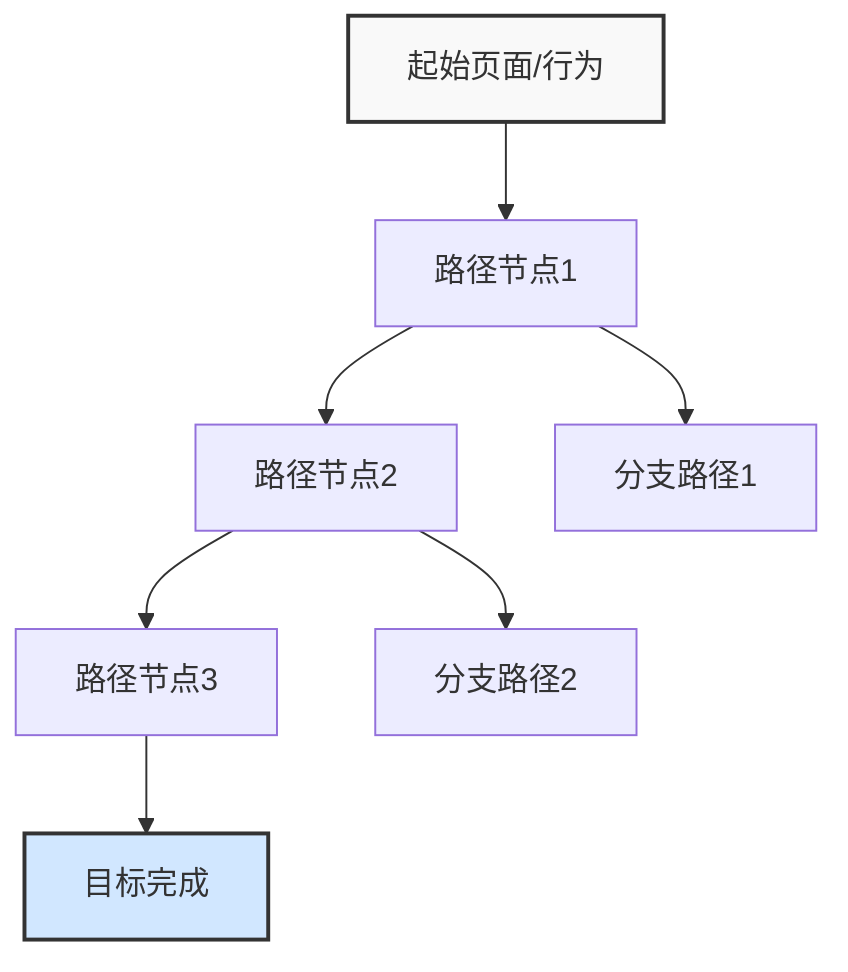

---
{"dg-publish":true,"tags":["用户行为","模板","数据收集","用户研究","行为分析"],"创建日期":"2024-04-27","更新日期":"2024-04-27","permalink":"/知识共享/002_商业分析/04_模板/02_数据收集/用户行为追踪方案模板/","dgPassFrontmatter":true}
---

> [!info] 模板说明
> 本模板用于规划和实施用户行为追踪项目，帮助产品、运营和分析团队系统化收集、分析用户行为数据，获取洞察并驱动产品优化决策。适用于各类数字产品的用户行为研究和数据驱动的产品改进过程。

## 1. 方案概述

| 项目信息         | 内容                                |
|------------------|-------------------------------------|
| 项目名称         | [用户行为追踪项目名称]              |
| 负责团队         | [负责团队名称]                      |
| 项目负责人       | [负责人姓名及职位]                  |
| 项目周期         | [开始日期] 至 [结束日期]            |
| 相关产品/平台    | [产品名称及版本]                    |
| 关联业务目标     | [本次行为追踪关联的业务目标]        |

## 2. 追踪目标与范围

### 2.1 追踪目标

**主要目标**：[明确说明本次用户行为追踪的核心目标]

**具体目标**：
1. [具体目标1，如：了解用户在特定功能的使用路径]
2. [具体目标2，如：识别产品中的摩擦点和流失原因]
3. [具体目标3，如：验证新功能的使用频率与预期]
4. [具体目标4，如：发现用户行为模式和细分特征]

### 2.2 关键问题定义

通过本次追踪，我们希望回答以下关键问题：

1. [关键问题1，如：用户在首次使用产品时遵循哪些路径？]
2. [关键问题2，如：哪些功能使用频率最高/最低？]
3. [关键问题3，如：用户在哪些环节流失率最高？]
4. [关键问题4，如：不同用户群体的行为模式有何差异？]
5. [关键问题5，如：哪些行为与转化/留存强相关？]

### 2.3 追踪范围界定

- **用户范围**：[定义目标用户群体，如：所有用户/新用户/付费用户等]
- **平台范围**：[定义涵盖的平台，如：iOS/Android/Web等]
- **功能范围**：[定义需要追踪的产品功能模块]
- **行为范围**：[定义需要追踪的行为类型，如：点击/浏览/停留时间等]
- **时间范围**：[定义数据收集的时间段]

## 3. 数据采集计划

### 3.1 行为事件定义

| 事件类别 | 事件名称 | 事件描述 | 触发条件 | 采集频率 | 关联目标 | 优先级 |
|----------|----------|----------|----------|----------|----------|--------|
| [页面浏览] | [事件名] | [描述] | [触发条件] | [实时/批量] | [关联目标] | [高/中/低] |
| [功能使用] | [事件名] | [描述] | [触发条件] | [实时/批量] | [关联目标] | [高/中/低] |
| [用户输入] | [事件名] | [描述] | [触发条件] | [实时/批量] | [关联目标] | [高/中/低] |
| [转化行为] | [事件名] | [描述] | [触发条件] | [实时/批量] | [关联目标] | [高/中/低] |
| [错误行为] | [事件名] | [描述] | [触发条件] | [实时/批量] | [关联目标] | [高/中/低] |

### 3.2 属性与参数定义

| 属性类别 | 属性名称 | 属性描述 | 数据类型 | 取值范围 | 采集位置 | 是否必填 |
|----------|----------|----------|----------|----------|----------|----------|
| [用户属性] | [属性名] | [描述] | [类型] | [范围] | [位置] | [是/否] |
| [会话属性] | [属性名] | [描述] | [类型] | [范围] | [位置] | [是/否] |
| [事件属性] | [属性名] | [描述] | [类型] | [范围] | [位置] | [是/否] |
| [环境属性] | [属性名] | [描述] | [类型] | [范围] | [位置] | [是/否] |
| [自定义属性] | [属性名] | [描述] | [类型] | [范围] | [位置] | [是/否] |

### 3.3 用户行为路径定义

| 路径名称 | 起始点 | 终止点 | 关键节点 | 成功指标 | 监控重点 |
|----------|--------|--------|----------|----------|----------|
| [注册流程] | [起始点] | [终止点] | [节点列表] | [转化率目标] | [监控重点] |
| [付费流程] | [起始点] | [终止点] | [节点列表] | [转化率目标] | [监控重点] |
| [核心功能使用] | [起始点] | [终止点] | [节点列表] | [完成率目标] | [监控重点] |

### 3.4 用户行为漏斗定义

| 漏斗名称 | 步骤1 | 步骤2 | 步骤3 | 步骤4 | 步骤5 | 理想转化率 |
|----------|-------|-------|-------|-------|-------|------------|
| [转化漏斗名称] | [定义] | [定义] | [定义] | [定义] | [定义] | [目标%] |

## 4. 数据采集技术实现

### 4.1 采集工具选择

| 工具名称 | 应用场景 | 主要功能 | 优势 | 局限性 | 成本估计 |
|----------|----------|----------|------|--------|----------|
| [工具名] | [场景] | [功能] | [优势] | [局限性] | [成本] |
| [工具名] | [场景] | [功能] | [优势] | [局限性] | [成本] |
| [工具名] | [场景] | [功能] | [优势] | [局限性] | [成本] |

**选择理由**：[说明为何选择特定工具的原因]

### 4.2 技术实现方案

- **代码埋点实现**：[描述如何实现代码埋点，包括SDK集成、API调用等]
- **无埋点实现**：[描述无埋点追踪的配置方法]
- **日志采集实现**：[描述日志收集和处理方案]
- **第三方集成**：[描述与第三方系统的集成方案]

### 4.3 采集验证机制

| 验证环节 | 验证方法 | 验证标准 | 负责人 | 时间节点 |
|----------|----------|----------|--------|----------|
| 开发环境验证 | [方法] | [标准] | [负责人] | [时间] |
| 测试环境验证 | [方法] | [标准] | [负责人] | [时间] |
| 生产环境验证 | [方法] | [标准] | [负责人] | [时间] |
| 数据质量监控 | [方法] | [标准] | [负责人] | [时间] |

## 5. 数据管理与治理

### 5.1 数据存储方案

- **存储平台**：[如：云存储/自建服务器/第三方平台]
- **数据格式**：[如：JSON/CSV/数据库表结构]
- **存储周期**：[数据保留时长]
- **备份策略**：[数据备份方案]
- **扩展性考虑**：[数据量增长的应对策略]

### 5.2 数据安全与隐私

- **数据脱敏措施**：[描述个人敏感信息的处理方法]
- **访问控制策略**：[描述数据访问权限控制]
- **合规性保障**：[如何确保符合GDPR/CCPA等隐私法规]
- **用户告知机制**：[如何告知用户数据收集情况]
- **数据安全审计**：[数据安全审计机制]

### 5.3 数据质量管理

| 质量维度 | 质量指标 | 监控方法 | 阈值设置 | 异常处理 |
|----------|----------|----------|----------|----------|
| 完整性 | [指标] | [方法] | [阈值] | [处理方法] |
| 准确性 | [指标] | [方法] | [阈值] | [处理方法] |
| 一致性 | [指标] | [方法] | [阈值] | [处理方法] |
| 及时性 | [指标] | [方法] | [阈值] | [处理方法] |
| 有效性 | [指标] | [方法] | [阈值] | [处理方法] |

## 6. 数据分析计划

### 6.1 分析框架与方法

- **描述性分析**：[说明如何进行用户行为的描述性分析]
- **行为路径分析**：[说明如何分析用户路径和流转情况]
- **漏斗分析**：[说明如何分析关键转化漏斗]
- **分群分析**：[说明如何基于行为特征分群分析]
- **相关性分析**：[说明如何分析不同行为间的相关性]
- **预测性分析**：[说明如何基于行为数据进行预测]

### 6.2 关键指标定义

| 指标类别 | 指标名称 | 计算公式 | 基准值 | 目标值 | 数据来源 | 分析周期 |
|----------|----------|----------|--------|--------|----------|----------|
| 用户活跃度 | [指标名] | [公式] | [基准] | [目标] | [来源] | [周期] |
| 功能使用 | [指标名] | [公式] | [基准] | [目标] | [来源] | [周期] |
| 用户留存 | [指标名] | [公式] | [基准] | [目标] | [来源] | [周期] |
| 转化效果 | [指标名] | [公式] | [基准] | [目标] | [来源] | [周期] |
| 用户满意度 | [指标名] | [公式] | [基准] | [目标] | [来源] | [周期] |

### 6.3 数据可视化方案

| 可视化类型 | 适用场景 | 展示内容 | 受众群体 | 更新频率 | 实现工具 |
|------------|----------|----------|----------|----------|----------|
| 实时仪表盘 | [场景] | [内容] | [受众] | [频率] | [工具] |
| 行为热图 | [场景] | [内容] | [受众] | [频率] | [工具] |
| 路径流图 | [场景] | [内容] | [受众] | [频率] | [工具] |
| 漏斗图表 | [场景] | [内容] | [受众] | [频率] | [工具] |
| 趋势报告 | [场景] | [内容] | [受众] | [频率] | [工具] |

## 7. 执行与管理计划

### 7.1 项目时间线

| 阶段 | 开始日期 | 结束日期 | 关键里程碑 | 责任人 |
|------|----------|----------|------------|--------|
| 需求规划 | [日期] | [日期] | [里程碑] | [责任人] |
| 技术方案设计 | [日期] | [日期] | [里程碑] | [责任人] |
| 开发实现 | [日期] | [日期] | [里程碑] | [责任人] |
| 测试验证 | [日期] | [日期] | [里程碑] | [责任人] |
| 上线部署 | [日期] | [日期] | [里程碑] | [责任人] |
| 数据收集 | [日期] | [日期] | [里程碑] | [责任人] |
| 数据分析 | [日期] | [日期] | [里程碑] | [责任人] |
| 成果应用 | [日期] | [日期] | [里程碑] | [责任人] |

### 7.2 团队角色与职责

| 角色 | 职责描述 | 所需技能 | 团队成员 | 工作量估计 |
|------|----------|----------|----------|------------|
| 产品经理 | [职责] | [技能] | [成员] | [工作量] |
| 数据分析师 | [职责] | [技能] | [成员] | [工作量] |
| 前端开发 | [职责] | [技能] | [成员] | [工作量] |
| 后端开发 | [职责] | [技能] | [成员] | [工作量] |
| 测试工程师 | [职责] | [技能] | [成员] | [工作量] |
| 数据工程师 | [职责] | [技能] | [成员] | [工作量] |

### 7.3 风险管理

| 风险描述 | 影响程度(1-5) | 发生概率(1-5) | 风险等级 | 预防措施 | 应对策略 | 责任人 |
|----------|--------------|--------------|----------|----------|----------|--------|
| [风险1] | [级别] | [概率] | [等级] | [预防] | [应对] | [责任人] |
| [风险2] | [级别] | [概率] | [等级] | [预防] | [应对] | [责任人] |
| [风险3] | [级别] | [概率] | [等级] | [预防] | [应对] | [责任人] |

## 8. 应用与反馈闭环

### 8.1 数据应用场景

| 应用场景 | 关联数据 | 应用方式 | 预期效果 | 评估指标 | 负责团队 |
|----------|----------|----------|----------|----------|----------|
| 产品优化 | [数据] | [方式] | [效果] | [指标] | [团队] |
| 用户体验改进 | [数据] | [方式] | [效果] | [指标] | [团队] |
| 营销策略调整 | [数据] | [方式] | [效果] | [指标] | [团队] |
| 个性化推荐 | [数据] | [方式] | [效果] | [指标] | [团队] |
| 异常行为监控 | [数据] | [方式] | [效果] | [指标] | [团队] |

### 8.2 行动计划制定

根据行为数据分析，我们将制定以下行动计划：

| 洞察发现 | 行动计划 | 优先级 | 负责团队 | 时间安排 | 成功标准 |
|----------|----------|--------|----------|----------|----------|
| [发现1] | [计划] | [高/中/低] | [团队] | [时间] | [标准] |
| [发现2] | [计划] | [高/中/低] | [团队] | [时间] | [标准] |
| [发现3] | [计划] | [高/中/低] | [团队] | [时间] | [标准] |

### 8.3 效果评估与优化

| 优化措施 | 实施时间 | 评估方法 | 基准指标 | 目标指标 | 实际效果 | 下一步计划 |
|----------|----------|----------|----------|----------|----------|------------|
| [措施1] | [时间] | [方法] | [基准] | [目标] | [效果] | [计划] |
| [措施2] | [时间] | [方法] | [基准] | [目标] | [效果] | [计划] |
| [措施3] | [时间] | [方法] | [基准] | [目标] | [效果] | [计划] |

## 9. 知识积累与经验共享

### 9.1 方法论总结

基于本次追踪项目，我们总结出以下实用方法：

1. [方法1及适用场景]
2. [方法2及适用场景]
3. [方法3及适用场景]

### 9.2 最佳实践

根据项目实施经验，推荐以下最佳实践：

1. [最佳实践1]
2. [最佳实践2]
3. [最佳实践3]

### 9.3 后续改进建议

针对行为追踪系统自身的改进建议：

1. [改进建议1]
2. [改进建议2]
3. [改进建议3]

## 10. 附录

### 10.1 术语表

| 术语 | 定义 | 使用场景 |
|------|------|----------|
| [术语1] | [定义] | [场景] |
| [术语2] | [定义] | [场景] |
| [术语3] | [定义] | [场景] |

### 10.2 参考资料

1. [行业标准或最佳实践参考]
2. [相关技术文档链接]
3. [相关研究或案例参考]

### 10.3 技术文档

- 埋点实施指南
- 事件参数标准规范
- 数据模型设计文档
- API接口文档

---

*本模板提供了用户行为追踪的完整框架，实际使用时应根据具体项目需求和产品特点进行调整。确保技术实现、数据分析与业务目标紧密结合，形成数据驱动的产品优化闭环。* 