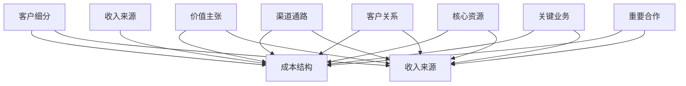
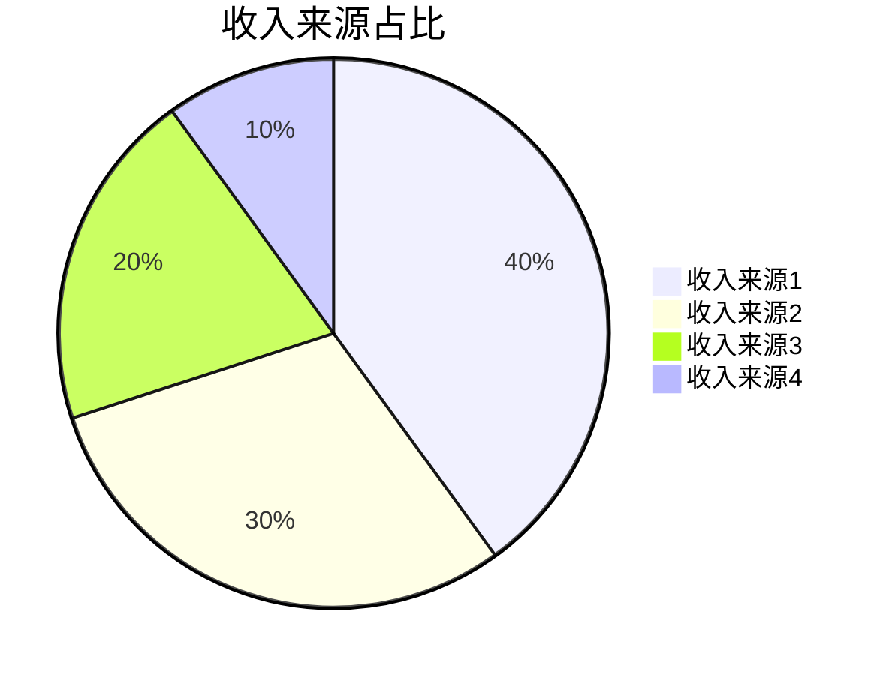
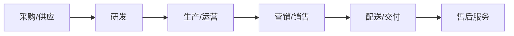
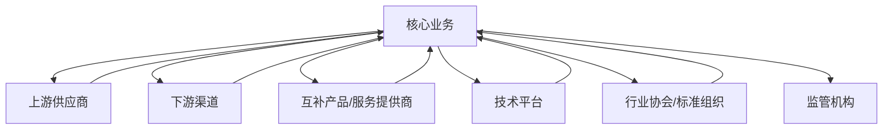
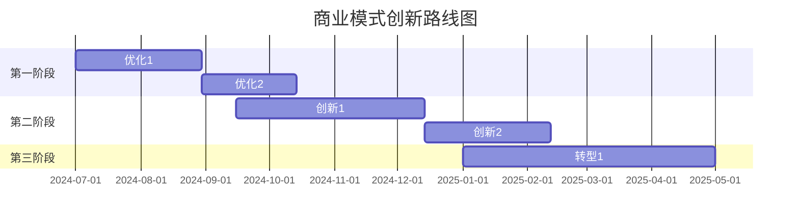

---
{"dg-publish":true,"tags":["商业模式","报告","模板","商业分析","战略"],"创建日期":"2024-04-27","更新日期":"2024-04-27","permalink":"/知识共享/002_商业分析/04_模板/03_报告/商业模式分析报告模板/","dgPassFrontmatter":true}
---

> [!info] 模板说明
> 本模板适用于对企业、产品或项目的商业模式进行系统性分析。包含从商业模式画布、价值主张、收入结构到竞争优势和发展策略的全面评估，帮助决策者理解业务运作方式、盈利逻辑以及可持续发展路径。

## 1. 报告摘要

### 基本信息

| 项目信息       | 内容                                |
|----------------|-------------------------------------|
| 报告标题       | [企业/产品名称] 商业模式分析报告    |
| 分析对象       | [企业/产品/项目名称]                |
| 分析范围       | [详细说明分析范围和边界]            |
| 报告撰写人     | [姓名/团队]                         |
| 撰写日期       | YYYY-MM-DD                          |
| 报告版本       | V1.0                                |
| 分析目的       | [简述分析目的]                      |

### 执行摘要

[提供商业模式分析的主要发现和关键结论，控制在300字以内。简明扼要地概述分析对象的核心商业模式、主要优势、关键挑战和发展机会]

### 核心发现一览

1. **发现1**：[简短描述核心发现]
2. **发现2**：[简短描述核心发现]
3. **发现3**：[简短描述核心发现]
4. **发现4**：[简短描述核心发现]
5. **发现5**：[简短描述核心发现]

### 建议摘要

1. **建议1**：[简短描述关键建议]
2. **建议2**：[简短描述关键建议]
3. **建议3**：[简短描述关键建议]
4. **建议4**：[简短描述关键建议]
5. **建议5**：[简短描述关键建议]

## 2. 分析背景与方法

### 分析背景

[详细描述进行商业模式分析的背景和原因，包括行业环境、企业/产品发展阶段、面临的挑战或机遇等]

### 分析目标

**主要目标**：
[描述此次分析的主要目标]

**具体目标**：
1. [具体目标1]
2. [具体目标2]
3. [具体目标3]
4. [具体目标4]

### 分析方法与框架

**主要分析框架**：
1. **商业模式画布**：[简述如何应用商业模式画布]
2. **价值链分析**：[简述如何应用价值链分析]
3. **SWOT分析**：[简述如何应用SWOT分析]
4. **竞争战略分析**：[简述如何应用竞争战略分析]
5. **其他框架**：[简述其他使用的分析框架]

**数据来源**：
[描述分析中使用的主要数据来源，如行业报告、财务数据、市场调研、专家访谈等]

## 3. 商业模式概述

### 商业模式画布

| 商业模式要素   | 描述                                |
|----------------|-------------------------------------|
| 客户细分       | [描述主要客户群体和细分市场]        |
| 价值主张       | [描述产品/服务提供的核心价值]       |
| 渠道通路       | [描述接触客户和交付价值的渠道]      |
| 客户关系       | [描述与不同客户群体建立的关系类型]  |
| 收入来源       | [描述主要收入流和定价机制]          |
| 核心资源       | [描述实现商业模式所需的关键资源]    |
| 关键业务       | [描述实现商业模式所需的关键活动]    |
| 重要合作       | [描述帮助实现商业模式的关键合作伙伴]|
| 成本结构       | [描述商业模式产生的主要成本]        |

### 商业模式分类与定位

**商业模式类型**：
[分析该商业模式属于哪种类型，如平台型、订阅型、免费增值型等]

**商业模式定位**：
[分析该商业模式在价值创造和价值获取方面的定位]

### 核心价值主张分析

**价值主张画布**：

| 价值主张要素   | 描述                                |
|----------------|-------------------------------------|
| 客户工作       | [客户想要完成的任务或解决的问题]    |
| 客户痛点       | [客户在完成工作时遇到的挑战和困难]  |
| 客户收益       | [客户期望获得的好处和正面成果]      |
| 产品/服务      | [提供的产品和服务]                  |
| 痛点缓解       | [如何缓解客户痛点]                  |
| 收益创造       | [如何为客户创造收益]                |

**价值主张差异化**：
[分析价值主张相对于竞争对手的差异化程度和独特性]

## 4. 收入模式与盈利分析

### 收入来源结构

| 收入来源       | 占比       | 特点描述                | 增长趋势     | 前景评估     |
|----------------|------------|-------------------------|--------------|--------------|
| [收入来源1]    | [XX%]      | [描述特点]              | [描述趋势]   | [前景评估]   |
| [收入来源2]    | [XX%]      | [描述特点]              | [描述趋势]   | [前景评估]   |
| [收入来源3]    | [XX%]      | [描述特点]              | [描述趋势]   | [前景评估]   |
| [收入来源4]    | [XX%]      | [描述特点]              | [描述趋势]   | [前景评估]   |

### 定价策略分析

| 产品/服务      | 定价模式   | 价格水平   | 价格敏感度 | 竞争对比     | 优化方向     |
|----------------|------------|------------|------------|--------------|--------------|
| [产品/服务1]   | [定价模式] | [价格水平] | [高/中/低] | [与竞争对比] | [优化方向]   |
| [产品/服务2]   | [定价模式] | [价格水平] | [高/中/低] | [与竞争对比] | [优化方向]   |
| [产品/服务3]   | [定价模式] | [价格水平] | [高/中/低] | [与竞争对比] | [优化方向]   |

**定价策略评估**：
[综合评估定价策略的有效性，包括对客户价值感知、市场竞争和盈利能力的影响]

### 盈利能力分析

**盈利模式**：
[描述如何通过收入和成本结构实现盈利]

**关键财务指标**：

| 指标           | 数值/比率  | 行业基准   | 差异分析   | 发展趋势     |
|----------------|------------|------------|------------|--------------|
| 毛利率         | [XX%]      | [XX%]      | [分析]     | [趋势]       |
| 净利率         | [XX%]      | [XX%]      | [分析]     | [趋势]       |
| ROI            | [XX%]      | [XX%]      | [分析]     | [趋势]       |
| 获客成本       | [数值]     | [数值]     | [分析]     | [趋势]       |
| 客户终身价值   | [数值]     | [数值]     | [分析]     | [趋势]       |
| 收入增长率     | [XX%]      | [XX%]      | [分析]     | [趋势]       |

**盈利能力评估**：
[综合评估盈利能力的强弱和可持续性]

## 5. 资源与能力分析

### 核心资源评估

| 资源类别       | 关键资源                | 资源优势                | 资源劣势                | 资源稀缺性              |
|----------------|-------------------------|-------------------------|-------------------------|-------------------------|
| 有形资源       | [列出关键有形资源]      | [分析优势]              | [分析劣势]              | [评估稀缺性]            |
| 无形资源       | [列出关键无形资源]      | [分析优势]              | [分析劣势]              | [评估稀缺性]            |
| 人力资源       | [列出关键人力资源]      | [分析优势]              | [分析劣势]              | [评估稀缺性]            |
| 财务资源       | [列出关键财务资源]      | [分析优势]              | [分析劣势]              | [评估稀缺性]            |

### 关键能力评估

**核心能力**：
1. **能力1**：[描述能力] - [评估强度：高/中/低] - [评估可替代性：高/中/低]
2. **能力2**：[描述能力] - [评估强度：高/中/低] - [评估可替代性：高/中/低]
3. **能力3**：[描述能力] - [评估强度：高/中/低] - [评估可替代性：高/中/低]
4. **能力4**：[描述能力] - [评估强度：高/中/低] - [评估可替代性：高/中/低]

**能力差距分析**：
[分析与竞争对手相比存在的能力差距，以及对商业模式的影响]

### 价值链分析

| 价值链环节     | 活动描述                | 价值贡献                | 成本占比                | 优化方向                |
|----------------|-------------------------|-------------------------|-------------------------|-------------------------|
| 采购/供应      | [描述关键活动]          | [分析价值贡献]          | [分析成本占比]          | [提出优化方向]          |
| 研发           | [描述关键活动]          | [分析价值贡献]          | [分析成本占比]          | [提出优化方向]          |
| 生产/运营      | [描述关键活动]          | [分析价值贡献]          | [分析成本占比]          | [提出优化方向]          |
| 营销/销售      | [描述关键活动]          | [分析价值贡献]          | [分析成本占比]          | [提出优化方向]          |
| 配送/交付      | [描述关键活动]          | [分析价值贡献]          | [分析成本占比]          | [提出优化方向]          |
| 售后服务       | [描述关键活动]          | [分析价值贡献]          | [分析成本占比]          | [提出优化方向]          |

## 6. 合作伙伴与生态系统分析

### 关键合作伙伴

| 合作伙伴类型   | 主要合作伙伴            | 合作内容                | 合作价值                | 依赖程度                |
|----------------|-------------------------|-------------------------|-------------------------|-------------------------|
| 供应商         | [列出关键供应商]        | [描述合作内容]          | [分析合作价值]          | [评估依赖程度]          |
| 渠道伙伴       | [列出关键渠道伙伴]      | [描述合作内容]          | [分析合作价值]          | [评估依赖程度]          |
| 技术伙伴       | [列出关键技术伙伴]      | [描述合作内容]          | [分析合作价值]          | [评估依赖程度]          |
| 战略联盟       | [列出关键战略联盟]      | [描述合作内容]          | [分析合作价值]          | [评估依赖程度]          |
| 其他伙伴       | [列出其他关键伙伴]      | [描述合作内容]          | [分析合作价值]          | [评估依赖程度]          |

### 生态系统分析

**生态系统地图**：

**生态系统地位与角色**：
[分析在产业生态系统中的位置和扮演的角色]

**生态系统健康度评估**：
[评估生态系统的整体健康度、稳定性和可持续性]

## 7. 竞争分析

### 竞争格局分析

**行业竞争格局**：
[描述行业整体竞争格局和主要竞争对手]

**主要竞争对手商业模式比较**：

| 竞争维度       | 本企业                  | 竞争对手1               | 竞争对手2               | 竞争对手3               |
|----------------|-------------------------|-------------------------|-------------------------|-------------------------|
| 目标客户       | [描述]                  | [描述]                  | [描述]                  | [描述]                  |
| 价值主张       | [描述]                  | [描述]                  | [描述]                  | [描述]                  |
| 收入模式       | [描述]                  | [描述]                  | [描述]                  | [描述]                  |
| 核心资源       | [描述]                  | [描述]                  | [描述]                  | [描述]                  |
| 渠道策略       | [描述]                  | [描述]                  | [描述]                  | [描述]                  |
| 成本结构       | [描述]                  | [描述]                  | [描述]                  | [描述]                  |
| 市场份额       | [XX%]                   | [XX%]                   | [XX%]                   | [XX%]                   |
| 优势           | [分析优势]              | [分析优势]              | [分析优势]              | [分析优势]              |
| 劣势           | [分析劣势]              | [分析劣势]              | [分析劣势]              | [分析劣势]              |

### 竞争优势分析

**竞争优势来源**：
1. **优势1**：[描述竞争优势] - [分析优势来源] - [评估持久性：高/中/低]
2. **优势2**：[描述竞争优势] - [分析优势来源] - [评估持久性：高/中/低]
3. **优势3**：[描述竞争优势] - [分析优势来源] - [评估持久性：高/中/低]
4. **优势4**：[描述竞争优势] - [分析优势来源] - [评估持久性：高/中/低]

**竞争劣势分析**：
1. **劣势1**：[描述竞争劣势] - [分析劣势影响] - [提出应对策略]
2. **劣势2**：[描述竞争劣势] - [分析劣势影响] - [提出应对策略]
3. **劣势3**：[描述竞争劣势] - [分析劣势影响] - [提出应对策略]

### 竞争战略定位

**波特五力分析**：

| 竞争力量       | 强度评级   | 关键影响因素            | 应对策略                |
|----------------|------------|-------------------------|-------------------------|
| 行业内竞争     | [高/中/低] | [描述关键影响因素]      | [描述应对策略]          |
| 新进入者威胁   | [高/中/低] | [描述关键影响因素]      | [描述应对策略]          |
| 替代品威胁     | [高/中/低] | [描述关键影响因素]      | [描述应对策略]          |
| 供应商议价能力 | [高/中/低] | [描述关键影响因素]      | [描述应对策略]          |
| 买家议价能力   | [高/中/低] | [描述关键影响因素]      | [描述应对策略]          |

**战略定位评估**：
[评估当前竞争战略定位的有效性和可持续性]

## 8. SWOT分析

### 内部因素分析

**优势(Strengths)**：
1. [描述优势1]
2. [描述优势2]
3. [描述优势3]
4. [描述优势4]
5. [描述优势5]

**劣势(Weaknesses)**：
1. [描述劣势1]
2. [描述劣势2]
3. [描述劣势3]
4. [描述劣势4]
5. [描述劣势5]

### 外部因素分析

**机会(Opportunities)**：
1. [描述机会1]
2. [描述机会2]
3. [描述机会3]
4. [描述机会4]
5. [描述机会5]

**威胁(Threats)**：
1. [描述威胁1]
2. [描述威胁2]
3. [描述威胁3]
4. [描述威胁4]
5. [描述威胁5]

### SWOT矩阵策略分析

| SWOT策略      | 优势(S)                 | 劣势(W)                 |
|---------------|-------------------------|-------------------------|
| **机会(O)**   | **SO策略** [利用优势抓住机会的策略] | **WO策略** [利用机会克服劣势的策略] |
| **威胁(T)**   | **ST策略** [利用优势应对威胁的策略] | **WT策略** [减少劣势并避免威胁的策略] |

## 9. 商业模式风险评估

### 关键风险识别

| 风险类别       | 风险描述                | 发生概率   | 影响程度   | 风险等级   | 应对策略                |
|----------------|-------------------------|------------|------------|------------|-------------------------|
| 战略风险       | [描述风险]              | [高/中/低] | [高/中/低] | [高/中/低] | [描述应对策略]          |
| 市场风险       | [描述风险]              | [高/中/低] | [高/中/低] | [高/中/低] | [描述应对策略]          |
| 运营风险       | [描述风险]              | [高/中/低] | [高/中/低] | [高/中/低] | [描述应对策略]          |
| 财务风险       | [描述风险]              | [高/中/低] | [高/中/低] | [高/中/低] | [描述应对策略]          |
| 技术风险       | [描述风险]              | [高/中/低] | [高/中/低] | [高/中/低] | [描述应对策略]          |
| 法律合规风险   | [描述风险]              | [高/中/低] | [高/中/低] | [高/中/低] | [描述应对策略]          |

### 商业模式弹性评估

**面对不确定性的适应能力**：
[评估商业模式面对市场变化、技术革新和竞争压力的适应能力]

**危机应对能力**：
[评估在面对危机和重大不确定性时的抵御能力和恢复能力]

## 10. 商业模式创新与优化

### 商业模式评估

**商业模式效率**：
[评估当前商业模式在资源利用、成本控制和运营流程方面的效率]

**商业模式有效性**：
[评估当前商业模式在创造客户价值和实现收入增长方面的有效性]

**商业模式可扩展性**：
[评估商业模式在不增加同等比例成本的情况下扩大规模的能力]

### 商业模式优化建议

**短期优化建议（0-6个月）**：

| 优化领域       | 具体建议                | 预期效果                | 实施复杂度 | 优先级     |
|----------------|-------------------------|-------------------------|------------|------------|
| [优化领域1]    | [描述具体建议]          | [描述预期效果]          | [高/中/低] | [高/中/低] |
| [优化领域2]    | [描述具体建议]          | [描述预期效果]          | [高/中/低] | [高/中/低] |
| [优化领域3]    | [描述具体建议]          | [描述预期效果]          | [高/中/低] | [高/中/低] |

**中长期战略调整建议（6-24个月）**：

| 战略调整领域   | 具体建议                | 预期效果                | 实施复杂度 | 优先级     |
|----------------|-------------------------|-------------------------|------------|------------|
| [调整领域1]    | [描述具体建议]          | [描述预期效果]          | [高/中/低] | [高/中/低] |
| [调整领域2]    | [描述具体建议]          | [描述预期效果]          | [高/中/低] | [高/中/低] |
| [调整领域3]    | [描述具体建议]          | [描述预期效果]          | [高/中/低] | [高/中/低] |

### 创新方向探索

**潜在商业模式创新方向**：
1. **创新方向1**：[描述创新方向] - [分析可行性] - [预期影响]
2. **创新方向2**：[描述创新方向] - [分析可行性] - [预期影响]
3. **创新方向3**：[描述创新方向] - [分析可行性] - [预期影响]

**创新路线图**：

## 11. 结论与建议

### 主要结论

1. **结论1**：[详细描述主要结论]
2. **结论2**：[详细描述主要结论]
3. **结论3**：[详细描述主要结论]
4. **结论4**：[详细描述主要结论]
5. **结论5**：[详细描述主要结论]

### 行动建议

**优先行动项**：
1. **行动1**：[详细描述行动建议] - [预期成果] - [建议时间表]
2. **行动2**：[详细描述行动建议] - [预期成果] - [建议时间表]
3. **行动3**：[详细描述行动建议] - [预期成果] - [建议时间表]

**关键成功因素**：
[分析成功实施这些建议的关键因素]

**潜在障碍与应对策略**：
[分析可能遇到的障碍和相应的应对策略]

## 12. 附录

### 分析方法详解

[详细解释报告中使用的分析方法和框架]

### 数据来源与参考资料

1. [列出主要数据来源]
2. [列出参考的行业报告]
3. [列出参考的学术文献]
4. [列出其他参考资料]

### 术语表

| 术语           | 定义                                |
|----------------|-------------------------------------|
| [术语1]        | [提供术语的明确定义]                |
| [术语2]        | [提供术语的明确定义]                |
| [术语3]        | [提供术语的明确定义]                |
| [术语4]        | [提供术语的明确定义]                |
| [术语5]        | [提供术语的明确定义]                |

---

*本报告由[分析团队/部门]编制，旨在提供对[分析对象]商业模式的系统性分析和建议。如有任何疑问或需要进一步讨论，请联系[联系人]。* 