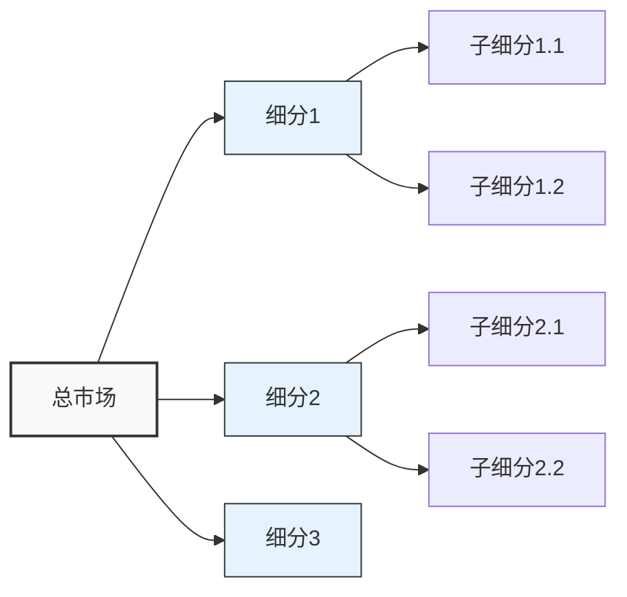
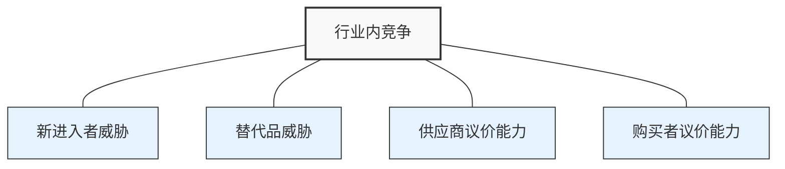

---
{"dg-publish":true,"tags":["市场","报告","模板","分析"],"创建日期":"2024-04-27","更新日期":"2024-04-27","permalink":"/知识共享/002_商业分析/04_模板/03_报告/市场分析报告模板/","dgPassFrontmatter":true}
---

> [!info] 模板说明
> 本模板提供了一个结构化的市场分析报告框架，帮助分析师系统地收集、分析和呈现市场数据，为战略决策提供依据。适用于市场调研、进入新市场、产品规划等场景。

## 报告概要

| 报告信息     | 内容                               |
|--------------|-----------------------------------|
| 报告标题     | [市场名称] 市场分析报告            |
| 分析范围     | [界定分析的市场边界和范围]         |
| 编制人员     | [报告撰写人员]                     |
| 报告日期     | [YYYY-MM-DD]                      |
| 报告版本     | [如：V1.0]                         |
| 目标读者     | [如：管理层/产品团队/投资者等]     |

## 1. 执行摘要

*【在此处提供整个报告的核心发现和建议，篇幅控制在1页内】*

### 关键发现
- [关键发现1]
- [关键发现2]
- [关键发现3]

### 主要建议
- [主要建议1]
- [主要建议2]
- [主要建议3]

## 2. 研究方法

### 研究目标
- [明确说明此次市场分析的目标和预期解决的问题]

### 数据来源
- **一手数据**：[描述如何收集一手数据，如问卷调查、访谈、观察等]
- **二手数据**：[列出使用的二手数据来源，如行业报告、政府统计、竞争对手资料等]

### 分析方法
- [详述使用的定量和定性分析方法]
- [说明数据验证和质量控制的方法]

## 3. 市场概况

### 市场定义与细分

**市场定义**：[清晰界定市场范围]

**细分市场**：
| 细分市场 | 特征描述 | 规模估计 | 增长率 | 吸引力评分(1-5) |
|----------|---------|----------|--------|----------------|
| 细分1    |         |          |        |                |
| 细分2    |         |          |        |                |
| 细分3    |         |          |        |                |

### 市场规模与增长

| 指标           | 当前数值 | 过去3年CAGR | 未来5年预测 | 数据来源 |
|----------------|----------|-------------|------------|----------|
| 总市场规模     |          |             |            |          |
| 细分市场1规模  |          |             |            |          |
| 细分市场2规模  |          |             |            |          |
| 按地区分布     |          |             |            |          |
| 按产品类型分布 |          |             |            |          |

### 市场生命周期

- **当前阶段**：[引入期/成长期/成熟期/衰退期]
- **阶段特征**：[描述当前市场生命周期阶段的关键特征]
- **未来演变**：[预测市场生命周期的发展趋势]

## 4. 宏观环境分析 (PEST分析)

### 政治-法律因素
- [政治因素1]：[影响分析与评级：正面/负面/中性]
- [政治因素2]：[影响分析与评级：正面/负面/中性]
- [法律法规1]：[影响分析与评级：正面/负面/中性]
- [法律法规2]：[影响分析与评级：正面/负面/中性]

### 经济因素
- [经济因素1]：[影响分析与评级：正面/负面/中性]
- [经济因素2]：[影响分析与评级：正面/负面/中性]
- [经济因素3]：[影响分析与评级：正面/负面/中性]

### 社会-文化因素
- [社会因素1]：[影响分析与评级：正面/负面/中性]
- [社会因素2]：[影响分析与评级：正面/负面/中性]
- [文化因素1]：[影响分析与评级：正面/负面/中性]
- [人口因素1]：[影响分析与评级：正面/负面/中性]

### 技术因素
- [技术因素1]：[影响分析与评级：正面/负面/中性]
- [技术因素2]：[影响分析与评级：正面/负面/中性]
- [技术发展趋势1]：[影响分析与评级：正面/负面/中性]
- [技术发展趋势2]：[影响分析与评级：正面/负面/中性]

### PEST因素优先级排序

| 因素 | 影响程度(1-5) | 发生概率(1-5) | 时间紧迫度(1-5) | 总评分 | 优先级 |
|------|--------------|--------------|----------------|--------|--------|
| 因素1 |             |              |                |        |        |
| 因素2 |             |              |                |        |        |
| 因素3 |             |              |                |        |        |
| 因素4 |             |              |                |        |        |

## 5. 竞争格局分析

### 行业集中度
- **市场集中度指数**：[如：CR4, HHI指数]
- **市场结构类型**：[垄断/寡头垄断/垄断竞争/完全竞争]
- **集中度分析**：[对市场集中程度的分析和评论]

### 主要竞争者分析

| 竞争者 | 市场份额 | 主要产品/服务 | 目标客户群 | 核心竞争优势 | 战略定位 | 近期动向 |
|--------|----------|--------------|-----------|--------------|----------|----------|
| 竞争者1 |          |              |           |              |          |          |
| 竞争者2 |          |              |           |              |          |          |
| 竞争者3 |          |              |           |              |          |          |
| 竞争者4 |          |              |           |              |          |          |

### 价值链分析
- **上游供应商**：[供应商集中度、议价能力分析]
- **下游渠道**：[销售渠道特点、发展趋势]
- **价值分配**：[产业链各环节价值创造和分配情况]

### 波特五力分析

| 竞争力量 | 影响因素 | 强度评分(1-5) | 趋势变化 | 影响分析 |
|----------|----------|--------------|----------|----------|
| 行业内竞争 |        |              |          |          |
| 新进入者威胁 |      |              |          |          |
| 替代品威胁 |        |              |          |          |
| 供应商议价能力 |    |              |          |          |
| 购买者议价能力 |    |              |          |          |

## 6. 消费者/客户分析

### 客户细分与画像

| 客户细分 | 人口特征 | 行为特征 | 需求特点 | 购买决策因素 | 规模估计 |
|----------|----------|----------|----------|--------------|----------|
| 客户群1  |          |          |          |              |          |
| 客户群2  |          |          |          |              |          |
| 客户群3  |          |          |          |              |          |

### 客户需求分析
- **核心需求**：[描述目标客户的主要需求点]
- **显性需求**：[已被明确表达的需求]
- **隐性需求**：[尚未被明确表达但存在的需求]
- **需求变化趋势**：[描述客户需求的演变趋势]

### 购买行为分析
- **购买决策过程**：[描述客户的购买决策流程和关键影响因素]
- **影响购买的关键因素**：[按重要性排序]
- **客户忠诚度分析**：[评估客户忠诚度和品牌转换意愿]

## 7. 市场趋势与预测

### 关键趋势分析

| 趋势类别 | 趋势描述 | 影响程度(1-5) | 时间框架 | 机会/威胁 |
|----------|----------|--------------|----------|-----------|
| 消费趋势 |          |              |          |           |
| 技术趋势 |          |              |          |           |
| 竞争趋势 |          |              |          |           |
| 渠道趋势 |          |              |          |           |
| 监管趋势 |          |              |          |           |

### 市场预测
- **短期预测(1-2年)**：[量化预测与定性分析]
- **中期预测(3-5年)**：[量化预测与定性分析]
- **长期预测(5+年)**：[量化预测与定性分析]

### 情景分析

| 情景 | 触发条件 | 市场影响 | 发生概率(1-5) | 应对策略 |
|------|----------|----------|--------------|----------|
| 乐观情景 |        |          |              |          |
| 基准情景 |        |          |              |          |
| 悲观情景 |        |          |              |          |

## 8. SWOT分析

### 市场机会
1. [机会1]
2. [机会2]
3. [机会3]

### 市场威胁
1. [威胁1]
2. [威胁2]
3. [威胁3]

### 我方优势(相对于竞争对手)
1. [优势1]
2. [优势2]
3. [优势3]

### 我方劣势(相对于竞争对手)
1. [劣势1]
2. [劣势2]
3. [劣势3]

### SWOT策略矩阵

| | 优势(S) | 劣势(W) |
|-|--------|--------|
| **机会(O)** | **SO策略** 1. [利用优势抓住机会的策略1] 2. [利用优势抓住机会的策略2] | **WO策略** 1. [克服劣势抓住机会的策略1] 2. [克服劣势抓住机会的策略2] |
| **威胁(T)** | **ST策略** 1. [利用优势应对威胁的策略1] 2. [利用优势应对威胁的策略2] | **WT策略** 1. [克服劣势回避威胁的策略1] 2. [克服劣势回避威胁的策略2] |

## 9. 进入与发展策略建议

### 市场进入评估

| 评估维度 | 评分(1-5) | 评估依据 | 备注 |
|----------|-----------|----------|------|
| 市场吸引力 |         |          |      |
| 进入壁垒 |           |          |      |
| 竞争激烈程度 |       |          |      |
| 我方竞争力 |         |          |      |
| 风险水平 |           |          |      |
| 总体评分 |           |          |      |

### 进入模式评估

| 进入模式 | 优势 | 劣势 | 资源需求 | 风险水平 | 适用性评分(1-5) |
|----------|------|------|----------|----------|----------------|
| 自建发展 |      |      |          |          |                |
| 并购     |      |      |          |          |                |
| 合资     |      |      |          |          |                |
| 授权/特许 |     |      |          |          |                |
| 出口     |      |      |          |          |                |

### 战略建议

**短期行动建议(0-12个月)**
1. [建议1]
2. [建议2]
3. [建议3]

**中期战略方向(1-3年)**
1. [战略方向1]
2. [战略方向2]
3. [战略方向3]

**长期战略布局(3年以上)**
1. [战略布局1]
2. [战略布局2]
3. [战略布局3]

## 10. 风险评估

| 风险类别 | 风险描述 | 影响程度(1-5) | 发生概率(1-5) | 风险评分 | 缓解措施 |
|----------|----------|--------------|--------------|----------|----------|
| 市场风险 |          |              |              |          |          |
| 竞争风险 |          |              |              |          |          |
| 运营风险 |          |              |              |          |          |
| 财务风险 |          |              |              |          |          |
| 法律风险 |          |              |              |          |          |

## 11. 附录

### 数据来源与参考文献
1. [参考文献1]
2. [参考文献2]
3. [参考文献3]

### 研究方法详述
- [具体说明数据收集和分析的详细方法]

### 关键术语表
- **[术语1]**：[解释]
- **[术语2]**：[解释]
- **[术语3]**：[解释]

### 补充数据图表
- [附加数据表格]
- [附加图表]
- [市场调研问卷样本]

---

*本报告模板可根据具体分析需求进行调整，建议根据实际项目情况增减章节和内容。* 