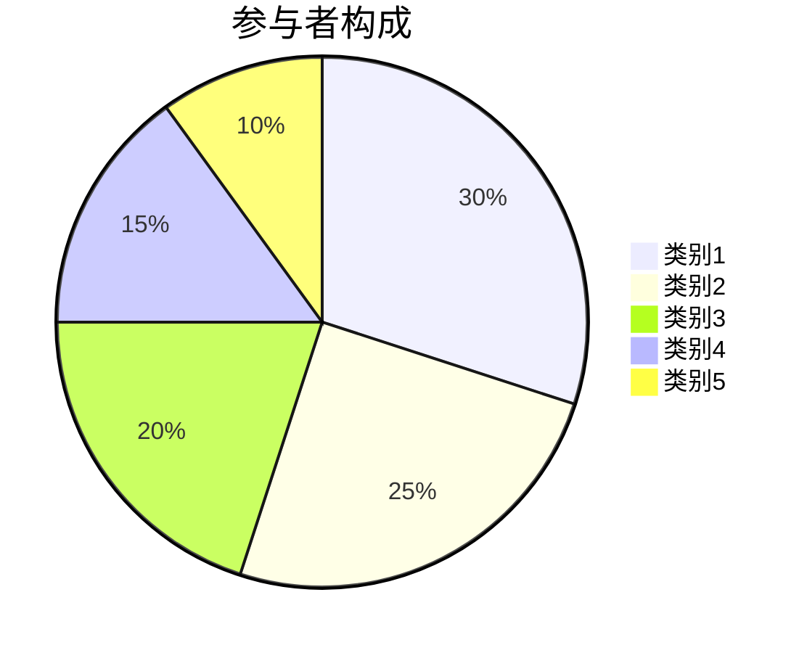
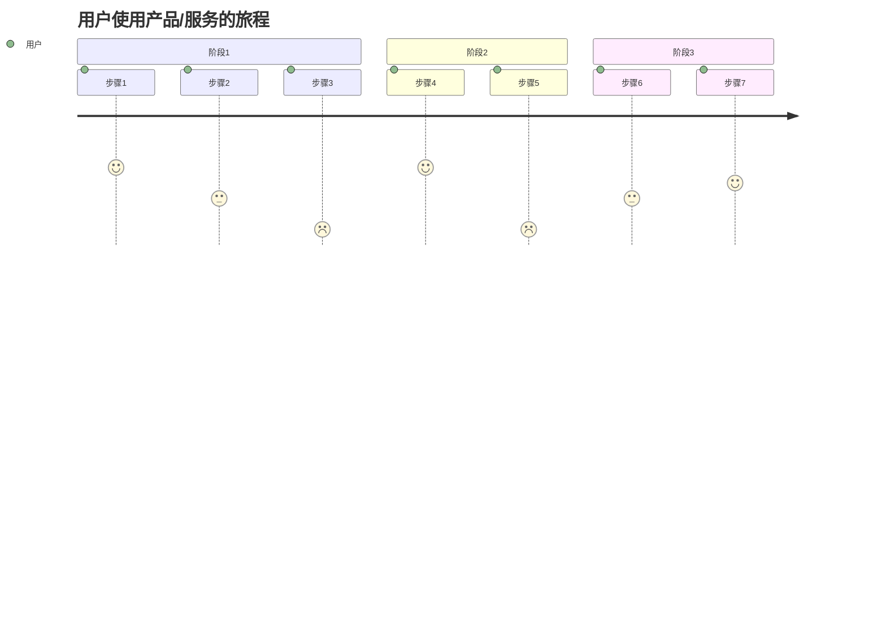
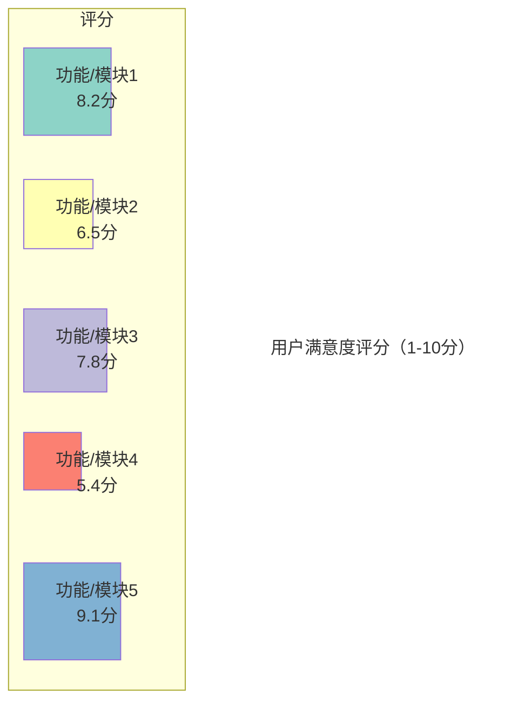
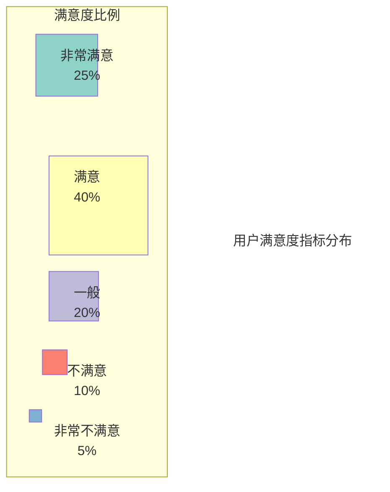
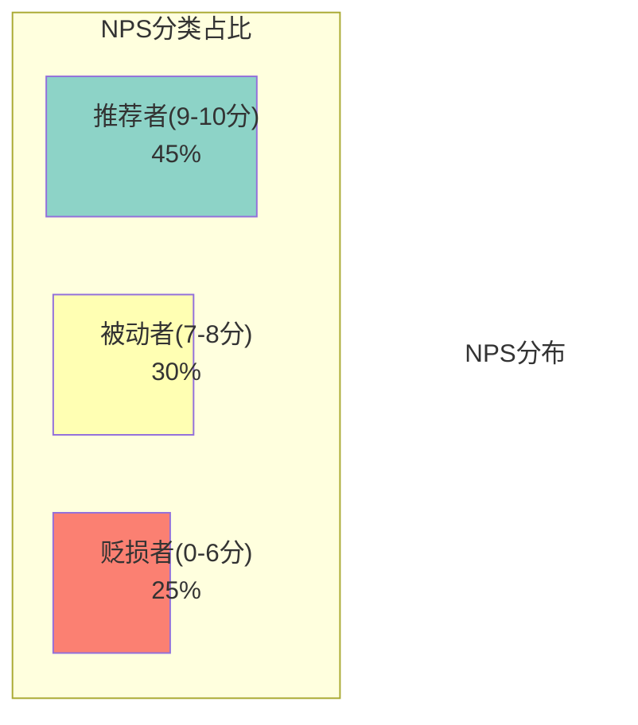
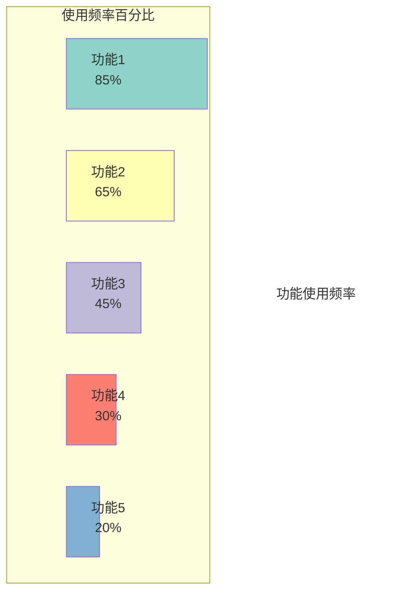
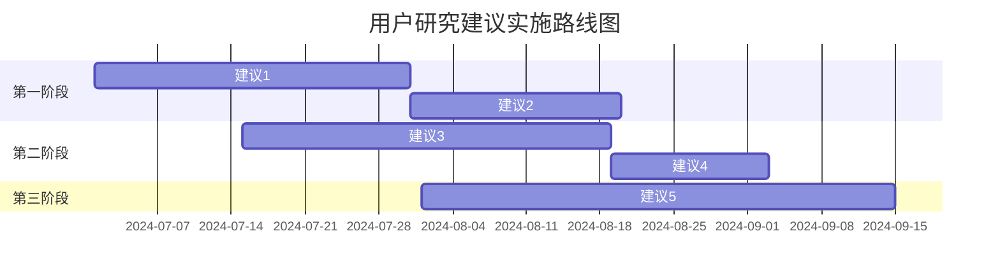

---
{"dg-publish":true,"tags":["用户研究","报告","模板","商业分析","用户体验"],"创建日期":"2024-04-27","更新日期":"2024-04-27","permalink":"/知识共享/002_商业分析/04_模板/03_报告/用户研究报告模板/","dgPassFrontmatter":true}
---

> [!info] 模板说明
> 本模板适用于各类用户研究活动的结果汇报，包括用户访谈、问卷调查、可用性测试等方法获取的用户洞察。通过系统性地呈现研究发现，为产品决策提供基于用户需求的依据。

## 1. 研究摘要

### 研究基本信息

| 项目信息       | 内容                                 |
|----------------|--------------------------------------|
| 报告标题       | [产品/服务名称] 用户研究报告         |
| 研究目标       | [简述研究的主要目标]                 |
| 研究方法       | [列出使用的研究方法]                 |
| 研究时间       | YYYY.MM.DD - YYYY.MM.DD              |
| 研究对象       | [描述研究的用户群体]                 |
| 样本量         | [参与研究的用户数量]                 |
| 报告撰写人     | [姓名]                               |
| 报告撰写日期   | YYYY-MM-DD                           |

### 执行摘要

[简明扼要地概述研究背景、主要发现和关键建议，控制在300字以内]

### 关键发现一览

1. **发现1**：[简短描述关键发现]
2. **发现2**：[简短描述关键发现]
3. **发现3**：[简短描述关键发现]
4. **发现4**：[简短描述关键发现]
5. **发现5**：[简短描述关键发现]

### 主要建议一览

1. **建议1**：[简短描述关键建议]
2. **建议2**：[简短描述关键建议]
3. **建议3**：[简短描述关键建议]
4. **建议4**：[简短描述关键建议]
5. **建议5**：[简短描述关键建议]

## 2. 研究背景与目标

### 研究背景

[详细描述进行此次用户研究的背景和原因，包括产品/服务现状、面临的问题或挑战、市场环境等]

### 研究目标

**主要目标**：
[描述此次研究的主要目标]

**具体目标**：
1. [具体目标1]
2. [具体目标2]
3. [具体目标3]
4. [具体目标4]

### 研究问题

本次研究旨在回答以下关键问题：

1. [研究问题1]？
2. [研究问题2]？
3. [研究问题3]？
4. [研究问题4]？
5. [研究问题5]？

## 3. 研究方法

### 研究方法概述

| 研究方法       | 目的                     | 参与人数     | 时间安排     |
|----------------|--------------------------|--------------|--------------|
| [方法1]        | [简述此方法的研究目的]   | [人数]       | [时间]       |
| [方法2]        | [简述此方法的研究目的]   | [人数]       | [时间]       |
| [方法3]        | [简述此方法的研究目的]   | [人数]       | [时间]       |
| [方法4]        | [简述此方法的研究目的]   | [人数]       | [时间]       |

### 参与者招募

**招募标准**：
[详细描述参与者的筛选标准]

**招募渠道**：
[描述参与者的招募渠道]

**参与者构成**：

| 人口统计特征   | 分布情况                 |
|----------------|--------------------------|
| 性别           | [描述性别分布]           |
| 年龄           | [描述年龄分布]           |
| 职业           | [描述职业分布]           |
| 产品使用经验   | [描述使用经验分布]       |
| 其他特征       | [描述其他相关特征分布]   |

### 研究流程

[详细描述研究的具体流程，包括各阶段的活动、时间安排、使用的工具等]

1. **准备阶段**：[描述准备工作]
2. **执行阶段**：[描述研究执行过程]
3. **分析阶段**：[描述数据分析过程]
4. **报告阶段**：[描述报告撰写过程]

### 研究工具与材料

**访谈/测试脚本**：
[简述访谈或测试脚本的主要内容和结构]

**问卷设计**：
[简述问卷的主要内容和结构]

**原型/测试材料**：
[描述研究中使用的原型或其他测试材料]

**记录工具**：
[描述用于记录研究数据的工具]

## 4. 研究发现

### 用户画像与细分

**主要用户群体**：

[插入用户画像图表或描述]

**用户细分**：

| 用户类型       | 特征描述                 | 主要需求与痛点           | 行为模式                 | 占比         |
|----------------|--------------------------|--------------------------|--------------------------|--------------|
| [类型1]        | [描述特征]               | [描述需求与痛点]         | [描述行为模式]           | [XX%]        |
| [类型2]        | [描述特征]               | [描述需求与痛点]         | [描述行为模式]           | [XX%]        |
| [类型3]        | [描述特征]               | [描述需求与痛点]         | [描述行为模式]           | [XX%]        |
| [类型4]        | [描述特征]               | [描述需求与痛点]         | [描述行为模式]           | [XX%]        |

### 用户需求与痛点分析

**关键需求**：

1. **需求1**：
   * 描述：[详细描述需求]
   * 影响用户：[哪些用户群体有此需求]
   * 优先级：[高/中/低]
   * 支持证据：[引用用户言论或数据]

2. **需求2**：
   * 描述：[详细描述需求]
   * 影响用户：[哪些用户群体有此需求]
   * 优先级：[高/中/低]
   * 支持证据：[引用用户言论或数据]

3. **需求3**：
   * 描述：[详细描述需求]
   * 影响用户：[哪些用户群体有此需求]
   * 优先级：[高/中/低]
   * 支持证据：[引用用户言论或数据]

**主要痛点**：

1. **痛点1**：
   * 描述：[详细描述痛点]
   * 影响用户：[哪些用户群体受此痛点影响]
   * 严重程度：[高/中/低]
   * 支持证据：[引用用户言论或数据]

2. **痛点2**：
   * 描述：[详细描述痛点]
   * 影响用户：[哪些用户群体受此痛点影响]
   * 严重程度：[高/中/低]
   * 支持证据：[引用用户言论或数据]

3. **痛点3**：
   * 描述：[详细描述痛点]
   * 影响用户：[哪些用户群体受此痛点影响]
   * 严重程度：[高/中/低]
   * 支持证据：[引用用户言论或数据]

### 用户行为分析

**用户旅程图**：

**关键行为模式**：

1. **行为模式1**：
   * 描述：[详细描述行为模式]
   * 触发因素：[描述触发此行为的因素]
   * 使用场景：[描述行为发生的典型场景]
   * 用户反馈：[用户对此行为的反馈]

2. **行为模式2**：
   * 描述：[详细描述行为模式]
   * 触发因素：[描述触发此行为的因素]
   * 使用场景：[描述行为发生的典型场景]
   * 用户反馈：[用户对此行为的反馈]

3. **行为模式3**：
   * 描述：[详细描述行为模式]
   * 触发因素：[描述触发此行为的因素]
   * 使用场景：[描述行为发生的典型场景]
   * 用户反馈：[用户对此行为的反馈]

### 用户体验评估

**满意度评分**：

**体验亮点**：

1. **亮点1**：
   * 描述：[详细描述体验亮点]
   * 用户反馈：[引用用户积极反馈]
   * 影响因素：[分析形成亮点的因素]

2. **亮点2**：
   * 描述：[详细描述体验亮点]
   * 用户反馈：[引用用户积极反馈]
   * 影响因素：[分析形成亮点的因素]

**体验问题**：

1. **问题1**：
   * 描述：[详细描述体验问题]
   * 影响用户：[哪些用户群体受影响]
   * 严重程度：[高/中/低]
   * 发生频率：[高/中/低]
   * 用户反馈：[引用用户负面反馈]
   * 改进建议：[初步改进方向]

2. **问题2**：
   * 描述：[详细描述体验问题]
   * 影响用户：[哪些用户群体受影响]
   * 严重程度：[高/中/低]
   * 发生频率：[高/中/低]
   * 用户反馈：[引用用户负面反馈]
   * 改进建议：[初步改进方向]

3. **问题3**：
   * 描述：[详细描述体验问题]
   * 影响用户：[哪些用户群体受影响]
   * 严重程度：[高/中/低]
   * 发生频率：[高/中/低]
   * 用户反馈：[引用用户负面反馈]
   * 改进建议：[初步改进方向]

### 可用性测试结果

**任务完成情况**：

| 任务           | 完成率       | 平均完成时间 | 错误率       | 满意度评分   |
|----------------|--------------|--------------|--------------|--------------|
| [任务1]        | [XX%]        | [XX秒/分钟]  | [XX%]        | [1-10分]     |
| [任务2]        | [XX%]        | [XX秒/分钟]  | [XX%]        | [1-10分]     |
| [任务3]        | [XX%]        | [XX秒/分钟]  | [XX%]        | [1-10分]     |
| [任务4]        | [XX%]        | [XX秒/分钟]  | [XX%]        | [1-10分]     |
| [任务5]        | [XX%]        | [XX秒/分钟]  | [XX%]        | [1-10分]     |

**主要可用性问题**：

1. **问题1**：
   * 描述：[详细描述可用性问题]
   * 影响任务：[受影响的任务]
   * 严重程度：[高/中/低]
   * 发现频率：[XX/YY名参与者]
   * 解决建议：[初步解决建议]

2. **问题2**：
   * 描述：[详细描述可用性问题]
   * 影响任务：[受影响的任务]
   * 严重程度：[高/中/低]
   * 发现频率：[XX/YY名参与者]
   * 解决建议：[初步解决建议]

## 5. 用户反馈分析

### 定量反馈分析

**满意度指标**：

**NPS (净推荐值) 分析**：

**功能使用频率**：

### 定性反馈分析

**正面反馈主题**：

1. **主题1**：
   * 描述：[描述正面反馈主题]
   * 频率：[在反馈中出现的频率]
   * 代表性引述：
     * "[用户原话]" - [用户标识]
     * "[用户原话]" - [用户标识]

2. **主题2**：
   * 描述：[描述正面反馈主题]
   * 频率：[在反馈中出现的频率]
   * 代表性引述：
     * "[用户原话]" - [用户标识]
     * "[用户原话]" - [用户标识]

**负面反馈主题**：

1. **主题1**：
   * 描述：[描述负面反馈主题]
   * 频率：[在反馈中出现的频率]
   * 代表性引述：
     * "[用户原话]" - [用户标识]
     * "[用户原话]" - [用户标识]

2. **主题2**：
   * 描述：[描述负面反馈主题]
   * 频率：[在反馈中出现的频率]
   * 代表性引述：
     * "[用户原话]" - [用户标识]
     * "[用户原话]" - [用户标识]

**改进建议主题**：

1. **主题1**：
   * 描述：[描述用户提出的改进建议主题]
   * 频率：[在反馈中出现的频率]
   * 代表性引述：
     * "[用户原话]" - [用户标识]
     * "[用户原话]" - [用户标识]

2. **主题2**：
   * 描述：[描述用户提出的改进建议主题]
   * 频率：[在反馈中出现的频率]
   * 代表性引述：
     * "[用户原话]" - [用户标识]
     * "[用户原话]" - [用户标识]

## 6. 结论与建议

### 关键结论

1. **结论1**：[详细描述研究结论]
2. **结论2**：[详细描述研究结论]
3. **结论3**：[详细描述研究结论]
4. **结论4**：[详细描述研究结论]
5. **结论5**：[详细描述研究结论]

### 设计与产品建议

**短期建议（1-3个月）**：

| 建议           | 对应问题/需求           | 优先级       | 预期效果     | 实施复杂度   |
|----------------|--------------------------|--------------|--------------|--------------|
| [建议1]        | [相关问题/需求]         | [高/中/低]   | [描述]       | [高/中/低]   |
| [建议2]        | [相关问题/需求]         | [高/中/低]   | [描述]       | [高/中/低]   |
| [建议3]        | [相关问题/需求]         | [高/中/低]   | [描述]       | [高/中/低]   |
| [建议4]        | [相关问题/需求]         | [高/中/低]   | [描述]       | [高/中/低]   |

**中长期建议（3-12个月）**：

| 建议           | 对应问题/需求           | 优先级       | 预期效果     | 实施复杂度   |
|----------------|--------------------------|--------------|--------------|--------------|
| [建议1]        | [相关问题/需求]         | [高/中/低]   | [描述]       | [高/中/低]   |
| [建议2]        | [相关问题/需求]         | [高/中/低]   | [描述]       | [高/中/低]   |
| [建议3]        | [相关问题/需求]         | [高/中/低]   | [描述]       | [高/中/低]   |
| [建议4]        | [相关问题/需求]         | [高/中/低]   | [描述]       | [高/中/低]   |

### 建议实施路线图

### 后续研究方向

**建议进一步研究的问题**：
1. [描述需要进一步研究的问题1]
2. [描述需要进一步研究的问题2]
3. [描述需要进一步研究的问题3]

**建议的研究方法**：
1. [建议的研究方法1]
2. [建议的研究方法2]
3. [建议的研究方法3]

## 7. 附录

### 研究材料

* **访谈/测试脚本**：[附上完整访谈或测试脚本]
* **问卷内容**：[附上完整问卷内容]
* **筛选标准详情**：[附上详细的参与者筛选标准]
* **研究原型/材料**：[附上研究中使用的原型或材料]

### 参与者详细信息

[在保护隐私的前提下，提供参与者的详细信息表格]

### 原始数据摘要

[提供研究收集的原始数据摘要，如访谈记录摘要、问卷原始数据摘要等]

### 研究限制与偏差

[说明研究过程中的限制和可能存在的偏差，以及对结果解释的影响]

---

*本报告由[研究团队/部门名称]编制，旨在客观呈现用户研究发现，为产品决策提供依据。如有任何疑问或需要更多信息，请联系[联系人]。* 