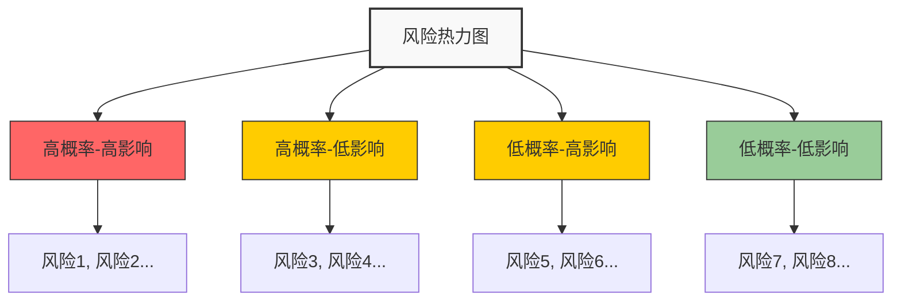
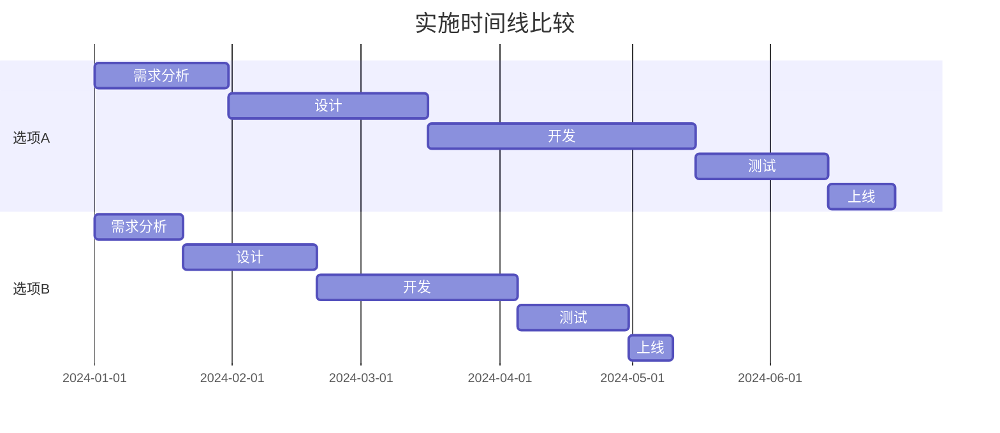

---
{"dg-publish":true,"tags":["产品","决策","模板","决策支持","商业分析"],"创建日期":"2024-05-19","更新日期":"2024-05-19","permalink":"/知识共享/002_商业分析/04_模板/04_决策支持/产品决策分析框架/","dgPassFrontmatter":true}
---

> [!info] 模板说明
> 本模板提供了系统化的产品决策分析框架，帮助产品经理、业务分析师和决策者基于数据和结构化思考做出产品相关决策。适用于新产品开发、产品改进、功能优先级排序、定价策略等多种产品决策场景。

## 一、决策概述

### 1.1 决策基本信息

| 项目           | 内容                               |
| -------------- | ---------------------------------- |
| 决策名称       | [产品决策名称]                     |
| 决策类型       | [新产品开发/产品改进/功能优先级/定价策略等] |
| 决策目标       | [简述此决策希望达成的目标]         |
| 决策日期       | [决策进行的日期]                   |
| 决策负责人     | [决策负责人姓名与角色]             |
| 参与决策人员   | [决策团队成员及角色]               |
| 决策期限       | [决策必须完成的截止日期]           |

### 1.2 决策背景

[简要描述做出此决策的业务背景、市场环境、问题痛点及机会，200-300字]

### 1.3 决策范围界定

- **需解决问题**：[明确此决策需要解决的核心问题]
- **决策边界**：[说明决策的范围和不涉及的内容]
- **关联决策**：[与此决策相关的其他决策点]
- **决策限制条件**：[时间、资源、技术等限制条件]

## 二、战略契合性分析

### 2.1 与公司战略的一致性

| 公司战略目标 | 相关性 | 支持说明 | 潜在冲突 |
| ------------ | ------ | -------- | -------- |
| [战略目标1]  | [高/中/低] | [如何支持] | [潜在冲突] |
| [战略目标2]  | [高/中/低] | [如何支持] | [潜在冲突] |
| [战略目标3]  | [高/中/低] | [如何支持] | [潜在冲突] |

### 2.2 与产品战略的一致性

| 产品战略要素 | 契合度(1-5) | 支持理由 |
| ------------ | ----------- | -------- |
| 产品愿景     | [评分]      | [理由]   |
| 目标用户群   | [评分]      | [理由]   |
| 核心价值主张 | [评分]      | [理由]   |
| 产品路线图   | [评分]      | [理由]   |
| 品牌定位     | [评分]      | [理由]   |

### 2.3 战略契合性总结

[基于上述分析，总结该决策与公司战略和产品战略的整体契合程度，并指出任何需要关注的不一致或风险，100-150字]

## 三、市场与用户分析

### 3.1 市场需求分析

- **市场规模**：[相关市场的规模及增长趋势]
- **市场缺口**：[当前市场未满足的需求]
- **竞争状况**：[相关市场的竞争格局]
- **市场趋势**：[影响决策的关键市场趋势]

### 3.2 目标用户分析

| 用户群体 | 规模估计 | 核心需求 | 痛点 | 决策相关性 |
| -------- | -------- | -------- | ---- | ---------- |
| [用户群1] | [规模] | [需求] | [痛点] | [高/中/低] |
| [用户群2] | [规模] | [需求] | [痛点] | [高/中/低] |
| [用户群3] | [规模] | [需求] | [痛点] | [高/中/低] |

### 3.3 用户研究结果

- **定量研究**：[相关用户数据分析结果概述]
- **定性研究**：[访谈、焦点小组等定性研究发现]
- **用户反馈**：[现有产品的用户反馈与评价]
- **用户行为数据**：[用户行为模式与趋势分析]

### 3.4 市场与用户分析总结

[基于上述分析，总结市场与用户方面对决策的关键影响因素，100-150字]

## 四、决策选项分析

### 4.1 决策选项概述

| 选项 | 描述 | 主要优势 | 主要劣势 |
| ---- | ---- | -------- | -------- |
| 选项A | [详细描述] | [优势1] [优势2] [优势3] | [劣势1] [劣势2] [劣势3] |
| 选项B | [详细描述] | [优势1] [优势2] [优势3] | [劣势1] [劣势2] [劣势3] |
| 选项C | [详细描述] | [优势1] [优势2] [优势3] | [劣势1] [劣势2] [劣势3] |

### 4.2 多标准决策矩阵

| 评估标准 | 权重(%) | 选项A评分(1-5) | 选项A加权分 | 选项B评分(1-5) | 选项B加权分 | 选项C评分(1-5) | 选项C加权分 |
| -------- | ------- | -------------- | ----------- | -------------- | ----------- | -------------- | ----------- |
| 用户价值 | [权重]  | [评分]         | [加权分]    | [评分]         | [加权分]    | [评分]         | [加权分]    |
| 商业价值 | [权重]  | [评分]         | [加权分]    | [评分]         | [加权分]    | [评分]         | [加权分]    |
| 技术可行性 | [权重] | [评分]        | [加权分]    | [评分]         | [加权分]    | [评分]         | [加权分]    |
| 实施难度 | [权重]  | [评分]         | [加权分]    | [评分]         | [加权分]    | [评分]         | [加权分]    |
| 时间要求 | [权重]  | [评分]         | [加权分]    | [评分]         | [加权分]    | [评分]         | [加权分]    |
| 资源需求 | [权重]  | [评分]         | [加权分]    | [评分]         | [加权分]    | [评分]         | [加权分]    |
| 风险水平 | [权重]  | [评分]         | [加权分]    | [评分]         | [加权分]    | [评分]         | [加权分]    |
| 战略契合度 | [权重] | [评分]        | [加权分]    | [评分]         | [加权分]    | [评分]         | [加权分]    |
| **总分** | **100%** | | **[总分]** | | **[总分]** | | **[总分]** |

### 4.3 评分标准说明

对上述评估标准的评分标准进行说明：

- **用户价值**(1-5分)：
  - 1分：几乎没有用户价值
  - 2分：对少数用户有轻微价值
  - 3分：对大部分用户有中等价值
  - 4分：对大部分用户有显著价值
  - 5分：对几乎所有用户有极高价值

[为每个评估标准提供类似的1-5分评分标准说明]

## 五、财务分析

### 5.1 收入预测

| 收入类型 | 第1年 | 第2年 | 第3年 | 计算依据与假设 |
| -------- | ----- | ----- | ----- | -------------- |
| [收入1]  | [金额] | [金额] | [金额] | [依据与假设] |
| [收入2]  | [金额] | [金额] | [金额] | [依据与假设] |
| [收入3]  | [金额] | [金额] | [金额] | [依据与假设] |
| **总收入** | [金额] | [金额] | [金额] | |

### 5.2 成本预测

| 成本类型 | 第1年 | 第2年 | 第3年 | 计算依据与假设 |
| -------- | ----- | ----- | ----- | -------------- |
| 开发成本 | [金额] | [金额] | [金额] | [依据与假设] |
| 运营成本 | [金额] | [金额] | [金额] | [依据与假设] |
| 营销成本 | [金额] | [金额] | [金额] | [依据与假设] |
| 其他成本 | [金额] | [金额] | [金额] | [依据与假设] |
| **总成本** | [金额] | [金额] | [金额] | |

### 5.3 财务指标

| 财务指标 | 选项A | 选项B | 选项C | 计算方法 |
| -------- | ----- | ----- | ----- | -------- |
| 投资回报率(ROI) | [值] | [值] | [值] | [计算方法] |
| 净现值(NPV) | [值] | [值] | [值] | [计算方法] |
| 回收期 | [值] | [值] | [值] | [计算方法] |
| 毛利率 | [值] | [值] | [值] | [计算方法] |
| 单位经济性 | [值] | [值] | [值] | [计算方法] |

### 5.4 财务分析总结

[基于上述财务分析，总结各选项的财务表现及关键考量点，100-150字]

## 六、风险分析

### 6.1 风险识别

| 风险类别 | 风险描述 | 影响程度(1-5) | 发生概率(1-5) | 风险评分 | 应对策略 |
| -------- | -------- | ------------- | ------------- | -------- | -------- |
| 市场风险 | [描述] | [评分] | [评分] | [程度×概率] | [策略] |
| 技术风险 | [描述] | [评分] | [评分] | [程度×概率] | [策略] |
| 用户风险 | [描述] | [评分] | [评分] | [程度×概率] | [策略] |
| 实施风险 | [描述] | [评分] | [评分] | [程度×概率] | [策略] |
| 竞争风险 | [描述] | [评分] | [评分] | [程度×概率] | [策略] |
| 资源风险 | [描述] | [评分] | [评分] | [程度×概率] | [策略] |

### 6.2 风险热力图

### 6.3 方案风险比较

| 风险维度 | 选项A风险评估 | 选项B风险评估 | 选项C风险评估 |
| -------- | ------------- | ------------- | ------------- |
| 总体风险评分 | [评分] | [评分] | [评分] |
| 高风险项数量 | [数量] | [数量] | [数量] |
| 主要风险领域 | [领域] | [领域] | [领域] |
| 风险可控性 | [高/中/低] | [高/中/低] | [高/中/低] |

### 6.4 风险分析总结

[基于上述风险分析，总结各选项的风险状况及关键考量点，100-150字]

## 七、资源与可行性分析

### 7.1 资源需求评估

| 资源类型 | 选项A需求 | 选项B需求 | 选项C需求 | 现有资源状况 | 资源缺口 |
| -------- | --------- | --------- | --------- | ------------ | -------- |
| 人力资源 | [需求] | [需求] | [需求] | [现状] | [缺口] |
| 技术资源 | [需求] | [需求] | [需求] | [现状] | [缺口] |
| 时间资源 | [需求] | [需求] | [需求] | [现状] | [缺口] |
| 财务资源 | [需求] | [需求] | [需求] | [现状] | [缺口] |
| 其他资源 | [需求] | [需求] | [需求] | [现状] | [缺口] |

### 7.2 技术可行性评估

| 技术要素 | 复杂度(1-5) | 现有能力(1-5) | 技术缺口 | 缓解措施 |
| -------- | ----------- | ------------- | -------- | -------- |
| [技术1] | [评分] | [评分] | [缺口] | [措施] |
| [技术2] | [评分] | [评分] | [缺口] | [措施] |
| [技术3] | [评分] | [评分] | [缺口] | [措施] |

### 7.3 实施时间评估

### 7.4 可行性总结

[基于上述资源与可行性分析，总结各选项的可行性状况及关键考量点，100-150字]

## 八、决策推荐与行动计划

### 8.1 决策选项综合评估

| 评估维度 | 权重(%) | 选项A评分(1-10) | 选项B评分(1-10) | 选项C评分(1-10) | 评分依据 |
| -------- | ------- | --------------- | --------------- | --------------- | -------- |
| 战略契合度 | [权重] | [评分] | [评分] | [评分] | [依据] |
| 市场/用户价值 | [权重] | [评分] | [评分] | [评分] | [依据] |
| 财务回报 | [权重] | [评分] | [评分] | [评分] | [依据] |
| 风险水平 | [权重] | [评分] | [评分] | [评分] | [依据] |
| 资源可行性 | [权重] | [评分] | [评分] | [评分] | [依据] |
| 实施难度 | [权重] | [评分] | [评分] | [评分] | [依据] |
| 长期影响 | [权重] | [评分] | [评分] | [评分] | [依据] |
| **总分** | **100%** | **[总分]** | **[总分]** | **[总分]** | |

### 8.2 决策推荐

- **推荐选项**：[选项X]
- **推荐理由**：
  1. [关键理由1]
  2. [关键理由2]
  3. [关键理由3]
- **决策信心**：[高/中/低] - [信心评估说明]
- **关键成功因素**：
  1. [因素1]
  2. [因素2]
  3. [因素3]

### 8.3 实施行动计划

| 阶段 | 关键活动 | 责任人 | 时间要求 | 资源需求 | 风险监控点 |
| ---- | -------- | ------ | -------- | -------- | ---------- |
| 准备阶段 | [活动] | [人员] | [时间] | [资源] | [监控点] |
| 启动阶段 | [活动] | [人员] | [时间] | [资源] | [监控点] |
| 执行阶段 | [活动] | [人员] | [时间] | [资源] | [监控点] |
| 评估阶段 | [活动] | [人员] | [时间] | [资源] | [监控点] |

### 8.4 决策评估与调整机制

- **关键绩效指标**：
  1. [KPI 1] - [目标值] - [衡量方法]
  2. [KPI 2] - [目标值] - [衡量方法]
  3. [KPI 3] - [目标值] - [衡量方法]

- **评估时间点**：
  1. [时间点1] - [评估内容]
  2. [时间点2] - [评估内容]
  3. [时间点3] - [评估内容]

- **调整触发条件**：
  1. [条件1] - [调整方向]
  2. [条件2] - [调整方向]
  3. [条件3] - [调整方向]

## 九、附录

### 9.1 决策方法论

- **使用的决策框架**：[如：多属性效用理论、决策树分析等]
- **决策过程**：[决策形成的关键步骤和参与人员]
- **数据来源**：[决策分析所使用的关键数据来源及可靠性]

### 9.2 参考资料

- [市场研究报告]
- [用户研究数据]
- [财务分析模型]
- [技术评估文档]
- [竞品分析资料]
- [专家咨询意见]

### 9.3 决策会议记录

[包含决策讨论的关键观点、意见分歧及最终共识的形成过程]

---

*本模板提供了产品决策的完整分析框架，实际使用时可根据具体决策类型和公司需求进行调整，确保决策过程全面、系统且基于数据和结构化思考。* 