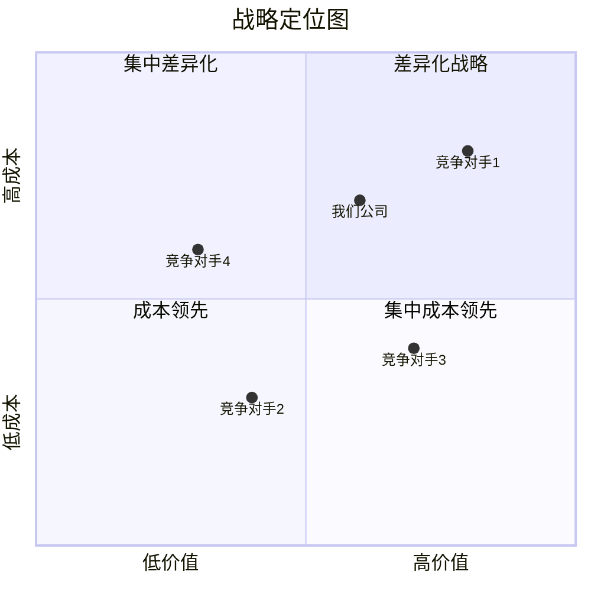
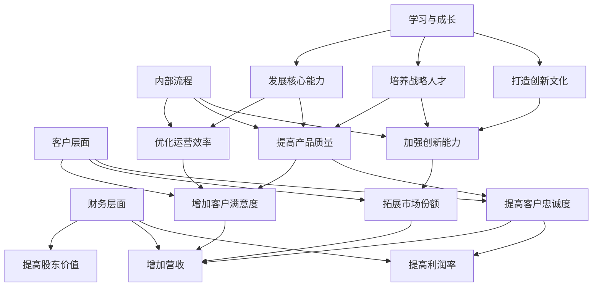
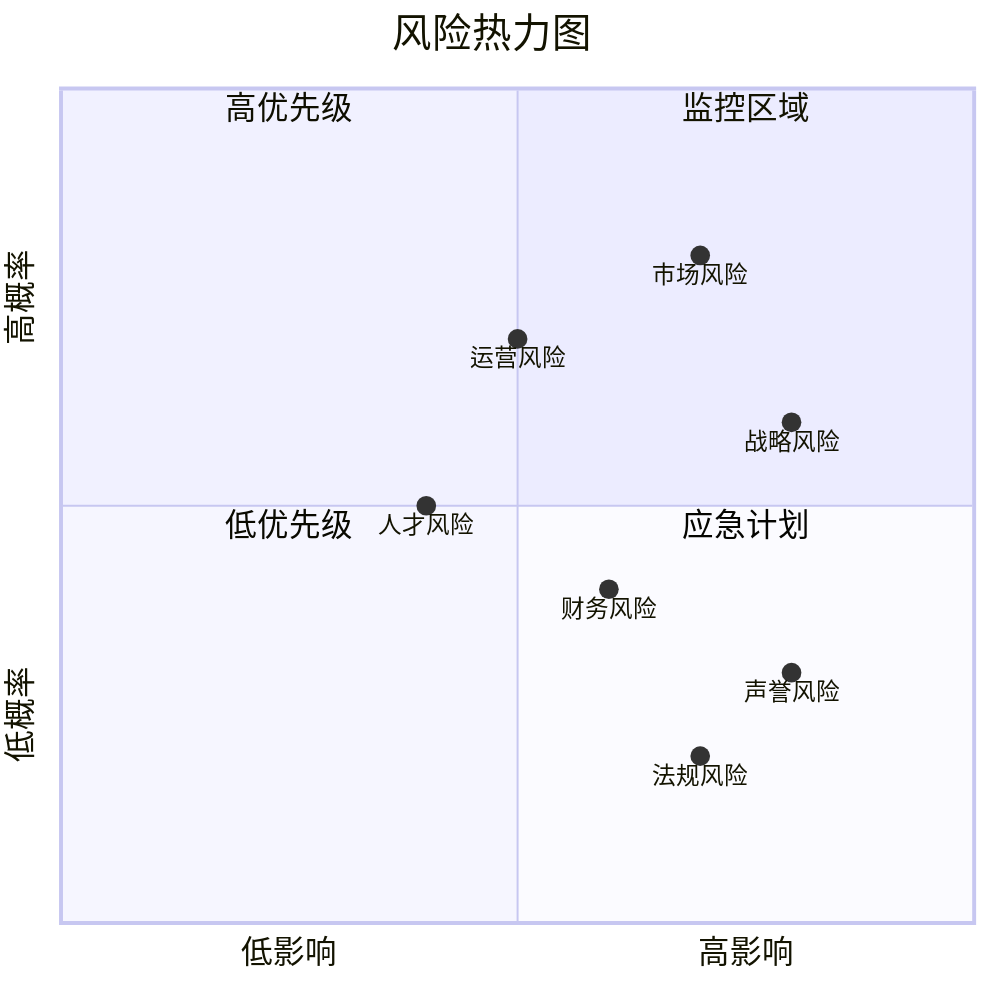
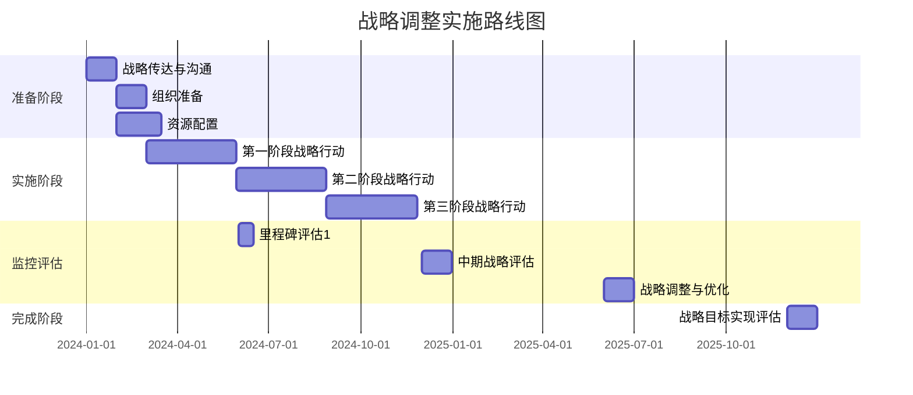

---
{"dg-publish":true,"tags":["战略调整","决策支持","模板","商业分析","战略管理"],"创建日期":"2024-05-19","更新日期":"2024-05-19","permalink":"/知识共享/002_商业分析/04_模板/04_决策支持/战略调整决策模板/","dgPassFrontmatter":true}
---

> [!info] 模板说明
> 本模板提供系统化的战略调整决策分析框架，帮助企业管理者和业务分析师在面临战略调整需求时做出科学决策。适用于业务模式变革、市场扩张、产品线调整、竞争策略变更等多种战略调整场景。

## 一、战略调整概述

### 1.1 调整背景与驱动因素

| 项目             | 内容                             |
| ---------------- | -------------------------------- |
| 决策名称         | [战略调整决策名称]               |
| 战略调整类型     | [业务模式/市场/产品/组织等]      |
| 调整时间框架     | [调整实施的时间范围]             |
| 决策负责人       | [战略决策负责人及角色]           |
| 参与决策人员     | [决策团队成员及角色]             |
| 战略调整范围     | [影响的业务范围]                 |
| 现有战略执行时长 | [当前战略已执行时间]             |

**调整驱动因素**：
- 外部驱动因素：[列出主要外部驱动因素]
- 内部驱动因素：[列出主要内部驱动因素]
- 紧迫程度评估：[高/中/低] - [说明原因]

**战略调整背景**：
[描述做出战略调整的具体背景、市场环境变化和组织面临的挑战，200-250字]

### 1.2 现有战略评估

| 战略要素     | 现状描述 | 有效性评估(1-5) | 问题分析 | 调整必要性 |
| ------------ | -------- | --------------- | -------- | ---------- |
| 使命与愿景   | [描述]   | [评分]          | [分析]   | [必要性]   |
| 核心业务     | [描述]   | [评分]          | [分析]   | [必要性]   |
| 目标市场     | [描述]   | [评分]          | [分析]   | [必要性]   |
| 价值主张     | [描述]   | [评分]          | [分析]   | [必要性]   |
| 竞争策略     | [描述]   | [评分]          | [分析]   | [必要性]   |
| 组织能力     | [描述]   | [评分]          | [分析]   | [必要性]   |
| 资源配置     | [描述]   | [评分]          | [分析]   | [必要性]   |

**评估总结**：
[基于上述评估，总结现有战略的主要优势、不足及调整的关键领域，150-200字]

### 1.3 战略调整目标

| 目标维度 | 具体目标 | 衡量指标 | 目标值 | 时间框架 |
| -------- | -------- | -------- | ------ | -------- |
| 财务目标 | [目标]   | [指标]   | [目标值] | [时间] |
| 市场目标 | [目标]   | [指标]   | [目标值] | [时间] |
| 客户目标 | [目标]   | [指标]   | [目标值] | [时间] |
| 运营目标 | [目标]   | [指标]   | [目标值] | [时间] |
| 创新目标 | [目标]   | [指标]   | [目标值] | [时间] |
| 组织目标 | [目标]   | [指标]   | [目标值] | [时间] |

## 二、环境与竞争分析

### 2.1 宏观环境分析 (PESTEL)

| 环境因素 | 现状分析 | 未来趋势 | 战略影响 | 机会/威胁 |
| -------- | -------- | -------- | -------- | --------- |
| 政治因素 | [分析]   | [趋势]   | [影响]   | [判断]    |
| 经济因素 | [分析]   | [趋势]   | [影响]   | [判断]    |
| 社会因素 | [分析]   | [趋势]   | [影响]   | [判断]    |
| 技术因素 | [分析]   | [趋势]   | [影响]   | [判断]    |
| 环境因素 | [分析]   | [趋势]   | [影响]   | [判断]    |
| 法律因素 | [分析]   | [趋势]   | [影响]   | [判断]    |

### 2.2 行业分析 (波特五力)

| 竞争力量 | 强度评估(1-5) | 关键影响因素 | 发展趋势 | 战略启示 |
| -------- | ------------- | ------------ | -------- | -------- |
| 行业内竞争 | [评分]      | [因素]       | [趋势]   | [启示]   |
| 新进入者威胁 | [评分]    | [因素]       | [趋势]   | [启示]   |
| 替代品威胁 | [评分]      | [因素]       | [趋势]   | [启示]   |
| 供应商议价能力 | [评分]  | [因素]       | [趋势]   | [启示]   |
| 买家议价能力 | [评分]    | [因素]       | [趋势]   | [启示]   |

**行业吸引力总结**：
[基于五力分析，总结行业吸引力及关键成功因素，100-150字]

### 2.3 竞争对手分析

| 竞争对手 | 市场份额 | 核心战略 | 优势 | 劣势 | 近期战略动向 |
| -------- | -------- | -------- | ---- | ---- | ------------ |
| 竞争对手1 | [份额]  | [战略]   | [优势] | [劣势] | [动向]    |
| 竞争对手2 | [份额]  | [战略]   | [优势] | [劣势] | [动向]    |
| 竞争对手3 | [份额]  | [战略]   | [优势] | [劣势] | [动向]    |
| 竞争对手4 | [份额]  | [战略]   | [优势] | [劣势] | [动向]    |

**竞争格局变化趋势**：
[描述行业竞争格局的主要变化趋势及对战略调整的影响，100-150字]

### 2.4 战略定位分析

## 三、内部能力评估

### 3.1 核心能力分析

| 能力类别 | 当前能力水平(1-5) | 竞争对比 | 与战略匹配度 | 提升需求 |
| -------- | ----------------- | -------- | ------------ | -------- |
| 技术创新能力 | [评分]        | [对比]   | [匹配度]     | [需求]   |
| 市场洞察能力 | [评分]        | [对比]   | [匹配度]     | [需求]   |
| 客户关系管理 | [评分]        | [对比]   | [匹配度]     | [需求]   |
| 运营效率     | [评分]        | [对比]   | [匹配度]     | [需求]   |
| 供应链管理   | [评分]        | [对比]   | [匹配度]     | [需求]   |
| 人才管理     | [评分]        | [对比]   | [匹配度]     | [需求]   |
| 变革管理     | [评分]        | [对比]   | [匹配度]     | [需求]   |

### 3.2 资源评估

| 资源类型 | 现有资源 | 充足度(1-5) | 战略重要性 | 资源缺口 | 获取难度 |
| -------- | -------- | ----------- | ---------- | -------- | -------- |
| 财务资源 | [描述]   | [评分]      | [重要性]   | [缺口]   | [难度]   |
| 人力资源 | [描述]   | [评分]      | [重要性]   | [缺口]   | [难度]   |
| 技术资源 | [描述]   | [评分]      | [重要性]   | [缺口]   | [难度]   |
| 品牌资源 | [描述]   | [评分]      | [重要性]   | [缺口]   | [难度]   |
| 渠道资源 | [描述]   | [评分]      | [重要性]   | [缺口]   | [难度]   |
| 关系资源 | [描述]   | [评分]      | [重要性]   | [缺口]   | [难度]   |

### 3.3 SWOT分析

| 优势 (S) | 劣势 (W) |
| -------- | -------- |
| 1. [优势1] | 1. [劣势1] |
| 2. [优势2] | 2. [劣势2] |
| 3. [优势3] | 3. [劣势3] |
| 4. [优势4] | 4. [劣势4] |
| 5. [优势5] | 5. [劣势5] |

| 机会 (O) | 威胁 (T) |
| -------- | -------- |
| 1. [机会1] | 1. [威胁1] |
| 2. [机会2] | 2. [威胁2] |
| 3. [机会3] | 3. [威胁3] |
| 4. [机会4] | 4. [威胁4] |
| 5. [机会5] | 5. [威胁5] |

**战略洞察**：
- SO战略（利用优势抓住机会）：[描述]
- WO战略（克服劣势抓住机会）：[描述]
- ST战略（利用优势应对威胁）：[描述]
- WT战略（克服劣势避免威胁）：[描述]

## 四、战略调整方案

### 4.1 战略调整选项

| 调整选项 | 描述 | 主要变更点 | 预期效果 | 资源需求 | 风险评估 |
| -------- | ---- | ---------- | -------- | -------- | -------- |
| 选项A    | [描述] | [变更点] | [效果]   | [资源]   | [风险]   |
| 选项B    | [描述] | [变更点] | [效果]   | [资源]   | [风险]   |
| 选项C    | [描述] | [变更点] | [效果]   | [资源]   | [风险]   |
| 维持现状 | [描述] | [变更点] | [效果]   | [资源]   | [风险]   |

### 4.2 战略选项比较分析

| 评估标准 | 权重(%) | 选项A评分(1-5) | 选项A加权分 | 选项B评分(1-5) | 选项B加权分 | 选项C评分(1-5) | 选项C加权分 |
| -------- | ------- | -------------- | ----------- | -------------- | ----------- | -------------- | ----------- |
| 战略契合度 | [权重] | [评分]        | [加权分]    | [评分]         | [加权分]    | [评分]         | [加权分]    |
| 市场吸引力 | [权重] | [评分]        | [加权分]    | [评分]         | [加权分]    | [评分]         | [加权分]    |
| 竞争优势   | [权重] | [评分]        | [加权分]    | [评分]         | [加权分]    | [评分]         | [加权分]    |
| 财务回报   | [权重] | [评分]        | [加权分]    | [评分]         | [加权分]    | [评分]         | [加权分]    |
| 实施可行性 | [权重] | [评分]        | [加权分]    | [评分]         | [加权分]    | [评分]         | [加权分]    |
| 风险水平   | [权重] | [评分]        | [加权分]    | [评分]         | [加权分]    | [评分]         | [加权分]    |
| 组织适应性 | [权重] | [评分]        | [加权分]    | [评分]         | [加权分]    | [评分]         | [加权分]    |
| 长期可持续性 | [权重] | [评分]      | [加权分]    | [评分]         | [加权分]    | [评分]         | [加权分]    |
| **总计**   | **100%** | | **[总分]** | | **[总分]** | | **[总分]** |

### 4.3 情景分析

| 情景 | 描述 | 选项A表现 | 选项B表现 | 选项C表现 | 对策略调整的启示 |
| ---- | ---- | --------- | --------- | --------- | ---------------- |
| 乐观情景 | [描述] | [表现] | [表现] | [表现] | [启示] |
| 基准情景 | [描述] | [表现] | [表现] | [表现] | [启示] |
| 悲观情景 | [描述] | [表现] | [表现] | [表现] | [启示] |
| 颠覆情景 | [描述] | [表现] | [表现] | [表现] | [启示] |

### 4.4 战略地图

## 五、财务与风险分析

### 5.1 财务影响分析

| 财务指标 | 当前 | 选项A预测 | 选项B预测 | 选项C预测 | 计算方法 |
| -------- | ---- | --------- | --------- | --------- | -------- |
| 营业收入 | [值] | [预测值]  | [预测值]  | [预测值]  | [方法]   |
| 毛利率   | [值] | [预测值]  | [预测值]  | [预测值]  | [方法]   |
| 运营成本 | [值] | [预测值]  | [预测值]  | [预测值]  | [方法]   |
| 净利润   | [值] | [预测值]  | [预测值]  | [预测值]  | [方法]   |
| ROI      | [值] | [预测值]  | [预测值]  | [预测值]  | [方法]   |
| 投资需求 | [值] | [预测值]  | [预测值]  | [预测值]  | [方法]   |
| 现金流量 | [值] | [预测值]  | [预测值]  | [预测值]  | [方法]   |

### 5.2 三年财务预测

| 指标 | 第1年 | 第2年 | 第3年 | 关键假设 |
| ---- | ----- | ----- | ----- | -------- |
| 营业收入 | [预测] | [预测] | [预测] | [假设] |
| 营业成本 | [预测] | [预测] | [预测] | [假设] |
| 毛利润 | [预测] | [预测] | [预测] | [假设] |
| 运营费用 | [预测] | [预测] | [预测] | [假设] |
| EBITDA | [预测] | [预测] | [预测] | [假设] |
| 净利润 | [预测] | [预测] | [预测] | [假设] |
| 资本支出 | [预测] | [预测] | [预测] | [假设] |
| 自由现金流 | [预测] | [预测] | [预测] | [假设] |

### 5.3 风险分析

| 风险类别 | 风险描述 | 影响程度(1-5) | 发生概率(1-5) | 风险评分 | 缓解措施 |
| -------- | -------- | ------------- | ------------- | -------- | -------- |
| 战略风险 | [描述]   | [评分]        | [评分]        | [评分]   | [措施]   |
| 运营风险 | [描述]   | [评分]        | [评分]        | [评分]   | [措施]   |
| 市场风险 | [描述]   | [评分]        | [评分]        | [评分]   | [措施]   |
| 财务风险 | [描述]   | [评分]        | [评分]        | [评分]   | [措施]   |
| 人才风险 | [描述]   | [评分]        | [评分]        | [评分]   | [措施]   |
| 声誉风险 | [描述]   | [评分]        | [评分]        | [评分]   | [措施]   |
| 法规风险 | [描述]   | [评分]        | [评分]        | [评分]   | [措施]   |

**风险热力图**：

## 六、实施计划与变革管理

### 6.1 推荐战略方案

- **推荐战略选项**：[选项X]
- **选择理由**：
  1. [关键理由1]
  2. [关键理由2]
  3. [关键理由3]
- **预期成果**：[描述实施该战略调整的主要预期成果]
- **关键成功因素**：
  1. [因素1]
  2. [因素2]
  3. [因素3]

### 6.2 实施路线图

### 6.3 详细行动计划

| 战略举措 | 具体行动 | 责任部门/人员 | 时间表 | 资源需求 | 预期结果 | 评估指标 |
| -------- | -------- | ------------- | ------ | -------- | -------- | -------- |
| [举措1]  | [行动1.1] | [责任方]     | [时间] | [资源]   | [结果]   | [指标]   |
|          | [行动1.2] | [责任方]     | [时间] | [资源]   | [结果]   | [指标]   |
|          | [行动1.3] | [责任方]     | [时间] | [资源]   | [结果]   | [指标]   |
| [举措2]  | [行动2.1] | [责任方]     | [时间] | [资源]   | [结果]   | [指标]   |
|          | [行动2.2] | [责任方]     | [时间] | [资源]   | [结果]   | [指标]   |
| [举措3]  | [行动3.1] | [责任方]     | [时间] | [资源]   | [结果]   | [指标]   |
|          | [行动3.2] | [责任方]     | [时间] | [资源]   | [结果]   | [指标]   |

### 6.4 变革管理计划

| 变革管理要素 | 关键活动 | 责任人 | 目标群体 | 时间安排 | 成功指标 |
| ------------ | -------- | ------ | -------- | -------- | -------- |
| 利益相关者管理 | [活动] | [人员] | [群体]   | [时间]   | [指标]   |
| 沟通计划     | [活动]   | [人员] | [群体]   | [时间]   | [指标]   |
| 培训计划     | [活动]   | [人员] | [群体]   | [时间]   | [指标]   |
| 抵抗管理     | [活动]   | [人员] | [群体]   | [时间]   | [指标]   |
| 文化调整     | [活动]   | [人员] | [群体]   | [时间]   | [指标]   |
| 领导力发展   | [活动]   | [人员] | [群体]   | [时间]   | [指标]   |

## 七、战略绩效衡量与监控

### 7.1 战略绩效指标体系

| 战略目标 | 关键绩效指标(KPI) | 当前基准 | 目标值 | 测量频率 | 责任人 | 数据来源 |
| -------- | ----------------- | -------- | ------ | -------- | ------ | -------- |
| [目标1]  | [KPI 1.1]         | [基准]   | [目标] | [频率]   | [人员] | [来源]   |
|          | [KPI 1.2]         | [基准]   | [目标] | [频率]   | [人员] | [来源]   |
| [目标2]  | [KPI 2.1]         | [基准]   | [目标] | [频率]   | [人员] | [来源]   |
|          | [KPI 2.2]         | [基准]   | [目标] | [频率]   | [人员] | [来源]   |
| [目标3]  | [KPI 3.1]         | [基准]   | [目标] | [频率]   | [人员] | [来源]   |
|          | [KPI 3.2]         | [基准]   | [目标] | [频率]   | [人员] | [来源]   |

### 7.2 战略监控机制

| 监控层级 | 监控内容 | 监控方法 | 监控频率 | 报告机制 | 决策流程 |
| -------- | -------- | -------- | -------- | -------- | -------- |
| 战略层   | [内容]   | [方法]   | [频率]   | [机制]   | [流程]   |
| 战术层   | [内容]   | [方法]   | [频率]   | [机制]   | [流程]   |
| 运营层   | [内容]   | [方法]   | [频率]   | [机制]   | [流程]   |

### 7.3 战略调整触发条件

| 指标/情境 | 调整触发阈值 | 审查流程 | 调整机制 | 责任部门 |
| --------- | ------------ | -------- | -------- | -------- |
| [指标1]   | [阈值]       | [流程]   | [机制]   | [部门]   |
| [指标2]   | [阈值]       | [流程]   | [机制]   | [部门]   |
| [情境1]   | [条件]       | [流程]   | [机制]   | [部门]   |
| [情境2]   | [条件]       | [流程]   | [机制]   | [部门]   |

### 7.4 战略审查会议框架

| 会议类型 | 频率 | 参与者 | 主要议题 | 输出文档 | 跟进机制 |
| -------- | ---- | ------ | -------- | -------- | -------- |
| 战略执行检视 | [频率] | [参与者] | [议题] | [文档] | [机制] |
| 季度战略回顾 | [频率] | [参与者] | [议题] | [文档] | [机制] |
| 年度战略评估 | [频率] | [参与者] | [议题] | [文档] | [机制] |
| 战略重大调整会议 | [频率] | [参与者] | [议题] | [文档] | [机制] |

## 八、附录

### 8.1 战略分析方法说明

- **环境分析方法**：[如PESTEL分析、波特五力模型等]
- **内部分析方法**：[如价值链分析、资源能力分析等]
- **战略选择方法**：[如组合分析、情景规划法等]
- **战略评估方法**：[如平衡记分卡、价值分析等]

### 8.2 相关数据与分析报告

- [市场研究报告]
- [行业趋势报告]
- [竞争对手分析报告]
- [客户调研数据]
- [财务分析数据]
- [内部资源评估报告]

### 8.3 术语表

| 术语 | 定义 | 备注 |
| ---- | ---- | ---- |
| [术语1] | [定义] | [备注] |
| [术语2] | [定义] | [备注] |
| [术语3] | [定义] | [备注] |
| [术语4] | [定义] | [备注] |
| [术语5] | [定义] | [备注] |

---

*本模板提供了战略调整决策的系统化框架，实际使用时可根据组织具体情况和战略调整类型进行调整，确保战略决策基于全面分析和系统思考。* 