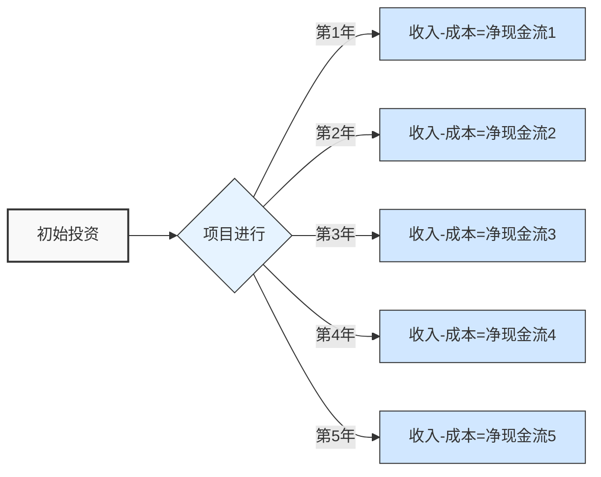
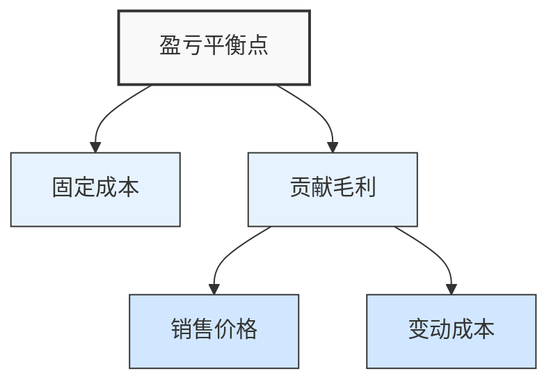
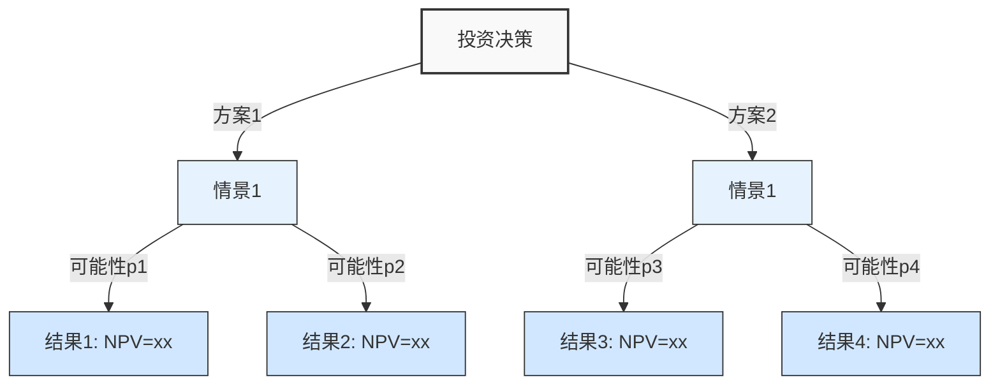

---
{"dg-publish":true,"tags":["ROI","模板","投资回报","决策支持"],"创建日期":"2024-04-27","更新日期":"2024-04-27","permalink":"/知识共享/002_商业分析/04_模板/04_决策支持/投资回报分析模板/","dgPassFrontmatter":true}
---

# 投资回报分析模板

> [!info] 模板说明
> 本模板用于评估项目或投资决策的财务回报和经济效益，提供结构化的框架来计算ROI、净现值、内部收益率等关键指标，帮助决策者做出数据驱动的投资决策。适用于产品开发、市场扩张、技术升级等多种投资场景。

## 投资项目概述

| 项目信息       | 内容                                |
|----------------|-------------------------------------|
| 项目名称       | [填写项目名称]                      |
| 项目描述       | [简要描述项目内容和目标]            |
| 分析日期       | [YYYY-MM-DD]                        |
| 分析人员       | [负责此分析的人员]                  |
| 项目发起部门   | [如：产品部/技术部/市场部]          |
| 决策截止日期   | [YYYY-MM-DD]                        |
| 分析版本       | [如：V1.0]                          |

## 1. 投资概况

### 投资目标
- [描述此投资的主要目标和预期成果]
- [描述与公司战略的关联性]

### 投资选项
- **方案1**: [概述方案1]
- **方案2**: [概述方案2] (如有多个投资选项)
- **方案3**: [概述方案3] (如有多个投资选项)

### 投资规模

| 投资类别       | 金额(万元)   | 支出时间   | 资金来源   | 备注         |
|----------------|--------------|------------|------------|--------------|
| 前期研发投入   |              |            |            |              |
| 设备采购       |              |            |            |              |
| 人力资源成本   |              |            |            |              |
| 市场推广费     |              |            |            |              |
| 运营成本       |              |            |            |              |
| 其他成本       |              |            |            |              |
| **总投资金额** |              |            |            |              |

## 2. 财务假设

### 基本假设
- **分析时间周期**: [投资回收期，如5年]
- **贴现率**: [资金成本或要求回报率，如8%]
- **通货膨胀率**: [如3%]
- **税率**: [适用所得税率，如25%]
- **折旧方法**: [如直线折旧法]
- **残值率**: [如5%]

### 收入假设

| 收入来源       | 第1年  | 第2年  | 第3年  | 第4年  | 第5年  | 假设依据   |
|----------------|--------|--------|--------|--------|--------|------------|
| 产品销售收入   |        |        |        |        |        |            |
| 服务收入       |        |        |        |        |        |            |
| 其他收入       |        |        |        |        |        |            |
| **总收入**     |        |        |        |        |        |            |

### 成本假设

| 成本类别       | 第1年  | 第2年  | 第3年  | 第4年  | 第5年  | 假设依据   |
|----------------|--------|--------|--------|--------|--------|------------|
| 直接材料成本   |        |        |        |        |        |            |
| 直接人工成本   |        |        |        |        |        |            |
| 销售费用       |        |        |        |        |        |            |
| 管理费用       |        |        |        |        |        |            |
| 研发费用       |        |        |        |        |        |            |
| 折旧与摊销     |        |        |        |        |        |            |
| 其他费用       |        |        |        |        |        |            |
| **总成本**     |        |        |        |        |        |            |

## 3. 现金流预测

### 年度现金流量表

| 项目               | 第0年  | 第1年  | 第2年  | 第3年  | 第4年  | 第5年  |
|--------------------|--------|--------|--------|--------|--------|--------|
| **现金流入**       |        |        |        |        |        |        |
| 产品销售收入       |        |        |        |        |        |        |
| 服务收入           |        |        |        |        |        |        |
| 其他收入           |        |        |        |        |        |        |
| **现金流出**       |        |        |        |        |        |        |
| 初始投资           |        |        |        |        |        |        |
| 直接材料成本       |        |        |        |        |        |        |
| 直接人工成本       |        |        |        |        |        |        |
| 销售费用           |        |        |        |        |        |        |
| 管理费用           |        |        |        |        |        |        |
| 研发费用           |        |        |        |        |        |        |
| 税费               |        |        |        |        |        |        |
| **净现金流**       |        |        |        |        |        |        |
| **累计净现金流**   |        |        |        |        |        |        |
| **贴现系数**       |        |        |        |        |        |        |
| **贴现净现金流**   |        |        |        |        |        |        |
| **累计贴现净现金流**|       |        |        |        |        |        |

## 4. 投资回报指标计算

### 关键财务指标

| 指标名称            | 计算结果   | 计算方法             | 评价标准           |
|---------------------|------------|----------------------|--------------------|
| 投资回收期(PP)      |            | [计算公式]           | [判断标准]         |
| 净现值(NPV)         |            | [计算公式]           | [判断标准]         |
| 内部收益率(IRR)     |            | [计算公式]           | [判断标准]         |
| 投资回报率(ROI)     |            | [计算公式]           | [判断标准]         |
| 收益成本比(BCR)     |            | [计算公式]           | [判断标准]         |
| 盈亏平衡点(BEP)     |            | [计算公式]           | [判断标准]         |

### 净现值(NPV)计算
- NPV = -初始投资 + Σ(第t年净现金流/(1+贴现率)^t)
- NPV = [计算结果]
- 结论: [如果NPV > 0，项目可接受；如果NPV < 0，项目应拒绝]

### 内部收益率(IRR)计算
- IRR是使项目净现值等于零的贴现率
- IRR = [计算结果]%
- 结论: [如果IRR > 要求回报率，项目可接受；如果IRR < 要求回报率，项目应拒绝]

### 投资回报率(ROI)计算
- ROI = (平均年利润/总投资) × 100%
- ROI = [计算结果]%
- 结论: [评估ROI是否达到企业要求的最低回报标准]

### 投资回收期计算
- 静态回收期: [计算结果]年
- 动态回收期: [计算结果]年
- 结论: [评估回收期是否在可接受范围内]

## 5. 敏感性分析

### 单因素敏感性分析

| 变量               | 变化范围    | NPV影响    | IRR影响    | 敏感系数    | 临界点      |
|--------------------|-------------|------------|------------|-------------|-------------|
| 销售收入增减      | ±10%        |            |            |             |             |
| 成本增减          | ±10%        |            |            |             |             |
| 初始投资增减      | ±10%        |            |            |             |             |
| 贴现率变动        | ±2%         |            |            |             |             |
| 项目周期延长/缩短 | ±1年        |            |            |             |             |

### 情景敏感性分析

| 情景               | 描述        | NPV         | IRR         | ROI         | 回收期      |
|--------------------|-------------|-------------|-------------|-------------|-------------|
| 乐观情景           |             |             |             |             |             |
| 基准情景           |             |             |             |             |             |
| 悲观情景           |             |             |             |             |             |

### 盈亏平衡分析

- **单位售价**: [填写]
- **单位变动成本**: [填写]
- **固定成本**: [填写]
- **盈亏平衡销量**: [计算结果]
- **安全边际**: [计算结果]%

## 6. 风险评估

### 投资风险识别

| 风险类别       | 风险描述     | 影响程度(1-5) | 发生概率(1-5) | 风险评分    | 应对措施     |
|----------------|--------------|---------------|---------------|-------------|--------------|
| 市场风险       |              |               |               |             |              |
| 技术风险       |              |               |               |             |              |
| 运营风险       |              |               |               |             |              |
| 财务风险       |              |               |               |             |              |
| 法律风险       |              |               |               |             |              |

### 决策树分析
*【如有多个投资选项和不确定性较大的情况，可使用决策树分析】*

## 7. 非财务因素评估

| 非财务因素         | 影响分析                       | 重要性(1-5)  | 方案1评分  | 方案2评分  | 方案3评分  |
|--------------------|--------------------------------|--------------|------------|------------|------------|
| 战略契合度         |                                |              |            |            |            |
| 市场竞争影响       |                                |              |            |            |            |
| 品牌影响           |                                |              |            |            |            |
| 员工影响           |                                |              |            |            |            |
| 客户关系           |                                |              |            |            |            |
| 技术积累           |                                |              |            |            |            |
| 可扩展性           |                                |              |            |            |            |
| 社会责任影响       |                                |              |            |            |            |

## 8. 综合评估与建议

### 方案比较(如有多个方案)

| 评估维度           | 权重(%)   | 方案1评分(1-5) | 方案1加权分  | 方案2评分(1-5) | 方案2加权分  |
|--------------------|-----------|----------------|--------------|----------------|--------------|
| 财务回报           |           |                |              |                |              |
| 战略契合度         |           |                |              |                |              |
| 风险水平           |           |                |              |                |              |
| 实施难度           |           |                |              |                |              |
| 资源需求           |           |                |              |                |              |
| 市场影响           |           |                |              |                |              |
| **总计**           | **100%**  |                |              |                |              |

### 结论与建议

**投资决策建议**
- [建议接受/拒绝项目或选择哪个方案]
- [决策建议的主要理由]

**关键考量因素**
1. [关键考量因素1]
2. [关键考量因素2]
3. [关键考量因素3]

**实施建议**
1. [实施建议1]
2. [实施建议2]
3. [实施建议3]

**风险缓解策略**
1. [风险缓解策略1]
2. [风险缓解策略2]
3. [风险缓解策略3]

## 9. 后续跟踪计划

### 关键绩效指标(KPIs)

| KPI类别            | 具体指标                    | 目标值      | 测量周期    | 责任部门    |
|--------------------|----------------------------|-------------|-------------|-------------|
| 财务指标           |                            |             |             |             |
| 市场指标           |                            |             |             |             |
| 运营指标           |                            |             |             |             |
| 客户指标           |                            |             |             |             |

### 里程碑监控计划

| 里程碑             | 预期完成时间 | 验收标准     | 负责人      | 资源需求    |
|--------------------|-------------|--------------|-------------|-------------|
| 里程碑1            |             |              |             |             |
| 里程碑2            |             |              |             |             |
| 里程碑3            |             |              |             |             |

## 10. 附录

### 计算公式说明
- **净现值(NPV)**: NPV = Σ[CFt/(1+r)^t] - 初始投资
  - 其中CFt为第t期现金流，r为贴现率
- **内部收益率(IRR)**: Σ[CFt/(1+IRR)^t] - 初始投资 = 0
- **投资回报率(ROI)**: ROI = (平均年净利润/总投资) × 100%
- **投资回收期**: 累计净现金流 ≥ 初始投资时所需的时间
- **收益成本比(BCR)**: BCR = 收益现值总和/成本现值总和

### 数据来源与参考
1. [数据来源1]
2. [数据来源2]
3. [行业基准数据]

### 敏感性分析图表
*【插入敏感性分析的详细图表】*

---

*本模板可根据具体项目特点和分析需求进行调整。建议在使用时，针对项目的具体情况调整计算方法和评估维度。* 