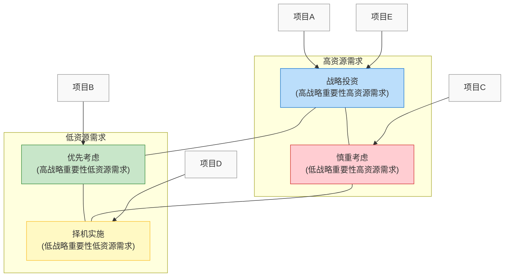
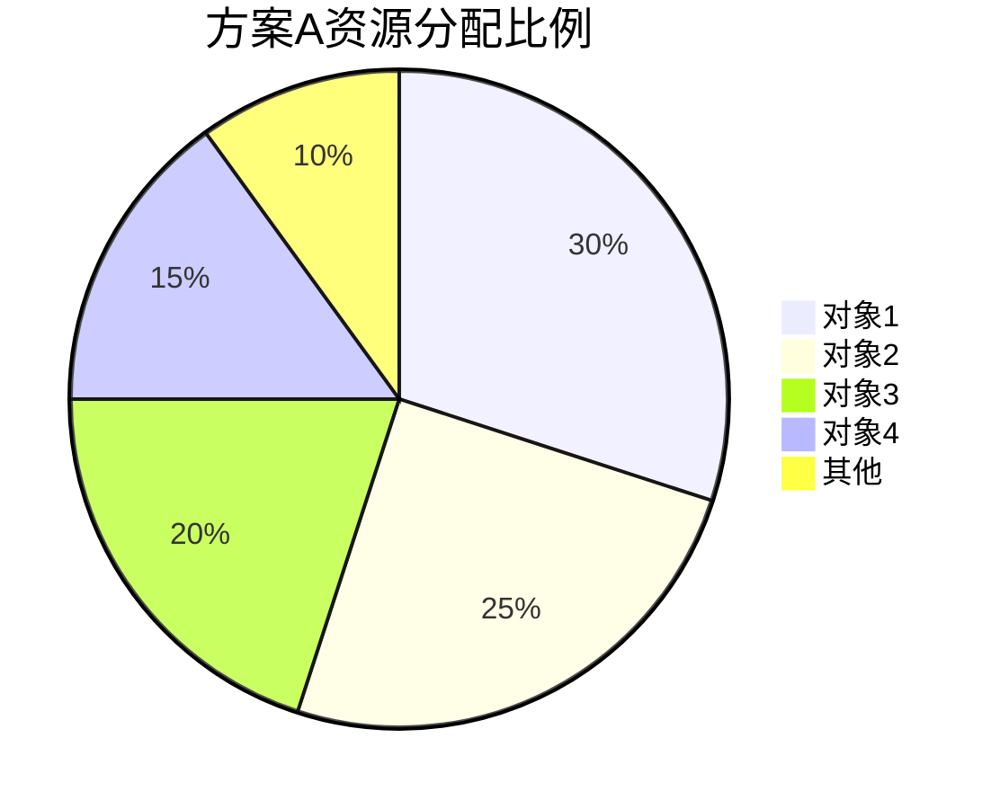
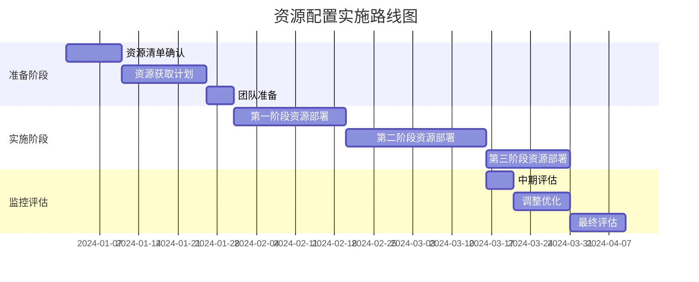
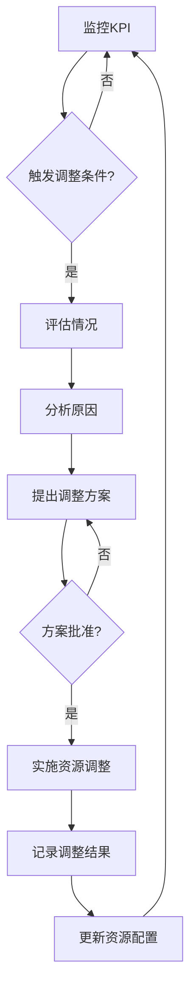

---
{"dg-publish":true,"tags":["资源配置","决策支持","模板","商业分析","项目管理"],"创建日期":"2024-05-19","更新日期":"2024-05-19","permalink":"/知识共享/002_商业分析/04_模板/04_决策支持/资源配置决策模板/","dgPassFrontmatter":true}
---

> [!info] 模板说明
> 本模板提供了一个系统化的资源配置决策框架，帮助管理者和业务分析师在有限资源条件下做出最优的资源分配决策。适用于项目资源分配、部门预算分配、人力资源分配、IT资源配置等多种资源决策场景。

## 一、决策概述

### 1.1 决策背景与目标

| 项目           | 内容                           |
| -------------- | ------------------------------ |
| 决策名称       | [资源配置决策名称]             |
| 决策类型       | [项目资源/预算/人力/IT资源等]  |
| 决策目标       | [明确此决策希望达成的目标]     |
| 决策期限       | [决策时间范围]                 |
| 决策负责人     | [决策负责人及角色]             |
| 参与决策人员   | [决策相关人员及角色]           |

**决策背景**：
[描述做出此决策的业务背景、驱动因素和关键挑战，150-200字]

### 1.2 资源概况

**可分配资源总量**：

| 资源类型 | 资源总量 | 计量单位 | 备注说明 |
| -------- | -------- | -------- | -------- |
| 资金     | [金额]   | [币种]   | [说明]   |
| 人力     | [人数/人时] | [FTE/小时] | [说明] |
| 设备     | [数量]   | [单位]   | [说明]   |
| 时间     | [周期]   | [天/月]  | [说明]   |
| 其他资源 | [数量]   | [单位]   | [说明]   |

**资源约束条件**：
- [关键约束条件1]
- [关键约束条件2]
- [关键约束条件3]

## 二、战略对齐分析

### 2.1 组织战略目标分析

| 战略目标 | 描述 | 重要度(1-5) | 时间框架 |
| -------- | ---- | ----------- | -------- |
| 目标1    | [描述] | [评分]    | [时间]   |
| 目标2    | [描述] | [评分]    | [时间]   |
| 目标3    | [描述] | [评分]    | [时间]   |

### 2.2 资源需求分析

| 资源分配对象 | 与战略目标的关联度 | 资源需求说明 | 预期产出 |
| ------------ | ------------------ | ------------ | -------- |
| [对象1]      | [关联目标]         | [需求描述]   | [产出]   |
| [对象2]      | [关联目标]         | [需求描述]   | [产出]   |
| [对象3]      | [关联目标]         | [需求描述]   | [产出]   |

### 2.3 战略优先级矩阵

## 三、资源分配方案

### 3.1 资源分配选项

| 分配选项 | 描述 | 主要优势 | 主要劣势 |
| -------- | ---- | -------- | -------- |
| 方案A    | [描述] | [优势]  | [劣势]   |
| 方案B    | [描述] | [优势]  | [劣势]   |
| 方案C    | [描述] | [优势]  | [劣势]   |

### 3.2 资源分配明细

**方案A资源分配明细**：

| 资源分配对象 | 资金配置 | 人力配置 | 设备配置 | 时间配置 | 其他资源 | 资源占比 |
| ------------ | -------- | -------- | -------- | -------- | -------- | -------- |
| [对象1]      | [金额]   | [人力]   | [设备]   | [时间]   | [其他]   | [占比]   |
| [对象2]      | [金额]   | [人力]   | [设备]   | [时间]   | [其他]   | [占比]   |
| [对象3]      | [金额]   | [人力]   | [设备]   | [时间]   | [其他]   | [占比]   |
| **总计**     | [金额]   | [人力]   | [设备]   | [时间]   | [其他]   | **100%** |

**方案B资源分配明细**：
[与方案A相同的表格结构]

**方案C资源分配明细**：
[与方案A相同的表格结构]

### 3.3 资源分配可视化

## 四、方案评估与比较

### 4.1 评估标准

| 评估标准 | 描述 | 权重(%) |
| -------- | ---- | ------- |
| 战略契合度 | [标准描述] | [权重] |
| 投资回报率 | [标准描述] | [权重] |
| 风险水平   | [标准描述] | [权重] |
| 实施复杂度 | [标准描述] | [权重] |
| 时间响应度 | [标准描述] | [权重] |
| 资源利用效率 | [标准描述] | [权重] |
| **总计**   | | **100%** |

### 4.2 方案评分比较

| 评估标准 | 权重(%) | 方案A评分(1-5) | 方案A加权分 | 方案B评分(1-5) | 方案B加权分 | 方案C评分(1-5) | 方案C加权分 |
| -------- | ------- | -------------- | ----------- | -------------- | ----------- | -------------- | ----------- |
| 战略契合度 | [权重] | [评分]        | [加权分]    | [评分]         | [加权分]    | [评分]         | [加权分]    |
| 投资回报率 | [权重] | [评分]        | [加权分]    | [评分]         | [加权分]    | [评分]         | [加权分]    |
| 风险水平   | [权重] | [评分]        | [加权分]    | [评分]         | [加权分]    | [评分]         | [加权分]    |
| 实施复杂度 | [权重] | [评分]        | [加权分]    | [评分]         | [加权分]    | [评分]         | [加权分]    |
| 时间响应度 | [权重] | [评分]        | [加权分]    | [评分]         | [加权分]    | [评分]         | [加权分]    |
| 资源利用效率 | [权重] | [评分]      | [加权分]    | [评分]         | [加权分]    | [评分]         | [加权分]    |
| **总计**   | **100%** | | **[总分]** | | **[总分]** | | **[总分]** |

### 4.3 敏感性分析

评估标准权重变化对最终决策的影响：

| 情景 | 权重变化 | 方案A总分 | 方案B总分 | 方案C总分 | 最优方案 |
| ---- | -------- | --------- | --------- | --------- | -------- |
| 基准情景 | [基准权重] | [总分] | [总分] | [总分] | [方案] |
| 情景1 | [权重变化1] | [总分] | [总分] | [总分] | [方案] |
| 情景2 | [权重变化2] | [总分] | [总分] | [总分] | [方案] |
| 情景3 | [权重变化3] | [总分] | [总分] | [总分] | [方案] |

## 五、预期效益与风险分析

### 5.1 预期效益分析

| 效益类型 | 方案A | 方案B | 方案C | 计算/评估方法 |
| -------- | ----- | ----- | ----- | ------------- |
| 财务效益 | [描述] | [描述] | [描述] | [方法] |
| 战略效益 | [描述] | [描述] | [描述] | [方法] |
| 运营效益 | [描述] | [描述] | [描述] | [方法] |
| 客户效益 | [描述] | [描述] | [描述] | [方法] |
| 长期效益 | [描述] | [描述] | [描述] | [方法] |

### 5.2 投资回报分析

| 指标 | 方案A | 方案B | 方案C | 计算公式 |
| ---- | ----- | ----- | ----- | -------- |
| ROI  | [值]% | [值]% | [值]% | [公式] |
| 投资回收期 | [值] | [值] | [值] | [公式] |
| 净现值(NPV) | [值] | [值] | [值] | [公式] |
| 效益/成本比 | [值] | [值] | [值] | [公式] |

### 5.3 风险分析

| 风险类别 | 风险描述 | 方案A风险评级 | 方案B风险评级 | 方案C风险评级 | 风险缓解措施 |
| -------- | -------- | ------------- | ------------- | ------------- | ------------ |
| 资源不足风险 | [描述] | [高/中/低] | [高/中/低] | [高/中/低] | [措施] |
| 实施延迟风险 | [描述] | [高/中/低] | [高/中/低] | [高/中/低] | [措施] |
| 质量风险 | [描述] | [高/中/低] | [高/中/低] | [高/中/低] | [措施] |
| 依赖性风险 | [描述] | [高/中/低] | [高/中/低] | [高/中/低] | [措施] |
| 战略偏离风险 | [描述] | [高/中/低] | [高/中/低] | [高/中/低] | [措施] |

### 5.4 权衡分析

| 权衡因素 | 方案A | 方案B | 方案C | 权衡考量 |
| -------- | ----- | ----- | ----- | -------- |
| 短期收益vs长期收益 | [评价] | [评价] | [评价] | [考量] |
| 风险vs回报 | [评价] | [评价] | [评价] | [考量] |
| 成本vs质量 | [评价] | [评价] | [评价] | [考量] |
| 速度vs全面性 | [评价] | [评价] | [评价] | [考量] |
| 创新vs稳定性 | [评价] | [评价] | [评价] | [考量] |

## 六、推荐方案与实施计划

### 6.1 推荐方案

- **推荐方案**：[方案X]
- **决策理由**：
  1. [关键理由1]
  2. [关键理由2]
  3. [关键理由3]
- **关键成功因素**：
  1. [因素1]
  2. [因素2]
  3. [因素3]

### 6.2 实施路线图

### 6.3 资源分配实施计划

| 实施阶段 | 关键活动 | 负责人 | 所需资源 | 时间安排 | 关键里程碑 |
| -------- | -------- | ------ | -------- | -------- | ---------- |
| 准备阶段 | [活动]   | [人员] | [资源]   | [时间]   | [里程碑]   |
| 启动阶段 | [活动]   | [人员] | [资源]   | [时间]   | [里程碑]   |
| 执行阶段 | [活动]   | [人员] | [资源]   | [时间]   | [里程碑]   |
| 收尾阶段 | [活动]   | [人员] | [资源]   | [时间]   | [里程碑]   |

### 6.4 协调与沟通计划

| 利益相关者 | 关注点 | 沟通方式 | 沟通频率 | 负责人 |
| ---------- | ------ | -------- | -------- | ------ |
| [相关者1]  | [关注点] | [方式] | [频率]   | [人员] |
| [相关者2]  | [关注点] | [方式] | [频率]   | [人员] |
| [相关者3]  | [关注点] | [方式] | [频率]   | [人员] |

## 七、监控与调整机制

### 7.1 关键绩效指标

| KPI类别 | 指标名称 | 目标值 | 测量方法 | 测量频率 | 负责人 |
| ------- | -------- | ------ | -------- | -------- | ------ |
| 资源利用率 | [指标] | [目标] | [方法] | [频率] | [人员] |
| 进度指标 | [指标] | [目标] | [方法] | [频率] | [人员] |
| 产出指标 | [指标] | [目标] | [方法] | [频率] | [人员] |
| 效益指标 | [指标] | [目标] | [方法] | [频率] | [人员] |
| 质量指标 | [指标] | [目标] | [方法] | [频率] | [人员] |

### 7.2 调整触发条件

| 情景 | 触发条件 | 调整方向 | 决策流程 | 权责人 |
| ---- | -------- | -------- | -------- | ------ |
| 资源不足 | [条件] | [方向] | [流程] | [人员] |
| 效益低于预期 | [条件] | [方向] | [流程] | [人员] |
| 环境变化 | [条件] | [方向] | [流程] | [人员] |
| 战略调整 | [条件] | [方向] | [流程] | [人员] |
| 风险发生 | [条件] | [方向] | [流程] | [人员] |

### 7.3 资源重新分配流程

## 八、附录

### 8.1 决策方法说明

- **资源分配方法**：[如优先级排序法、投资组合法、零基预算法等]
- **决策工具**：[如决策矩阵、AHP层次分析法、多目标规划等]
- **数据来源**：[资源数据、需求数据的来源及可靠性]

### 8.2 相关文档引用

- [战略规划文档]
- [预算管理制度]
- [项目管理办法]
- [资源请求表单]
- [历史资源分配记录]
- [相关政策文件]

### 8.3 术语表

| 术语 | 定义 | 备注 |
| ---- | ---- | ---- |
| [术语1] | [定义] | [备注] |
| [术语2] | [定义] | [备注] |
| [术语3] | [定义] | [备注] |

---

*本模板提供了资源配置决策的系统化框架，实际使用时可根据具体资源类型和组织需求进行调整，确保资源分配决策基于数据和战略导向。* 