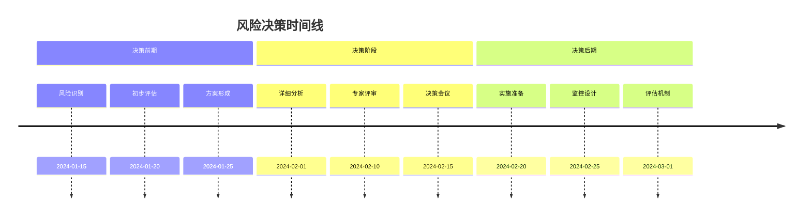
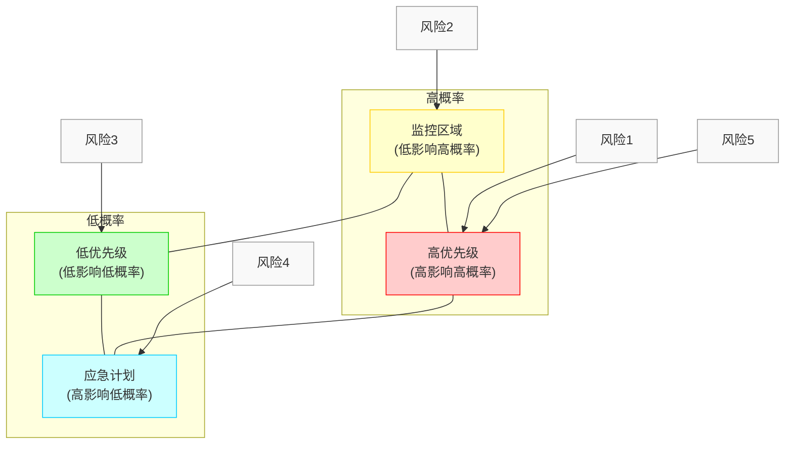
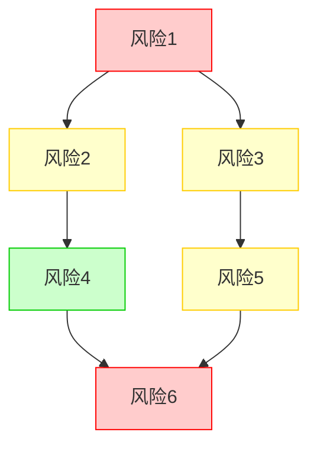
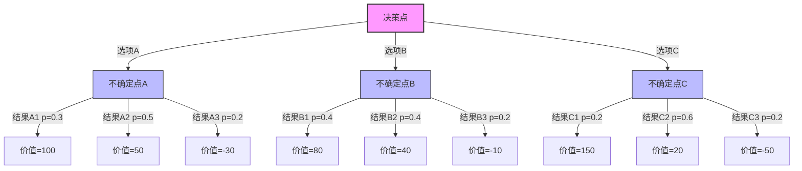
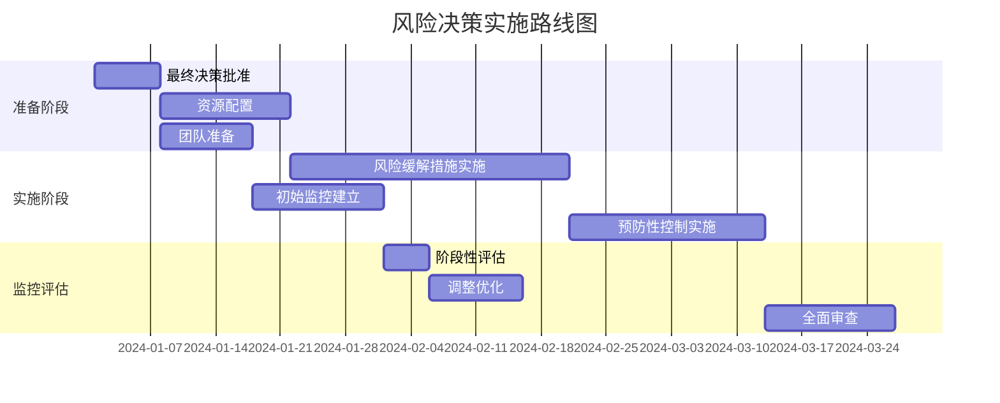

---
{"dg-publish":true,"tags":["风险管理","决策支持","模板","商业分析","风险分析"],"创建日期":"2024-05-19","更新日期":"2024-05-19","permalink":"/知识共享/002_商业分析/04_模板/04_决策支持/风险决策分析模板/","dgPassFrontmatter":true}
---

> [!info] 模板说明
> 本模板提供系统化的风险决策分析框架，帮助管理者和业务分析师在面临不确定性时做出更科学的决策。适用于项目风险评估、战略风险分析、投资风险决策、业务变更风险评估等多种场景。

## 一、风险决策概述

### 1.1 决策情境与背景

| 项目               | 内容                                 |
| ------------------ | ------------------------------------ |
| 决策名称           | [风险决策名称]                       |
| 决策类型           | [项目风险/战略风险/运营风险/合规风险等] |
| 决策目标           | [此决策希望达成的目标]               |
| 决策时间范围       | [决策的时间框架]                     |
| 决策责任人         | [决策负责人及角色]                   |
| 风险敞口价值       | [面临风险的价值量]                   |
| 关键利益相关方     | [受此决策影响的主要相关方]           |

**决策背景**：
[描述做出此风险决策的业务背景、主要驱动因素和面临的不确定性，150-200字]

### 1.2 风险决策选项

| 决策选项 | 描述 | 主要特点 | 预期结果 |
| -------- | ---- | -------- | -------- |
| 选项A    | [描述] | [特点]  | [结果]   |
| 选项B    | [描述] | [特点]  | [结果]   |
| 选项C    | [描述] | [特点]  | [结果]   |
| 无行动   | [描述] | [特点]  | [结果]   |

### 1.3 决策时间线

## 二、风险识别与评估

### 2.1 风险分类识别

| 风险类别 | 具体风险 | 风险描述 | 影响范围 | 识别方法 |
| -------- | -------- | -------- | -------- | -------- |
| 战略风险 | [风险1]  | [描述]   | [范围]   | [方法]   |
| 运营风险 | [风险2]  | [描述]   | [范围]   | [方法]   |
| 财务风险 | [风险3]  | [描述]   | [范围]   | [方法]   |
| 外部风险 | [风险4]  | [描述]   | [范围]   | [方法]   |
| 内部风险 | [风险5]  | [描述]   | [范围]   | [方法]   |
| 合规风险 | [风险6]  | [描述]   | [范围]   | [方法]   |

### 2.2 风险量化评估

| 风险项 | 发生概率(P) (1-5) | 影响程度(I) (1-5) | 风险值 (P×I) | 风险等级 | 评估方法 |
| ------ | ------------------ | ------------------ | -------------- | -------- | -------- |
| 风险1  | [概率]             | [影响]             | [风险值]       | [等级]   | [方法]   |
| 风险2  | [概率]             | [影响]             | [风险值]       | [等级]   | [方法]   |
| 风险3  | [概率]             | [影响]             | [风险值]       | [等级]   | [方法]   |
| 风险4  | [概率]             | [影响]             | [风险值]       | [等级]   | [方法]   |
| 风险5  | [概率]             | [影响]             | [风险值]       | [等级]   | [方法]   |

**评分标准说明**：
- **概率评分**：1=极低概率(<10%), 2=低概率(10-30%), 3=中等概率(30-50%), 4=高概率(50-70%), 5=极高概率(>70%)
- **影响评分**：1=可忽略影响, 2=轻微影响, 3=中等影响, 4=严重影响, 5=灾难性影响
- **风险等级**：低风险(1-5), 中风险(6-15), 高风险(16-25)

### 2.3 风险热力图

### 2.4 风险关联性分析

## 三、选项分析与评估

### 3.1 风险应对策略分析

| 风险项 | 风险等级 | 规避策略 | 减轻策略 | 转移策略 | 接受策略 | 推荐策略 |
| ------ | -------- | -------- | -------- | -------- | -------- | -------- |
| 风险1  | [等级]   | [策略]   | [策略]   | [策略]   | [策略]   | [推荐]   |
| 风险2  | [等级]   | [策略]   | [策略]   | [策略]   | [策略]   | [推荐]   |
| 风险3  | [等级]   | [策略]   | [策略]   | [策略]   | [策略]   | [推荐]   |
| 风险4  | [等级]   | [策略]   | [策略]   | [策略]   | [策略]   | [推荐]   |
| 风险5  | [等级]   | [策略]   | [策略]   | [策略]   | [策略]   | [推荐]   |

**风险应对策略说明**：
- **规避策略**：通过调整计划或方法来消除风险
- **减轻策略**：通过措施降低风险发生的概率或影响
- **转移策略**：通过合同、保险等方式将风险转移给第三方
- **接受策略**：承认风险存在但不采取特殊行动，可能包括应急准备

### 3.2 决策选项与风险关系矩阵

| 决策选项 | 风险1 | 风险2 | 风险3 | 风险4 | 风险5 | 总风险影响 |
| -------- | ----- | ----- | ----- | ----- | ----- | ---------- |
| 选项A    | [影响] | [影响] | [影响] | [影响] | [影响] | [总评分]   |
| 选项B    | [影响] | [影响] | [影响] | [影响] | [影响] | [总评分]   |
| 选项C    | [影响] | [影响] | [影响] | [影响] | [影响] | [总评分]   |
| 无行动   | [影响] | [影响] | [影响] | [影响] | [影响] | [总评分]   |

评分标准：+2(显著降低风险), +1(略微降低风险), 0(无影响), -1(略微增加风险), -2(显著增加风险)

### 3.3 多标准决策分析

| 评估标准 | 权重(%) | 选项A评分(1-5) | 选项A加权分 | 选项B评分(1-5) | 选项B加权分 | 选项C评分(1-5) | 选项C加权分 |
| -------- | ------- | -------------- | ----------- | -------------- | ----------- | -------------- | ----------- |
| 风险降低程度 | [权重] | [评分]       | [加权分]    | [评分]         | [加权分]    | [评分]         | [加权分]    |
| 实施成本     | [权重] | [评分]       | [加权分]    | [评分]         | [加权分]    | [评分]         | [加权分]    |
| 实施时间     | [权重] | [评分]       | [加权分]    | [评分]         | [加权分]    | [评分]         | [加权分]    |
| 业务中断影响 | [权重] | [评分]       | [加权分]    | [评分]         | [加权分]    | [评分]         | [加权分]    |
| 可持续性     | [权重] | [评分]       | [加权分]    | [评分]         | [加权分]    | [评分]         | [加权分]    |
| 适应性       | [权重] | [评分]       | [加权分]    | [评分]         | [加权分]    | [评分]         | [加权分]    |
| **总计**     | **100%** | | **[总分]** | | **[总分]** | | **[总分]** |

### 3.4 情景分析

| 情景 | 描述 | 选项A表现 | 选项B表现 | 选项C表现 | 最优选项 |
| ---- | ---- | --------- | --------- | --------- | -------- |
| 最佳情景 | [描述] | [表现] | [表现] | [表现] | [选项] |
| 预期情景 | [描述] | [表现] | [表现] | [表现] | [选项] |
| 最差情景 | [描述] | [表现] | [表现] | [表现] | [选项] |
| 高不确定性 | [描述] | [表现] | [表现] | [表现] | [选项] |

## 四、决策建模与定量分析

### 4.1 期望值分析

| 决策选项 | 可能结果 | 结果概率 | 结果价值 | 期望值 |
| -------- | -------- | -------- | -------- | ------ |
| 选项A    | 结果A1   | [概率]   | [价值]   | [期望值] |
|          | 结果A2   | [概率]   | [价值]   | [期望值] |
|          | 结果A3   | [概率]   | [价值]   | [期望值] |
|          | **总期望值** | | | **[总期望值]** |
| 选项B    | 结果B1   | [概率]   | [价值]   | [期望值] |
|          | 结果B2   | [概率]   | [价值]   | [期望值] |
|          | 结果B3   | [概率]   | [价值]   | [期望值] |
|          | **总期望值** | | | **[总期望值]** |
| 选项C    | [类似结构] | | | |

### 4.2 决策树分析

### 4.3 风险值计算（VaR分析）

| 选项 | 95% VaR | 99% VaR | 最大损失 | 信心水平 | 时间范围 |
| ---- | ------- | ------- | -------- | -------- | -------- |
| 选项A | [值]   | [值]    | [值]     | [水平]   | [范围]   |
| 选项B | [值]   | [值]    | [值]     | [水平]   | [范围]   |
| 选项C | [值]   | [值]    | [值]     | [水平]   | [范围]   |

### 4.4 蒙特卡洛模拟结果

| 输出指标 | 选项A | 选项B | 选项C | 置信区间 | 
| -------- | ----- | ----- | ----- | -------- |
| 预期回报 | [值]  | [值]  | [值]  | [区间]   |
| 标准差   | [值]  | [值]  | [值]  | [区间]   |
| 最大价值 | [值]  | [值]  | [值]  | [区间]   |
| 最小价值 | [值]  | [值]  | [值]  | [区间]   |
| 风险调整回报 | [值] | [值] | [值] | [区间]   |

[可插入蒙特卡洛模拟的分布图或结果图]

## 五、风险缓解与应对计划

### 5.1 关键风险应对计划

| 风险ID | 风险描述 | 风险等级 | 触发条件 | 预防措施 | 应对措施 | 责任人 | 所需资源 |
| ------ | -------- | -------- | -------- | -------- | -------- | ------ | -------- |
| R1     | [描述]   | [等级]   | [条件]   | [措施]   | [措施]   | [人员] | [资源]   |
| R2     | [描述]   | [等级]   | [条件]   | [措施]   | [措施]   | [人员] | [资源]   |
| R3     | [描述]   | [等级]   | [条件]   | [措施]   | [措施]   | [人员] | [资源]   |
| R4     | [描述]   | [等级]   | [条件]   | [措施]   | [措施]   | [人员] | [资源]   |
| R5     | [描述]   | [等级]   | [条件]   | [措施]   | [措施]   | [人员] | [资源]   |

### 5.2 应急响应计划

| 风险事件 | 事件触发标准 | 紧急响应步骤 | 关键联系人 | 资源需求 | 恢复目标 |
| -------- | ------------ | ------------ | ---------- | -------- | -------- |
| [事件1]  | [标准]       | [步骤]       | [联系人]   | [资源]   | [目标]   |
| [事件2]  | [标准]       | [步骤]       | [联系人]   | [资源]   | [目标]   |
| [事件3]  | [标准]       | [步骤]       | [联系人]   | [资源]   | [目标]   |

### 5.3 风险缓解成本效益分析

| 风险ID | 缓解措施 | 实施成本 | 预期风险降低值 | 成本效益比 | 优先级 |
| ------ | -------- | -------- | -------------- | ---------- | ------ |
| R1     | [措施]   | [成本]   | [价值]         | [比率]     | [级别] |
| R2     | [措施]   | [成本]   | [价值]         | [比率]     | [级别] |
| R3     | [措施]   | [成本]   | [价值]         | [比率]     | [级别] |
| R4     | [措施]   | [成本]   | [价值]         | [比率]     | [级别] |
| R5     | [措施]   | [成本]   | [价值]         | [比率]     | [级别] |

## 六、决策与实施计划

### 6.1 决策推荐

- **推荐选项**：[选项X]
- **推荐理由**：
  1. [关键理由1]
  2. [关键理由2]
  3. [关键理由3]
- **风险管理原则**：[适用于此决策的关键风险管理原则]
- **决策信心水平**：[高/中/低] - [解释原因]

### 6.2 实施路线图

### 6.3 实施与监控计划

| 工作阶段 | 关键活动 | 责任人 | 时间要求 | 资源需求 | 关键风险点 | 监控方式 |
| -------- | -------- | ------ | -------- | -------- | ---------- | -------- |
| 准备阶段 | [活动]   | [人员] | [时间]   | [资源]   | [风险点]   | [方式]   |
| 实施阶段 | [活动]   | [人员] | [时间]   | [资源]   | [风险点]   | [方式]   |
| 监控阶段 | [活动]   | [人员] | [时间]   | [资源]   | [风险点]   | [方式]   |
| 评估阶段 | [活动]   | [人员] | [时间]   | [资源]   | [风险点]   | [方式]   |

### 6.4 风险监控指标

| 风险领域 | 关键风险指标(KRI) | 基准值 | 警戒阈值 | 测量频率 | 数据来源 | 责任人 |
| -------- | ----------------- | ------ | -------- | -------- | -------- | ------ |
| [领域1]  | [指标]            | [基准] | [阈值]   | [频率]   | [来源]   | [人员] |
| [领域2]  | [指标]            | [基准] | [阈值]   | [频率]   | [来源]   | [人员] |
| [领域3]  | [指标]            | [基准] | [阈值]   | [频率]   | [来源]   | [人员] |
| [领域4]  | [指标]            | [基准] | [阈值]   | [频率]   | [来源]   | [人员] |

## 七、决策后评估

### 7.1 评估计划

| 评估时间点 | 评估目标 | 评估指标 | 评估方法 | 负责人 | 输出文档 |
| ---------- | -------- | -------- | -------- | ------ | -------- |
| 实施后30天 | [目标]   | [指标]   | [方法]   | [人员] | [文档]   |
| 实施后90天 | [目标]   | [指标]   | [方法]   | [人员] | [文档]   |
| 实施后180天 | [目标]  | [指标]   | [方法]   | [人员] | [文档]   |
| 实施后1年  | [目标]   | [指标]   | [方法]   | [人员] | [文档]   |

### 7.2 经验教训记录模板

| 项目 | 内容 |
| ---- | ---- |
| 决策事项 | [简述决策内容] |
| 决策结果 | [简述结果] |
| 成功之处 | [列出决策过程中的成功点] |
| 问题之处 | [列出决策过程中的问题点] |
| 根本原因 | [分析问题的根本原因] |
| 改进建议 | [提出改进建议] |
| 适用情境 | [说明此经验教训适用的情境] |
| 参考文档 | [相关文档链接] |

## 八、附录

### 8.1 风险评估方法说明

- **风险识别方法**：[如头脑风暴、德尔菲法、SWOT分析、专家访谈等]
- **风险评估工具**：[如决策树、蒙特卡洛模拟、情景分析、敏感性分析等]
- **风险评价标准**：[组织内部的风险评价标准和阈值]

### 8.2 参考资料与数据来源

- [行业报告]
- [内部历史数据]
- [专家意见]
- [法规标准]
- [案例研究]
- [风险管理框架]

### 8.3 术语表

| 术语 | 定义 | 备注 |
| ---- | ---- | ---- |
| [术语1] | [定义] | [备注] |
| [术语2] | [定义] | [备注] |
| [术语3] | [定义] | [备注] |
| [术语4] | [定义] | [备注] |
| [术语5] | [定义] | [备注] |

---

*本模板提供了风险决策分析的系统化框架，实际使用时可根据具体风险类型和组织需求进行调整，确保风险决策基于科学方法和系统思考。* 