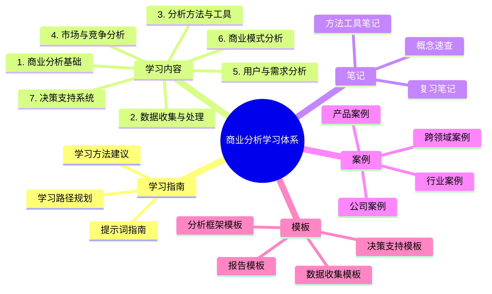
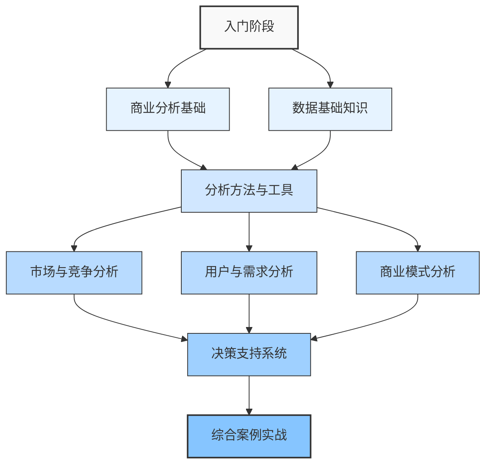

---
{"dg-publish":true,"tags":["商业分析","目录","索引","导航"],"创建日期":"2023-11-15","更新日期":"2024-04-26","permalink":"/知识共享/002_商业分析/商业分析学习目录/","dgPassFrontmatter":true}
---

# 商业分析学习目录

> [!quote] 概述
> 本文件为商业分析学习资料的总体导航目录。包含所有学习路径、学习内容、笔记、案例和模板等资源的结构化索引，帮助您高效学习商业分析知识体系。通过标签系统和双向链接，您可以在不同知识点之间快速导航，构建完整的知识网络。
## 全局思维导图

## 1. 学习指南

### 1.1 提示词指南
- [[知识共享/002_商业分析/商业分析详细学习内容提示词\|商业分析详细学习内容提示词]] - AI辅助学习的完整提示词集合
- [[基础概念提示词\|基础概念提示词]] - 生成基础概念学习内容的提示词
- [[方法工具提示词\|方法工具提示词]] - 生成分析方法和工具学习内容的提示词
- [[案例分析提示词\|案例分析提示词]] - 生成案例分析内容的提示词
- [[模板生成提示词\|模板生成提示词]] - 生成各类分析模板的提示词

### 1.2 学习方法建议
- [[高效学习商业分析的方法\|高效学习商业分析的方法]] - 提高学习效率的实用技巧
- [[理论与实践结合策略\|理论与实践结合策略]] - 如何将理论知识应用到实际工作中
- [[组建学习小组指南\|组建学习小组指南]] - 协作学习的方法和建议
- [[自我评估工具集\|自我评估工具集]] - 评估学习进度和掌握程度的工具

## 2. 学习内容

### 2.1 商业分析基础 #基础 
- [[知识共享/002_商业分析/01_学习内容/01_商业分析基础/1.1 商业分析概述\|01_商业分析基础/1.1 商业分析概述]] - 商业分析的定义、范围和价值
- [[知识共享/002_商业分析/01_学习内容/01_商业分析基础/1.2 商业分析师的角色与职责\|01_商业分析基础/1.2 商业分析师的角色与职责]] - 商业分析师的工作内容和能力要求
- [[知识共享/002_商业分析/01_学习内容/01_商业分析基础/1.3 商业分析的思维方式\|01_商业分析基础/1.3 商业分析的思维方式]] - 培养商业分析思维的方法与实践
- [[知识共享/002_商业分析/01_学习内容/01_商业分析基础/1.4 商业分析与相关学科的关系\|01_商业分析基础/1.4 商业分析与相关学科的关系]] - 商业分析与数据科学、产品管理等学科的联系
- [[知识共享/002_商业分析/01_学习内容/01_商业分析基础/1.5 商业分析的发展趋势\|01_商业分析基础/1.5 商业分析的发展趋势]] - 行业趋势与未来发展方向

### 2.2 数据收集与处理 #数据 
- [[知识共享/002_商业分析/01_学习内容/02_数据收集与处理/2.1 数据收集与处理基础\|02_数据收集与处理/2.1 数据收集与处理基础]] - 数据类型、收集方法与处理技术
- [[02_数据收集与处理/2.2 数据分析方法\|02_数据收集与处理/2.2 数据分析方法]] - 数据分析的基本方法与流程
- [[知识共享/002_商业分析/01_学习内容/02_数据收集与处理/2.3 数据可视化技术\|02_数据收集与处理/2.3 数据可视化技术]] - 数据可视化原则与技术
- [[知识共享/002_商业分析/01_学习内容/02_数据收集与处理/2.4 数据质量管理\|02_数据收集与处理/2.4 数据质量管理]] - 保证数据准确性和可靠性的方法
- [[知识共享/002_商业分析/01_学习内容/02_数据收集与处理/2.5 数据存储与管理\|02_数据收集与处理/2.5 数据存储与管理]] - 数据仓库、数据湖等存储方案
- [[知识共享/002_商业分析/01_学习内容/02_数据收集与处理/2.6 数据隐私与合规\|02_数据收集与处理/2.6 数据隐私与合规]] - 数据使用的法规要求与伦理考量

### 2.3 分析方法与工具 #方法 #工具
- [[知识共享/002_商业分析/01_学习内容/03_分析方法与工具/3.1 描述性分析方法\|03_分析方法与工具/3.1 描述性分析方法]] - 基础统计分析与数据可视化
- [[知识共享/002_商业分析/01_学习内容/03_分析方法与工具/3.2 诊断性分析方法\|03_分析方法与工具/3.2 诊断性分析方法]] - 因果分析与相关性分析
- [[知识共享/002_商业分析/01_学习内容/03_分析方法与工具/3.3 预测性分析方法\|03_分析方法与工具/3.3 预测性分析方法]] - 预测模型与趋势分析
- [[知识共享/002_商业分析/01_学习内容/03_分析方法与工具/3.4 规范性分析方法\|03_分析方法与工具/3.4 规范性分析方法]] - 优化模型与决策支持
- [[03_分析方法与工具/3.5 Excel高级分析技巧\|03_分析方法与工具/3.5 Excel高级分析技巧]] - 使用Excel进行商业分析的方法
- [[知识共享/002_商业分析/01_学习内容/03_分析方法与工具/3.6 BI工具应用\|03_分析方法与工具/3.6 BI工具应用]] - Tableau, Power BI等工具的使用
- [[03_分析方法与工具/3.7 Python与R在商业分析中的应用\|03_分析方法与工具/3.7 Python与R在商业分析中的应用]] - 编程语言在分析中的运用
- [[03_分析方法与工具/3.8 数据可视化最佳实践\|03_分析方法与工具/3.8 数据可视化最佳实践]] - 有效传达分析结果的可视化方法

### 2.4 市场与竞争分析 #市场 #竞争
- [[知识共享/002_商业分析/01_学习内容/04_市场与竞争分析/4.1 市场分析框架\|04_市场与竞争分析/4.1 市场分析框架]] - 市场规模、增长率和动态分析
- [[知识共享/002_商业分析/01_学习内容/04_市场与竞争分析/4.2 竞争对手分析\|04_市场与竞争分析/4.2 竞争对手分析]] - 竞争对手识别与评估方法
- [[知识共享/002_商业分析/01_学习内容/04_市场与竞争分析/4.3 行业分析\|04_市场与竞争分析/4.3 行业分析]] - 行业结构与发展趋势分析
- [[知识共享/002_商业分析/01_学习内容/04_市场与竞争分析/4.4 宏观环境分析\|04_市场与竞争分析/4.4 宏观环境分析]] - PEST分析与环境扫描
- [[知识共享/002_商业分析/01_学习内容/04_市场与竞争分析/4.5 市场细分与定位\|04_市场与竞争分析/4.5 市场细分与定位]] - 细分市场识别与战略定位
- [[知识共享/002_商业分析/01_学习内容/04_市场与竞争分析/4.6 市场进入策略分析\|04_市场与竞争分析/4.6 市场进入策略分析]] - 新市场进入决策分析
- [[04_市场与竞争分析/4.7 市场份额分析\|04_市场与竞争分析/4.7 市场份额分析]] - 市场份额测量与增长策略

### 2.5 用户与需求分析 #用户 #需求
- [[知识共享/002_商业分析/01_学习内容/05_用户与需求分析/5.1 用户研究方法\|05_用户与需求分析/5.1 用户研究方法]] - 用户访谈、观察等研究方法
- [[知识共享/002_商业分析/01_学习内容/05_用户与需求分析/5.2 用户画像构建\|05_用户与需求分析/5.2 用户画像构建]] - 用户特征分析与画像开发
- [[知识共享/002_商业分析/01_学习内容/05_用户与需求分析/5.3 需求捕获与分析\|05_用户与需求分析/5.3 需求捕获与分析]] - 识别和分析用户需求的技术
- [[知识共享/002_商业分析/01_学习内容/05_用户与需求分析/5.4 用户旅程映射\|05_用户与需求分析/5.4 用户旅程映射]] - 分析用户体验全周期
- [[知识共享/002_商业分析/01_学习内容/05_用户与需求分析/5.5 用户行为分析\|05_用户与需求分析/5.5 用户行为分析]] - 用户行为模式与动机分析
- [[知识共享/002_商业分析/01_学习内容/05_用户与需求分析/5.6 用户满意度评估\|05_用户与需求分析/5.6 用户满意度评估]] - 测量与提升用户满意度的方法
- [[知识共享/002_商业分析/01_学习内容/05_用户与需求分析/5.7 用户忠诚度分析\|05_用户与需求分析/5.7 用户忠诚度分析]] - 分析与提高用户忠诚度的策略

### 2.6 商业模式分析 #商业模式
- [[知识共享/002_商业分析/01_学习内容/06_商业模式分析/6.1 商业模式画布\|06_商业模式分析/6.1 商业模式画布]] - 商业模式九要素分析
- [[知识共享/002_商业分析/01_学习内容/06_商业模式分析/6.2 价值主张设计\|06_商业模式分析/6.2 价值主张设计]] - 创建与评估价值主张
- [[知识共享/002_商业分析/01_学习内容/06_商业模式分析/6.3 收入模式分析\|06_商业模式分析/6.3 收入模式分析]] - 各类收入模式的比较与选择
- [[知识共享/002_商业分析/01_学习内容/06_商业模式分析/6.4 成本结构分析\|06_商业模式分析/6.4 成本结构分析]] - 成本类型与优化策略
- [[知识共享/002_商业分析/01_学习内容/06_商业模式分析/6.5 商业模式创新\|06_商业模式分析/6.5 商业模式创新]] - 商业模式创新方法与案例
- [[知识共享/002_商业分析/01_学习内容/06_商业模式分析/6.6 平台商业模式\|06_商业模式分析/6.6 平台商业模式]] - 平台策略与网络效应分析
- [[知识共享/002_商业分析/01_学习内容/06_商业模式分析/6.7 商业模式可持续性评估\|06_商业模式分析/6.7 商业模式可持续性评估]] - 评估商业模式长期可行性

### 2.7 决策支持系统 #决策
- [[知识共享/002_商业分析/01_学习内容/07_决策支持系统/7.1 决策理论基础\|07_决策支持系统/7.1 决策理论基础]] - 决策过程与偏见分析
- [[知识共享/002_商业分析/01_学习内容/07_决策支持系统/7.2 决策树分析\|07_决策支持系统/7.2 决策树分析]] - 构建与应用决策树
- [[知识共享/002_商业分析/01_学习内容/07_决策支持系统/7.3 情景规划\|07_决策支持系统/7.3 情景规划]] - 多情景分析与应对策略
- [[知识共享/002_商业分析/01_学习内容/07_决策支持系统/7.4 敏感性分析\|07_决策支持系统/7.4 敏感性分析]] - 评估变量对结果的影响
- [[知识共享/002_商业分析/01_学习内容/07_决策支持系统/7.5 投资回报分析\|07_决策支持系统/7.5 投资回报分析]] - ROI计算与项目评估
- [[知识共享/002_商业分析/01_学习内容/07_决策支持系统/7.6 风险分析与管理\|07_决策支持系统/7.6 风险分析与管理]] - 识别、评估与管理风险
- [[知识共享/002_商业分析/01_学习内容/07_决策支持系统/7.7 实时决策支持\|07_决策支持系统/7.7 实时决策支持]] - 构建实时业务监控系统

## 3. 笔记

### 3.1 概念速查笔记
- [[知识共享/002_商业分析/02_笔记/01_概念速查/商业分析核心概念速查\|02_笔记/01_概念速查/商业分析核心概念速查]] #速查 #基础
- [[知识共享/002_商业分析/02_笔记/01_概念速查/分析方法论速查\|02_笔记/01_概念速查/分析方法论速查]] #速查 #方法
- [[知识共享/002_商业分析/02_笔记/01_概念速查/数据分析工具速查\|02_笔记/01_概念速查/数据分析工具速查]] #速查 #工具
- [[知识共享/002_商业分析/02_笔记/01_概念速查/商业模式类型速查\|02_笔记/01_概念速查/商业模式类型速查]] #速查 #商业模式

### 3.2 方法工具笔记
- [[知识共享/002_商业分析/02_笔记/02_方法工具/SWOT分析操作指南\|02_笔记/02_方法工具/SWOT分析操作指南]] #SWOT #方法
- [[知识共享/002_商业分析/02_笔记/02_方法工具/波特五力模型应用笔记\|02_笔记/02_方法工具/波特五力模型应用笔记]] #波特五力 #竞争
- [[知识共享/002_商业分析/02_笔记/02_方法工具/用户画像构建步骤\|02_笔记/02_方法工具/用户画像构建步骤]] #用户画像 #方法
- [[知识共享/002_商业分析/02_笔记/02_方法工具/A-B测试设计与执行\|02_笔记/02_方法工具/A-B测试设计与执行]] #AB测试 #方法
- [[知识共享/002_商业分析/02_笔记/02_方法工具/商业模式画布实操笔记\|02_笔记/02_方法工具/商业模式画布实操笔记]] #商业模式画布 #方法

### 3.3 复习笔记
- [[知识共享/002_商业分析/02_笔记/03_复习笔记/商业分析基础模块复习\|02_笔记/03_复习笔记/商业分析基础模块复习]] #复习 #基础
- [[知识共享/002_商业分析/02_笔记/03_复习笔记/数据分析方法复习\|02_笔记/03_复习笔记/数据分析方法复习]] #复习 #数据
- [[知识共享/002_商业分析/02_笔记/03_复习笔记/市场分析框架复习\|02_笔记/03_复习笔记/市场分析框架复习]] #复习 #市场
- [[知识共享/002_商业分析/02_笔记/03_复习笔记/商业模式分析复习\|02_笔记/03_复习笔记/商业模式分析复习]] #复习 #商业模式
- [[知识共享/002_商业分析/02_笔记/03_复习笔记/决策支持技术复习\|02_笔记/03_复习笔记/决策支持技术复习]] #复习 #决策

## 4. 案例

### 4.1 行业案例
- [[知识共享/002_商业分析/03_案例/01_行业案例/电商行业数据分析案例\|03_案例/01_行业案例/电商行业数据分析案例]] #电商 #案例
- [[知识共享/002_商业分析/03_案例/01_行业案例/SaaS企业商业模式分析\|03_案例/01_行业案例/SaaS企业商业模式分析]] #SaaS #案例
- [[知识共享/002_商业分析/03_案例/01_行业案例/金融科技市场机会分析\|03_案例/01_行业案例/金融科技市场机会分析]] #金融科技 #案例
- [[知识共享/002_商业分析/03_案例/01_行业案例/新零售转型策略案例\|03_案例/01_行业案例/新零售转型策略案例]] #新零售 #案例

### 4.2 公司案例
- [[知识共享/002_商业分析/03_案例/02_公司案例/阿里巴巴数据分析团队工作模式\|03_案例/02_公司案例/阿里巴巴数据分析团队工作模式]] #阿里巴巴 #案例
- [[知识共享/002_商业分析/03_案例/02_公司案例/亚马逊用户体验分析\|03_案例/02_公司案例/亚马逊用户体验分析]] #亚马逊 #案例
- [[知识共享/002_商业分析/03_案例/02_公司案例/Netflix的数据驱动决策\|03_案例/02_公司案例/Netflix的数据驱动决策]] #Netflix #案例
- [[知识共享/002_商业分析/03_案例/02_公司案例/小米的商业模式演变\|03_案例/02_公司案例/小米的商业模式演变]] #小米 #案例

### 4.3 产品案例
- [[知识共享/002_商业分析/03_案例/03_产品案例/微信支付用户增长分析\|03_案例/03_产品案例/微信支付用户增长分析]] #微信 #支付 #案例
- [[知识共享/002_商业分析/03_案例/03_产品案例/Spotify推荐系统分析\|03_案例/03_产品案例/Spotify推荐系统分析]] #Spotify #案例
- [[知识共享/002_商业分析/03_案例/03_产品案例/电动汽车市场需求分析\|03_案例/03_产品案例/电动汽车市场需求分析]] #电动汽车 #案例
- [[知识共享/002_商业分析/03_案例/03_产品案例/共享单车商业模式评估\|03_案例/03_产品案例/共享单车商业模式评估]] #共享单车 #案例

### 4.4 跨领域案例
- [[知识共享/002_商业分析/03_案例/04_跨领域案例/数字化转型成功案例分析\|03_案例/04_跨领域案例/数字化转型成功案例分析]] #数字化转型 #案例
- [[知识共享/002_商业分析/03_案例/04_跨领域案例/可持续发展商业模式案例\|03_案例/04_跨领域案例/可持续发展商业模式案例]] #可持续发展 #案例
- [[知识共享/002_商业分析/03_案例/04_跨领域案例/跨境电商市场进入策略\|03_案例/04_跨领域案例/跨境电商市场进入策略]] #跨境电商 #案例
- [[知识共享/002_商业分析/03_案例/04_跨领域案例/AI应用商业价值分析\|03_案例/04_跨领域案例/AI应用商业价值分析]] #AI #案例

## 5. 模板

### 5.1 分析框架模板
- [[04_模板/01_分析框架/SWOT分析模板\|04_模板/01_分析框架/SWOT分析模板]] #SWOT #模板
- [[04_模板/01_分析框架/PEST分析模板\|04_模板/01_分析框架/PEST分析模板]] #PEST #模板
- [[04_模板/01_分析框架/波特五力分析模板\|04_模板/01_分析框架/波特五力分析模板]] #波特五力 #模板
- [[04_模板/01_分析框架/价值链分析模板\|04_模板/01_分析框架/价值链分析模板]] #价值链 #模板
- [[04_模板/01_分析框架/BCG矩阵分析模板\|04_模板/01_分析框架/BCG矩阵分析模板]] #BCG矩阵 #模板

### 5.2 数据收集模板
- [[04_模板/02_数据收集/用户访谈问卷模板\|04_模板/02_数据收集/用户访谈问卷模板]] #访谈 #模板
- [[04_模板/02_数据收集/竞品分析数据收集模板\|04_模板/02_数据收集/竞品分析数据收集模板]] #竞品 #模板
- [[04_模板/02_数据收集/市场调研计划模板\|04_模板/02_数据收集/市场调研计划模板]] #市场调研 #模板
- [[04_模板/02_数据收集/用户行为追踪方案模板\|04_模板/02_数据收集/用户行为追踪方案模板]] #用户行为 #模板

### 5.3 报告模板
- [[04_模板/03_报告/市场分析报告模板\|04_模板/03_报告/市场分析报告模板]] #市场 #报告 #模板
- [[04_模板/03_报告/用户研究报告模板\|04_模板/03_报告/用户研究报告模板]] #用户 #报告 #模板
- [[04_模板/03_报告/商业模式分析报告模板\|04_模板/03_报告/商业模式分析报告模板]] #商业模式 #报告 #模板
- [[04_模板/03_报告/季度业务回顾报告模板\|04_模板/03_报告/季度业务回顾报告模板]] #业务回顾 #报告 #模板

### 5.4 决策支持模板
- [[04_模板/04_决策支持/产品决策分析框架\|04_模板/04_决策支持/产品决策分析框架]] #产品 #决策 #模板
- [[04_模板/04_决策支持/投资回报分析模板\|04_模板/04_决策支持/投资回报分析模板]] #ROI #模板
- [[04_模板/04_决策支持/风险评估矩阵模板\|04_模板/04_决策支持/风险评估矩阵模板]] #风险 #模板
- [[04_模板/04_决策支持/情景规划工作表模板\|04_模板/04_决策支持/情景规划工作表模板]] #情景规划 #模板

## 学习路径建议

### 入门级推荐路径（0-3个月）
1. 先学习[[知识共享/002_商业分析/01_学习内容/01_商业分析基础/1.1 商业分析概述\|01_商业分析基础/1.1 商业分析概述]]和[[知识共享/002_商业分析/01_学习内容/01_商业分析基础/1.2 商业分析师的角色与职责\|01_商业分析基础/1.2 商业分析师的角色与职责]]，建立基础认知
2. 掌握[[知识共享/002_商业分析/01_学习内容/02_数据收集与处理/2.1 数据收集与处理基础\|02_数据收集与处理/2.1 数据收集与处理基础]]和[[02_数据收集与处理/2.2 数据分析方法\|02_数据收集与处理/2.2 数据分析方法]]，奠定数据基础
3. 学习基础分析方法：[[知识共享/002_商业分析/01_学习内容/03_分析方法与工具/3.1 描述性分析方法\|03_分析方法与工具/3.1 描述性分析方法]]和[[03_分析方法与工具/3.5 Excel高级分析技巧\|03_分析方法与工具/3.5 Excel高级分析技巧]]
4. 尝试简单案例分析：[[知识共享/002_商业分析/03_案例/01_行业案例/电商行业数据分析案例\|03_案例/01_行业案例/电商行业数据分析案例]]
5. 使用[[04_模板/01_分析框架/SWOT分析模板\|04_模板/01_分析框架/SWOT分析模板]]进行实践

### 进阶级推荐路径（4-9个月）
1. 深入学习[[知识共享/002_商业分析/01_学习内容/03_分析方法与工具/3.3 预测性分析方法\|03_分析方法与工具/3.3 预测性分析方法]]和[[知识共享/002_商业分析/01_学习内容/03_分析方法与工具/3.6 BI工具应用\|03_分析方法与工具/3.6 BI工具应用]]
2. 系统掌握[[知识共享/002_商业分析/01_学习内容/04_市场与竞争分析/4.1 市场分析框架\|04_市场与竞争分析/4.1 市场分析框架]]到[[04_市场与竞争分析/4.7 市场份额分析\|04_市场与竞争分析/4.7 市场份额分析]]
3. 学习[[知识共享/002_商业分析/01_学习内容/05_用户与需求分析/5.1 用户研究方法\|05_用户与需求分析/5.1 用户研究方法]]到[[知识共享/002_商业分析/01_学习内容/05_用户与需求分析/5.4 用户旅程映射\|05_用户与需求分析/5.4 用户旅程映射]]
4. 尝试更复杂案例：[[知识共享/002_商业分析/03_案例/02_公司案例/Netflix的数据驱动决策\|03_案例/02_公司案例/Netflix的数据驱动决策]]
5. 实践[[知识共享/002_商业分析/02_笔记/02_方法工具/商业模式画布实操笔记\|02_笔记/02_方法工具/商业模式画布实操笔记]]和[[04_模板/01_分析框架/BCG矩阵分析模板\|04_模板/01_分析框架/BCG矩阵分析模板]]

### 专家级推荐路径（10-18个月）
1. 掌握高级分析技能：[[03_分析方法与工具/3.7 Python与R在商业分析中的应用\|03_分析方法与工具/3.7 Python与R在商业分析中的应用]]
2. 深入学习[[知识共享/002_商业分析/01_学习内容/06_商业模式分析/6.1 商业模式画布\|06_商业模式分析/6.1 商业模式画布]]到[[知识共享/002_商业分析/01_学习内容/06_商业模式分析/6.7 商业模式可持续性评估\|06_商业模式分析/6.7 商业模式可持续性评估]]
3. 系统掌握[[知识共享/002_商业分析/01_学习内容/07_决策支持系统/7.1 决策理论基础\|07_决策支持系统/7.1 决策理论基础]]到[[知识共享/002_商业分析/01_学习内容/07_决策支持系统/7.7 实时决策支持\|07_决策支持系统/7.7 实时决策支持]]
4. 分析复杂案例：[[知识共享/002_商业分析/03_案例/04_跨领域案例/数字化转型成功案例分析\|03_案例/04_跨领域案例/数字化转型成功案例分析]]
5. 能够独立创建分析框架和决策支持系统

## 相关资源
- [[商业分析推荐书籍清单\|商业分析推荐书籍清单]]
- [[商业分析工具软件资源\|商业分析工具软件资源]]
- [[行业报告收集\|行业报告收集]]
- [[商业分析学习社区\|商业分析学习社区]]
- [[商业分析认证指南\|商业分析认证指南]]

> [!tip] 使用指南
> 1. 使用Obsidian的搜索功能（Ctrl+F）快速查找感兴趣的主题
> 2. 点击带有[[]]双链接标记的内容可直接跳转到相应文档
> 3. 通过标签（如#商业模式）可以聚合查看相同主题的所有内容
> 4. 建议先查看学习路径，根据个人情况选择适合的学习顺序
> 5. 定期回顾复习笔记，巩固已学知识
> 6. 遵循文件组织规则创建新内容，保持知识库结构清晰统一

## 参考文献
1. Business Analysis Body of Knowledge (BABOK) Guide v3
2. Alexander Osterwalder & Yves Pigneur. (2010). Business Model Generation.
3. Barbara Minto. (2008). The Pyramid Principle.
4. Jim Novo. (2004). Drilling Down: Turning Customer Data into Profits.
5. Roger Fisher & William Ury. (2011). Getting to Yes. 