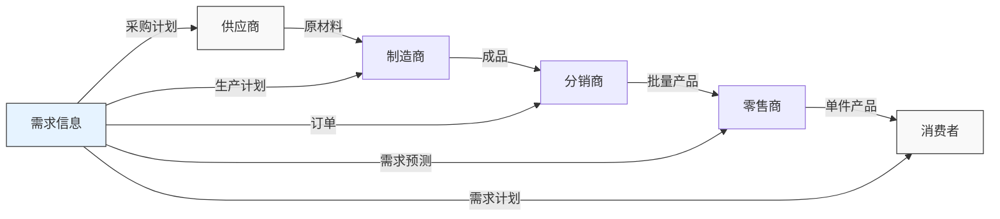

---
{"dg-publish":true,"tags":["供应链","供应链定义","价值链","基础概念","物流管理"],"创建日期":"2024-04-26","permalink":"/知识共享/003_供应链/01_供应链基础/01_学习内容/01_供应链基础概念/1.1 供应链的定义/","dgPassFrontmatter":true}
---

供应链是连接供应商、制造商、分销商、零售商和最终消费者的网络系统，通过协调物料、信息和资金流动，将产品或服务从原始供应商交付给最终客户的过程。

## 基础知识

### 权威定义比较

不同领域的权威机构和学者对供应链有着不同侧重点的定义：

1. **供应链管理专业协会(CSCMP)**：
   > "供应链涵盖了从原材料到最终用户的产品流和服务流的所有活动，以及相关的信息流和资金流。物料和信息在供应链中上下流动。"

2. **APICS(美国生产与库存控制协会)**：
   > "供应链是在产品从供应商到客户的整个过程中，参与提供产品或服务的全球网络。它包括将原材料转化为成品并交付给最终用户的所有流程和活动。"

3. **麻省理工学院**的定义：
   > "供应链是一个由多个组织或个人通过上游和下游环节连接而成的网络，包括为最终客户创造价值的各种不同流程和活动。"

4. **哈佛商学院**的观点：
   > "供应链是一种端到端的价值创造流程，其目标是通过整合资源和活动，为客户创造最大价值，同时为供应链中的所有参与者创造适当回报。"

5. **中国物流与采购联合会**的定义：
   > "供应链是围绕核心企业，通过对信息流、物流、资金流的控制，从采购原材料开始，制成中间产品以及最终产品，最后由销售网络把产品送到消费者手中的将供应商、制造商、分销商、零售商直到最终用户连成一个整体的功能网链结构。"

### 供应链的历史演变

供应链概念的发展经历了以下几个关键阶段：

1. **物流管理阶段(1960-1970年代)**：
   - 关注点在企业内部物流活动优化
   - 主要目标是降低运输和仓储成本
   - 功能相对分散，缺乏整体协调

2. **供应链概念形成阶段(1980年代)**：
   - "供应链"一词首次在1982年由Keith Oliver(博思咨询)提出
   - 开始关注企业间物料、信息和资金流的整合
   - 发展初期以成本效率为主要驱动力

3. **供应链管理兴起阶段(1990年代)**：
   - 供应链管理(SCM)作为学科和实践领域形成
   - 全球化加速推动了供应链的全球扩展
   - 信息技术的发展促进了供应链协同

4. **集成供应链阶段(2000-2010年代)**：
   - 强调端到端的供应链集成
   - 发展了SCOR等标准化供应链参考模型
   - 客户价值和响应性成为关键驱动因素

5. **数字供应链阶段(2010年至今)**：
   - 大数据、物联网、人工智能等技术深度应用
   - 供应链可视化和实时决策能力显著提升
   - 敏捷性、弹性和可持续性成为新焦点

### 供应链的核心构成要素

现代供应链由以下关键要素构成：

1. **参与实体**：
   - 供应商(多级)
   - 制造商/生产商
   - 分销商/批发商
   - 零售商
   - 消费者/最终用户
   - 服务提供商(物流、金融等)

2. **核心流动**：
   - **物料流**：原材料、半成品、成品的实体流动
   - **信息流**：需求预测、订单、库存数据等信息的传递
   - **资金流**：支付、融资、投资等资金的流动
   - **价值流**：在供应链各环节创造和累积的价值

3. **支持功能**：
   - 采购与供应管理
   - 生产计划与控制
   - 库存管理
   - 仓储管理
   - 运输管理
   - 配送管理
   - 需求管理
   - 客户服务

4. **使能要素**：
   - **技术**：ERP、WMS、TMS等信息系统
   - **基础设施**：仓库、物流中心、运输网络
   - **标准与规范**：行业标准、质量规范
   - **关系机制**：合作伙伴关系、协同机制

## 理论框架

### 供应链的基本模型

### 供应链范围与边界

供应链的范围可以从不同维度界定：

1. **纵向范围**：
   - **一级供应链**：直接供应商 → 核心企业 → 直接客户
   - **二级供应链**：供应商的供应商 → 直接供应商 → 核心企业 → 直接客户 → 客户的客户
   - **完整供应链**：从最初原材料供应商到最终消费者的所有参与者

2. **横向范围**：
   - **内部供应链**：企业内部的供应、生产、销售等职能部门之间的协作
   - **企业间供应链**：多个独立企业之间形成的供应网络
   - **行业供应链**：特定行业内企业共同形成的供应网络

3. **功能范围**：
   - **物流为主导型**：以物料流动为核心的供应链
   - **信息为主导型**：以信息共享和协同为核心的供应链
   - **价值为主导型**：以价值创造和分配为核心的供应链

### SCOR模型

供应链运营参考模型(Supply Chain Operations Reference Model, SCOR)是由供应链管理委员会(Supply Chain Council)开发的标准化框架，描述了供应链的核心业务流程。

```mermaid
graph TD
    A[供应链管理] --> B[计划 Plan]
    A --> C[采购 Source]
    A --> D[制造 Make]
    A --> E[配送 Deliver]
    A --> F[退货 Return]
    A --> G[使能 Enable]
    
    B --> B1[需求计划]
    B --> B2[供应计划]
    B --> B3[库存计划]
    B --> B4[产能计划]
    
    C --> C1[采购策略]
    C --> C2[供应商选择]
    C --> C3[订单管理]
    C --> C4[供应商绩效]
    
    D --> D1[生产计划]
    D --> D2[生产执行]
    D --> D3[质量控制]
    D --> D4[生产绩效]
    
    E --> E1[订单管理]
    E --> E2[仓储管理]
    E --> E3[运输管理]
    E --> E4[配送网络]
    
    F --> F1[退货授权]
    F --> F2[退货接收]
    F --> F3[退货处理]
    F --> F4[退货分析]
    
    G --> G1[规则管理]
    G --> G2[绩效管理]
    G --> G3[数据管理]
    G --> G4[资源管理]
    
    style A fill:#f9d5e5,stroke:#333,stroke-width:1px
    style B fill:#e3eaa7,stroke:#333,stroke-width:1px
    style C fill:#e3eaa7,stroke:#333,stroke-width:1px
    style D fill:#e3eaa7,stroke:#333,stroke-width:1px
    style E fill:#e3eaa7,stroke:#333,stroke-width:1px
    style F fill:#e3eaa7,stroke:#333,stroke-width:1px
    style G fill:#e3eaa7,stroke:#333,stroke-width:1px
```

SCOR模型的理论基础和支撑依据：

1. **流程导向**：基于业务流程管理理论，将供应链视为跨企业的端到端流程
2. **标准化**：提供标准化的术语和流程描述，便于不同企业间沟通和对标
3. **层次结构**：采用分层方法，从战略到运营，再到具体执行的全覆盖
4. **绩效管理**：整合了关键绩效指标(KPI)体系，支持供应链绩效的测量和改进

## 应用指南

### 供应链分析的基本步骤

1. **供应链映射(Supply Chain Mapping)**
   - 识别所有供应链参与者
   - 确定物料、信息和资金流向
   - 绘制供应链结构图

2. **流程分析与优化**
   - 分析每个环节的活动和流程
   - 识别增值与非增值活动
   - 寻找流程优化机会

3. **绩效评估**
   - 确定关键绩效指标(KPIs)
   - 收集绩效数据
   - 分析绩效差距

4. **供应链战略制定**
   - 基于企业战略确定供应链战略定位
   - 设计最适合的供应链结构
   - 制定改进计划和路线图

### 供应链分析常用方法和工具

1. **价值流图(Value Stream Mapping)**：
   - 可视化展示物料和信息流
   - 识别浪费和改进机会
   - 设计未来状态图

2. **供应链网络分析**：
   - 评估供应链节点位置
   - 优化物流网络结构
   - 平衡成本和服务水平

3. **库存优化分析**：
   - 多级库存规划
   - 安全库存水平确定
   - 库存策略选择

4. **总成本分析(Total Cost Analysis)**：
   - 计算供应链完整成本
   - 识别成本权衡关系
   - 寻找成本优化机会

5. **情景规划与仿真**：
   - 构建供应链模型
   - 评估不同情景下的表现
   - 支持决策制定

### 适用场景与局限性

**适用场景**：
- 供应链战略规划
- 供应链结构重组
- 新产品导入供应链设计
- 全球化供应链布局
- 供应链整合后的协同优化
- 供应链数字化转型

**局限性**：
- 数据可获取性和质量挑战
- 跨组织协作的复杂性
- 不同企业战略和目标的冲突
- 环境不确定性带来的预测困难
- 供应链分析模型的简化假设
- 实施变革的组织抵抗

## 案例分析

### 案例1：沃尔玛(Walmart)的供应链卓越

**背景**：
沃尔玛作为全球最大的零售商，拥有高度整合的供应链系统，被视为零售业供应链管理的标杆。

**关键供应链策略**：
- 持续补货计划(CRP)：供应商根据销售数据自动补货
- 供应商合作：与供应商建立长期战略合作关系
- 跨码头配送(Cross-docking)：减少仓储，提高周转效率
- 信息技术应用：早期采用EDI和POS系统共享数据

**成果**：
- 库存周转率显著高于行业平均水平
- 供应链成本降低3-5%
- 商品上架时间缩短50%
- 缺货率维持在较低水平(＜3%)

**经验启示**：
- 信息共享是供应链效率的关键驱动因素
- 与供应商建立互惠关系能创造共赢
- 创新物流模式可显著提升效率
- 标准化流程有助于大规模运营

### 案例2：丰田(Toyota)的精益供应链

**背景**：
丰田的精益生产系统(TPS)及其相关的供应链管理实践，成为制造业供应链的经典案例。

**关键供应链策略**：
- 准时制(JIT)：最小库存、小批量频繁交付
- 看板系统(Kanban)：拉动式生产与物料补充
- 供应商分级：建立多层次供应商体系
- 持续改进(Kaizen)：不断消除浪费和优化流程

**成果**：
- 库存持有成本降低60-70%
- 生产周期时间缩短50%
- 产品质量显著提升
- 产能利用率提高25%

**经验启示**：
- 消除供应链中的浪费是提升效率的基础
- 稳定性和可靠性是精益供应链的前提
- 供应商能力培养是关键成功因素
- 持续改进文化需要长期构建

### 案例3：苹果(Apple)的供应链创新

**背景**：
苹果公司的供应链管理被称为"全球最佳供应链"之一，其创新的供应链策略支持了公司的快速增长和产品创新。

**关键供应链策略**：
- 核心组件战略控制：关键技术和组件自主设计
- 全球供应商管理：严格的供应商选择和绩效管理
- 预付款战略：通过大额预付款锁定供应能力
- 产品生命周期管理：紧密协调研发、生产和销售

**成果**：
- 产品上市速度快于竞争对手
- 维持较高的毛利率(40%以上)
- 库存周转天数控制在5-10天
- 在技术变革中保持供应链稳定性

**经验启示**：
- 战略性控制关键环节可构建竞争优势
- 财务实力可转化为供应链优势
- 研发和供应链的紧密协同至关重要
- 全球化供应链需要精细化管理能力

### 案例4：宝洁(P&G)的消费品供应链转型

**背景**：
宝洁公司通过供应链转型项目，将传统的推动式供应链转变为消费者驱动的拉动式供应链。

**关键供应链策略**：
- 消费者驱动供应网络(CDSN)：基于实时消费数据的供应链
- 协同规划、预测与补货(CPFR)：与零售商共同计划
- 供应商集成：将关键供应商纳入规划流程
- 先进分析技术：利用大数据分析优化供应链决策

**成果**：
- 需求预测准确率提高15-20%
- 库存水平降低约25%
- 客户服务水平提升至98%以上
- 供应链成本降低约6-8%

**经验启示**：
- 消费者数据应成为供应链决策的核心
- 零售商合作对快消品供应链至关重要
- 端到端供应链可视化创造显著价值
- 数据分析能力是现代供应链的基础

### 案例5：亚马逊(Amazon)的电商供应链

**背景**：
亚马逊构建了全球最先进的电子商务供应链，将速度和客户体验作为核心竞争优势。

**关键供应链策略**：
- 配送中心网络优化：基于算法的位置和布局设计
- 库存预测：利用AI预测需求并前置库存
- 最后一公里配送创新：多种配送模式并行
- 自动化技术：仓库机器人、无人机等技术应用

**成果**：
- 实现当日达和次日达服务
- 库存周转率达到10-15次/年
- 配送成本持续降低
- 客户满意度保持行业领先

**经验启示**：
- 技术创新可以重塑传统供应链模式
- 最后一公里是电商供应链的关键战场
- 数据驱动决策能显著提升供应链绩效
- 供应链可以成为业务模式创新的核心

## 延伸内容

### 供应链与相关概念的对比

| 概念 | 定义 | 核心关注点 | 与供应链的关系 |
|------|------|------------|----------------|
| **物流管理** | 对物料从起点到终点的实体移动管理 | 运输、仓储、配送等物理活动 | 供应链的重要组成部分，专注于物料流动 |
| **价值链** | 企业创造价值的完整活动链 | 企业内部增值活动和边际活动 | 侧重单一企业的价值创造，供应链强调多企业协作 |
| **需求链** | 从客户需求开始，向上游传递的需求信号链 | 需求预测、需求管理、销售计划 | 供应链的需求侧，强调需求如何触发供应链活动 |
| **供应网络** | 供应方之间复杂的互联关系 | 供应商之间的水平和垂直联系 | 描述供应链上游部分的更复杂结构 |
| **延伸供应链** | 包含再生利用和逆向物流的完整供应链 | 全生命周期的物料流管理 | 供应链概念的扩展，增加了产品使用后的环节 |

### 不同行业供应链的特点

1. **制造业供应链**：
   - 特点：复杂的多级供应商网络，注重生产效率
   - 关键挑战：库存优化、生产计划协调、供应商质量管理
   - 典型模式：MRP/ERP系统驱动的计划型供应链

2. **零售业供应链**：
   - 特点：大量SKU管理，季节性波动，多渠道运营
   - 关键挑战：需求预测、库存分配、促销管理、全渠道整合
   - 典型模式：快速响应的拉动式供应链

3. **高科技电子供应链**：
   - 特点：产品生命周期短，技术变革快，全球化程度高
   - 关键挑战：柔性生产、新产品导入、库存贬值风险
   - 典型模式：敏捷供应链，强调速度和适应性

4. **医药供应链**：
   - 特点：严格监管，可追溯性要求高，稳定性优先
   - 关键挑战：质量控制、冷链管理、合规性、安全库存
   - 典型模式：高可靠性供应链，强调稳定和合规

5. **食品饮料供应链**：
   - 特点：保质期限制，季节性供应，食品安全要求
   - 关键挑战：新鲜度管理、温控物流、需求波动
   - 典型模式：持续补货的高频次供应链

### 供应链的创新发展趋势

1. **数字供应链**：
   - 物联网技术实现供应链全程可视化
   - 人工智能支持的预测和自主决策
   - 区块链技术提升供应链透明度和可信度
   - 数字孪生模拟和优化供应链运营

2. **供应链金融**：
   - 基于供应链交易的融资模式创新
   - 供应链平台与金融服务集成
   - 数字技术降低供应链金融风险
   - 供应链金融助力中小企业发展

3. **可持续供应链**：
   - 碳足迹管理和减排策略
   - 循环供应链模式的推广
   - 可持续采购和供应商评估
   - 社会责任和环境责任的整合

4. **弹性供应链**：
   - 多源采购和区域化供应网络
   - 风险监控和预警系统
   - 快速响应和恢复能力建设
   - 情景规划和应急预案

5. **无边界供应链**：
   - 打破传统企业边界的合作模式
   - 基于平台的生态系统供应链
   - 共创与共享价值的新模式
   - 网络化、开放式供应链治理

## 学习资源

### 思考问题

1. 为什么不同权威机构对供应链的定义有所差异？这些差异反映了供应链概念的哪些特点？

2. 供应链与价值链的区别和联系是什么？一个企业如何协调这两个概念？

3. 信息流在现代供应链中的作用为何如此重要？没有高效信息流的供应链会面临哪些问题？

4. SCOR模型的六大管理流程之间存在什么样的相互关系？如何协调这些流程？

5. 成功的供应链管理需要权衡哪些关键的目标冲突？如何在效率与响应性之间找到平衡？

6. 在案例中，沃尔玛和丰田的供应链策略有何本质区别？这些区别源于什么？

7. 数字技术如何改变了传统供应链的运作模式？哪些数字技术对供应链影响最大？

8. 全球化与区域化是当前供应链发展的两个方向，各有什么优势和挑战？

9. 如果需要设计一个全新的供应链，应该从哪些方面入手？需要考虑哪些关键因素？

10. 如何评估一个企业供应链的成熟度？成熟度提升的路径是什么？

11. 在供应链风险管理中，如何平衡风险防范与成本控制？

12. 可持续发展要求如何影响未来供应链的设计和运营？

13. 为什么有些企业在供应链管理上表现卓越而另一些则陷入困境？关键差异因素是什么？

14. 中小企业如何在资源有限的情况下优化其供应链管理？

15. 供应链管理与企业战略之间应保持什么样的关系？供应链战略如何支持企业战略？

### 实践练习

**练习1：供应链映射与分析**

目标：学习如何识别和映射一个完整的供应链，并进行初步分析。

步骤：
1. 选择一个熟悉的产品(如智能手机、运动鞋或咖啡)
2. 识别从原材料到最终消费者的所有关键参与者
3. 绘制供应链结构图，包括物料流、信息流和资金流
4. 分析该供应链的主要特点、优势和潜在弱点
5. 比较同行业中不同企业的供应链差异

成果展示：
- 供应链结构图
- 关键环节和关系分析
- 供应链特点描述
- 潜在优化建议

**练习2：供应链绩效指标设计**

目标：学习如何为不同类型的供应链设计合适的绩效指标体系。

步骤：
1. 选择一个特定行业或企业类型
2. 分析该行业/企业供应链的关键成功因素
3. 设计全面的供应链绩效指标体系，包括：
   - 客户服务指标
   - 成本和效率指标
   - 资产利用率指标
   - 灵活性和响应性指标
   - 创新和可持续发展指标
4. 确定各指标的计算方法和数据来源
5. 设计指标间的关联分析和平衡评分卡

成果展示：
- 完整的供应链指标体系
- 指标间的关系图
- 数据收集和分析方法
- 绩效评估应用场景

### 参考资源

**书籍**:
- Chopra, S., & Meindl, P. (2022). *Supply Chain Management: Strategy, Planning, and Operation* (7th ed.). Pearson.
- Christopher, M. (2016). *Logistics and Supply Chain Management* (5th ed.). FT Publishing.
- Mangan, J., Lalwani, C., & Lalwani, C. L. (2016). *Global Logistics and Supply Chain Management* (3rd ed.). Wiley.
- Stadtler, H., & Kilger, C. (2014). *Supply Chain Management and Advanced Planning* (5th ed.). Springer.

**期刊**:
- Journal of Supply Chain Management
- International Journal of Physical Distribution & Logistics Management
- Supply Chain Management: An International Journal
- Journal of Business Logistics
- International Journal of Logistics Management

**网站与在线资源**:
- Supply Chain Management Review: [www.scmr.com](http://www.scmr.com)
- Supply Chain Digital: [www.supplychaindigital.com](http://www.supplychaindigital.com)
- Supply Chain Brain: [www.supplychainbrain.com](http://www.supplychainbrain.com)
- MIT Supply Chain Management: [https://scm.mit.edu/](https://scm.mit.edu/)
- Supply Chain Council: [www.supply-chain.org](http://www.supply-chain.org)

**专业认证**:
- APICS供应链专业人士认证(CSCP)
- CSCMP供应链专业认证
- ISM认证采购经理(CPM)
- SOLE国际物流协会认证 