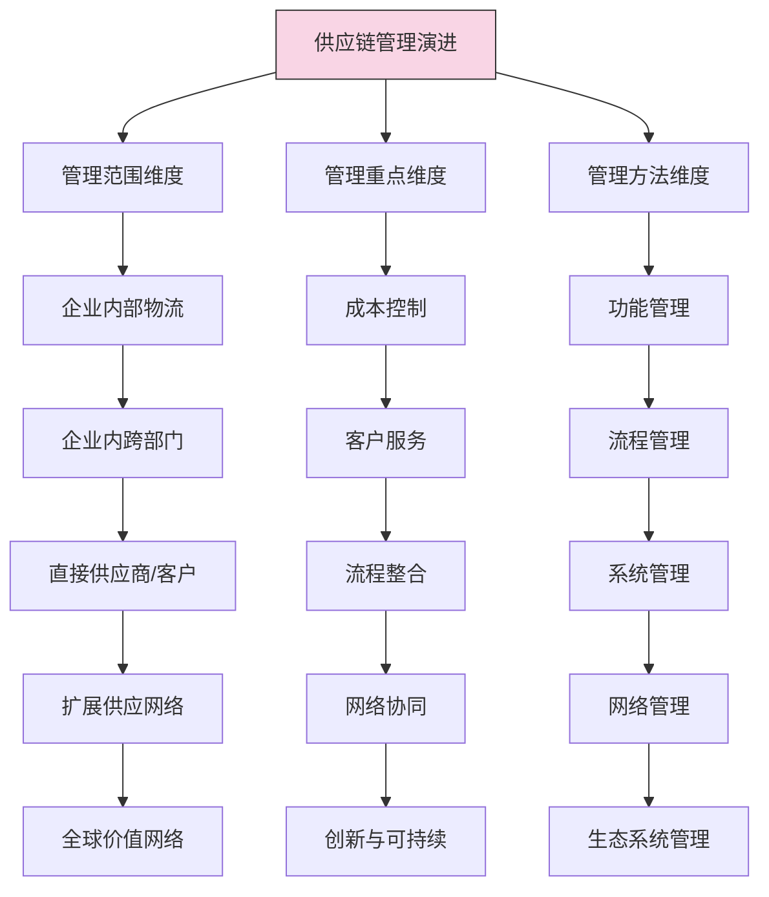
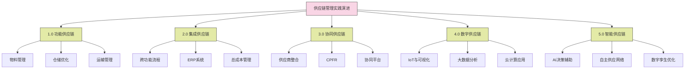

---
{"dg-publish":true,"tags":["供应链","供应链管理","历史演变","发展阶段","管理理念"],"创建日期":"2024-04-26","permalink":"/知识共享/003_供应链/01_供应链基础/01_学习内容/01_供应链基础概念/1.2 供应链管理演进史/","dgPassFrontmatter":true}
---

供应链管理作为一门学科和管理实践，经历了数十年的演变和发展，从简单的物流管理发展成为当今整合战略、运营和技术的综合管理体系。本文将系统梳理供应链管理的发展历程、重要理论突破和实践创新，揭示其演进规律和未来趋势。

## 基础知识

### 供应链管理发展的历史阶段

供应链管理的发展可以划分为以下几个关键阶段：

1. **前供应链时代(1950-1970年代)**：
   - **物流管理时期**：关注点在仓储、运输等物流功能的优化
   - **物料需求计划(MRP)时期**：开始关注生产计划和物料管理的系统化
   - **主要特点**：职能分散管理，缺乏整合视角，以成本控制为主要目标
   - **代表性实践**：科学管理方法应用于物流管理，仓储标准化

2. **供应链概念形成阶段(1970-1980年代)**：
   - **集成物流管理时期**：开始整合企业内部物流功能
   - **供应链术语出现**：1982年，顾问Keith Oliver在英国《金融时报》的一篇文章中首次提出"供应链"概念
   - **主要特点**：开始从系统角度看待供应、生产和分销活动
   - **代表性实践**：物流部门整合，物流成本总体优化

3. **供应链管理初步发展阶段(1990年代初-中期)**：
   - **供应链管理概念普及**：从学术界到企业界开始广泛接受SCM概念
   - **流程再造运动**：企业流程再造强调跨部门流程优化
   - **主要特点**：开始关注企业内部跨部门协作，建立初步的供应链框架
   - **代表性实践**：ERP系统的广泛应用，准时制(JIT)生产模式扩展

4. **供应链管理成熟阶段(1990年代后期-2000年代初)**：
   - **跨企业供应链整合**：从企业内部扩展到企业间协作
   - **SCOR模型建立**：1996年成立的供应链管理委员会(SCC)发布供应链运营参考模型
   - **主要特点**：强调供应链作为竞争优势的来源，建立供应链管理标准和框架
   - **代表性实践**：供应商管理库存(VMI)，协同规划预测与补货(CPFR)

5. **全球供应链网络阶段(2000年代中期-2010年代初)**：
   - **全球化供应链**：供应链全球扩展，复杂性显著增加
   - **供应链风险管理兴起**：2008年金融危机后，风险管理成为焦点
   - **主要特点**：关注全球网络优化，供应链弹性和敏捷性
   - **代表性实践**：全球采购策略，多层次供应网络设计

6. **数字供应链阶段(2010年代-现在)**：
   - **技术驱动变革**：大数据、云计算、IoT、AI等技术深度应用
   - **供应链可视化**：端到端供应链透明度和实时可视化
   - **主要特点**：数据驱动决策，供应链自动化和智能化
   - **代表性实践**：供应链数字孪生，预测性分析，自动化物流

7. **可持续与弹性供应链阶段(2020年起)**：
   - **后疫情时代**：COVID-19疫情催化供应链重大变革
   - **可持续发展**：环境、社会责任成为供应链关键维度
   - **主要特点**：平衡效率与弹性，区域化与本地化，可持续性
   - **代表性实践**：多源供应策略，循环供应链，碳中和供应链

### 关键理论发展里程碑

供应链管理的发展伴随着多项理论突破和概念创新：

1. **物料需求计划(MRP)**：
   - 发展时间：1960年代
   - 核心思想：基于主生产计划，计算物料需求的时间和数量
   - 贡献者：Joseph Orlicky，Oliver Wight
   - 影响：为生产计划和物料管理提供系统化方法

2. **制造资源计划(MRP II)**：
   - 发展时间：1980年代
   - 核心思想：扩展MRP，整合生产、财务、销售等功能
   - 贡献者：Oliver Wight
   - 影响：促进了企业资源跨部门整合管理

3. **准时制生产(JIT)**：
   - 发展时间：1970-1980年代
   - 核心思想：消除浪费，只在需要的时间生产需要的数量
   - 贡献者：丰田公司，大野耐一
   - 影响：重塑了生产和供应链思维，强调精益理念

4. **企业资源规划(ERP)**：
   - 发展时间：1990年代
   - 核心思想：整合企业所有资源、信息和活动的管理系统
   - 贡献者：SAP，Oracle等软件公司
   - 影响：为供应链信息整合提供技术平台

5. **供应链运营参考模型(SCOR)**：
   - 发展时间：1996年
   - 核心思想：提供标准化的供应链流程描述、绩效指标和最佳实践
   - 贡献者：供应链管理委员会(后并入APICS)
   - 影响：建立了供应链管理的共同语言和标准框架

6. **协同规划、预测与补货(CPFR)**：
   - 发展时间：1990年代末
   - 核心思想：供应链合作伙伴共同进行规划和预测，协调补货决策
   - 贡献者：VICS协会，沃尔玛和华纳-兰伯特最早实践
   - 影响：促进了供应链伙伴间的紧密协作和信息共享

7. **供应链集成理论**：
   - 发展时间：2000年代
   - 核心思想：内部集成和外部集成相结合，实现供应链协同
   - 贡献者：Stevens, Frohlich, Westbrook等学者
   - 影响：提供了理解供应链整合机制和价值的框架

8. **三重底线与可持续供应链**：
   - 发展时间：2010年代
   - 核心思想：供应链管理需平衡经济、环境和社会三大目标
   - 贡献者：John Elkington(三重底线概念)，多位学者发展应用于供应链
   - 影响：推动了可持续发展理念融入供应链管理实践

9. **供应链弹性理论**：
   - 发展时间：2010年代后期
   - 核心思想：供应链设计和管理需兼顾效率与抗风险能力
   - 贡献者：Sheffi, Christopher, Peck等学者
   - 影响：改变了传统仅注重效率的供应链思维

### 影响供应链管理发展的关键因素

多种外部因素推动了供应链管理的演进：

1. **经济全球化**：
   - 全球贸易自由化促进了供应链全球扩展
   - 跨国公司增长推动了全球供应网络的形成
   - 新兴市场崛起创造了新的供应和需求中心

2. **信息技术发展**：
   - 计算机技术使大规模数据处理和复杂计算成为可能
   - 互联网技术实现了实时信息共享和远程协作
   - 新一代数字技术(IoT, AI, 区块链)推动供应链智能化

3. **商业环境变化**：
   - 市场竞争加剧促使企业寻求供应链竞争优势
   - 消费者需求个性化和快速响应要求提高
   - 产品生命周期缩短要求更敏捷的供应链

4. **重大危机与挑战**：
   - 自然灾害(如2011年日本地震)暴露供应链脆弱性
   - 2008年金融危机促进了供应链风险管理发展
   - COVID-19疫情引发供应链弹性与本地化思考

5. **可持续发展压力**：
   - 环境保护意识提高影响供应链设计和运营
   - 社会责任要求扩展到整个供应链
   - 法规要求推动合规和可持续实践

## 理论框架

### 供应链管理演进的阶段模型

供应链管理的发展可以通过以下理论框架来理解：

这一框架展示了供应链管理在三个关键维度的演进路径：管理范围从企业内部扩展到全球网络，管理重点从成本控制扩展到创新与可持续，管理方法从功能管理发展到生态系统管理。

### 供应链管理范式转变

供应链管理在发展过程中经历了几次重要的范式转变：

每一次范式转变都扩展了供应链管理的边界和深度：
- **物流管理→供应链管理**：从关注物流功能到整合供应、生产和配送
- **供应链管理→供应网络**：从线性链条到复杂网络关系
- **供应网络→数字供应链**：从物理运作到数据驱动和智能决策
- **数字供应链→可持续供应链**：从效率和响应到平衡经济、环境和社会价值

### 供应链管理理论基础演进

供应链管理的理论基础也随时间不断丰富：

| 时期 | 主导理论 | 核心观点 | 主要贡献 |
|------|---------|---------|---------|
| **1970-1980s** | 系统论 | 供应链作为相互关联的系统，整体优化优于局部优化 | 奠定了整体思考的基础 |
| **1980-1990s** | 交易成本理论 | 分析"制造vs购买"决策，优化供应链边界 | 解释了供应链结构选择 |
| **1990-2000s** | 核心竞争力理论 | 聚焦核心能力，外包非核心活动 | 推动了战略外包和专业化 |
| **2000-2010s** | 资源依赖理论 | 管理组织间相互依赖关系，平衡权力 | 促进了供应商关系管理 |
| **2010s至今** | 网络理论 | 分析网络结构和关系对供应链绩效的影响 | 支持复杂供应网络管理 |
| **最新发展** | 复杂适应系统理论 | 供应链作为自适应、自组织的复杂系统 | 支持动态环境下的供应链管理 |

### 供应链管理实践演进框架

以下框架展示了供应链管理实践的演进：

该框架概述了供应链管理实践从功能分散(1.0)到高度智能化(5.0)的演进过程，每个阶段都有其代表性的管理实践和支持技术。

## 应用指南

### 如何利用供应链管理演进知识指导实践

深入理解供应链管理的发展历程，可以帮助企业更好地规划和实施供应链管理：

1. **供应链成熟度评估**：
   - 根据供应链演进模型，评估企业当前供应链管理成熟度所处阶段
   - 对标行业最佳实践，识别当前差距和提升空间
   - 制定合适的供应链发展路径和优先级

2. **供应链转型规划**：
   - 采用阶段性发展视角，避免跳跃式变革带来的风险
   - 结合企业实际情况，确定合适的供应链管理模式和技术
   - 设计平稳过渡策略，确保转型过程中的业务连续性

3. **供应链技术选择**：
   - 根据企业所处发展阶段，选择适合的技术解决方案
   - 避免技术过度超前或滞后于管理能力
   - 确保技术投资与业务需求和组织能力匹配

4. **人才能力发展**：
   - 了解不同发展阶段所需的供应链专业能力
   - 针对性培养与企业发展阶段匹配的人才队伍
   - 建立持续学习机制，跟踪供应链管理最新发展

### 供应链管理进化的方法论

实现供应链管理进化的系统方法包括：

1. **诊断与基准定位**：
   - 全面评估现有供应链绩效和成熟度
   - 与行业标杆进行对比分析
   - 识别核心差距和改进机会

2. **愿景与战略制定**：
   - 明确供应链管理的战略目标
   - 设定中长期供应链发展愿景
   - 确保供应链战略与业务战略一致

3. **路线图设计**：
   - 设计分阶段的供应链发展路线图
   - 确定关键里程碑和成功指标
   - 平衡短期收益与长期发展

4. **变革管理与实施**：
   - 建立变革管理框架，解决组织阻力
   - 采用敏捷方法进行试点和推广
   - 持续沟通和利益相关者管理

5. **评估与优化**：
   - 定期评估进展和成效
   - 根据实施情况调整计划
   - 形成持续改进机制

### 供应链历史经验的应用

从供应链管理的历史经验中，企业可以借鉴以下关键启示：

1. **整合的价值**：
   - 历史经验表明，供应链整合创造的价值远超独立优化
   - 应用：优先关注跨功能和跨组织的流程整合

2. **信息共享的重要性**：
   - 信息技术始终是供应链发展的关键驱动力
   - 应用：投资于信息系统和数据共享平台，提高可视性

3. **平衡效率与弹性**：
   - 历史危机事件表明，过度追求效率会降低供应链韧性
   - 应用：在设计供应链时，同时考虑成本效率和风险应对能力

4. **循序渐进的转型**：
   - 成功的供应链变革通常是渐进式而非革命式的
   - 应用：采用小步快跑的方式，持续改进供应链能力

5. **技术赋能而非技术主导**：
   - 技术应服务于供应链战略，而非反之
   - 应用：先明确业务需求，再选择合适的技术解决方案

### 不同行业供应链管理演进差异

不同行业由于业务特点和市场环境的差异，供应链管理的演进路径和重点也有所不同：

| 行业 | 演进重点 | 代表性实践 | 当前发展趋势 |
|------|---------|-----------|------------|
| **制造业** | 从功能优化到端到端集成 | 精益生产、JIT、敏捷制造 | 智能制造、工业4.0 |
| **零售业** | 从库存驱动到需求驱动 | ECR、CPFR、全渠道整合 | 全渠道无缝体验、即时配送 |
| **高科技** | 从预测驱动到响应驱动 | 推延策略、模块化、快速响应 | 订制化、数字孪生 |
| **汽车** | 从垂直整合到生态系统 | 模块化采购、JIS(准时化供货) | 电动化、智能化供应链 |
| **医药** | 从合规驱动到患者中心 | 严格追溯、冷链管理 | 精准医疗供应链、患者直达 |
| **快消品** | 从批量到持续补货 | VMI、连续补货计划 | 直接面向消费者、预测性补充 |

## 案例分析

### 案例1：丰田生产系统的演进与全球影响

**背景**：
丰田生产系统(TPS)是20世纪供应链管理最具影响力的创新之一，对全球制造业和供应链管理实践产生了深远影响。

**关键发展阶段**：
- **1950-1960年代**：大野耐一开发TPS基础，包括准时制(JIT)和自动化
- **1970年代**：石油危机后，TPS以节约资源和消除浪费的理念受到广泛关注
- **1980年代**：西方企业开始学习和采用丰田模式，精益生产概念广泛传播
- **1990年代**：TPS原则扩展到供应链管理，推动供应商同步发展
- **2000年代至今**：TPS理念进一步融合数字技术，发展成为精益数字供应链

**核心创新与实践**：
- **看板系统**：通过可视化卡片实现拉动式生产和物料补充
- **供应商一体化**：将供应商纳入同一生产节奏，实现同步生产
- **持续改进**：通过"改善"小组持续优化供应链流程
- **标准化工作**：建立最佳实践并持续完善
- **问题可视化**：通过安灯系统，立即暴露问题并解决

**影响与启示**：
- TPS代表了从大批量生产到精益生产的范式转变
- 证明了整合供应商和制造商可以创造共赢价值
- 展示了供应链原则如何从一个行业扩展到其他行业
- 说明文化和管理理念对供应链实践的重要影响
- 揭示了简单但严格执行的系统可以创造卓越成果

### 案例2：沃尔玛供应链管理的演进与创新

**背景**：
沃尔玛的供应链管理实践随着企业从区域零售商到全球零售巨头的发展不断演进，代表了零售业供应链管理的发展轨迹。

**关键发展阶段**：
- **1970-1980年代**：建立集中配送模式，减少对批发商依赖
- **1980年代末-1990年代**：开创跨码头配送(Cross-Docking)模式
- **1990年代中-2000年代初**：推行零售商-供应商合作系统(Retail Link)
- **2000年代中-2010年代**：发展全球采购网络和RFID应用
- **2010年代至今**：构建全渠道供应链和数字化转型

**核心创新与实践**：
- **数据共享革命**：与供应商共享POS数据，提高预测准确性
- **供应商合作关系**：从对抗式转向战略合作关系
- **物流创新**：跨码头配送减少库存和处理成本
- **全球采购策略**：直接从生产国采购，降低供应链层级
- **技术应用**：从早期EDI到现代区块链和AI应用

**影响与启示**：
- 零售商可以主导供应链并创造竞争优势
- 信息共享和透明度是现代供应链的关键驱动力
- 规模经济与供应链效率的紧密关系
- 技术可以作为供应链创新的强大催化剂
- 供应链战略必须随市场和技术变化而演进

### 案例3：从纵向整合到虚拟整合——Dell的供应链演进

**背景**：
Dell公司在1990年代创造了计算机行业的直销模式和革命性供应链模式，后来又随着市场变化进行了多次调整，代表了供应链如何随业务模式演进。

**关键发展阶段**：
- **1990年代初**：建立直销模式，消除中间商
- **1990年代中-2000年代初**：完善直接模式，打造"零库存"供应链
- **2000年代中期**：面对市场变化，开始转向混合渠道模式
- **2010年代**：从公众公司转为私有，供应链深度调整
- **2010年代末至今**：重新聚焦企业IT解决方案，供应链战略再调整

**核心创新与实践**：
- **零库存模式**：订单驱动生产，最小化成品库存
- **供应商同步**：供应商在Dell工厂附近设立分拨中心
- **虚拟整合**：与供应商建立紧密合作关系而无需所有权
- **延迟差异化**：最后阶段完成产品配置，提高灵活性
- **信息技术应用**：早期采用互联网开展B2C业务

**影响与启示**：
- 供应链模式必须与业务模式紧密匹配
- 成功的供应链模式也需要随市场变化而调整
- 信息技术可以创造全新的供应链模式
- 虚拟整合可以替代传统的纵向整合
- 组织灵活性对供应链转型的重要性

### 案例4：亚马逊——从在线书店到供应链创新领导者

**背景**：
亚马逊从1994年的在线书店发展成为全球电商和云服务巨头，其供应链管理的演进代表了数字经济时代供应链创新的方向。

**关键发展阶段**：
- **1994-2000年**：建立基础电商物流模式
- **2000-2005年**：扩展产品线，完善物流网络
- **2005-2010年**：推出Prime会员服务，加强配送速度
- **2010-2015年**：大规模仓库自动化，收购Kiva Systems
- **2015年至今**：全面推进全渠道战略，包括实体零售和生鲜配送

**核心创新与实践**：
- **履单中心网络**：科学设计的多层级配送网络
- **预测性库存调配**：基于数据分析将商品前置到客户附近
- **物流自动化**：大规模应用机器人和自动化系统
- **最后一公里创新**：众包配送、自提柜、无人机等多种模式
- **全渠道整合**：线上线下无缝结合，如Whole Foods和Amazon Go

**影响与启示**：
- 数据和算法可以成为供应链核心竞争力
- 客户体验是现代供应链设计的核心驱动力
- 技术投资可以创造长期供应链优势
- 供应链创新可以打破行业边界
- 速度和便利性成为消费者的核心期望

### 案例5：苹果公司——从外包生产到供应链掌控

**背景**：
苹果公司的供应链管理经历了从简单OEM外包到高度掌控的全球供应链的转变，展示了供应链如何支持产品创新和品牌价值。

**关键发展阶段**：
- **1990年代**：简单的生产外包模式
- **2000-2005年**：iPod推出后开始更多关注供应链
- **2007-2012年**：iPhone推出，建立紧密控制的全球供应链
- **2012-2018年**：Tim Cook时代，供应链成为核心竞争力
- **2018年至今**：应对贸易摩擦和疫情，供应链多元化调整

**核心创新与实践**：
- **战略组件控制**：关键技术和组件自主设计
- **供应商关系管理**：大额预付款锁定产能，建立排他性合作
- **材料与工艺创新**：推动供应商开发新材料和工艺
- **纵向半整合**：不拥有工厂但紧密控制生产过程
- **端到端供应链设计**：从产品设计初期就考虑供应链因素

**影响与启示**：
- 供应链可以成为产品创新的使能因素
- 战略性控制关键环节而非全部拥有
- 财务实力可以转化为供应链优势
- 设计和供应链协同创造更大价值
- 品牌价值与供应链能力的紧密关系

## 延伸内容

### 供应链管理未来发展趋势

供应链管理领域正在经历多项重要变革，未来发展趋势包括：

1. **供应链网络重构**：
   - 从高度全球化向区域化和本地化平衡发展
   - 供应基地多元化，减少对单一来源依赖
   - "中国+1"或"中国+N"策略的广泛应用
   - 友岸外包(friend-shoring)和近岸外包(near-shoring)增加

2. **数字供应链加速**：
   - 供应链数字孪生技术广泛应用
   - 端到端供应链可视化成为标准
   - 人工智能在预测、规划和优化中的深度应用
   - 物联网和5G实现供应链全程实时监控

3. **可持续供应链主流化**：
   - ESG要求融入供应链决策核心
   - 供应链碳足迹测量和减排成为标准实践
   - 循环供应链模式取代线性供应链
   - 社会责任延伸至供应链各层级

4. **自主供应链兴起**：
   - 人工智能驱动的自动决策增加
   - 机器人和自动化技术在物流环节广泛应用
   - 自动驾驶和无人配送技术商业化
   - 自适应供应链能力提升

5. **供应链商业模式创新**：
   - 即服务型供应链(Supply Chain as a Service)兴起
   - 平台型供应链生态系统取代传统线性供应链
   - 共享供应链资源模式扩展
   - 供应链金融与物流深度融合

### 学科交叉与供应链管理的发展

供应链管理的发展越来越依赖多学科交叉，未来将进一步融合多领域知识：

1. **数据科学与供应链**：
   - 预测分析提高规划准确性
   - 机器学习优化复杂决策
   - 高级分析处理非结构化供应链数据
   - 大数据技术处理海量供应链信息

2. **行为科学与供应链**：
   - 理解供应链决策者的认知偏差
   - 供应链协作的心理和组织因素
   - 供应链冲突管理与协商理论
   - 跨文化供应链管理

3. **可持续发展与供应链**：
   - 环境科学指导低碳供应链设计
   - 社会学视角下的供应链社会影响
   - 循环经济原则应用于供应链
   - 供应链能源转型与可再生能源应用

4. **金融学与供应链**：
   - 供应链风险定价模型
   - 区块链支持的供应链金融创新
   - 供应链投资决策优化
   - 金融工具在供应链风险管理中的应用

5. **复杂系统理论与供应链**：
   - 供应链作为复杂适应系统的建模
   - 网络科学分析供应链结构
   - 涌现现象在供应链中的应用
   - 复杂环境下的供应链弹性机制

### 地区差异与供应链管理演进

不同地区的供应链管理发展路径表现出明显的差异特点：

| 地区 | 发展特点 | 代表性实践 | 区域贡献 |
|------|---------|-----------|---------|
| **北美** | 技术驱动、市场导向 | 供应链整合、跨企业协作 | SCOR模型、CPFR标准 |
| **欧洲** | 合作导向、可持续发展 | 合作物流、绿色供应链 | 循环经济、可持续标准 |
| **日本** | 精益思想、关系重视 | TPS、看板系统、JIT | 精益生产、持续改进 |
| **中国** | 速度与规模、数字创新 | 电商物流、快速响应 | 数字供应链、大规模个性化 |
| **印度** | 服务创新、低成本模式 | IT外包供应链、包容性商业模式 | 服务型供应链、草根创新 |
| **东南亚** | 制造基地、区域整合 | 区域供应网络、多国协同 | 区域生产网络、多元化 |

### 供应链管理演进的批判性思考

供应链管理的发展过程中，也存在一些值得反思的议题：

1. **效率与韧性的权衡**：
   - 过度追求效率可能导致供应链脆弱性增加
   - COVID-19疫情暴露了全球供应链的脆弱性
   - 如何在效率和韧性之间找到平衡点？

2. **技术与人的关系**：
   - 技术进步导致供应链工作性质改变
   - 自动化技术对就业市场的冲击
   - 如何平衡技术应用与人才发展？

3. **全球化与环境可持续性**：
   - 全球供应链扩张增加了碳足迹
   - 长距离运输对环境影响显著
   - 如何实现经济全球化与环境保护的协调？

4. **供应链权力结构问题**：
   - 大企业在供应链中的主导地位
   - 发达国家与发展中国家在供应链中的不平等关系
   - 如何构建更公平的供应链生态系统？

5. **标准化与多样化的矛盾**：
   - 全球标准推动效率但可能忽视本地特色
   - 文化差异对供应链管理实践的影响
   - 如何平衡全球化与本地化的需求？

## 学习资源

### 思考问题

1. 供应链管理的概念经历了怎样的演变？这种演变反映了企业管理思维的哪些变化？

2. 为什么物流管理发展到一定阶段必然会向供应链管理转变？这一转变的内在逻辑是什么？

3. 信息技术在供应链管理演进中扮演了什么角色？举例说明关键技术如何改变了供应链实践。

4. 比较分析丰田和戴尔的供应链模式，它们各自反映了供应链管理发展的哪些特征？

5. 全球化如何影响了供应链管理的发展？全球化的不同阶段对供应链管理提出了哪些不同挑战？

6. 2008年金融危机和2020年COVID-19疫情分别对供应链管理理念产生了什么影响？这些危机如何改变了企业的供应链战略？

7. 供应链管理发展的下一个重大范式转变可能是什么？哪些因素将驱动这一转变？

8. 评估数字技术对未来供应链管理的影响。人工智能、区块链等技术将如何重塑供应链运作模式？

9. 从系统论角度分析供应链管理的演进过程，为什么整体视角和系统思维对现代供应链管理至关重要？

10. 可持续发展要求将如何改变传统的供应链管理实践？企业需要采取哪些措施以适应这一趋势？

11. 供应链管理的本土化与全球化如何平衡？不同国家和地区对供应链管理理论有哪些独特贡献？

12. 供应链管理思想的演进对其他学科领域(如市场营销、产品开发)产生了哪些影响？

13. 评估当前供应链管理教育和实践之间的差距。学术界如何更好地支持供应链管理的未来发展？

14. 供应链4.0概念意味着什么？它与之前的供应链管理范式有哪些本质区别？

15. 预测未来十年供应链管理的三个最重要发展趋势，并分析其对企业竞争力的潜在影响。

### 实践练习

**练习1：供应链管理成熟度评估**

目标：学习如何评估企业供应链管理的成熟度水平，并制定发展路径。

步骤：
1. 选择一个你熟悉的企业或案例
2. 基于供应链管理演进模型，设计简化的成熟度评估框架，包括5-7个维度
3. 对选定企业在各维度上的成熟度进行评估(1-5分)
4. 分析不同维度间的平衡性，识别关键差距
5. 提出有针对性的供应链管理提升建议，包括短期和长期行动

成果展示：
- 供应链成熟度评估报告
- 成熟度雷达图
- 差距分析和原因探讨
- 分阶段发展路线图

**练习2：供应链管理重大创新分析**

目标：深入分析供应链管理领域的一项重大创新，理解其历史背景、应用影响和未来潜力。

步骤：
1. 选择一项供应链管理重大创新(如JIT、VMI、CPFR、数字孪生等)
2. 研究该创新的起源背景和理论基础
3. 分析其在行业中的应用历程和演变过程
4. 评估该创新对供应链实践的影响和局限性
5. 探讨该创新在未来供应链中的发展方向

成果展示：
- 创新技术/概念详细报告
- 应用案例分析(至少3个案例)
- 创新传播和演化时间线
- 创新影响评估框架
- 未来发展预测

### 参考资源

**书籍**:
- Christopher, M. (2016). *Logistics & Supply Chain Management* (5th ed.). FT Publishing.
- Simchi-Levi, D., Kaminsky, P., & Simchi-Levi, E. (2021). *Designing and Managing the Supply Chain: Concepts, Strategies, and Case Studies* (4th ed.). McGraw-Hill Education.
- Mentzer, J. T. (Ed.). (2001). *Supply Chain Management*. Sage Publications.
- Bowersox, D. J., Closs, D. J., & Cooper, M. B. (2002). *Supply Chain Logistics Management*. McGraw-Hill.
- Stadtler, H., & Kilger, C. (Eds.). (2014). *Supply Chain Management and Advanced Planning* (5th ed.). Springer.

**学术文章**:
- Cooper, M. C., Lambert, D. M., & Pagh, J. D. (1997). "Supply Chain Management: More Than a New Name for Logistics". The International Journal of Logistics Management, 8(1), 1-14.
- Frohlich, M. T., & Westbrook, R. (2001). "Arcs of integration: an international study of supply chain strategies". Journal of Operations Management, 19(2), 185-200.
- Lee, H. L., Padmanabhan, V., & Whang, S. (1997). "The bullwhip effect in supply chains". Sloan Management Review, 38(3), 93-102.
- Mentzer, J. T., DeWitt, W., Keebler, J. S., Min, S., Nix, N. W., Smith, C. D., & Zacharia, Z. G. (2001). "Defining supply chain management". Journal of Business Logistics, 22(2), 1-25.
- Stevens, G. C. (1989). "Integrating the supply chain". International Journal of Physical Distribution & Materials Management, 19(8), 3-8.

**在线资源**:
- Supply Chain Management Review: [www.scmr.com](http://www.scmr.com)
- Council of Supply Chain Management Professionals: [www.cscmp.org](http://www.cscmp.org)
- Supply Chain Digital: [www.supplychaindigital.com](http://www.supplychaindigital.com)
- MIT Center for Transportation & Logistics: [ctl.mit.edu](http://ctl.mit.edu)
- Supply Chain Brain: [www.supplychainbrain.com](http://www.supplychainbrain.com)

**视频课程**:
- MIT OpenCourseWare: "Supply Chain Management" [ocw.mit.edu](https://ocw.mit.edu/courses/supply-chain-management/)
- edX: "Supply Chain Analytics" by MITx
- Coursera: "Supply Chain Management Specialization" by Rutgers University
- LinkedIn Learning: "Supply Chain Foundations"

**期刊**:
- Journal of Supply Chain Management
- Supply Chain Management: An International Journal
- International Journal of Physical Distribution & Logistics Management
- Journal of Business Logistics
- International Journal of Logistics Management 