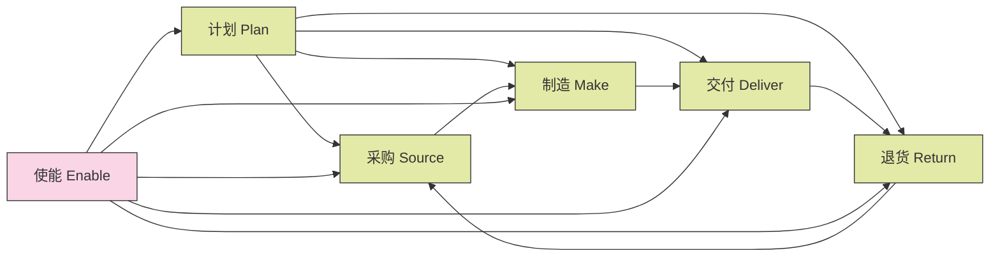
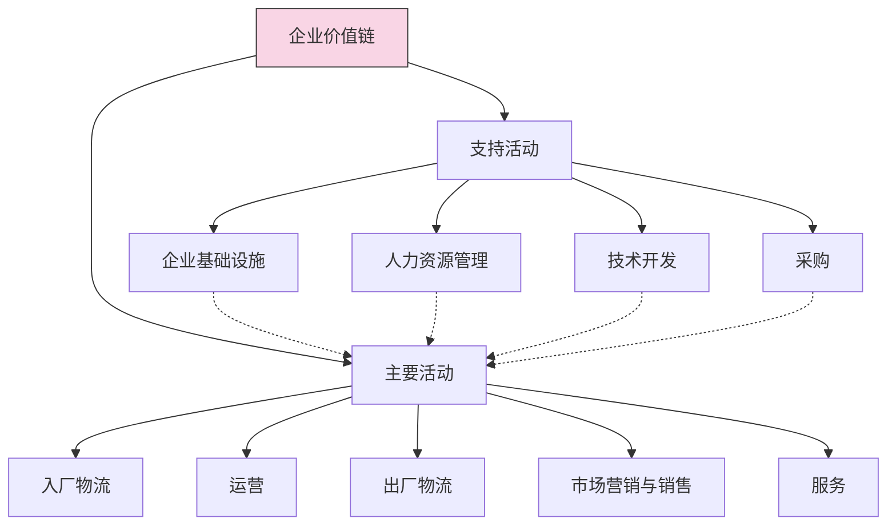
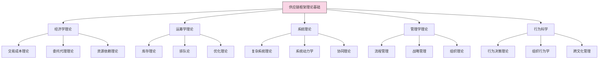
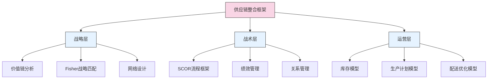
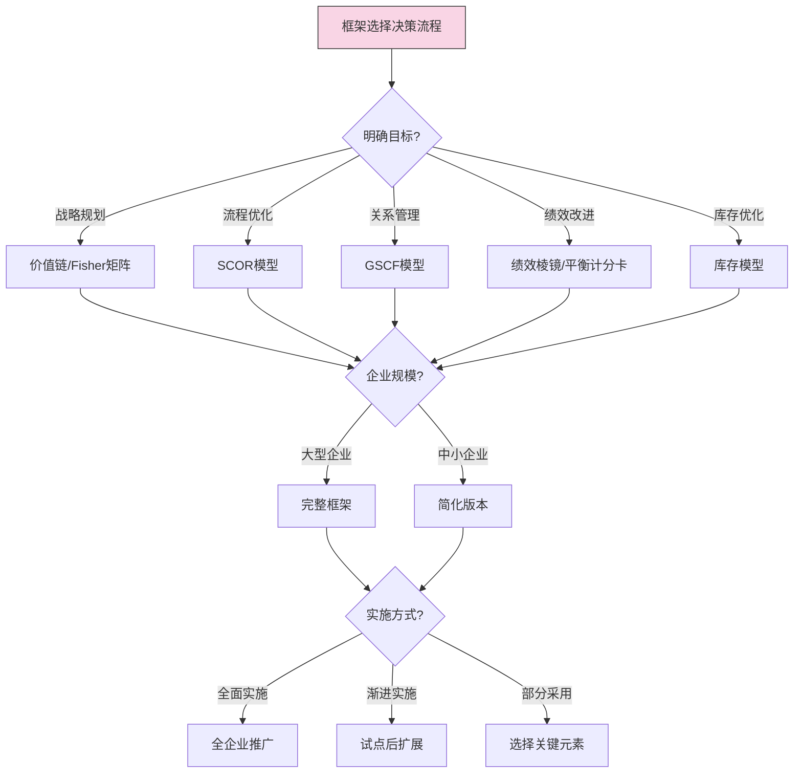

---
{"dg-publish":true,"tags":["供应链","理论框架","SCOR模型","价值链模型","供应链设计"],"创建日期":"2024-04-26","permalink":"/知识共享/003_供应链/01_供应链基础/01_学习内容/01_供应链基础概念/1.3 供应链框架与模型/","dgPassFrontmatter":true}
---


供应链框架与模型是理解、分析和优化供应链的结构化工具，帮助企业系统化地看待供应链活动，明确各环节间的关系，评估绩效并持续改进。本文将系统介绍主要的供应链理论框架和分析模型，及其在供应链管理实践中的应用。

## 基础知识

### 供应链框架的重要性

供应链框架与模型在供应链管理中起着至关重要的作用：

1. **提供通用语言**：建立统一的概念体系和术语，便于供应链各方沟通
2. **系统化思考**：帮助管理者从整体视角看待复杂的供应链系统
3. **明确最佳实践**：提供行业标准和最佳实践参考
4. **支持分析决策**：为供应链分析和优化提供结构化方法
5. **绩效评估基础**：提供衡量供应链绩效的标准框架
6. **指导改进方向**：识别供应链中的差距和改进机会

### 主要供应链框架类型

供应链领域的框架和模型可以分为以下几类：

1. **描述性框架**：描述供应链的结构、组成和关系
   - 例如：供应链网络结构模型、SCOR模型

2. **战略性框架**：指导供应链战略规划和设计
   - 例如：Fisher's供应链矩阵、价值链模型

3. **分析性框架**：支持具体供应链问题的分析
   - 例如：库存模型、运输优化模型

4. **流程框架**：定义和标准化供应链流程
   - 例如：SCOR流程框架、GSCF模型

5. **绩效框架**：评估供应链绩效和成熟度
   - 例如：平衡计分卡、供应链绩效棱镜

6. **动态框架**：分析供应链系统动态行为
   - 例如：Beer Game、牛鞭效应模型

### SCOR模型 - 供应链运营参考模型

SCOR(Supply Chain Operations Reference)模型是由供应链管理委员会(SCC，现已并入ASCM)开发的最广泛采用的供应链参考模型。

#### SCOR模型的核心组成

SCOR模型包含四个主要组成部分：

1. **流程(Process)**：定义了6个关键管理流程
   - 计划(Plan)
   - 采购(Source)
   - 制造(Make)
   - 交付(Deliver)
   - 退货(Return)
   - 使能(Enable)

2. **绩效(Performance)**：包含五个关键绩效维度
   - 可靠性(Reliability)
   - 响应性(Responsiveness)
   - 敏捷性(Agility)
   - 成本(Cost)
   - 资产管理效率(Asset Management Efficiency)

3. **实践(Practices)**：提供行业最佳实践库
   - 新兴实践
   - 最佳实践
   - 标准实践

4. **人员(People)**：定义供应链所需技能和能力
   - 技能标准
   - 经验级别
   - 能力培养

#### SCOR流程层级结构

SCOR模型将供应链流程分为四个层级：

1. **第1层 - 流程类型**：定义6个核心管理流程(计划、采购、制造、交付、退货、使能)
2. **第2层 - 流程类别**：区分不同的流程配置(如按库存生产、按订单生产)
3. **第3层 - 流程要素**：详细流程步骤、输入输出和绩效指标
4. **第4层 - 实施**：企业特定的实践和系统(SCOR不包含此层，由企业自定义)

#### SCOR流程示意图



### 价值链模型

价值链模型由Michael Porter在1985年提出，虽然最初不是专门为供应链设计，但已成为理解企业如何创造价值的重要框架，对供应链管理有深远影响。

#### 价值链的核心概念

价值链模型将企业活动分为两大类：

1. **主要活动**：直接参与产品创造和交付的活动
   - 入厂物流(Inbound Logistics)
   - 运营(Operations)
   - 出厂物流(Outbound Logistics)
   - 市场营销与销售(Marketing & Sales)
   - 服务(Service)

2. **支持活动**：支持主要活动的功能
   - 企业基础设施(Firm Infrastructure)
   - 人力资源管理(Human Resource Management)
   - 技术开发(Technology Development)
   - 采购(Procurement)

#### 价值链与供应链的关系

- 价值链关注单个企业如何创造价值
- 供应链扩展到多个企业间的价值创造
- 现代观点认为，供应链是多个企业价值链的连接 

#### 价值链图示



### GSCF模型 - 全球供应链论坛模型

全球供应链论坛(Global Supply Chain Forum)模型由The Ohio State University的Douglas Lambert教授开发，提供了一个针对企业间关系管理的供应链框架。

#### GSCF模型的核心组成

GSCF模型包含三个主要元素：

1. **供应链网络结构**：确定供应链中的关键成员，包括:
   - 主要成员：直接参与价值创造的企业
   - 支持成员：提供资源、知识和资产的企业

2. **供应链业务流程**：八个跨企业的关键流程：
   - 客户关系管理
   - 客户服务管理
   - 需求管理
   - 订单履行
   - 制造流程管理
   - 供应商关系管理
   - 产品开发与商业化
   - 退货管理

3. **供应链管理组件**：支持业务流程的管理要素：
   - 计划与控制方法
   - 工作结构
   - 组织结构
   - 产品流设施结构
   - 信息流设施
   - 管理方法
   - 权力与领导结构
   - 风险与回报结构
   - 文化与态度

#### GSCF与SCOR的比较

| 特点 | SCOR模型 | GSCF模型 |
|------|---------|---------|
| **开发机构** | 供应链管理委员会(SCC) | 俄亥俄州立大学 |
| **主要目标** | 标准化流程和绩效度量 | 企业间关系和流程管理 |
| **流程焦点** | 交易导向，运营效率 | 关系导向，战略整合 |
| **主要优势** | 详细的流程映射和指标 | 战略视角和关系管理 |
| **适用场景** | 供应链运营优化 | 供应链战略和合作伙伴关系 |
| **流程数量** | 6个核心流程 | 8个业务流程 |
| **采用程度** | 广泛采用，行业标准 | 学术界认可，实践中较少直接应用 |

### Fisher的供应链战略模型

Marshall Fisher在1997年提出的模型是供应链战略规划的经典框架，强调供应链战略应匹配产品特性。

#### 核心概念

Fisher模型将产品分为两类：

1. **功能型产品**：
   - 稳定需求
   - 长生命周期
   - 低利润率
   - 低需求不确定性
   - 例如：基本日用品、食品、文具

2. **创新型产品**：
   - 不稳定需求
   - 短生命周期
   - 高利润率
   - 高需求不确定性
   - 例如：时尚服装、高科技电子产品

相应地，供应链战略也分为两类：

1. **高效型供应链**：
   - 主要目标：最小化成本
   - 关注点：规模经济、资源利用率
   - 特点：高库存周转率，低安全库存
   - 适合：功能型产品

2. **响应型供应链**：
   - 主要目标：快速响应市场变化
   - 关注点：灵活性、交货速度
   - 特点：剩余产能，战略库存
   - 适合：创新型产品

#### Fisher矩阵

```
┌────────────────┬────────────────┬────────────────┐
│                │  功能型产品    │  创新型产品    │
├────────────────┼────────────────┼────────────────┤
│                │                │                │
│  高效型供应链  │      匹配      │     错配       │
│                │                │                │
├────────────────┼────────────────┼────────────────┤
│                │                │                │
│  响应型供应链  │      错配      │     匹配       │
│                │                │                │
└────────────────┴────────────────┴────────────────┘
```

### 其他重要供应链框架与模型

#### 1. 库存管理模型

供应链中的库存管理依靠多种理论模型，主要包括：

- **经济订货量(EOQ)模型**：
  - 平衡订货成本和持有成本，确定最优订货量
  - 公式：EOQ = √(2DS/H)，其中D为需求量，S为订货成本，H为持有成本率

- **安全库存模型**：
  - 应对需求和供应不确定性的缓冲库存
  - 公式：SS = Z × σ × √LT，其中Z为服务水平系数，σ为需求标准差，LT为提前期

- **(s,Q)/(s,S)模型**：
  - 连续检查的库存控制模型
  - 库存水平低于再订货点s时，补充固定数量Q或补充至目标水平S

- **(R,S)模型**：
  - 周期检查的库存控制模型
  - 每隔固定时间R检查，补充至目标水平S

#### 2. 绩效棱镜模型

由英国克兰菲尔德大学开发的供应链绩效评估框架，包含五个关联方面：

1. **来源满意度(Source Satisfaction)**：评估供应方对供应链的满意程度
2. **内部效率(Internal Efficiency)**：评估资源利用效率
3. **流程集成(Process Integration)**：评估跨职能流程协同程度
4. **客户满意度(Customer Satisfaction)**：评估客户对供应链的满意程度
5. **持续改进(Continuous Improvement)**：评估供应链学习和发展能力

#### 3. 六步供应链设计框架

由斯坦福大学开发的供应链网络设计方法论：

1. **明确业务目标**：确定供应链应支持的业务战略
2. **确定供应链战略**：选择效率导向或响应导向的供应链策略
3. **设计供应链网络结构**：确定设施布局和物流网络
4. **设计流程与关系**：确定供应链流程和合作伙伴关系
5. **确定管理结构**：建立供应链治理和决策机制
6. **确定绩效指标**：建立监控供应链绩效的指标体系

#### 4. 牛鞭效应模型

描述供应链中需求信息沿链传递过程中波动被放大的现象：

- **主要原因**：需求预测更新、订单批量、价格波动、短缺博弈
- **缓解方法**：信息共享、VMI、CPFR、需求预测改进、缩短前置期


## 理论框架

### 供应链框架的理论基础

供应链框架和模型建立在多学科理论基础上：



### 供应链框架的功能维度

供应链框架可以从不同功能维度进行分类和理解：

| 功能维度 | 主要关注点 | 代表框架/模型 | 应用场景 |
|---------|----------|-------------|---------|
| **战略规划** | 供应链总体架构和战略定位 | Fisher矩阵、价值链模型 | 供应链战略制定、网络设计 |
| **流程定义** | 标准化流程和职责 | SCOR模型、GSCF模型 | 流程重组、标准化 |
| **绩效管理** | 供应链表现评估和对标 | 平衡计分卡、绩效棱镜 | 绩效评估、持续改进 |
| **关系管理** | 供应链伙伴关系治理 | GSCF关系模型、协作框架 | 伙伴选择、协作机制 |
| **风险管理** | 供应链风险识别和应对 | 弹性供应链模型、SCRM框架 | 风险评估、连续性规划 |
| **技术应用** | 技术在供应链中的应用 | 数字供应链模型、工业4.0框架 | 技术选择、数字化转型 |

### 供应链框架的整合视图

在实践中，不同供应链框架通常需要整合应用，以下是一个整合视图：



### 供应链框架适用性分析

不同供应链框架在不同行业和企业规模的适用性：

| 框架/模型 | 大型企业 | 中小型企业 | 制造业 | 零售业 | 服务业 | 全球化程度 |
|-----------|--------|-----------|-------|-------|-------|----------|
| **SCOR模型** | ★★★★★ | ★★★ | ★★★★★ | ★★★★ | ★★★ | ★★★★★ |
| **GSCF模型** | ★★★★★ | ★★ | ★★★★ | ★★★★ | ★★★ | ★★★★★ |
| **价值链模型** | ★★★★ | ★★★★ | ★★★★★ | ★★★★ | ★★★★ | ★★★★ |
| **Fisher矩阵** | ★★★★ | ★★★ | ★★★★ | ★★★★★ | ★★ | ★★★★ |
| **库存模型** | ★★★★ | ★★★★★ | ★★★★★ | ★★★★★ | ★★ | ★★★ |
| **绩效棱镜** | ★★★★ | ★★★ | ★★★★ | ★★★★ | ★★★★ | ★★★★ |
| **牛鞭效应模型** | ★★★★★ | ★★★ | ★★★★★ | ★★★★★ | ★★ | ★★★★★ |
```

## 应用指南

### 供应链框架选择方法论

选择合适的供应链框架或模型需要考虑多种因素，以下是系统性的选择步骤：

1. **明确应用目的**：
   - 确定使用框架的具体目标(如流程优化、战略规划、绩效评估等)
   - 确定期望的输出和结果类型
   - 考虑时间和资源限制

2. **评估企业情况**：
   - 分析企业规模、行业特点和供应链复杂度
   - 考虑企业文化和变革接受度
   - 评估现有数据和系统支持能力

3. **框架评估与选择**：
   - 对比多个潜在框架的适用性
   - 考虑框架的成熟度和行业接受度
   - 评估实施复杂度和所需资源

4. **定制与本地化**：
   - 根据企业具体情况调整框架
   - 确定需要保留的核心元素和可调整元素
   - 与现有企业系统和流程整合



### 供应链框架实施步骤

无论选择何种框架，实施过程通常包括以下关键步骤：

1. **准备阶段**：
   - 获取高层支持和资源承诺
   - 组建跨职能实施团队
   - 制定详细实施计划和时间表
   - 进行必要的培训和知识传授

2. **诊断阶段**：
   - 评估当前供应链状况
   - 与框架标准进行对比分析
   - 识别差距和改进机会
   - 确定优先改进领域

3. **设计阶段**：
   - 根据框架设计未来状态流程
   - 定义新的组织结构和职责
   - 确定所需的系统和技术支持
   - 制定绩效测量标准

4. **实施阶段**：
   - 按优先级实施变革项目
   - 调整组织结构和工作流程
   - 更新系统和技术支持
   - 实施新的绩效测量方法

5. **评估与改进阶段**：
   - 监控实施效果
   - 收集反馈并调整实施方法
   - 培训和辅导团队成员
   - 制度化最佳实践

### 框架应用常见挑战与解决方案

| 挑战 | 表现形式 | 解决方案 |
|------|---------|----------|
| **复杂度过高** | 框架太复杂导致理解困难 | 分阶段实施，从核心元素开始 |
| **缺乏高层支持** | 资源不足，优先级低 | 提供商业案例，展示具体收益 |
| **组织抵抗** | 员工抗拒新流程和方法 | 加强沟通，提供培训，示范成功 |
| **数据质量问题** | 所需数据不可用或不准确 | 制定数据治理策略，逐步提高数据质量 |
| **缺乏专业知识** | 团队缺乏实施框架的能力 | 引入外部专家，开展知识转移 |
| **过度标准化** | 忽略业务特殊性 | 平衡标准化与灵活性，允许适度定制 |
| **实施半途而废** | 初期热情后动力不足 | 设定明确里程碑，庆祝短期成功 |
| **绩效改进不明显** | 难以量化框架实施效益 | 建立基准数据，设置明确的KPI |

### 框架应用的行业差异化

各行业应用供应链框架时需要考虑的差异化因素：

1. **制造业**：
   - 关注生产计划与物料流
   - SCOR模型高度适用
   - 需强调库存优化和生产效率

2. **零售业**：
   - 关注需求响应和全渠道整合
   - Fisher模型高度相关
   - 需强调预测准确性和库存部署

3. **高科技行业**：
   - 关注产品创新和快速上市
   - 需要高度敏捷的供应链模型
   - 强调弹性和风险管理

4. **医药与医疗行业**：
   - 关注合规性和可追溯性
   - 需强调质量控制和供应链安全
   - 冷链管理和有效期管理重要

5. **食品与快消品行业**：
   - 关注产品新鲜度和周转速度
   - 需强调需求响应和配送网络优化
   - 季节性和促销影响显著

## 案例分析

### 案例1：宝洁公司应用SCOR模型优化全球供应链

**背景**：
宝洁公司(P&G)作为全球最大的消费品公司之一，面临全球300多个品牌、数万种产品的复杂供应链管理挑战。

**挑战**：
- 全球供应网络复杂，地区差异大
- 库存水平高，响应速度慢
- 成本压力增加，需提高效率
- 难以建立一致的绩效衡量标准

**SCOR模型应用**：
1. **流程标准化**：
   - 采用SCOR流程参考模型标准化全球供应链流程
   - 建立统一的流程命名和描述体系
   - 确定各流程的标准输入输出和关键接口

2. **绩效指标体系**：
   - 实施SCOR绩效指标层级框架
   - 设立统一的KPI定义和计算方法
   - 建立全球绩效看板和对标机制

3. **最佳实践推广**：
   - 识别SCOR最佳实践与内部最佳实践
   - 建立知识共享平台和实践社区
   - 实施跨区域最佳实践推广计划

**实施过程**：
- 第一阶段：流程映射和差距分析（6个月）
- 第二阶段：标准流程设计和试点（12个月）
- 第三阶段：全球推广和系统支持（18个月）
- 第四阶段：持续改进和优化（持续）

**成果**：
- 建立了全球统一的供应链语言和流程框架
- 库存减少15%，同时服务水平提高3个百分点
- 供应链成本降低约7%
- 区域间绩效差异显著减少
- 实现了最佳实践的快速识别和推广

**关键经验**：
- 高层领导支持是成功关键
- 平衡全球标准化与区域灵活性至关重要
- 将框架与IT系统整合提高执行效率
- 变革管理和能力建设是实施成功的保障

### 案例2：戴尔电脑应用价值链模型构建直销供应链

**背景**：
戴尔电脑以其独特的直销模式革新了计算机行业的供应链模式，价值链模型是其业务模式设计的理论基础。

**挑战**：
- 传统电脑行业库存高，产品更新快
- 分销渠道增加成本，延长交付时间
- 客户个性化需求难以满足
- 行业利润率持续下降

**价值链模型应用**：
1. **价值链重构**：
   - 分析传统电脑行业价值链的非增值环节
   - 识别和消除不必要的中间环节(分销商、零售商)
   - 重新配置企业资源，聚焦核心价值活动

2. **直接客户关系**：
   - 建立直接面向客户的销售和服务体系
   - 收集第一手客户数据，深入理解需求
   - 提供个性化配置服务创造差异化价值

3. **供应商整合**：
   - 与关键供应商建立战略合作关系
   - 实现高度信息共享和同步计划
   - 建立供应商中心模式提高响应速度

**实施过程**：
- 建立直销模式和订单驱动生产系统
- 发展线上销售渠道和配置系统
- 构建与供应商的紧密协作机制
- 优化整个端到端价值链的信息流

**成果**：
- 库存周转天数降至4-5天，远低于行业平均水平
- 资金占用大幅减少，现金转换周期转为负值
- 实现高度个性化产品同时保持低成本
- 建立了难以复制的供应链竞争优势

**关键经验**：
- 价值链创新可以改变整个行业竞争格局
- 直接客户关系是价值创造的重要源泉
- 信息技术是价值链重构的关键推动力
- 虚拟整合可以替代传统的垂直整合

### 案例3：亚马逊应用库存模型和响应型供应链

**背景**：
亚马逊作为全球最大的在线零售商，管理着数百万SKU和全球配送网络，需要高效的库存管理和响应型供应链。

**挑战**：
- 极为广泛的产品组合，SKU数量庞大
- 需求高度波动，季节性明显
- 客户对快速交付期望不断提高
- 库存成本与服务水平的平衡困难

**框架应用**：
1. **ABC-XYZ分类与Fisher矩阵**：
   - 对产品进行价值和需求波动性分类
   - 根据Fisher矩阵为不同产品类别设计差异化供应链策略
   - 为高价值创新产品(AZ类)建立高响应供应链

2. **高级库存模型**：
   - 应用(s,S)库存政策管理高值波动产品
   - 为稳定需求产品建立自动补货系统
   - 使用预测性分析提前调整库存位置

3. **多层级库存网络设计**：
   - 构建集中式和分散式混合库存模型
   - 前置热销产品到区域配送中心
   - 应用库存池化原则降低总体库存需求

**实施过程**：
- 建立数据分析和产品分类系统
- 开发动态库存分配算法
- 基于需求预测和服务水平设计物流网络
- 持续优化库存参数和策略

**成果**：
- 库存周转率提高约25%
- 配送时间缩短50%以上
- 同时维持较低库存水平和高服务水平
- 建立了预测性库存管理能力

**关键经验**：
- 数据分析是现代库存管理的核心
- 库存策略必须与产品特性和市场需求匹配
- 先进算法可实现服务与成本的更优平衡
- 前置库存和靠近客户是快速响应的关键

### 案例4：丰田公司应用供应链整合框架

**背景**：
丰田汽车的供应链管理被视为精益生产和供应链协同的典范，其成功依赖于多种供应链框架的整合应用。

**挑战**：
- 复杂的多层供应商网络
- 全球市场多样化需求
- 高质量与低成本的平衡
- 持续改进的文化建设

**框架整合应用**：
1. **价值流图**：
   - 应用价值流分析识别并消除供应链中的浪费
   - 建立从供应商到客户的端到端价值流图
   - 优化跨组织流程和信息流

2. **看板系统与JIT**：
   - 建立基于拉动式生产的看板控制系统
   - 实现精确的需求传递和物料补充
   - 最小化库存和中间缓冲

3. **SCOR流程框架**：
   - 采用SCOR流程定义供应链管理流程
   - 建立标准化的供应链绩效指标体系
   - 推广最佳实践到全球工厂

4. **供应商整合模型**：
   - 建立分层供应商管理体系
   - 与核心供应商协同开发和持续改进
   - 构建协作学习网络促进知识共享

**实施过程**：
- 源自丰田生产方式(TPS)的长期演进
- 供应链原则和实践的标准化和文档化
- 通过培训和实践将方法论推广到全球
- 持续改进的PDCA循环应用

**成果**：
- 建立了全球标杆的精益供应链体系
- 持续实现行业领先的质量和成本控制
- 极高的供应链弹性和响应能力
- 建立了基于持续改进的学习型组织

**关键经验**：
- 多种框架的整合应用优于单一框架
- 供应链文化和理念比工具本身更重要
- 长期伙伴关系是供应链协作的基础
- 标准化与持续改进相辅相成

### 案例5：联合利华应用GSCF模型管理全球供应链关系

**背景**：
联合利华作为全球快消品巨头，拥有400多个品牌和复杂的全球供应链网络，需要高效的供应链关系管理。

**挑战**：
- 全球数千家供应商的管理复杂性
- 不同地区市场环境和文化差异
- 可持续发展与商业目标的平衡
- 供应链合作伙伴间的协同难度

**GSCF模型应用**：
1. **供应链网络结构管理**：
   - 明确供应链核心成员和支持成员
   - 建立分级供应商管理体系
   - 优化供应网络结构提高整体效率

2. **关键业务流程管理**：
   - 实施GSCF八大业务流程框架
   - 重点关注客户关系管理和供应商关系管理
   - 建立跨企业流程管理和协同机制

3. **管理组件整合**：
   - 建立共享价值观和协作文化
   - 设计公平的风险和收益分享机制
   - 建立供应链关系绩效评估体系

**实施过程**：
- 从战略合作伙伴关系试点开始
- 逐步扩展到更广泛的供应链成员
- 建立供应商发展和能力建设项目
- 发展技术平台支持跨企业协作

**成果**：
- 供应链响应速度提高30%
- 库存和运营成本显著降低
- 持续创新能力增强，新品上市周期缩短
- 建立了可持续的供应链伙伴生态系统

**关键经验**：
- 供应链关系管理需要战略视角
- 合作伙伴间共同价值创造是关键
- 明确的治理机制和期望管理很重要
- 关系投资需要长期视角和耐心

## 延伸内容

### 新兴供应链框架

随着商业环境和技术的变化，供应链框架也在不断演进：

1. **数字供应链模型（DSC Model）**：
   - 整合物理供应链和数字信息流
   - 关注端到端可视化和智能决策
   - 利用物联网、大数据和AI技术
   - 特点：实时信息流、预测性分析、自动化决策

2. **循环供应链框架（Circular Supply Chain）**：
   - 基于循环经济原则设计
   - 将废弃物转化为资源，减少环境影响
   - 重新定义价值流向和生产模式
   - 特点：产品生命周期延长、材料循环利用、逆向物流

3. **弹性供应链模型（Resilient Supply Chain）**：
   - 聚焦供应链应对干扰的能力
   - 平衡效率与抗风险能力
   - 关注风险识别、预防和响应
   - 特点：冗余设计、可视化监控、快速恢复能力

4. **平台型供应链框架（Platform Supply Chain）**：
   - 基于生态系统而非线性链条
   - 多方共享资源和能力
   - 数据作为核心价值驱动要素
   - 特点：网络效应、开放协作、即插即用模块化

### 框架整合与定制化趋势

实践中的趋势是框架的整合和定制化应用：

1. **行业特定框架**：
   - 医疗供应链参考模型（HSCRM）
   - 零售业全渠道供应链框架
   - 高科技行业敏捷供应链模型

2. **综合应用多框架**：
   - SCOR操作层面 + Fisher战略层面
   - 价值链分析 + 绩效棱镜评估
   - 库存模型 + 弹性供应链思想

3. **框架轻量化**：
   - 简化复杂框架，提取核心原则
   - 灵活应用而非僵化实施
   - 关注具体问题解决而非全面遵循

### 框架与技术融合

现代供应链框架越来越多地与新技术紧密融合：

| 技术 | 对供应链框架的影响 | 实例 |
|------|-----------------|------|
| **区块链** | 提高透明度，简化交易验证 | IBM Food Trust基于SCOR的可追溯框架 |
| **人工智能** | 增强预测能力，优化决策 | 智能库存管理模型，需求预测高级算法 |
| **物联网** | 实时数据采集，端到端可视化 | 数字孪生供应链，连接物理流和信息流 |
| **云计算** | 促进协作，提高灵活性 | 基于云的供应链协作平台，共享服务模型 |
| **高级分析** | 从描述性到预测性和规范性 | 预测性维护模型，多维场景规划工具 |
| **机器人流程自动化** | 流程标准化和自动化 | 自动执行的流程框架，减少人工干预 |

## 学习资源

### 思考问题

1. SCOR模型和GSCF模型在供应链管理中各有什么特点和适用场景？如何选择合适的框架？

2. 价值链理论如何帮助企业识别供应链中的竞争优势来源？请结合实际案例分析。

3. Fisher的供应链战略矩阵中的"匹配"和"错配"对企业绩效有何影响？为什么高效型供应链不适合创新型产品？

4. 牛鞭效应是如何产生的？供应链管理者应如何利用现代框架和技术减轻这一现象？

5. 评估不同行业应用供应链框架的差异性。为什么同一框架在不同行业中的应用效果会有所不同？

6. 对于中小型企业，如何简化和调整大型供应链框架以适应其资源和能力限制？

7. 比较分析传统供应链框架和新兴数字供应链模型的主要区别。数字技术如何改变了框架的设计和应用？

8. 供应链框架实施过程中最常见的三个挑战是什么？如何克服这些挑战？

9. 可持续发展趋势如何影响传统的供应链框架设计？循环供应链框架带来了哪些新的思考角度？

10. 如何评估供应链框架实施的成功程度？设计一个评估方法来衡量框架应用的有效性。

11. 比较分析戴尔和丰田的供应链框架应用，为什么两者采用不同的方法但都取得了成功？

12. 在全球化背景下，供应链框架如何适应不同地区的文化和商业环境差异？请给出具体建议。

### 实践练习

**练习1：框架选择与应用**

目标：学习如何为特定企业情境选择和应用适当的供应链框架。

步骤：
1. 选择一个你熟悉的企业或案例研究
2. 分析企业的产品特性、市场需求和运营环境
3. 评估至少三种供应链框架的适用性
4. 为该企业推荐最合适的框架组合
5. 设计高级别实施路线图，包括阶段划分和预期成果

成果展示：
- 企业供应链现状分析报告
- 框架适用性评估矩阵
- 推荐框架及选择理由
- 实施路线图和关键里程碑
- 预期效益分析

**练习2：SCOR模型应用**

目标：掌握SCOR模型的实际应用方法，学习如何使用该框架分析和改进供应链流程。

步骤：
1. 选择一个具体的供应链流程(如订单履行或采购)
2. 使用SCOR模型第2级和第3级元素详细映射该流程
3. 确定适用的SCOR绩效指标并收集相关数据
4. 与SCOR标准或行业基准进行对比分析
5. 识别改进机会并提出优化建议

成果展示：
- SCOR流程映射图
- 绩效指标分析表
- 对标分析结果
- 优先改进领域清单
- 三项核心改进建议详细说明

**练习3：供应链框架整合设计**

目标：培养跨框架整合思维，学习如何结合多种框架的优势解决复杂供应链问题。

步骤：
1. 确定一个复杂的供应链挑战(如全渠道库存管理或全球网络优化)
2. 分析问题的不同维度和需要解决的核心问题
3. 从战略、战术和运营层面确定相关框架
4. 设计一个整合框架，充分利用各个框架的优势
5. 开发应用该整合框架的实施方法

成果展示：
- 问题分析报告
- 框架整合架构图
- 关键组件说明
- 应用流程和方法论
- 案例应用示例

### 参考资源

**书籍**:
- Lambert, D. M. (2014). Supply Chain Management: Processes, Partnerships, Performance. Supply Chain Management Institute.
- Cohen, S., & Roussel, J. (2013). Strategic Supply Chain Management: The Five Core Disciplines for Top Performance. McGraw-Hill.
- Bolstorff, P., & Rosenbaum, R. (2012). Supply Chain Excellence: A Handbook for Dramatic Improvement Using the SCOR Model. AMACOM.
- Christopher, M. (2016). Logistics & Supply Chain Management (5th ed.). Pearson.
- Monczka, R. M., Handfield, R. B., Giunipero, L. C., & Patterson, J. L. (2020). Purchasing and Supply Chain Management (7th ed.). Cengage Learning.

**学术文章**:
- Fisher, M. L. (1997). "What is the Right Supply Chain for Your Product?" Harvard Business Review, 75(2), 105-116.
- Ellram, L. M., & Cooper, M. C. (2014). "Supply Chain Management: It's All About the Journey, Not the Destination." Journal of Supply Chain Management, 50(1), 8-20.
- Lee, H. L. (2004). "The Triple-A Supply Chain." Harvard Business Review, 82(10), 102-112.
- Gunasekaran, A., Patel, C., & McGaughey, R. E. (2004). "A Framework for Supply Chain Performance Measurement." International Journal of Production Economics, 87(3), 333-347.
- Christopher, M., & Towill, D. R. (2002). "Developing Market Specific Supply Chain Strategies." The International Journal of Logistics Management, 13(1), 1-14.

**在线资源**:
- ASCM (前身为APICS): [www.ascm.org](http://www.ascm.org) - SCOR模型和供应链最佳实践
- Supply Chain Council: [www.supply-chain.org](http://www.supply-chain.org) - 供应链框架和标准
- Council of Supply Chain Management Professionals: [www.cscmp.org](http://www.cscmp.org) - 研究和教育资源
- MIT Center for Transportation & Logistics: [ctl.mit.edu](http://ctl.mit.edu) - 先进供应链研究和案例
- Gartner Supply Chain Research: [www.gartner.com/en/supply-chain](http://www.gartner.com/en/supply-chain) - 供应链趋势分析

**视频课程**:
- edX: "Supply Chain Fundamentals" by MITx
- Coursera: "Supply Chain Management Specialization" by Rutgers University
- YouTube: APICS SCOR模型系列讲解
- LinkedIn Learning: "Supply Chain Foundations"

**实践工具**:
- SCOR模型工具包
- 供应链设计软件(如LLamasoft, anyLogistix)
- 供应链分析模板(Excel)
- 流程建模工具(如Visio, Lucidchart)
- 供应链成熟度评估工具