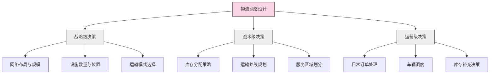

---
{"dg-publish":true,"tags":["供应链","物流网络","配送中心","网络优化","战略规划"],"创建日期":"2024-04-27","permalink":"/知识共享/003_供应链/01_供应链基础/01_学习内容/05_物流与配送/5.1 物流网络设计/","dgPassFrontmatter":true}
---

物流网络是企业供应链的核心骨架，它决定了产品从供应商到客户的流动路径和效率。合理的物流网络设计能够显著降低企业的物流成本，提升客户服务水平，并为企业创造持续的竞争优势。

## 基础知识

### 物流网络的定义

物流网络是指企业为满足客户需求而设计的物流设施（如工厂、仓库、配送中心）及其之间连接（如运输路线）的整体架构。不同学者和机构对物流网络的定义略有不同：

- **美国供应链管理专业协会(CSCMP)**：物流网络是指供应链中物理设施的空间分布及其相互关系，这些设施负责物料的存储、处理和运输。

- **Chopra & Meindl**：物流网络是供应链中所有设施的集合，这些设施共同完成产品的生产和交付功能。

- **Simchi-Levi等**：物流网络包括供应商、生产设施、仓库、配送中心和零售商等节点，以及连接这些节点的运输路线。

物流网络的核心要素包括：

1. **节点**：物流设施，如工厂、仓库、配送中心、中转站和零售点
2. **链接**：连接节点的运输路线和方式
3. **流量**：在网络中流动的货物数量和频率
4. **能力**：各节点的处理能力和存储容量

### 物流网络的历史演变

物流网络设计的理念和方法随着商业环境和技术的变化而不断演进：

- **1950-1970年代**：以成本最小化为主要目标，注重仓储和运输效率
- **1980-1990年代**：关注客户服务水平，发展全球物流网络
- **2000年代初**：强调供应链整合和协同，注重信息系统支持
- **2010年代**：关注网络弹性和风险管理，应对全球不确定性
- **现代趋势**：数字化转型，可持续发展，全渠道整合，以及个性化定制服务

### 物流网络的类型

根据结构和功能特点，物流网络可分为多种类型：

1. **直接配送网络**：从供应源直接发货到客户，无中间仓储环节
2. **中心辐射型网络**：通过中央仓库或配送中心向各地客户配送
3. **多级分销网络**：包含中央仓库、区域配送中心和本地配送点
4. **交叉配送网络**：通过中转站快速转运货物，减少存储环节
5. **混合网络**：结合多种网络类型的特点，针对不同产品或客户采用不同配送策略

## 理论框架

### 物流网络设计模型

物流网络设计通常基于以下理论模型和框架：

物流网络设计的核心目标是在成本和服务水平之间找到最佳平衡点。主要考虑因素包括：

1. **战略目标**：企业的市场定位、增长战略和竞争策略
2. **成本因素**：包括固定设施成本、运输成本、库存成本和运营成本
3. **服务要求**：响应时间、可靠性、灵活性和产品可用性
4. **约束条件**：预算限制、容量限制、服务水平要求和法规要求

### 物流网络优化方法

物流网络优化通常采用以下方法：

1. **数学规划模型**：
   - 线性规划
   - 混合整数规划
   - 非线性规划

2. **模拟优化方法**：
   - 离散事件模拟
   - 蒙特卡洛模拟
   - 代理模型

3. **启发式算法**：
   - 遗传算法
   - 蚁群算法
   - 禁忌搜索

4. **多目标决策方法**：
   - 层次分析法(AHP)
   - 模糊综合评价
   - 目标规划

## 应用指南

### 物流网络设计流程

物流网络设计通常遵循以下系统化流程：

1. **需求分析**
   - 收集和分析客户分布数据
   - 预测未来需求变化
   - 确定服务水平要求

2. **数据收集与准备**
   - 物流成本数据（运输、仓储、人工等）
   - 潜在设施地点信息
   - 运输时间和距离矩阵
   - 现有网络绩效数据

3. **方案开发**
   - 确定可行的网络结构
   - 选择适当的设施位置和规模
   - 分配客户到服务设施

4. **方案评估**
   - 成本分析（总物流成本）
   - 服务水平评估（响应时间、订单满足率）
   - 敏感性分析（对关键假设的测试）
   - 风险评估（对不确定性的应对能力）

5. **方案实施**
   - 制定实施计划和时间表
   - 资源配置和组织调整
   - 系统整合和培训
   - 变更管理

6. **监控与优化**
   - 设定关键绩效指标(KPIs)
   - 持续评估网络绩效
   - 根据环境变化调整网络

### 物流网络决策工具

设计物流网络时可使用多种分析工具：

1. **重心法**：确定单一配送中心的最佳位置
2. **设施选址模型**：确定多个设施的最佳位置
3. **网络流优化**：优化网络中的物料流动
4. **运输模型**：优化运输路线和模式
5. **仿真软件**：模拟不同网络设计的运行状况
6. **GIS系统**：地理信息系统辅助网络规划
7. **商业软件**：如Supply Chain Guru、LLamasoft、AnyLogic等

### 常见物流网络优化策略

1. **网络合理化**：
   - 优化设施数量和位置
   - 调整设施规模和功能定位
   - 合并或关闭效率低下的设施

2. **运输优化**：
   - 选择合适的运输模式组合
   - 实施运输合并和多式联运
   - 优化配送路线和频率

3. **库存优化**：
   - 实施多级库存策略
   - 采用集中与分散相结合的库存布局
   - 基于需求特性差异化库存策略

4. **服务分区**：
   - 基于响应时间要求划分服务区域
   - 为不同客户群设计差异化服务网络
   - 实施动态服务分区调整

## 案例分析

### 案例1：亚马逊的全球物流网络

**背景**：亚马逊作为全球最大的电子商务公司，其物流网络是其成功的关键。

**策略**：
- 多层次物流网络：包括大型履行中心、中型分拣中心、小型配送站和最后一公里配送点
- 前置库存策略：将常用商品前置到靠近消费者的位置
- 高度自动化：大规模应用机器人技术和自动化设备
- 数据驱动决策：利用大数据和AI优化库存分配和配送路线

**成效**：
- 显著缩短配送时间，实现次日甚至当日送达
- 降低每单物流成本，提高运营效率
- 提升客户满意度和复购率
- 创造了强大的竞争壁垒

### 案例2：沃尔玛的全渠道物流网络转型

**背景**：面对电商竞争，沃尔玛进行了物流网络转型，支持线上线下一体化服务。

**策略**：
- 将部分实体店改造为区域配送中心，支持线上订单履行
- 开发店内取货(Click & Collect)服务
- 建立专门的电商履行中心，处理长尾商品
- 整合供应商网络，实现直发模式(Drop-shipping)

**成效**：
- 充分利用现有店铺网络，降低物流成本
- 提供更便捷的全渠道购物体验
- 缩短电商订单配送时间
- 有效应对亚马逊等纯电商竞争对手

### 案例3：可口可乐的饮料配送网络优化

**背景**：可口可乐需要高效配送大量低价值、高体积的饮料产品。

**策略**：
- 建立三级配送网络：生产工厂、区域配送中心和本地装瓶厂
- 实施供应商管理库存(VMI)模式
- 优化配送路线和频率，降低空载率
- 与零售商合作，实施共同配送计划

**成效**：
- 减少库存总量，提高周转率
- 降低运输成本，减少碳排放
- 提高货架可用性，减少缺货
- 增强与零售伙伴的协作关系

### 案例4：DHL的全球网络重构

**背景**：作为全球领先的物流企业，DHL需要应对全球贸易模式变化和新兴市场增长。

**策略**：
- 重新设计全球枢纽网络，增强区域间连接
- 调整设施布局，增加新兴市场覆盖
- 升级技术基础设施，提升网络可视性
- 开发灵活的多式联运解决方案

**成效**：
- 缩短全球主要贸易路线的运输时间
- 提高网络弹性，减少中断风险
- 优化资源利用，提高设施使用率
- 增强对小批量、高频次配送的支持能力

### 案例5：联合利华的市场响应型供应链

**背景**：消费品巨头联合利华需要应对不同市场的多样化需求和频繁变化的消费趋势。

**策略**：
- 建立区域制造中心，接近主要市场
- 差异化物流网络设计：成熟市场注重效率，新兴市场注重灵活性
- 实施混合库存策略：集中管理低需求波动产品，分散管理高波动产品
- 开发敏捷响应系统，快速调整生产和配送计划

**成效**：
- 减少库存总量，同时提高产品可用性
- 缩短新产品上市时间，提高市场响应速度
- 降低总物流成本，提高资产回报率
- 增强对本地市场需求变化的适应能力

## 延伸内容

### 物流网络与企业战略的协同

物流网络设计必须与企业整体战略保持一致：

1. **成本领先战略**：设计高效、精简的物流网络，最大限度降低物流成本
2. **差异化战略**：设计响应迅速、服务卓越的物流网络，提供独特客户体验
3. **聚焦战略**：为特定市场或客户群设计专门的物流解决方案

物流网络还需要支持企业的不同增长模式：

- **地理扩张**：设计可扩展的物流网络，支持新市场进入
- **产品线扩展**：设计灵活的物流网络，适应不同产品特性
- **渠道整合**：设计全渠道物流网络，支持多渠道销售和服务

### 数字技术在物流网络设计中的应用

新兴技术正在改变物流网络设计的方法和可能性：

1. **大数据分析**：利用海量数据优化网络设计和运营决策
2. **人工智能**：应用机器学习预测需求模式和优化资源分配
3. **物联网(IoT)**：通过实时跟踪提高网络可视性和响应能力
4. **区块链**：增强网络透明度和多方协作能力
5. **机器人和自动化**：改变设施内部运营和人力资源需求
6. **数字孪生**：创建物流网络的虚拟模型，进行情景分析和优化

### 可持续物流网络设计

随着环保意识的提高，可持续性成为物流网络设计的重要考量：

1. **碳足迹优化**：设计减少温室气体排放的物流网络
2. **绿色设施**：建设环保、节能的仓储和配送设施
3. **可持续运输**：优先选择低碳运输模式和技术
4. **循环物流**：设计支持产品回收和再利用的逆向物流网络
5. **包装优化**：减少包装材料使用，提高可回收性

### 物流网络弹性设计

面对全球不确定性，物流网络的弹性和韧性变得日益重要：

1. **多来源策略**：避免对单一供应来源或路线的过度依赖
2. **备份能力**：在关键节点建立备份设施或容量
3. **模块化设计**：设计可快速重组的网络结构
4. **情景规划**：为多种潜在中断情景制定应对策略
5. **早期预警系统**：建立监测网络脆弱点的机制
6. **快速恢复计划**：制定网络中断后的快速恢复流程

## 学习资源

### 思考问题

1. 在设计物流网络时，如何权衡运输成本和库存成本之间的关系？
2. 电子商务的发展如何改变了传统物流网络的设计理念？
3. 为什么有些企业选择集中化的物流网络，而其他企业可能更倾向于分散化网络？
4. 不同行业（如零售、制造、医疗）的物流网络设计有何主要差异？为什么会有这些差异？
5. 如何评估物流网络中添加新设施的经济性？
6. 季节性需求波动对物流网络设计有何影响？如何设计网络以应对这种波动？
7. 全球供应链风险（如政治风险、自然灾害）如何影响物流网络的设计决策？
8. 共享经济模式（如共享仓储、共享运输）如何改变传统物流网络设计？
9. 在进行物流网络设计时，哪些数据最为关键？如何确保这些数据的准确性？
10. 物流网络设计是一次性决策还是需要定期调整？什么因素会触发网络重新设计？
11. 如何量化评估物流网络设计对客户服务水平的影响？
12. 随着自动化和机器人技术的发展，物流设施的选址考虑因素会有哪些变化？
13. 在新兴市场建设物流网络时，需要考虑哪些与发达市场不同的因素？
14. 物流网络设计如何适应全渠道零售的需求？
15. 可持续发展目标如何影响物流网络的设计决策？

### 自测题

1. 物流网络中的"节点"主要指的是什么？
   a) 运输路线
   b) 物流设施
   c) 信息流转点
   d) 客户位置

2. 以下哪项不是物流网络设计的主要目标？
   a) 最小化总物流成本
   b) 最大化库存水平
   c) 满足客户服务要求
   d) 优化资源利用

3. 重心法主要用于解决什么问题？
   a) 确定多个设施的最佳位置
   b) 确定单个设施的最佳位置
   c) 优化运输路线
   d) 确定最佳库存水平

4. 交叉配送(Cross-docking)在物流网络中的主要作用是什么？
   a) 减少库存存储时间
   b) 增加配送频率
   c) 提高配送准确性
   d) 扩大配送范围

5. 在设计全球物流网络时，以下哪个因素最不需要考虑？
   a) 关税和贸易壁垒
   b) 汇率波动
   c) 当地消费者偏好
   d) 本地员工的学历水平

### 实践练习

**练习1：物流网络设计案例分析**

选择一家你熟悉的零售或制造企业，分析其物流网络设计：
1. 绘制该企业当前的物流网络结构图
2. 分析该网络的优势和劣势
3. 确定潜在的改进机会
4. 提出具体的优化建议，包括设施布局、运输模式和库存策略
5. 评估这些建议可能带来的成本节约和服务改进

**练习2：物流网络模拟设计**

假设你是一家正在全国扩张的电子商务企业的物流经理，需要设计全国配送网络：
1. 收集主要城市的人口和消费能力数据
2. 分析不同配送中心数量和位置的方案（最少3个方案）
3. 计算每个方案的总物流成本和平均配送时间
4. 进行敏感性分析，测试关键假设变化对结果的影响
5. 提出最终推荐方案并说明理由

### 推荐阅读

1. Chopra, S., & Meindl, P. (2021). Supply Chain Management: Strategy, Planning, and Operation (7th ed.). Pearson.
2. Simchi-Levi, D., Kaminsky, P., & Simchi-Levi, E. (2020). Designing and Managing the Supply Chain: Concepts, Strategies, and Case Studies (4th ed.). McGraw-Hill.
3. Rushton, A., Croucher, P., & Baker, P. (2017). The Handbook of Logistics and Distribution Management: Understanding the Supply Chain (6th ed.). Kogan Page.
4. Christopher, M. (2016). Logistics and Supply Chain Management (5th ed.). Financial Times/Prentice Hall.
5. Langevin, A., & Riopel, D. (Eds.). (2005). Logistics Systems: Design and Optimization. Springer. 