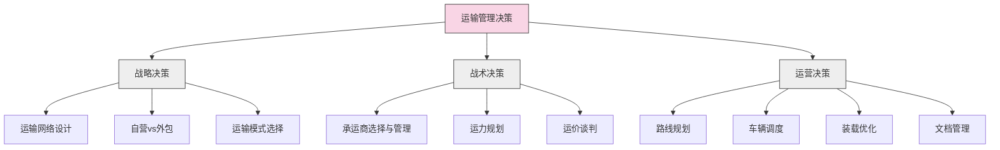
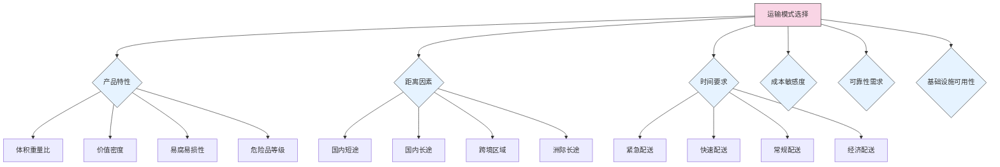

---
{"dg-publish":true,"tags":["供应链","运输管理","物流","运输模式","成本优化"],"创建日期":"2024-04-27","permalink":"/知识共享/003_供应链/01_供应链基础/01_学习内容/05_物流与配送/5.2 运输管理基础/","dgPassFrontmatter":true}
---

运输管理是物流系统的核心环节，负责规划、执行和控制商品在供应链中的高效流动。有效的运输管理不仅能降低物流成本，还能提高客户满意度，为企业创造竞争优势。本文将系统介绍运输管理的基础理论和实践应用。

## 基础知识

### 运输管理的定义与范围

运输管理是指对货物从起点到终点的移动过程进行规划、组织、协调和控制的一系列活动。它涉及多种决策，包括运输模式选择、承运商管理、路线规划、车队管理和绩效评估等。

根据不同专业机构的定义：

- **美国物流管理协会(CSCMP)**：运输管理是指对货物移动的规划、执行和控制，包括模式选择、承运商管理和运输服务采购。

- **欧洲物流协会(ELA)**：运输管理包括对各种运输资源的规划、组织、领导和控制，以确保货物安全、准时、经济地从发货地运抵目的地。

- **Bowersox & Closs**：运输管理是对货物物理移动的系统化方法，旨在平衡服务水平和成本要求。

运输管理的范围通常包括：

1. **战略层面**：运输网络设计、模式选择、自营与外包决策
2. **战术层面**：承运商选择、合同谈判、运力规划
3. **运营层面**：日常调度、装载优化、路线规划、文档管理
4. **绩效管理**：成本监控、服务评估、效率改进

### 运输的重要性

运输在供应链和整体经济中发挥着关键作用：

1. **成本影响**：运输成本通常占物流总成本的40-60%，对产品总成本有显著影响
2. **服务水平**：运输直接影响交货时间、可靠性和客户满意度
3. **地域效用**：运输创造地域效用，使产品能够在需要的地方被消费
4. **库存水平**：运输效率影响库存策略和库存水平
5. **经济发展**：运输基础设施是国家和区域经济发展的重要支撑

### 运输模式概述

主要运输模式包括：

1. **公路运输**
   - **特点**：灵活性高、门到门服务、中短距离经济
   - **优势**：可达性强、装卸次数少、发车频率高
   - **劣势**：单位成本较高、易受天气和交通影响、环境影响较大

2. **铁路运输**
   - **特点**：载重量大、长距离经济、固定线路
   - **优势**：能源效率高、批量运输成本低、安全性高
   - **劣势**：灵活性差、速度较慢、需要中转运输

3. **水路运输**
   - **特点**：载重量极大、长距离跨洋最经济
   - **优势**：大宗货物运输成本最低、环境影响小
   - **劣势**：速度慢、依赖港口设施、易受天气影响

4. **航空运输**
   - **特点**：速度最快、高价值货物适用
   - **优势**：缩短交货时间、降低高价值货物库存
   - **劣势**：成本高、容量有限、依赖机场设施

5. **管道运输**
   - **特点**：连续运输、固定路线、特定产品
   - **优势**：运营成本低、可靠性高、环境影响小
   - **劣势**：适用产品有限、初始投资大、灵活性极低

6. **多式联运**
   - **特点**：结合多种运输方式的优势
   - **优势**：优化整体运输效率和成本
   - **劣势**：协调复杂、需要标准化和信息系统支持

### 运输成本构成

运输成本通常包括以下要素：

1. **直接成本**
   - 运行成本：燃料、人工、维修保养
   - 设备成本：车辆折旧、租赁费用
   - 终端成本：装卸、分拣、包装

2. **间接成本**
   - 管理成本：调度、规划、监控
   - 信息系统成本：运输管理系统、通信设备
   - 保险和安全成本

3. **外部成本**
   - 环境成本：排放、噪音、拥堵
   - 基础设施使用成本：道路、桥梁、港口使用费

## 理论框架

### 运输决策模型

运输管理决策可以基于以下模型框架：

### 运输模式选择框架

选择合适的运输模式需要考虑多种因素：

### 运输经济学理论

运输经济学提供了理解运输成本和定价的理论基础：

1. **规模经济**：运输量增加导致单位成本下降
   - 固定成本分摊
   - 批量运输效率提升
   - 网络密度增加

2. **范围经济**：多种产品或服务共享运输资源带来成本降低
   - 双向运输减少空载
   - 多产品混合装载
   - 共享设备和管理资源

3. **距离经济**：单位距离成本随运输距离增加而递减
   - 固定终端成本分摊
   - 长途运输效率提高

4. **密度经济**：在特定区域内增加运输密度降低单位成本
   - 路线优化
   - 装载率提高
   - 运力利用率提升

## 应用指南

### 运输规划流程

有效的运输规划通常遵循以下流程：

1. **需求预测**
   - 分析历史运输数据
   - 结合销售预测估计运输需求
   - 识别季节性和周期性变化

2. **容量规划**
   - 确定所需运力
   - 平衡自有运力和外包运力
   - 考虑高峰期容量需求

3. **网络规划**
   - 设计运输路线网络
   - 确定集散中心和中转点
   - 优化运输流向

4. **模式选择**
   - 评估各种运输模式
   - 考虑多式联运组合
   - 根据货物特性和服务要求决策

5. **承运商选择**
   - 制定承运商评估标准
   - 进行招标或议价
   - 建立长期合作关系

6. **实施与监控**
   - 执行运输计划
   - 监控运输绩效
   - 持续改进和调整

### 运输成本管理方法

控制和优化运输成本的主要方法：

1. **战略性成本管理**
   - 运输网络优化
   - 运输模式合理组合
   - 长期承运商关系建立

2. **战术性成本管理**
   - 运价谈判与合同管理
   - 运力整合与共享
   - 回程货物利用

3. **运营性成本管理**
   - 装载优化提高装载率
   - 路线优化减少里程
   - 燃油管理降低消耗
   - 司机培训提高效率

4. **技术应用**
   - 运输管理系统(TMS)应用
   - 车队管理系统使用
   - 路线规划软件应用

### 承运商管理流程

有效的承运商管理包括以下步骤：

1. **承运商选择**
   - 明确服务需求和标准
   - 制定评估标准(成本、服务、能力)
   - 招标与竞争性谈判
   - 最终选择与合同签订

2. **绩效评估**
   - 设定关键绩效指标(KPIs)
   - 建立定期评估机制
   - 反馈和改进流程
   - 奖惩措施实施

3. **关系管理**
   - 建立沟通机制
   - 共享预测和计划信息
   - 联合改进项目
   - 战略合作发展

### 运输风险管理

识别和应对运输风险的方法：

1. **风险识别**
   - 运输延误风险
   - 损坏和丢失风险
   - 成本波动风险
   - 合规和安全风险

2. **风险评估**
   - 评估风险发生概率
   - 评估潜在影响程度
   - 分析风险关联性

3. **风险缓解**
   - 多承运商策略
   - 库存策略调整
   - 保险覆盖
   - 应急计划制定

4. **风险监控**
   - 建立预警指标
   - 实时跟踪系统
   - 定期风险评估

## 案例分析

### 案例1：宝洁(P&G)的运输优化

**背景**：宝洁作为全球最大的日用消费品公司之一，每年管理数百万次运输活动。

**挑战**：
- 产品种类繁多，需求波动大
- 零售商对交货时间和可靠性要求高
- 运输成本持续上升

**策略**：
- 实施共同运输计划(Co-shipping)，整合对同一零售商的配送
- 与其他消费品公司建立合作运输联盟
- 开发先进的运输管理系统，优化路线和装载
- 引入连续补货计划(CRP)，平滑运输需求波动

**成效**：
- 装载率提高15%，减少空载
- 配送成本降低约8%
- 交货准时率提高到98%以上
- 碳排放减少近10%

### 案例2：麦当劳的餐厅配送网络

**背景**：麦当劳需要高频次、准时地向全球数万家餐厅配送食材。

**挑战**：
- 食材保质期短，需要温控配送
- 餐厅存储空间有限，需要频繁配送
- 城市交通拥堵影响配送可靠性

**策略**：
- 建立区域配送中心(RDC)网络
- 实施交叉配送(Cross-docking)减少存储时间
- 优化配送路线，结合多家餐厅配送
- 根据餐厅销售预测动态调整配送计划

**成效**：
- 餐厅平均库存从7天降至3天
- 配送准时率达到99%
- 食材新鲜度提升，减少浪费
- 总配送成本降低12%

### 案例3：马士基(Maersk)的全球航运优化

**背景**：马士基是全球最大的集装箱航运公司之一，面临航运业低效率和高波动性挑战。

**挑战**：
- 燃油成本波动大
- 全球港口拥堵问题
- 集装箱空载返程问题
- 环保法规日益严格

**策略**：
- 实施慢速航行(Slow Steaming)策略降低燃油消耗
- 开发数字化工具优化航线和港口调度
- 建立空箱管理系统减少空载运输
- 投资大型高效船舶降低单位运输成本

**成效**：
- 燃油消耗降低25%
- 船舶利用率提高15%
- 碳排放减少近30%
- 准时到港率提高20%

### 案例4：亚马逊的最后一公里配送创新

**背景**：亚马逊致力于提升最后一公里配送效率，降低成本。

**挑战**：
- 消费者期待更快速的配送
- 城市交通拥堵增加配送时间
- 最后一公里配送成本高
- 高峰期运力不足

**策略**：
- 发展多层次配送网络，包括配送站和自提柜
- 引入Flex众包配送模式
- 优化路线规划算法，提高配送效率
- 开发无人机和自动驾驶配送技术

**成效**：
- 实现当日甚至2小时送达
- 最后一公里配送成本降低20%
- 配送密度提高，单位成本下降
- 客户满意度显著提升

### 案例5：联邦快递(FedEx)的枢纽和轮辐模式

**背景**：联邦快递创新性地采用枢纽和轮辐(Hub-and-Spoke)模型彻底改变了快递行业。

**挑战**：
- 点对点运输效率低下
- 跨区域快递时效难以保证
- 运力利用率不高

**策略**：
- 建立以孟菲斯为核心枢纽的航空网络
- 所有包裹每晚集中到中央枢纽分拣
- 统一的运营标准和信息系统
- 分层次的网络结构(国家枢纽-区域枢纽-本地中心)

**成效**：
- 建立了业界领先的次日达能力
- 显著提高运力利用率
- 降低了整体运输成本
- 创造了全新的快递商业模式

## 延伸内容

### 新兴运输技术

运输领域正在经历技术革新，主要趋势包括：

1. **自动驾驶技术**
   - 无人驾驶卡车长途运输
   - 自动驾驶配送车
   - 编队行驶技术(Platooning)

2. **替代能源技术**
   - 电动卡车和配送车
   - 氢燃料电池车辆
   - 生物燃料应用

3. **无人机和机器人配送**
   - 商业无人机配送
   - 配送机器人在城市应用
   - 仓内与最后一公里配送自动化

4. **物联网和区块链应用**
   - 智能集装箱和托盘
   - 全程可见性追踪
   - 区块链货运单证

### 共享经济在运输中的应用

共享经济模式正在改变传统运输模式：

1. **货运能力共享**
   - 数字化货运平台
   - 空载回程匹配
   - 拼车拼货服务

2. **资产共享**
   - 卡车和车队共享
   - 仓储与中转设施共享
   - 装卸设备共享

3. **众包配送模式**
   - 最后一公里众包配送
   - 兼职司机模式
   - 社区配送网络

### 绿色运输策略

可持续运输已成为行业重点：

1. **减少碳排放**
   - 燃油效率优化
   - 清洁能源应用
   - 减少空载和优化路线

2. **多式联运优化**
   - 铁水联运替代公路运输
   - 短途海运发展
   - 城市配送模式调整

3. **逆向物流整合**
   - 回收与配送结合
   - 包装材料循环使用
   - 废弃物高效处理

### 国际运输管理

跨境运输面临独特挑战：

1. **国际贸易术语(Incoterms)**
   - 各术语下的责任分配
   - 成本和风险分担
   - 适用场景选择

2. **跨境文档管理**
   - 报关文件准备
   - 原产地证明
   - 检验检疫证书
   - 危险品申报

3. **国际运输风险管理**
   - 政治风险应对
   - 汇率风险管理
   - 海盗和安全问题
   - 跨境合规要求

## 学习资源

### 思考问题

1. 在选择运输模式时，应考虑哪些关键因素？这些因素如何影响最终决策？
2. 运输成本与客户服务水平通常存在权衡关系，如何找到最佳平衡点？
3. 自营车队与外包运输各有什么优势和劣势？企业应如何做出选择？
4. 燃油价格波动如何影响运输策略？企业可采取哪些措施降低这种影响？
5. 多式联运相比单一运输模式有哪些优势？实施多式联运面临哪些主要挑战？
6. 最后一公里配送为何成本高且效率低？有哪些创新方法可以改善这一环节？
7. 运输管理系统(TMS)如何帮助企业提升运输效率？实施TMS的主要障碍是什么？
8. 如何评估承运商的服务质量？应设立哪些关键绩效指标？
9. 城市交通拥堵对配送效率有何影响？企业如何应对这一挑战？
10. 跨境运输面临哪些特殊挑战？如何克服这些挑战？
11. 共享经济模式如何应用于货运领域？这种模式有哪些优势和局限性？
12. 如何设计运输网络以应对需求波动和季节性变化？
13. 自动驾驶技术将如何改变运输行业？实施这一技术面临哪些障碍？
14. 绿色运输对企业和社会有何意义？实施绿色运输的成本和收益如何？
15. 区块链技术如何应用于运输管理？它能解决哪些传统问题？

### 自测题

1. 以下哪种运输模式通常具有最低的单位运输成本？
   a) 公路运输
   b) 铁路运输
   c) 水路运输
   d) 航空运输

2. 运输的"规模经济"主要是指：
   a) 运输距离越长，单位成本越低
   b) 运输货物种类越多，单位成本越低
   c) 运输货物量越大，单位成本越低
   d) 运输企业规模越大，单位成本越低

3. 以下哪项不属于公路运输的主要优势？
   a) 灵活性高
   b) 门到门服务能力
   c) 大批量货物的经济性
   d) 配送范围广

4. 多式联运的核心优势是：
   a) 降低运输成本
   b) 结合各种运输方式的优点
   c) 减少装卸次数
   d) 提高安全性

5. 最后一公里配送成本高的主要原因是：
   a) 配送距离长
   b) 货物量大
   c) 车辆利用率低
   d) 燃油消耗高

### 实践练习

**练习1：运输模式选择分析**

选择一种特定类型的产品（如电子产品、服装、食品等），分析其从生产地到消费市场的最佳运输模式组合：
1. 描述产品特性（体积、重量、价值、保质期等）
2. 分析产品的市场特征和配送需求
3. 评估各种可行的运输模式组合
4. 比较不同方案的成本和服务水平
5. 提出最终推荐方案并说明理由

**练习2：运输成本优化方案**

假设你是一家零售企业的物流经理，需要制定运输成本优化方案：
1. 分析运输成本的主要组成部分
2. 确定潜在的成本节约机会
3. 制定具体的优化措施（至少5项）
4. 预估每项措施的潜在节约和实施难度
5. 设计实施计划，包括时间表和资源需求
6. 提出评估方法，监控措施效果

### 推荐阅读

1. Coyle, J. J., Novack, R. A., Gibson, B. J., & Bardi, E. J. (2020). Transportation: A Global Supply Chain Perspective (9th ed.). Cengage Learning.
2. Chopra, S., & Meindl, P. (2021). Supply Chain Management: Strategy, Planning, and Operation (7th ed.). Pearson.
3. Rodrigue, J. P. (2020). The Geography of Transport Systems (5th ed.). Routledge.
4. Ballou, R. H. (2003). Business Logistics/Supply Chain Management. Prentice Hall.
5. Wood, D. F., Barone, A., Murphy, P., & Wardlow, D. L. (2012). International Logistics. AMACOM. 