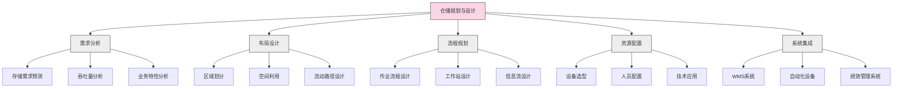
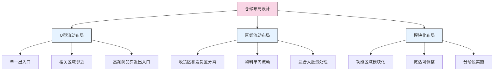

---
{"dg-publish":true,"tags":["供应链","仓储管理","库存控制","仓库设计","物料搬运"],"创建日期":"2024-04-27","permalink":"/知识共享/003_供应链/01_供应链基础/01_学习内容/05_物流与配送/5.3 仓储管理/","dgPassFrontmatter":true}
---

仓储管理是供应链中连接生产和配送的关键环节，负责对物料和产品进行接收、存储、保管、拣选、包装和发运等一系列活动。高效的仓储管理不仅能降低库存持有成本，还能提高订单履行速度和准确性，优化整个供应链的绩效。

## 基础知识

### 仓储的定义与功能

仓储是指通过仓库等设施对物料和产品进行合理保管、管理和控制的活动。根据不同机构的定义：

- **美国物流管理协会(CSCMP)**：仓储是指在产品从来源到消费过程中，对其进行保管和管理的物流功能。

- **欧洲物流协会(ELA)**：仓储是指对物料、半成品或成品在流通过程中的暂时存放，以及相关的管理活动。

- **Bowersox & Closs**：仓储是供应链中实现时间效用的关键活动，通过合理存储将供应与需求在时间上分离。

仓储的基本功能包括：

1. **时间调节功能**：解决供需时间差异，平滑生产和消费的波动
2. **库存集中功能**：通过集中存储降低总体库存水平
3. **增值服务功能**：提供分拣、包装、标签和轻加工等服务
4. **风险防范功能**：应对供应链中断和需求波动风险
5. **规模经济功能**：通过批量处理降低单位操作成本

### 仓储的类型与特点

仓储设施可根据不同标准分类：

1. **按所有权分类**：
   - **自有仓库**：企业自行建设和运营
   - **租赁仓库**：向第三方租用仓储空间
   - **第三方仓库**：由专业物流服务商提供仓储服务
   - **公共仓库**：向多个客户提供收费仓储服务

2. **按功能分类**：
   - **配送中心**：高周转，以拣选和配送为主
   - **存储仓库**：低周转，以长期存储为主
   - **跨配中心**：极低存储时间，以转运为主
   - **前置仓库**：靠近消费者，支持快速配送
   - **退货处理中心**：专门处理退回商品

3. **按温度环境分类**：
   - **常温仓库**：存储普通商品
   - **冷藏仓库**：保持低温环境
   - **冷冻仓库**：保持零下温度
   - **恒温恒湿仓库**：控制特定温湿度范围

4. **按自动化程度分类**：
   - **传统仓库**：主要依靠人工操作
   - **机械化仓库**：采用机械设备辅助操作
   - **自动化仓库**：采用自动化设备和系统
   - **智能仓库**：采用人工智能和机器人技术

### 仓储管理流程

标准仓储管理流程通常包括以下环节：

1. **收货**：
   - 预约安排
   - 货物验收
   - 质量检查
   - 收货登记

2. **上架**：
   - 库位分配
   - 货物移动
   - 库位确认
   - 系统更新

3. **存储**：
   - 库存监控
   - 环境控制
   - 安全管理
   - 周期盘点

4. **拣选**：
   - 拣选任务生成
   - 拣选路径优化
   - 拣货作业
   - 拣选准确性检查

5. **包装**：
   - 分类包装
   - 标签打印
   - 包装质检
   - 装箱合并

6. **发货**：
   - 出库单处理
   - 装车调度
   - 出库确认
   - 文件处理

### 仓储成本构成

仓储成本通常包括以下几个主要部分：

1. **设施成本**：
   - 建筑物租金或折旧
   - 土地使用费
   - 水电费用
   - 维修保养费

2. **设备成本**：
   - 搬运设备成本
   - 存储设备成本
   - 安全设备成本
   - 信息系统成本

3. **人力成本**：
   - 仓库管理人员
   - 操作人员工资
   - 培训费用
   - 福利和保险

4. **运营成本**：
   - 能源消耗
   - 包装材料
   - 保险费用
   - 库存损耗

5. **间接成本**：
   - 管理费用
   - 资金占用成本
   - 风险成本
   - 库存过时成本

## 理论框架

### 仓储规划与设计模型

仓储规划与设计遵循系统化的模型和方法：

### 仓储布局模型

仓储布局设计通常基于以下模型：

### 仓储效率理论

提高仓储效率的关键理论包括：

1. **ABC分类管理**：
   - A类：高价值/高周转商品（约20%的商品，80%的价值）
   - B类：中等价值/周转商品（约30%的商品，15%的价值）
   - C类：低价值/低周转商品（约50%的商品，5%的价值）
   - 根据分类采用不同的管理策略和存储位置

2. **最短路径原则**：
   - 合理规划仓库布局，减少移动距离
   - 优化拣选路径，减少无效行走
   - 将高频商品放在易取位置

3. **波次处理理论**：
   - 将订单合并成波次集中处理
   - 优化订单批处理，提高效率
   - 平衡作业负荷，避免资源浪费

4. **精益仓储理论**：
   - 消除浪费（等待、移动、库存等）
   - 持续改进流程
   - 标准化作业
   - 可视化管理

## 应用指南

### 仓库布局与空间规划

有效的仓库布局和空间规划方法：

1. **需求分析**：
   - 分析产品特性（尺寸、重量、周转率）
   - 评估吞吐量需求和季节性波动
   - 确定特殊存储需求（温度控制、危险品等）

2. **区域划分**：
   - 收货区：足够空间接收和检查货物
   - 存储区：根据产品特性和存取频率划分
   - 拣选区：便于高效拣选的专用区域
   - 包装区：配备必要的包装材料和设备
   - 发货区：便于装车和文档处理
   - 返修区：处理退货和不合格品
   - 办公区：管理人员和系统操作空间

3. **通道设计**：
   - 主通道：足够宽敞，支持双向流动
   - 次通道：平衡空间利用和操作便利性
   - 紧急通道：确保安全疏散

4. **存储设备选择**：
   - 货架系统：选择适合产品特性的货架类型
   - 高度利用：合理利用垂直空间
   - 特殊需求：温控区、安全区等特殊要求

5. **流动路径规划**：
   - 减少交叉流动
   - 缩短移动距离
   - 避免拥堵点

### 仓储设备选型指南

常见仓储设备及其适用场景：

1. **存储设备**：
   - **选择板货架**：适用于大批量同类产品
   - **重型货架**：适用于重型物品
   - **流利式货架**：适用于FIFO管理和高密度存储
   - **穿梭车货架**：适用于高密度存储和自动化操作
   - **旋转货架**：适用于小件物品的高效拣选
   - **自动化立体仓库**：适用于空间受限且需高效存取的场景

2. **搬运设备**：
   - **手动搬运车**：适用于轻量货物短距离移动
   - **电动托盘车**：适用于中等距离平面搬运
   - **堆高车**：适用于货架存取操作
   - **前移式叉车**：适用于窄通道操作
   - **无人搬运车(AGV)**：适用于固定路线的自动化搬运
   - **输送机系统**：适用于固定路线的连续物料流动

3. **拣选设备**：
   - **拣选车**：适用于多订单并行拣选
   - **拣选塔**：适用于高位置物品拣选
   - **拣选机器人**：适用于自动化拣选操作
   - **语音拣选系统**：适用于免手持设备拣选
   - **指示灯拣选系统**：适用于高频率小批量拣选
   - **自动分拣机**：适用于大批量包裹分类

### 仓库管理系统(WMS)实施指南

成功实施WMS系统的关键步骤：

1. **需求分析**：
   - 明确业务需求和关键痛点
   - 分析现有流程和系统
   - 确定关键绩效指标(KPIs)

2. **系统选择**：
   - 评估市场上的WMS解决方案
   - 考虑功能、可扩展性、集成能力
   - 分析成本效益和投资回报

3. **实施规划**：
   - 制定详细的实施计划
   - 分配资源和职责
   - 设定里程碑和时间表

4. **系统配置**：
   - 仓库布局和库位设置
   - 产品和库存参数
   - 作业流程和规则
   - 用户权限和角色

5. **集成开发**：
   - 与ERP系统集成
   - 与物料搬运设备集成
   - 与条码/RFID系统集成
   - 与运输管理系统集成

6. **测试与培训**：
   - 功能测试和集成测试
   - 用户验收测试(UAT)
   - 员工培训计划
   - 操作手册和文档准备

7. **上线与优化**：
   - 制定切换策略
   - 监控初期运行
   - 解决问题和调整
   - 持续优化和升级

### 仓储绩效管理

有效的仓储绩效管理方法：

1. **关键绩效指标(KPIs)**：
   - **效率指标**：每小时处理单数、拣选速率
   - **质量指标**：拣选准确率、损坏率
   - **成本指标**：每单处理成本、每平方米成本
   - **时效指标**：收货到上架时间、订单处理时间
   - **利用率指标**：空间利用率、设备利用率
   - **库存指标**：库存准确率、库存周转率

2. **绩效测量方法**：
   - 设立基准和目标
   - 定期收集和分析数据
   - 可视化显示绩效结果
   - 与行业标准比较

3. **绩效改进流程**：
   - 分析绩效差距原因
   - 制定改进计划
   - 实施改进措施
   - 评估改进效果
   - 标准化成功做法

4. **员工激励机制**：
   - 基于绩效的奖励制度
   - 团队和个人目标设定
   - 技能发展和晋升路径
   - 认可和表彰优秀表现

## 案例分析

### 案例1：亚马逊的机器人仓储系统

**背景**：亚马逊需要处理数百万SKU，同时面临电商配送时效不断缩短的压力。

**挑战**：
- 海量SKU的高效存储和拣选
- 订单处理时间需要大幅缩短
- 高峰期订单量剧增
- 劳动力成本持续上升

**策略**：
- 实施Kiva机器人系统，"货到人"拣选模式
- 高密度立体存储，最大化空间利用
- 多层次自动化设备组合
- 基于AI的库位分配和路径优化
- 预测性波次规划，平衡工作负载

**成效**：
- 订单处理时间从小时级缩短至分钟级
- 仓库存储容量提高50%以上
- 人工成本降低约40%
- 处理效率提高200%以上
- 错误率显著降低

### 案例2：沃尔玛的全渠道仓储转型

**背景**：沃尔玛需要支持线上线下一体化的全渠道零售模式。

**挑战**：
- 传统仓库难以应对电商订单特点
- 需要支持多种订单履行模式
- 库存可视性和实时性要求提高
- 需平衡成本效益和服务水平

**策略**：
- 发展多层次仓储网络，包括配送中心、电商履行中心和店内拣选
- 实施高级WMS系统，提供全渠道库存可视性
- 采用模块化自动化设备，分阶段实施
- 优化库存分配策略，基于销售渠道和区域需求
- 开发统一的订单管理系统，智能分配订单到最优履行点

**成效**：
- 订单履行成本降低15%
- 库存周转率提高25%
- 电商订单配送时间缩短50%
- 全渠道库存可视性达到98%
- 季节性峰值处理能力提升40%

### 案例3：宝洁(P&G)的混合拣选系统

**背景**：宝洁需要高效处理大量SKU，同时满足不同客户的多样化订单需求。

**挑战**：
- 产品尺寸和重量差异大
- 订单结构复杂，从整托盘到单件不等
- 需要支持多种包装和标签要求
- 劳动力可用性和成本问题

**策略**：
- 实施分区混合拣选系统
- 按产品特性和订单特点划分存储区
- 大批量订单采用整托盘和整箱拣选
- 小订单采用拣选车和语音拣选技术
- 实施动态波次规划，优化资源分配
- 采用先进的包装自动化系统

**成效**：
- 拣选效率提高35%
- 错误率降低至0.01%以下
- 劳动力需求减少25%
- 包装材料使用减少15%
- 峰值处理能力提升40%

### 案例4：联合利华的温控供应链仓储

**背景**：联合利华需要管理包括常温、冷藏和冷冻在内的多温区产品。

**挑战**：
- 不同产品需要不同温度环境
- 温控设施能源消耗大
- 多温区操作增加复杂性
- 保质期管理要求严格

**策略**：
- 设计多温区集成仓库
- 实施智能温控系统，优化能源使用
- 采用FEFO(先到期先出)管理模式
- 优化装卸区设计，减少温度损失
- 实施温度监控和预警系统
- 开发温控产品专用拣选流程

**成效**：
- 能源消耗降低30%
- 产品质量保证率提高至99.9%
- 库存损耗率降低60%
- 多温区操作效率提高25%
- 设施利用率提高20%

### 案例5：戴尔(Dell)的零库存模式与配送中心

**背景**：戴尔以其直销模式和定制生产而闻名，需要高效的仓储和配送支持。

**挑战**：
- 产品配置多样化
- 客户要求快速交付
- 零部件供应商众多
- 需要精确协调生产和配送

**策略**：
- 采用配送中心而非传统仓库
- 实施供应商管理库存(VMI)模式
- 开发高度集成的信息系统
- 优化装配和配送流程衔接
- 按订单分批次管理物料流
- 实施精确的时间窗口管理

**成效**：
- 库存周转率达到行业领先水平
- 订单到交付时间缩短50%
- 库存持有成本降低70%
- 空间利用率提高40%
- 准时交付率达到99%以上

## 延伸内容

### 智能仓储技术与趋势

仓储管理的技术发展趋势：

1. **自动化技术**：
   - **自动存取系统(AS/RS)**：高密度、高效率存取
   - **自动导引车(AGV)**：柔性化物料搬运
   - **自主移动机器人(AMR)**：智能化路径规划
   - **机器人拣选系统**：提高拣选效率和准确性

2. **数字化技术**：
   - **物联网(IoT)**：实时监控设备和环境
   - **大数据分析**：优化仓储决策和预测
   - **人工智能**：智能任务分配和路径规划
   - **数字孪生**：仓库虚拟模型和模拟优化

3. **识别技术**：
   - **RFID技术**：非接触式识别和追踪
   - **视觉识别系统**：自动识别和检测
   - **语音识别技术**：免手持设备操作
   - **实时定位系统(RTLS)**：精确定位和追踪

4. **增强现实和可穿戴设备**：
   - **AR拣选指导**：视觉引导提高效率
   - **智能眼镜**：辅助操作和信息显示
   - **可穿戴扫描设备**：解放双手提高效率
   - **智能手套**：感应操作和自动记录

### 可持续仓储实践

环保和可持续发展在仓储管理中的应用：

1. **能源管理**：
   - 节能照明系统
   - 智能温控和通风
   - 可再生能源应用（太阳能、风能）
   - 能源消耗监控和优化

2. **绿色建筑**：
   - 环保建筑材料
   - 自然光利用
   - 雨水收集系统
   - 绿色屋顶和墙面

3. **减少废弃物**：
   - 包装材料回收和再利用
   - 废弃物分类和处理
   - 纸质文档电子化
   - 设备和材料的生命周期管理

4. **可持续运营**：
   - 减少空间和能源浪费
   - 优化运输和减少碳排放
   - 员工环保意识培训
   - 环境管理体系认证

### 全渠道仓储策略

支持全渠道零售的仓储策略：

1. **统一库存管理**：
   - 全渠道库存可视性
   - 动态库存分配
   - 虚拟库存池
   - 库存共享机制

2. **灵活履行模式**：
   - 店内拣选(Ship-from-Store)
   - 店内取货(Click & Collect)
   - 配送中心直发
   - 供应商直发(Drop-shipping)

3. **仓储网络优化**：
   - 前置仓布局
   - 区域配送中心
   - 微履行中心(MFC)
   - 超本地配送点

4. **系统集成**：
   - 渠道间订单管理系统
   - 实时库存同步
   - 智能订单路由
   - 全渠道绩效分析

### 风险管理与应急预案

仓储运营中的风险管理方法：

1. **风险识别与评估**：
   - 自然灾害风险（火灾、洪水、地震等）
   - 运营风险（设备故障、系统崩溃等）
   - 安全风险（盗窃、损坏、信息泄露等）
   - 合规风险（法规、标准不符等）

2. **预防措施**：
   - 安全设施和系统（消防、监控等）
   - 预防性维护计划
   - 员工安全培训
   - 定期风险审核

3. **应急预案**：
   - 灾难恢复计划
   - 业务连续性计划
   - 应急响应团队
   - 备份系统和设施

4. **风险转移**：
   - 保险覆盖
   - 风险共担协议
   - 外包高风险活动
   - 多源供应策略

## 学习资源

### 思考问题

1. 在仓储布局设计中，如何平衡空间利用率和操作效率？两者之间是否存在权衡关系？
2. 自动化仓储系统相比传统人工仓库有哪些优势和局限性？企业如何决定自动化程度？
3. ABC分类法如何应用于仓储管理？除了传统的价值和周转率标准外，还有哪些分类方法？
4. 如何设计仓库的拣选系统以最大化效率？不同类型的拣选系统适用于哪些场景？
5. 仓库管理系统(WMS)实施过程中常见的挑战有哪些？如何克服这些挑战？
6. 如何优化仓库的收货流程？有哪些方法可以减少收货环节的瓶颈？
7. 在季节性需求波动大的行业，如何规划仓储容量和资源？有哪些灵活应对的策略？
8. 跨境电商的仓储管理有哪些特殊要求和挑战？如何设计适合跨境电商的仓储解决方案？
9. 在实施精益仓储管理时，如何识别和消除仓库中的各类浪费？
10. 冷链物流的仓储有哪些特殊要求？如何确保温控环境的稳定性和能源效率？
11. 如何设计有效的库存盘点流程？周期盘点和永续盘点各有什么优缺点？
12. 仓库安全管理包括哪些方面？如何建立全面的仓库安全体系？
13. 如何评估仓储外包的可行性？什么情况下应选择自营仓库，什么情况下应选择第三方仓储？
14. 物联网技术如何应用于现代仓储管理？它能解决哪些传统问题？
15. 随着全渠道零售的发展，仓储管理面临哪些新挑战？如何调整仓储战略以支持全渠道业务？

### 自测题

1. 以下哪种仓储布局通常最适合需要频繁拣选的电商仓库？
   a) 直线流动布局
   b) U型流动布局
   c) 模块化布局
   d) 放射状布局

2. ABC分类法中，A类物品通常应该：
   a) 存放在远离拣货区的位置
   b) 存放在靠近拣货区和出口的位置
   c) 随机分散存放以分散风险
   d) 集中存放在安全区域

3. 下列哪种拣选方法最适合处理大量小订单，每个订单包含少量SKU的情况？
   a) 批量拣选
   b) 区域拣选
   c) 波次拣选
   d) 按订单拣选

4. 仓库中的"交叉配送"(Cross-docking)主要指：
   a) 不同区域间的货物交叉存放
   b) 收到货物后直接配送，几乎不存储
   c) 在不同仓库间调拨货物
   d) 使用交叉式输送机进行分拣

5. 以下哪项不是实施WMS系统的主要目标？
   a) 提高库存准确性
   b) 增加库存水平
   c) 优化空间利用
   d) 提高劳动生产率

### 实践练习

**练习1：仓库布局优化设计**

选择一种特定类型的业务（如电商、零售、制造等），设计最佳仓库布局：
1. 分析业务特点和产品特性
2. 确定主要仓储功能和流程
3. 绘制仓库布局平面图，包括各功能区
4. 设计主要物流流向和动线
5. 说明设计理念和预期效果
6. 分析可能的瓶颈和解决方案

**练习2：仓储绩效评估与改进**

假设你是一家公司的仓储经理，负责评估和改进仓储绩效：
1. 设计一套完整的仓储KPI体系
2. 说明各项指标的计算方法和目标值
3. 设计数据收集和分析方法
4. 模拟一组绩效数据，进行分析
5. 根据分析结果，提出3-5项具体改进措施
6. 设计实施计划和效果评估方法

### 推荐阅读

1. Richards, G. (2017). Warehouse Management: A Complete Guide to Improving Efficiency and Minimizing Costs in the Modern Warehouse (3rd ed.). Kogan Page.
2. Ackerman, K. B. (2012). Practical Handbook of Warehousing (5th ed.). Springer.
3. Frazelle, E. (2016). World-Class Warehousing and Material Handling (2nd ed.). McGraw-Hill Education.
4. Mulcahy, D. E., & Sydow, J. (2008). A Supply Chain Logistics Program for Warehouse Management. CRC Press.
5. Jenkins, C. H. (2017). The Definitive Guide to Warehousing: Managing the Storage and Handling of Materials and Products in the Supply Chain. Pearson Education. 