---
{"dg-publish":true,"tags":["供应链","配送中心","订单履行","物流运营","流程优化"],"创建日期":"2024-04-27","permalink":"/知识共享/003_供应链/01_供应链基础/01_学习内容/05_物流与配送/5.4 配送中心运营/","dgPassFrontmatter":true}
---

配送中心是现代供应链中连接上游供应商和下游客户的关键枢纽，负责高效地接收、存储、处理和配送商品。与传统仓库相比，配送中心更加注重快速周转和增值服务，是企业满足客户需求、降低物流成本的重要支撑。本文将系统介绍配送中心的运营管理知识。

## 基础知识

### 配送中心的定义与特点

配送中心(Distribution Center, DC)是指在供应链中专门用于商品接收、存储、拣选、包装和配送的设施。不同专业机构对配送中心有不同定义：

- **美国物流管理协会(CSCMP)**：配送中心是一种特殊类型的仓库，专注于商品的快速流通而非长期存储，通常执行商品分类、合并和配送功能。

- **欧洲物流协会(ELA)**：配送中心是供应链中的物流节点，负责接收多种来源的货物，进行分拣、重组后配送给不同的收货人。

- **Bowersox & Closs**：配送中心是物流网络中的战略节点，提供增值服务和信息交换，实现供需匹配和货物高效流通。

与传统仓库相比，配送中心具有以下特点：

1. **高周转率**：商品在配送中心停留时间短，通常不超过数日
2. **增值处理**：提供分拣、包装、标签和轻加工等增值服务
3. **订单驱动**：以客户订单为核心驱动运营活动
4. **信息密集**：依赖先进信息系统进行管理和决策
5. **自动化程度高**：通常采用各种自动化技术提高效率
6. **多商品整合**：整合不同来源的商品满足客户需求

### 配送中心的类型与功能

根据不同标准，配送中心可分为多种类型：

1. **按服务范围分类**：
   - **全国性配送中心**：覆盖全国市场的大型设施
   - **区域配送中心**：服务特定区域的中型设施
   - **本地配送中心**：服务特定城市或地区的小型设施
   - **前置配送中心**：靠近消费者的小型配送点

2. **按运营模式分类**：
   - **传统配送中心**：接收、存储、拣选、配送全流程
   - **跨配中心(Cross-dock)**：最小化存储环节，实现快速转运
   - **合并配送中心**：整合多个供应商的货物
   - **电商履行中心**：专为电子商务订单设计

3. **按商品类型分类**：
   - **快消品配送中心**
   - **服装配送中心**
   - **电子产品配送中心**
   - **食品配送中心**
   - **医药配送中心**

4. **按温度环境分类**：
   - **常温配送中心**
   - **冷藏配送中心**
   - **冷冻配送中心**
   - **多温区配送中心**

配送中心的主要功能包括：

1. **货物接收**：接收来自供应商的货物
2. **商品存储**：短期存储等待订单处理
3. **订单拣选**：根据客户订单拣选商品
4. **货物合并**：将多个订单合并配送
5. **配送准备**：包装、标签、装车等出库准备
6. **运输管理**：组织配送路线和车辆调度
7. **返修处理**：处理退货和不合格品
8. **增值服务**：提供定制包装、组装等增值服务

### 配送中心运营流程

标准配送中心的运营流程通常包括以下环节：

1. **入库流程**：
   - 到货预约
   - 卸货与接收
   - 数量和质量检验
   - 标签生成和应用
   - 库位分配和上架

2. **库内管理**：
   - 库存监控
   - 库位优化
   - 补货管理
   - 库存盘点
   - 过期和损坏品处理

3. **订单处理**：
   - 订单接收与验证
   - 订单分配与批处理
   - 拣选任务生成
   - 波次规划与排序
   - 订单合并与分解

4. **拣选作业**：
   - 拣选路径优化
   - 拣货作业执行
   - 拣选准确性检查
   - 订单集中与分流
   - 特殊订单处理

5. **出库流程**：
   - 包装和标签
   - 订单验证和质检
   - 发货文件准备
   - 装车和配载
   - 发运确认和跟踪

6. **返修处理**：
   - 退货接收和检查
   - 退货分类和评估
   - 重新上架或处理
   - 退款和客户服务
   - 供应商退货管理

### 配送中心的关键绩效指标

评估配送中心绩效的主要指标包括：

1. **效率指标**：
   - 订单处理量（每小时/每天）
   - 人均处理订单数
   - 拣选速率（行/小时）
   - 装卸速率（托盘/小时）
   - 订单周转时间

2. **质量指标**：
   - 订单准确率
   - 库存准确率
   - 货物损坏率
   - 订单完整率
   - 客户满意度

3. **成本指标**：
   - 每订单处理成本
   - 每行拣选成本
   - 每平方米运营成本
   - 人工成本占比
   - 能源消耗成本

4. **资源利用指标**：
   - 空间利用率
   - 设备利用率
   - 人力资源利用率
   - 库存周转率
   - 峰值处理能力

5. **服务水平指标**：
   - 按时交付率
   - 订单响应时间
   - 特殊订单处理能力
   - 退货处理时间
   - 服务投诉率

## 理论框架

### 配送中心设计模型

配送中心的设计和规划通常遵循以下模型框架：

```mermaid
graph TD
    A[配送中心设计] --> B[需求分析]
    A --> C[功能规划]
    A --> D[布局设计]
    A --> E[流程优化]
    A --> F[资源配置]
    
    B --> B1[订单特性分析]
    B --> B2[处理量预测]
    B --> B3[季节性变化]
    B --> B4[增长预期]
    
    C --> C1[接收功能]
    C --> C2[存储功能]
    C --> C3[拣选功能]
    C --> C4[出库功能]
    C --> C5[增值服务]
    
    D --> D1[区域划分]
    D --> D2[流动路径]
    D --> D3[工作站设计]
    D --> D4[存储布局]
    
    E --> E1[流程标准化]
    E --> E2[瓶颈分析]
    E --> E3[自动化应用]
    E --> E4[信息流优化]
    
    F --> F1[设备选择]
    F --> F2[人力配置]
    F --> F3[技术应用]
    F --> F4[系统实施]
    
    style A fill:#f9d5e5,stroke:#333,stroke-width:1px
    style B fill:#eeeeee,stroke:#333,stroke-width:1px
    style C fill:#eeeeee,stroke:#333,stroke-width:1px
    style D fill:#eeeeee,stroke:#333,stroke-width:1px
    style E fill:#eeeeee,stroke:#333,stroke-width:1px
    style F fill:#eeeeee,stroke:#333,stroke-width:1px
```

### 订单履行模型

配送中心的订单履行过程可通过以下模型理解：

```mermaid
graph TD
    A[订单履行流程] --> B[订单接收与验证]
    A --> C[订单分类与批处理]
    A --> D[资源分配与调度]
    A --> E[拣选执行]
    A --> F[订单合并与完成]
    A --> G[配送准备]
    
    B --> B1[订单输入系统]
    B --> B2[库存可用性检查]
    B --> B3[信用审核]
    B --> B4[订单确认]
    
    C --> C1[按紧急度分类]
    C --> C2[按区域分类]
    C --> C3[按客户类型分类]
    C --> C4[按商品特性分类]
    
    D --> D1[拣选资源分配]
    D --> D2[设备调度]
    D --> D3[人员安排]
    D --> D4[波次规划]
    
    E --> E1[拣选路径优化]
    E --> E2[拣选操作执行]
    E --> E3[拣选确认]
    E --> E4[特殊处理]
    
    F --> F1[订单校验]
    F --> F2[包装准备]
    F --> F3[订单整合]
    F --> F4[质量检查]
    
    G --> G1[标签和文件]
    G --> G2[装箱和包装]
    G --> G3[装载和配载]
    G --> G4[发运确认]
    
    style A fill:#f9d5e5,stroke:#333,stroke-width:1px
    style B fill:#e6f3ff,stroke:#333,stroke-width:1px
    style C fill:#e6f3ff,stroke:#333,stroke-width:1px
    style D fill:#e6f3ff,stroke:#333,stroke-width:1px
    style E fill:#e6f3ff,stroke:#333,stroke-width:1px
    style F fill:#e6f3ff,stroke:#333,stroke-width:1px
    style G fill:#e6f3ff,stroke:#333,stroke-width:1px
```

### 配送中心运营优化理论

配送中心运营优化的主要理论方法包括：

1. **精益配送中心**：
   - 识别和消除七大浪费（等待、库存、运输、过度处理、动作、缺陷、过度生产）
   - 持续改进和标准化流程
   - 价值流图分析和优化
   - 5S管理和可视化控制

2. **约束理论(TOC)**：
   - 识别系统瓶颈
   - 充分利用瓶颈资源
   - 使其他环节服从瓶颈
   - 持续改进提升瓶颈能力
   - 重新识别新的瓶颈

3. **排队论应用**：
   - 模拟分析作业站排队情况
   - 优化资源分配减少等待
   - 平衡处理能力与需求
   - 动态调整处理优先级

4. **批量优化理论**：
   - 确定最优订单批量
   - 波次优化和平衡
   - 批处理与实时处理平衡
   - 生产计划平滑化

## 应用指南

### 配送中心布局与设计指南

有效的配送中心布局设计应考虑以下要点：

1. **功能区划分**：
   - **接收区**：充足的卸货空间和验收区域
   - **存储区**：根据商品特性和周转率设计的仓储空间
   - **拣选区**：高效便捷的拣货区域
   - **包装区**：设备齐全的包装工作站
   - **暂存区**：等待发运的订单暂存空间
   - **发货区**：便于装车的发货月台
   - **退货区**：专门处理退回商品的区域
   - **增值服务区**：提供特殊处理的专区

2. **物流流向设计**：
   - 尽量保持物料流动单向顺畅
   - 减少交叉流动和回流
   - 高频活动区域靠近相关功能区
   - 考虑扩展性和灵活性

3. **存储区规划**：
   - 根据ABC分类进行商品布局
   - 高周转商品靠近拣选和发货区
   - 合理规划通道宽度和高度
   - 考虑特殊商品的存储要求

4. **拣选区设计**：
   - 优化拣选路径和动线
   - 减少行走距离和弯腰动作
   - 根据订单特性设计拣选方式
   - 考虑人机工程学原则

5. **扩展性考虑**：
   - 预留扩展空间
   - 模块化设计便于调整
   - 灵活的设备和系统架构
   - 分阶段实施的可能性

### 订单处理流程优化

提高订单处理效率的关键方法：

1. **订单分类与优先级**：
   - 根据紧急程度设置优先级
   - 按订单类型和特性分类
   - 建立客户分级处理机制
   - 设置特殊订单处理流程

2. **波次规划策略**：
   - 平衡工作负荷
   - 根据截止时间划分波次
   - 考虑运输计划和路线
   - 特殊订单单独处理

3. **拣选策略优化**：
   - **按订单拣选**：适合小批量复杂订单
   - **批量拣选**：适合多订单共同商品
   - **区域拣选**：根据仓库区域分工拣选
   - **波次拣选**：按时间批次集中处理
   - **集中与分散拣选结合**：根据商品特性区分

4. **订单合并优化**：
   - 建立高效的订单集中流程
   - 使用分拣系统进行订单整合
   - 优化包装材料和方法
   - 实施订单完整性检查

5. **技术应用**：
   - 条码/RFID应用
   - 拣选辅助技术（语音、指示灯）
   - 订单处理自动化设备
   - 高级订单管理系统

### 资源调度与管理

配送中心资源的高效管理方法：

1. **人力资源管理**：
   - 基于需求的人员排班
   - 多技能培训和轮岗
   - 绩效管理和激励机制
   - 临时工与正式员工配比

2. **设备资源管理**：
   - 设备使用计划和调度
   - 预防性维护计划
   - 设备利用率监控
   - 设备升级与淘汰决策

3. **空间资源管理**：
   - 动态库位管理
   - 季节性空间调整
   - 临时存储解决方案
   - 空间利用率优化

4. **时间资源管理**：
   - 作业时间窗口规划
   - 关键环节时间控制
   - 瓶颈环节资源倾斜
   - 高峰期资源预留

5. **动态调整机制**：
   - 实时监控与预警
   - 快速响应预案
   - 资源应急调配
   - 持续优化反馈

### 配送中心技术应用

现代配送中心常用技术及其应用：

1. **信息系统技术**：
   - 仓库管理系统(WMS)
   - 订单管理系统(OMS)
   - 运输管理系统(TMS)
   - 劳动力管理系统(LMS)
   - 企业资源计划(ERP)集成

2. **自动识别技术**：
   - 条码扫描系统
   - RFID技术应用
   - 图像识别系统
   - 语音识别技术
   - 生物识别技术

3. **自动化设备**：
   - 自动分拣系统
   - 输送机系统
   - 自动存取系统(AS/RS)
   - 自动导引车(AGV)
   - 机器人技术应用

4. **决策支持技术**：
   - 预测分析工具
   - 模拟优化软件
   - 业务智能(BI)系统
   - 绩效分析仪表盘
   - 预警和异常检测系统

## 案例分析

### 案例1：亚马逊的履行中心运营模式

**背景**：亚马逊作为全球最大的电商公司，需要处理数百万SKU和订单，同时满足快速配送承诺。

**挑战**：
- 海量SKU的高效管理
- 大量小订单的快速处理
- 季节性需求波动
- 快速交付承诺（当日达、次日达）
- 全球履行网络协调

**策略**：
- 采用"混沌存储"原则，随机分配库位
- 实施"货到人"拣选模式，使用机器人搬运货架
- 分层次履行网络：大型履行中心、分拣中心、配送站
- 区分快慢商品的处理流程
- 基于AI的订单分配和资源调度
- 预测性补货和库存前置

**成效**：
- 存储密度提高40%以上
- 订单处理速度提高5倍
- 实现大部分地区次日甚至当日达
- 高峰期处理能力提升300%
- 人均效率提高150%

### 案例2：沃尔玛的全渠道配送中心

**背景**：沃尔玛需要支持实体店和电商的全渠道运营模式。

**挑战**：
- 整合线上线下订单处理
- 多种订单类型和尺寸
- 不同配送模式的支持（店内自提、家庭配送）
- 保持高库存周转率
- 控制配送成本

**策略**：
- 开发多功能配送中心，支持门店和电商订单
- 实施动态波次规划，优先处理时效性订单
- 采用区域分拣与合并系统
- 建立店内拣选与配送中心拣选协同机制
- 优化包装方案，适应不同配送渠道
- 实施整合的库存管理和可视化系统

**成效**：
- 订单处理时间减少30%
- 配送成本降低15%
- 库存周转率提高25%
- 全渠道订单完成率提高到98%
- 客户满意度显著提升

### 案例3：DHL的高效跨境配送中心

**背景**：DHL作为全球物流巨头，需要高效处理跨境电商包裹。

**挑战**：
- 多国家、多语言包裹处理
- 复杂的清关文件处理
- 多渠道订单汇聚
- 配送时效压力
- 不同国家的合规要求

**策略**：
- 建立区域性跨境配送中心
- 实施先进的清关预处理系统
- 采用高度自动化分拣设备
- 开发智能路由系统，优化国际运输路线
- 实施预报关和预分拣流程
- 标准化包装和标签系统

**成效**：
- 跨境包裹处理时间缩短50%
- 清关时间减少70%
- 配送准确率提高到99.5%
- 单位处理成本降低25%
- 国际包裹可追踪性达到100%

### 案例4：京东的前置仓配送模型

**背景**：京东需要在大城市提供快速配送服务，尤其是生鲜和日用品类。

**挑战**：
- 短时效配送要求（小时级）
- 生鲜产品的特殊处理需求
- 城市配送的交通限制
- 配送成本与效率平衡
- 订单波动和预测难度

**策略**：
- 建立城市前置仓网络
- 基于大数据的库存预测和前置
- 多温区仓储设计
- 结合众包配送与专业配送队伍
- 实施智能分区和路径规划
- 高频次小批量补货模式

**成效**：
- 实现1-2小时配送服务
- 生鲜损耗率降低60%
- 配送单均成本降低30%
- 库存准确率提高到99%
- 订单满足率达到95%以上

### 案例5：宝洁(P&G)的混合模式配送中心

**背景**：宝洁需要同时服务大型零售商和小型零售商，处理不同规模的订单。

**挑战**：
- 订单规模差异大（从整托盘到单箱）
- 产品种类繁多
- 促销活动导致的需求波动
- 不同客户的服务要求差异
- 配送效率与成本平衡

**策略**：
- 实施分区管理，区分大小订单处理
- 建立层级式存储和拣选系统
- 采用混合拣选策略：整托盘、整箱、拆零
- 开发高级波次规划系统
- 实施零售商VMI和CPFR项目
- 优化包装和标签系统

**成效**：
- 大订单处理效率提高40%
- 小订单处理成本降低25%
- 总体运营成本降低15%
- 客户满意度提高20%
- 促销期峰值处理能力提升50%

## 延伸内容

### 全渠道配送中心策略

支持全渠道零售的配送中心策略：

1. **全渠道订单管理**：
   - 统一的订单管理平台
   - 全渠道库存可视性
   - 智能订单路由和分配
   - 渠道间订单优先级管理

2. **灵活的履行选项**：
   - 店内自提(Click & Collect)
   - 从门店发货(Ship from Store)
   - 配送中心直发
   - 供应商直发(Drop-shipping)
   - 第三方配送网络

3. **配送中心设计考量**：
   - 多区域功能划分
   - 支持多种订单类型的处理流程
   - 灵活的包装选项
   - 可变容量的处理能力

4. **技术支持**：
   - 全渠道库存管理系统
   - 订单分配算法
   - 实时库存同步
   - 集成的客户信息系统

### 可持续配送中心实践

环保与可持续发展在配送中心的应用：

1. **能源效率**：
   - 节能照明系统
   - 智能温控和通风
   - 可再生能源应用
   - 设备能源管理

2. **减少废弃物**：
   - 可重复使用的包装材料
   - 废弃物分类和回收
   - 减少过度包装
   - 物料的生命周期管理

3. **绿色建筑**：
   - LEED认证标准
   - 自然光利用
   - 雨水收集系统
   - 绿色屋顶技术

4. **可持续运营**：
   - 减少空载运输
   - 配送路线优化
   - 替代能源车辆
   - 供应商环保认证

### 智能配送中心技术趋势

配送中心技术的未来发展趋势：

1. **人工智能应用**：
   - 需求预测和库存优化
   - 智能任务分配
   - 异常检测和预防
   - 自适应学习系统

2. **机器人技术**：
   - 拣选机器人
   - 协作机器人(Cobots)
   - 自主移动机器人(AMR)
   - 机器视觉应用

3. **物联网和数字孪生**：
   - 全面感知和监控
   - 实时数据分析
   - 虚拟仿真和优化
   - 预测性维护

4. **区块链应用**：
   - 供应链透明度
   - 产品追溯和防伪
   - 智能合约执行
   - 多方协作平台

### 季节性需求应对策略

配送中心应对季节性需求波动的策略：

1. **容量规划**：
   - 弹性空间设计
   - 临时存储解决方案
   - 设备租赁策略
   - 提前规划高峰期资源

2. **人力资源策略**：
   - 临时工招聘和培训
   - 多技能工人培养
   - 灵活排班系统
   - 绩效激励机制

3. **流程调整**：
   - 简化高峰期流程
   - 预先准备和提前处理
   - 优先级和资源重新分配
   - 特殊情况应急预案

4. **技术支持**：
   - 需求预测系统
   - 资源调度优化
   - 自动化和半自动化备选方案
   - 峰值监控和预警系统

## 学习资源

### 思考问题

1. 配送中心与传统仓库有哪些本质区别？企业在什么情况下应选择配送中心而非传统仓库？
2. 在配送中心设计中，如何确定最佳的功能区布局？有哪些定量和定性方法可以辅助决策？
3. 批量拣选和按订单拣选各有什么优缺点？在什么情况下应选择哪种拣选策略？
4. 如何优化配送中心的订单波次规划？有哪些因素需要考虑？
5. 自动化设备在配送中心的应用有哪些决策考量？如何评估自动化投资的回报？
6. 配送中心如何有效处理退货？退货处理流程与正常订单处理有何不同？
7. 季节性需求波动对配送中心运营有何影响？如何设计弹性系统应对这种波动？
8. 全渠道零售对配送中心提出了哪些新挑战？如何设计配送中心以支持全渠道战略？
9. 在配送中心实施精益管理的关键步骤有哪些？如何识别和消除浪费？
10. 如何设计高效的跨配(Cross-docking)操作？什么类型的产品最适合跨配模式？
11. 如何衡量和提高配送中心的员工生产力？有哪些激励机制和培训方法？
12. 配送中心的信息系统架构应包含哪些关键组件？各系统间如何有效集成？
13. 环境可持续性在配送中心设计和运营中有哪些体现？如何平衡环保与经济效益？
14. 人工智能和机器学习如何应用于配送中心运营？有哪些具体应用场景？
15. 全球供应链中的配送中心网络应如何设计？如何平衡全球标准化与本地化需求？

### 自测题

1. 以下哪项不是配送中心区别于传统仓库的特点？
   a) 更高的货物周转率
   b) 更注重长期存储功能
   c) 更多的增值处理服务
   d) 更依赖先进信息系统

2. 波次规划主要是为了解决以下哪个问题？
   a) 库存管理
   b) 订单处理资源分配
   c) 供应商管理
   d) 运输路线规划

3. 在配送中心中，ABC分类法通常基于哪个因素对商品进行分类？
   a) 商品体积
   b) 商品重量
   c) 商品价值
   d) 拣选频率

4. 跨配(Cross-docking)操作的主要目的是什么？
   a) 增加库存水平
   b) 减少存储时间和环节
   c) 提高存储密度
   d) 增加拣选准确性

5. 以下哪种拣选方法最适合处理大量包含多种SKU的小订单？
   a) 整托盘拣选
   b) 整箱拣选
   c) 批量拣选
   d) 单一订单拣选

### 实践练习

**练习1：配送中心规划与设计**

假设你需要为一家全渠道零售企业设计一个新的区域配送中心：
1. 确定配送中心的主要功能和处理流程
2. 分析需要考虑的关键因素和约束条件
3. 设计配送中心的功能区域布局
4. 说明各区域的空间分配比例和关键设施
5. 设计主要物流流向和操作流程
6. 提出关键设备和技术应用建议
7. 分析该设计的优势和潜在挑战

**练习2：订单履行流程优化**

分析一个具体的配送中心订单处理场景，并提出优化建议：
1. 描述订单特点（类型、规模、时效要求等）
2. 分析当前订单处理流程
3. 识别流程中的瓶颈和问题点
4. 提出具体的优化措施（至少5项）
5. 设计实施计划，包括优先级和资源需求
6. 预估优化后的效果提升
7. 设计关键绩效指标监控方案

### 推荐阅读

1. Bartholdi, J. J., & Hackman, S. T. (2019). Warehouse & Distribution Science: Release 0.98. Supply Chain and Logistics Institute.
2. Frazelle, E. (2016). World-Class Warehousing and Material Handling (2nd ed.). McGraw-Hill Education.
3. Richards, G. (2017). Warehouse Management: A Complete Guide to Improving Efficiency and Minimizing Costs in the Modern Warehouse (3rd ed.). Kogan Page.
4. Rushton, A., Croucher, P., & Baker, P. (2017). The Handbook of Logistics and Distribution Management (6th ed.). Kogan Page.
5. Mulcahy, D. E., & Sydow, J. (2008). A Supply Chain Logistics Program for Warehouse Management. CRC Press. 