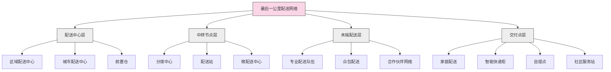
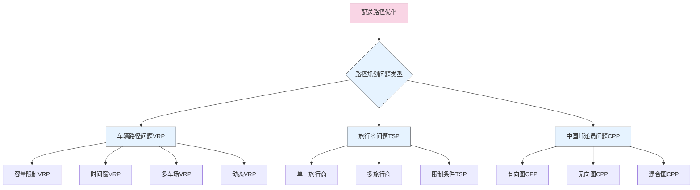

---
{"dg-publish":true,"tags":["供应链","最后一公里","城市配送","快递物流","配送优化"],"创建日期":"2024-04-27","permalink":"/知识共享/003_供应链/01_供应链基础/01_学习内容/05_物流与配送/5.5 最后一公里配送/","dgPassFrontmatter":true}
---

最后一公里配送是指将货物从最终配送中心或集散点送达消费者手中的物流过程，是整个供应链中最为复杂、成本占比最高、也是最接近客户的环节。随着电子商务和城市化的快速发展，最后一公里配送的效率和体验已经成为企业竞争力的关键因素。

## 基础知识

### 最后一公里配送的定义与特点

最后一公里配送(Last Mile Delivery)是指将货物从最后的配送节点（如配送中心、分拨中心或门店）运送到最终消费者手中的物流活动。不同专业机构对其有不同定义：

- **美国物流管理协会(CSCMP)**：最后一公里配送是供应链中最终的物流环节，负责将商品从最后一个转运节点配送到最终消费者。

- **欧洲物流协会(ELA)**：最后一公里配送是物流配送网络的终端环节，通常发生在城市和居民区，是物流成本中最为昂贵的部分。

- **Gevaers et al.**：最后一公里是指配送链中的最后部分，包括从最后的配送中心到货物的最终目的地。

最后一公里配送具有以下特点：

1. **高成本**：占物流总成本的28%-50%，是整个供应链中单位成本最高的环节
2. **高分散性**：配送点地理分布广泛，路径规划复杂
3. **高不确定性**：交通状况、收件人在家率等因素影响大
4. **高客户接触度**：直接与最终客户接触，影响整体服务体验
5. **高时效性要求**：消费者期待更快速的配送
6. **高复杂性**：涉及城市交通、环保法规、配送窗口等多种约束
7. **高可见度**：配送人员和车辆代表企业形象

### 最后一公里配送的类型与模式

最后一公里配送可根据不同维度进行分类：

1. **按配送主体分类**：
   - **自营配送**：企业自建配送队伍
   - **第三方配送**：外包给专业物流公司
   - **众包配送**：利用社会闲散劳动力
   - **联盟配送**：多家企业联合组建配送网络

2. **按配送模式分类**：
   - **直接配送模式**：从配送中心直接送到消费者
   - **中转配送模式**：经过多个中转站点
   - **前置仓模式**：利用靠近消费者的小型仓库
   - **门店配送模式**：从零售门店配送
   - **自提模式**：消费者自行前往指定地点取货

3. **按配送时效分类**：
   - **即时配送**：1-2小时内送达
   - **当日达**：当天送达
   - **次日达**：第二天送达
   - **标准配送**：2-5天送达
   - **预约配送**：按约定时间送达

4. **按配送区域分类**：
   - **城市核心区配送**
   - **城市周边区域配送**
   - **乡镇配送**
   - **农村配送**
   - **偏远地区配送**

### 最后一公里配送的成本构成

最后一公里配送成本通常包括以下要素：

1. **直接运营成本**：
   - 人工成本（配送员工资、福利）
   - 车辆成本（燃料、维修、折旧）
   - 包装材料成本
   - 配送设备成本（手持终端、工具）

2. **间接运营成本**：
   - 配送站点租金和设施成本
   - 调度和管理成本
   - 信息系统成本
   - 保险和安全成本

3. **失败配送成本**：
   - 二次配送成本
   - 退回和重发成本
   - 客户投诉和赔偿

4. **外部成本**：
   - 交通拥堵成本
   - 环境污染成本
   - 基础设施使用成本

### 最后一公里配送的影响因素

影响最后一公里配送效率和成本的主要因素：

1. **城市因素**：
   - 人口密度
   - 道路状况和交通拥堵
   - 停车限制
   - 配送时间窗限制

2. **客户因素**：
   - 客户分布密度
   - 在家率
   - 服务时间要求
   - 接收方式偏好

3. **商品因素**：
   - 商品尺寸和重量
   - 商品价值和特性
   - 包装要求
   - 特殊处理需求(温控、防震等)

4. **运营因素**：
   - 配送网络布局
   - 路径规划效率
   - 车辆和人员调度
   - 技术应用程度

## 理论框架

### 最后一公里配送网络模型

最后一公里配送网络的基本架构可以用以下模型表示：

### 最后一公里配送路径优化模型

最后一公里配送路径规划通常基于以下模型：

### 最后一公里配送效率理论

提高最后一公里配送效率的主要理论包括：

1. **配送网络优化理论**：
   - 分层次配送网络设计
   - 配送节点位置优化
   - 服务区域划分
   - 网络弹性设计

2. **路径优化理论**：
   - 启发式算法
   - 蚁群算法
   - 遗传算法
   - 人工智能路径规划

3. **运力调度理论**：
   - 动态资源配置
   - 需求预测模型
   - 批量优化理论
   - 实时调度模型

4. **配送窗口理论**：
   - 时间窗管理
   - 客户聚类模型
   - 波次规划
   - 交货协同模型

## 应用指南

### 最后一公里配送策略制定

企业制定最后一公里配送策略时应考虑以下步骤：

1. **市场与需求分析**：
   - 明确目标客户群体
   - 分析配送区域特点
   - 确定客户服务期望
   - 评估竞争对手水平

2. **配送模式选择**：
   - 自营还是外包
   - 众包模式适用性
   - 混合模式可行性
   - 配送渠道组合

3. **网络设计**：
   - 配送节点位置规划
   - 服务覆盖范围确定
   - 设施规模与能力
   - 配送分区与责任划分

4. **资源规划**：
   - 车辆类型和数量
   - 人员需求和技能
   - 设备和技术选择
   - 成本预算与控制

5. **绩效指标设定**：
   - 时效性指标
   - 质量指标
   - 成本控制指标
   - 客户满意度指标

### 配送模式选择指南

不同配送模式的选择标准：

1. **自营配送模式**：
   - **适用场景**：高价值商品、高服务要求、品牌体验重要、稳定的订单量
   - **优势**：服务质量可控、品牌形象统一、满足特殊配送需求
   - **劣势**：固定成本高、扩展性较差、资源利用率波动大
   - **实施要点**：配送员专业培训、标准化流程、精细化管理

2. **第三方配送模式**：
   - **适用场景**：标准化商品、全国性配送需求、波动较大的业务
   - **优势**：专业化服务、规模经济效应、灵活性高
   - **劣势**：服务质量间接控制、客户直接接触减少
   - **实施要点**：选择合适的合作伙伴、建立评估体系、信息系统集成

3. **众包配送模式**：
   - **适用场景**：小件商品、即时配送、高峰期补充、城市密集区域
   - **优势**：高度灵活、峰值应对能力强、成本结构变动性强
   - **劣势**：服务标准不一致、管理难度大、法律风险
   - **实施要点**：激励机制设计、质量控制系统、技术平台支持

4. **混合配送模式**：
   - **适用场景**：多样化的商品组合、不同区域特性、季节性波动
   - **优势**：兼顾不同模式优点、更好的弹性、风险分散
   - **劣势**：管理复杂度高、系统集成要求高
   - **实施要点**：明确各模式边界、协调不同配送资源、统一客户体验

### 配送路线优化方法

高效配送路线规划的实践方法：

1. **静态路线优化**：
   - 基于历史数据的固定路线设计
   - 服务区域划分与调整
   - 配送员熟悉区域分配
   - 季节性路线规划

2. **动态路线优化**：
   - 实时订单处理与路径更新
   - 交通状况融合的智能路径
   - 多目标优化（时间、距离、效率）
   - 运力动态调整

3. **批次规划策略**：
   - 时间窗口设计
   - 区域批次组合
   - 优先级排序规则
   - 截单时间优化

4. **实施工具与技术**：
   - 路径规划软件应用
   - 智能导航系统
   - 实时位置跟踪
   - 配送任务可视化

### 配送效率提升技术

提高最后一公里配送效率的主要技术：

1. **信息技术应用**：
   - 配送管理系统(DMS)
   - 移动应用与手持设备
   - 实时跟踪与监控
   - 大数据分析与预测

2. **自动化与机器人技术**：
   - 自动分拣系统
   - 配送机器人
   - 无人机配送
   - 自动驾驶配送车

3. **新配送模式技术**：
   - 智能快递柜系统
   - 智能门锁与授权技术
   - 社区集中配送技术
   - 共享配送平台

4. **绿色配送技术**：
   - 新能源配送车
   - 货运自行车方案
   - 包装回收系统
   - 路径碳排放优化

### 配送质量提升方法

确保最后一公里配送质量的主要方法：

1. **服务标准制定**：
   - 时效性标准
   - 接触服务规范
   - 异常处理流程
   - 客户沟通准则

2. **配送人员管理**：
   - 专业培训体系
   - 绩效评估机制
   - 激励与反馈
   - 工作负荷管理

3. **客户体验设计**：
   - 配送状态可视化
   - 灵活配送选项
   - 便捷签收方式
   - 评价与反馈机制

4. **质量监控系统**：
   - 实时异常预警
   - 配送质量检查
   - 客户满意度调查
   - 持续改进流程

## 案例分析

### 案例1：亚马逊的多层次最后一公里配送网络

**背景**：作为全球最大的电商企业，亚马逊致力于提供快速、可靠的配送服务，满足消费者日益增长的时效期望。

**挑战**：
- 大量订单的高效处理
- 城市配送成本高昂
- 消费者期待更快配送
- 配送满意度对品牌影响大
- 偏远地区服务成本高

**策略**：
- 建立多层次配送网络（履行中心、分拣中心、配送站）
- 发展Amazon Flex众包配送计划
- 实施Amazon Locker智能快递柜
- 与本地零售商合作设立自提点
- 开发Amazon Key智能入户配送
- 测试Prime Air无人机配送

**成效**：
- 实现美国大部分地区当日达或次日达
- 配送满意度提高30%
- 配送成功率提升至99%
- 每单配送成本降低20%
- 高峰期配送能力提升300%

### 案例2：京东物流的"仓配一体化"模式

**背景**：作为中国领先的零售商和物流提供商，京东需要处理大量高频次、小批量的订单。

**挑战**：
- 中国城市交通拥堵严重
- 顾客时效要求高，期望当日达甚至数小时达
- 生鲜和日用品配送频次高
- 配送成本控制压力大
- 季节性订单波动明显

**策略**：
- 建设城市前置仓网络
- 发展社区配送员模式
- 实施"三级配送"（大仓-前置仓-末端配送）
- 使用电动三轮车和无人机覆盖不同场景
- 开发智能配送调度系统
- 建立农村配送合伙人计划

**成效**：
- 实现90%城市区域当日达
- 核心城市区域实现小时达
- 配送效率提高45%
- 单件配送成本降低35%
- 客户满意度提高至98%

### 案例3：DHL的城市配送创新

**背景**：作为全球物流巨头，DHL面临在高度城市化环境中改善最后一公里配送效率的挑战。

**挑战**：
- 欧洲城市交通限制严格
- 环保要求日益提高
- 配送窗口受限
- 城市停车难度大
- B2B和B2C配送需求混合

**策略**：
- 开发DHL Parcelcopter无人机配送
- 推出Cubicycle货运自行车
- 建立PackStation自助取件网络
- 实施城市微配送中心战略
- 开发动态路径优化系统
- 使用电动配送车队

**成效**：
- 碳排放减少60%
- 配送效率提高35%
- 车辆使用减少40%
- 客户便利性显著提升
- 配送成本降低25%

### 案例4：美团外卖的即时配送网络

**背景**：作为中国领先的即时配送服务提供商，美团外卖每天处理数千万订单，时效要求极高。

**挑战**：
- 30分钟送达的极高时效要求
- 城市交通高度拥堵
- 订单量高峰波动明显
- 骑手管理难度大
- 恶劣天气条件下的配送保障

**策略**：
- 超密度站点网络布局
- 众包与专职骑手混合模式
- AI智能派单系统
- 骑手实时路径规划
- 动态定价和激励机制
- 社区团购与集中配送相结合

**成效**：
- 平均配送时间缩短至28分钟
- 高峰期处理能力提升200%
- 骑手单均配送量提高40%
- 单次配送成本降低30%
- 恶劣天气配送能力保障提高50%

### 案例5：Ocado的自动化城市配送

**背景**：作为英国领先的纯网上超市，Ocado需要高效配送大量生鲜和日常用品。

**挑战**：
- 订单种类多，单量大
- 生鲜保质期短，对时效要求高
- 英国城市交通和停车限制
- 高昂的人力成本
- 客户期望准时送达

**策略**：
- 高度自动化仓储系统
- 自主开发的路径优化软件
- 时间窗口精确预约系统
- 配送员智能调度和路径规划
- 专用配送车队设计
- 客户沟通和反馈系统

**成效**：
- 订单准时率达到98.7%
- 订单完整率达到99.3%
- 每小时配送量提高60%
- 燃油消耗降低25%
- 客户满意度提高到95%以上

## 延伸内容

### 创新配送技术

最后一公里配送领域的前沿技术：

1. **无人配送技术**：
   - **无人机配送**：适用于低密度区域和紧急配送
   - **自主配送机器人**：适合校园和社区环境
   - **自动驾驶配送车**：城市和高速公路场景
   - **微型配送机器人**：室内和受控环境

2. **智能接收技术**：
   - **智能快递柜**：24/7自助取件
   - **智能门锁**：授权入户配送
   - **车载收件箱**：直接配送到顾客车辆
   - **智能收件窗**：家庭和办公室专用收件装置

3. **增强配送员技术**：
   - **可穿戴设备**：信息显示和辅助导航
   - **外骨骼装置**：减轻体力负担
   - **增强现实导航**：提升定位和路径引导
   - **智能车载终端**：实时任务管理和优化

4. **绿色配送技术**：
   - **电动配送车辆**：零排放城市配送
   - **氢燃料电池车**：长距离绿色配送
   - **货运自行车**：高密度城市区域
   - **模块化包装系统**：减少包装材料使用

### 可持续最后一公里

环保和可持续发展在最后一公里配送的实践：

1. **减少碳排放**：
   - 新能源配送车队
   - 共同配送减少车辆行驶
   - 优化配送路线减少里程
   - 使用非机动配送方式

2. **减少包装浪费**：
   - 可循环包装系统
   - 适当包装尺寸设计
   - 环保材料应用
   - 包装回收计划

3. **减轻交通压力**：
   - 非高峰时段配送
   - 夜间配送模式
   - 合并配送减少车辆数量
   - 集中配送点减少停车需求

4. **社区友好模式**：
   - 减少噪音干扰
   - 安全驾驶培训
   - 社区配送合作
   - 当地就业促进

### 新零售与全渠道配送策略

适应新零售和全渠道环境的最后一公里配送策略：

1. **线上线下融合配送**：
   - **店内提货(BOPIS)**：线上订购，门店自提
   - **店内发货(Ship from Store)**：利用门店库存配送
   - **线上退货线下处理**：便捷的退货流程
   - **全渠道库存协同**：统一的库存视图支持多渠道配送

2. **差异化配送选项**：
   - 按需配送(On-demand)
   - 定时配送(Scheduled)
   - 自提服务(Click & Collect)
   - 会员专属配送

3. **全渠道订单履行优化**：
   - 智能订单路由系统
   - 最优履行点选择算法
   - 实时库存可视化
   - 跨渠道配送协同

4. **客户体验整合**：
   - 一致的配送体验标准
   - 全渠道配送状态查询
   - 统一的问题处理流程
   - 全方位的客户沟通

### 城市化趋势与最后一公里应对

应对城市化挑战的最后一公里配送策略：

1. **城市物流中心(UCC)**：
   - 建立城市边缘配送中心
   - 小型城市内配送站点网络
   - 多商家共享配送设施
   - 公共配送资源平台

2. **时间管理策略**：
   - 非高峰期配送计划
   - 夜间配送选项
   - 预约时间窗精确化
   - 配送时间动态管理

3. **新型城市配送工具**：
   - 小型电动配送车
   - 电动配送三轮车
   - 货运电动自行车
   - 公共交通配送结合

4. **城市政策适应**：
   - 适应交通管制规则
   - 应对限行限牌政策
   - 合规的装卸区使用
   - 环保区域特殊配送方案

## 学习资源

### 思考问题

1. 最后一公里配送为什么在整个物流链中成本占比最高？有哪些方法可以降低这部分成本？
2. 城市化进程如何影响最后一公里配送？未来城市配送可能面临哪些新的挑战？
3. 不同配送模式（自营、第三方、众包）各有什么优缺点？企业应如何选择适合自己的模式？
4. 电子商务的发展如何改变了最后一公里配送的需求和模式？未来趋势如何？
5. 智能快递柜和其他自提方式对最后一公里配送效率有什么影响？有哪些优势和局限性？
6. 如何评价无人机和机器人在最后一公里配送中的应用前景？目前面临的主要障碍是什么？
7. 农村地区的最后一公里配送有哪些独特挑战？如何设计高效的农村配送网络？
8. 如何平衡配送效率、成本和客户体验三者之间的关系？有什么系统性的方法？
9. 绿色配送和可持续发展理念如何应用于最后一公里配送？有哪些成功实践？
10. 如何设计有效的路径优化算法来提高最后一公里配送效率？有哪些常用方法？
11. 新零售模式下，线上线下融合对最后一公里配送提出了哪些新要求？如何应对？
12. 如何设计高效的生鲜食品最后一公里配送网络？与普通商品配送有何不同？
13. 配送员管理中面临哪些主要挑战？如何提高配送员的工作效率和服务质量？
14. 如何评估最后一公里配送服务质量？应设立哪些关键绩效指标？
15. 未来智慧城市建设将如何影响最后一公里配送方式？物流企业应如何提前布局？

### 自测题

1. 最后一公里配送通常占物流总成本的比例约为：
   a) 10%-15%
   b) 20%-25%
   c) 28%-50%
   d) 60%-75%

2. 以下哪种配送模式最适合处理高峰期的临时订单激增？
   a) 自营配送
   b) 众包配送
   c) 固定线路配送
   d) 预约配送

3. 配送路径优化中，考虑时间窗约束的问题通常被称为：
   a) 旅行商问题(TSP)
   b) 车辆路径问题(VRP)
   c) 带时间窗的车辆路径问题(VRPTW)
   d) 中国邮递员问题(CPP)

4. 智能快递柜主要解决的问题是：
   a) 配送路径优化
   b) 配送车辆管理
   c) "最后50米"配送
   d) 包装回收

5. 以下哪项不属于众包配送模式的主要特点？
   a) 高度灵活性
   b) 低固定成本
   c) 服务标准化程度高
   d) 扩展能力强

### 实践练习

**练习1：最后一公里配送模式设计**

假设你是一家全国性电商平台的物流经理，需要为一个新进入的中型城市设计最后一公里配送方案：
1. 分析该城市的特点（人口密度、交通状况、消费习惯等）
2. 确定适合的配送模式组合
3. 设计配送网络布局（节点位置、覆盖范围等）
4. 规划所需的资源（车辆、人员、设施等）
5. 制定服务标准和绩效指标
6. 分析该方案的优势和可能面临的挑战
7. 提出实施计划和时间表

**练习2：配送路线优化方案**

针对一个典型的城市社区配送场景，设计一套路线优化方案：
1. 描述配送场景（订单特征、地理环境、时间要求等）
2. 分析影响路线规划的关键因素
3. 选择适当的路线规划方法和算法
4. 设计具体的路线优化流程
5. 说明如何处理动态订单和异常情况
6. 设计绩效评估方法
7. 估算优化后可能带来的改进效果

### 推荐阅读

1. Taniguchi, E., Thompson, R. G., & Yamada, T. (2021). City Logistics Network Modelling and Intelligent Transport Systems. Elsevier.
2. Rushton, A., Croucher, P., & Baker, P. (2017). The Handbook of Logistics and Distribution Management (6th ed.). Kogan Page.
3. Lim, S. F. W. T., Jin, X., & Srai, J. S. (2018). Consumer-driven e-commerce: A literature review, design framework, and research agenda on last-mile logistics models. International Journal of Physical Distribution & Logistics Management.
4. Mckinnon, A., Browne, M., Whiteing, A., & Piecyk, M. (2015). Green Logistics: Improving the Environmental Sustainability of Logistics. Kogan Page.
5. Chopra, S. (2018). Supply Chain Management: Strategy, Planning, and Operation (7th ed.). Pearson. 