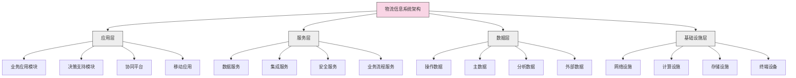

---
{"dg-publish":true,"tags":["供应链","物流信息系统","数据管理","系统集成","物流可视化"],"创建日期":"2024-04-27","permalink":"/知识共享/003_供应链/01_供应链基础/01_学习内容/05_物流与配送/5.6 物流信息系统/","dgPassFrontmatter":true}
---

物流信息系统是现代物流管理的神经中枢，通过信息技术连接和优化供应链各环节，实现资源的高效配置和精准决策。随着数字化转型的深入，物流信息系统已从简单的业务记录工具演变为企业核心竞争力的重要组成部分，为企业提供全面的可视化、分析和控制能力。

## 基础知识

### 物流信息系统的定义

物流信息系统(Logistics Information System, LIS)是指运用现代信息技术收集、存储、处理、传输和利用物流信息，支持物流决策与运营的系统。不同学者和机构对物流信息系统的定义略有差异：

- **美国物流管理协会(CSCMP)**：物流信息系统是收集、组织、分析和传播物流相关数据，支持物流活动规划、执行和控制的计算机化系统。

- **Lambert & Stock**：物流信息系统是由硬件、软件、人员和程序组成的集成体系，用于获取与处理支持物流管理决策的信息。

- **Bowersox & Closs**：物流信息系统是连接物流功能模块的技术基础设施，提供管理所需的事务处理、分析和协调功能。

物流信息系统的核心要素包括：

1. **信息采集**：通过各种硬件和技术获取物流活动数据
2. **信息处理**：对数据进行清洗、转换、整合和分析
3. **信息存储**：对数据进行结构化保存和管理
4. **信息传输**：实现系统内部和系统间的数据交换
5. **信息应用**：将处理后的信息用于决策支持和流程优化

### 物流信息系统的历史演变

物流信息系统随着信息技术的发展经历了几个主要阶段：

- **1960-1970年代**：早期的物流信息系统主要关注单一功能（如库存管理、订单处理），以批处理为主，系统间缺乏集成
  
- **1980-1990年代**：出现了功能更全面的物流软件，如仓库管理系统(WMS)、运输管理系统(TMS)，但仍以孤立系统为主

- **1990-2000年代**：企业资源规划(ERP)系统兴起，物流模块逐渐集成到企业整体系统中，实现了基本的跨部门集成

- **2000-2010年代**：供应链管理系统(SCM)发展成熟，强调端到端的供应链可视化和协同，引入更多决策支持功能

- **2010年代至今**：云计算、大数据、物联网等新技术广泛应用，物流信息系统更加智能化、网络化和实时化，支持预测分析和自动决策

### 物流信息系统的类型

根据功能和应用范围，物流信息系统可分为多种类型：

1. **按功能分类**：
   - **事务处理系统**：处理日常业务数据，如订单录入、库存记录
   - **管理信息系统**：提供结构化报表和分析，支持日常管理
   - **决策支持系统**：提供模拟分析和优化功能，支持战略决策
   - **专家系统**：包含领域知识，提供专业化解决方案和建议

2. **按应用范围分类**：
   - **单一功能系统**：如仓库管理系统(WMS)、运输管理系统(TMS)
   - **综合物流管理系统**：覆盖多个物流功能模块
   - **供应链管理系统**：跨越整个供应链网络的集成系统
   - **行业专用系统**：针对特定行业需求定制的物流系统

3. **按部署方式分类**：
   - **本地部署系统**：安装在企业内部服务器上
   - **云端系统**：通过互联网访问的SaaS服务
   - **混合系统**：结合本地部署和云服务的混合架构
   - **移动应用系统**：基于移动终端的物流应用

## 理论框架

### 物流信息系统架构

现代物流信息系统通常采用分层架构设计：

各层级主要功能：

1. **应用层**：面向用户的功能模块
   - 业务应用模块：订单管理、库存管理、运输管理等
   - 决策支持模块：报表、分析、仪表盘等
   - 协同平台：供应商门户、客户门户等
   - 移动应用：基于智能终端的应用程序

2. **服务层**：提供中间层业务服务
   - 数据服务：数据访问、转换和处理
   - 集成服务：内外部系统集成接口
   - 安全服务：身份认证、权限控制
   - 业务流程服务：工作流引擎、规则引擎

3. **数据层**：负责数据的存储和管理
   - 操作数据：日常交易和业务数据
   - 主数据：产品、客户、供应商等基础数据
   - 分析数据：历史数据、统计数据、预测数据
   - 外部数据：来自合作伙伴、市场等的外部信息

4. **基础设施层**：系统的硬件和网络基础
   - 网络设施：局域网、广域网、互联网接入
   - 计算设施：服务器、云计算资源
   - 存储设施：数据库服务器、存储阵列
   - 终端设备：计算机、移动设备、物联网设备

### 物流信息系统的关键技术

支撑现代物流信息系统的关键技术包括：

1. **自动识别技术**：
   - 条码技术：一维码、二维码
   - RFID技术：射频识别标签和读写器
   - 图像识别：光学字符识别、物体识别
   - 语音识别：声控操作和数据录入

2. **定位与跟踪技术**：
   - GPS/北斗卫星定位
   - 室内定位技术
   - 实时定位系统(RTLS)
   - 电子围栏技术

3. **移动通信技术**：
   - 蜂窝网络(4G/5G)
   - WiFi网络
   - 低功耗广域网(LPWAN)
   - 蓝牙/ZigBee等短距离通信

4. **数据处理技术**：
   - 大数据处理框架
   - 实时流处理
   - 数据挖掘和机器学习
   - 云计算和边缘计算

## 应用指南

### 物流信息系统规划流程

建设物流信息系统通常遵循以下流程：

1. **需求分析**
   - 梳理业务流程和信息流
   - 确定系统功能需求
   - 明确性能和安全要求
   - 分析与现有系统的集成需求

2. **系统规划**
   - 制定总体架构方案
   - 确定技术路线和平台选择
   - 规划实施阶段和优先级
   - 评估投资回报(ROI)

3. **系统设计**
   - 详细功能模块设计
   - 数据库结构设计
   - 界面和用户体验设计
   - 接口和集成设计

4. **系统实施**
   - 系统开发或配置
   - 数据准备和迁移
   - 系统测试和验收
   - 用户培训和文档准备

5. **上线与运维**
   - 系统部署和切换
   - 运行监控和问题处理
   - 性能优化和安全维护
   - 系统升级和功能扩展

### 物流信息系统主要模块功能

物流信息系统的主要功能模块及其特点：

1. **订单管理系统(OMS)**
   - 订单接收和处理
   - 订单状态跟踪
   - 订单履行分配
   - 订单绩效分析

2. **仓库管理系统(WMS)**
   - 库位管理
   - 入库和上架管理
   - 拣货和包装管理
   - 库存控制和盘点

3. **运输管理系统(TMS)**
   - 运输规划和路径优化
   - 承运商选择和管理
   - 装载优化
   - 运输跟踪和绩效评估

4. **配送管理系统(DMS)**
   - 配送路线规划
   - 车辆和人员调度
   - 配送状态跟踪
   - 交付确认和签收

5. **供应商管理系统(SRM)**
   - 供应商信息管理
   - 采购订单处理
   - 供应商绩效评估
   - 协同预测与补货

6. **物流成本管理系统**
   - 物流成本核算
   - 成本分析和控制
   - 预算管理
   - 价格管理和结算

7. **物流绩效管理系统**
   - KPI设置和监控
   - 绩效数据收集
   - 绩效分析和评估
   - 改进计划制定与跟踪

8. **物流可视化系统**
   - 库存可视化
   - 在途可视化
   - 运营状态可视化
   - 异常监控和预警

### 系统集成与数据交换标准

现代物流信息系统需要与多个内外部系统集成：

1. **内部系统集成**
   - 与ERP系统集成：共享主数据和业务数据
   - 与CRM系统集成：客户信息和订单服务
   - 与财务系统集成：成本核算和结算
   - 与生产系统集成：需求和供应协调

2. **外部系统集成**
   - 供应商系统：订单、库存和发货信息
   - 客户系统：订单和交付信息
   - 物流服务商系统：运输状态和费用
   - 监管机构系统：电子报关和合规数据

3. **常用数据交换标准**
   - EDI(电子数据交换)标准
   - XML/JSON格式
   - API接口标准
   - 行业特定标准(如GS1标准)

4. **集成架构模式**
   - 点对点集成
   - 企业服务总线(ESB)
   - API管理平台
   - 数据中台架构

### 物流数据分析方法

利用物流信息系统数据进行分析的主要方法：

1. **描述性分析**
   - 物流运营报表
   - 趋势分析
   - 库存分析
   - 成本结构分析

2. **诊断性分析**
   - 瓶颈分析
   - 根因分析
   - 偏差分析
   - 相关性分析

3. **预测性分析**
   - 需求预测
   - 运力预测
   - 库存预测
   - 成本预测

4. **规范性分析**
   - 路径优化
   - 库存优化
   - 资源配置优化
   - 风险管理决策

## 案例分析

### 案例1：亚马逊的全球物流信息系统

**背景**：亚马逊作为全球最大的电商企业，其物流信息系统是支撑其高效配送网络的核心。

**系统特点**：
- 全球化、一体化的物流信息架构
- 以预测分析为核心的智能决策系统
- 高度自动化的订单履行系统
- 实时库存管理和多层次补货策略

**关键技术**：
- 大数据处理平台处理每日数十亿条交易和日志
- 机器学习算法预测需求和优化库存分配
- 物联网技术实现全程物流可视化
- 机器人控制系统与仓库管理系统深度集成

**成效**：
- 订单处理时间从小时级缩短至分钟级
- 库存周转率显著提高，同时降低缺货率
- 配送路线和装载优化节约运输成本15%以上
- 建立了预测式物流模型，提前为需求做准备

### 案例2：联邦快递(FedEx)的包裹追踪系统

**背景**：联邦快递是最早实施全球包裹追踪系统的物流企业之一，其信息系统被视为行业标杆。

**系统特点**：
- 从揽收到交付的全程跟踪能力
- 多层次的信息处理架构
- 高度可靠的实时数据传输网络
- 面向客户的自助服务信息平台

**关键技术**：
- 条码和RFID技术实现包裹自动识别
- 分布式数据处理系统处理全球扫描数据
- 移动终端技术支持现场操作和数据采集
- 高可用性系统架构确保7*24小时服务

**成效**：
- 实现全球范围内的包裹实时跟踪
- 提高配送准确率至99.9%以上
- 显著降低客户查询成本
- 增强品牌差异化，建立服务竞争优势

### 案例3：马士基(Maersk)的集装箱追踪系统

**背景**：全球航运巨头马士基开发了基于区块链的集装箱追踪系统，解决国际物流中的信息透明性问题。

**系统特点**：
- 基于区块链的分布式账本技术
- 多方参与的信息共享平台
- 数字化的运输单证处理
- 端到端的集装箱追踪能力

**关键技术**：
- 区块链技术确保数据不可篡改和可追溯
- 智能合约自动执行预设的业务规则
- 物联网传感器提供集装箱位置和状态信息
- API接口实现与多方系统的集成

**成效**：
- 减少60%以上的文书工作
- 降低30%以上的行政处理成本
- 提高供应链可视性和透明度
- 显著减少货物延误和纠纷

### 案例4：京东物流的智能调度系统

**背景**：京东物流开发了基于AI的智能调度系统，优化最后一公里配送效率。

**系统特点**：
- 基于深度学习的路径优化引擎
- 动态调整的任务分配算法
- 自适应的运力规划模型
- 快速响应的异常处理机制

**关键技术**：
- 机器学习算法预测配送时间和路线
- 图计算技术优化路径规划
- 实时流处理平台处理订单和位置数据
- 移动应用实现与配送员的实时交互

**成效**：
- 配送效率提升25%
- 车辆里程减少15%
- 客户满意度提高20%
- 降低10%的运营成本

### 案例5：沃尔玛的全渠道库存管理系统

**背景**：沃尔玛开发了支持全渠道零售的库存管理系统，实现线上线下库存的统一管理。

**系统特点**：
- 统一的全渠道库存视图
- 智能的库存分配引擎
- 基于门店的履单能力
- 预测性的补货系统

**关键技术**：
- 大数据平台整合全渠道销售和库存数据
- 机器学习算法优化库存分配决策
- 边缘计算技术支持门店层面的决策
- 云架构确保系统可扩展性和弹性

**成效**：
- 库存准确率提高到99%以上
- 缺货率降低40%
- 全渠道订单履行成本降低20%
- 库存周转率提高25%

## 延伸内容

### 新兴技术在物流信息系统中的应用

物流信息系统正在整合多种新兴技术：

1. **人工智能技术**
   - 智能路径规划：结合交通和天气数据优化配送路线
   - 需求预测：利用深度学习提高预测准确性
   - 图像识别：自动识别包裹特征和损坏情况
   - 自然语言处理：支持语音指令和客户服务

2. **区块链技术**
   - 供应链透明度：记录产品从源头到目的地的全过程
   - 智能合约：自动执行物流交易和付款
   - 防伪溯源：确保产品真实性和来源可追溯
   - 分布式数据共享：多方安全共享物流信息

3. **物联网技术**
   - 智能集装箱：监控位置、温度、湿度等环境参数
   - 智能仓库：自动感知库存状态和环境条件
   - 车队管理：实时监控车辆状态和驾驶行为
   - 基础设施监控：监测物流设施的运行状况

4. **增强现实和虚拟现实**
   - 仓库拣选指导：AR眼镜引导高效准确拣选
   - 虚拟培训：通过VR培训新员工操作技能
   - 远程协助：专家远程指导现场问题解决
   - 仓库规划：VR环境模拟不同布局方案

### 物流信息安全

物流信息系统面临多种安全挑战及应对策略：

1. **安全威胁**
   - 数据泄露：客户、货物和交易信息泄露
   - 系统入侵：黑客攻击导致系统瘫痪
   - 内部威胁：员工误操作或恶意行为
   - 物理安全：硬件设备损坏或被窃

2. **防护措施**
   - 身份认证和访问控制
   - 数据加密和脱敏
   - 网络隔离和防火墙
   - 安全监控和审计
   - 定期安全测试和评估
   - 灾难恢复和业务连续性计划

3. **合规要求**
   - 数据保护法规(如GDPR)
   - 行业安全标准(如ISO27001)
   - 跨境数据传输规定
   - 电子签名和认证要求

### 物流信息系统ROI评估

物流信息系统投资回报评估方法：

1. **成本因素**
   - 初始投资：软硬件购置、实施费用
   - 运行成本：维护、升级、人员培训
   - 间接成本：业务中断、变更管理
   - 风险成本：系统失败、数据损失风险

2. **效益因素**
   - 直接效益：人工成本减少、库存降低
   - 间接效益：服务水平提升、决策质量提高
   - 战略效益：市场响应能力、竞争优势
   - 创新效益：新业务模式和收入来源

3. **评估方法**
   - 净现值(NPV)分析
   - 投资回收期计算
   - 总拥有成本(TCO)分析
   - 平衡记分卡评估

### 物流信息系统未来趋势

物流信息系统的发展趋势：

1. **智能化趋势**
   - 从数据分析到人工智能决策
   - 从被动响应到预测性操作
   - 从人工干预到自主系统

2. **生态化趋势**
   - 从封闭系统到开放平台
   - 从点对点集成到生态互联
   - 从企业系统到行业协同平台

3. **服务化趋势**
   - 从产品交付到持续服务
   - 从软件部署到平台订阅
   - 从固定功能到灵活扩展

4. **融合化趋势**
   - 物理世界与数字世界融合
   - 物流技术与信息技术融合
   - 多种新兴技术综合应用

## 学习资源

### 思考问题

1. 物流信息系统如何改变传统物流运营模式？现代企业应如何权衡物流信息系统的投资与收益？
2. 物流信息系统中的数据集成面临哪些主要挑战？如何解决不同系统间的数据标准和格式差异问题？
3. 物联网技术如何应用于物流信息系统？它为物流可视化带来了哪些新的可能性？
4. 如何设计物流信息系统的用户界面，使其既满足复杂业务需求又易于操作？
5. 在实施全新的物流信息系统时，企业应采取哪些措施降低实施风险和业务中断？
6. 移动技术如何改变物流信息系统的使用方式？移动应用为物流管理带来了哪些优势？
7. 如何确保物流信息系统中敏感数据的安全性？跨国物流信息系统应如何应对不同国家的数据保护法规？
8. 大数据分析如何帮助企业从物流数据中发现价值？企业应关注哪些关键的物流数据分析指标？
9. 区块链技术能否解决国际物流中的文档和信息流问题？实施区块链物流系统的主要障碍是什么？
10. 人工智能将如何重塑未来的物流信息系统？智能决策系统在物流优化中的潜力和局限是什么？
11. 云计算模式对物流信息系统有何影响？选择云部署时应考虑哪些关键因素？
12. 如何评估物流信息系统的性能和可靠性？应建立哪些关键指标来监控系统健康状况？
13. 物流信息系统如何支持绿色物流和可持续发展？哪些功能可以帮助企业降低物流环境影响？
14. 如何确保物流信息系统与企业长期战略目标的一致性？系统规划应考虑哪些未来发展因素？
15. 在全渠道零售环境下，物流信息系统应如何设计才能支持多渠道库存管理和订单履行？

### 自测题

1. 物流信息系统的主要目标是：
   a) 简化物流流程
   b) 降低物流成本
   c) 提高信息化水平
   d) 支持物流决策和优化运营

2. 以下哪项不是物联网技术在物流中的典型应用？
   a) 实时位置跟踪
   b) 温度湿度监控
   c) 员工绩效评估
   d) 设备状态监测

3. 数据集成最主要的目的是：
   a) 减少数据存储成本
   b) 提高数据处理速度
   c) 消除数据孤岛，提供统一视图
   d) 简化系统架构

4. 物流信息系统中的"可视化"主要指：
   a) 美观的用户界面设计
   b) 3D仓库建模
   c) 对物流状态和流程的直观展示和监控
   d) 视频监控系统的应用

5. 以下哪种技术最适合用于保证多方物流信息共享的可信度？
   a) 云计算
   b) 区块链
   c) 大数据分析
   d) 人工智能

### 实践练习

**练习1：物流信息系统需求分析与规划**

假设你是一家中型电商企业的物流经理，需要规划新的物流信息系统：
1. 分析企业的物流业务流程和信息需求
2. 确定系统的主要功能模块和优先级
3. 设计系统架构和关键技术选型
4. 评估潜在的实施风险和应对措施
5. 制定系统实施的分阶段计划
6. 设计关键绩效指标(KPIs)评估系统成效

**练习2：物流数据分析案例**

基于一家零售企业的物流数据（可以是模拟数据或公开数据集）：
1. 确定3-5个关键的物流分析问题
2. 设计数据分析方法和模型
3. 进行数据处理和分析（如有条件可使用Excel或其他工具）
4. 提出基于数据的物流优化建议
5. 设计数据可视化方案，展示分析结果
6. 讨论数据质量问题和改进方向

### 推荐阅读

1. Boyson, S., Harrington, L., & Corsi, T. (2004). Logistics and the Extended Enterprise: Benchmarks and Best Practices for the Manufacturing Professional. Wiley.
2. Bowersox, D. J., Closs, D. J., & Cooper, M. B. (2019). Supply Chain Logistics Management (5th ed.). McGraw-Hill Education.
3. Ptak, C. A., & Schragenheim, E. (2016). ERP: Tools, Techniques, and Applications for Integrating the Supply Chain (2nd ed.). CRC Press.
4. Poirier, C. C., & Bauer, M. J. (2000). E-Supply Chain: Using the Internet to Revolutionize Your Business. Berrett-Koehler Publishers.
5. Simchi-Levi, D., Kaminsky, P., & Simchi-Levi, E. (2008). Designing and Managing the Supply Chain: Concepts, Strategies, and Case Studies (3rd ed.). McGraw-Hill. 