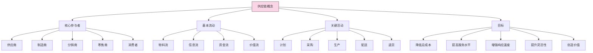
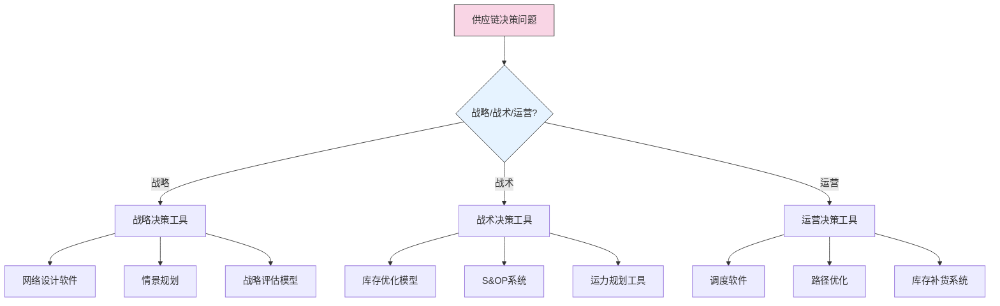

---
{"dg-publish":true,"tags":["供应链","笔记","基础概念","SCOR模型","供应链结构"],"创建日期":"2024-04-26","permalink":"/知识共享/003_供应链/01_供应链基础/02_笔记/01_供应链基础概念/1.1 供应链的定义/","dgPassFrontmatter":true}
---

## 供应链定义核心要点

### 基本定义
- **供应链**是连接供应商、制造商、分销商、零售商和消费者的**网络系统**
- 通过协调**物料流**、**信息流**和**资金流**，将产品/服务从原始供应商交付给最终用户
- 目标是实现**整体价值最大化**和**成本最小化**
- 本质上是一个**跨组织**的**端到端**流程

### 概念图解

## 重点内容归纳

### 权威定义对比

| 机构/学者 | 定义要点 | 独特视角 |
|-----------|---------|---------|
| **CSCMP** | 从原材料到最终用户的活动 | 强调**活动链**视角 |
| **APICS** | 提供产品或服务的全球网络 | 强调**网络**视角 |
| **MIT** | 多组织连接的价值创造网络 | 强调**价值创造** |
| **哈佛商学院** | 端到端价值创造流程 | 强调**端到端整合** |
| **中国物流与采购联合会** | 围绕核心企业的功能网链 | 强调**核心企业主导** |

### 供应链与相关概念区分

- **物流管理** vs **供应链管理**
  - 物流专注于物料移动和存储
  - 供应链包含物流，但范围更广（采购、生产、销售等）
  
- **供应链** vs **价值链**
  - 供应链强调多企业协作网络
  - 价值链侧重单一企业内部价值创造活动
  
- **供应链** vs **供应网络**
  - 供应链强调线性流程和关系
  - 供应网络体现更复杂的多维关系结构

## 供应链的核心结构

### 三大流动

1. **物料流**
   - 原材料、半成品、成品的实体移动
   - 从上游向下游流动
   - 通过运输、仓储、配送等实现

2. **信息流**
   - 订单、需求预测、库存数据等信息交换
   - 双向流动（上下游）
   - 通过ERP、EDI、物联网等技术支持

3. **资金流**
   - 支付、融资、投资等资金往来
   - 主要从下游向上游流动
   - 通过银行、支付系统、供应链金融实现

### SCOR模型核心流程（备忘速查）

| 流程 | 内容 | 关键活动 |
|------|------|---------|
| **计划 (Plan)** | 平衡需求与供应的规划活动 | 需求预测、库存规划、产能计划 |
| **采购 (Source)** | 获取产品与服务的活动 | 供应商选择、订单管理、收货 |
| **制造 (Make)** | 产品生产和加工活动 | 生产排程、生产执行、质量控制 |
| **配送 (Deliver)** | 产品交付给客户的活动 | 订单管理、仓储、运输、配送 |
| **退货 (Return)** | 产品退回和处理活动 | 退货授权、退货接收、处理 |
| **使能 (Enable)** | 支持其他流程的管理活动 | 规则管理、绩效管理、数据管理 |

## 行业供应链特点速查表

| 行业 | 关键特点 | 核心挑战 | 典型模式 |
|------|---------|---------|----------|
| **制造业** | 多级供应商、生产计划复杂 | 库存优化、供应商质量 | 计划型供应链 |
| **零售业** | 多SKU、季节性、促销频繁 | 需求预测、库存分配 | 响应型供应链 |
| **高科技** | 生命周期短、技术变革快 | 柔性生产、新品导入 | 敏捷供应链 |
| **医药** | 严格监管、可追溯要求高 | 质量控制、冷链管理 | 可靠型供应链 |
| **食品** | 保质期限制、食品安全 | 新鲜度管理、需求波动 | 高频补货型 |

## 应用工具箱

### 供应链分析常用方法（个人经验总结）

- **供应链映射**：可视化展示供应链结构和关系
- **价值流图**：识别增值与非增值活动
- **流程分析**：评估各环节效率和瓶颈
- **SCOR模型**：对标行业最佳实践
- **总成本分析**：计算供应链完整成本
- **ABC分析**：根据价值区分管理策略

### 决策支持工具（实践应用）

## 常见问题解决思路

1. **供应链定义不清晰**
   - 使用SCOR模型明确边界和范围
   - 进行端到端流程映射
   - 确定关键参与者和责任

2. **供应链结构不合理**
   - 分析产品特性和市场需求
   - 评估供应链响应策略与效率策略的适用性
   - 考虑行业特点和企业战略定位

3. **供应链管理与业务战略不匹配**
   - 明确业务战略要求（成本、服务、速度等）
   - 评估当前供应链配置与战略匹配度
   - 确定供应链转型路径和优先级

## 学习要点提示

- 供应链是**网络**不是单纯的链条
- 关注**流程**而非仅关注功能部门
- 供应链设计必须与**产品特性**和**市场需求**匹配
- 不同行业供应链有显著差异，避免简单套用
- 信息流是现代供应链的核心驱动力
- 供应链管理必须支持企业整体战略 