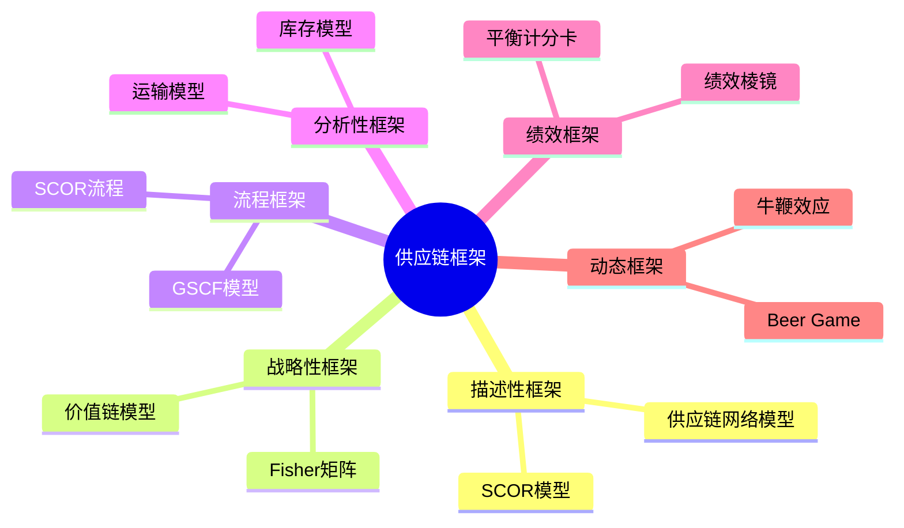

---
{"dg-publish":true,"tags":["供应链","理论框架","SCOR模型","价值链模型","笔记"],"创建日期":"2024-04-26","permalink":"/知识共享/003_供应链/01_供应链基础/02_笔记/01_供应链基础概念/1.3 供应链框架与模型/","dgPassFrontmatter":true}
---

# 供应链框架与模型笔记

## 核心框架概述

## SCOR模型要点

- **定义**：供应链运营参考模型，行业标准框架
- **开发者**：供应链管理委员会(SCC，现并入ASCM)
- **核心组成**：
  - 流程(Plan, Source, Make, Deliver, Return, Enable)
  - 绩效(可靠性, 响应性, 敏捷性, 成本, 资产管理)
  - 实践(最佳实践库)
  - 人员(技能和能力)
- **层级结构**：
  - 第1层：流程类型
  - 第2层：流程类别
  - 第3层：流程要素
  - 第4层：企业实施
- **主要优势**：标准化流程定义，共同语言，绩效对标
- **应用场景**：流程优化，绩效评估，标准化

## 价值链模型要点

- **定义**：描述企业如何创造价值的框架
- **开发者**：Michael Porter (1985)
- **核心活动**：
  - 主要活动：入厂物流、运营、出厂物流、市场营销、服务
  - 支持活动：企业基础设施、人力资源、技术开发、采购
- **关键概念**：
  - 价值增值活动
  - 边际价值
  - 竞争优势来源
- **与供应链关系**：供应链是多个企业价值链的连接
- **应用场景**：战略分析，竞争优势识别，价值流分析

## GSCF模型要点

- **定义**：全球供应链论坛模型，关注企业间关系管理
- **开发者**：Douglas Lambert, Ohio State University
- **三大元素**：
  - 供应链网络结构
  - 供应链业务流程(8个)
  - 管理组件
- **与SCOR对比**：
  - SCOR：交易导向，运营效率
  - GSCF：关系导向，战略整合
- **优势**：战略视角，关系管理框架
- **挑战**：实施复杂，抽象度高

## Fisher战略模型要点

- **核心思想**：供应链战略应匹配产品特性
- **产品分类**：
  - 功能型：稳定需求，长生命周期(食品、日用品)
  - 创新型：波动需求，短生命周期(时尚、电子)
- **供应链战略**：
  - 高效型：最小成本，高周转(适合功能型产品)
  - 响应型：快速响应，灵活性(适合创新型产品)
- **关键应用**：产品-供应链匹配分析，策略选择

## 库存管理模型要点

- **EOQ模型**：经济订货量 = √(2DS/H)
  - D = 年需求量，S = 订货成本，H = 持有成本
- **安全库存模型**：SS = Z × σ × √LT
  - Z = 服务水平系数，σ = 需求标准差，LT = 提前期
- **(s,Q)控制策略**：库存低于s时，订购Q单位
- **(s,S)控制策略**：库存低于s时，补充至S水平
- **(R,S)控制策略**：每隔R时间，补充至S水平

## 绩效棱镜模型要点

- **五个关联方面**：
  - 来源满意度
  - 内部效率
  - 流程集成
  - 客户满意度
  - 持续改进
- **特点**：平衡多视角评估
- **优势**：关注供应链多方视角

## 牛鞭效应模型要点

- **定义**：需求信息沿供应链传递时波动被放大
- **主要原因**：需求预测更新、订单批量、价格波动、短缺博弈
- **缓解方法**：信息共享、VMI、CPFR、预测改进

## 框架选择指南

| 目标 | 推荐框架 | 关注点 |
|------|---------|-------|
| 战略规划 | Fisher矩阵、价值链 | 产品特性匹配，竞争优势 |
| 流程优化 | SCOR模型 | 标准流程，最佳实践 |
| 关系管理 | GSCF模型 | 企业协作，共同价值创造 |
| 绩效评估 | 绩效棱镜，平衡计分卡 | 多维度评估，基准对比 |
| 库存优化 | 库存控制模型 | 成本与服务平衡 |
| 网络设计 | 供应链网络模型 | 结构优化，设施布局 |

## 新兴框架趋势

- **数字供应链模型**：整合物理流与信息流，关注端到端可视化
- **循环供应链框架**：基于循环经济，关注材料回收与再利用
- **弹性供应链模型**：平衡效率与风险，强调抗干扰能力
- **平台型供应链**：生态系统思维，资源共享，协作网络

## 框架应用要点

- **选择框架**：考虑目的、企业情况、行业特点
- **定制调整**：保持核心原则，适应企业需求
- **整合应用**：综合多框架优势，战略-战术-运营联动
- **实施步骤**：准备、诊断、设计、实施、评估与改进
- **常见挑战**：复杂度管理、变革阻力、数据质量、缺乏专业知识

## 成功案例速记

- **宝洁**：SCOR模型应用于全球流程标准化与绩效管理
- **戴尔**：价值链重构，直销模式创新，供应商整合
- **亚马逊**：差异化库存策略，响应型供应链，多层级库存网络
- **丰田**：多框架整合，价值流+看板+SCOR+供应商整合
- **联合利华**：GSCF模型应用于全球供应链关系管理 