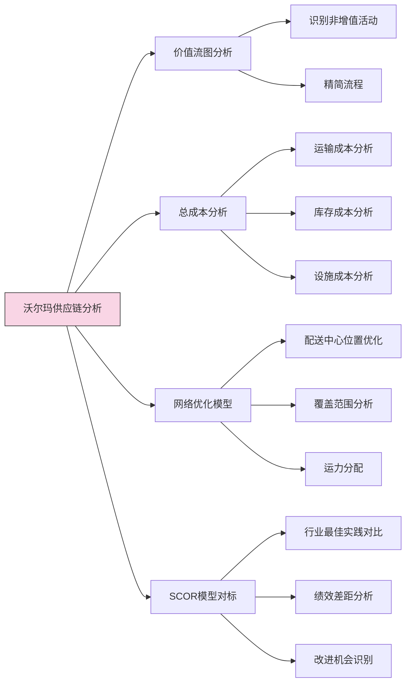
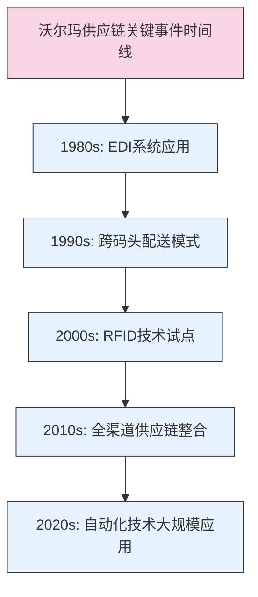
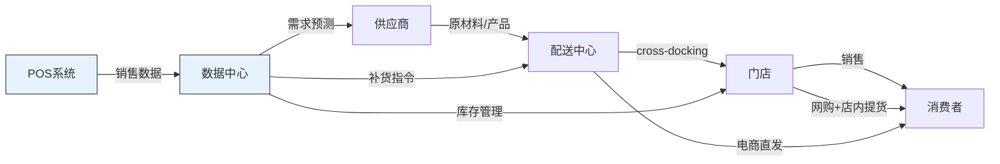

---
{"dg-publish":true,"tags":["供应链","案例分析","沃尔玛","零售业","跨码头配送","全球采购"],"创建日期":"2024-04-26","permalink":"/知识共享/003_供应链/01_供应链基础/03_案例/01_供应链基础概念/1.1 沃尔玛全球供应链案例/","dgPassFrontmatter":true}
---

# 沃尔玛全球供应链卓越案例分析

## 案例背景

### 企业背景

沃尔玛(Walmart)成立于1962年，目前是全球最大的零售企业，2023财年全球营收超过6110亿美元，拥有约10,500家门店，分布在24个国家和地区，全球员工约220万人。沃尔玛的商业模式基于"低价领导"战略，其核心竞争优势之一就是高效的供应链管理。

### 供应链管理体系发展历程

沃尔玛供应链管理系统的发展经历了四个关键阶段：

1. **基础建设阶段(1960-1980年代)**
   - 建立配送中心网络，减少对批发商依赖
   - 发展自有卡车队，控制物流运输
   - 初步引入计算机系统管理库存

2. **技术驱动阶段(1980-1990年代)**
   - 率先在零售业全面应用EDI(电子数据交换)
   - 建立卫星通信网络连接所有门店和配送中心
   - 引入跨码头配送(Cross-docking)模式

3. **全球扩张阶段(1990-2000年代)**
   - 建立全球采购网络，直接从制造国采购
   - 发展"本地化+全球化"的混合供应链策略
   - 推动RFID技术应用和供应商协作计划

4. **数字转型阶段(2000年至今)**
   - 发展全渠道供应链能力
   - 建立电子商务物流网络
   - 应用大数据分析和人工智能技术
   - 推动供应链可持续发展

### 市场环境和竞争格局

沃尔玛供应链发展的背景环境包括：

- **零售行业变革**：实体零售向全渠道零售转型，电商快速发展
- **消费者行为变化**：消费者期望更多选择、更快配送、更优体验
- **全球化趋势**：全球采购成为主流，供应链更加复杂和全球化
- **技术快速变革**：信息技术、自动化技术快速发展并应用于供应链
- **主要竞争对手**：亚马逊、Target、Costco等，各自发展差异化供应链策略

### PESTEL分析

沃尔玛供应链所处的宏观环境：

| 因素 | 影响分析 |
|------|---------|
| **政治因素** | 贸易政策变化、全球贸易摩擦增加了供应链管理复杂性 |
| **经济因素** | 全球经济波动影响消费能力和供应成本，通胀压力增加 |
| **社会因素** | 消费者更注重便利性、速度和可持续性，推动供应链变革 |
| **技术因素** | 数字技术、自动化技术重塑供应链运营模式 |
| **环境因素** | 环保意识提升，对供应链碳足迹和可持续性提出更高要求 |
| **法律因素** | 劳工法规、反垄断法、隐私法规等影响供应链合规管理 |

## 挑战与机遇识别

### 核心挑战

沃尔玛作为全球最大的零售商，在供应链管理中面临以下核心挑战：

1. **规模与复杂性挑战**
   - 每天处理数千万个SKU和数亿交易
   - 管理来自全球数万供应商的复杂供应网络
   - 协调不同国家/地区的本地化与标准化

2. **成本压力**
   - 低价策略要求持续降低供应链成本
   - 劳动力、燃料和原材料成本上涨
   - 维持薄利多销模式下的盈利能力

3. **全渠道整合**
   - 线上线下供应链协同
   - 快速发展的电商业务对传统供应链提出挑战
   - 满足消费者对"随时随地"购物的期望

4. **竞争加剧**
   - 亚马逊等电商巨头在物流速度上的竞争
   - 折扣零售商差异化竞争
   - 技术驱动的供应链创新竞争

### 战略机遇

同时，沃尔玛也识别并把握了多项战略机遇：

1. **数字化转型机遇**
   - 利用大数据和AI技术提升需求预测准确性
   - 借助物联网技术实现供应链可视化
   - 通过区块链等技术提高供应链透明度

2. **全球采购优势**
   - 利用规模优势获取更优采购条件
   - 发展直接采购，减少中间环节
   - 全球寻源优化产品组合和成本结构

3. **供应链创新**
   - 发展新型配送模式满足电商需求
   - 自动化技术应用提升效率
   - 发展可持续供应链提升品牌价值

4. **合作共赢**
   - 与供应商建立战略合作伙伴关系
   - 通过信息共享实现协同效应
   - 开发供应商能力提升整体供应链绩效

### 多角度形势评估

从不同视角评估沃尔玛的供应链形势：

1. **供应链视角**：
   - **优势**：规模经济、垂直整合、强大的物流网络
   - **劣势**：系统复杂性、地区差异管理、传统零售背景

2. **战略视角**：
   - **优势**：与低成本战略高度一致、长期发展视角
   - **劣势**：转型速度相对较慢、历史包袱较重

3. **运营视角**：
   - **优势**：标准化运营、高效率执行、成本控制能力
   - **劣势**：灵活性不足、创新实施周期长

## 供应链策略分析

### 核心供应链战略

沃尔玛供应链战略基于以下几个核心支柱：

1. **供应商协作与整合**
   - **供应商关系管理**：建立长期战略伙伴关系，而非传统的对抗式谈判
   - **供应商集中计划(VMI)**：供应商直接管理沃尔玛货架上的库存
   - **持续补货计划(CRP)**：基于POS数据的自动补货系统

2. **配送网络优化**
   - **跨码头配送(Cross-docking)**：产品直接从供应商车辆转移到门店专用车辆，最小化仓储环节
   - **配送中心战略布局**：科学选址，覆盖半径通常不超过150英里
   - **物流整合**：自有车队与外包物流的最优组合

3. **信息技术驱动**
   - **数据共享**：与供应商共享POS数据和预测信息
   - **需求驱动**：基于实际销售数据的拉动式补货
   - **系统集成**：全球统一的IT系统支持跨区域协同

4. **成本领导战略**
   - **精益运营**：消除浪费，优化流程
   - **规模经济**：集中采购，降低单位成本
   - **标准化**：统一流程和系统，提高效率

### 战略决策的逻辑和假设

沃尔玛供应链战略基于以下关键假设：

1. **信息共享假设**：共享准确、实时的信息可以显著减少供应链不确定性和牛鞭效应
2. **规模经济假设**：集中采购和大批量运输可以降低单位成本
3. **效率驱动假设**：通过精简流程和减少库存可以获得持续的成本优势
4. **协作共赢假设**：与供应商的协作能够创造更大的整体价值

### 供应链分析工具应用

沃尔玛供应链策略制定中应用了多种分析工具：

### 供应链战略与企业目标一致性

沃尔玛供应链战略与企业整体目标高度一致：

| 企业战略目标 | 支持的供应链策略 | 一致性体现 |
|-------------|----------------|-----------|
| **低价领导** | 供应链成本优化、规模经济采购 | 直接降低产品成本，支持低价策略 |
| **产品丰富度** | 高效配送网络、供应商多样化 | 支持更多SKU的高效管理 |
| **便利购物体验** | 高库存可用性、快速补货 | 确保产品上架，减少缺货 |
| **全渠道发展** | 多种配送模式、全渠道库存共享 | 支持线上线下一体化体验 |
| **国际扩张** | 全球采购网络、标准化流程 | 支持国际市场快速进入和高效运营 |

## 实施过程

### 关键实施步骤与时间线

沃尔玛供应链管理体系的实施经历了以下关键阶段：

- **1970年代**：建立自有配送中心和运输车队
- **1980年代**：
  - 1983年：引入第一个全公司范围的计算机系统
  - 1987年：建立卫星通信网络连接所有设施
  - 1989年：开始实施EDI与供应商的信息共享

- **1990年代**：
  - 1992年：大规模实施跨码头配送模式
  - 1995年：推出"沃尔玛零售联接"供应商协作平台
  - 1998年：启动全球采购计划

- **2000年代**：
  - 2003年：试点RFID技术应用
  - 2005年：引入可持续发展指标评估供应商
  - 2009年：建立供应链碳足迹跟踪系统

- **2010年代**：
  - 2013年：启动全渠道物流整合计划
  - 2016年：引入区块链技术追踪食品供应链
  - 2018年：推出"门店履行"模式支持电商配送

- **2020年代**：
  - 2020年：加速仓库自动化技术应用
  - 2021年：推出Walmart+ 会员服务与配送网络升级
  - 2022年：扩大本地化履单能力，75%的美国人口30分钟可达

### 实施挑战及应对策略

在供应链变革实施过程中，沃尔玛面临并克服了多项挑战：

1. **全球扩张与本地化平衡**
   - **挑战**：如何在不同市场保持标准化的同时适应本地需求
   - **应对**：采用"强核心、灵边缘"模式，核心系统统一，本地运营灵活调整

2. **供应商关系转型**
   - **挑战**：从传统的压价模式转变为协作共赢关系
   - **应对**：建立供应商发展项目，共同制定KPI，分享数据和最佳实践

3. **技术系统整合**
   - **挑战**：全球不同区域系统整合，新旧系统衔接
   - **应对**：分阶段实施，建立全球IT标准，允许必要的本地定制

4. **电商与传统零售供应链整合**
   - **挑战**：传统供应链难以满足电商配送速度和灵活性要求
   - **应对**：发展混合配送模式，利用门店网络实现"最后一公里"配送

### 资源配置与组织调整

为支持供应链转型，沃尔玛进行了以下资源配置和组织调整：

1. **资本投入**：
   - 每年约80-100亿美元的供应链相关资本支出
   - 大量投资于物流基础设施、技术系统和自动化设备

2. **组织架构调整**：
   - 设立全球供应链副总裁职位，直接向CEO汇报
   - 建立矩阵式供应链管理结构，兼顾全球标准与地区响应
   - 将电商供应链与传统零售供应链整合管理

3. **人才发展**：
   - 建立供应链人才培养项目
   - 引进科技和分析人才加强数字化能力
   - 与高校合作建立供应链管理培训项目

4. **流程再造**：
   - 简化审批流程，提高决策速度
   - 标准化关键流程，减少区域差异
   - 建立端到端流程管理体系，打破功能壁垒

### 关键成功因素

沃尔玛供应链实施成功的关键因素包括：

1. **高层支持与战略一致性**：
   - 供应链战略被视为核心竞争力，获得董事会和高管团队持续支持
   - 供应链目标与企业整体战略保持高度一致

2. **长期视角**：
   - 愿意进行长期投资，不仅关注短期收益
   - 持续改进而非一次性大变革，确保稳定过渡

3. **数据驱动决策**：
   - 建立全面的供应链数据收集和分析能力
   - 基于数据和事实而非直觉进行决策

4. **协作文化**：
   - 跨部门协作解决复杂问题
   - 与供应商建立基于信任的合作关系
   - 注重知识分享和最佳实践推广

5. **技术赋能**：
   - 将技术视为变革的关键驱动力
   - 愿意尝试和应用新兴技术
   - 技术应用与业务需求紧密结合

## 结果评估

### 短期与长期效果

沃尔玛供应链变革产生的效果可分为短期和长期两个层面：

**短期效果(1-3年)**：
- 库存周转率提高25-30%
- 供应链成本降低3-5%
- 商品上架时间缩短50%
- 配送准时率提升至95%以上
- 缺货率降低至3%以下

**长期效果(3-10年)**：
- 建立了可持续的成本优势，支持低价战略
- 发展了适应全渠道的供应链能力
- 优化了全球采购网络，提高了采购杠杆
- 建立了行业领先的供应链人才库
- 形成了难以复制的供应链核心竞争力

### 数据支持的绩效评估

以下数据展示了沃尔玛供应链变革的显著成果：

| 绩效指标 | 变革前 | 变革后 | 提升幅度 | 行业平均 |
|---------|-------|-------|---------|---------|
| **库存周转率(次/年)** | 6-7 | 8-10 | 约40% | 4-5 |
| **库存准确率** | 90% | 99% | 9个百分点 | 92% |
| **配送成本(占销售额%)** | 3-4% | 2-2.5% | 约35% | 4-5% |
| **订单履行周期(天)** | 7-10 | 2-3 | 约70% | 5-7 |
| **可追溯性覆盖率** | 60% | 95% | 35个百分点 | 70% |
| **供应链碳排放(同比)** | 基准 | -15% | 15% | -5% |

### 预期与实际结果的差异

沃尔玛在供应链变革中也遇到了一些预期与实际的差距：

1. **RFID技术应用**：
   - **预期**：全面应用RFID技术实现自动化跟踪
   - **实际**：成本和技术挑战导致仅在部分高价值品类应用
   - **调整**：转向选择性应用策略，优先考虑投资回报高的领域

2. **国际市场标准化**：
   - **预期**：全球统一供应链流程和系统
   - **实际**：文化差异和本地市场需求导致无法完全统一
   - **调整**：采用"80/20原则"，80%标准化，20%本地化

3. **全渠道整合速度**：
   - **预期**：3-5年完成线上线下供应链整合
   - **实际**：整合过程更加复杂，耗时更长
   - **调整**：分阶段实施，优先关注客户体验关键点

### 利益相关者影响评估

沃尔玛供应链变革对各利益相关者产生了不同影响：

1. **消费者**：
   - 产品价格保持低位
   - 产品可用性提高
   - 购物体验更加便捷
   - 产品质量与安全性提升

2. **供应商**：
   - 需适应更严格的供应链要求
   - 获得更稳定、可预测的订单
   - 通过信息共享提高自身运营效率
   - 建立更紧密的战略合作关系

3. **员工**：
   - 工作方式和技能要求变化
   - 更多的技术应用和自动化
   - 需要不断学习新能力
   - 部分传统岗位减少，新岗位增加

4. **股东**：
   - 供应链效率提升带来利润增长
   - 竞争优势加强，市场份额提升
   - 长期增长潜力增强
   - 运营风险降低

5. **社区与环境**：
   - 物流活动环境影响得到更好管理
   - 当地就业机会变化
   - 通过可持续采购实践带来正面影响
   - 供应链合规性提升

## 经验教训提炼

### 成功经验总结

沃尔玛供应链管理的成功经验可归纳为以下几点：

1. **信息共享的价值**
   - 与供应商共享销售和预测数据创造双赢
   - 实时数据驱动决策，减少供应链中的不确定性
   - 透明度提升带来更高的信任和协作效率

2. **规模化精益运营**
   - 标准化流程可大幅提升效率
   - 持续改进文化是长期成功的关键
   - 规模优势与运营卓越相结合产生倍增效应

3. **创新物流模式的威力**
   - 跨码头配送等创新模式可显著降低成本
   - 配送网络设计对整体效率至关重要
   - 根据产品特性选择合适的物流模式

4. **技术投资的长期收益**
   - 前瞻性技术投资带来长期竞争优势
   - IT系统是现代供应链的核心基础设施
   - 技术应用要与业务流程紧密结合

### 普适性原则

从沃尔玛案例中可提炼出适用于其他企业的普适性原则：

1. **供应链战略必须支持业务战略**
   - 沃尔玛的供应链战略与低价战略完美契合
   - 供应链设计应基于企业整体价值主张

2. **信息流是供应链效率的关键驱动力**
   - 提高信息流质量和速度比仅优化物料流更重要
   - 投资于信息系统和数据分析能力至关重要

3. **供应商关系管理是战略议题**
   - 将供应商视为合作伙伴而非对手
   - 共同创造价值比单纯压价更有效

4. **简单有效优于复杂完美**
   - 沃尔玛专注于执行少数关键策略
   - 宁可完美执行简单策略，也不要一般性地执行复杂策略

5. **平衡标准化与灵活性**
   - 核心流程标准化，边缘能力保持灵活
   - 允许必要的本地化调整，同时维持全球一致性

### 决策重新思考

如果可以重新制定决策，沃尔玛可能会做出以下调整：

1. **更早拥抱电子商务**
   - 更早开始建设电商供应链能力
   - 在亚马逊崛起前建立更强的线上线下整合优势

2. **更加平衡的全球化策略**
   - 对不同市场采取更差异化的策略
   - 更快放弃不适合的国际市场(如德国、韩国)

3. **更早投资自动化技术**
   - 在劳动力成本上升前更大规模投资自动化
   - 建立更强的内部技术能力，减少对外部供应商依赖

4. **更加注重可持续性**
   - 更早将可持续发展纳入供应链战略核心
   - 利用规模优势引领行业可持续实践

## 延伸思考

### 深度讨论问题

1. **沃尔玛供应链模式是否适用于所有零售业态？**
   - 考虑不同零售业态的特点和需求
   - 分析沃尔玛模式的前提条件和适用范围
   - 探讨需要做出哪些调整来适应不同业态

2. **在全球供应链风险加剧的环境下，沃尔玛的供应链韧性如何？**
   - 评估沃尔玛应对供应链中断的能力
   - 分析全球化与区域化平衡策略的演变
   - 探讨未来可能采取的风险管理策略

3. **电商巨头亚马逊与沃尔玛的供应链竞争将如何演变？**
   - 比较两家公司供应链模式的优劣势
   - 分析两种模式的融合趋势
   - 预测未来零售供应链的发展方向

4. **数字技术将如何进一步重塑沃尔玛的供应链？**
   - 探讨AI、物联网、区块链等技术的潜在应用
   - 分析数字孪生等概念在零售供应链中的价值
   - 预测技术驱动的供应链变革路径

5. **沃尔玛如何平衡供应链效率与可持续发展目标？**
   - 分析成本驱动与可持续发展之间的潜在冲突
   - 探讨如何将ESG目标融入供应链决策
   - 评估消费者对可持续供应链的支付意愿变化

### 跨行业应用借鉴

沃尔玛供应链管理的经验可以借鉴应用于其他行业：

1. **制造业**：
   - 应用信息共享机制减少库存和提高响应速度
   - 采用类似"跨码头配送"的精益流程减少非增值环节
   - 利用规模经济和供应商协作降低采购成本

2. **电子商务**：
   - 借鉴混合配送模式，整合不同渠道的库存
   - 应用数据分析提高需求预测准确性
   - 采用标准化流程管理复杂供应网络

3. **医疗健康**：
   - 实施类似的供应商协作计划降低医疗物资成本
   - 应用跟踪技术提高供应链可视性和可追溯性
   - 建立集中配送中心提高医疗物资分配效率

4. **快消品行业**：
   - 采用类似的持续补货计划减少库存
   - 实施数据共享提高需求预测准确性
   - 优化配送网络设计降低物流成本

### 未来趋势与挑战

沃尔玛供应链面临的未来趋势和挑战：

1. **供应链去全球化和区域化**
   - 贸易壁垒和地缘政治风险推动供应网络重构
   - 近岸外包和友岸外包可能替代部分全球采购
   - 区域供应链弹性将成为关键考量

2. **无人化和自动化加速**
   - 仓库自动化和机器人技术全面应用
   - 无人配送技术逐步成熟并应用
   - 人机协作模式重塑供应链劳动力结构

3. **可持续供应链要求提高**
   - 碳排放限制和披露要求更加严格
   - 循环经济理念融入供应链设计
   - 消费者对可持续产品需求增加

4. **全渠道无缝整合**
   - 线上线下体验更加融合
   - 最后一公里配送创新持续涌现
   - 即时配送成为标准服务

5. **数据驱动的端到端可视化**
   - 供应链全链条实时可视化
   - 预测性分析和人工智能优化决策
   - 数字孪生技术模拟和优化供应链

## 数据可视化

### 沃尔玛供应链绩效趋势

### 沃尔玛供应链流程图

## 参考资料

1. Walmart Inc. (2023). "Annual Report 2023". Walmart Investor Relations.

2. Chopra, S., & Meindl, P. (2022). "Supply Chain Management: Strategy, Planning, and Operation", 7th Edition, Pearson.

3. Harvard Business School (2021). "Walmart's Omnichannel Strategy: Revolution in Retail". HBS Case Study.

4. Waller, M., Johnson, M. E., & Davis, T. (1999). "Vendor-managed inventory in the retail supply chain". Journal of business logistics, 20(1), 183-203.

5. Walmart Inc. (2022). "Environmental, Social and Governance Report 2022". Corporate Website.

6. Gilmore, D. (2020). "Supply Chain Digest: Walmart Supply Chain History". Supply Chain Digest.

7. Roberts, B., & Berg, N. (2012). "Walmart: Key Insights and Practical Lessons from the World's Largest Retailer". Kogan Page Publishers.

8. Supply Chain Digital (2022). "Evolution of Walmart's Supply Chain Strategy". Supply Chain Digital Magazine, June 2022.

9. Gartner (2023). "The Gartner Supply Chain Top 25 for 2023". Gartner Research. 