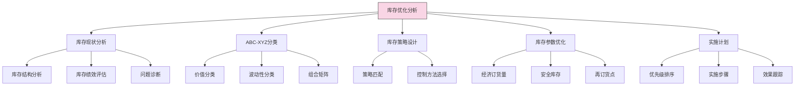
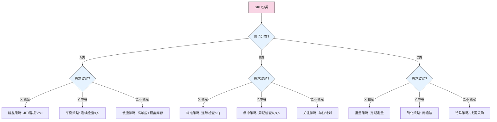

---
{"dg-publish":true,"tags":["供应链","模板","库存管理","EOQ","安全库存","分析工具"],"创建日期":"2024-04-26","permalink":"/知识共享/003_供应链/01_供应链基础/04_模板/03_库存管理/3.1 库存优化分析模板/","dgPassFrontmatter":true}
---


# 库存优化分析模板

## 模板概述

本模板提供了一个系统化的库存分析和优化框架，帮助企业确定最优库存水平、订货策略和库存控制方法。适用于制造业、零售业、批发分销等需要进行专业库存管理的企业。通过本模板，可以实现库存成本降低、服务水平提升和资金占用减少的多重目标。

### 适用场景

- 多品类SKU库存优化
- 供应链库存结构调整
- 安全库存水平重新设定
- 季节性产品库存规划
- 多级库存网络优化

### 主要特点和优势

- 结合ABC分类的差异化管理策略
- 集成经济订货量和安全库存计算
- 提供多种库存策略的决策支持
- 包含库存绩效评估和对标分析
- 设计简洁实用，易于实施

## 前期准备

### 所需数据清单

| 数据类别 | 具体数据项 | 数据来源 | 时间范围 |
|---------|-----------|----------|----------|
| **产品数据** | 产品编号、名称、规格、单位 | ERP/商品主数据 | 当前有效数据 |
| | 产品分类、生命周期阶段 | 产品管理系统 | 当前有效数据 |
| | 单位成本、售价、利润率 | 财务/ERP系统 | 最近3-6个月 |
| **需求数据** | 历史销售数据(日/周/月) | ERP/销售系统 | 过去12-24个月 |
| | 需求预测数据 | 预测系统 | 未来3-6个月 |
| | 需求波动性指标 | 计算生成 | 过去12个月 |
| **库存数据** | 当前库存水平 | WMS/库存系统 | 当前数据 |
| | 历史库存水平 | WMS/库存系统 | 过去12个月 |
| | 库存周转率 | 计算生成 | 过去12个月 |
| **供应数据** | 供应商交货周期 | 采购系统 | 最近6-12个月 |
| | 交货周期波动性 | 计算生成 | 最近6-12个月 |
| | 最小起订量/批量 | 采购系统/合同 | 当前有效数据 |
| **成本数据** | 订货成本(每次) | 财务/采购系统 | 当前有效数据 |
| | 库存持有成本率(%) | 财务系统 | 当前有效数据 |
| | 缺货成本/影响 | 财务/客服系统 | 估算值 |
| **服务水平** | 目标服务水平(%) | 企业战略/部门目标 | 当前目标 |
| | 实际服务水平(%) | 计算生成 | 过去3-6个月 |

### 团队角色与职责

- **项目负责人**：负责整体库存优化项目协调
- **供应链分析师**：负责数据分析和模型构建
- **库存管理专家**：提供库存管理专业知识
- **需求计划人员**：提供需求预测和波动性分析
- **财务代表**：提供成本数据和投资回报分析
- **IT支持**：提供数据提取和系统实施支持

## 分析结构

### 库存分析整体框架



### 分析模块说明

1. **库存现状分析**：评估当前库存状况和绩效，识别关键问题
2. **ABC-XYZ分类**：基于价值和波动性对SKU进行分类，确定差异化管理策略
3. **库存策略设计**：为不同类别的SKU选择合适的库存策略和控制方法
4. **库存参数优化**：计算最优订货量、安全库存水平和再订货点
5. **实施计划**：制定优化方案的实施步骤、优先级和效果跟踪方法

## 核心分析模块

### 1. 库存现状分析

#### 1.1 库存结构分析

| 分析维度 | 分析方法 | 分析指标 | 解读要点 |
|---------|---------|---------|---------|
| **总体库存** | 库存金额和单位趋势分析 | 库存总额、增长率 | 库存是否持续增长或波动 |
| **库存构成** | 库存分类占比分析 | 各类库存占比、变化趋势 | 识别高占比库存类别 |
| **库存分布** | 库存地点/仓库分布 | 各地点库存占比 | 库存是否合理分布 |
| **库龄分析** | 库存时间分布 | 库龄结构、呆滞库存比例 | 识别潜在积压风险 |

#### 1.2 库存绩效评估表

| 绩效指标 | 计算公式 | 当前值 | 行业标杆 | 差距 | 
|---------|---------|-------|---------|------|
| **库存周转率** | 年销售成本/平均库存 | [填写] | [填写] | [计算] |
| **库存周转天数** | 365/库存周转率 | [填写] | [填写] | [计算] |
| **存货占营收比** | 总库存/年营业收入 | [填写] | [填写] | [计算] |
| **服务水平** | 按时交付订单数/总订单数 | [填写] | [填写] | [计算] |
| **库存准确率** | 实际库存准确记录比例 | [填写] | [填写] | [计算] |
| **呆滞库存比例** | 6个月无移动库存/总库存 | [填写] | [填写] | [计算] |

#### 1.3 问题诊断清单

- [ ] 库存总量过高
- [ ] 库存结构不合理
- [ ] 服务水平不达标
- [ ] 库存周转率过低
- [ ] 呆滞/过期库存比例高
- [ ] 库存分布不均衡
- [ ] 库存管理流程问题
- [ ] 需求预测准确性低
- [ ] 供应不稳定性高
- [ ] 库存策略不明确
- [ ] 缺乏差异化管理
- [ ] 其他: [填写]

### 2. ABC-XYZ分类分析

#### 2.1 ABC分类（基于价值）

| 类别 | 定义标准 | 管理特点 | 典型例子 |
|------|---------|---------|----------|
| **A类** | 占总价值约70%的20%SKU | 严格控制、频繁审查 | [填写] |
| **B类** | 占总价值约20%的30%SKU | 定期审查、标准流程 | [填写] |  
| **C类** | 占总价值约10%的50%SKU | 简化管理、批量处理 | [填写] |

**ABC分类计算表格**

| SKU编号 | 产品名称 | 年销售量 | 单位价值 | 年销售额 | 销售额占比 | 累计占比 | 分类 |
|--------|---------|---------|---------|---------|----------|----------|------|
| [SKU1] | [填写] | [填写] | [填写] | [计算] | [计算] | [计算] | [判定] |
| [SKU2] | [填写] | [填写] | [填写] | [计算] | [计算] | [计算] | [判定] |
| ... | ... | ... | ... | ... | ... | ... | ... |

#### 2.2 XYZ分类（基于波动性）

| 类别 | 定义标准 | 管理特点 | 典型例子 |
|------|---------|---------|----------|
| **X类** | 需求稳定，变异系数<0.5 | 适合自动补货、低安全库存 | [填写] |
| **Y类** | 需求波动中等，变异系数0.5-1 | 需要更多关注、适度安全库存 | [填写] |
| **Z类** | 需求不规则，变异系数>1 | 单独处理、特殊策略 | [填写] |

**XYZ分类计算表格**

| SKU编号 | 产品名称 | 平均需求 | 需求标准差 | 变异系数(CV) | 分类 |
|--------|---------|---------|----------|-------------|------|
| [SKU1] | [填写] | [填写] | [填写] | [计算] | [判定] |
| [SKU2] | [填写] | [填写] | [填写] | [计算] | [判定] |
| ... | ... | ... | ... | ... | ... |

#### 2.3 组合矩阵及策略

```
┌───────┬────────────┬────────────┬────────────┐
│       │     X      │     Y      │     Z      │
├───────┼────────────┼────────────┼────────────┤
│   A   │  AX:精益  │  AY:平衡  │  AZ:敏捷  │
│       │ 自动补货  │ 定期审查  │ 频繁监控  │
├───────┼────────────┼────────────┼────────────┤
│   B   │  BX:标准  │  BY:缓冲  │  BZ:关注  │
│       │ 系统控制  │ 增加缓冲  │ 手动控制  │
├───────┼────────────┼────────────┼────────────┤
│   C   │  CX:批量  │  CY:简化  │  CZ:特殊  │
│       │ 大批采购  │ 低频补货  │ 按需采购  │
└───────┴────────────┴────────────┴────────────┘
```

### 3. 库存策略设计

#### 3.1 库存控制策略选择

| 策略类型 | 适用情况 | 优势 | 劣势 | 推荐SKU类别 |
|---------|---------|------|------|------------|
| **连续检查(s,Q)** | 需求稳定，价值高 | 库存水平稳定，管理简单 | 订货频繁，监控成本高 | AX, BX |
| **连续检查(s,S)** | 需求波动，价值高 | 灵活应对需求变化 | 库存水平波动，计算复杂 | AY, AZ |
| **周期检查(R,S)** | 多种SKU统一管理 | 订货合并，降低物流成本 | 平均库存较高 | BY, CX, CY |
| **周期检查(R,s,S)** | 价值中等，波动中等 | 兼顾订货合并和安全性 | 系统复杂，参数多 | AY, BY |
| **两箱法(Min-Max)** | 价值低，管理简单 | 视觉管理，操作简单 | 精确度低，适应性差 | CX, CY |
| **按需订购(MTO)** | 定制品，需求不稳定 | 零库存，资金占用少 | 交货期长，生产压力大 | AZ, BZ, CZ |

#### 3.2 库存策略匹配表

| SKU分类 | 推荐主策略 | 备选策略 | 关键参数关注点 |
|--------|----------|---------|--------------|
| **AX** | 连续检查(s,Q) | VMI/看板 | 优化订货量，降低安全库存 |
| **AY** | 连续检查(s,S) | 周期检查(R,s,S) | 平衡库存成本与缺货风险 |
| **AZ** | 敏捷补货，高安全库存 | 按需生产+预备库存 | 提高需求预测准确性，快速响应 |
| **BX** | 连续检查(s,Q) | 周期检查(R,S) | 标准化流程，减少管理成本 |
| **BY** | 周期检查(R,s,S) | 连续检查(s,S) | 适度安全库存，规律性检查 |
| **BZ** | 灵活策略，适度库存 | 预测+按需补充 | 单独计划，密切监控 |
| **CX** | 周期检查(R,S) | 两箱法 | 简化操作，批量管理 |
| **CY** | 两箱法/Min-Max | 定量定期 | 最小化管理成本 |
| **CZ** | 按需采购，最小库存 | 特殊管理 | 避免过度投资 |

### 4. 库存参数优化

#### 4.1 经济订货量(EOQ)计算

**公式**: $EOQ = \sqrt{\frac{2DS}{H}}$

其中:
- D = 年需求量
- S = 每次订货成本
- H = 单位产品年持有成本

**EOQ计算表**:

| SKU | 年需求量(D) | 订货成本(S) | 单位持有成本(H) | EOQ计算结果 | 调整后订货量 |
|-----|------------|------------|---------------|------------|------------|
| [填写] | [填写] | [填写] | [填写] | [计算] | [填写] |
| [填写] | [填写] | [填写] | [填写] | [计算] | [填写] |

#### 4.2 安全库存计算

**公式**: $SS = Z \times \sigma_d \times \sqrt{L}$

其中:
- Z = 服务水平对应的标准正态分布值(如95%服务水平, Z=1.65)
- σ_d = 日需求标准差
- L = 补货提前期(天)

**安全库存计算表**:

| SKU | 目标服务水平 | Z值 | 日需求标准差 | 提前期(天) | 安全库存计算值 | 调整后安全库存 |
|-----|------------|-----|------------|-----------|--------------|--------------|
| [填写] | [填写] | [填写] | [填写] | [填写] | [计算] | [填写] |
| [填写] | [填写] | [填写] | [填写] | [填写] | [计算] | [填写] |

#### 4.3 再订货点(ROP)计算

**公式**: $ROP = d \times L + SS$

其中:
- d = 平均日需求
- L = 补货提前期(天)
- SS = 安全库存

**再订货点计算表**:

| SKU | 平均日需求 | 提前期(天) | 安全库存 | 再订货点计算值 | 调整后再订货点 |
|-----|----------|-----------|---------|--------------|--------------|
| [填写] | [填写] | [填写] | [填写] | [计算] | [填写] |
| [填写] | [填写] | [填写] | [填写] | [计算] | [填写] |

### 5. 实施计划

#### 5.1 优化方案汇总

| SKU类别 | 当前管理方式 | 优化后策略 | 关键参数变化 | 预期改进效果 | 优先级 |
|--------|------------|----------|------------|------------|-------|
| AX类 | [填写] | [填写] | [填写] | [填写] | 高 |
| AY类 | [填写] | [填写] | [填写] | [填写] | 高 |
| AZ类 | [填写] | [填写] | [填写] | [填写] | 高 |
| BX类 | [填写] | [填写] | [填写] | [填写] | 中 |
| ... | ... | ... | ... | ... | ... |

#### 5.2 实施步骤

1. **准备阶段** (预计时间: _____):
   - [ ] 完成数据收集和清洗
   - [ ] 获得关键利益相关方支持
   - [ ] 确定项目团队和责任分工
   - [ ] 制定详细项目计划和时间表

2. **分析阶段** (预计时间: _____):
   - [ ] 完成ABC-XYZ分类
   - [ ] 进行库存策略匹配
   - [ ] 计算优化库存参数
   - [ ] 验证分析结果的合理性

3. **实施阶段** (预计时间: _____):
   - [ ] 优先实施A类物料的优化方案
   - [ ] 配置系统中的库存参数
   - [ ] 培训相关人员
   - [ ] 逐步推广至B类和C类物料

4. **监控评估阶段** (预计时间: _____):
   - [ ] 建立关键绩效监控机制
   - [ ] 定期评估实施效果
   - [ ] 根据实际情况调整参数
   - [ ] 总结项目经验教训

#### 5.3 效果预估

| 绩效指标 | 当前水平 | 目标水平 | 改善幅度 | 财务影响 |
|---------|---------|---------|---------|---------|
| 库存总额 | [填写] | [填写] | [计算] | [填写] |
| 库存周转率 | [填写] | [填写] | [计算] | [填写] |
| 服务水平 | [填写] | [填写] | [计算] | [填写] |
| 库存持有成本 | [填写] | [填写] | [计算] | [填写] |
| 缺货损失 | [填写] | [填写] | [计算] | [填写] |

## 决策支持工具

### 库存策略决策树



### 成本权衡分析表

| 订货量 | 年订货次数 | 年订货成本 | 平均库存 | 年持有成本 | 年总成本 | 与EOQ比较 |
|-------|----------|-----------|---------|-----------|---------|----------|
| 0.25×EOQ | [计算] | [计算] | [计算] | [计算] | [计算] | [计算] |
| 0.5×EOQ | [计算] | [计算] | [计算] | [计算] | [计算] | [计算] |
| 0.75×EOQ | [计算] | [计算] | [计算] | [计算] | [计算] | [计算] |
| EOQ | [计算] | [计算] | [计算] | [计算] | [计算] | 0% |
| 1.25×EOQ | [计算] | [计算] | [计算] | [计算] | [计算] | [计算] |
| 1.5×EOQ | [计算] | [计算] | [计算] | [计算] | [计算] | [计算] |
| 2×EOQ | [计算] | [计算] | [计算] | [计算] | [计算] | [计算] |

### 服务水平与库存投资关系

| 服务水平 | Z值 | 安全库存量 | 安全库存成本 | 预计缺货成本 | 总成本 | 最优? |
|---------|-----|----------|------------|------------|-------|------|
| 90% | 1.28 | [计算] | [计算] | [计算] | [计算] | [判断] |
| 95% | 1.65 | [计算] | [计算] | [计算] | [计算] | [判断] |
| 97.5% | 1.96 | [计算] | [计算] | [计算] | [计算] | [判断] |
| 99% | 2.33 | [计算] | [计算] | [计算] | [计算] | [判断] |
| 99.5% | 2.58 | [计算] | [计算] | [计算] | [计算] | [判断] |
| 99.9% | 3.09 | [计算] | [计算] | [计算] | [计算] | [判断] |

## 使用指南

### 如何使用本模板

1. **数据准备**:
   - 收集"前期准备"部分列出的所有必要数据
   - 确保数据准确性和完整性
   - 将数据整理为标准格式

2. **分析步骤**:
   - 按照模板结构依次完成各分析模块
   - 先进行库存现状分析，了解基础情况
   - 进行ABC-XYZ分类，为差异化管理奠定基础
   - 根据分类结果选择合适的库存策略
   - 计算各类SKU的优化库存参数
   - 制定实施计划和监控方案

3. **结果应用**:
   - 将分析结果转化为具体的操作参数
   - 在系统中更新库存策略和参数
   - 培训相关人员理解并执行新策略
   - 定期监控效果并进行必要调整

### 常见问题解答

1. **问**: 如何确定合适的服务水平目标?
   **答**: 服务水平应基于产品重要性、客户期望和成本考量。A类产品通常设定较高服务水平(如95%-99%)，C类产品可设定较低服务水平(如85%-90%)。

2. **问**: EOQ模型的局限性是什么?
   **答**: EOQ假设需求稳定、提前期固定、一次性补货等，实际中这些条件可能不满足。对Z类不稳定需求产品，EOQ参考价值有限。

3. **问**: 如何处理季节性需求产品?
   **答**: 对季节性产品，应基于季节模式调整安全库存，可考虑使用季节性库存政策，如提前备货、动态安全库存等。

4. **问**: 模板中的公式是否适用于所有行业?
   **答**: 基本适用，但不同行业可能需要调整。如零售业更关注服务水平，制造业更关注生产连续性，医药行业更关注效期管理等。

### 调整建议

- **制造业**：强化与生产计划的集成，关注物料齐套率
- **零售业**：增加促销影响分析，加强多渠道库存协同
- **分销业**：注重多级库存优化，强化需求传导机制
- **高科技行业**：考虑产品生命周期，加强过时风险评估
- **快消品行业**：关注新品导入与淘汰管理，短生命周期处理

## 示例应用

以下是某电子产品分销商应用本模板的简化示例：

### 案例背景

电子产品分销商XYZ面临库存周转率低、资金占用高、同时服务水平不稳定的问题。公司有约2000个SKU，每月销售额约500万。

### 分析摘要

1. **库存现状**:
   - 库存周转率: 4.2次/年(行业基准: 6-8次/年)
   - 服务水平: 91%(目标: 95%)
   - 呆滞库存占比: 18%(行业基准: <10%)

2. **ABC-XYZ分析结果**:
   - AX: 7%的SKU，库存管理精细度高，但参数过时
   - AZ: 12%的SKU，高价值波动品管理不足
   - CY/CZ: 45%的SKU，管理过度，资源浪费

3. **策略优化**:
   - AX类采用VMI和自动补货，安全库存降低20%
   - AZ类实施敏捷响应策略，提高监控频率
   - CY/CZ类简化为Min-Max策略，减少管理投入

4. **参数调整**:
   - 重新计算TOP 200 SKU的EOQ和安全库存
   - 调整服务水平差异化标准(A:98%, B:95%, C:90%)
   - 更新系统中的再订货点和最大库存值

### 实施效果

- 库存总额减少15%
- 服务水平提升至96%
- 库存周转率提高至5.8次/年
- 管理工作量减少25%
- 投资回报率: 389%(首年)

## 补充资源

### 相关工具推荐

- **库存分析软件**: Slim4, Inventory Optimizer, SAP IBP
- **Excel模板**: 可下载配套的Excel分析工具(提供下载链接)
- **库存仿真工具**: AnyLogic, Arena, Supply Chain Guru

### 参考文献

1. Silver, E. A., Pyke, D. F., & Peterson, R. (2016). Inventory Management and Production Planning and Scheduling. Wiley.
   
2. Wild, T. (2017). Best Practice in Inventory Management. Routledge.

3. Jacobs, F. R., Berry, W. L., Whybark, D. C., & Vollmann, T. E. (2018). Manufacturing Planning and Control for Supply Chain Management. McGraw-Hill Education.

4. King, P. L. (2011). Crack the Code: Understanding Safety Stock and Mastering its Equations. APICS Magazine.

5. Muller, M. (2019). Essentials of Inventory Management. HarperCollins Leadership.