---
{"dg-publish":true,"tags":["供应链","目录","导航","学习路径"],"创建日期":"2024-04-26","permalink":"/知识共享/003_供应链/01_供应链基础/目录/","dgPassFrontmatter":true}
---

# 供应链学习内容目录

> [!info] 导航指南
> 本文档为供应链学习内容的主要导航页面，包含完整的文件夹结构、学习内容索引以及命名规范说明。通过本目录可以系统地浏览和学习供应链知识体系。

## 文件夹结构

供应链学习内容按照以下结构组织：

```mermaid
graph TD
    A[003_供应链] --> B[01_供应链基础]
    B --> C[01_学习内容]
    B --> D[02_笔记]
    B --> E[03_案例]
    B --> F[04_模板]
    
    C --> C1[01_供应链基础概念]
    C --> C2[02_需求预测与计划]
    C --> C3[03_库存管理]
    C --> C4[04_采购与供应商管理]
    C --> C5[05_物流与配送]
    C --> C6[06_供应链集成与协同]
    C --> C7[07_供应链风险管理]
    C --> C8[08_可持续供应链]
    
    D --> D1[01_供应链基础概念]
    D --> D2[02_需求预测与计划]
    D --> D3[03_库存管理]
    D --> D4[04_采购与供应商管理]
    D --> D5[05_物流与配送]
    D --> D6[06_供应链集成与协同]
    D --> D7[07_供应链风险管理]
    D --> D8[08_可持续供应链]
    
    E --> E1[01_供应链基础概念]
    E --> E2[02_需求预测与计划]
    E --> E3[03_库存管理]
    E --> E4[04_采购与供应商管理]
    E --> E5[05_物流与配送]
    E --> E6[06_供应链集成与协同]
    E --> E7[07_供应链风险管理]
    E --> E8[08_可持续供应链]
    
    F --> F1[01_供应链基础概念]
    F --> F2[02_需求预测与计划]
    F --> F3[03_库存管理]
    F --> F4[04_采购与供应商管理]
    F --> F5[05_物流与配送]
    F --> F6[06_供应链集成与协同]
    F --> F7[07_供应链风险管理]
    F --> F8[08_可持续供应链]
    
    style A fill:#f9d5e5,stroke:#333,stroke-width:1px
    style B fill:#eeeeee,stroke:#333,stroke-width:1px
    style C fill:#e6f3ff,stroke:#333,stroke-width:1px
    style D fill:#e6f3ff,stroke:#333,stroke-width:1px
    style E fill:#e6f3ff,stroke:#333,stroke-width:1px
    style F fill:#e6f3ff,stroke:#333,stroke-width:1px
```

## 学习章节内容

### 01. 供应链基础概念

基础概念章节介绍供应链的核心定义、发展历史和基本框架，帮助建立全面认识。

| 编号 | 内容 | 类型 | 描述 |
|------|------|------|------|
| 1.1 | 供应链的定义 | 学习内容 | 介绍不同权威来源对供应链的定义、构成要素和价值创造 |
| 1.2 | 供应链管理演进史 | 学习内容 | 讲述供应链管理的发展历程、重要里程碑和变革趋势 |
| 1.3 | 供应链框架与模型 | 学习内容 | 讲解SCOR模型、价值链模型等经典供应链理论框架 |
| 1.4 | 供应链绩效指标 | 学习内容 | 介绍衡量供应链绩效的关键指标体系和评估方法 |
| 1.5 | 供应链战略规划 | 学习内容 | 阐述企业供应链战略的制定方法、类型和影响因素 |

### 02. 需求预测与计划

需求预测与计划章节关注如何准确预测需求并制定相应的供应链计划。

| 编号 | 内容 | 类型 | 描述 |
|------|------|------|------|
| 2.1 | 需求预测方法 | 学习内容 | 介绍定性和定量需求预测方法的原理和应用场景 |
| 2.2 | 预测精度评估 | 学习内容 | 讲解需求预测准确性的评估方法和提升策略 |
| 2.3 | 销售与运营计划(S&OP) | 学习内容 | 详细介绍S&OP流程、实施方法和最佳实践 |
| 2.4 | 供应链计划层级 | 学习内容 | 讲解战略、战术和运营层面的供应链计划体系 |
| 2.5 | 需求管理与塑造 | 学习内容 | 介绍企业如何主动影响和管理需求波动的方法 |

### 03. 库存管理

库存管理章节详细介绍各种库存管理方法和模型，帮助优化库存决策。

| 编号 | 内容 | 类型 | 描述 |
|------|------|------|------|
| 3.1 | 库存分类与功能 | 学习内容 | 介绍不同类型库存的功能、特点和管理重点 |
| 3.2 | 库存成本构成 | 学习内容 | 分析库存持有、订购、短缺等各类成本的构成 |
| 3.3 | 经济订货量(EOQ)模型 | 学习内容 | 讲解EOQ模型的原理、应用和变种模型 |
| 3.4 | 安全库存管理 | 学习内容 | 介绍安全库存的设定方法和优化策略 |
| 3.5 | 多级库存管理 | 学习内容 | 讲解供应链多个节点的协同库存管理方法 |
| 3.6 | 先进库存策略 | 学习内容 | 介绍JIT、看板、VMI等先进库存管理策略 |

### 04. 采购与供应商管理

采购与供应商管理章节关注如何优化采购流程并建立有效的供应商关系。

| 编号 | 内容 | 类型 | 描述 |
|------|------|------|------|
| 4.1 | 采购策略与流程 | 学习内容 | 介绍不同采购策略的选择方法和采购流程优化 |
| 4.2 | 供应商评估与选择 | 学习内容 | 讲解供应商评估标准和选择决策方法 |
| 4.3 | 供应商关系管理 | 学习内容 | 介绍不同类型供应商关系的建立和维护策略 |
| 4.4 | 全球采购策略 | 学习内容 | 分析全球采购的优势、挑战和实施方法 |
| 4.5 | 采购谈判技巧 | 学习内容 | 讲解采购谈判的策略、技巧和常见场景应对 |
| 4.6 | 战略性采购 | 学习内容 | 介绍如何将采购提升到战略层面并创造竞争优势 |

### 05. 物流与配送

物流与配送章节讲解如何规划和管理高效的物流网络和配送系统。

| 编号 | 内容 | 类型 | 描述 |
|------|------|------|------|
| 5.1 | 物流网络设计 | 学习内容 | 介绍物流网络设计的方法、要素和优化策略 |
| 5.2 | 运输管理基础 | 学习内容 | 讲解不同运输模式的特点、选择和成本管理 |
| 5.3 | 仓储管理 | 学习内容 | 介绍仓库设计、运营和管理的关键要素 |
| 5.4 | 配送中心运营 | 学习内容 | 分析配送中心的布局、流程和绩效管理 |
| 5.5 | 最后一公里配送 | 学习内容 | 讲解最后一公里配送的挑战和创新解决方案 |
| 5.6 | 物流信息系统 | 学习内容 | 介绍物流信息系统的架构、功能和应用 |

### 06. 供应链集成与协同

供应链集成与协同章节关注如何实现供应链各环节的无缝连接和高效协作。

| 编号 | 内容 | 类型 | 描述 |
|------|------|------|------|
| 6.1 | 供应链集成理论 | 学习内容 | 介绍供应链内部和外部集成的理论基础 |
| 6.2 | 信息共享机制 | 学习内容 | 讲解供应链中信息共享的类型、方法和障碍 |
| 6.3 | 协同规划与预测 | 学习内容 | 详细介绍CPFR模型及其实施步骤 |
| 6.4 | 供应链可视化 | 学习内容 | 分析实现供应链可视化的技术和方法 |
| 6.5 | 跨组织流程管理 | 学习内容 | 讲解跨企业流程的设计、执行和监控方法 |
| 6.6 | 供应链伙伴关系 | 学习内容 | 介绍建立和维护供应链战略合作关系的方法 |

### 07. 供应链风险管理

供应链风险管理章节探讨如何识别、评估和应对供应链风险。

| 编号 | 内容 | 类型 | 描述 |
|------|------|------|------|
| 7.1 | 供应链风险类型 | 学习内容 | 介绍供应链中的各类风险及其影响 |
| 7.2 | 风险识别与评估 | 学习内容 | 讲解识别和量化供应链风险的方法 |
| 7.3 | 供应链弹性 | 学习内容 | 分析提升供应链弹性和韧性的策略 |
| 7.4 | 业务连续性计划 | 学习内容 | 介绍供应链中断时的应急响应和恢复计划 |
| 7.5 | 全球供应链风险 | 学习内容 | 讲解跨国供应链面临的特殊风险及应对 |
| 7.6 | 数字化风险管理 | 学习内容 | 介绍数字技术在供应链风险管理中的应用 |

### 08. 可持续供应链

可持续供应链章节关注如何在经济效益的同时实现环境和社会责任。

| 编号 | 内容 | 类型 | 描述 |
|------|------|------|------|
| 8.1 | 可持续供应链框架 | 学习内容 | 介绍可持续发展三重底线及其在供应链中的应用 |
| 8.2 | 绿色采购 | 学习内容 | 讲解环保采购的标准、策略和实施方法 |
| 8.3 | 供应链碳足迹管理 | 学习内容 | 分析供应链碳排放的测量和减少方法 |
| 8.4 | 循环供应链 | 学习内容 | 介绍循环经济理念在供应链中的应用 |
| 8.5 | 供应链社会责任 | 学习内容 | 讲解劳工权益、社区影响等社会责任议题 |
| 8.6 | 可持续供应链报告 | 学习内容 | 介绍可持续供应链绩效的衡量和报告方法 |

## 命名和组织规范

为确保知识库的一致性和便于导航，所有内容必须遵循以下命名规则：

1. **文件夹命名规则**：使用两位数字前缀 + 下划线 + 章节名称
   - 例如：`01_供应链基础概念`、`02_需求预测与计划`

2. **文件命名规则**：使用章节子编号 + 空格 + 内容名称
   - 例如：`1.1 供应链的定义.md`、`2.1 需求预测方法.md`

3. **内容类型区分**：
   - 学习内容：系统全面的知识讲解，存放在`01_学习内容`目录
   - 笔记：简洁的要点归纳，存放在`02_笔记`目录
   - 案例：实际企业案例分析，存放在`03_案例`目录
   - 模板：可复用的分析模板，存放在`04_模板`目录

## 标签使用指南

为了提高内容的可发现性和关联性，建议按照以下原则使用标签：

1. **层级标签**：使用反映内容层级的标签，如`供应链`、`库存管理`、`安全库存`
2. **概念标签**：使用反映核心概念的标签，如`SCOR模型`、`EOQ`、`VMI`
3. **行业标签**：使用反映行业特性的标签，如`零售供应链`、`制造业供应链`
4. **方法标签**：使用反映方法论的标签，如`定量分析`、`流程优化`

每个文件建议使用3-7个标签，且应包含至少一个章节级标签和一个具体概念标签。

## 学习指南

建议按照以下学习路径循序渐进地学习供应链知识：

1. **入门阶段**：先学习01章节的供应链基础概念，建立整体认识
2. **基础阶段**：学习02-05章节的核心运营知识，掌握需求、库存、采购和物流管理
3. **进阶阶段**：学习06章节的供应链集成与协同，了解如何实现更高效的供应链
4. **高级阶段**：学习07-08章节的风险管理和可持续发展，掌握现代供应链管理的前沿议题

对于每个主题，建议先学习基本概念，然后了解实际应用方法，最后研究案例深化理解。

## 相关链接

- [[知识共享/003_供应链/供应链完整提示词指南\|供应链完整提示词指南]]
- [[知识共享/003_供应链/01_供应链基础/01_学习内容/01_供应链基础概念/1.1 供应链的定义\|供应链的定义]] 