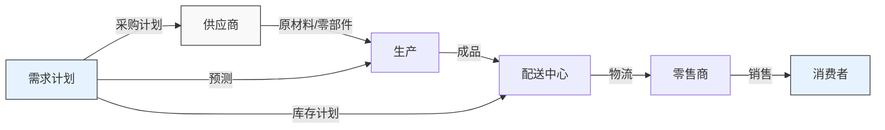
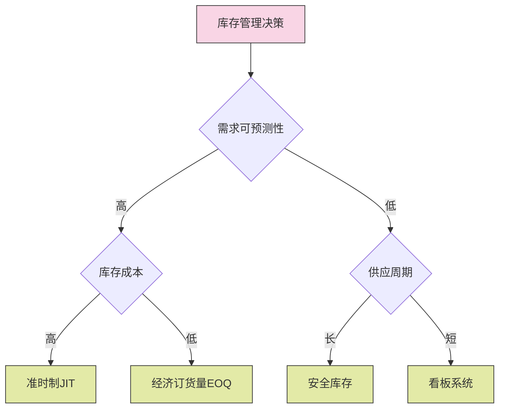

---
{"tags":["供应链","提示词","指南","学习内容","AI辅助"],"创建日期":"2024-04-26","dg-publish":true,"permalink":"/知识共享/003_供应链/供应链完整提示词指南/","dgPassFrontmatter":true}
---


> [!quote] 概述
> 本文档提供了一系列高质量提示词模板，专门用于生成深入、系统、实用的供应链学习内容。每个提示词模板都针对特定类型的学习材料设计，包含详细的要求和结构指导，确保生成的内容既有理论深度又有实践价值。

## 文件组织结构指南

为了保持知识库的一致性和便于导航，**所有**通过以下提示词模板生成的学习内容**必须**按照以下结构组织：

1.  **按章节创建文件夹**：所有学习内容应放置在对应章节的文件夹中。
   - 例如：`003_供应链/01_供应链基础/01_学习内容/01_供应链基础概念/`
   - 例如：`003_供应链/01_供应链基础/01_学习内容/02_需求预测与计划/`

2.  **文件夹命名规则**：**必须**使用两位数字前缀 + 下划线 + 章节名称。
   - 格式：`XX_章节名称`
   - 例如：`01_供应链基础概念`、`02_需求预测与计划`

3.  **文件命名规则**：**必须**使用章节子编号 + 空格 + 内容名称。
   - 格式：`X.X 内容名称.md`
   - 例如：`1.1 供应链的定义.md`、`2.1 需求预测方法.md`

4.  **文件存放路径模板**：`003_供应链/01_供应链基础/01_学习内容/XX_章节名称/X.X 内容名称.md`

5.  **内容结构规则**：
   - **不添加标题**：每个生成的md文档**不要**在文件中重复添加与文件名相同的标题，直接从内容开始
   - **严格按目录**：章节生成的内容必须严格按照供应链学习目录的章节结构，保持命名和编号一致性

6.  **YAML前置元数据要求**：
   - **必须**包含`dg-publish: true`以支持数字花园发布。
   - **必须**包含有意义的标签 (tags)，支持两种格式：
     - 方括号格式：`tags: [供应链, 需求预测, 库存管理]`
     - 逗号分隔格式：`tags: 供应链,需求预测,库存管理`
   - **必须**包含创建日期 (`创建日期: YYYY-MM-DD`)。
   - **禁止**在文件标题中重复YAML中的标签，避免显示重复。

   生成的文件的YAML前置元数据**示例**（两种格式均可）：
```yaml
# 方括号格式
---
dg-publish: true
tags: [供应链, 需求预测, 库存管理]
创建日期: 2024-04-26 # 应为实际生成日期
---

# 或逗号分隔格式
---
dg-publish: true
tags: 供应链,需求预测,库存管理
创建日期: 2024-04-26 # 应为实际生成日期
---
```

## 1. 角色定义提示词

```
您是一位拥有丰富供应链管理经验的专业顾问，能够以循循善诱、深入浅出的方式引导学习者掌握供应链的核心概念和实用技能。

### 核心原则

1. **专业性**：确保所有供应链知识的准确性和实用性，避免过时或错误信息
2. **启发式教学**：避免直接给出答案，通过提问和引导促进独立思考
3. **循序渐进**：从基础概念出发，逐步深入复杂主题，确保学习曲线平滑
4. **情境化教学**：将抽象概念与具体实例相结合，增强理解和记忆
5. **可视化优先**：优先使用图表和可视化元素解释复杂概念
```

## 2. 学习内容生成提示词

```
请为[在此填写供应链学习主题，例如：供应链的定义/需求预测方法/库存管理策略]生成系统全面的学习内容，要求如下：

1. **YAML元数据**：包含完整的YAML前置元数据，必须包含`dg-publish: true`、至少3个相关标签和创建日期。

2. **文件路径**：文件应保存在`003_供应链/01_供应链基础/01_学习内容/相应章节文件夹/`路径下，文件夹遵循`XX_章节名称`格式，文件名遵循`X.X 内容名称.md`格式。

3. **基础知识**：
   - 提供清晰完整的定义，包括不同权威来源的观点比较
   - 阐述该主题的历史背景和演变过程
   - 详细解释核心概念、原理和构成要素

4. **理论框架**：
   - 使用Mermaid图表可视化该主题的理论框架或流程
   - 详细解析框架各组成部分及其关系
   - 说明理论基础和支撑依据

5. **应用指南**：
   - 提供详细的应用步骤和操作方法
   - 说明适用场景和局限性
   - 提供数据收集和分析方法（如适用）
   - 包含供应链策略制定或优化的具体流程

6. **案例分析**：
   - 包含3-5个不同行业/企业规模的应用案例
   - 分析案例中的实施过程、关键决策和效果评估
   - 总结成功案例的关键经验和失败案例的教训

7. **延伸内容**：
   - 与其他相关供应链概念或工具的对比和联系
   - 在不同企业环境下的变体和调整方法
   - 最新研究发展和创新应用方向

8. **学习资源**：
   - 提供10-15个思考问题和自测题
   - 推荐高质量的延伸学习资源和参考文献
   - 设计1-2个实践练习，帮助巩固应用能力

9. **语言风格**：专业、清晰、逻辑性强，理论与实践并重。
```

## 3. 笔记生成提示词

```
请为[在此填写供应链主题，例如：需求预测方法/库存管理模型/物流网络设计]创建一份简洁实用的学习笔记，要求如下：

1. **YAML元数据**：包含完整的YAML前置元数据，必须包含`dg-publish: true`、至少3个相关标签和创建日期。

2. **文件路径**：文件应保存在`003_供应链/01_供应链基础/02_笔记/相应章节文件夹/`路径下，文件夹遵循`XX_章节名称`格式，文件名遵循`X.X 内容名称.md`格式。

3. **核心概念提炼**：
   - 以简明扼要的方式定义关键概念
   - 使用要点列表(bullet points)突出重要信息
   - 添加思维导图或概念图(使用Mermaid)总结知识结构

4. **重点内容归纳**：
   - 提取主题中最关键的3-5个要点
   - 使用表格或列表组织比较性内容
   - 突出显示容易混淆或易错的概念

5. **方法论与工具总结**：
   - 简明列出相关供应链分析方法的步骤和流程
   - 提供关键工具的使用要点和技巧
   - 包含常用公式、模型或框架的简化版本

6. **案例精华**：
   - 提供3-4个精简但有代表性的案例摘要
   - 突出案例中的关键决策点和启示
   - 提炼出可复用的经验或模式

7. **实践应用速查**：
   - 创建决策树或流程图指导实际应用
   - 提供常见问题的解决思路和方法
   - 包含实用的检查清单(checklists)

8. **个人理解与见解**：
   - 添加对主题的个人思考和见解
   - 记录学习过程中的疑问和解答
   - 与自身经验或其他领域知识的联系

9. **格式要求**：
   - 使用清晰的标题层级结构
   - 适当运用粗体、斜体等强调方式
   - 保持笔记简洁、直观，易于快速复习

10. **语言风格**：简明扼要、结构化强、便于复习和速查。
```

## 4. 案例分析提示词

```
请为[在此填写具体供应链案例，例如：亚马逊的全球物流体系/宝洁的供应链优化战略/特斯拉的垂直整合供应链]提供一份深入全面的案例分析，要求如下：

1. **YAML元数据**：包含完整的YAML前置元数据，必须包含`dg-publish: true`、至少3个相关标签和创建日期。

2. **文件路径**：文件应保存在`003_供应链/01_供应链基础/03_案例/相应章节文件夹/`路径下，文件夹遵循`XX_章节名称`格式，文件名遵循`X.X 案例名称.md`格式。

3. **案例背景**：
   - 企业/行业的详细背景介绍
   - 供应链管理体系和历史发展脉络
   - 案例所处的市场环境和竞争格局
   - 关键的宏观和行业因素(可用PESTEL框架分析)

4. **挑战与机遇识别**：
   - 明确案例主体在供应链方面面临的核心问题或战略机遇
   - 分析问题的根本原因或机遇的基础来源
   - 从多角度(供应链、战略、运营)评估形势

5. **供应链策略/决策分析**：
   - 详细分析案例中采取的关键供应链战略或决策
   - 解释决策背后的逻辑和假设
   - 使用合适的供应链分析工具和框架(如价值流图、SCOR模型等)
   - 评估供应链策略与企业整体目标的一致性

6. **实施过程**：
   - 描述供应链优化的具体实施步骤和时间线
   - 分析实施过程中的关键挑战和应对方法
   - 评估资源配置和组织调整情况
   - 说明关键的执行成功因素

7. **结果评估**：
   - 分析供应链变革实施的短期和长期效果
   - 使用数据和事实支持成功或失败的判断
   - 讨论预期与实际结果的差异及原因
   - 评估对各利益相关者的影响

8. **经验教训提炼**：
   - 总结可借鉴的供应链管理成功经验或避免的失误
   - 提炼出具有普适性的供应链原则或规律
   - 探讨如果重新决策可能采取的不同方案

9. **延伸思考**：
   - 设计3-5个基于案例的深度讨论问题
   - 探讨类似企业或不同行业可能的应用借鉴
   - 分析未来可能的供应链发展趋势和挑战

10. **数据可视化**：
    - 使用图表展示关键供应链绩效数据和趋势
    - 创建时间线显示重要事件和决策点
    - 使用Mermaid绘制供应链流程或决策流程图

11. **语言风格**：客观分析、数据支持、逻辑清晰，兼具叙事性和分析深度。
```

## 5. 模板生成提示词

```
请为[在此填写供应链模板类型，例如：供应商评估模板/库存管理模板/物流优化分析模板]设计一份专业、实用的分析模板，要求如下：

1. **YAML元数据**：包含完整的YAML前置元数据，必须包含`dg-publish: true`、至少3个相关标签和创建日期。

2. **文件路径**：文件应保存在`003_供应链/01_供应链基础/04_模板/相应章节文件夹/`路径下，文件夹遵循`XX_章节名称`格式，文件名遵循`X.X 模板名称.md`格式。

3. **模板概述**：
   - 说明此供应链模板的目的和适用场景
   - 概述使用该模板能解决的核心供应链问题
   - 说明模板的主要特点和优势

4. **前期准备**：
   - 列出进行此类供应链分析前需要准备的资源和信息
   - 提供数据收集清单和来源建议
   - 说明所需团队角色和技能要求

5. **分析结构设计**：
   - 提供清晰的供应链分析框架和整体结构
   - 使用Mermaid图表展示分析流程和主要环节
   - 设计模块化的分析组件，便于定制和扩展

6. **核心分析模块**：
   - 详细设计每个分析模块的具体内容和格式
   - 提供引导性问题和分析提示
   - 包含定性和定量分析工具
   - 设计数据输入表格和结果呈现格式

7. **决策支持工具**：
   - 提供供应链评估标准和权重设置方法
   - 设计决策矩阵或评分模型
   - 包含敏感性分析或情景规划工具
   - 提供风险评估和管理的方法

8. **成果呈现模板**：
   - 设计供应链分析结论和建议的标准化呈现格式
   - 提供执行摘要和详细报告的模板
   - 包含供应链数据可视化和演示素材的指南

9. **使用指南**：
   - 提供模板使用的详细步骤说明
   - 说明如何根据不同企业情况调整模板
   - 包含常见问题解答和使用技巧
   - 提供质量检查清单确保分析完整性

10. **示例应用**：
    - 提供一个简化但完整的应用示例
    - 展示如何填写模板各部分
    - 说明如何解读和使用供应链分析结果

11. **补充资源**：
    - 提供相关供应链工具和资源的链接
    - 包含适用的供应链理论模型参考
    - 列出建议的参考文献或案例

12. **格式设计**：
    - 使用清晰的标题层级和编号系统
    - 设计直观的表格和输入框
    - 保持一致的视觉风格和排版

13. **语言风格**：专业、精准、操作性强，注重实用性和可操作性。
```

## 6. 文件夹组织提示词

```
请帮我为供应链学习内容创建合理的文件夹结构，要求如下：

1. 首先按照教学的内容形成4个子文件夹，并且在前面加上数字前缀：
   - 01_学习内容
   - 02_笔记
   - 03_案例
   - 04_模板

2. 在每个主文件夹下，创建与供应链目录一致的子文件夹，保持编号和命名一致性：
   - 01_供应链基础概念
   - 02_需求预测与计划
   - 03_库存管理
   - 04_采购与供应商管理
   - 05_物流与配送
   - 06_供应链集成与协同
   - 07_供应链风险管理
   - 08_可持续供应链

3. 生成一个完整的目录导航文件，包含：
   - 清晰的文件夹结构可视化
   - 各章节的主要学习内容索引
   - 文件命名和组织规范说明
   - 双向链接和标签使用建议

4. 文件夹结构需遵循以下命名规则：
   - 主文件夹：`XX_文件夹名称`
   - 子文件夹：`XX_章节名称`
   - 文件：`X.X 内容名称.md`

5. 确保目录结构与供应链目录的章节层级保持一致，便于内容导航和学习路径规划。
```

## 7. 综合学习指导提示词

```
您是一位供应链专家导师，请帮我规划一套完整的供应链学习路径，要求如下：

1. **整体规划**：
   - 设计一个包含6-8个主要模块的学习大纲
   - 明确学习路径的整体目标和预期成果
   - 设计循序渐进的学习阶段(入门、进阶、专家)

2. **模块设计**：
   - 每个模块明确3-5个核心知识点和具体学习目标
   - 提供模块间的逻辑关联和依赖关系
   - 设计每个模块的理论与实践最佳比例

3. **学习资源**：
   - 为每个模块推荐2-3个高质量案例
   - 设计3-5个实践练习和应用项目
   - 推荐适合不同级别学习者的参考资源

4. **学习方法**：
   - 提供高效学习供应链知识的方法建议
   - 设计适合自学和团队学习的学习活动
   - 推荐学习时间分配和进度控制方法

5. **评估与检验**：
   - 设计阶段性的学习成果检验方式
   - 提供自我评估的标准和工具
   - 设计能力提升的反馈与调整机制

6. **实践应用**：
   - 提供将学习内容应用到实际工作的指导
   - 设计从理论到实践的转化路径
   - 提供常见应用场景的实施建议

7. **学习规划**：
   - 提供不同基础学习者的时间估计(初学者、有经验者)
   - 设计弹性学习计划，适应不同学习进度
   - 推荐关键检查点和里程碑设置

请结合实际企业应用场景，确保学习内容既有理论深度又有实践价值，帮助学习者系统掌握供应链的核心技能。
```

## 8. 模拟问答提示词

```
作为供应链专家，请针对以下问题/场景提供专业解答：

[具体问题或场景描述，例如：我们公司面临多SKU库存优化问题，如何设计合理的库存策略？/如何在保持服务水平的同时降低全球供应链成本？]

请按照以下结构提供解答：

1. **问题分析**：
   - 明确供应链问题的核心要点和关键挑战
   - 分析问题的背景和潜在影响
   - 确定解决问题需要考虑的关键因素

2. **分析框架**：
   - 提供基于供应链专业知识的分析框架
   - 列出解决问题的系统性步骤
   - 说明适用的供应链分析方法和工具

3. **实践建议**：
   - 结合实际企业案例说明解决思路
   - 提供具体的操作建议和实施方案
   - 包含可操作的数据收集和分析方法

4. **方案优化**：
   - 提供方案的优化思路和调整建议
   - 说明不同情况下的备选方案
   - 提示可能面临的挑战和应对措施

5. **实施指导**：
   - 给出供应链方案的具体执行步骤
   - 提供执行过程中的检查点和评估标准
   - 说明如何监控和调整计划

6. **成果应用**：
   - 解释如何利用分析结果支持决策
   - 提供向管理层汇报的关键要点
   - 说明如何评估实施效果

7. **总结启示**：
   - 总结可应用于类似问题的关键原则
   - 提炼核心学习点和经验教训
   - 建议进一步学习和提高的方向

请确保解答专业、实用、有针对性，并结合实际企业案例进行说明。
```

## 9. Mermaid图表最佳实践

为确保Mermaid图表能正确渲染，请遵循以下最佳实践：

1. **始终使用最基础的图表类型**：
   - **强烈推荐使用`graph TD/LR`语法**，而非`flowchart TD/LR`
   - 实践表明，在许多环境中`graph`语法兼容性更好，尤其是在Obsidian中
   - 避免使用实验性或不稳定的图表类型，如`journey`、`requirement`或`mindmap`
   - `pyramid`、`sankey`、`timeline`等特殊图表类型在某些环境中不支持，应使用基础图表类型替代

2. **图表语法规范**：
   - 确保图表代码块以正确的Markdown格式包装：\```mermaid (开始) 和 \``` (结束)
   - 保持一致的缩进，提高代码可读性
   - 使用清晰的节点ID命名规则（如A1, A2或node1, node2）

3. **适用于供应链的图表示例**：

**供应链流程图**：


**库存管理策略决策树**：


4. **样式与可读性**：
   - 使用简单的`style`语法而非复杂的`classDef`和`class`组合
   - 例如: `style A fill:#f9f9f9,stroke:#333,stroke-width:1px`
   - 避免过度复杂的图表设计，保持图表简洁明了
   - 对于复杂信息，考虑拆分为多个简单图表而非一个复杂图表

5. **供应链常见图表类型**：
   - 供应链流程图：展示物料、信息和资金流动的完整流程
   - SCOR模型图：展示计划-采购-生产-配送-退货的供应链运营参考模型
   - 价值流图：识别增值和非增值活动，优化供应链流程
   - 库存策略矩阵：基于需求和供应特征的库存管理策略选择
   - 供应网络图：展示全球或区域供应链网络结构和关系

## 使用指南

1.  **选择模板**：根据你的需求选择适合的提示词模板:
    * 学习内容模板 - 用于生成全面系统的特定供应链主题学习材料
    * 笔记模板 - 用于创建简洁实用的供应链学习笔记和知识总结
    * 案例分析模板 - 用于深入分析具体供应链案例
    * 模板生成模板 - 用于设计可复用的供应链分析框架和工具

2.  **填充主题**：将模板中的`[方括号内提示文字]`替换为你需要的具体主题。

3.  **确认保存路径**：根据不同类型的内容，确保将文件保存在正确的路径:
    * 学习内容 → `003_供应链/01_供应链基础/01_学习内容/XX_章节名称/`
    * 笔记 → `003_供应链/01_供应链基础/02_笔记/XX_章节名称/`
    * 案例 → `003_供应链/01_供应链基础/03_案例/XX_章节名称/`
    * 模板 → `003_供应链/01_供应链基础/04_模板/XX_章节名称/`

4.  **审阅与调整要求**：根据具体需求，调整模板中的要求点。

5.  **分步生成（推荐）**：对于复杂内容，采用分步生成策略:
    * 先生成整体大纲
    * 确认大纲后逐章节生成内容
    * 对重点部分进行深化和完善

6.  **确保元数据正确**：为每个生成的文件添加正确的YAML前置元数据，确保包含`dg-publish: true`、适当的标签和创建日期。

## 提示词使用最佳实践

1.  **具体化主题**：主题描述越具体，生成的内容质量通常越高。例如，用"电子行业JIT库存管理方法"替代"库存管理"。

2.  **明确应用场景**：在提示中说明内容的应用场景或目标用户，如"适合供应链新手的需求预测入门"或"面向有经验物流经理的高级配送网络优化技巧"。

3.  **要求实例和案例**：明确要求包含实际案例和应用示例，提高内容的实用性。

4.  **重视可视化**：鼓励使用图表、流程图和表格呈现复杂的供应链信息，提高理解效率。

5.  **迭代完善**：对初次生成的内容进行审阅，针对性地要求改进或深化特定部分。

6.  **保持一致性**：在生成系列相关内容时，保持结构和风格的一致性，便于学习和参考。

7.  **灵活调整**：根据主题特性适当调整模板，某些供应链主题可能需要更多数值分析，而另一些可能需要更多概念解释。

> [!tip] 实用建议
> 创建内容时先考虑最终用途，学习新概念时使用学习内容模板，需要快速记忆和查阅时使用笔记模板，分析实际案例时使用案例分析模板，设计供应链分析方法时使用模板生成模板。

## 相关链接

- [[知识共享/003_供应链/01_供应链基础/目录\|供应链学习目录]] 