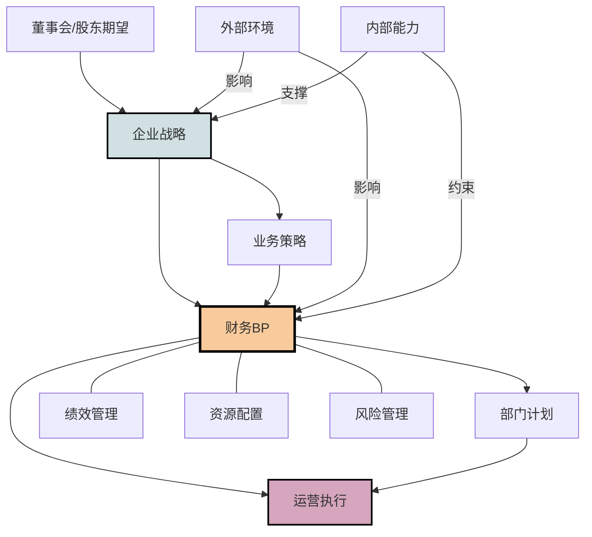
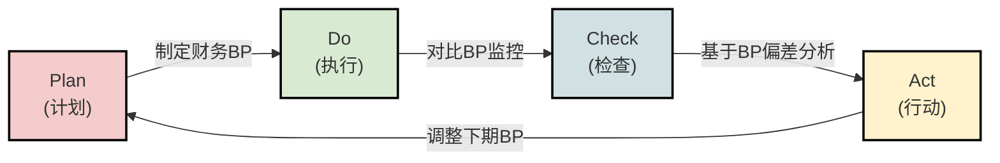
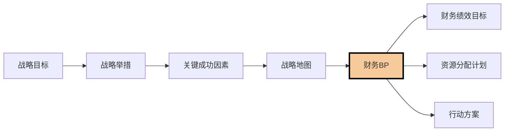
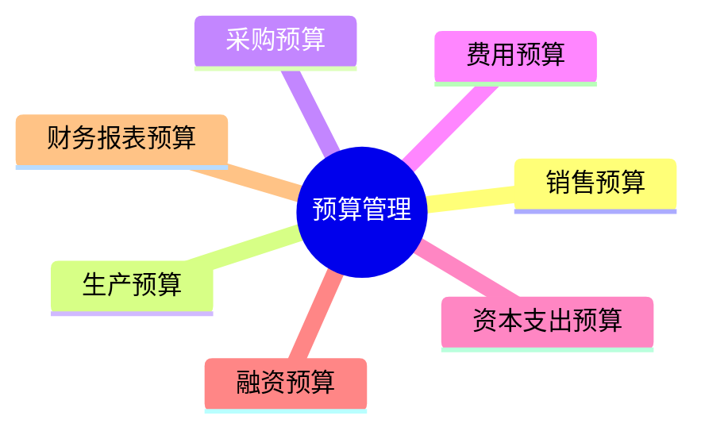

---
{"tags":["财务BP","基础概念","管理体系","战略管理","财务管理"],"aliases":"预算管理定位,财务规划位置,企业BP体系","cssclass":"content","dg-publish":true,"dg-home":false,"permalink":"/知识共享/01_财务BP/01_学习内容/01_财务BP基础概念/BP定义与作用/财务BP在企业管理中的位置/","dgPassFrontmatter":true}
---

> [!NOTE] 概述
> 财务BP在企业管理体系中具有核心纽带作用，连接战略规划与运营执行，并与多个管理子系统相互作用。本文分析财务BP的管理定位、系统关联以及在不同企业管理模式中的应用，帮助理解其在现代企业管理中的重要位置。

## 1. 财务BP在管理体系中的定位

### 1.1 总体定位 #管理框架

财务BP在企业管理体系中的总体定位是将战略意图转化为可执行计划的关键桥梁，同时协调各类资源，确保企业整体运转符合战略方向。

从管理层级看，财务BP处于以下位置：

- **上承战略层**：接受企业愿景、使命和战略目标的指导
- **下接执行层**：指导日常运营决策和资源使用
- **横跨职能部门**：协调财务、营销、生产、研发等各职能领域

### 1.2 财务BP在五大管理职能中的位置 #管理职能

将财务BP置于经典的管理职能框架中：

| 管理职能 | 财务BP的角色 | 具体体现 |
|---------|------------|---------|
| 计划职能 | 核心工具 | 将战略意图转化为可量化的财务目标和行动计划 |
| 组织职能 | 间接影响 | 通过资源配置影响组织结构和工作设计 |
| 领导职能 | 辅助工具 | 提供目标共识，支持领导统一行动方向 |
| 控制职能 | 基础标准 | 建立业绩衡量的基准，提供差异分析框架 |
| 协调职能 | 协作平台 | 提供各部门交流协作的共同语言和目标 |

### 1.3 财务BP在管理闭环中的位置 #管理循环

财务BP是PDCA（计划-执行-检查-行动）管理循环中的关键环节：

在这一循环中，财务BP不仅是初始的计划工具，也是持续改进的基准和参照系统。

## 2. 财务BP与其他管理系统的关系

财务BP并非孤立存在，而是与企业多个管理系统紧密关联，形成有机整体。

### 2.1 与战略管理系统的关系 #战略关系

- **战略落地工具**：财务BP是战略的财务表达和实施路径
- **战略反馈渠道**：财务BP执行中的偏差为战略调整提供依据
- **战略测试平台**：通过财务BP模拟验证战略的可行性
- **战略沟通媒介**：通过财务语言传达战略意图给各层级

### 2.2 与预算管理系统的关系 #预算关系

- **范围区别**：预算系统更聚焦短期资源分配和控制，财务BP涵盖更广泛的预测和规划
- **时间关系**：长期财务BP指导年度预算编制，又通过年度预算落地实施
- **功能互补**：预算系统提供详细操作指南，财务BP提供战略方向
- **流程联系**：财务BP审批后分解为预算目标，预算执行结果反馈到BP调整

### 2.3 与绩效管理系统的关系 #绩效关系

财务BP是绩效管理系统的基石，提供了绩效评估的基础标准：

- **目标设定**：财务BP中的关键指标转化为部门和个人KPI
- **绩效衡量**：财务BP提供评估实际业绩的基准和标杆
- **激励机制**：薪酬和奖金计划常基于财务BP的达成情况设计
- **能力发展**：财务BP执行中的能力缺口指导培训和发展计划

**案例**：某制造企业将财务BP中的成本控制目标分解为生产部门的单位产出成本KPI，直接与部门管理层30%的绩效奖金挂钩，成功激励了成本改善。

### 2.4 与风险管理系统的关系 #风险关系

财务BP与风险管理系统相互支持，共同保障企业稳健发展：

- **风险识别**：财务BP规划过程暴露潜在财务和运营风险
- **风险量化**：财务BP提供量化风险影响的框架和方法
- **风险应对**：财务BP中包含风险缓释的资源配置和应急计划
- **韧性建设**：通过财务BP的情景规划增强企业应对变化的韧性

**案例**：一家能源公司在财务BP中设置了油价大幅波动的情景分析，提前做好资产负债表韧性规划，在2020年油价暴跌时得以保持财务稳定。

### 2.5 与信息系统的关系 #信息关系

现代财务BP越来越依赖企业信息系统的支持：

- **数据集成**：企业资源规划(ERP)、客户关系管理(CRM)等系统为财务BP提供基础数据
- **分析支持**：商业智能(BI)工具支持财务BP的多维分析和预测
- **自动化**：财务BP系统实现预算编制、审批和监控的自动化
- **实时更新**：信息系统支持财务BP的动态调整和滚动预测

## 3. 财务BP在不同企业管理模式中的地位

不同的企业管理模式下，财务BP的地位和作用有明显差异。

### 3.1 传统金字塔结构中的财务BP #组织结构

在传统层级式组织中，财务BP往往是自上而下的命令工具：

- **特点**：集中制定，自上而下分解，强控制导向
- **优势**：执行力强，资源统筹能力强
- **挑战**：灵活性不足，基层参与度低
- **典型行业**：传统制造业、国有企业

**案例**：某大型国有钢铁企业，财务BP由集团总部统一制定指标，下属单位分解落实，强调"一盘棋"规划，但对市场变化反应较慢。

### 3.2 矩阵式组织中的财务BP #组织结构

在矩阵式管理结构中，财务BP需要平衡业务线和职能线的双重需求：

- **特点**：双维度协同编制，交叉验证
- **优势**：兼顾业务特性和专业标准
- **挑战**：协调复杂，责任边界模糊
- **典型行业**：专业服务业、跨国公司

**案例**：某全球咨询公司采用"行业+地区"双维度财务BP体系，行业维度负责收入预测，地区维度负责资源配置，通过复杂的协商机制达成最终平衡。

### 3.3 敏捷组织中的财务BP #组织结构

在敏捷组织中，财务BP更加灵活和适应性强：

- **特点**：滚动规划，持续调整，重视速度
- **优势**：适应性强，能快速响应变化
- **挑战**：稳定性和可预测性降低
- **典型行业**：科技企业、创新驱动型企业

**案例**：某互联网科技公司取消了传统年度预算，改用季度滚动财务BP，辅以每月调整机制，允许团队灵活调整资源使用，但要求定期对照OKR评估成效。

### 3.4 平台型组织中的财务BP #组织结构

平台型企业的财务BP更关注生态系统的整体价值创造：

- **特点**：关注生态指标，强调规模效应
- **优势**：聚焦长期价值和生态健康
- **挑战**：短期财务与长期价值平衡难
- **典型行业**：电商平台、共享经济

**案例**：某电商平台的财务BP重点关注GMV增长、用户获取成本、留存率等生态指标，允许短期亏损换取长期平台价值，但设定了明确的生态投资回报节点。

## 4. 财务BP在企业发展阶段的位置变化

财务BP的定位和重要性会随企业发展阶段而变化。

### 4.1 创业期 #发展阶段

- **定位**：生存工具，融资依据
- **特点**：简单灵活，重现金流
- **作用**：预测"生命周期"，管理现金消耗率
- **挑战**：数据有限，不确定性高

**案例**：某人工智能创业公司的财务BP主要关注月度现金消耗率和预计"存活期"，以确定下一轮融资时间点，财务模型相对简单但更新频繁。

### 4.2 成长期 #发展阶段

- **定位**：增长引擎，资源分配工具
- **特点**：关注扩张节奏，平衡增长与效率
- **作用**：指导市场拓展，合理配置资源
- **挑战**：管理系统跟不上业务扩张

**案例**：某快速增长的餐饮连锁在成长期财务BP中，将新店开设数量、单店回收期和后台扩建计划作为核心指标，确保扩张与能力同步增长。

### 4.3 成熟期 #发展阶段

- **定位**：效率优化，价值管理
- **特点**：精细化，系统化
- **作用**：提升运营效率，优化资本结构
- **挑战**：避免官僚化，保持创新

**案例**：某成熟家电企业的财务BP强调精细化管理，设置了300多个考核指标，形成完整的标准体系，但也导致了一定的官僚主义问题。

### 4.4 转型期 #发展阶段

- **定位**：战略转型工具，变革管理平台
- **特点**：双轨制，新旧业务并行
- **作用**：管理转型进度，平衡短期业绩与长期投入
- **挑战**：资源争夺，利益冲突

**案例**：某传统媒体集团向数字化转型，在财务BP中设立了"双轨制"，传统业务侧重短期利润，数字业务侧重增长指标，并设立专门的转型投资池。

## 5. 财务BP在全球企业管理实践中的位置

全球不同区域和商业文化背景下，财务BP的位置和应用有显著差异。

### 5.1 英美企业模式 #地区差异

- **特点**：股东价值导向，季度财报驱动
- **财务BP定位**：外部承诺兑现工具
- **优势**：市场导向强，与资本市场沟通紧密
- **挑战**：可能导致短期行为

**案例**：某美国上市公司的财务BP强调季度业绩达成，CEO业绩评估主要基于是否实现对分析师的季度业绩承诺，财务BP与投资者沟通紧密相关。

### 5.2 日本企业模式 #地区差异

- **特点**：长期导向，稳健经营
- **财务BP定位**：长期经营指南
- **优势**：战略连贯性强，避免短视
- **挑战**：应变能力可能不足

**案例**：某日本制造企业的财务BP包含了10年远景规划，即使短期业绩波动也不轻易调整战略方向，强调长期能力建设优于短期财务表现。

### 5.3 中国企业模式 #地区差异

- **特点**：快速适应，实用主义
- **财务BP定位**：兼具战略工具和控制手段
- **优势**：执行力强，应变迅速
- **挑战**：有时过于灵活，标准执行不够严格

**案例**：某中国互联网企业的财务BP强调"弹性目标"，设立基本目标和挑战目标双重标准，并根据市场变化快速调整，决策速度成为核心竞争力。

## 6. 财务BP在管理实践中的常见问题

企业实践中，财务BP的定位与实施常见以下问题：

### 6.1 "两张皮"现象 #实践问题

财务BP与实际经营脱节，沦为形式主义：

- **表现**：BP编制完成后"束之高阁"，实际决策不参考BP
- **原因**：BP过于理想化，缺乏操作性；或编制流于形式
- **解决方法**：增强BP的实用性，与绩效考核和资源分配紧密结合

### 6.2 "短视"问题 #实践问题

过度关注短期财务指标，忽视长期价值创造：

- **表现**：为达成短期财务目标牺牲长期投入和战略布局
- **原因**：绩效评估过度依赖短期财务指标
- **解决方法**：平衡短期与长期指标，引入战略性非财务指标

### 6.3 "数字游戏"问题 #实践问题

BP过程变成部门间的政治博弈和数字游戏：

- **表现**：预算膨胀、目标缩水、资源争夺
- **原因**：激励机制设计不当，预算与资源直接挂钩
- **解决方法**：改革预算分配机制，强调价值创造而非资源消耗

### 6.4 解决路径 #解决方案

现代企业管理实践中，越来越多企业通过以下方式改善财务BP在管理体系中的定位：

- **超越预算管理**：摆脱传统静态预算的局限，采用滚动预测和动态资源分配
- **战略导向预算**：将战略地图与财务BP紧密结合，确保资源指向战略重点
- **价值驱动管理**：聚焦关键价值驱动因素，简化BP流程
- **数字化转型**：利用大数据和人工智能提升BP的准确性和响应速度

## 7. 与其他概念的关系

- [[知识共享/01_财务BP/01_学习内容/01_财务BP基础概念/BP定义与作用/财务BP的定义\|财务BP的定义]] - 了解财务BP的基本概念
- [[知识共享/01_财务BP/01_学习内容/01_财务BP基础概念/BP定义与作用/财务BP的作用与目标\|财务BP的作用与目标]] - 财务BP的功能和作用
- [[BP与企业战略\|BP与企业战略]] - 财务BP与企业战略的关系
- [[财务BP的组成部分\|财务BP的组成部分]] - 财务BP的构成要素
- [[知识共享/01_财务BP/01_学习内容/02_预算编制基础/预算编制流程/预算编制流程\|预算编制流程]] - 财务BP实施的方法

## 参考文献

1. Kaplan, R. S., & Norton, D. P. (2008). *The Execution Premium: Linking Strategy to Operations for Competitive Advantage*. Harvard Business Press.
2. Hope, J., & Fraser, R. (2013). *Beyond Budgeting: How Managers Can Break Free from the Annual Performance Trap*. Harvard Business Review Press.
3. 刘志远. (2020). 《战略财务管理》. 中信出版社.
4. Damodaran, A. (2012). *Investment Valuation: Tools and Techniques for Determining the Value of Any Asset*. Wiley Finance.
5. 西蒙斯, R. (2014). 《掌控战略：平衡计分卡之父教你落地企业战略》. 机械工业出版社.
6. 张维宁. (2018). 《中国企业预算管理实践与创新》. 中国财政经济出版社. 