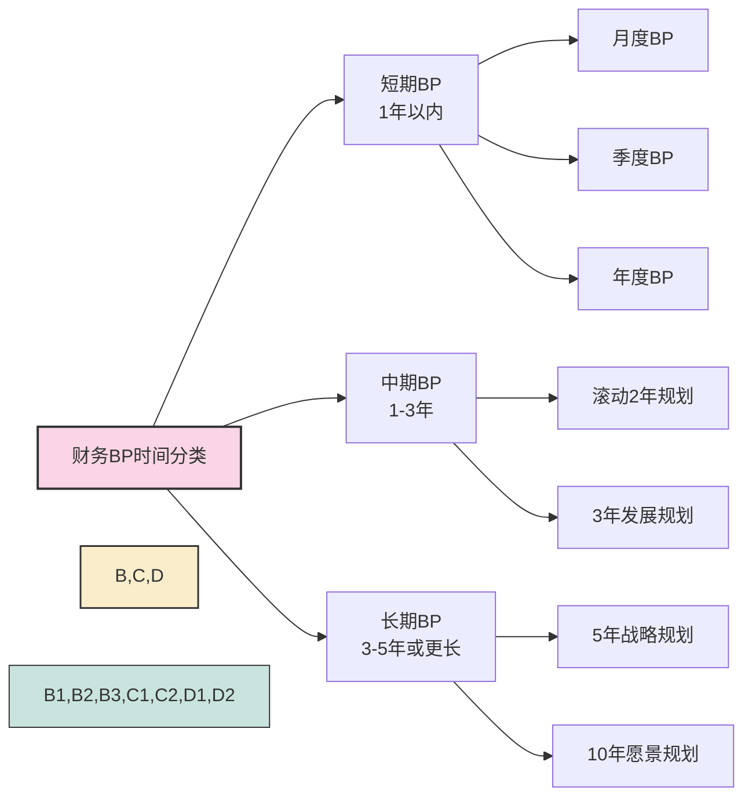
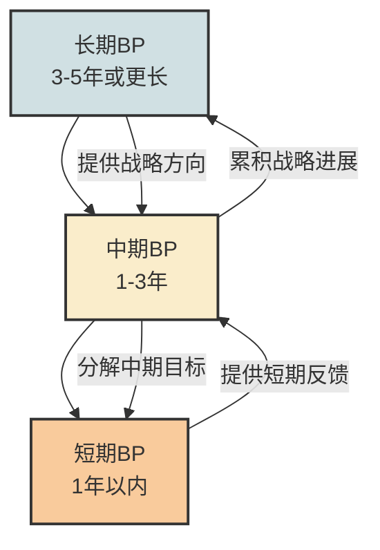

---
{"tags":["财务BP","基础概念","分类方法","规划周期","时间维度"],"aliases":["长短期BP分类","时间范围规划","BP周期分类"],"cssclass":"content","dg-publish":true,"dg-home":false,"permalink":"/知识共享/01_财务BP/01_学习内容/01_财务BP基础概念/BP类型与分类/按时间范围分类/","dgPassFrontmatter":true}
---

> [!NOTE] 概述
> 财务BP可按时间范围分为短期、中期和长期三大类型，不同时间范围的财务BP在规划重点、细节程度、灵活性和用途等方面存在明显差异。本文详细介绍各类型BP的特点、适用场景和实践应用，帮助企业根据不同需求选择合适的规划周期。

## 1. 财务BP的时间维度概览

财务BP的时间维度是指规划所覆盖的时间跨度，直接影响规划的关注点、详细度和制定方法。按照时间范围，财务BP通常分为三大类型：

不同时间跨度的财务BP并非彼此独立，而是形成一个层层递进、逐步细化的规划体系：

- **长期BP**提供战略方向和长期目标
- **中期BP**将长期目标转化为可操作的中期规划
- **短期BP**落实为具体的行动计划和资源分配

## 2. 短期财务BP（1年以内）

### 2.1 主要特点 #短期规划

短期财务BP主要关注企业近期的经营活动和资源分配：

- **时间跨度**：通常为1个月至1年
- **关注重点**：运营细节、执行计划、短期目标达成
- **详细程度**：高度详细，具体到月份甚至周/日
- **制定频率**：较高，年度预算通常每年制定，月度/季度计划可能滚动更新
- **确定性**：相对较高，预测准确度高
- **灵活性**：相对较低，一经确定通常不易大幅调整

### 2.2 常见形式 #规划形式

- **月度BP**：详细规划1个月内的收支、活动和资源使用
- **季度BP**：涵盖3个月的经营计划和财务目标
- **年度BP**：最常见的短期BP形式，覆盖完整财年

### 2.3 应用场景 #应用场景

短期BP最适用于以下场景：

- **日常运营管理**：指导企业日常经营活动
- **现金流管理**：确保短期现金流健康
- **业绩考核**：作为短期业绩评估的基准
- **资源分配**：确定短期内各部门/项目的资源边界

### 2.4 优势与局限 #优缺分析

**优势**：
- 预测准确度高，可操作性强
- 目标明确具体，易于执行和监控
- 与实际业务和财务状况紧密相连
- 为决策提供清晰的近期指导

**局限**：
- 可能导致短视行为，忽视长期投资和战略布局
- 执行过于僵化，应对市场变化的灵活性不足
- 编制频率高，可能占用过多管理资源

### 2.5 案例分析：零售企业的季节性短期BP #案例分析

**背景**：某服装零售连锁企业面临明显的季节性销售波动，需要精细规划每个季节的经营活动。

**短期BP设计**：
- 以季度为基本单位，细分为月度执行计划
- 根据往年同期数据和市场趋势预测销售额
- 提前3个月规划促销活动和商品采购
- 按季节调整人员配置和营业时间
- 月度回顾，滚动更新下月计划

**具体内容**：
- 春季BP（1-3月）：提前布局春节和开春促销，重点关注新品上市和库存调整
- 夏季BP（4-6月）：关注季中促销活动，为暑期旺季储备产能
- 秋季BP（7-9月）：重点规划开学季和国庆促销，增加营销投入
- 冬季BP（10-12月）：强化黑五和圣诞等节日营销，优化年末库存

**成效**：
- 库存周转率提高18%，减少了季末折扣幅度
- 促销活动与库存管理协同性提升，避免了缺货和积压
- 人员配置更合理，高峰期人手充足，淡季成本可控

**学习启示**：
- 短期BP需要对业务特点（如季节性）有深刻理解
- 应基于历史数据但不完全依赖，需结合市场趋势
- 保持一定灵活性，允许在执行中做出适当调整

## 3. 中期财务BP（1-3年）

### 3.1 主要特点 #中期规划

中期财务BP是连接短期执行与长期战略的桥梁：

- **时间跨度**：通常为1-3年
- **关注重点**：业务发展、能力建设、资源优化
- **详细程度**：中等，通常按季度或半年规划
- **制定频率**：一般每年更新一次
- **确定性**：中等，有一定的弹性空间
- **灵活性**：中等，可根据环境变化适度调整

### 3.2 常见形式 #规划形式

- **滚动2年规划**：每年制定未来两年的规划，每年更新
- **3年业务计划**：涵盖3个财年的业务发展和财务目标
- **中期投资计划**：中期内的资本支出和投资项目规划

### 3.3 应用场景 #应用场景

中期BP最适用于以下场景：

- **业务扩张规划**：新市场拓展、产能扩充计划
- **产品开发规划**：新产品研发和上市时间表
- **资源能力建设**：人才培养、技术升级、流程再造
- **中期投资决策**：重大设备购置、基础设施建设

### 3.4 优势与局限 #优缺分析

**优势**：
- 兼顾战略方向与操作可行性
- 为业务发展提供连贯性和预见性
- 使投资决策更理性，避免短期行为
- 有助于系统性解决结构性问题

**局限**：
- 预测的不确定性增加，准确度下降
- 可能因环境变化而需要频繁调整
- 容易成为年度堆叠而非真正的中期规划

### 3.5 案例分析：制造企业的产能扩张中期BP #案例分析

**背景**：某电子元器件制造企业预计市场需求持续增长，需规划未来3年的产能扩张。

**中期BP设计**：
- 覆盖3年时间，按季度里程碑规划
- 基于市场预测和客户订单预测设定产能目标
- 分阶段规划厂房扩建、设备购置和人员扩充
- 设计融资方案和现金流规划
- 每半年审视一次，根据市场变化调整后续计划

**具体内容**：
- 第一年：完成新厂区选址和设计，开始基础设施建设，订购长周期设备
  - Q1：完成可行性研究和选址
  - Q2：获取土地和建设许可
  - Q3-Q4：开始基础设施建设，订购关键设备
- 第二年：主体厂房建设，设备安装调试，开始招募和培训技术人员
  - Q1-Q2：完成主体建设
  - Q3-Q4：设备安装调试，生产线试运行
- 第三年：产能逐步释放，达到满负荷运转
  - Q1-Q2：产能爬坡，达到50%目标产能
  - Q3-Q4：优化生产效率，实现满负荷运转

**财务规划**：
- 总投资4500万元，分阶段投入：第一年1200万，第二年2500万，第三年800万
- 融资方案：银行贷款2000万，自有资金2500万
- 预计第三年底开始实现正现金流，4年内收回全部投资

**成效**：
- 项目按计划推进，仅在第二年因市场需求超预期而适度提高了产能目标
- 分阶段投资降低了资金压力和风险
- 提前规划的人才培养计划确保了新产能的顺利投产

**学习启示**：
- 中期BP需要在足够详细和过度僵化之间取得平衡
- 应设置关键检查点，定期评估规划与实际的偏差
- 要为不确定性预留缓冲空间（时间和资金）

## 4. 长期财务BP（3-5年或更长）

### 4.1 主要特点 #长期规划

长期财务BP关注企业的战略方向和长远发展：

- **时间跨度**：通常为3-5年，有时可达10年或更长
- **关注重点**：战略定位、长期竞争力、可持续发展
- **详细程度**：低，通常是大方向和主要目标
- **制定频率**：较低，通常2-3年更新一次
- **确定性**：低，更多是方向性指引
- **灵活性**：高，可根据环境变化重新评估和调整

### 4.2 常见形式 #规划形式

- **5年战略规划**：最常见的长期BP形式，涵盖企业5年发展蓝图
- **10年愿景规划**：勾勒企业长期愿景和发展方向
- **战略性投资规划**：重大战略项目、基础设施的长期投资计划

### 4.3 应用场景 #应用场景

长期BP最适用于以下场景：

- **企业战略制定**：确定长期发展方向和战略定位
- **行业布局规划**：规划产业链纵向或横向拓展
- **长期资源配置**：技术路线、人才战略、资本结构
- **重大战略投资**：研发中心、生产基地等长期资产投资

### 4.4 优势与局限 #优缺分析

**优势**：
- 提供清晰的长期方向和战略愿景
- 促进长期思维，避免短视决策
- 有助于识别长期机会和威胁
- 为中短期决策提供战略指导框架

**局限**：
- 预测的不确定性高，准确度较低
- 容易流于形式，缺乏实际指导意义
- 难以衡量和追踪长期目标的实现进度
- 可能因环境剧变而需彻底重构

### 4.5 案例分析：能源企业的转型长期BP #案例分析

**背景**：某传统石油企业面对全球能源转型趋势，制定10年转型规划，逐步向综合能源服务提供商转变。

**长期BP设计**：
- 覆盖10年，分为三个阶段（起步期、发展期、成熟期）
- 设定关键战略目标和里程碑
- 制定技术路线图和投资布局
- 规划组织结构和人才战略转型
- 设计资本结构和财务转型路径

**具体内容**：
- 第1-3年（起步期）：
  - 开展新能源试点项目，建立初步技术能力
  - 传统业务保持稳定，为转型提供现金流支持
  - 投资回报指标：新能源业务不要求盈利，重点关注技术积累和市场学习
- 第4-7年（发展期）：
  - 新能源业务规模化扩张，占集团收入比例达20%
  - 传统业务精细化管理，提高效率和回报率
  - 投资回报指标：新能源业务达到盈亏平衡，传统业务ROI保持15%以上
- 第8-10年（成熟期）：
  - 新能源业务成为核心业务，占集团收入比例超过40%
  - 传统业务选择性收缩，保留高价值资产
  - 投资回报指标：新能源业务ROI达到12%，整体ROI稳定在14%以上

**财务战略**：
- 10年累计投资2000亿元，其中新能源领域占60%
- 融资策略：保持信用评级，增加绿色债券比例
- 股东回报：保持稳定分红政策，随转型进展逐步提高

**成效与调整**：
- 3年回顾点发现新能源技术进步速度超预期，调整了后续投资节奏
- 传统业务价格波动大于预期，增加了资产组合的灵活调整机制
- 组织转型进度落后，加强了跨领域人才引进和培养

**学习启示**：
- 长期BP需要足够的前瞻性和战略高度
- 应关注企业核心能力的延续与重构
- 设置关键检查点和调整机制，避免僵化执行
- 平衡长期愿景与现实约束的关系

## 5. 不同时间范围BP的对比与协同

### 5.1 关键特征对比 #对比分析

| 特征 | 短期BP | 中期BP | 长期BP |
|------|-------|--------|--------|
| 时间跨度 | 1年以内 | 1-3年 | 3-5年或更长 |
| 主要目的 | 运营管理、资源分配 | 业务发展、能力建设 | 战略方向、长期定位 |
| 详细程度 | 高，具体到月 | 中，一般按季度或半年 | 低，主要是方向性指标 |
| 更新频率 | 高，可能月度/季度更新 | 中，通常年度更新 | 低，2-3年更新一次 |
| 确定性 | 较高 | 中等 | 较低 |
| 灵活性 | 较低 | 中等 | 较高 |
| 关注焦点 | 财务指标、目标完成 | 业务发展、资源优化 | 战略定位、核心能力 |
| 制定主体 | 各部门+财务部 | 中高层管理团队 | 高层管理团队+董事会 |

### 5.2 三种BP的协同关系 #协同关系

有效的财务BP体系应确保三种时间范围的规划协同一致：
- 长期BP确定战略方向和长远目标
- 中期BP将长期目标分解为可操作的中期行动计划
- 短期BP提供具体的执行指南和资源分配方案

同时，短期执行的反馈应向上传导，促使中期和长期规划适时调整，形成动态优化的闭环系统。

### 5.3 不同行业的时间范围偏好 #行业差异

不同行业因其特性而对财务BP的时间范围有不同偏好：

- **快速变化的行业**（如互联网、消费电子）：短期BP占主导，中长期规划轮廓化
- **资本密集型行业**（如能源、制造业）：中长期BP更为重要，确保投资回报
- **基础设施行业**（如电力、铁路）：依赖超长期BP（10-20年），注重战略布局
- **周期性行业**（如商品、航空）：更注重不同周期的情景规划，强调灵活应对

## 6. 时间范围规划的实践建议

### 6.1 选择合适的时间范围 #实践建议

选择财务BP的时间范围应考虑以下因素：

- **行业特性**：行业变化速度和周期性
- **资产结构**：资产寿命和投资回收期
- **战略周期**：企业战略更新和调整的周期
- **外部环境**：市场、技术、政策变化的速度与可预见性
- **内部能力**：预测能力和管理成熟度

### 6.2 多层次时间范围的整合方法 #实践建议

建立有效的多层次时间范围BP体系的方法：

1. **自上而下与自下而上相结合**：
   - 自上而下：战略目标分解到各时间层次
   - 自下而上：短期执行反馈调整长期预期

2. **关键连接点设计**：
   - 确保不同时间范围规划之间有明确的衔接点
   - 建立统一的核心指标体系，便于跨周期追踪

3. **滚动规划机制**：
   - 保持长期规划的战略方向稳定
   - 中期规划每年滚动更新一次
   - 短期规划按季度或月度更新

4. **差异化的指标体系**：
   - 长期BP关注战略性指标（市场份额、技术领先度）
   - 中期BP关注发展性指标（增长率、投资回报）
   - 短期BP关注操作性指标（利润率、运营效率）

### 6.3 常见陷阱与避免方法 #实践建议

时间范围规划中的常见陷阱：

- **短期化陷阱**：过度关注短期指标，忽视长期投入
  - 解决方法：在短期BP中纳入战略投入指标，确保长期投资不被牺牲

- **僵化陷阱**：长期规划一旦制定就固守不变
  - 解决方法：建立定期评估机制，允许根据环境变化调整长期目标

- **断层陷阱**：不同时间范围的BP彼此脱节
  - 解决方法：建立清晰的目标分解和上传下达机制

- **数字游戏陷阱**：长期BP沦为不切实际的数字堆砌
  - 解决方法：长期BP更关注方向和能力建设，而非具体数字目标

## 7. 与其他概念的关系

- [[知识共享/01_财务BP/01_学习内容/01_财务BP基础概念/BP定义与作用/财务BP的定义\|财务BP的定义]] - 理解财务BP的基本概念
- [[知识共享/01_财务BP/01_学习内容/01_财务BP基础概念/BP类型与分类/按用途分类\|按用途分类]] - 了解财务BP的不同用途分类
- [[按编制方法分类\|按编制方法分类]] - 探索不同的BP编制方法
- [[知识共享/01_财务BP/01_学习内容/02_预算编制基础/预算编制流程/预算编制流程\|预算编制流程]] - 学习如何编制各类BP
- [[BP与企业战略的关系\|BP与企业战略的关系]] - 深入了解战略与BP的联系

> [!TIP] 学习建议
> 在学习和应用财务BP的时间范围分类时，建议从企业实际情况出发，确保不同时间范围的规划相互协调。可尝试为一个熟悉的业务场景制定短、中、长期BP的框架，体会它们之间的联系与区别。

## 参考文献

1. Kaplan, R. S., & Norton, D. P. (2008). *The Execution Premium: Linking Strategy to Operations for Competitive Advantage*. Harvard Business Press.
2. Hope, J., & Fraser, R. (2013). *Beyond Budgeting: How Managers Can Break Free from the Annual Performance Trap*. Harvard Business Review Press.
3. Porter, M. E. (1996). "What is Strategy?" *Harvard Business Review*, 74(6), 61-78.
4. Grant, R. M. (2003). "Strategic Planning in a Turbulent Environment: Evidence from the Oil Majors." *Strategic Management Journal*, 24(6), 491-517.
5. 刘志远. (2020). 《战略财务管理》. 中信出版社.
6. 陈志斌. (2018). 《全面预算管理：理论、方法与实践》. 中国人民大学出版社. 