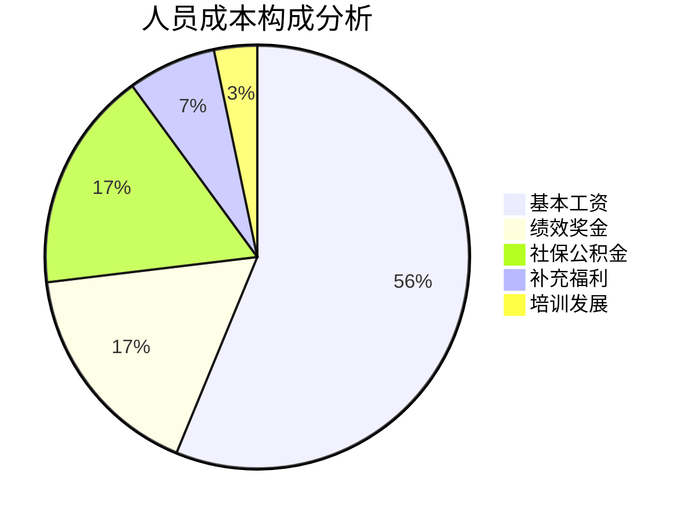

---
{"tags":["财务BP","预算规划","人员预算","人员管理","成本结构"],"aliases":["人工成本构成","人力成本结构"],"created":"2023-11-16","dg-publish":true,"permalink":"/知识共享/01_财务BP/01_学习内容/02_预算编制基础/人员预算/人员成本构成/","dgPassFrontmatter":true}
---

# 人员成本构成

> [!abstract] 概述
> 人员成本构成是人员预算编制的核心内容，涵盖企业为获取、使用和保留人力资源所支付的各类费用。本文详细分析人员成本的构成要素、分类方法、计算原则和预算技巧，旨在帮助企业全面了解人员成本结构，进行科学的人力成本规划与管理，为企业财务BP提供可靠的人力成本数据支撑。

## 基本概念

### 人员成本的定义与范围

**人员成本**是指企业为获取、使用和保留人力资源而发生的各种支出，是企业运营成本的重要组成部分。根据不同的核算目的和管理需要，人员成本的范围可以有不同的界定。

**广义人员成本**包括：
- 直接支付给员工的货币报酬
- 企业承担的员工福利费用
- 人力资源获取和开发费用
- 离职和裁员相关费用
- 与人力资源管理相关的行政费用

**狭义人员成本**主要指：
- 工资薪金
- 奖金
- 社会保险和福利费用

在财务BP编制中，通常采用广义人员成本的概念，以全面反映企业的人力资源投入。

### 人员成本在企业成本结构中的地位

人员成本在不同行业和企业中所占比重差异较大：

- **劳动密集型行业**（如服务业、咨询业）：人员成本通常占总成本的60%-80%
- **技术密集型行业**（如软件、研发）：人员成本通常占总成本的40%-60%
- **资本密集型行业**（如制造业、能源）：人员成本通常占总成本的20%-40%

随着自动化和智能化程度提高，传统行业的人员成本比例趋于下降，而知识密集型企业的人才成本比例则不断上升。准确把握企业人员成本在总成本中的比例和变化趋势，对于预算编制和成本控制具有重要意义。

## 核心内容

### 人员成本的主要构成要素

#### 1. 基本薪酬

基本薪酬是人员成本的核心部分，包括：

- **基本工资**：按照岗位、职级确定的基础报酬
- **固定津贴**：如职务津贴、工龄津贴、技术等级津贴等
- **固定补贴**：如住房补贴、交通补贴、通讯补贴等
- **保底薪酬**：保证员工获得的最低收入

基本薪酬通常具有相对稳定性，是预算编制中较为确定的部分。

#### 2. 变动薪酬

变动薪酬与员工业绩、企业效益等因素挂钩，主要包括：

- **绩效奖金**：基于个人/团队/部门/公司绩效的奖励
- **销售提成**：与销售业绩直接挂钩的报酬
- **利润分享**：与企业利润挂钩的分享机制
- **年度奖金**：年度综合业绩奖励
- **专项奖励**：如项目奖金、创新奖励、节约奖励等

变动薪酬在预算编制中的预测难度较大，通常需要结合历史数据和业绩预测进行估算。

#### 3. 法定福利

法定福利是企业按照国家法律法规必须提供的员工福利，包括：

- **社会保险**：
  - 养老保险
  - 医疗保险
  - 失业保险
  - 工伤保险
  - 生育保险
- **住房公积金**
- **法定假期工资**：
  - 年休假工资
  - 法定节假日工资
  - 病假工资
  - 婚丧假工资
  - 产假工资

法定福利的比例和基数通常由国家和地方法规确定，计算相对明确。

#### 4. 补充福利

补充福利是企业自主决定提供的员工福利项目，包括：

- **补充商业保险**：
  - 补充医疗保险
  - 重大疾病保险
  - 意外伤害保险
  - 人寿保险
- **健康福利**：
  - 体检计划
  - 健康咨询
  - 健身设施/补贴
- **员工关怀**：
  - 节日礼品/礼金
  - 生日关怀
  - 工作餐/餐补
  - 班车/交通补贴
- **弹性福利**：
  - 个人福利账户
  - 自选福利计划

补充福利项目和标准差异较大，预算编制时需结合企业政策和历史数据进行规划。

#### 5. 人力资源开发成本

与员工培训、发展相关的成本，包括：

- **培训费用**：
  - 内部培训费用
  - 外部培训费用
  - 学习资料费用
- **教育资助**：
  - 学历教育资助
  - 专业认证资助
- **职业发展**：
  - 导师计划费用
  - 轮岗项目费用
  - 继任者计划费用

人力资源开发成本通常与企业人才战略密切相关，在预算编制中应与业务需求和人才规划相结合。

#### 6. 招聘与配置成本

获取和配置人力资源的相关成本，包括：

- **招聘费用**：
  - 招聘广告费
  - 校园招聘费
  - 招聘会费用
  - 猎头费用
- **入职费用**：
  - 背景调查费
  - 入职体检费
  - 办公设备配置
  - 工作服装费用
- **内部调动费用**：
  - 搬迁补助
  - 安置费用

招聘与配置成本与企业人员流动率和扩张计划密切相关，在快速发展期或人员流动频繁时需特别关注。

#### 7. 离职相关成本

与员工离职相关的各类成本，包括：

- **离职补偿**：
  - 经济补偿金
  - 提前通知金
- **裁员费用**：
  - 裁员补偿金
  - 再就业援助费
- **离职管理费用**：
  - 离职面谈费用
  - 知识交接费用
  - 人员替代期间的重叠成本

离职相关成本在稳定期可能较低，但在业务调整或组织变革期可能显著增加，预算编制时需结合企业人员策略予以考虑。

### 人员成本的分类方法

#### 按会计核算分类

从会计核算角度，人员成本可分为：

- **生产成本**：直接参与产品生产的人员成本
- **期间费用**：
  - 销售费用中的人员成本
  - 管理费用中的人员成本
  - 研发费用中的人员成本
- **其他成本**：如与资产建设相关的人员成本

这种分类有助于理解人员成本在财务报表中的体现方式，对财务BP的整体编制具有指导意义。

#### 按成本性质分类

从成本行为特征看，人员成本可分为：

- **固定人员成本**：不随业务量变化而变化的人员成本
- **变动人员成本**：随业务量变化而变化的人员成本
- **半变动人员成本**：兼具固定和变动特性的人员成本

这种分类有助于进行成本弹性分析和敏感性测试，对预测不同业务情景下的人员成本有重要意义。

#### 按职能部门分类

根据组织结构，人员成本可分为：

- **生产部门人员成本**
- **销售部门人员成本**
- **研发部门人员成本**
- **行政管理部门人员成本**
- **财务部门人员成本**
- **人力资源部门人员成本**
- **其他支持部门人员成本**

这种分类有助于明确各部门的人员成本责任，便于预算的分解和考核。

#### 按人员类型分类

根据雇佣关系和工作性质，人员成本可分为：

- **全职员工成本**
- **兼职员工成本**
- **临时/季节性员工成本**
- **外包/劳务派遣人员成本**
- **顾问/专家成本**

这种分类有助于优化用工结构，提高人员成本的灵活性和效率。

### 人员成本的计算方法

#### 基本薪酬计算

**月度基本薪酬 = 基本工资 + 固定津贴 + 固定补贴**

**年度基本薪酬 = 月度基本薪酬 × 12个月**

**调薪因素考虑：**
- 年度调薪比例（如5%）
- 调薪生效时间（如4月1日）
- 职级晋升影响

**调薪后年度薪酬 = 原月薪 × 调薪前月数 + 调整后月薪 × 调薪后月数**

#### 变动薪酬计算

**销售提成 = 销售额 × 提成比例**

**绩效奖金 = 基本工资 × 绩效系数 × 奖金系数**

**年终奖 = 月平均工资 × N个月**（通常为1-3个月）

变动薪酬的预算编制通常需考虑：
- 历史数据分析
- 业绩目标设定
- 激励政策变化
- 行业对标分析

#### 社会保险和公积金计算

**社保费用 = 社保基数 × 企业缴纳比例**

**公积金费用 = 公积金基数 × 企业缴纳比例**

各地区社保和公积金的基数上下限及比例各不相同，预算编制时需参考当地最新政策。一般比例范围：
- 养老保险：16%-20%（企业部分）
- 医疗保险：7%-10%（企业部分）
- 失业保险：0.5%-1.5%（企业部分）
- 工伤保险：0.2%-2%（企业部分）
- 生育保险：0.5%-1%（企业部分）
- 住房公积金：5%-12%（企业部分）

#### 全员人工成本计算

**全员人工成本（FTE成本）= 总人员成本 ÷ 全时当量员工数**

全时当量（FTE, Full-Time Equivalent）换算：
- 全职员工 = 1.0 FTE
- 80%工时的兼职 = 0.8 FTE
- 50%工时的兼职 = 0.5 FTE

这一指标有助于进行横向对比和效率分析。

### 人员成本预算编制的特殊考虑因素

#### 薪酬增长因素

预算编制时需考虑的薪酬增长因素包括：

1. **市场薪资增长率**：行业和地区薪资水平的变化趋势
2. **通货膨胀率**：保持购买力所需的基本薪资调整
3. **企业支付能力**：与企业盈利能力和发展阶段相匹配
4. **绩效差异化**：不同绩效水平员工的差异化调薪
5. **职级晋升**：职级变动导致的薪资结构变化

薪酬增长预算通常包括：
- **整体调薪预算**：如总额3%用于年度普调
- **晋升调薪预算**：如总额2%用于职级晋升
- **绩效调薪预算**：如总额2%用于绩效奖励

#### 人员流动因素

人员流动对预算的影响主要体现在：

1. **离职率影响**：
   - 离职员工薪资节约
   - 空缺期间的人力缺口
   - 离职补偿金支出

2. **新入职影响**：
   - 新员工薪资水平（通常不同于离职员工）
   - 试用期薪资差异
   - 招聘成本和入职培训成本
   - 生产力爬坡期影响

人员预算中通常需建立：
- **员工离职模型**：基于历史离职率和预测趋势
- **招聘时间模型**：不同岗位的平均招聘周期
- **新员工效能模型**：新员工达到标准效能的时间曲线

#### 组织变化因素

组织变化对人员成本预算的影响包括：

1. **架构调整**：
   - 部门合并或拆分
   - 管理层级增减
   - 矩阵式组织转变

2. **业务转型**：
   - 新业务单元设立
   - 传统业务萎缩
   - 数字化转型需求

3. **并购整合**：
   - 并购企业人员整合
   - 薪酬体系统一
   - 重叠岗位处理

组织变化通常需要专项人员成本预算，与常规人员预算区分处理。

## 应用方法

### 人员成本预算编制流程

#### 1. 准备阶段

- **收集基础数据**：
  - 现有员工信息（岗位、级别、薪资）
  - 历史人员成本数据
  - 人员流动统计数据
  - 薪酬福利政策

- **确认预算假设**：
  - 业务增长预期
  - 组织结构变化
  - 薪酬调整政策
  - 福利政策变化
  - 人员扩张/缩减计划

- **设定成本参数**：
  - 社保公积金基数和比例
  - 奖金计提比例
  - 培训费用标准
  - 招聘费用标准

#### 2. 编制阶段

- **现有人员成本预测**：
  - 基本工资预测（考虑调薪因素）
  - 变动薪酬预测（结合业绩目标）
  - 法定福利和补充福利计算
  - 预计流失人员成本调整

- **新增人员成本预测**：
  - 基于招聘计划的人员增加预测
  - 新员工薪资水平估算
  - 考虑入职时间差异
  - 相关招聘和培训成本

- **特殊项目成本预测**：
  - 组织调整相关成本
  - 特殊激励计划成本
  - 离职或裁员成本
  - 一次性福利支出

#### 3. 分析优化阶段

- **成本结构分析**：
  - 人员成本占总成本比例
  - 固定与变动成本比例
  - 不同部门成本占比
  - 直接与间接人工比例

- **效能指标分析**：
  - 人均创收/利润
  - 人工成本利润率
  - 人力投资回报率
  - 部门间效能对比

- **优化方案制定**：
  - 人员结构优化建议
  - 薪酬结构调整方案
  - 效能提升计划
  - 成本控制措施

#### 4. 最终确认阶段

- **与业务目标校对**：确保人员预算支持业务目标实现
- **与总体预算平衡**：确保人员成本在总预算中的合理性
- **预算说明编制**：详细说明预算假设和关键考量
- **分解与下达**：将总预算分解至各责任部门

### 人员成本预算模板

#### 基本人员成本预算表

| 部门 | 岗位 | 人数 | 月均基本工资 | 年度基本工资 | 绩效奖金 | 社保公积金 | 补充福利 | 培训费用 | 人均总成本 | 部门总成本 |
|------|------|------|------------|------------|---------|-----------|---------|---------|-----------|-----------|
| 销售 | 销售总监 | 1 | 25,000 | 300,000 | 150,000 | 90,000 | 30,000 | 15,000 | 585,000 | 585,000 |
| 销售 | 销售经理 | 5 | 15,000 | 900,000 | 360,000 | 270,000 | 75,000 | 50,000 | 331,000 | 1,655,000 |
| 销售 | 销售代表 | 20 | 8,000 | 1,920,000 | 672,000 | 576,000 | 240,000 | 100,000 | 175,400 | 3,508,000 |
| ... | ... | ... | ... | ... | ... | ... | ... | ... | ... | ... |
| 合计 | - | 120 | - | 14,500,000 | 4,350,000 | 4,350,000 | 1,740,000 | 850,000 | - | 25,790,000 |

#### 人员变动影响分析表

| 月份 | 期初人数 | 计划入职 | 预计离职 | 期末人数 | 当月新增成本 | 当月节约成本 | 净影响 | 当月总人员成本 |
|------|---------|---------|---------|---------|------------|------------|--------|--------------|
| 1月 | 120 | 5 | 2 | 123 | 62,500 | 28,000 | 34,500 | 2,034,500 |
| 2月 | 123 | 3 | 3 | 123 | 37,500 | 42,000 | -4,500 | 2,030,000 |
| ... | ... | ... | ... | ... | ... | ... | ... | ... |
| 12月 | 128 | 0 | 2 | 126 | 0 | 28,000 | -28,000 | 2,127,000 |
| 全年 | 120 | 35 | 29 | 126 | 437,500 | 406,000 | 31,500 | 24,610,000 |

#### 人员成本敏感性分析表

| 变量 | 变化幅度 | 成本影响(万元) | 占总成本比例 | 应对措施 |
|------|---------|--------------|------------|---------|
| 基本工资涨幅 | +1% | +145 | +0.56% | 差异化调薪策略 |
| 社保基数上调 | +10% | +435 | +1.69% | 优化福利结构 |
| 人员离职率 | +5% | -203 | -0.79% | 加强人才保留 |
| 招聘周期延长 | +15天 | -108 | -0.42% | 提前启动招聘 |
| 销售业绩达成率 | -10% | -112 | -0.43% | 调整激励机制 |

### 人员成本分析与控制方法

#### 成本结构分析

通过分析人员成本结构，识别优化机会：

关键分析维度：
- **成本性质分布**：固定VS变动成本比例
- **职能分布**：各职能部门人力成本占比
- **层级分布**：不同层级人员成本占比
- **直接/间接人工比**：直接创造价值VS支持职能比例

#### 效能指标分析

通过效能指标分析，评估人力投资回报：

- **人均产值** = 营业收入 ÷ 员工总数
- **人均利润** = 净利润 ÷ 员工总数
- **人力成本收入比** = 人力成本总额 ÷ 营业收入
- **人力投资回报率** = (营业收入 - 非人力成本) ÷ 人力成本总额

通过横向对比和纵向趋势分析，识别效能改进机会。

#### 人员成本控制策略

基于成本分析的控制策略包括：

1. **结构优化策略**：
   - 组织扁平化，提高管理幅度
   - 岗位整合，减少重叠职能
   - 业务流程再造，提高工作效率

2. **薪酬优化策略**：
   - 增加变动薪酬比例，强化激励导向
   - 实施差异化薪酬策略，重点激励核心人才
   - 优化福利结构，提高感知价值

3. **用工模式优化**：
   - 核心/非核心岗位区分管理
   - 灵活用工与外包结合
   - 零工经济模式应用

4. **技术赋能策略**：
   - 流程自动化减少人工需求
   - 数字化工具提升工作效率
   - AI辅助提高决策质量

## 案例分析

### 案例1：制造企业的人员成本结构优化

**背景**：
某制造企业面临成本压力增加和市场竞争加剧的挑战，需要优化人员成本结构，提高人均效能。

**分析与行动**：

1. **成本结构分析**：
   - 人员成本占总成本比例：28%
   - 直接人工与间接人工比例：1.2:1
   - 管理人员比例：18%
   - 固定薪酬占比：75%

2. **问题诊断**：
   - 管理层级多，间接人员比例高
   - 薪酬结构刚性大，激励效果不足
   - 车间劳动效率低于行业标准
   - 职能部门重复设置

3. **优化方案**：
   - 组织层级精简：从5级减少到3级
   - 薪酬结构调整：固定:浮动从75:25调整为65:35
   - 生产自动化改造：减少30%直接生产工人
   - 职能整合：精简20%管理和职能岗位
   - 服务共享中心：建立人力、财务共享服务平台

4. **成本预算调整**：

| 成本类别 | 优化前(万元) | 优化后(万元) | 变化比例 | 关键举措 |
|---------|------------|------------|---------|---------|
| 直接人工 | 3,850 | 2,695 | -30% | 自动化改造 |
| 间接人工 | 3,200 | 2,560 | -20% | 职能整合 |
| 管理人员 | 1,550 | 1,085 | -30% | 层级精简 |
| 固定薪酬 | 6,450 | 4,121 | -36% | 薪酬结构调整 |
| 浮动薪酬 | 2,150 | 2,219 | +3% | 强化激励 |
| 总成本 | 8,600 | 6,340 | -26% | 综合优化 |

5. **效果评估**：
   - 人均产值提升35%
   - 人力成本收入比降低5个百分点
   - 员工满意度维持稳定
   - 核心人才保留率提高8%

### 案例2：服务企业的季节性人员成本预算

**背景**：
某旅游服务企业面临明显的季节性波动，旺季(5-10月)营业额是淡季的3倍，需要设计灵活的人员成本预算模型。

**分析与行动**：

1. **业务模式分析**：
   - 旺季(5-10月)：游客量大，服务需求高
   - 淡季(11-4月)：游客量少，基础维护为主
   - 全年固定运营需求：品牌营销、产品开发、行政管理

2. **人员分类策略**：
   - **核心人员**(30%)：全年固定，掌握核心技能
   - **基础人员**(40%)：全年雇佣，淡旺季工作内容调整
   - **弹性人员**(30%)：旺季增加，淡季减少

3. **弹性用工模式**：
   - 实习生计划：与旅游专业院校合作
   - 季节工招募：当地居民优先
   - 兼职/小时工：灵活排班机制
   - 劳务外包：清洁、安保等支持性工作

4. **月度人员成本预算**：

| 月份 | 核心人员成本 | 基础人员成本 | 弹性人员成本 | 总人员成本 | 营业收入 | 人工成本率 |
|------|------------|------------|------------|----------|---------|-----------|
| 1月 | 120万 | 96万 | 24万 | 240万 | 600万 | 40.0% |
| ... | ... | ... | ... | ... | ... | ... |
| 7月 | 120万 | 120万 | 72万 | 312万 | 1,800万 | 17.3% |
| ... | ... | ... | ... | ... | ... | ... |
| 全年 | 1,440万 | 1,296万 | 504万 | 3,240万 | 12,000万 | 27.0% |

5. **成本控制策略**：
   - 淡季培训计划：提升基础人员多技能
   - 旺季激励方案：与业绩直接挂钩
   - 淡季项目开发：减少淡季闲置
   - 社会化用工平台：建立灵活用工资源池

6. **效果评估**：
   - 全年人力成本率降低3.5个百分点
   - 旺季服务质量稳定提升
   - 淡季员工利用率提高25%
   - 弹性用工成本比固定用工节省30%

## 相关链接

- [[知识共享/01_财务BP/01_学习内容/02_预算编制基础/人员预算/人力资源规划与预算\|人力资源规划与预算]] - 人员成本是人力资源规划的重要组成部分
- [[知识共享/01_财务BP/01_学习内容/02_预算编制基础/人员预算/人员效能与成本管理\|人员效能与成本管理]] - 探讨如何在控制成本的同时提升效能
- [[薪酬激励体系设计\|薪酬激励体系设计]] - 薪酬结构设计对人员成本有重要影响
- [[知识共享/01_财务BP/01_学习内容/02_预算编制基础/预算编制流程/预算编制流程\|预算编制流程]] - 人员成本预算在整体预算中的编制流程
- [[知识共享/01_财务BP/01_学习内容/02_预算编制基础/成本预测方法/成本预测方法\|成本预测方法]] - 成本预测的通用方法和技巧
- [[知识共享/01_财务BP/01_学习内容/02_预算编制基础/成本预测方法/固定成本与变动成本分析\|固定成本与变动成本分析]] - 人员成本中固定与变动部分的分析方法

## 参考文献

1. Berger, L. A., & Berger, D. R. (2020). *The Compensation Handbook*. McGraw-Hill Education.
2. Boudreau, J. W., & Ramstad, P. M. (2017). *Beyond HR: The New Science of Human Capital*. Harvard Business Press.
3. Cascio, W. F. (2019). *Costing Human Resources: The Financial Impact of Behavior in Organizations*. South-Western College Publishing.
4. Fitz-enz, J., & Mattox II, J. R. (2018). *Predictive Analytics for Human Resources*. Wiley.
5. Kaplan, R. S., & Anderson, S. R. (2013). *Time-Driven Activity-Based Costing*. Harvard Business Review Press.
6. 赵振宇. (2018). 《人力资源成本管理》. 中国人民大学出版社.
7. 孙健敏. (2019). 《人力资本投资与回报》. 北京大学出版社.
8. 李常青. (2020). 《企业全面成本管理》. 中国财政经济出版社. 