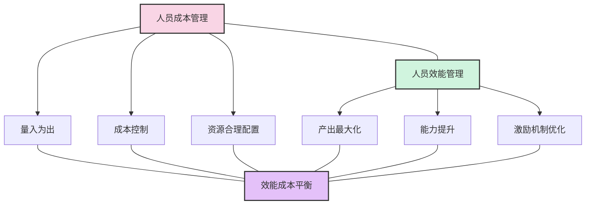
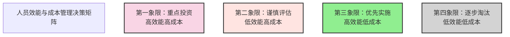

---
{"tags":["财务BP","预算规划","人员预算","人员管理","效能评估"],"aliases":["人效管理","人员产出比","人力成本效能"],"created":"2023-11-17","dg-publish":true,"permalink":"/知识共享/01_财务BP/01_学习内容/02_预算编制基础/人员预算/人员效能与成本管理/","dgPassFrontmatter":true}
---

# 人员效能与成本管理

> [!abstract] 概述
> 人员效能与成本管理是财务BP中的关键环节，旨在实现人力资源投入与产出的最优平衡。本文深入探讨人员效能的评估方法、提升策略以及与成本管理的协同关系，通过系统的效能评估与成本管控，帮助企业在保持竞争力的同时合理控制人力成本，实现人力资本价值最大化。

## 基本概念

### 人员效能的定义与内涵

**人员效能**是指员工在特定工作环境和资源条件下创造价值的能力和实际产出水平。它不仅关注工作数量，更重视工作质量和创造的经济价值。

人员效能具有多维特性：
- **投入产出比**：员工创造的价值与所消耗资源的比率
- **时间效率**：单位时间内完成的工作量或创造的价值
- **质量效能**：工作成果的质量水平和对企业价值的贡献
- **创新效能**：员工创新活动对企业发展的推动作用

### 人员效能与成本管理的关系

人员效能与成本管理是相互关联、相互促进的关系：

关键关系点：
1. **相互约束**：成本约束影响效能提升方式，效能水平决定成本投入合理性
2. **共同目标**：以最小成本实现最大产出，提高人力资本回报率
3. **平衡取舍**：在短期成本压力与长期效能提升间找到平衡
4. **系统协同**：通过系统性方法协同提升效能与优化成本

## 核心内容

### 人员效能的衡量指标

#### 通用效能指标

基础的人员效能评估指标包括：

1. **财务类指标**
   - **人均创收** = 营业收入 ÷ 员工总数
   - **人均利润** = 净利润 ÷ 员工总数
   - **人力投资回报率**(ROI) = 人力产出价值 ÷ 人力成本投入
   - **人力成本比率** = 人力总成本 ÷ 营业收入

2. **生产力指标**
   - **劳动生产率** = 产出数量 ÷ 工时投入
   - **人均产能** = 产量 ÷ 员工人数
   - **完工时间** = 实际完成时间 ÷ 标准时间
   - **产出质量率** = 合格产品数 ÷ 总产品数

3. **组织效能指标**
   - **管理幅度** = 员工数 ÷ 管理者数
   - **组织层级** = 最高层到最基层的层级数
   - **流程效率** = 增值时间 ÷ 总流程时间
   - **员工敬业度** = 敬业员工比例（通过调查测量）

#### 部门专项效能指标

不同职能部门需要特定的效能指标：

1. **销售部门**
   - 人均销售额
   - 客户转化率
   - 销售成本比率
   - 客户满意度

2. **生产部门**
   - 单位人工产出
   - 设备利用率
   - 生产周期时间
   - 返工率

3. **研发部门**
   - 研发投入产出比
   - 新产品上市速度
   - 专利数量
   - 技术创新贡献率

4. **客服部门**
   - 人均处理案例数
   - 问题解决率
   - 客户满意度
   - 服务响应时间

### 人员效能评估方法

#### 1. 数据分析法

**核心步骤**：
1. 确定评估指标体系
2. 收集相关数据
3. 应用统计分析方法
4. 形成评估结论和建议

**主要技术**：
- 描述性统计分析
- 对比分析（横向与纵向）
- 相关性与回归分析
- 趋势分析与预测

**应用案例**：某电子制造公司通过数据分析发现，在相似的生产线上，A组的人均产出比B组高30%，通过进一步分析确定是工作流程和培训方式的差异导致的效能差距。

#### 2. 基准对比法

**核心步骤**：
1. 选择适当的对标对象
2. 确定对标维度和指标
3. 收集对标数据
4. 分析差距并制定改进计划

**对标类型**：
- 内部对标：不同部门、团队之间的比较
- 行业对标：与同行业竞争对手或最佳实践比较
- 功能对标：与特定职能最优秀的企业比较

**应用案例**：某零售企业通过与行业领先企业对标，发现自己的每平方米销售额仅为对标企业的65%，人均销售额为对标企业的58%，据此制定了店面布局优化和员工培训计划。

#### 3. 价值链分析法

**核心步骤**：
1. 梳理业务价值链
2. 识别关键价值创造环节
3. 评估各环节人员效能
4. 优化资源配置和流程

**价值链视角**：
- 核心价值创造活动
- 支持性活动
- 价值链接点
- 流程效率瓶颈

**应用案例**：某服装公司通过价值链分析发现，设计师团队创造的价值远高于行政支持部门，因此调整薪酬结构，提高设计师薪资，同时精简行政流程，降低支持部门人员比例。

#### 4. 目标管理法(MBO)

**核心步骤**：
1. 设定明确可衡量的目标
2. 确定资源投入和行动计划
3. 定期跟踪目标达成情况
4. 评估结果并反馈调整

**目标设定原则**：
- SMART原则（具体、可衡量、可达成、相关性、时限性）
- 目标层级分解
- 目标与激励挂钩
- 定期审视调整

**应用案例**：某咨询公司实施MBO，要求每位顾问设定季度目标，包括收入目标、客户满意度、知识贡献等维度，并将目标完成情况与绩效奖金直接挂钩，效能提升22%。

### 人员效能提升策略

#### 组织结构优化

**核心举措**：

1. **扁平化管理**
   - 减少管理层级
   - 扩大管理幅度
   - 简化审批流程
   - 授权下放

2. **敏捷团队设置**
   - 跨职能小团队
   - 快速决策机制
   - 灵活资源配置
   - 自管理团队

3. **职能整合与共享**
   - 共享服务中心
   - 流程标准化
   - 消除职能重叠
   - 规模经济效应

**效能提升案例**：某传统制造企业将5层管理结构简化为3层，建立事业部制，将决策权下放，员工主动性提高，新产品开发周期缩短40%，管理费用降低25%。

#### 流程再造与优化

**核心举措**：

1. **业务流程再造**
   - 流程端到端梳理
   - 消除非增值环节
   - 流程并行处理
   - 责任明确化

2. **精益管理应用**
   - 消除浪费
   - 持续改进
   - 价值流分析
   - 标准作业

3. **数字化转型**
   - 流程自动化
   - 智能决策支持
   - 数据驱动管理
   - 移动办公平台

**效能提升案例**：某保险公司通过业务流程再造和RPA(机器人流程自动化)技术应用，将理赔处理时间从平均4天缩短至1天，处理人员减少40%，客户满意度提升35%。

#### 人才发展与能力提升

**核心举措**：

1. **培训与发展体系**
   - 针对性培训项目
   - 在岗学习机制
   - 导师制与教练计划
   - 职业发展通道

2. **知识管理**
   - 知识体系构建
   - 经验分享平台
   - 最佳实践推广
   - 学习型组织文化

3. **人才梯队建设**
   - 关键岗位继任计划
   - 高潜人才培养
   - 专业技术序列
   - 内部人才市场

**效能提升案例**：某高科技企业建立"技术学院"，实施系统化人才培养项目，对不同层级员工提供定制化培训，实施后研发效率提升28%，专利申请数量年增长35%。

#### 激励机制优化

**核心举措**：

1. **绩效与薪酬联动**
   - 绩效导向薪酬体系
   - 差异化奖励机制
   - 关键指标激励
   - 长短期激励结合

2. **非物质激励**
   - 职业发展机会
   - 工作环境改善
   - 认可与赞赏机制
   - 工作自主权

3. **团队激励与文化**
   - 团队绩效分享
   - 集体荣誉感
   - 协作文化建设
   - 创新激励机制

**效能提升案例**：某互联网企业实施OKR管理与灵活激励机制，将团队奖金与关键指标达成直接挂钩，同时增加非物质激励，员工满意度提升30%，关键业务指标达成率提高45%。

### 成本管理与效能平衡

#### 成本优化策略

**核心举措**：

1. **人员结构优化**
   - 核心与非核心岗位区分
   - 关键人才重点投入
   - 支持岗位精简控制
   - 岗位合并与整合

2. **薪酬结构调整**
   - 固定与浮动薪酬比例优化
   - 薪酬与价值创造挂钩
   - 福利项目效用评估
   - 长期激励优化

3. **用工模式多元化**
   - 全职与兼职组合
   - 外包与劳务派遣
   - 项目制用工
   - 自由职业者合作

**成本优化案例**：某零售连锁企业优化人员结构，将非核心岗位(如保洁、保安)实施外包，核心岗位(如买手、店长)提高薪资，同时推行兼职导购模式应对客流波峰，整体人力成本降低12%，服务质量评分提高8%。

#### 效能与成本的平衡艺术

**平衡维度**：

1. **短期与长期平衡**
   - 警惕短期成本削减带来的长期效能损失
   - 效能提升投入与成本收益分析
   - 阶段性目标与长期规划结合

2. **标准化与个性化平衡**
   - 标准化提升效率，个性化提高效果
   - 不同岗位差异化管理
   - 规模效应与专业化平衡

3. **控制与激励平衡**
   - 过度控制可能抑制创造力
   - 激励机制与成本约束相结合
   - 自主管理与标准监控结合

**决策框架**：

- **第一象限**（高效能高成本）：重点投资领域，适用于核心创新岗位
- **第二象限**（低效能高成本）：需谨慎评估，考虑优化或外包
- **第三象限**（高效能低成本）：优先实施领域，应大力推广
- **第四象限**（低效能低成本）：逐步淘汰或转型提升

## 应用方法

### 人员效能评估实施流程

#### 1. 准备阶段

- **确定评估目的**：明确评估意图（如战略调整、效能提升、成本优化等）
- **选择评估维度**：确定关注的效能维度（产出、质量、创新等）
- **设计指标体系**：建立科学合理的指标体系
- **准备数据来源**：确定数据收集渠道和方法

#### 2. 实施阶段

- **数据收集**：收集相关人员效能数据
- **数据分析**：运用统计和分析工具处理数据
- **判断标准应用**：基于行业标准或历史对比进行分析
- **结果验证**：通过多方法验证评估结果准确性

#### 3. 结果应用阶段

- **问题诊断**：识别效能差距和问题原因
- **改进方案**：制定有针对性的改进计划
- **资源分配**：根据评估结果优化资源分配
- **目标设定**：以评估结果为基础设定新目标

#### 4. 持续改进阶段

- **跟踪监控**：建立效能监控机制
- **定期评估**：定期重复评估过程
- **方法优化**：不断改进评估方法和标准
- **文化建设**：培育持续改进的组织文化

### 效能提升项目实施方法

#### 项目选择与立项

**核心步骤**：
1. 全面效能诊断
2. 机会点识别
3. 优先级判断
4. 项目目标设定

**选择工具**：
- 帕累托分析
- 投资回报评估
- 影响力-难度矩阵
- 风险评估

#### 项目实施与管理

**实施方法**：
1. **PDCA循环**（计划-执行-检查-行动）
2. **精益改善**（价值流分析、浪费消除）
3. **六西格玛**（DMAIC方法）
4. **敏捷方法**（迭代实施、快速反馈）

**管理要点**：
- 明确责任人和团队
- 制定详细实施计划
- 建立沟通反馈机制
- 资源保障与支持

#### 效果评估与固化

**评估方法**：
- 定量指标对比
- 定性反馈收集
- 投资回报分析
- 非预期效果评估

**固化措施**：
- 标准化新流程
- 修订相关政策
- 培训与能力建设
- 激励机制调整

### 数字技术在效能管理中的应用

#### 数据分析与可视化

**应用场景**：
- 效能指标实时监控
- 多维度数据分析
- 问题预警与诊断
- 决策支持可视化

**技术工具**：
- 商业智能(BI)平台
- 数据仪表板
- 预测分析模型
- 多维数据分析

#### 人力资源信息系统

**功能模块**：
- 人员配置管理
- 绩效管理
- 培训发展
- 薪酬福利管理

**效能提升点**：
- 流程自动化
- 数据集中管理
- 决策支持
- 员工自助服务

#### 先进工作管理平台

**典型应用**：
- 项目管理工具
- 协作平台
- 知识管理系统
- 工时管理系统

**效能提升点**：
- 简化协作流程
- 提高信息透明度
- 减少沟通成本
- 优化资源分配

## 案例分析

### 案例1：制造企业的人员效能提升

**背景**：
某汽车零部件制造企业面临日益激烈的市场竞争和成本压力，需要提高人员效能以保持竞争力。

**诊断与分析**：

1. **效能现状评估**：
   - 人均产出：同行业平均水平的85%
   - 直接/间接人员比：1.2:1（行业最佳实践1.8:1）
   - 管理层级：5级（行业先进企业为3级）
   - 流程效率：增值时间占比35%（行业最佳为60%）

2. **核心问题识别**：
   - 组织结构臃肿，管理层级多
   - 生产流程存在大量浪费
   - 技能标准化程度低
   - 激励机制与效能脱节

**改进方案**：

1. **组织扁平化**：
   - 将5层管理结构精简为3层
   - 扩大管理幅度，减少中层管理者30%
   - 下放决策权，建立快速响应机制

2. **精益生产实施**：
   - 全面推行价值流管理
   - 建立标准作业流程
   - 推行目视化管理
   - 实施持续改进机制

3. **技能提升项目**：
   - 建立技能矩阵和认证体系
   - 实施多能工培养计划
   - 导入TWI培训体系
   - 建立技能与薪酬挂钩机制

4. **绩效激励改革**：
   - 建立效能导向的KPI体系
   - 实施团队绩效与个人绩效结合的激励机制
   - 建立关键岗位技术专家晋升通道
   - 优化薪酬结构，提高浮动比例

**效果评估**：

实施18个月后：
- 人均产出提升28%，超过行业平均水平
- 直接/间接人员比提高到1.6:1
- 流程效率（增值时间占比）提升至55%
- 人力成本占销售收入比率下降3.5个百分点
- 员工满意度提升12%
- 关键人才流失率降低8%

**成功要素分析**：
- 高层坚定支持与全员参与相结合
- 系统性方法与重点突破相结合
- 技术手段与管理创新相结合
- 效能提升与文化建设相结合

### 案例2：服务企业的季节性人员效能管理

**背景**：
某连锁餐饮企业拥有50家门店，面临明显的季节性和时段性客流波动，传统的固定人员配置模式导致效能低下和成本浪费。

**诊断与分析**：

1. **问题分析**：
   - 高峰期（周末及节假日）：人手不足，服务质量下降
   - 淡季（工作日平日）：人员闲置，成本浪费严重
   - 全职员工占比高达90%，用工灵活性差
   - 单一固定排班模式，适应性不足

2. **数据洞察**：
   - 客流高峰与低谷时段人员需求差异达300%
   - 标准配置模式下，平均人员利用率仅为65%
   - 不同岗位对专业技能要求差异大
   - 员工技能单一，岗位调整难度高

**改进方案**：

1. **人员结构优化**：
   - 核心岗位（厨师、店长）：全职员工，占比30%
   - 基础岗位（服务员）：全职与兼职结合，占比50%
   - 辅助岗位（迎宾、清洁）：主要采用兼职，占比20%

2. **灵活用工模式**：
   - 建立"共享员工池"：在多家门店间灵活调配
   - 开发"兼职人才库"：大学生、周边社区居民等
   - 实施"旺季预警机制"：提前30天启动临时招聘
   - 引入"智能排班系统"：基于客流预测自动排班

3. **效能激励机制**：
   - 实施"多劳多得"的小时工资制
   - 建立"繁忙时段津贴"机制
   - 设计"多技能津贴"鼓励员工掌握多岗位技能
   - 推出"效能之星"评选活动，强化正向激励

4. **培训与能力建设**：
   - 开发标准化培训模块，加速新员工上岗
   - 实施"一人多岗"培训计划
   - 导入微课学习平台，碎片化学习
   - 建立导师帮带制度，加速技能传承

**效果评估**：

实施一年后：
- 人均服务客数提升35%
- 人力成本占收入比例下降4.2个百分点
- 全职/兼职比例从9:1优化为6:4
- 员工平均技能覆盖岗位数从1.2个提升至2.8个
- 客户满意度提升15%
- 关键岗位员工保留率提高20%

**关键经验总结**：
- 基于数据分析的精准人员配置
- 差异化人员结构设计
- 技术赋能的效能管理
- 灵活多样的激励机制

## 相关链接

- [[知识共享/01_财务BP/01_学习内容/02_预算编制基础/人员预算/人力资源规划与预算\|人力资源规划与预算]] - 人员效能评估是人力资源规划的重要依据
- [[知识共享/01_财务BP/01_学习内容/02_预算编制基础/人员预算/人员成本构成\|人员成本构成]] - 了解人员成本构成有助于更好地进行效能与成本平衡
- [[知识共享/01_财务BP/01_学习内容/02_预算编制基础/人员预算/人员预算的敏感性分析\|人员预算的敏感性分析]] - 人员效能变化是敏感性分析的重要变量
- [[绩效管理体系设计\|绩效管理体系设计]] - 绩效管理是提升人员效能的关键机制
- [[知识共享/01_财务BP/01_学习内容/02_预算编制基础/成本预测方法/成本结构分析\|成本结构分析]] - 人员成本分析是成本结构分析的重要组成部分
- [[精益管理\|精益管理]] - 精益理念在人员效能提升中有广泛应用

## 参考文献

1. Becker, B. E., Huselid, M. A., & Ulrich, D. (2021). *The HR Scorecard: Linking People, Strategy, and Performance*. Harvard Business Press.
2. Cascio, W. F. (2019). *Managing Human Resources: Productivity, Quality of Work Life, Profits*. McGraw-Hill Education.
3. Drucker, P. F. (2017). *The Effective Executive: The Definitive Guide to Getting the Right Things Done*. HarperBusiness.
4. Fitz-enz, J. (2020). *The ROI of Human Capital: Measuring the Economic Value of Employee Performance*. AMACOM.
5. Kaplan, R. S., & Norton, D. P. (2016). *The Balanced Scorecard: Translating Strategy into Action*. Harvard Business Press.
6. Womack, J. P., & Jones, D. T. (2013). *Lean Thinking: Banish Waste and Create Wealth in Your Corporation*. Free Press.
7. 黄卫伟. (2020). 《人力资本效能管理》. 中国人民大学出版社.
8. 郑晓明. (2019). 《人力资源管理效能评估与优化》. 北京大学出版社.
9. 张德. (2018). 《人力资源成本效益分析》. 中国财政经济出版社. 