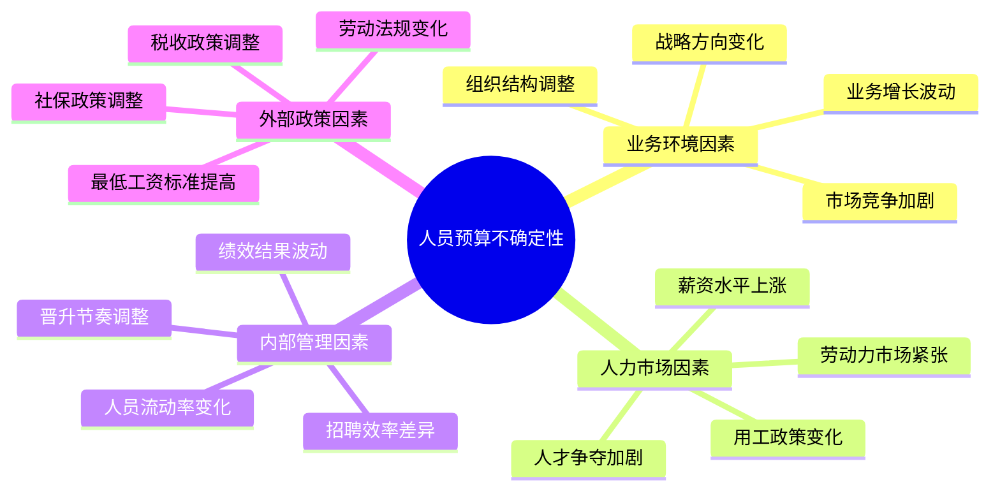

---
{"tags":["财务BP","预算规划","人员预算","敏感性分析","风险评估"],"aliases":["人力成本敏感性分析","人员预算风险分析"],"created":"2023-11-18","dg-publish":true,"permalink":"/知识共享/01_财务BP/01_学习内容/02_预算编制基础/人员预算/人员预算的敏感性分析/","dgPassFrontmatter":true}
---


# 人员预算的敏感性分析

> [!abstract] 概述
> 人员预算的敏感性分析是评估人力成本预算对各种变量变化敏感程度的系统方法，帮助企业识别关键风险因素，提前制定应对策略。本文详细介绍敏感性分析在人员预算中的应用方法、分析技术和实践案例，为企业提供科学有效的人员预算风险管理工具，增强预算的可靠性和适应性。

## 基本概念

### 敏感性分析的定义与作用

**敏感性分析**是一种通过改变关键变量的值，观察其对预算结果影响程度的分析方法。在人员预算中，敏感性分析主要用于评估人力成本预算对各种内外部因素变化的响应程度。

**核心作用**：
1. 识别对人员预算影响最大的关键变量
2. 量化不确定性因素带来的财务影响
3. 评估人员预算的稳健性和风险承受能力
4. 为制定预算调整策略和应急方案提供依据
5. 提高预算决策的科学性和预见性

### 人员预算中的不确定性因素

人员预算面临多种不确定性因素，主要来自以下几个方面：



这些不确定性因素相互影响，共同构成了人员预算风险的来源。敏感性分析可以帮助企业系统评估这些因素的影响程度，从而更有针对性地进行风险管理。

## 核心内容

### 敏感性分析的基本方法

#### 单因素敏感性分析

**方法描述**：
在保持其他变量不变的情况下，单独改变一个变量的值，观察其对预算结果的影响程度。

**应用步骤**：
1. 确定基准情景的人员预算结果
2. 识别需要分析的关键变量
3. 设定每个变量的变化范围(如±5%、±10%、±15%)
4. 计算变量变化对预算结果的影响
5. 按影响程度对变量进行排序

**敏感性指标**：
- **敏感性系数** = 预算结果变化率 ÷ 变量变化率
- **临界点** = 使预算结果达到特定阈值的变量值

**分析案例**：某公司的人员预算敏感性分析显示，人员流动率每上升1个百分点，将导致年度人员成本增加2.5%，敏感性系数为2.5，远高于其他变量。

#### 情景敏感性分析

**方法描述**：
设定不同的业务场景或假设组合，计算各种情景下的人员预算结果。

**常见情景**：
- **基准情景**：最可能出现的情况
- **乐观情景**：有利因素组合
- **悲观情景**：不利因素组合
- **极端情景**：极端不利条件下的压力测试

**应用步骤**：
1. 定义各种情景的特征和假设
2. 调整相关变量组合以反映不同情景
3. 计算不同情景下的人员预算结果
4. 分析比较各情景间的差异和影响范围

**案例示范**：某零售企业在制定年度人员预算时设计了三种情景：基准情景(销售增长10%)、乐观情景(销售增长20%)和悲观情景(销售增长5%)，相应人员预算差异达到±15%。

#### 概率敏感性分析

**方法描述**：
结合变量变化的概率分布，评估预算结果的概率分布特征。

**应用步骤**：
1. 确定关键变量的可能取值范围
2. 估计各取值的概率分布
3. 运用蒙特卡罗模拟等方法生成大量随机样本
4. 计算预算结果的期望值和方差
5. 分析预算结果的概率分布特征

**分析指标**：
- **期望值**：预算结果的加权平均值
- **标准差**：预算结果的波动程度
- **置信区间**：特定概率下的预算结果范围
- **风险值(VaR)**：特定概率下的最大损失

**应用示例**：某科技公司通过蒙特卡罗模拟，发现90%的概率下，人员成本将在基准预算的±8%范围内波动，有5%的概率超出基准预算15%以上。

### 人员预算中的关键敏感性变量

#### 业务驱动类变量

**销售/业务增长率**
- **影响机制**：直接影响人员需求规模
- **敏感性特征**：呈正相关，但通常非线性关系
- **典型敏感度**：销售增长率变化10%，人员需求变化5-8%

**客户数量/结构变化**
- **影响机制**：改变服务人员配置需求
- **敏感性特征**：不同客户类型对人员需求影响不同
- **典型敏感度**：大客户增加10%，客服人员需求增加3-5%

**产品/服务结构调整**
- **影响机制**：改变不同技能人员的需求比例
- **敏感性特征**：新产品通常需要更高的人员配置
- **典型敏感度**：新产品线收入占比每增加5%，研发人员需求增加7-10%

#### 人员流动类变量

**离职率**
- **影响机制**：影响替代招聘成本和知识传承
- **敏感性特征**：不同岗位离职率敏感度差异大
- **典型敏感度**：核心岗位离职率上升1个百分点，相关成本增加3-5%

**招聘周期**
- **影响机制**：影响空缺期人力缺口和临时用工成本
- **敏感性特征**：呈正相关，高级岗位敏感度更高
- **典型敏感度**：招聘周期延长10%，相关成本增加2-3%

**新员工效能爬坡周期**
- **影响机制**：影响新员工价值贡献和培训成本
- **敏感性特征**：技术岗位敏感度通常更高
- **典型敏感度**：爬坡期延长1个月，人均产出下降5-8%

#### 薪酬福利类变量

**薪资水平调整**
- **影响机制**：直接影响人工成本总额
- **敏感性特征**：线性关系，影响普遍
- **典型敏感度**：平均薪资上涨1%，总人工成本增加0.8-1%

**社保基数与比例**
- **影响机制**：影响法定福利成本
- **敏感性特征**：政策驱动，不可控性强
- **典型敏感度**：社保基数上限提高10%，企业缴费增加3-5%

**绩效奖金比例**
- **影响机制**：影响可变人工成本比例
- **敏感性特征**：与业绩关联，波动性大
- **典型敏感度**：业绩达成率变化10%，奖金成本变化15-20%

#### 效能与生产力变量

**人均产出**
- **影响机制**：影响单位产出的人员需求
- **敏感性特征**：与人员规模呈反比关系
- **典型敏感度**：人均效能提升10%，人员需求减少7-9%

**自动化与技术应用**
- **影响机制**：替代或增强人力资源
- **敏感性特征**：不同职能影响差异大
- **典型敏感度**：流程自动化率提高15%，相关岗位人员需求减少10-12%

**管理幅度**
- **影响机制**：影响管理层级和管理人员比例
- **敏感性特征**：组织结构依赖，非线性关系
- **典型敏感度**：管理幅度从1:8提升到1:12，管理人员减少30-35%

### 敏感性分析的实施步骤

#### 1. 变量识别与筛选

**关键步骤**：
- 全面梳理可能影响人员预算的因素
- 通过专家评估和历史数据分析初筛变量
- 确定核心变量清单和优先级
- 设定每个变量的合理变化范围

**筛选标准**：
- 影响程度：对预算结果的潜在影响大小
- 变化可能性：变量发生变化的概率
- 可控性：企业对该变量的控制能力
- 可量化性：变量影响是否易于量化

#### 2. 基准情景设定

**核心任务**：
- 确定最可能的业务场景和外部环境
- 设定各关键变量的基准值
- 建立基准情景下的完整人员预算
- 分析基准预算的结构特征和关键指标

**注意事项**：
- 基准情景应尽可能符合企业当前最佳判断
- 基准值的选取应有充分依据
- 基准预算应具备内部一致性
- 关键假设应明确记录和说明

#### 3. 单因素敏感性测试

**具体步骤**：
- 在基准预算模型中逐一调整每个关键变量
- 记录不同变量值下的预算结果变化
- 计算每个变量的敏感性系数
- 绘制敏感性曲线图表示关系

**分析技巧**：
- 采用相对变化率比较不同变量的影响
- 测试变量非线性影响特性
- 识别预算结果的拐点和临界值
- 区分短期影响和长期影响

#### 4. 多因素情景分析

**实施方法**：
- 设计3-5个代表性情景组合
- 确定每个情景下各变量的取值
- 计算不同情景下的预算结果
- 比较分析情景间的差异和范围

**情景设计要点**：
- 情景组合应具有内在一致性
- 同一情景下变量取值应相互匹配
- 情景间应有足够区分度
- 情景设计应涵盖主要风险点

#### 5. 风险评估与应对策略

**评估内容**：
- 基于敏感性分析确定主要风险点
- 评估各风险点的可能性和影响程度
- 绘制风险热力图视觉化表达风险
- 确定需要重点关注的风险因素

**应对策略制定**：
- 为高敏感度变量制定监控机制
- 设计关键风险的预警指标和阈值
- 制定应对预算偏差的调整方案
- 建立预算修正的触发机制和流程

### 敏感性分析工具与方法

#### 电子表格建模

**Excel敏感性分析功能**：
- 数据表功能：快速计算单变量或双变量敏感性
- 方案管理器：设置和比较不同情景下的预算结果
- 目标寻求：计算达到特定目标所需的变量值
- 规划求解：处理更复杂的约束条件和多变量优化

**建模技巧**：
- 清晰分离输入变量、计算逻辑和输出结果
- 构建参数表集中管理关键假设
- 使用命名区域提高公式可读性
- 设计灵活的报表便于比较不同场景

#### 统计分析方法

**回归分析**：
- 识别历史数据中变量间的相关关系
- 量化关键变量对预算结果的影响系数
- 建立预测模型估算未来变化影响
- 验证假设的合理性

**蒙特卡罗模拟**：
- 设定关键变量的概率分布
- 通过随机抽样生成大量模拟情景
- 计算预算结果的概率分布
- 分析不同置信水平下的预算区间

#### 可视化分析技术

**敏感性图表**：
- 蜘蛛图(Spider Chart)：多变量敏感性比较
- 龙卷风图(Tornado Diagram)：变量影响排序
- 散点图：分析变量间的关系
- 热力图：多维度风险可视化

**实时仪表盘**：
- 关键变量实时监控
- 预算执行偏差跟踪
- 风险预警信号显示
- 预算调整建议生成

## 应用方法

### 人员预算敏感性分析实施框架

#### 分析前准备

**组织准备**：
- 成立跨部门分析团队（财务、人力资源、业务部门）
- 明确分析目标和范围
- 确定决策流程和权责划分
- 准备必要的数据和工具

**数据准备**：
- 收集历史人员数据和成本数据
- 整理业务预测和市场趋势信息
- 准备外部基准数据和行业对标
- 评估数据质量和完整性

#### 模型构建

**预算模型设计**：
- 确定模型整体结构和计算逻辑
- 设计变量输入和假设表
- 构建人员需求预测模块
- 建立成本计算和汇总模块

**敏感性测试设置**：
- 确定要测试的变量清单
- 设定变量变化范围和步长
- 配置输出指标和结果展示
- 设计情景组合和参数集

#### 分析实施

**基础分析**：
- 单因素敏感性计算
- 变量影响排序
- 临界点识别
- 敏感性曲线绘制

**高级分析**：
- 多情景分析
- 概率模拟分析
- 压力测试
- 最优解搜索

#### 结果应用

**分析结果解读**：
- 识别关键敏感因素
- 评估预算稳健性
- 明确风险暴露点
- 判断预算灵活度

**应用策略制定**：
- 预算调整建议
- 风险应对计划
- 监控指标设定
- 预算弹性机制设计

### 实用分析技巧

#### 敏感性矩阵分析

**实施方法**：
1. 构建二维矩阵，横轴和纵轴分别代表两个关键变量
2. 计算矩阵中每个单元格(不同变量组合)下的预算结果
3. 通过颜色编码直观展示不同组合的影响程度
4. 识别高风险区域和安全区域

**应用优势**：
- 直观展示两个变量的交互影响
- 辅助识别变量组合的临界点
- 帮助管理层理解预算弹性范围
- 支持情景规划和应急预案制定

#### 概率加权预算

**实施方法**：
1. 设计多个可能的情景
2. 为每个情景分配发生概率
3. 计算每个情景下的预算结果
4. 汇总得出概率加权的预期预算值

**计算公式**：
预期预算值 = Σ(情景i的预算结果 × 情景i的发生概率)

**应用优势**：
- 考虑了不确定性的概率分布
- 提供更具统计意义的预算目标
- 有助于设定合理的预算缓冲
- 便于进行风险调整决策

#### 预算弹性区间设定

**实施方法**：
1. 基于敏感性分析确定合理的预算波动范围
2. 设定预算上限、基准值和下限
3. 制定不同区间的管理策略和应对措施
4. 建立预算调整的触发机制

**区间类型**：
- **操作区间**：正常波动范围，无需特别干预
- **警戒区间**：需关注但未到临界点，强化监控
- **行动区间**：超出可接受范围，需采取纠正措施
- **危机区间**：严重偏离，需启动应急预案

#### 关键节点监控

**实施方法**：
1. 识别预算执行过程中的关键时间节点
2. 确定每个节点需要监控的核心指标
3. 设定指标的预警阈值和容忍范围
4. 建立节点审查和调整机制

**监控节点示例**：
- **季度招聘计划前**：评估业务增长与人员需求关系
- **年中绩效评估后**：调整绩效奖金预算
- **薪酬调整周期前**：评估市场薪资变化影响
- **重大组织变革前**：分析结构调整的成本影响

## 案例分析

### 案例1：科技公司的快速扩张期人员预算分析

**背景**：
某软件开发公司计划在下一财年实施快速扩张战略，预计业务增长50%，需要大幅增加研发、销售和支持人员。

**关键不确定因素**：
- 业务增长速度可能波动
- 人才市场竞争加剧，招聘难度增加
- 薪资水平上涨压力增大
- 新员工融入与效能爬坡周期

**敏感性分析方法**：

1. **核心变量识别**：
   - 业务增长率（基准50%，范围30%-70%）
   - 市场薪资上涨率（基准10%，范围5%-20%）
   - 招聘成功率（基准80%，范围60%-90%）
   - 招聘周期（基准45天，范围30-90天）
   - 新员工效能爬坡期（基准3个月，范围2-6个月）

2. **单因素敏感性分析结果**：

| 变量 | 变化范围 | 人员成本影响 | 敏感性系数 | 临界点 |
|------|---------|------------|----------|--------|
| 业务增长率 | ±20% | ±16% | 0.8 | - |
| 市场薪资上涨率 | ±5% | ±6.5% | 1.3 | 15%(预算上限) |
| 招聘成功率 | ±10% | ±7% | 0.7 | 65%(资源极限) |
| 招聘周期 | ±15天 | ±4.5% | 0.3 | 75天(进度风险) |
| 效能爬坡期 | ±1个月 | ±9% | 2.7 | 5个月(绩效风险) |

3. **情景分析**：

| 情景 | 业务增长 | 薪资上涨 | 招聘成功率 | 招聘周期 | 效能爬坡期 | 人员成本变化 |
|------|---------|---------|-----------|---------|-----------|------------|
| 基准情景 | 50% | 10% | 80% | 45天 | 3个月 | 基准(100%) |
| 乐观情景 | 70% | 5% | 90% | 30天 | 2个月 | +15% |
| 悲观情景 | 30% | 20% | 60% | 90天 | 6个月 | +38% |
| 混合情景 | 60% | 15% | 75% | 60天 | 4个月 | +25% |

4. **关键发现**：
   - 效能爬坡期是影响最敏感的因素（敏感系数2.7）
   - 薪资上涨超过15%将突破预算上限
   - 悲观情景下人员成本增加幅度(38%)大于业务增长降幅(20%)
   - 即使业务增长不及预期，人员成本仍可能大幅增加

5. **应对策略**：
   - 分阶段招聘计划，与业务增长密切关联
   - 建立市场薪资监测机制，提前规划薪资结构调整
   - 强化培训体系，缩短新员工爬坡期
   - 设立15%的预算缓冲，应对不确定性
   - 准备替代性招聘渠道和人才库
   - 建立季度预算审查和调整机制

### 案例2：制造企业人员预算的季节性调整分析

**背景**：
某制造企业面临明显的季节性订单波动，旺季(一、四季度)产量约为淡季的1.8倍，需要合理规划人员配置和预算。

**关键不确定因素**：
- 季节性波动幅度可能加大
- 固定与临时员工比例安排
- 加班与产能扩张的平衡
- 淡季员工保留与转岗安排

**敏感性分析方法**：

1. **用工模式设计**：
   - 方案A：维持稳定人员配置，旺季通过加班满足需求
   - 方案B：核心人员(60%)+季节性人员(40%)组合
   - 方案C：最小核心团队(40%)+大规模季节工(60%)

2. **关键变量分析**：

| 变量 | 基准值 | 变化范围 | 影响机制 |
|------|--------|---------|---------|
| 季节波动比例 | 1.8 | 1.5-2.5 | 影响旺季临时用工需求 |
| 加班成本系数 | 1.5 | 1.5-2.0 | 影响旺季加班总成本 |
| 临时工效能比 | 0.7 | 0.5-0.8 | 影响所需临时工数量 |
| 招聘培训成本 | 人均5000元 | 3000-8000元 | 影响临时工总成本 |
| 淡季产能利用率 | 60% | 40%-80% | 影响固定员工效能 |

3. **情景敏感性分析结果**：

```mermaid
%%{init: {'theme': 'base', 'themeVariables': { 'primaryColor': '#d0f4de'}}}%%
bar
    title 不同用工方案的成本敏感性(±%)
    "方案A(固定人员)" : 18.5
    "方案B(混合模式)" : 11.2
    "方案C(高弹性)" : 14.8
```

| 成本影响因素 | 方案A敏感性 | 方案B敏感性 | 方案C敏感性 |
|------------|-----------|-----------|-----------|
| 季节波动加大 | 高(±15%) | 中(±8%) | 低(±5%) |
| 加班成本上升 | 高(±12%) | 中(±6%) | 低(±2%) |
| 临时工效能下降 | 无影响 | 中(±7%) | 高(±12%) |
| 招聘成本增加 | 无影响 | 中(±5%) | 高(±9%) |
| 淡季订单下滑 | 高(±10%) | 中(±6%) | 低(±3%) |

4. **成本-风险权衡分析**：

| 方案 | 年度总成本 | 成本波动性 | 质量风险 | 灵活性 | 员工稳定性 |
|------|----------|-----------|---------|-------|-----------|
| 方案A | 高(110%) | 高 | 低 | 低 | 高 |
| 方案B | 中(100%) | 中 | 中 | 中 | 中 |
| 方案C | 低(95%) | 低 | 高 | 高 | 低 |

5. **决策与实施方案**：
   - 选择方案B作为基准人员配置模式
   - 建立±15%的季节性人员预算缓冲机制
   - 制定分层次的招聘策略，优先从历史季节工中招聘
   - 实施淡季多技能培训，提高人员灵活调配能力
   - 建立预警监控系统，根据订单预测及时调整用工计划
   - 季节性工资结构设计，平衡成本和稳定性

## 相关链接

- [[知识共享/01_财务BP/01_学习内容/02_预算编制基础/人员预算/人力资源规划与预算\|人力资源规划与预算]] - 人员预算敏感性分析是人力资源规划的重要组成部分
- [[知识共享/01_财务BP/01_学习内容/02_预算编制基础/人员预算/人员成本构成\|人员成本构成]] - 了解人员成本构成有助于进行更精准的敏感性分析
- [[知识共享/01_财务BP/01_学习内容/02_预算编制基础/人员预算/人员效能与成本管理\|人员效能与成本管理]] - 人员效能是敏感性分析的重要变量
- [[知识共享/01_财务BP/01_学习内容/03_财务预测与模型/敏感性分析/敏感性分析的目的与方法\|敏感性分析的目的与方法]] - 敏感性分析的通用方法论
- [[情景分析\|情景分析]] - 与敏感性分析密切相关的预算分析方法
- [[知识共享/01_财务BP/01_学习内容/02_预算编制基础/预算编制流程/预算编制流程\|预算编制流程]] - 敏感性分析在预算编制流程中的应用

## 参考文献

1. Berk, J., & DeMarzo, P. (2020). *Corporate Finance*. Pearson.
2. Brigham, E. F., & Houston, J. F. (2019). *Fundamentals of Financial Management*. Cengage Learning.
3. Damodaran, A. (2018). *Applied Corporate Finance*. John Wiley & Sons.
4. Hope, J., & Fraser, R. (2013). *Beyond Budgeting: How Managers Can Break Free from the Annual Performance Trap*. Harvard Business Review Press.
5. Horngren, C. T., Datar, S. M., & Rajan, M. V. (2017). *Cost Accounting: A Managerial Emphasis*. Pearson.
6. 陈云. (2019). 《预算管理中的敏感性分析方法与应用》. 财务与会计, (15), 58-62.
7. 王广友. (2018). 《人力资源成本预算风险管理》. 中国人力资源开发, (8), 75-81.
8. 张维迎. (2020). 《不确定性管理:企业决策中的风险评估》. 北京大学出版社. 