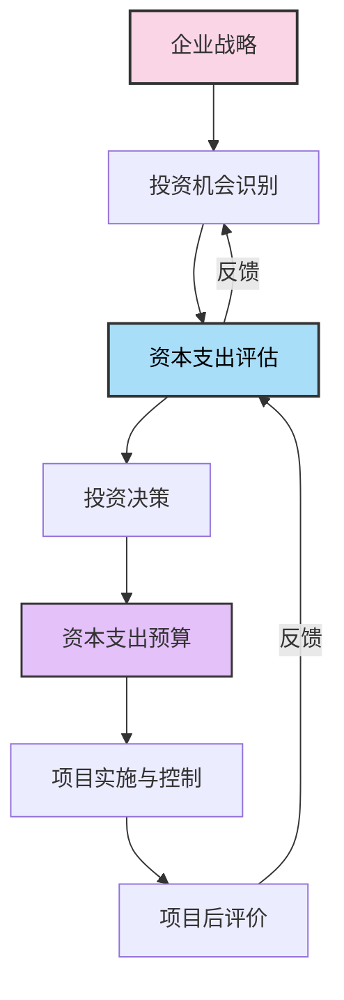
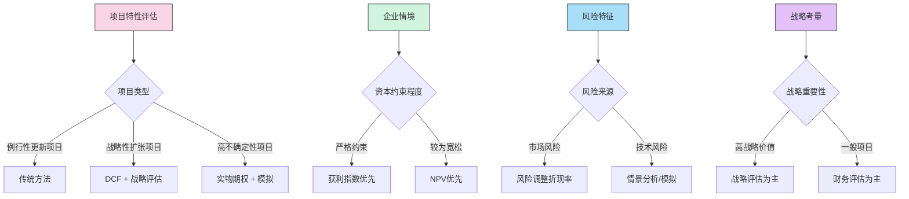

---
{"tags":["财务BP","预算规划","资本预算","评估方法","投资分析"],"aliases":["资本投资评估","投资决策方法","资本支出分析"],"created":"2023-11-18","dg-publish":true,"permalink":"/知识共享/01_财务BP/01_学习内容/02_预算编制基础/资本支出预算/资本支出评估方法/","dgPassFrontmatter":true}
---


> [!abstract] 概述
> 资本支出评估方法是企业财务BP中进行资本投资决策的核心工具集。本文系统介绍各类资本支出评估方法的原理、适用条件及实施步骤，包括传统评估方法、现金流折现法、风险调整方法及实物期权法等。通过科学的评估方法，企业能够优化资本配置，提高投资回报，降低资本风险，实现价值最大化。

## 基本概念

### 资本支出评估的定义与目标

**资本支出评估**是指企业在进行重大资本投资决策前，对投资项目的经济可行性、财务回报和风险进行系统分析和评价的过程。通过评估，企业能够合理配置有限的资本资源，选择最具价值的投资机会。

**主要目标**：
1. 确定投资项目是否能创造经济价值
2. 比较不同投资方案的相对优劣
3. 评估投资项目的风险水平及应对策略
4. 优化企业整体资本配置效率
5. 为投资决策提供科学依据

### 资本支出评估在预算中的作用

资本支出评估是资本预算过程中的关键环节，它与企业战略和财务规划紧密相连：



- **价值筛选**：筛选出能为企业创造价值的投资项目
- **资源优化**：为有限资金找到最佳配置方案
- **风险控制**：识别和评估投资风险，设计风险缓解措施
- **绩效基准**：为后续项目控制和绩效评价提供基准

## 核心内容

### 传统评估方法

#### 1. 回收期法

**基本原理**：
计算投资项目收回初始投资所需的时间。

**计算方法**：
- **不考虑货币时间价值的回收期**：
  回收期 = 初始投资额 ÷ 年平均净现金流入

- **考虑货币时间价值的折现回收期**：
  找出累计折现现金流等于初始投资的时点

**决策标准**：
- 回收期越短越好
- 当回收期小于企业设定的目标回收期时，项目可接受

**优缺点**：
- **优点**：计算简单，易于理解，关注投资回收速度
- **缺点**：忽视回收期后的现金流，不完全考虑项目全寿命周期价值

#### 2. 会计收益率法

**基本原理**：
计算投资项目的平均会计收益与平均投资额的比率。

**计算方法**：
会计收益率 = 平均年度会计净利润 ÷ 平均投资额

其中：
- 平均年度会计净利润 = 项目期内总净利润 ÷ 项目年限
- 平均投资额 = (初始投资 + 最终价值) ÷ 2

**决策标准**：
- 会计收益率越高越好
- 当会计收益率高于企业要求的最低收益率时，项目可接受

**优缺点**：
- **优点**：与会计报表衔接，计算简便
- **缺点**：基于会计利润而非现金流，忽视货币时间价值

### 现金流折现评估方法

#### 1. 净现值法(NPV)

**基本原理**：
将投资项目未来各期现金流按一定折现率折算为现值，并减去初始投资额，得出项目的净现值。

**计算公式**：
$NPV = \sum_{t=0}^{n} \frac{CF_t}{(1+r)^t}$

其中：
- $CF_t$ = t期现金流量
- r = 折现率
- n = 项目寿命期

**决策标准**：
- NPV > 0：项目可接受
- NPV < 0：项目应拒绝
- 在相互独立的项目中，选择NPV最大的项目

**优缺点**：
- **优点**：考虑货币时间价值，评估整个项目周期，理论基础扎实
- **缺点**：对折现率敏感，难以准确确定适当的折现率

#### 2. 内部收益率法(IRR)

**基本原理**：
计算使项目净现值等于零的折现率，即内部收益率。

**计算公式**：
$\sum_{t=0}^{n} \frac{CF_t}{(1+IRR)^t} = 0$

**决策标准**：
- IRR > 要求收益率：项目可接受
- IRR < 要求收益率：项目应拒绝
- 在相互独立的项目中，选择IRR最高的项目

**优缺点**：
- **优点**：结果以百分比表示，便于理解和比较
- **缺点**：可能出现多重IRR问题，不适用于非常规现金流项目，无法正确排序规模不同的项目

#### 3. 获利指数法(PI)

**基本原理**：
计算投资项目未来现金流现值与初始投资额的比率。

**计算公式**：
$PI = \frac{\sum_{t=1}^{n} \frac{CF_t}{(1+r)^t}}{I_0}$

其中：
- $I_0$ = 初始投资额

**决策标准**：
- PI > 1：项目可接受
- PI < 1：项目应拒绝
- 在相互独立的项目中，选择PI最高的项目

**优缺点**：
- **优点**：适合比较不同规模的项目，反映投资效率
- **缺点**：与NPV可能产生排序矛盾，资本约束情况下需要优化

### 风险调整评估方法

#### 1. 风险调整折现率法

**基本原理**：
根据项目风险程度调整折现率，风险越高折现率越高。

**应用方法**：
1. 估计项目基准折现率（无风险利率）
2. 评估项目特定风险溢价
3. 计算风险调整后折现率 = 基准折现率 + 风险溢价
4. 使用调整后折现率计算NPV

**优缺点**：
- **优点**：操作简便，直观反映风险与收益的关系
- **缺点**：风险溢价估计主观性强，假设风险随时间线性增长

#### 2. 确定等值法

**基本原理**：
将风险项目的预期现金流转换为确定性等值，再用无风险利率折现。

**应用方法**：
1. 估计各期现金流的风险调整系数（确定性等值系数）
2. 确定性等值 = 预期现金流 × 确定性等值系数
3. 用无风险利率折现确定性等值

**优缺点**：
- **优点**：分别处理每期现金流的风险，更精细
- **缺点**：确定性等值系数难以客观估计

#### 3. 蒙特卡罗模拟法

**基本原理**：
通过计算机模拟关键不确定变量的大量可能取值，生成项目NPV的概率分布。

**应用步骤**：
1. 识别关键不确定变量
2. 为每个变量确定概率分布
3. 进行大量随机模拟（通常为数千次）
4. 得到NPV的概率分布和统计指标
5. 基于风险偏好进行决策分析

**优缺点**：
- **优点**：全面评估风险，提供丰富的风险信息
- **缺点**：需要专业软件和技能，输入假设质量决定结果质量

### 实物期权评估方法

**基本原理**：
考虑投资项目中包含的管理灵活性和战略选择权的价值。

**常见实物期权类型**：

1. **延期期权**：推迟投资决策，观察不确定性消减
2. **退出期权**：在不利情况下终止项目的权利
3. **扩张期权**：在有利情况下扩大投资规模
4. **收缩期权**：在不利情况下缩小投资规模
5. **转换期权**：改变项目运营方式的灵活性

**评估方法**：
- 决策树分析法
- Black-Scholes期权定价模型
- 二叉树模型（Cox-Ross-Rubinstein模型）
- 蒙特卡罗模拟法

**应用价值**：
实物期权分析适用于高度不确定、管理灵活性大的项目，能捕捉传统DCF方法忽略的战略价值。

### 战略评估方法

#### 1. 平衡计分卡方法

**基本原理**：
从财务、客户、内部流程和学习成长四个维度评估资本投资的综合影响。

**评估框架**：
- **财务视角**：传统财务指标（NPV、IRR等）
- **客户视角**：市场份额、客户满意度、品牌价值
- **内部流程视角**：效率提升、能力建设、流程优化
- **学习与成长视角**：知识积累、人才发展、创新能力

#### 2. 战略适配度分析

**基本原理**：
评估投资项目与企业战略目标的契合程度，以及对企业核心竞争力的贡献。

**分析维度**：
- 与企业核心战略的一致性
- 对核心能力的强化程度
- 对竞争优势的影响
- 与其他战略举措的协同效应

## 应用方法

### 评估方法的选择框架

不同评估方法适用于不同类型的投资项目和决策情境，企业应综合考虑以下因素选择合适的评估方法：



#### 方法选择建议：

1. **基础筛选**：对所有项目使用NPV方法作为主要评估标准
2. **补充分析**：
   - 对于短期投资：增加回收期分析
   - 对于可比性项目：增加IRR和PI分析
   - 对于高风险项目：增加敏感性分析和模拟
   - 对于战略项目：增加实物期权和战略评估
3. **综合决策**：结合多种方法结果，权衡财务收益与战略价值

### 评估过程中的关键问题

#### 1. 折现率的确定

折现率是DCF方法的核心参数，通常有以下确定方式：

- **加权平均资本成本(WACC)**：
  $WACC = E/(D+E) \times R_e + D/(D+E) \times R_d \times (1-T)$
  
  其中：
  - $R_e$ = 权益资本成本
  - $R_d$ = 债务资本成本
  - E = 权益市值
  - D = 债务市值
  - T = 企业所得税率

- **资本资产定价模型(CAPM)**：
  $R_e = R_f + \beta \times (R_m - R_f)$
  
  其中：
  - $R_f$ = 无风险收益率
  - $\beta$ = 企业或项目的系统风险系数
  - $R_m$ = 市场预期收益率
  - $(R_m - R_f)$ = 市场风险溢价

- **项目特定风险调整**：
  $R_{project} = WACC + \text{项目特定风险溢价}$

#### 2. 现金流量的估计

准确的现金流估计是评估的基础，主要包括：

- **初始投资**：设备购置、安装调试、前期费用等
- **运营现金流**：
  - 营业收入：市场需求、价格、销量预测
  - 运营成本：原材料、人工、制造费用等
  - 税费：所得税、增值税等
- **营运资金变动**：库存、应收账款、应付账款等变化
- **残值/处置价值**：项目结束时的设备、厂房等的残余价值

**避免常见错误**：
- 区分增量现金流与沉没成本
- 考虑机会成本和隐含成本
- 正确处理折旧、摊销和税收影响
- 考虑通货膨胀的一致性

#### 3. 项目期限与残值确定

- **经济寿命期**：设备物理寿命、技术过时风险、市场变化等因素
- **分析期限**：通常取5-10年，超出期的价值作为残值处理
- **残值估计方法**：
  - 清算价值法：设备和资产的处置价值
  - 持续经营价值法：最后一年现金流永续增长模型
  $\text{终值} = \frac{CF_n \times (1+g)}{r-g}$
  
  其中：
  - $CF_n$ = 最后一年的现金流
  - g = 永续增长率
  - r = 折现率

## 案例分析

### 案例1：制造企业设备更新项目评估

**背景**：
某制造企业计划投资2000万元更新生产线设备，预计可提高生产效率20%，降低能耗15%，项目预计使用年限为8年。

**评估过程**：

1. **现金流预测**：

| 年份 | 初始投资 | 增量收入 | 成本节约 | 维护成本 | 税前现金流 | 所得税 | 税后现金流 |
|------|----------|----------|----------|----------|------------|--------|------------|
| 0 | -2,000 | 0 | 0 | 0 | -2,000 | 0 | -2,000 |
| 1 | 0 | 300 | 250 | -50 | 500 | 125 | 375 |
| 2 | 0 | 315 | 260 | -55 | 520 | 130 | 390 |
| 3 | 0 | 330 | 270 | -60 | 540 | 135 | 405 |
| 4 | 0 | 350 | 280 | -65 | 565 | 141 | 424 |
| 5 | 0 | 360 | 290 | -70 | 580 | 145 | 435 |
| 6 | 0 | 370 | 300 | -75 | 595 | 149 | 446 |
| 7 | 0 | 380 | 310 | -80 | 610 | 153 | 458 |
| 8 | 0 | 390 | 320 | -85 | 625+200 | 206 | 619 |

注：第8年末设备残值预计为200万元

2. **多方法评估**：

| 评估方法 | 计算结果 | 决策标准 | 决策建议 |
|----------|----------|----------|----------|
| 回收期 | 5.2年 | < 6年 | 接受 |
| NPV (10%) | 358万元 | > 0 | 接受 |
| IRR | 14.6% | > 12% | 接受 |
| PI | 1.18 | > 1 | 接受 |

3. **敏感性分析**：

```mermaid
%%{init: {'theme': 'base', 'themeVariables': { 'primaryColor': '#a9def9'}}}%%
xychart-beta
    title "参数变化对NPV的影响"
    x-axis "-20%, -15%, -10%, -5%, 0%, +5%, +10%, +15%, +20%"
    y-axis "NPV (万元)" 0 --> 600
    line [158, 208, 258, 308, 358, 408, 458, 508, 558] "增量收入"
    line [208, 233, 275, 315, 358, 390, 425, 465, 505] "成本节约"
    line [410, 395, 380, 369, 358, 340, 325, 310, 295] "折现率"
```

4. **决策建议**：
   - 项目在基本情景下NPV为正，IRR高于要求收益率
   - 即使在不利条件下，项目仍有正NPV
   - 建议接受此项目，但需要关注增量收入实现风险

### 案例2：科技企业研发投资评估

**背景**：
某技术企业计划投资5000万元开发新一代产品，投资周期3年，市场前景不确定，存在技术风险。

**评估思路**：
由于高度不确定性，采用实物期权方法结合情景分析。

1. **阶段性投资设计**：
   - 第一阶段：概念验证（1000万元）
   - 第二阶段：原型开发（1500万元）
   - 第三阶段：产品化与市场推广（2500万元）

2. **情景分析**：

| 情景 | 概率 | NPV (万元) | 特点 |
|------|------|------------|------|
| 乐观情景 | 25% | 8000 | 技术成功，市场接受度高 |
| 基本情景 | 50% | 3000 | 技术成功，市场接受度中等 |
| 悲观情景 | 25% | -1000 | 技术部分成功，市场接受度低 |
| 预期NPV | - | 3250 | 加权平均 |

3. **实物期权价值**：

| 期权类型 | 价值来源 | 估计价值(万元) |
|----------|----------|---------------|
| 延期期权 | 推迟第二、三阶段决策 | 800 |
| 放弃期权 | 第一阶段失败可终止 | 500 |
| 扩张期权 | 市场反应好时扩大投资 | 1200 |
| 收缩期权 | 市场反应差时缩小规模 | 300 |
| 总期权价值 | - | 2800 |

4. **综合分析**：
   - 传统NPV：3250万元
   - 加上期权价值：6050万元
   - 投资建议：采用阶段投资策略，保留灵活性
   - 关键监控点：第一阶段技术可行性、早期市场反馈

### 案例3：零售企业新店扩张评估

**背景**：
某零售连锁企业计划投资3000万元在新城区开设旗舰店，初期投入大，成熟期回报可观，但市场培育存在不确定性。

**评估方法**：
结合DCF和战略评估方法。

1. **财务评估**：

| 年份 | 现金流(万元) | 折现因子(12%) | 现值(万元) |
|------|-------------|--------------|-----------|
| 0 | -3000 | 1.000 | -3000 |
| 1 | -500 | 0.893 | -447 |
| 2 | 300 | 0.797 | 239 |
| 3 | 600 | 0.712 | 427 |
| 4 | 900 | 0.636 | 572 |
| 5 | 1100 | 0.567 | 624 |
| 5末终值 | 9167 | 0.567 | 5198 |
| NPV | - | - | 3613 |

终值计算：$\text{终值} = \frac{1100 \times (1+2\%)}{12\%-2\%} = 9167$万元

2. **战略评估**：

| 战略维度 | 评分(1-10) | 权重 | 加权得分 |
|----------|-----------|------|---------|
| 市场渗透率提升 | 9 | 25% | 2.25 |
| 品牌知名度提升 | 8 | 20% | 1.60 |
| 供应链优化 | 7 | 15% | 1.05 |
| 竞争策略价值 | 9 | 25% | 2.25 |
| 学习价值 | 6 | 15% | 0.90 |
| 总计 | - | 100% | 8.05 |

3. **综合决策矩阵**：


4. **决策建议**：
   - 项目财务和战略价值均高，应优先投资
   - 特别关注市场培育期的营销策略
   - 建立阶段性评估机制，根据实际表现调整资源投入

## 评估方法的整合应用

在实际决策中，应综合运用多种评估方法，形成更全面的分析框架：

1. **基础评估层**：传统财务评估（NPV、IRR、回收期）
2. **风险评估层**：敏感性分析、情景分析、蒙特卡罗模拟
3. **战略评估层**：战略适配度、平衡计分卡、实物期权分析
4. **决策整合层**：综合多维度结果，形成最终决策建议

企业应根据项目特性和决策目标，设计适当的评估框架，确保资本支出决策既符合财务纪律，又支持战略发展。

## 相关链接

- [[知识共享/01_财务BP/01_学习内容/02_预算编制基础/资本支出预算/资本支出分类\|资本支出分类]] - 详细介绍资本支出的类型和特点
- [[知识共享/01_财务BP/01_学习内容/02_预算编制基础/资本支出预算/资本支出优先级排序\|资本支出优先级排序]] - 探讨资本支出项目的优先级排序方法
- [[学习内容/预算编制基础/资本支出预算/资本支出的财务影响\|资本支出的财务影响]] - 分析资本支出对财务报表的影响
- [[知识共享/01_财务BP/01_学习内容/03_财务预测与模型/敏感性分析/敏感性分析的目的与方法\|敏感性分析的目的与方法]] - 深入了解敏感性分析在投资评估中的应用
- [[知识共享/01_财务BP/01_学习内容/05_高级分析方法/投资回报分析/净现值与内部收益率分析\|净现值与内部收益率分析]] - 详细探讨NPV和IRR分析方法

## 参考文献

1. Brealey, R. A., Myers, S. C., & Allen, F. (2020). *Principles of Corporate Finance*. McGraw-Hill Education.
2. Damodaran, A. (2012). *Investment Valuation: Tools and Techniques for Determining the Value of Any Asset*. Wiley Finance.
3. Trigeorgis, L. (1996). *Real Options: Managerial Flexibility and Strategy in Resource Allocation*. MIT Press.
4. Baker, H. K., & English, P. (2011). *Capital Budgeting Valuation: Financial Analysis for Today's Investment Projects*. Wiley Finance.
5. Peterson, P. P., & Fabozzi, F. J. (2002). *Capital Budgeting: Theory and Practice*. Wiley.
6. Pike, R., & Neale, B. (2006). *Corporate Finance and Investment: Decisions & Strategies*. Pearson Education.
7. Copeland, T., & Antikarov, V. (2003). *Real Options: A Practitioner's Guide*. Texere.
8. 张先治，吴联生. (2019). 《投资决策与资本预算》. 中国人民大学出版社.
9. 刘玉珍. (2017). 《公司理财》. 北京大学出版社.
10. 陈小悦. (2018). 《实物期权与投资决策》. 清华大学出版社. 