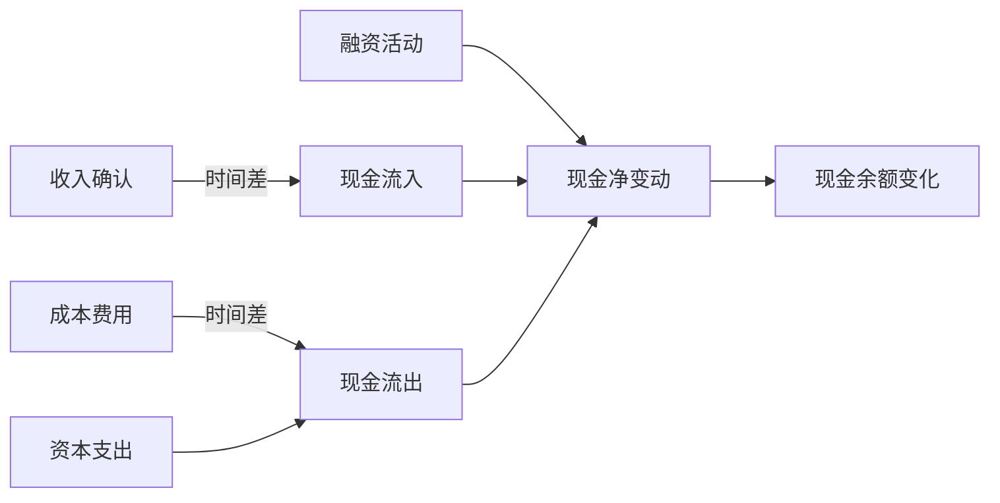

---
{"tags":["财务BP","现金流预测","流动性管理","财务预测","现金管理"],"aliases":["现金流预测价值","现金流管理重要性"],"dg-publish":true,"permalink":"/知识共享/01_财务BP/01_学习内容/03_财务预测与模型/现金流预测/现金流预测的重要性/","dgPassFrontmatter":true}
---

> [!NOTE] 概述
> 现金流预测是[[01_财务BP/01_学习内容/财务预测与模型\|01_财务BP/01_学习内容/财务预测与模型]]中的关键组成部分，对企业生存和发展至关重要。本文详细阐述现金流预测的战略意义、实际价值和应用场景，帮助财务管理者深入理解为什么现金流预测应成为财务BP的核心环节。

## 现金流预测的本质

现金流预测是对企业未来一段时间内现金流入与流出的系统性预测，与[[01_财务BP/01_学习内容/财务预测与模型/利润表预测方法\|01_财务BP/01_学习内容/财务预测与模型/利润表预测方法]]不同，它专注于实际货币资金的移动而非会计利润的确认，这种差异使得现金流预测在某些方面比利润预测更能反映企业的财务健康状况。

## 企业生存与现金流的关系

### "现金为王"原则

在财务管理中有一条基本原则："**利润是虚的，现金是实的；企业可以没有利润而生存，但不能没有现金而运转**"。

现金流预测直接关系到企业的生存能力：

- **短期偿债能力**：确保企业能按时支付供应商、员工薪资、税费等日常运营支出
- **资金链断裂风险防范**：预测现金短缺，提前采取措施避免资金链断裂
- **业务连续性保障**：确保关键业务活动不因资金短缺而中断

**案例应用**：
某快速增长的电子商务企业在2022年第一季度销售额增长了60%，利润表表现优异。然而，由于供应商付款周期缩短而客户账期延长，企业在第二季度初面临严重的现金短缺。如果事先进行严格的现金流预测，可以提前识别这一风险并采取融资措施，避免陷入被迫降价清库存的困境。

### 破产案例警示

历史上众多企业破产案例显示，即使是有盈利能力的企业，如果忽视现金流管理，也可能因短期现金流问题而陷入困境：

- W.T. Grant公司：美国零售巨头，利润丰厚但因应收账款政策不当导致现金流枯竭而破产
- 安然公司：财务造假掩盖了严重的现金流问题，最终崩盘
- 国内某知名家电连锁：过度扩张导致经营性现金流转负，最终资金链断裂

## 现金流预测的战略价值

### 1. 支持战略决策

准确的现金流预测可以支持企业的战略决策：

- **扩张决策**：评估企业的扩张计划是否有足够的现金支持
- **投资决策**：分析重大投资对现金流的影响及可承受能力
- **退出决策**：评估业务撤资的现金回收时间与价值

**案例应用**：
某制造企业计划进入新市场，投资建设新工厂。通过5年期现金流预测发现，尽管项目总体收益可观，但在第2-3年将面临约1.2亿元的累计现金缺口。基于此预测，企业调整了扩张计划，采用分阶段投资策略，并提前安排了银行授信额度，成功避免了潜在的资金危机。

### 2. 优化财务结构

现金流预测帮助企业优化整体财务结构：

- **债务规划**：根据预测的现金流量合理安排债务规模和期限结构
- **股利政策**：制定与现金生成能力相匹配的股利政策
- **营运资金管理**：确定合理的营运资金需求和融资安排

**案例应用**：
某消费品企业通过细致的季度现金流预测，发现其业务存在明显的季节性波动，第四季度现金充裕而第二季度经常现金紧张。基于这一分析，企业将原本均匀分布的债务结构调整为与现金流周期匹配的模式，减少了约25%的融资成本。

### 3. 提升企业价值

完善的现金流预测流程可直接提升企业价值：

- **降低资本成本**：稳定的现金流预测增强了投资者和债权人信心
- **优化资金使用**：减少闲置资金，提高资金使用效率
- **支持价值创造**：识别并专注于创造更多自由现金流的业务单元

**案例应用**：
某上市科技企业实施精细化现金流预测管理后，其平均现金持有量减少了20%，资金使用效率提高，同时通过与投资者更清晰地沟通未来现金流趋势，降低了市场对其财务状况的不确定性担忧，公司估值溢价提高了约15%。

## 现金流预测在不同企业发展阶段的意义

### 创业阶段

- **关注现金消耗率**：预测现金耗尽时间(Cash Runway)
- **筹资规划**：确定资金需求时间点和规模
- **生存边界识别**：明确最低生存所需的现金流入要求

**案例应用**：
某科技创业公司通过详细的现金流预测，计算出当前资金可支撑18个月运营，而产品预计需要24个月才能产生显著收入。基于这一分析，创始人提前6个月启动了新一轮融资，避免了在资金紧张情况下被迫接受不利融资条件的风险。

### 快速增长阶段

- **增长与现金的平衡**：评估增长速度与现金产生能力的匹配度
- **营运资金需求**：准确预测增长带来的营运资金需求增加
- **资金来源多元化**：规划多样化的融资渠道以支持持续增长

**案例应用**：
某电子商务平台在快速扩张阶段，发现销售额每增长1亿元需要增加约2,000万元的营运资金。通过12个月滚动现金流预测，企业精确计算了季度资金需求峰值，成功与银行洽谈了3亿元的循环信贷额度，支持了业务50%的年增长率而无需额外股权融资稀释。

### 成熟稳定阶段

- **现金回报最大化**：优化运营以产生最大自由现金流
- **资本配置**：在股利、回购、再投资之间进行最优配置
- **风险缓冲管理**：维持适当现金储备以应对行业周期波动

**案例应用**：
某成熟制造企业利用精确的现金流预测，确定了2亿元的最低运营现金需求，并制定了明确的现金分配政策：超过最低需求的部分，40%用于股利，30%用于股票回购，30%用于新业务投资，大幅提升了股东回报的可预测性。

### 转型重组阶段

- **现金流改善路径**：明确转型过程中的现金流转折点
- **资金缺口规划**：预测转型过程中的最大资金缺口
- **业务取舍决策**：基于现金流贡献评估业务保留或剥离

**案例应用**：
某传统零售企业向全渠道模式转型，通过详细的转型期现金流预测，发现线上业务在前18个月将持续耗现，累计需投入1.5亿元，第19个月开始转正。基于这一分析，企业选择了出售部分非核心物业资产筹集资金，而非进行高成本债务融资，成功渡过了转型期现金压力。

## 现金流预测在特殊场景中的应用

### 危机管理

在经济危机或行业下行周期中，现金流预测成为企业存活的关键工具：

- **压力测试**：测试极端情况下的现金流承受能力
- **现金流保障计划**：制定紧急现金保全措施
- **优先级管理**：明确关键支出的优先顺序

**案例应用**：
2020年新冠疫情爆发初期，某酒店集团立即开展了90天现金流日预测，基于"零收入"的极端情景分析，识别出关键支出项目和可延期支出，制定了严格的现金支出审批流程，并与业主协商延期支付租金，成功度过了最艰难的停业期，而同行多家企业因准备不足而陷入严重财务困境。

### 并购整合

在企业并购过程中，现金流预测起到重要作用：

- **交易可行性评估**：确保并购方有足够现金完成交易
- **整合期现金需求**：预测整合过程中的额外现金需求
- **协同效应实现路径**：预测协同效应对现金流的实际影响时间和规模

**案例应用**：
某科技公司收购竞争对手时，通过详细的现金流预测发现，尽管长期协同效应显著，但整合前12个月需要额外投入8,000万元用于系统整合、人员重组等。基于这一预测，企业调整了收购条款，将部分对价改为一年后支付，并提前与银行谈妥了过桥贷款，确保整合期资金充裕。

### 项目评估

项目投资决策中，现金流预测是核心依据：

- **项目可行性评估**：基于现金流预测计算投资回报率
- **资源分配优化**：比较不同项目的现金流特性进行优选
- **项目融资安排**：根据项目现金流特点设计合适的融资结构

**案例应用**：
某能源企业在评估两个投资机会时，传统的NPV分析显示项目A比项目B更具吸引力。但详细的现金流时序分析发现，项目A虽然总回报更高，但前三年现金流为负，累计需投入2亿元；而项目B从第一年就能产生正现金流。考虑到公司整体现金压力，最终选择了先实施项目B，两年后再启动项目A，优化了整体资金使用效率。

## 现金流预测的实现路径

要充分发挥现金流预测的价值，企业应遵循系统性实施路径：

### 预测体系建立

- **多层次预测**：建立日、周、月、季、年多层次预测体系
- **关键指标识别**：明确影响现金流的关键因素
- **情景预测**：开展基准、乐观、悲观多情景预测

**案例应用**：
某制造业企业构建了三层现金流预测体系：
1. 13周滚动日现金流预测，重点关注短期流动性
2. 12个月月度现金流预测，关注中期融资需求
3. 5年年度战略现金流预测，服务于长期战略规划
这一体系显著提升了企业现金流可视性，减少了30%的安全现金持有量。

### 技术工具应用

- **预测模型构建**：利用[[01_财务BP/01_学习内容/财务模型/Excel模型构建\|Excel]]或专业财务软件建立预测模型
- **数据整合**：将销售、采购、生产等系统数据整合到现金流预测
- **自动化提升**：提高预测流程的自动化水平，减少人工干预

**案例应用**：
某大型零售企业开发了集成化现金流预测平台，自动汇总全国300多家门店的销售预测、采购计划和费用预算，生成实时更新的集团现金流预测。该系统将预测流程从原来的7个工作日缩短到1天，准确率提高了40%。

### 组织协同

- **跨部门合作**：建立财务、销售、采购等部门的协同机制
- **责任明确**：明确各部门在现金流预测中的职责
- **绩效关联**：将现金流指标纳入绩效考核体系

**案例应用**：
某工程服务公司将现金流指标纳入各业务单元负责人的KPI，其中经营性现金流占目标权重的30%。实施一年后，公司整体应收账款周转天数减少15天，现金转换周期缩短20%，无需额外融资即支持了15%的业务增长。

## 现金流预测的常见挑战与对策

### 预测偏差

- **挑战**：现金流预测经常面临偏差，影响可靠性
- **对策**：
  - 持续分析偏差原因，改进预测方法
  - 建立预测准确度跟踪机制
  - 提高基础数据质量

**案例应用**：
某贸易企业通过对过去12个月现金流预测偏差的系统分析，发现主要问题出在客户付款时间的预测上。通过细化客户分类，针对不同类型客户采用不同的付款模型，将预测偏差从平均25%降低到10%以内。

### 信息孤岛

- **挑战**：现金流相关信息分散在各系统和部门，难以整合
- **对策**：
  - 建立统一的数据平台
  - 规范数据格式和提交流程
  - 引入数据集成工具

**案例应用**：
某集团公司通过实施财资管理系统，将分散在30多个子公司的现金流信息统一管理，实现了每日集团现金头寸的自动汇总和预测，消除了以往因信息延迟导致的低效资金调拨问题，每年节约财务成本约500万元。

### 短期偏好

- **挑战**：过度关注短期现金流而忽视长期价值创造
- **对策**：
  - 平衡短期和长期现金流指标
  - 建立长期现金流创造的评估机制
  - 培养长期现金流思维

**案例应用**：
某消费品公司曾因过度追求短期现金流而大幅削减了品牌投入和产品研发，导致市场份额逐年下滑。新管理层调整策略，建立了"当期现金流"和"未来现金流创造能力"双重评估体系，恢复了关键投入，三年后实现了市场份额和现金生成能力的双重提升。

## 小结

现金流预测不仅是技术工具，更是企业战略管理的核心要素。有效的现金流预测可以帮助企业防范风险、把握机会、优化决策、提升价值。在不确定性日益增加的商业环境中，建立系统性、前瞻性的现金流预测能力，是企业财务管理的基础能力，也是[[01_财务BP/01_学习内容/财务BP角色/财务BP的作用与目标\|财务BP]]发挥战略价值的关键支撑。

通过与[[01_财务BP/01_学习内容/财务预测与模型/现金流预测/直接法现金流预测\|01_财务BP/01_学习内容/财务预测与模型/现金流预测/直接法现金流预测]]和[[01_财务BP/01_学习内容/财务预测与模型/现金流预测/间接法现金流预测\|01_财务BP/01_学习内容/财务预测与模型/现金流预测/间接法现金流预测]]方法相结合，企业可以构建全面、准确的现金流预测体系，为战略和运营决策提供可靠依据，增强财务韧性，实现可持续发展。

## 参考文献

1. Mulford, C. W., & Comiskey, E. E. (2005). *Creative Cash Flow Reporting: Uncovering Sustainable Financial Performance*. John Wiley & Sons.
2. Fight, A. (2005). *Cash Flow Forecasting*. Butterworth-Heinemann.
3. 《企业现金流管理》，王化成，中国人民大学出版社，2018.
4. McKinsey & Company. (2016). *Valuation: Measuring and Managing the Value of Companies*. Wiley.
5. 《财务转型：从会计核算到价值创造》，德勤咨询，中信出版社，2020. 