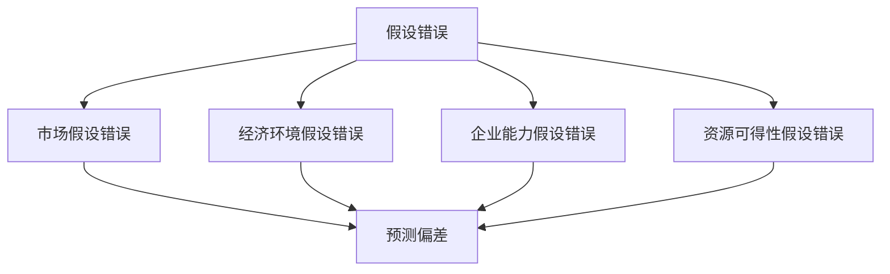
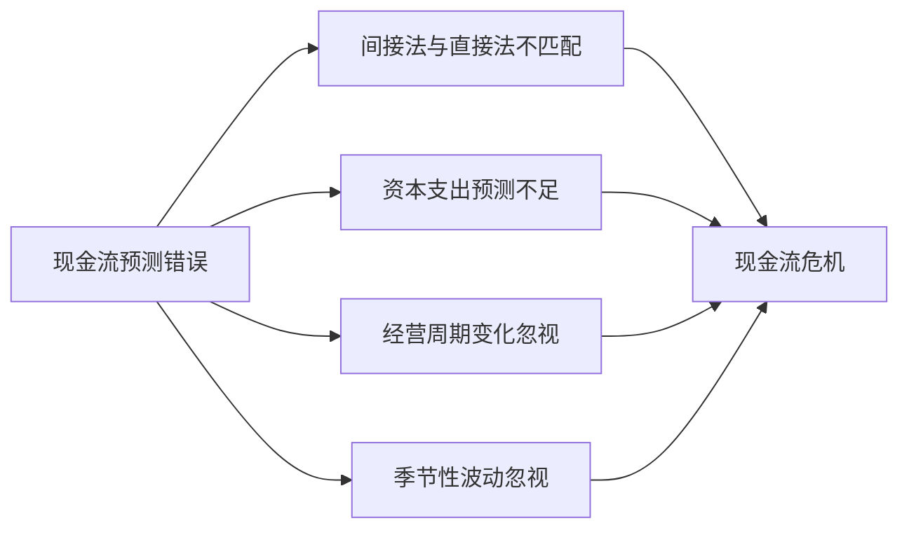
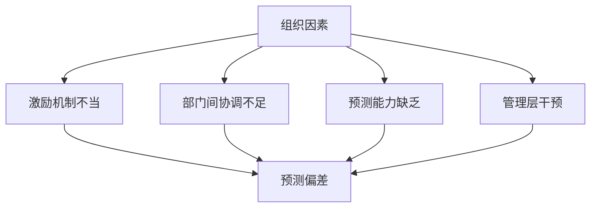
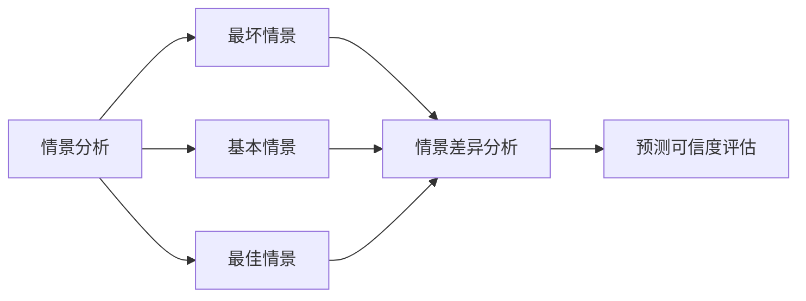
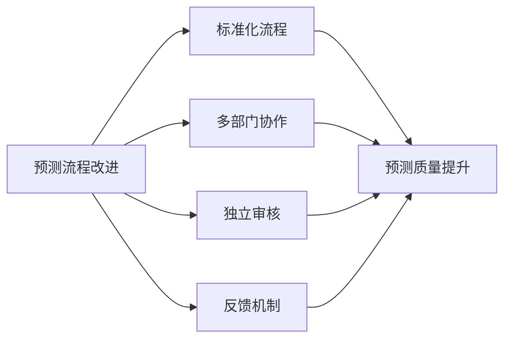

---
{"tags":["财务BP","财务预测","报表预测","预测错误","风险控制"],"aliases":"预测错误处理,财务预测陷阱","created":"2024-03-20","dg-publish":true,"permalink":"/知识共享/01_财务BP/01_学习内容/03_财务预测与模型/财务报表预测/常见预测错误及规避/","dgPassFrontmatter":true}
---

# 常见预测错误及规避

> [!abstract] 概述
> 本文档详细分析财务报表预测过程中常见的错误类型、成因及规避方法。财务报表预测因涉及诸多假设和变量，容易出现各种预测偏差和错误。通过系统识别这些常见错误并掌握相应的规避方法，可以显著提高预测的准确性和可靠性，为企业决策提供更有价值的参考。

## 一、财务预测错误的主要类型

### 1. 系统性错误
- **定义**：预测结果系统性偏离实际值，表现为持续高估或低估。
- **表现形式**：
  - 持续高估收入
  - 持续低估成本
  - 预测结果与实际有固定偏差
- **成因**：预测方法有缺陷、基本假设不合理、数据有偏差等。

### 2. 随机性错误
- **定义**：预测结果随机偏离实际值，无明显规律。
- **表现形式**：
  - 预测值有时高于实际，有时低于实际
  - 误差大小不一
  - 误差方向不确定
- **成因**：随机因素影响、市场波动、意外事件等。

### 3. 假设错误

### 4. 方法论错误
- **定义**：使用不适当的预测方法或模型。
- **表现形式**：
  - 预测结果与行业规律不符
  - 各指标间逻辑关系矛盾
  - 模型复杂度与数据不匹配
- **成因**：方法选择不当、模型构建错误、参数设置不合理等。

## 二、财务报表预测中的常见具体错误

### 1. 利润表预测常见错误
- **收入高估**：过度乐观估计市场规模和占有率
- **成本低估**：忽视通胀、规模效应限制、质量提升成本
- **费用忽略**：遗漏非经常性费用、低估费用增长率
- **线性增长假设**：忽视非线性增长特性和周期性
- **边际递减不考虑**：忽视规模增长带来的边际效益递减

### 2. 资产负债表预测常见错误
- **资产周转率误判**：未考虑行业特性与企业效率限制
- **负债结构不合理**：未充分考虑资金成本与风险
- **营运资本管理预测**：未考虑业务增长对营运资本的需求
- **资产折旧预测不准**：使用简化假设，忽视资产结构变化
- **应收账款与存货预测偏差**：未考虑市场变化与企业政策影响

### 3. 现金流量表预测常见错误

### 4. 财务比率预测错误
- **比率间逻辑矛盾**：各项财务比率之间存在逻辑不一致
- **行业特性忽视**：未充分考虑行业特定的财务特征
- **周期性因素忽略**：未考虑经济周期和行业周期
- **发展阶段考虑不足**：未根据企业发展阶段调整预测参数
- **风险因素低估**：未充分考虑可能的风险事件

## 三、财务预测错误的典型成因

### 1. 认知偏差
- **确认偏差**：只关注支持自己观点的信息
- **锚定效应**：过度依赖初始信息
- **过度自信**：高估预测准确性
- **乐观偏差**：系统性高估积极结果
- **最近事件偏差**：过度重视近期事件

### 2. 方法技术问题
- **模型选择不当**：复杂度与问题不匹配
- **参数设置错误**：关键参数设置不合理
- **历史数据不足**：可用数据量有限
- **变量选择不当**：忽略重要变量或引入无关变量
- **时间跨度不合理**：预测时间跨度过长

### 3. 组织因素

### 4. 外部环境变化
- **市场波动**：市场需求突变
- **政策变化**：法规、税收政策调整
- **技术革新**：行业技术突破
- **竞争格局变化**：新竞争者进入或现有竞争者战略调整
- **突发事件**：自然灾害、公共卫生事件等

## 四、预测错误的识别方法

### 1. 历史预测分析
- **历史准确性评估**：分析历史预测与实际差异
- **系统性偏差识别**：寻找预测中的系统性偏差
- **模式识别**：识别预测错误的时间、类型模式
- **增长率分析**：检查预测增长率是否合理

### 2. 敏感性分析
- **关键变量识别**：识别对预测结果影响最大的变量
- **敏感性测试**：测量关键变量变化对预测结果的影响
- **临界点分析**：确定导致预测结果显著变化的临界点
- **弹性系数计算**：计算预测结果对变量变化的弹性

### 3. 情景分析

### 4. 外部比对
- **行业标准比对**：与行业平均水平比较
- **竞争对手比对**：与主要竞争对手数据比较
- **历史趋势比对**：与行业历史趋势比较
- **经济周期比对**：与经济周期各阶段典型指标比较

## 五、预测错误的规避方法

### 1. 预测方法优化
- **多方法结合**：结合多种预测方法
- **方法适用性评估**：选择适合业务特点的方法
- **动态调整**：根据新信息动态调整预测方法
- **复杂度控制**：保持方法复杂度与数据量、问题性质匹配

### 2. 假设管理
- **假设明确化**：清晰列出所有假设
- **假设合理性检验**：评估假设的合理性
- **假设敏感性分析**：分析假设变化对结果的影响
- **假设更新机制**：建立假设定期更新机制

### 3. 预测流程改进

### 4. 组织能力提升
- **预测团队建设**：培养专业预测分析团队
- **技能培训**：提升预测人员专业技能
- **工具支持**：提供先进预测工具
- **文化建设**：建立尊重数据、接受不确定性的文化

## 六、案例分析

### 案例1：制造企业预测错误及改进
**背景**：某制造企业连续3年预测与实际相差30%以上，严重影响运营决策。

**主要问题**：
1. **收入预测偏高**
   - 过度乐观估计市场需求
   - 未充分考虑行业周期性
   - 忽视竞争加剧影响

2. **成本预测偏低**
   - 低估原材料价格上涨影响
   - 忽视规模扩张的边际成本增加
   - 未考虑质量提升成本

3. **资本支出预测不足**
   - 设备更新需求预测不足
   - 技术升级成本低估
   - 环保合规成本忽略

**改进措施**：
1. **预测方法改进**
   - 引入多情景预测方法
   - 建立滚动预测机制
   - 开发更细致的成本模型

2. **流程优化**
   - 建立跨部门预测团队
   - 实施预测准确性考核
   - 引入独立审核机制

3. **系统支持**
   - 升级预测分析系统
   - 构建数据仓库
   - 开发预测仪表盘

**改进效果**：
- 预测准确率提升至85%以上
- 库存控制改善，周转率提高25%
- 资本支出效率提高30%
- 现金流管理改善，资金成本降低15%

### 案例2：零售企业季节性预测问题解决
**背景**：某零售连锁企业季节性商品预测长期不准，导致库存问题和市场机会损失。

**主要问题**：
1. **季节性波动处理不当**
   - 简单使用年度平均值
   - 未考虑不同商品季节性差异
   - 节假日影响预测不足

2. **天气因素影响忽视**
   - 未考虑天气对季节性商品的影响
   - 极端天气预案缺失
   - 气候变化趋势未纳入模型

3. **促销活动扭曲**
   - 促销活动对基础需求判断干扰
   - 促销效果高估
   - 促销后销售下滑未预计

**改进措施**：
1. **季节性模型改进**
   - 开发细分商品季节模型
   - 引入天气敏感度分析
   - 建立促销效果评估模型

2. **数据精细化**
   - 提高数据收集粒度
   - 整合外部数据（天气、假日等）
   - 建立门店级别预测

3. **流程优化**
   - 建立滚动预测制度
   - 开发预测偏差预警系统
   - 实施快速响应机制

**改进效果**：
- 季节性商品预测准确率提升40%
- 缺货率降低75%
- 过季商品降价损失减少60%
- 整体库存周转率提高35%

## 七、最佳实践建议

1. **建立结构化预测流程**
   - 标准化预测步骤
   - 明确各步骤责任人
   - 设定时间节点
   - 确保流程一致性

2. **多方法交叉验证**
   - 使用多种预测方法
   - 对比不同方法结果
   - 分析差异原因
   - 综合多方法结论

3. **建立预测偏差跟踪系统**
   - 记录历史预测与实际差异
   - 分析偏差原因
   - 识别系统性偏差
   - 持续改进预测方法

4. **完善风险管理机制**
   - 识别关键风险因素
   - 设计应对预案
   - 建立预警指标
   - 定期进行压力测试

## 相关链接

- [[知识共享/01_财务BP/01_学习内容/03_财务预测与模型/财务报表预测/利润表预测方法\|利润表预测方法]]
- [[知识共享/01_财务BP/01_学习内容/03_财务预测与模型/财务报表预测/资产负债表预测方法\|资产负债表预测方法]]
- [[知识共享/01_财务BP/01_学习内容/03_财务预测与模型/财务报表预测/报表间的逻辑关系\|报表间的逻辑关系]]
- [[知识共享/01_财务BP/01_学习内容/03_财务预测与模型/敏感性分析/敏感性分析的目的与方法\|敏感性分析的目的与方法]]
- [[情景分析\|情景分析]]

## 参考文献

1. Makridakis, S., Wheelwright, S. C., & Hyndman, R. J. (2008). *Forecasting: Methods and Applications*. Wiley.
2. Brealey, R. A., Myers, S. C., & Allen, F. (2020). *Principles of Corporate Finance*. McGraw-Hill Education.
3. Damodaran, A. (2012). *Investment Valuation: Tools and Techniques for Determining the Value of Any Asset*. Wiley Finance.
4. 《财务预测与模型构建》，张明，中国财政经济出版社，2019.
5. 《企业财务预测常见错误及规避策略》，李强，财务与会计，2021.
6. 《预测分析：商业智能与数据挖掘指南》，王华，机械工业出版社，2020. 